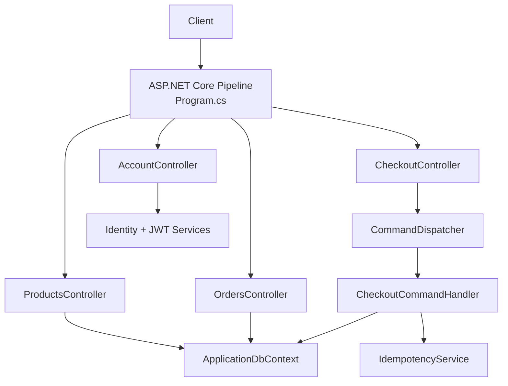
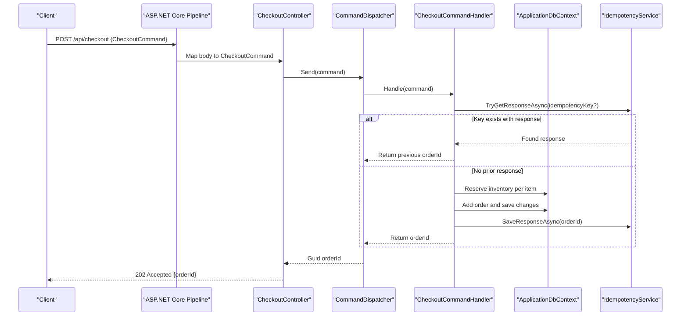
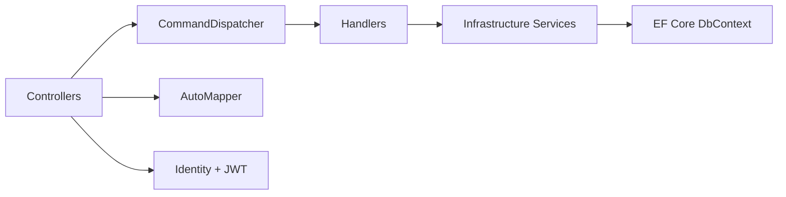
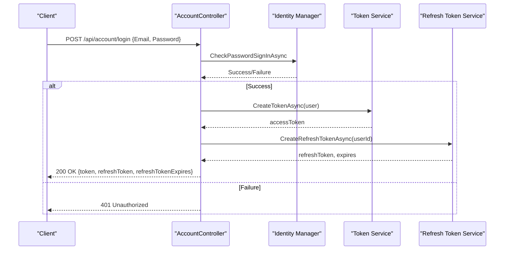

# API Layer

<cite>
**Referenced Files in This Document**
- [Program.cs](file://src/Ecommerce.Api/Program.cs)
- [ProductsController.cs](file://src/Ecommerce.Api/Controllers/ProductsController.cs)
- [OrdersController.cs](file://src/Ecommerce.Api/Controllers/OrdersController.cs)
- [CheckoutController.cs](file://src/Ecommerce.Api/Controllers/CheckoutController.cs)
- [AccountController.cs](file://src/Ecommerce.Api/Controllers/AccountController.cs)
- [appsettings.Development.json](file://src/Ecommerce.Api/appsettings.Development.json)
- [DependencyInjection.cs](file://src/Ecommerce.Infrastructure/DependencyInjection.cs)
- [CommandDispatcher.cs](file://src/Ecommerce.Application/Common/Commands/CommandDispatcher.cs)
- [CheckoutCommand.cs](file://src/Ecommerce.Application/Commands/Checkout/CheckoutCommand.cs)
- [CheckoutCommandHandler.cs](file://src/Ecommerce.Application/Commands/Checkout/CheckoutCommandHandler.cs)
- [ProductDto.cs](file://src/Ecommerce.Application/DTOs/ProductDto.cs)
- [OrderDto.cs](file://src/Ecommerce.Application/DTOs/OrderDto.cs)
- [DomainException.cs](file://src/Ecommerce.Domain/Exceptions/DomainException.cs)
</cite>

## Table of Contents
1. [Introduction](#introduction)
2. [Project Structure](#project-structure)
3. [Core Components](#core-components)
4. [Architecture Overview](#architecture-overview)
5. [Detailed Component Analysis](#detailed-component-analysis)
6. [Dependency Analysis](#dependency-analysis)
7. [Performance Considerations](#performance-considerations)
8. [Troubleshooting Guide](#troubleshooting-guide)
9. [Conclusion](#conclusion)
10. [Appendices](#appendices)

## Introduction
This document provides comprehensive API documentation for the E-Commerce Backend RESTful endpoints exposed by the ASP.NET Core application. It covers all controllers (Products, Orders, Checkout, Account), HTTP methods, URL patterns, request/response schemas, authentication and authorization requirements, middleware pipeline, configuration, error handling strategies, response formats, status codes, rate limiting considerations, input validation, request/response transformation, practical examples, and API versioning guidance.

## Project Structure
The API is implemented as an ASP.NET Core Web API with:
- Controllers under src/Ecommerce.Api/Controllers
- Application layer commands and handlers under src/Ecommerce.Application
- Infrastructure services (persistence, identity, JWT, idempotency) under src/Ecommerce.Infrastructure
- Domain entities and exceptions under src/Ecommerce.Domain
- Configuration via appsettings and dependency injection setup in Program.cs and DependencyInjection.cs

**Diagram sources**
- [Program.cs:12-74](file://src/Ecommerce.Api/Program.cs#L12-L74)
- [ProductsController.cs:13-58](file://src/Ecommerce.Api/Controllers/ProductsController.cs#L13-L58)
- [OrdersController.cs:13-50](file://src/Ecommerce.Api/Controllers/OrdersController.cs#L13-L50)
- [CheckoutController.cs:8-24](file://src/Ecommerce.Api/Controllers/CheckoutController.cs#L8-L24)
- [AccountController.cs:13-114](file://src/Ecommerce.Api/Controllers/AccountController.cs#L13-L114)
- [CommandDispatcher.cs:20-44](file://src/Ecommerce.Application/Common/Commands/CommandDispatcher.cs#L20-L44)
- [CheckoutCommandHandler.cs:22-90](file://src/Ecommerce.Application/Commands/Checkout/CheckoutCommandHandler.cs#L22-L90)
- [DependencyInjection.cs:11-85](file://src/Ecommerce.Infrastructure/DependencyInjection.cs#L11-L85)

**Section sources**
- [Program.cs:12-74](file://src/Ecommerce.Api/Program.cs#L12-L74)
- [DependencyInjection.cs:11-85](file://src/Ecommerce.Infrastructure/DependencyInjection.cs#L11-L85)

## Core Components
- ProductsController: Exposes product listing and retrieval endpoints with pagination and slug lookup. Uses AutoMapper to map domain models to ProductDto.
- OrdersController: Exposes order listing and retrieval endpoints with pagination and eager loading of order items. Maps to OrderDto.
- CheckoutController: Accepts checkout commands and dispatches them through CommandDispatcher to a handler that creates orders, reserves inventory, and supports idempotency.
- AccountController: Handles user registration, login, token refresh, revoke tokens, and retrieving current user profile. Uses ASP.NET Identity and JWT bearer authentication.

Key behaviors:
- Input validation: Controller-level parameter validation; command-level validation via pipeline behaviors when FluentValidation is available.
- Response mapping: AutoMapper maps entities to DTOs for consistent responses.
- Authentication: JWT Bearer scheme configured; some endpoints require authorization.

**Section sources**
- [ProductsController.cs:13-58](file://src/Ecommerce.Api/Controllers/ProductsController.cs#L13-L58)
- [OrdersController.cs:13-50](file://src/Ecommerce.Api/Controllers/OrdersController.cs#L13-L50)
- [CheckoutController.cs:8-24](file://src/Ecommerce.Api/Controllers/CheckoutController.cs#L8-L24)
- [AccountController.cs:13-114](file://src/Ecommerce.Api/Controllers/AccountController.cs#L13-L114)
- [ProductDto.cs:5-11](file://src/Ecommerce.Application/DTOs/ProductDto.cs#L5-L11)
- [OrderDto.cs:6-20](file://src/Ecommerce.Application/DTOs/OrderDto.cs#L6-L20)
- [CommandDispatcher.cs:20-44](file://src/Ecommerce.Application/Common/Commands/CommandDispatcher.cs#L20-L44)

## Architecture Overview
The API follows a layered architecture:
- Presentation layer: Controllers handle HTTP requests and return results.
- Application layer: Commands and handlers encapsulate business use cases, including validation and orchestration.
- Infrastructure layer: Persistence (EF Core), Identity/JWT, idempotency, and payment stubs.
- Domain layer: Entities and domain exceptions define core business rules.

**Diagram sources**
- [CheckoutController.cs:19-24](file://src/Ecommerce.Api/Controllers/CheckoutController.cs#L19-L24)
- [CommandDispatcher.cs:20-44](file://src/Ecommerce.Application/Common/Commands/CommandDispatcher.cs#L20-L44)
- [CheckoutCommandHandler.cs:22-90](file://src/Ecommerce.Application/Commands/Checkout/CheckoutCommandHandler.cs#L22-L90)

**Section sources**
- [Program.cs:63-74](file://src/Ecommerce.Api/Program.cs#L63-L74)
- [DependencyInjection.cs:27-85](file://src/Ecommerce.Infrastructure/DependencyInjection.cs#L27-L85)

## Detailed Component Analysis

### Products API
- Base route: /api/products
- Endpoints:
  - GET /api/products?page={int}&pageSize={int}
    - Purpose: List products with pagination
    - Query parameters: page (default 1), pageSize (clamped between 1 and 100)
    - Response: Array of ProductDto
    - Status codes: 200 OK
  - GET /api/products/{id:guid}
    - Purpose: Retrieve a single product by ID
    - Path parameter: id (GUID)
    - Response: ProductDto
    - Status codes: 200 OK, 404 Not Found
  - GET /api/products/slug/{slug}
    - Purpose: Retrieve a product by slug
    - Path parameter: slug (non-empty)
    - Response: ProductDto
    - Status codes: 200 OK, 400 Bad Request (empty slug), 404 Not Found

Request/Response Schemas:
- ProductDto fields: Id (Guid), Name (string), Slug (string), BasePrice (decimal)

Authentication:
- Public endpoints (no Authorization required)

Notes:
- Pagination uses skip/take on server side
- Mapping to DTOs via AutoMapper

**Section sources**
- [ProductsController.cs:26-58](file://src/Ecommerce.Api/Controllers/ProductsController.cs#L26-L58)
- [ProductDto.cs:5-11](file://src/Ecommerce.Application/DTOs/ProductDto.cs#L5-L11)

### Orders API
- Base route: /api/orders
- Endpoints:
  - GET /api/orders?page={int}&pageSize={int}
    - Purpose: List orders with pagination and include items
    - Query parameters: page (default 1), pageSize (clamped between 1 and 100)
    - Response: Array of OrderDto
    - Status codes: 200 OK
  - GET /api/orders/{id:guid}
    - Purpose: Retrieve a single order by ID with items
    - Path parameter: id (GUID)
    - Response: OrderDto
    - Status codes: 200 OK, 404 Not Found

Request/Response Schemas:
- OrderDto fields: Id (Guid), OrderNumber (string), TotalAmount (decimal), Items (list of OrderItemDto)
- OrderItemDto fields: ProductId (Guid), ProductVariantId (Guid), Quantity (int), UnitPrice (decimal)

Authentication:
- Public endpoints (no Authorization required)

Notes:
- Includes related items for richer responses
- Mapping to DTOs via AutoMapper

**Section sources**
- [OrdersController.cs:26-50](file://src/Ecommerce.Api/Controllers/OrdersController.cs#L26-L50)
- [OrderDto.cs:6-20](file://src/Ecommerce.Application/DTOs/OrderDto.cs#L6-L20)

### Checkout API
- Base route: /api/checkout
- Endpoints:
  - POST /api/checkout
    - Purpose: Place an order with optional idempotency key
    - Request body: CheckoutCommand
      - Fields: UserId (Guid), Items (list of CheckoutItem), Currency (string, default USD), ShippingAddress (string), IdempotencyKey (string)
      - CheckoutItem fields: ProductId (Guid), ProductVariantId (Guid), Quantity (int)
    - Response: { orderId }
    - Status codes: 202 Accepted
    - Notes:
      - Idempotency: If IdempotencyKey provided and previously processed, returns same orderId
      - Validates items presence; throws domain exception if empty
      - Reserves inventory per item; persists order
      - Saves response to idempotency store when key provided

Authentication:
- Public endpoint in current implementation; consider adding authorization for production

Error Handling:
- Domain exceptions result in unhandled exceptions at this stage; implement global exception handling middleware to convert to appropriate HTTP status codes

**Section sources**
- [CheckoutController.cs:19-24](file://src/Ecommerce.Api/Controllers/CheckoutController.cs#L19-L24)
- [CheckoutCommand.cs:6-20](file://src/Ecommerce.Application/Commands/Checkout/CheckoutCommand.cs#L6-L20)
- [CheckoutCommandHandler.cs:22-90](file://src/Ecommerce.Application/Commands/Checkout/CheckoutCommandHandler.cs#L22-L90)
- [DomainException.cs:5-8](file://src/Ecommerce.Domain/Exceptions/DomainException.cs#L5-L8)

### Account API
- Base route: /api/account
- Endpoints:
  - POST /api/account/register
    - Purpose: Register a new user
    - Request body: RegisterRequest { Email, Password }
    - Response: { token, refreshToken, refreshTokenExpires }
    - Status codes: 200 OK, 400 Bad Request (validation errors)
  - POST /api/account/login
    - Purpose: Authenticate and issue tokens
    - Request body: LoginRequest { Email, Password }
    - Response: { token, refreshToken, refreshTokenExpires }
    - Status codes: 200 OK, 401 Unauthorized
  - POST /api/account/refresh
    - Purpose: Refresh access token using refresh token
    - Request body: RefreshRequest { RefreshToken }
    - Response: { token, refreshToken, refreshTokenExpires }
    - Status codes: 200 OK, 400 Bad Request, 401 Unauthorized
  - POST /api/account/revoke
    - Purpose: Revoke a specific refresh token
    - Request body: RefreshRequest { RefreshToken }
    - Response: 204 No Content
    - Status codes: 204 No Content, 400 Bad Request, 404 Not Found
  - POST /api/account/revoke-all
    - Purpose: Revoke all refresh tokens for current user
    - Request body: None
    - Response: 204 No Content
    - Status codes: 204 No Content, 401 Unauthorized
  - GET /api/account/me
    - Purpose: Get current user profile
    - Response: ApplicationUserDto { Id, Email, UserName }
    - Status codes: 200 OK, 401 Unauthorized, 404 Not Found

Authentication:
- register/login/refresh are public
- revoke, revoke-all, me require Authorization (JWT Bearer)

Notes:
- JWT configuration: Issuer and signing key from configuration
- Identity integration via UserManager/SignInManager
- Token issuance and refresh handled via ITokenService and IRefreshTokenService

**Section sources**
- [AccountController.cs:34-114](file://src/Ecommerce.Api/Controllers/AccountController.cs#L34-L114)
- [Program.cs:20-50](file://src/Ecommerce.Api/Program.cs#L20-L50)
- [appsettings.Development.json:8-14](file://src/Ecommerce.Api/appsettings.Development.json#L8-L14)

## Dependency Analysis
- Controllers depend on:
  - ApplicationDbContext for data access (Products, Orders)
  - AutoMapper for DTO mapping
  - CommandDispatcher for executing commands (Checkout)
  - Identity services and JWT services for account operations
- Application layer depends on:
  - Infrastructure interfaces (IApplicationDbContext, IIdempotencyService, IPaymentService, ITokenService, IRefreshTokenService)
  - Domain entities and exceptions
- Infrastructure registers:
  - DbContext with SQL Server
  - Command dispatcher and behaviors (logging, validation)
  - Validators (FluentValidation if available)
  - AutoMapper profiles
  - Payment gateway stub
  - Idempotency service
  - Refresh token service
  - Token service (JWT)

**Diagram sources**
- [DependencyInjection.cs:11-85](file://src/Ecommerce.Infrastructure/DependencyInjection.cs#L11-L85)
- [CommandDispatcher.cs:20-44](file://src/Ecommerce.Application/Common/Commands/CommandDispatcher.cs#L20-L44)

**Section sources**
- [DependencyInjection.cs:11-85](file://src/Ecommerce.Infrastructure/DependencyInjection.cs#L11-L85)
- [Program.cs:12-74](file://src/Ecommerce.Api/Program.cs#L12-L74)

## Performance Considerations
- Use AsNoTracking for read-only queries to improve performance (applied in Products and Orders list endpoints).
- Clamp pageSize to prevent excessive payloads.
- Include only necessary related data (e.g., Orders.Items) to avoid over-fetching.
- Consider caching strategies for frequently accessed products.
- Ensure database indexes exist for commonly queried columns (e.g., Product.Slug, Order.CreatedAt).

[No sources needed since this section provides general guidance]

## Troubleshooting Guide
Common issues and resolutions:
- Missing packages:
  - Identity/JWT or FluentValidation not installed will be skipped gracefully; ensure dependencies are restored locally via setup scripts.
- Database connection:
  - Ensure DefaultConnection string points to a valid SQL Server instance.
- Validation failures:
  - When FluentValidation is present, invalid commands will be rejected by pipeline behaviors; otherwise, custom validations apply.
- Unhandled domain exceptions:
  - Implement a global exception handling middleware to translate DomainException into appropriate HTTP responses (e.g., 400 Bad Request or 422 Unprocessable Entity).
- CORS:
  - No explicit CORS policy is configured; add a named policy if cross-origin clients are required.
- Rate limiting:
  - Not configured; consider implementing rate limiting middleware for sensitive endpoints like login and checkout.

**Section sources**
- [Program.cs:20-55](file://src/Ecommerce.Api/Program.cs#L20-L55)
- [DependencyInjection.cs:35-63](file://src/Ecommerce.Infrastructure/DependencyInjection.cs#L35-L63)
- [DomainException.cs:5-8](file://src/Ecommerce.Domain/Exceptions/DomainException.cs#L5-L8)

## Conclusion
The API exposes clear, versioned routes under /api for products, orders, checkout, and account management. It leverages ASP.NET Core’s middleware pipeline for routing, authentication, and authorization, and applies a command-driven approach for complex operations like checkout with idempotency support. For production readiness, add global exception handling, CORS policies, rate limiting, and robust input validation.

[No sources needed since this section summarizes without analyzing specific files]

## Appendices

### Middleware Pipeline and Security Headers
- Pipeline order:
  - Routing
  - Authentication (JWT Bearer)
  - Authorization
  - Controllers mapped
- Development features:
  - Developer Exception Page and Swagger UI enabled in development
- Security headers:
  - Not explicitly configured; consider adding security headers via middleware in production (e.g., HSTS, CSP, X-Frame-Options)

**Section sources**
- [Program.cs:63-74](file://src/Ecommerce.Api/Program.cs#L63-L74)

### Authentication Flow (JWT)
- Registration/Login:
  - Create or authenticate user via Identity
  - Issue access token and refresh token
- Refresh:
  - Validate refresh token and issue new access token
- Revoke:
  - Revoke specific or all refresh tokens for the current user
- Protected endpoints:
  - Require Authorization header with valid JWT

**Diagram sources**
- [AccountController.cs:44-65](file://src/Ecommerce.Api/Controllers/AccountController.cs#L44-L65)
- [Program.cs:20-50](file://src/Ecommerce.Api/Program.cs#L20-L50)

### Practical Examples
- List products:
  - GET /api/products?page=1&pageSize=20
  - Expected response: Array of ProductDto
- Get product by slug:
  - GET /api/products/slug/example-product
  - Expected response: ProductDto or 404
- Place order:
  - POST /api/checkout
  - Body: { UserId, Items: [{ ProductId, ProductVariantId, Quantity }], Currency: "USD", ShippingAddress: "...", IdempotencyKey: "optional-key" }
  - Expected response: 202 Accepted { orderId }
- Login:
  - POST /api/account/login
  - Body: { Email, Password }
  - Expected response: 200 OK { token, refreshToken, refreshTokenExpires }

[No sources needed since this section provides usage examples]

### API Versioning Strategy and Backward Compatibility
- Current strategy:
  - Route prefix /api/[controller] without explicit version segment
- Recommendations:
  - Introduce versioning via URL segments (/api/v1/products) or query strings (?api-version=1)
  - Maintain backward compatibility by supporting multiple versions concurrently during transitions
  - Deprecate old versions with clear timelines and migration guides

[No sources needed since this section provides general guidance]