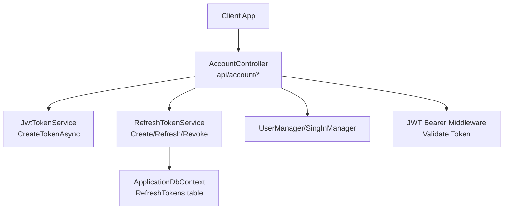
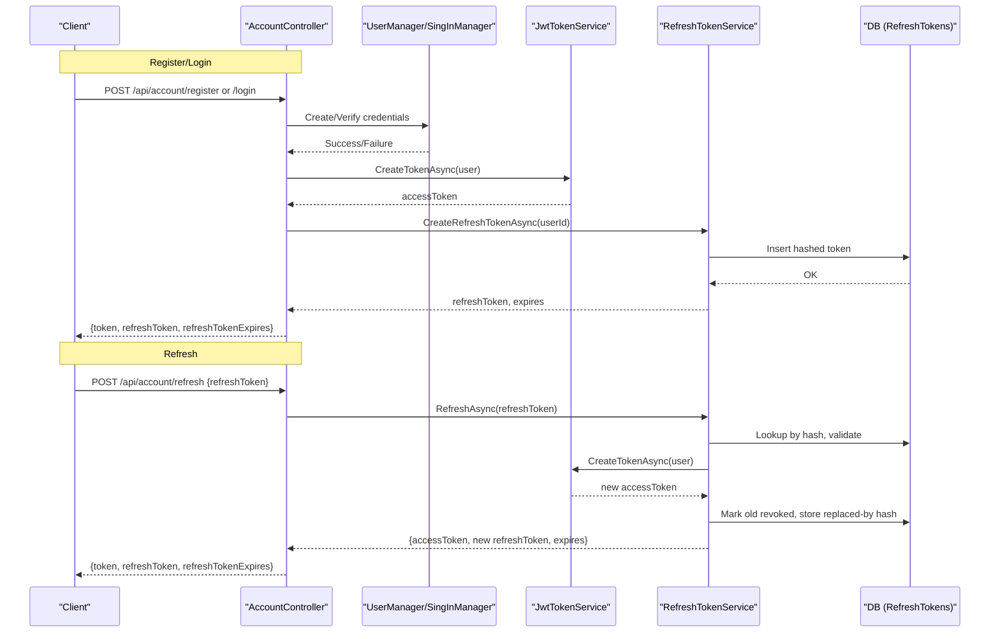
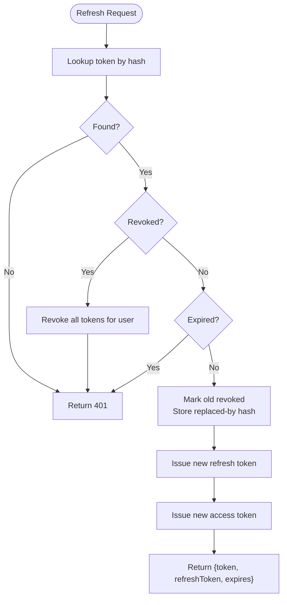
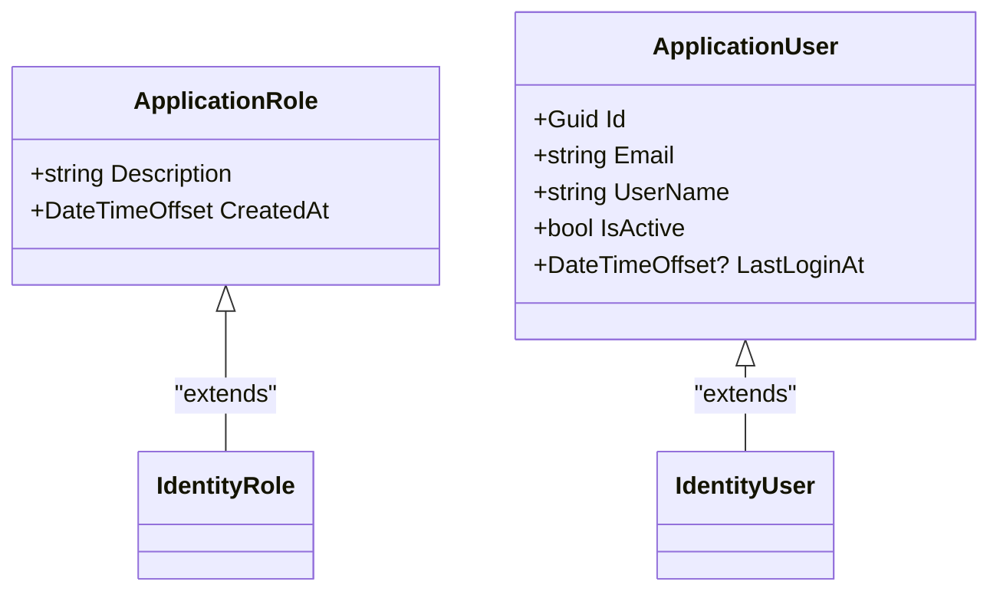
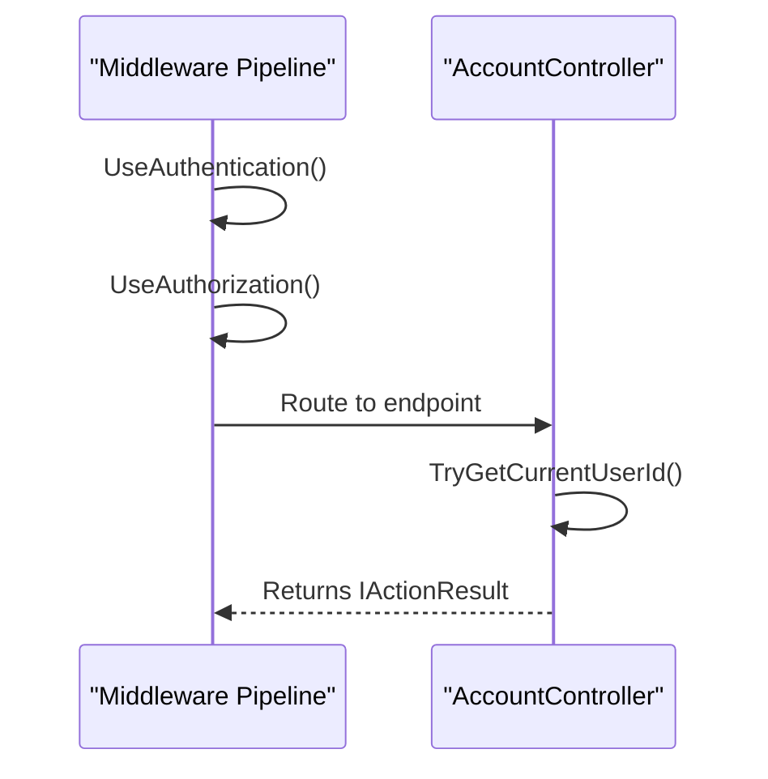
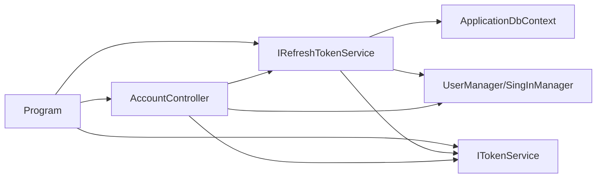

# Account API

<cite>
**Referenced Files in This Document**
- [AccountController.cs](file://src/Ecommerce.Api/Controllers/AccountController.cs)
- [JwtTokenService.cs](file://src/Ecommerce.Infrastructure/Auth/JwtTokenService.cs)
- [RefreshTokenService.cs](file://src/Ecommerce.Infrastructure/Services/RefreshTokenService.cs)
- [Program.cs](file://src/Ecommerce.Api/Program.cs)
- [DependencyInjection.cs](file://src/Ecommerce.Infrastructure/DependencyInjection.cs)
- [ApplicationUserDto.cs](file://src/Ecommerce.Application/DTOs/ApplicationUserDto.cs)
- [RefreshToken.cs](file://src/Ecommerce.Domain/Entities/RefreshToken.cs)
- [ApplicationUser.cs](file://src/Ecommerce.Infrastructure/Identity/ApplicationUser.cs)
- [ApplicationRole.cs](file://src/Ecommerce.Infrastructure/Identity/ApplicationRole.cs)
- [ITokenService.cs](file://src/Ecommerce.Application/Interfaces/ITokenService.cs)
- [IRefreshTokenService.cs](file://src/Ecommerce.Application/Interfaces/IRefreshTokenService.cs)
- [appsettings.Development.json](file://src/Ecommerce.Api/appsettings.Development.json)
</cite>

## Table of Contents
1. [Introduction](#introduction)
2. [Project Structure](#project-structure)
3. [Core Components](#core-components)
4. [Architecture Overview](#architecture-overview)
5. [Detailed Component Analysis](#detailed-component-analysis)
6. [Dependency Analysis](#dependency-analysis)
7. [Performance Considerations](#performance-considerations)
8. [Troubleshooting Guide](#troubleshooting-guide)
9. [Conclusion](#conclusion)
10. [Appendices](#appendices)

## Introduction
This document provides comprehensive API documentation for the Account controller endpoints, covering user registration, login, logout (via token revocation), profile retrieval, and refresh token handling. It explains JWT token generation, refresh token lifecycle, role-based authorization configuration, authentication middleware setup, security headers, and CORS considerations. Request/response schemas, error responses, and example flows are included to help clients integrate securely and efficiently.

## Project Structure
The Account API is implemented as an ASP.NET Core Web API with:
- Controllers in the Api layer
- Application interfaces and DTOs in the Application layer
- Infrastructure services for JWT and refresh tokens
- Domain entities for persistence models
- Program startup configuring Identity, JWT, and middleware pipeline

**Diagram sources**
- [AccountController.cs:13-114](file://src/Ecommerce.Api/Controllers/AccountController.cs#L13-L114)
- [JwtTokenService.cs:22-44](file://src/Ecommerce.Infrastructure/Auth/JwtTokenService.cs#L22-L44)
- [RefreshTokenService.cs:28-79](file://src/Ecommerce.Infrastructure/Services/RefreshTokenService.cs#L28-L79)
- [Program.cs:29-48](file://src/Ecommerce.Api/Program.cs#L29-L48)

**Section sources**
- [Program.cs:11-76](file://src/Ecommerce.Api/Program.cs#L11-L76)
- [DependencyInjection.cs:11-85](file://src/Ecommerce.Infrastructure/DependencyInjection.cs#L11-L85)

## Core Components
- AccountController: Exposes HTTP endpoints for register, login, refresh, revoke, revoke-all, and me.
- JwtTokenService: Creates signed JWT access tokens using a symmetric key and issuer configured via settings.
- RefreshTokenService: Manages refresh tokens with hashing, expiration, rotation on refresh, revocation, and cleanup.
- Identity integration: Uses ASP.NET Core Identity for user management and sign-in verification.
- Authorization: JWT Bearer scheme validates tokens; endpoints protected by [Authorize].

Key responsibilities:
- Registration creates a user and issues access + refresh tokens.
- Login authenticates and issues tokens.
- Refresh exchanges a valid refresh token for a new access token and a rotated refresh token.
- Revoke endpoints invalidate refresh tokens.
- Me returns current user profile data from the authenticated context.

**Section sources**
- [AccountController.cs:34-99](file://src/Ecommerce.Api/Controllers/AccountController.cs#L34-L99)
- [JwtTokenService.cs:22-44](file://src/Ecommerce.Infrastructure/Auth/JwtTokenService.cs#L22-L44)
- [RefreshTokenService.cs:28-99](file://src/Ecommerce.Infrastructure/Services/RefreshTokenService.cs#L28-L99)
- [Program.cs:29-50](file://src/Ecommerce.Api/Program.cs#L29-L50)

## Architecture Overview
The authentication flow combines ASP.NET Core Identity with custom JWT issuance and refresh token rotation.

**Diagram sources**
- [AccountController.cs:34-65](file://src/Ecommerce.Api/Controllers/AccountController.cs#L34-L65)
- [JwtTokenService.cs:22-44](file://src/Ecommerce.Infrastructure/Auth/JwtTokenService.cs#L22-L44)
- [RefreshTokenService.cs:28-79](file://src/Ecommerce.Infrastructure/Services/RefreshTokenService.cs#L28-L79)

## Detailed Component Analysis

### Endpoints Reference
Base path: /api/account

- POST /api/account/register
  - Purpose: Create a new user and issue tokens.
  - Request body: RegisterRequest { email, password }
  - Response: 200 OK { token, refreshToken, refreshTokenExpires }
  - Errors: 400 Bad Request (validation/user creation errors), 401 Unauthorized (if applicable)

- POST /api/account/login
  - Purpose: Authenticate user and issue tokens.
  - Request body: LoginRequest { email, password }
  - Response: 200 OK { token, refreshToken, refreshTokenExpires }
  - Errors: 401 Unauthorized (invalid credentials)

- POST /api/account/refresh
  - Purpose: Exchange a valid refresh token for a new access token and a rotated refresh token.
  - Request body: RefreshRequest { refreshToken }
  - Response: 200 OK { token, refreshToken, refreshTokenExpires }
  - Errors: 400 Bad Request (missing token), 401 Unauthorized (invalid/expired/revoked)

- POST /api/account/revoke
  - Purpose: Revoke a specific refresh token.
  - Authorization: Requires authenticated user (Bearer token).
  - Request body: RefreshRequest { refreshToken }
  - Response: 204 No Content on success, 404 Not Found if not found or inactive

- POST /api/account/revoke-all
  - Purpose: Revoke all active refresh tokens for the current user.
  - Authorization: Requires authenticated user (Bearer token).
  - Response: 204 No Content

- GET /api/account/me
  - Purpose: Retrieve current user profile.
  - Authorization: Requires authenticated user (Bearer token).
  - Response: 200 OK { id, email, userName }
  - Errors: 401 Unauthorized, 404 Not Found

Notes:
- Password reset/update endpoints are not present in this controller. Use identity features or implement dedicated endpoints if required.
- Logout is achieved by revoking refresh tokens; access tokens expire per JWT lifetime.

**Section sources**
- [AccountController.cs:34-99](file://src/Ecommerce.Api/Controllers/AccountController.cs#L34-L99)

### Data Models and Schemas

Request models
- RegisterRequest
  - email: string
  - password: string
- LoginRequest
  - email: string
  - password: string
- RefreshRequest
  - refreshToken: string

Response models
- Token response (register/login/refresh)
  - token: string (JWT access token)
  - refreshToken: string (opaque refresh token)
  - refreshTokenExpires: datetime (UTC expiration of refresh token)
- Profile response (me)
  - id: Guid
  - email: string
  - userName: string

Error responses
- 400 Bad Request: Invalid input or operation failure
- 401 Unauthorized: Authentication failed or token invalid/expired
- 404 Not Found: Resource not found (e.g., refresh token not found)

**Section sources**
- [AccountController.cs:117-132](file://src/Ecommerce.Api/Controllers/AccountController.cs#L117-L132)
- [ApplicationUserDto.cs:5-10](file://src/Ecommerce.Application/DTOs/ApplicationUserDto.cs#L5-L10)

### JWT Configuration and Validation
- Issuer and signing key are read from configuration (Jwt:Issuer, Jwt:Key).
- JWT validation parameters include issuer, audience, lifetime, and signing key checks.
- In development, HTTPS metadata requirement is disabled for convenience.

Security notes:
- Ensure Jwt:Key is strong and unique in production.
- Validate that ValidAudience matches your intended audience.
- Keep RequireHttpsMetadata true in production.

**Section sources**
- [Program.cs:26-48](file://src/Ecommerce.Api/Program.cs#L26-L48)
- [appsettings.Development.json:8-11](file://src/Ecommerce.Api/appsettings.Development.json#L8-L11)
- [JwtTokenService.cs:22-44](file://src/Ecommerce.Infrastructure/Auth/JwtTokenService.cs#L22-L44)

### Refresh Token Lifecycle and Rotation
- Creation: Generate a random token, hash it, persist with expiration (30 days).
- Refresh: Validate by hash, ensure not revoked/expired, rotate by marking old revoked and storing replaced-by hash, issue new refresh token and access token.
- Revocation: Single token or all tokens for a user can be revoked.
- Cleanup: Expired tokens can be removed periodically.

**Diagram sources**
- [RefreshTokenService.cs:50-79](file://src/Ecommerce.Infrastructure/Services/RefreshTokenService.cs#L50-L79)

**Section sources**
- [RefreshTokenService.cs:28-99](file://src/Ecommerce.Infrastructure/Services/RefreshTokenService.cs#L28-L99)
- [RefreshToken.cs:5-17](file://src/Ecommerce.Domain/Entities/RefreshToken.cs#L5-L17)

### Role-Based Authorization
- Roles are supported via ApplicationRole extending IdentityRole<Guid>.
- The authorization pipeline is enabled; endpoints protected by [Authorize] require a valid JWT.
- To enforce roles, apply [Authorize(Roles = "...")] on controllers/actions and manage roles in Identity stores.

**Diagram sources**
- [ApplicationRole.cs:6-10](file://src/Ecommerce.Infrastructure/Identity/ApplicationRole.cs#L6-L10)
- [ApplicationUser.cs:6-17](file://src/Ecommerce.Infrastructure/Identity/ApplicationUser.cs#L6-L17)

**Section sources**
- [Program.cs:22-24](file://src/Ecommerce.Api/Program.cs#L22-L24)
- [Program.cs:50-50](file://src/Ecommerce.Api/Program.cs#L50-L50)

### Authentication Middleware and Pipeline
- Authentication scheme: JWT Bearer.
- Middleware order: UseRouting -> UseAuthentication -> UseAuthorization -> MapControllers.
- Claims extraction: Sub claim used to identify current user ID in controllers.

**Diagram sources**
- [Program.cs:70-74](file://src/Ecommerce.Api/Program.cs#L70-L74)
- [AccountController.cs:109-114](file://src/Ecommerce.Api/Controllers/AccountController.cs#L109-L114)

**Section sources**
- [Program.cs:29-48](file://src/Ecommerce.Api/Program.cs#L29-L48)
- [Program.cs:70-74](file://src/Ecommerce.Api/Program.cs#L70-L74)
- [AccountController.cs:109-114](file://src/Ecommerce.Api/Controllers/AccountController.cs#L109-L114)

### Security Headers and CORS
- Security headers: Configure via middleware (e.g., HSTS, Referrer-Policy, X-Content-Type-Options) in the pipeline if needed.
- CORS: Add CORS policy and enable it in the pipeline when cross-origin requests are required.
- These are not configured in the provided files; add them in Program.cs according to your deployment needs.

[No sources needed since this section provides general guidance]

## Dependency Analysis
- AccountController depends on:
  - UserManager/SingInManager for Identity operations
  - ITokenService for JWT creation
  - IRefreshTokenService for refresh token management
- RefreshTokenService depends on:
  - ApplicationDbContext for persistence
  - ITokenService to create new access tokens during refresh
  - UserManager to resolve users by ID
- Program configures:
  - Identity with EF stores
  - JWT Bearer authentication and authorization
  - DI registrations for services

**Diagram sources**
- [AccountController.cs:17-31](file://src/Ecommerce.Api/Controllers/AccountController.cs#L17-L31)
- [RefreshTokenService.cs:17-26](file://src/Ecommerce.Infrastructure/Services/RefreshTokenService.cs#L17-L26)
- [DependencyInjection.cs:76-80](file://src/Ecommerce.Infrastructure/DependencyInjection.cs#L76-L80)
- [Program.cs:29-50](file://src/Ecommerce.Api/Program.cs#L29-L50)

**Section sources**
- [DependencyInjection.cs:76-80](file://src/Ecommerce.Infrastructure/DependencyInjection.cs#L76-L80)
- [Program.cs:29-50](file://src/Ecommerce.Api/Program.cs#L29-L50)

## Performance Considerations
- Token size: JWTs contain claims; keep payloads minimal to reduce bandwidth.
- Refresh token storage: Hashed tokens stored in DB; ensure indexes on TokenHash and UserId for fast lookups.
- Rotation overhead: Each refresh writes to DB; consider batching or background cleanup for high volume.
- Connection pooling: Ensure EF connection pool is tuned for expected load.
- Background cleanup: Use hosted service to remove expired tokens periodically.

[No sources needed since this section provides general guidance]

## Troubleshooting Guide
Common issues and resolutions:
- 401 Unauthorized on protected endpoints
  - Verify Bearer token is present and valid.
  - Check JWT issuer/audience/signing key match configuration.
  - Ensure UseAuthentication and UseAuthorization are registered before MapControllers.
- 401 on refresh
  - Confirm refresh token exists, is not revoked, and not expired.
  - Check database for token hash and revoked flags.
- 404 on revoke
  - Token may already be revoked or not exist.
- Registration failures
  - Review Identity errors returned by CreateUserAsync.
- Database connectivity
  - Validate DefaultConnection string and provider setup.

**Section sources**
- [AccountController.cs:44-65](file://src/Ecommerce.Api/Controllers/AccountController.cs#L44-L65)
- [RefreshTokenService.cs:50-99](file://src/Ecommerce.Infrastructure/Services/RefreshTokenService.cs#L50-L99)
- [Program.cs:70-74](file://src/Ecommerce.Api/Program.cs#L70-L74)

## Conclusion
The Account API provides secure user registration, login, profile retrieval, and robust refresh token management with rotation and revocation. JWT access tokens are short-lived, while refresh tokens are persisted as hashes and rotated on use. Authorization is enforced via JWT Bearer middleware. For production, ensure strong secrets, HTTPS, proper CORS, and security headers are configured.

[No sources needed since this section summarizes without analyzing specific files]

## Appendices

### Example Flows

- User registration and login flow
  - Client sends email/password to register or login.
  - Server validates via Identity, issues JWT access token and refresh token.
  - Client stores both tokens and uses access token for subsequent requests.

- Token refresh flow
  - Client sends refresh token to /api/account/refresh.
  - Server validates, rotates refresh token, issues new access token and new refresh token.
  - Client updates stored tokens accordingly.

- Session management (logout)
  - Client calls /api/account/revoke to invalidate a specific refresh token.
  - Or call /api/account/revoke-all to invalidate all sessions for the user.
  - Access tokens remain valid until expiry; rely on short TTL for security.

[No sources needed since this section provides conceptual examples]

### Security Considerations
- Password hashing: Handled by ASP.NET Core Identity; ensure strong password policies.
- Token expiration: Access tokens have short lifetimes; refresh tokens rotate and expire.
- Protection against common vulnerabilities:
  - Use HTTPS in production.
  - Validate JWT issuer, audience, lifetime, and signing key.
  - Store refresh tokens as hashes; never log or expose raw values.
  - Implement rate limiting and account lockout policies via Identity options.
  - Apply CORS only to trusted origins.
  - Add security headers (HSTS, CSP, etc.) as appropriate.

[No sources needed since this section provides general guidance]