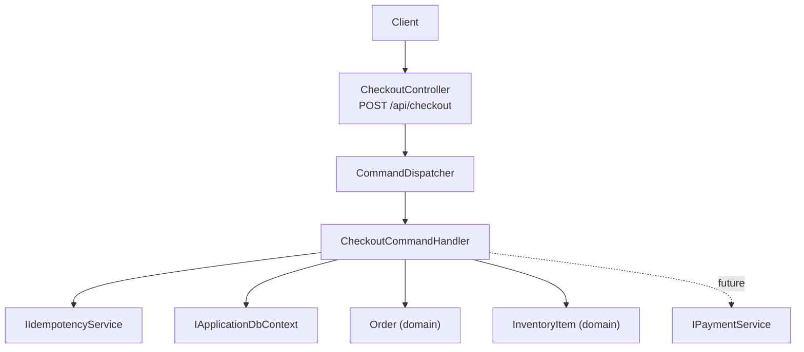
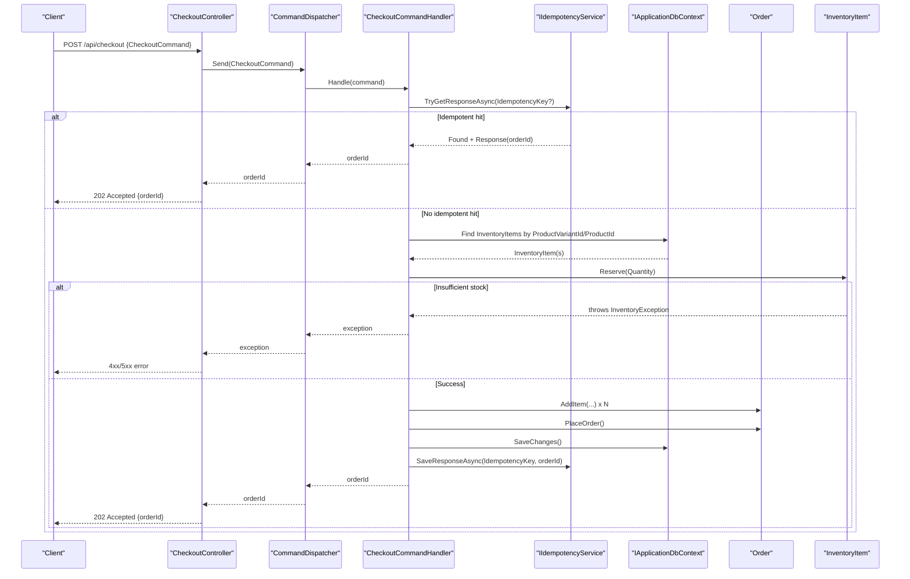
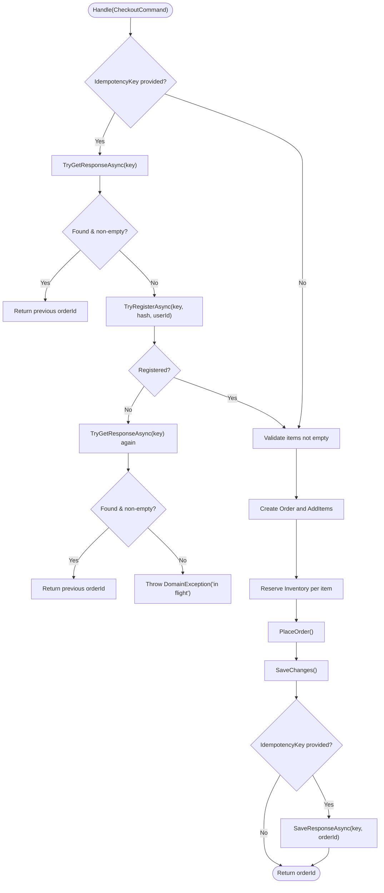
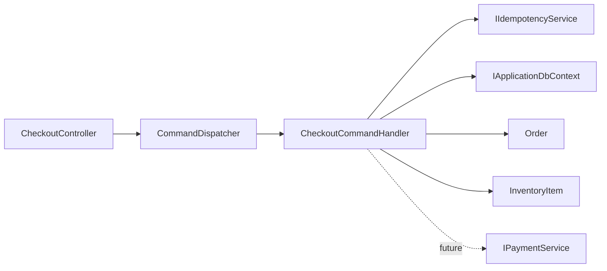

# Checkout API

<cite>
**Referenced Files in This Document**
- [CheckoutController.cs](file://src/Ecommerce.Api/Controllers/CheckoutController.cs)
- [CheckoutCommand.cs](file://src/Ecommerce.Application/Commands/Checkout/CheckoutCommand.cs)
- [CheckoutCommandHandler.cs](file://src/Ecommerce.Application/Commands/Checkout/CheckoutCommandHandler.cs)
- [CheckoutCommandValidator.cs](file://src/Ecommerce.Application/Commands/Checkout/CheckoutCommandValidator.cs)
- [CommandDispatcher.cs](file://src/Ecommerce.Application/Common/Commands/CommandDispatcher.cs)
- [Order.cs](file://src/Ecommerce.Domain/Entities/Order.cs)
- [InventoryItem.cs](file://src/Ecommerce.Domain/Entities/InventoryItem.cs)
- [IdempotencyService.cs](file://src/Ecommerce.Infrastructure/Services/IdempotencyService.cs)
- [IPaymentService.cs](file://src/Ecommerce.Application/Interfaces/IPaymentService.cs)
- [PaymentGateway.cs](file://src/Ecommerce.Infrastructure/Payments/PaymentGateway.cs)
- [DomainException.cs](file://src/Ecommerce.Domain/Exceptions/DomainException.cs)
- [InventoryException.cs](file://src/Ecommerce.Domain/Exceptions/InventoryException.cs)
</cite>

## Table of Contents
1. [Introduction](#introduction)
2. [Project Structure](#project-structure)
3. [Core Components](#core-components)
4. [Architecture Overview](#architecture-overview)
5. [Detailed Component Analysis](#detailed-component-analysis)
6. [Dependency Analysis](#dependency-analysis)
7. [Performance Considerations](#performance-considerations)
8. [Troubleshooting Guide](#troubleshooting-guide)
9. [Conclusion](#conclusion)

## Introduction
This document provides detailed API documentation for the Checkout controller endpoints and the underlying checkout process. It covers cart validation, inventory reservation, payment processing integration points, order creation, idempotency key handling, and transaction management. The implementation follows a CQRS pattern with command dispatching and handler execution. Error scenarios such as insufficient inventory, payment failures, and concurrent checkout attempts are documented with expected responses and recovery strategies.

## Project Structure
The checkout feature spans multiple layers:
- API layer exposes an HTTP endpoint that accepts a checkout command and returns an accepted response with an orderId.
- Application layer implements CQRS: commands, validators, handlers, and interfaces to external services (payment, idempotency).
- Domain layer defines entities like Order and InventoryItem with business rules and state transitions.
- Infrastructure layer provides concrete implementations for persistence (idempotency storage) and payment gateway stubs.

**Diagram sources**
- [CheckoutController.cs:19-24](file://src/Ecommerce.Api/Controllers/CheckoutController.cs#L19-L24)
- [CommandDispatcher.cs:20-43](file://src/Ecommerce.Application/Common/Commands/CommandDispatcher.cs#L20-L43)
- [CheckoutCommandHandler.cs:22-90](file://src/Ecommerce.Application/Commands/Checkout/CheckoutCommandHandler.cs#L22-L90)
- [IdempotencyService.cs:19-54](file://src/Ecommerce.Infrastructure/Services/IdempotencyService.cs#L19-L54)
- [Order.cs:36-102](file://src/Ecommerce.Domain/Entities/Order.cs#L36-L102)
- [InventoryItem.cs:29-40](file://src/Ecommerce.Domain/Entities/InventoryItem.cs#L29-L40)
- [IPaymentService.cs:5-23](file://src/Ecommerce.Application/Interfaces/IPaymentService.cs#L5-L23)

**Section sources**
- [CheckoutController.cs:1-27](file://src/Ecommerce.Api/Controllers/CheckoutController.cs#L1-L27)
- [CommandDispatcher.cs:1-47](file://src/Ecommerce.Application/Common/Commands/CommandDispatcher.cs#L1-L47)
- [CheckoutCommandHandler.cs:1-94](file://src/Ecommerce.Application/Commands/Checkout/CheckoutCommandHandler.cs#L1-L94)

## Core Components
- CheckoutController: Exposes POST /api/checkout accepting a CheckoutCommand and returning Accepted with orderId.
- CommandDispatcher: Resolves ICommandHandler<TCommand, TResult> and executes pipeline behaviors.
- CheckoutCommand: Request schema including UserId, Items, Currency, ShippingAddress, and optional IdempotencyKey.
- CheckoutCommandValidator: Validates items presence and positive quantities.
- CheckoutCommandHandler: Orchestrates idempotency checks, inventory reservation, order creation, persistence, and idempotent response storage.
- Order: Domain entity with AddItem and PlaceOrder methods enforcing business rules.
- InventoryItem: Domain entity with Reserve method enforcing stock constraints.
- IIdempotencyService: Stores and retrieves idempotency keys and responses.
- IPaymentService: Interface for payment processing; currently a stub in PaymentGateway.

**Section sources**
- [CheckoutController.cs:8-24](file://src/Ecommerce.Api/Controllers/CheckoutController.cs#L8-L24)
- [CheckoutCommand.cs:6-20](file://src/Ecommerce.Application/Commands/Checkout/CheckoutCommand.cs#L6-L20)
- [CheckoutCommandValidator.cs:6-30](file://src/Ecommerce.Application/Commands/Checkout/CheckoutCommandValidator.cs#L6-L30)
- [CheckoutCommandHandler.cs:11-90](file://src/Ecommerce.Application/Commands/Checkout/CheckoutCommandHandler.cs#L11-L90)
- [Order.cs:8-102](file://src/Ecommerce.Domain/Entities/Order.cs#L8-L102)
- [InventoryItem.cs:6-40](file://src/Ecommerce.Domain/Entities/InventoryItem.cs#L6-L40)
- [IdempotencyService.cs:10-54](file://src/Ecommerce.Infrastructure/Services/IdempotencyService.cs#L10-L54)
- [IPaymentService.cs:5-23](file://src/Ecommerce.Application/Interfaces/IPaymentService.cs#L5-L23)

## Architecture Overview
The checkout flow uses CQRS:
- The API receives a command and delegates to the dispatcher.
- The dispatcher resolves the appropriate handler and executes it within a behavior pipeline.
- The handler performs idempotency checks, validates inputs, reserves inventory, creates and persists the order, and stores the result under the idempotency key.

**Diagram sources**
- [CheckoutController.cs:19-24](file://src/Ecommerce.Api/Controllers/CheckoutController.cs#L19-L24)
- [CommandDispatcher.cs:20-43](file://src/Ecommerce.Application/Common/Commands/CommandDispatcher.cs#L20-L43)
- [CheckoutCommandHandler.cs:22-90](file://src/Ecommerce.Application/Commands/Checkout/CheckoutCommandHandler.cs#L22-L90)
- [IdempotencyService.cs:19-54](file://src/Ecommerce.Infrastructure/Services/IdempotencyService.cs#L19-L54)
- [Order.cs:36-102](file://src/Ecommerce.Domain/Entities/Order.cs#L36-L102)
- [InventoryItem.cs:29-40](file://src/Ecommerce.Domain/Entities/InventoryItem.cs#L29-L40)

## Detailed Component Analysis

### Checkout Controller Endpoint
- Method: POST
- Route: /api/checkout
- Request body: CheckoutCommand
- Response: 202 Accepted with { orderId }
- Behavior: Dispatches the command via CommandDispatcher and returns immediately after successful handling.

Request Schema: CheckoutCommand
- UserId: Guid
- Items: List of CheckoutItem
  - ProductId: Guid
  - ProductVariantId: Guid
  - Quantity: int (must be > 0)
- Currency: string (default "USD")
- ShippingAddress: string
- IdempotencyKey: string (optional)

Response Schema:
- orderId: Guid

Validation:
- At least one item required
- All item quantities must be greater than zero

Error Scenarios:
- Validation failure: 4xx (handled by validation pipeline)
- Domain errors: thrown exceptions mapped to appropriate HTTP status codes

**Section sources**
- [CheckoutController.cs:8-24](file://src/Ecommerce.Api/Controllers/CheckoutController.cs#L8-L24)
- [CheckoutCommand.cs:6-20](file://src/Ecommerce.Application/Commands/Checkout/CheckoutCommand.cs#L6-L20)
- [CheckoutCommandValidator.cs:6-30](file://src/Ecommerce.Application/Commands/Checkout/CheckoutCommandValidator.cs#L6-L30)

### Command Dispatcher and Pipeline
- Resolves ICommandHandler<TCommand, TResult> from DI
- Executes registered ICommandBehavior<TCommand, TResult> around the handler
- Logs command dispatch and completion

Pipeline behaviors include:
- ValidationBehavior: runs validators before handler execution
- LoggingBehavior: logs request/response boundaries

**Section sources**
- [CommandDispatcher.cs:20-43](file://src/Ecommerce.Application/Common/Commands/CommandDispatcher.cs#L20-L43)

### Checkout Command Handler
Responsibilities:
- Idempotency: check existing response or register attempt; handle concurrent registration conflicts
- Input validation: ensure items list is not empty
- Inventory reservation: find inventory by variant or product and reserve quantity
- Order creation: add items and place order
- Persistence: save changes
- Idempotent response storage: store orderId under idempotency key

Flow:

**Diagram sources**
- [CheckoutCommandHandler.cs:22-90](file://src/Ecommerce.Application/Commands/Checkout/CheckoutCommandHandler.cs#L22-L90)
- [IdempotencyService.cs:19-54](file://src/Ecommerce.Infrastructure/Services/IdempotencyService.cs#L19-L54)
- [Order.cs:36-102](file://src/Ecommerce.Domain/Entities/Order.cs#L36-L102)
- [InventoryItem.cs:29-40](file://src/Ecommerce.Domain/Entities/InventoryItem.cs#L29-L40)

**Section sources**
- [CheckoutCommandHandler.cs:22-90](file://src/Ecommerce.Application/Commands/Checkout/CheckoutCommandHandler.cs#L22-L90)

### Inventory Reservation Logic
- Finds inventory by ProductVariantId first; falls back to ProductId if not found
- Calls Reserve(quantity) which enforces:
  - Positive quantity
  - Sufficient available stock unless backorders allowed
- Throws InventoryException on insufficient stock

Business Rules:
- Available = QuantityOnHand - QuantityReserved
- Reserve increments QuantityReserved and updates timestamp

**Section sources**
- [CheckoutCommandHandler.cs:56-75](file://src/Ecommerce.Application/Commands/Checkout/CheckoutCommandHandler.cs#L56-L75)
- [InventoryItem.cs:29-40](file://src/Ecommerce.Domain/Entities/InventoryItem.cs#L29-L40)

### Order Creation and Totals
- Adds items with unit price, quantity, discount, tax
- Recalculates totals: subtotal, tax, discount, total amount
- PlaceOrder sets statuses and timestamps

**Section sources**
- [Order.cs:36-102](file://src/Ecommerce.Domain/Entities/Order.cs#L36-L102)

### Idempotency Key Handling
- If IdempotencyKey is present:
  - Try to get existing response; return orderId if found
  - Attempt to register the key; if conflict, try to fetch response again
  - On success, persist orderId under the key after saving order
- Prevents duplicate order creation on retries

**Section sources**
- [CheckoutCommandHandler.cs:24-44](file://src/Ecommerce.Application/Commands/Checkout/CheckoutCommandHandler.cs#L24-L44)
- [IdempotencyService.cs:19-54](file://src/Ecommerce.Infrastructure/Services/IdempotencyService.cs#L19-L54)

### Payment Processing Integration
- IPaymentService defines ProcessPaymentAsync(PaymentRequest) returning PaymentResult
- Current implementation is a stub that always succeeds
- Future integration should:
  - Accept Amount, Currency, PaymentMethod, IdempotencyKey
  - Update Order.PaymentStatus accordingly
  - Handle failures and rollbacks (e.g., release reserved inventory)

**Section sources**
- [IPaymentService.cs:5-23](file://src/Ecommerce.Application/Interfaces/IPaymentService.cs#L5-L23)
- [PaymentGateway.cs:7-23](file://src/Ecommerce.Infrastructure/Payments/PaymentGateway.cs#L7-L23)

### Transaction Management
- The handler uses DbContext to persist Order and IdempotencyKey records
- For robustness, wrap multi-step operations in a single transaction scope at the application boundary
- Ensure inventory reservations and order persistence are committed atomically

[No sources needed since this section provides general guidance]

## Dependency Analysis

**Diagram sources**
- [CheckoutController.cs:19-24](file://src/Ecommerce.Api/Controllers/CheckoutController.cs#L19-L24)
- [CommandDispatcher.cs:20-43](file://src/Ecommerce.Application/Common/Commands/CommandDispatcher.cs#L20-L43)
- [CheckoutCommandHandler.cs:22-90](file://src/Ecommerce.Application/Commands/Checkout/CheckoutCommandHandler.cs#L22-L90)
- [IdempotencyService.cs:19-54](file://src/Ecommerce.Infrastructure/Services/IdempotencyService.cs#L19-L54)
- [Order.cs:36-102](file://src/Ecommerce.Domain/Entities/Order.cs#L36-L102)
- [InventoryItem.cs:29-40](file://src/Ecommerce.Domain/Entities/InventoryItem.cs#L29-L40)
- [IPaymentService.cs:5-23](file://src/Ecommerce.Application/Interfaces/IPaymentService.cs#L5-L23)

**Section sources**
- [CheckoutController.cs:1-27](file://src/Ecommerce.Api/Controllers/CheckoutController.cs#L1-L27)
- [CommandDispatcher.cs:1-47](file://src/Ecommerce.Application/Common/Commands/CommandDispatcher.cs#L1-L47)
- [CheckoutCommandHandler.cs:1-94](file://src/Ecommerce.Application/Commands/Checkout/CheckoutCommandHandler.cs#L1-L94)

## Performance Considerations
- Use idempotency keys to avoid duplicate work and reduce load on downstream systems
- Minimize database round-trips by batching inventory lookups where possible
- Consider optimistic concurrency using RowVersion fields on Order and InventoryItem
- Keep payload small; validate early to fail fast
- Log only necessary details to avoid overhead

[No sources needed since this section provides general guidance]

## Troubleshooting Guide
Common Errors and Responses:
- Validation Failure:
  - Cause: Empty items or non-positive quantities
  - Response: 4xx (Bad Request) with validation errors
  - Source: [CheckoutCommandValidator.cs:6-30](file://src/Ecommerce.Application/Commands/Checkout/CheckoutCommandValidator.cs#L6-L30)

- Insufficient Inventory:
  - Cause: Not enough available stock to reserve requested quantity
  - Response: 4xx (Conflict/Bad Request) with domain error message
  - Source: [InventoryItem.cs:29-40](file://src/Ecommerce.Domain/Entities/InventoryItem.cs#L29-L40), [CheckoutCommandHandler.cs:56-75](file://src/Ecommerce.Application/Commands/Checkout/CheckoutCommandHandler.cs#L56-L75)

- Concurrent Checkout Attempts:
  - Cause: Idempotency key already registered by another request
  - Response: 4xx (Conflict) with domain exception indicating request in flight
  - Source: [CheckoutCommandHandler.cs:24-44](file://src/Ecommerce.Application/Commands/Checkout/CheckoutCommandHandler.cs#L24-L44)

- Payment Failures:
  - Cause: External payment provider rejects payment
  - Response: 4xx/5xx depending on provider error; consider releasing reserved inventory
  - Source: [IPaymentService.cs:5-23](file://src/Ecommerce.Application/Interfaces/IPaymentService.cs#L5-L23)

- Domain Exceptions:
  - Base class for domain-level errors; map to appropriate HTTP status codes
  - Source: [DomainException.cs:1-10](file://src/Ecommerce.Domain/Exceptions/DomainException.cs#L1-L10), [InventoryException.cs:1-10](file://src/Ecommerce.Domain/Exceptions/InventoryException.cs#L1-L10)

Recovery Strategies:
- Retry with same IdempotencyKey to receive the original orderId
- Release reserved inventory on payment failure
- Implement retry with exponential backoff for transient network errors

**Section sources**
- [CheckoutCommandValidator.cs:6-30](file://src/Ecommerce.Application/Commands/Checkout/CheckoutCommandValidator.cs#L6-L30)
- [InventoryItem.cs:29-40](file://src/Ecommerce.Domain/Entities/InventoryItem.cs#L29-L40)
- [CheckoutCommandHandler.cs:24-44](file://src/Ecommerce.Application/Commands/Checkout/CheckoutCommandHandler.cs#L24-L44)
- [IPaymentService.cs:5-23](file://src/Ecommerce.Application/Interfaces/IPaymentService.cs#L5-L23)
- [DomainException.cs:1-10](file://src/Ecommerce.Domain/Exceptions/DomainException.cs#L1-L10)
- [InventoryException.cs:1-10](file://src/Ecommerce.Domain/Exceptions/InventoryException.cs#L1-L10)

## Conclusion
The Checkout API implements a robust CQRS-based workflow with idempotency support, inventory reservation, and order creation. While payment processing is currently a stub, the interface allows seamless integration with real providers. Proper error handling and idempotency ensure safe retries and prevent duplicate orders. Extending the handler to include payment confirmation and rollback logic will complete the end-to-end checkout flow.

[No sources needed since this section summarizes without analyzing specific files]