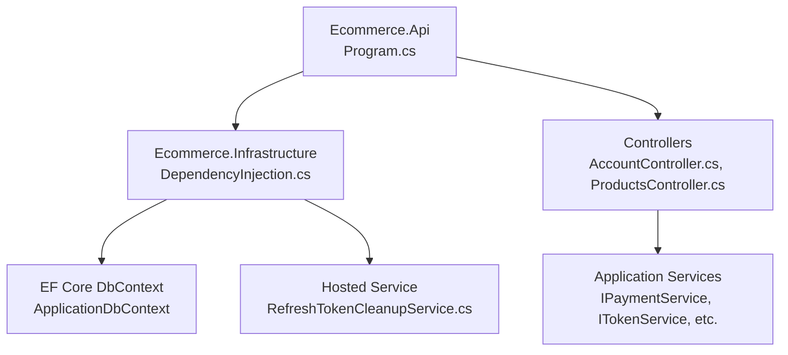
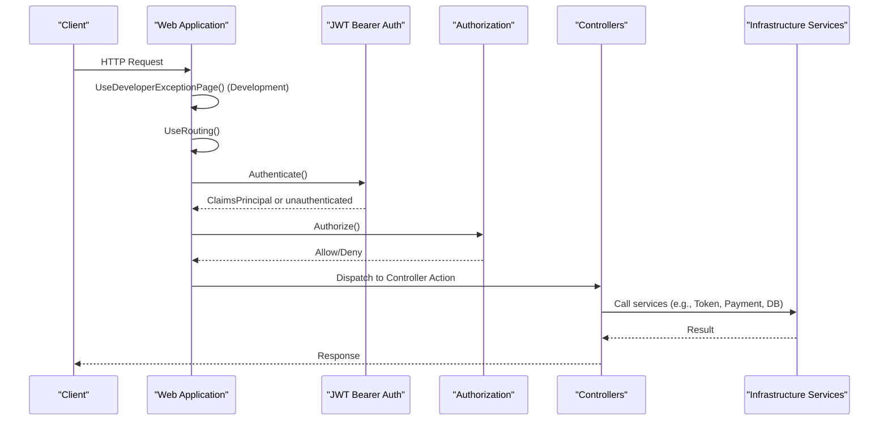
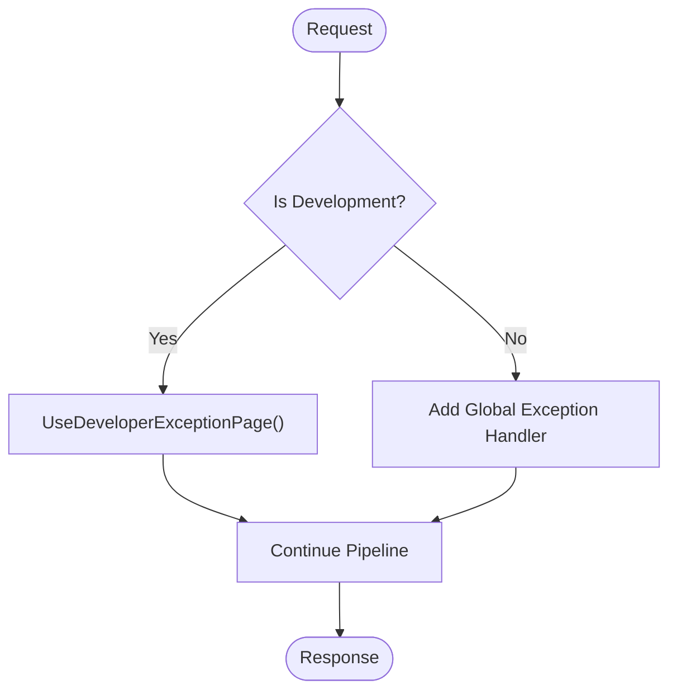
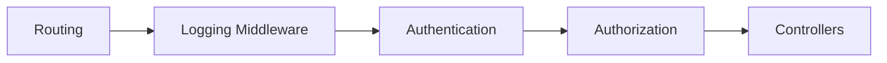
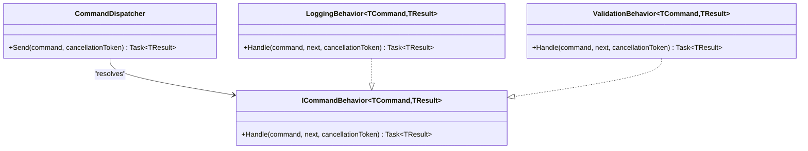
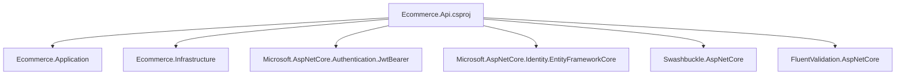

# Middleware & Configuration

<cite>
**Referenced Files in This Document**
- [Program.cs](file://src/Ecommerce.Api/Program.cs)
- [appsettings.Development.json](file://src/Ecommerce.Api/appsettings.Development.json)
- [Ecommerce.Api.csproj](file://src/Ecommerce.Api/Ecommerce.Api.csproj)
- [DependencyInjection.cs](file://src/Ecommerce.Infrastructure/DependencyInjection.cs)
- [AccountController.cs](file://src/Ecommerce.Api/Controllers/AccountController.cs)
- [ProductsController.cs](file://src/Ecommerce.Api/Controllers/ProductsController.cs)
- [RefreshTokenCleanupService.cs](file://src/Ecommerce.Infrastructure/Services/RefreshTokenCleanupService.cs)
- [CommandDispatcher.cs](file://src/Ecommerce.Application/Common/Commands/CommandDispatcher.cs)
- [LoggingBehavior.cs](file://src/Ecommerce.Application/Common/Commands/LoggingBehavior.cs)
- [ValidationBehavior.cs](file://src/Ecommerce.Application/Common/Commands/ValidationBehavior.cs)
</cite>

## Table of Contents
1. Introduction
2. Project Structure
3. Core Components
4. Architecture Overview
5. Detailed Component Analysis
6. Dependency Analysis
7. Performance Considerations
8. Troubleshooting Guide
9. Conclusion
10. Appendices

## Introduction
This document explains the API middleware pipeline and configuration for the Ecommerce API, focusing on ASP.NET Core middleware ordering, authentication and authorization setup, environment-specific configuration, dependency injection, logging, exception handling, and guidance for custom middleware development. It also outlines current security posture and provides recommendations for CORS, security headers, rate limiting, and performance optimization.

## Project Structure
The API project is the composition root where the request pipeline is configured and services are registered. Infrastructure registers data access and application services, while controllers implement endpoints that consume those services.

**Diagram sources**
- [Program.cs:9-76](file://src/Ecommerce.Api/Program.cs#L9-L76)
- [DependencyInjection.cs:11-85](file://src/Ecommerce.Infrastructure/DependencyInjection.cs#L11-L85)
- [AccountController.cs:13-115](file://src/Ecommerce.Api/Controllers/AccountController.cs#L13-L115)
- [ProductsController.cs:13-59](file://src/Ecommerce.Api/Controllers/ProductsController.cs#L13-L59)
- [RefreshTokenCleanupService.cs:10-46](file://src/Ecommerce.Infrastructure/Services/RefreshTokenCleanupService.cs#L10-L46)

**Section sources**
- [Program.cs:9-76](file://src/Ecommerce.Api/Program.cs#L9-L76)
- [DependencyInjection.cs:11-85](file://src/Ecommerce.Infrastructure/DependencyInjection.cs#L11-L85)

## Core Components
- Request pipeline: Controllers, routing, authentication, and authorization are wired in Program.cs.
- Authentication: JWT Bearer scheme configured with token validation parameters sourced from configuration.
- Authorization: Authorization service enabled; controller actions use [Authorize] to protect endpoints.
- Configuration: Development settings include logging levels, JWT key/issuer, and database connection string.
- Dependency Injection: Infrastructure extension registers EF Core, command dispatcher, behaviors, services, and hosted background tasks.

Key responsibilities by file:
- Program.cs: Builds app, configures services, sets up middleware order, enables Swagger in development.
- appsettings.Development.json: Logging levels, JWT settings, and DefaultConnection string.
- DependencyInjection.cs: Registers DbContext, application services, command pipeline behaviors, and background cleanup.
- AccountController.cs: Implements identity endpoints (register/login/refresh/revoke/me) using Identity and token services.
- ProductsController.cs: Exposes product queries with pagination and mapping.

**Section sources**
- [Program.cs:12-74](file://src/Ecommerce.Api/Program.cs#L12-L74)
- [appsettings.Development.json:1-16](file://src/Ecommerce.Api/appsettings.Development.json#L1-L16)
- [DependencyInjection.cs:11-85](file://src/Ecommerce.Infrastructure/DependencyInjection.cs#L11-L85)
- [AccountController.cs:34-115](file://src/Ecommerce.Api/Controllers/AccountController.cs#L34-L115)
- [ProductsController.cs:26-59](file://src/Ecommerce.Api/Controllers/ProductsController.cs#L26-L59)

## Architecture Overview
The request lifecycle flows through ASP.NET Core middleware in a defined order. In this project, the minimal pipeline includes developer exception page (development only), routing, authentication, authorization, and controller execution.

**Diagram sources**
- [Program.cs:63-74](file://src/Ecommerce.Api/Program.cs#L63-L74)
- [AccountController.cs:34-115](file://src/Ecommerce.Api/Controllers/AccountController.cs#L34-L115)
- [DependencyInjection.cs:11-85](file://src/Ecommerce.Infrastructure/DependencyInjection.cs#L11-L85)

## Detailed Component Analysis

### Middleware Ordering and Pipeline
- Development-only exception page is enabled before routing to capture early errors.
- Routing is enabled before authentication/authorization so endpoint metadata can be resolved.
- Authentication runs before authorization to populate the principal.
- Controllers are mapped after authorization to enforce policy checks.

Recommendations:
- Add global exception handling middleware earlier in the pipeline for consistent error responses.
- Add CORS before routing if cross-origin requests are required.
- Add request/response logging middleware after routing and before authentication to avoid logging sensitive tokens.

**Section sources**
- [Program.cs:63-74](file://src/Ecommerce.Api/Program.cs#L63-L74)

### Authentication Setup (JWT)
- JWT Bearer is configured as default scheme with token validation parameters including issuer, audience, lifetime, and signing key.
- The signing key and issuer are read from configuration; defaults are provided for local development.
- Identity is registered with Entity Framework stores and default token providers.

Security notes:
- RequireHttpsMetadata should be true in production when using HTTPS.
- Ensure secrets are not committed and are supplied via secure configuration sources.

**Section sources**
- [Program.cs:19-55](file://src/Ecommerce.Api/Program.cs#L19-L55)
- [appsettings.Development.json:8-11](file://src/Ecommerce.Api/appsettings.Development.json#L8-L11)

### Authorization Policies
- Authorization service is added; controller actions use [Authorize] to require authentication.
- No named policies or roles are currently defined; add policies for fine-grained access control as needed.

Best practices:
- Define role-based or policy-based authorization rules in a central location.
- Apply policies at controller or action level consistently.

**Section sources**
- [Program.cs:50-50](file://src/Ecommerce.Api/Program.cs#L50-L50)
- [AccountController.cs:67-99](file://src/Ecommerce.Api/Controllers/AccountController.cs#L67-L99)

### Environment-Specific Configuration
- Development settings include detailed logging, JWT key/issuer, and a SQL Server connection string.
- Connection string name matches the infrastructure registration.

Operational guidance:
- Create additional appsettings files per environment (e.g., Production).
- Override secrets via environment variables or secret managers in non-development environments.

**Section sources**
- [appsettings.Development.json:1-16](file://src/Ecommerce.Api/appsettings.Development.json#L1-L16)
- [DependencyInjection.cs:15-20](file://src/Ecommerce.Infrastructure/DependencyInjection.cs#L15-L20)

### Dependency Injection Setup
- EF Core DbContext is registered with SQL Server provider using the configured connection string.
- Command dispatcher and behaviors are registered for structured command processing.
- Application services (payment, idempotency, refresh token, token) are registered with appropriate lifetimes.
- A background hosted service cleans expired refresh tokens periodically.

Extensibility:
- Register additional repositories, validators, and services in the same extension method to keep DI centralized.

**Section sources**
- [DependencyInjection.cs:11-85](file://src/Ecommerce.Infrastructure/DependencyInjection.cs#L11-L85)
- [RefreshTokenCleanupService.cs:10-46](file://src/Ecommerce.Infrastructure/Services/RefreshTokenCleanupService.cs#L10-L46)

### Logging Configuration
- Development logging level is set to Debug for application logs and Warning for Microsoft libraries.
- Command pipeline behaviors log start/end and errors around handler execution.

Enhancements:
- Add structured logging providers (e.g., Serilog) and correlation IDs.
- Centralize log filtering and sinks per environment.

**Section sources**
- [appsettings.Development.json:2-7](file://src/Ecommerce.Api/appsettings.Development.json#L2-L7)
- [LoggingBehavior.cs:17-31](file://src/Ecommerce.Application/Common/Commands/LoggingBehavior.cs#L17-L31)
- [CommandDispatcher.cs:20-43](file://src/Ecommerce.Application/Common/Commands/CommandDispatcher.cs#L20-L43)

### Exception Handling Middleware
- Developer exception page is enabled in development.
- For production, add a global exception handler middleware to return consistent error responses (e.g., RFC 7807 ProblemDetails).

Error flow example:

**Section sources**
- [Program.cs:63-68](file://src/Ecommerce.Api/Program.cs#L63-L68)

### Request/Response Logging
- Current pipeline does not include explicit request/response logging middleware.
- Recommendation: Insert a request/response logging middleware after routing and before authentication to avoid logging sensitive tokens in headers.

Considerations:
- Mask or redact sensitive fields (tokens, passwords).
- Include correlation IDs for tracing across components.

[No sources needed since this section provides general guidance]

### Security Headers
- No explicit security header middleware is configured.
- Recommendations:
  - Add standard security headers (HSTS, X-Content-Type-Options, X-Frame-Options, Content-Security-Policy).
  - Enable HTTPS and enforce HSTS in production.

[No sources needed since this section provides general guidance]

### CORS Policy Configuration
- No CORS middleware is configured in the pipeline.
- If cross-origin calls are required, configure CORS before routing with specific allowed origins, methods, and headers.

[No sources needed since this section provides general guidance]

### Rate Limiting
- No rate limiting middleware is present.
- Recommendations:
  - Implement rate limiting based on IP, user, or endpoint.
  - Combine with caching and backpressure strategies.

[No sources needed since this section provides general guidance]

### Performance Optimization Settings
- Query optimizations:
  - Use AsNoTracking for read-only queries (demonstrated in ProductsController).
  - Clamp input parameters (page size) to prevent excessive loads.
- Background maintenance:
  - Refresh token cleanup runs daily via a hosted service.

Additional recommendations:
- Enable response caching for stable content.
- Use async I/O throughout.
- Profile and tune EF Core queries and indexes.

**Section sources**
- [ProductsController.cs:26-41](file://src/Ecommerce.Api/Controllers/ProductsController.cs#L26-L41)
- [RefreshTokenCleanupService.cs:21-43](file://src/Ecommerce.Infrastructure/Services/RefreshTokenCleanupService.cs#L21-L43)

### Custom Middleware Development and Best Practices
- Place custom middleware after routing and before authentication/authorization unless it must run earlier (e.g., CORS).
- Keep middleware focused and composable; prefer small, single-responsibility units.
- Use IConfiguration for options and ILogger for diagnostics.
- Avoid blocking operations; use async patterns.
- Test middleware with minimal host and integration tests.

Example pipeline placement:

[No sources needed since this section provides general guidance]

### Command Pipeline Behaviors
- The command dispatcher builds a behavior pipeline around each handler.
- LoggingBehavior wraps handlers to log entry, exit, and exceptions.
- ValidationBehavior resolves validators for a command and throws domain exceptions on validation failures.

**Diagram sources**
- [CommandDispatcher.cs:20-43](file://src/Ecommerce.Application/Common/Commands/CommandDispatcher.cs#L20-L43)
- [LoggingBehavior.cs:17-31](file://src/Ecommerce.Application/Common/Commands/LoggingBehavior.cs#L17-L31)
- [ValidationBehavior.cs:17-38](file://src/Ecommerce.Application/Common/Commands/ValidationBehavior.cs#L17-L38)

**Section sources**
- [CommandDispatcher.cs:20-43](file://src/Ecommerce.Application/Common/Commands/CommandDispatcher.cs#L20-L43)
- [LoggingBehavior.cs:17-31](file://src/Ecommerce.Application/Common/Commands/LoggingBehavior.cs#L17-L31)
- [ValidationBehavior.cs:17-38](file://src/Ecommerce.Application/Common/Commands/ValidationBehavior.cs#L17-L38)

## Dependency Analysis
The API project references application and infrastructure projects and adds NuGet packages for authentication, identity, swagger, and fluent validation.

**Diagram sources**
- [Ecommerce.Api.csproj:1-20](file://src/Ecommerce.Api/Ecommerce.Api.csproj#L1-L20)

**Section sources**
- [Ecommerce.Api.csproj:1-20](file://src/Ecommerce.Api/Ecommerce.Api.csproj#L1-L20)

## Performance Considerations
- Use AsNoTracking for read-heavy endpoints to reduce change tracking overhead.
- Clamp query parameters to prevent large result sets.
- Offload long-running tasks to background services (e.g., refresh token cleanup).
- Consider adding caching for frequently accessed data and response caching for stable resources.
- Monitor EF Core query plans and ensure proper indexing.

[No sources needed since this section provides general guidance]

## Troubleshooting Guide
Common issues and resolutions:
- Authentication fails due to missing or incorrect JWT key/issuer:
  - Verify configuration values match between issuer and token generation.
  - Ensure secrets are loaded correctly in the target environment.
- Database connectivity errors:
  - Confirm connection string name and provider package are correct.
  - Validate network access and credentials.
- Missing dependencies:
  - Some registrations are wrapped in try/catch to tolerate missing packages locally; install required packages and restore.
- Unhandled exceptions in production:
  - Add global exception handling middleware to return consistent error responses.

**Section sources**
- [Program.cs:19-55](file://src/Ecommerce.Api/Program.cs#L19-L55)
- [DependencyInjection.cs:35-63](file://src/Ecommerce.Infrastructure/DependencyInjection.cs#L35-L63)
- [appsettings.Development.json:8-14](file://src/Ecommerce.Api/appsettings.Development.json#L8-L14)

## Conclusion
The API uses a minimal but effective middleware pipeline with JWT authentication and authorization. Configuration is environment-driven, and dependency injection centralizes service registration. To harden and optimize the system, add global exception handling, CORS, security headers, request/response logging, and rate limiting as needed. Extend the command pipeline with additional behaviors for cross-cutting concerns such as auditing and metrics.

[No sources needed since this section summarizes without analyzing specific files]

## Appendices

### API Endpoints Using Authorization
- Account endpoints protected with [Authorize]:
  - Revoke refresh token
  - Revoke all refresh tokens
  - Get current user profile

- Public endpoints:
  - Register and login (issue tokens)
  - Product listing and lookup

**Section sources**
- [AccountController.cs:34-115](file://src/Ecommerce.Api/Controllers/AccountController.cs#L34-L115)
- [ProductsController.cs:26-59](file://src/Ecommerce.Api/Controllers/ProductsController.cs#L26-L59)