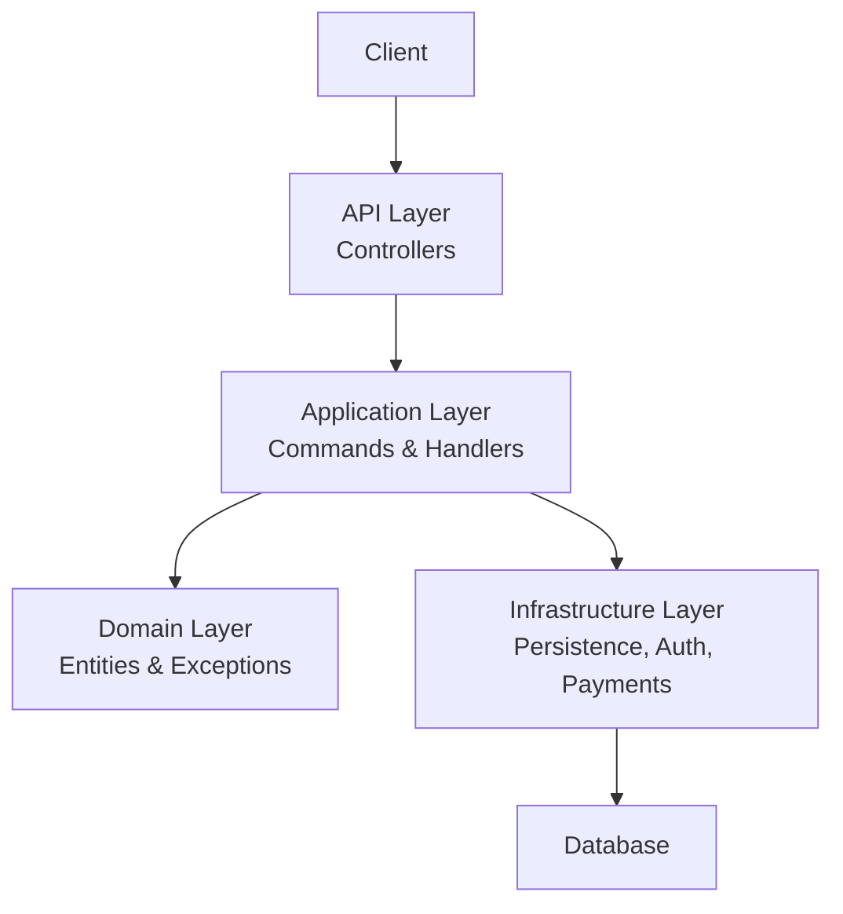
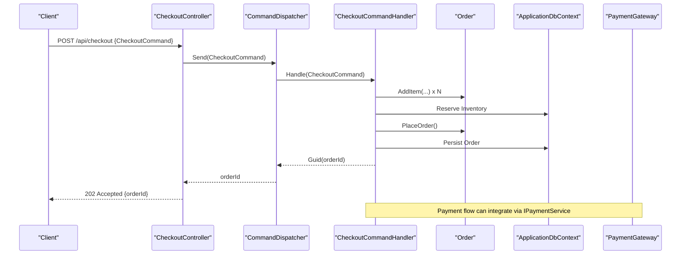
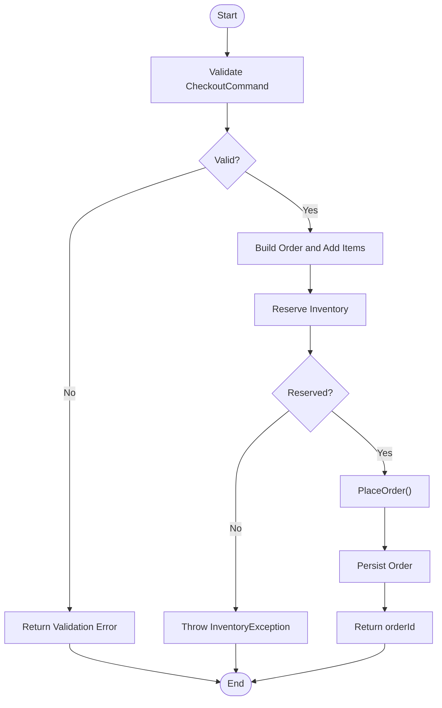
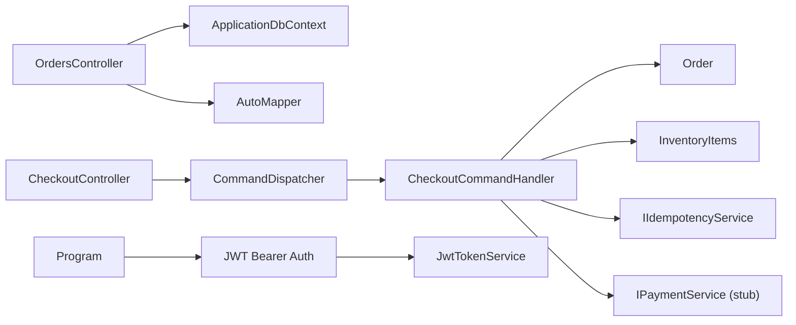

# Orders API

<cite>
**Referenced Files in This Document**
- [OrdersController.cs](file://src/Ecommerce.Api/Controllers/OrdersController.cs)
- [CheckoutController.cs](file://src/Ecommerce.Api/Controllers/CheckoutController.cs)
- [Program.cs](file://src/Ecommerce.Api/Program.cs)
- [OrderDto.cs](file://src/Ecommerce.Application/DTOs/OrderDto.cs)
- [CheckoutCommand.cs](file://src/Ecommerce.Application/Commands/Checkout/CheckoutCommand.cs)
- [CheckoutCommandHandler.cs](file://src/Ecommerce.Application/Commands/Checkout/CheckoutCommandHandler.cs)
- [CheckoutCommandValidator.cs](file://src/Ecommerce.Application/Commands/Checkout/CheckoutCommandValidator.cs)
- [Order.cs](file://src/Ecommerce.Domain/Entities/Order.cs)
- [DomainException.cs](file://src/Ecommerce.Domain/Exceptions/DomainException.cs)
- [InventoryException.cs](file://src/Ecommerce.Domain/Exceptions/InventoryException.cs)
- [JwtTokenService.cs](file://src/Ecommerce.Infrastructure/Auth/JwtTokenService.cs)
- [PaymentGateway.cs](file://src/Ecommerce.Infrastructure/Payments/PaymentGateway.cs)
</cite>

## Table of Contents
1. Introduction
2. Project Structure
3. Core Components
4. Architecture Overview
5. Detailed Component Analysis
6. Dependency Analysis
7. Performance Considerations
8. Troubleshooting Guide
9. Conclusion
10. Appendices

## Introduction
This document provides comprehensive API documentation for order-related endpoints and the end-to-end order lifecycle, including creation, retrieval, status updates, and order history queries. It covers request/response schemas (OrderDto), authentication using JWT tokens, authorization policies, error handling for invalid orders, payment failures, and inventory issues, as well as filtering, sorting, and pagination capabilities for order queries.

## Project Structure
The Orders API is implemented across the Api, Application, Domain, and Infrastructure layers:
- Api layer exposes HTTP endpoints for checkout and order listing/retrieval.
- Application layer orchestrates commands (checkout), validation, DTOs, and domain interactions.
- Domain layer defines entities (Order), value objects, and business rules/exceptions.
- Infrastructure layer provides persistence, JWT token service, and a stub payment gateway.

**Diagram sources**
- [OrdersController.cs:13-50](file://src/Ecommerce.Api/Controllers/OrdersController.cs#L13-L50)
- [CheckoutController.cs:8-24](file://src/Ecommerce.Api/Controllers/CheckoutController.cs#L8-L24)
- [CheckoutCommandHandler.cs:11-91](file://src/Ecommerce.Application/Commands/Checkout/CheckoutCommandHandler.cs#L11-L91)
- [Order.cs:8-102](file://src/Ecommerce.Domain/Entities/Order.cs#L8-L102)
- [JwtTokenService.cs:13-45](file://src/Ecommerce.Infrastructure/Auth/JwtTokenService.cs#L13-L45)
- [PaymentGateway.cs:8-22](file://src/Ecommerce.Infrastructure/Payments/PaymentGateway.cs#L8-L22)

**Section sources**
- [OrdersController.cs:13-50](file://src/Ecommerce.Api/Controllers/OrdersController.cs#L13-L50)
- [CheckoutController.cs:8-24](file://src/Ecommerce.Api/Controllers/CheckoutController.cs#L8-L24)
- [Program.cs:19-55](file://src/Ecommerce.Api/Program.cs#L19-L55)

## Core Components
- OrdersController: Provides GET endpoints to list orders with pagination and retrieve a single order by ID.
- CheckoutController: Accepts checkout commands to create orders via the command pipeline.
- Order entity: Encapsulates order state transitions, totals calculation, and business rules.
- OrderDto: Response schema for order data returned by the API.
- Authentication: JWT bearer scheme configured in Program; token generation provided by JwtTokenService.
- Payment: Stub PaymentGateway used for payment processing integration points.

Key responsibilities:
- Create orders through CheckoutController -> CheckoutCommandHandler -> Order entity.
- Retrieve orders through OrdersController with pagination and eager loading of items.
- Enforce validation and idempotency during checkout.
- Apply JWT authentication and authorization middleware.

**Section sources**
- [OrdersController.cs:26-50](file://src/Ecommerce.Api/Controllers/OrdersController.cs#L26-L50)
- [CheckoutController.cs:19-24](file://src/Ecommerce.Api/Controllers/CheckoutController.cs#L19-L24)
- [Order.cs:36-102](file://src/Ecommerce.Domain/Entities/Order.cs#L36-L102)
- [OrderDto.cs:6-20](file://src/Ecommerce.Application/DTOs/OrderDto.cs#L6-L20)
- [Program.cs:29-50](file://src/Ecommerce.Api/Program.cs#L29-L50)
- [PaymentGateway.cs:8-22](file://src/Ecommerce.Infrastructure/Payments/PaymentGateway.cs#L8-L22)

## Architecture Overview
The order lifecycle spans multiple layers:
- Client sends a POST to /api/checkout with a CheckoutCommand.
- CommandDispatcher routes to CheckoutCommandHandler.
- Handler validates input, builds an Order, reserves inventory, persists it, and returns the order ID.
- Orders are listed or retrieved via /api/orders endpoints.
- Authentication uses JWT Bearer tokens configured in Program; Authorization middleware is enabled.

**Diagram sources**
- [CheckoutController.cs:19-24](file://src/Ecommerce.Api/Controllers/CheckoutController.cs#L19-L24)
- [CheckoutCommandHandler.cs:22-91](file://src/Ecommerce.Application/Commands/Checkout/CheckoutCommandHandler.cs#L22-L91)
- [Order.cs:36-102](file://src/Ecommerce.Domain/Entities/Order.cs#L36-L102)
- [PaymentGateway.cs:8-22](file://src/Ecommerce.Infrastructure/Payments/PaymentGateway.cs#L8-L22)

## Detailed Component Analysis

### Orders Controller Endpoints
- GET /api/orders?page=1&pageSize=20
  - Lists orders with pagination.
  - Sorting: newest first (by CreatedAt descending).
  - Includes Items eagerly loaded.
  - Returns List<OrderDto>.
- GET /api/orders/{id}
  - Retrieves a single order by GUID.
  - Includes Items eagerly loaded.
  - Returns OrderDto or 404 if not found.

Request/Response Schemas
- OrderDto
  - Id: Guid
  - OrderNumber: string
  - TotalAmount: decimal
  - Items: List<OrderItemDto>
- OrderItemDto
  - ProductId: Guid
  - ProductVariantId: Guid
  - Quantity: int
  - UnitPrice: decimal

Authentication and Authorization
- The application configures JWT Bearer authentication and enables authorization middleware.
- Controllers do not currently apply [Authorize] attributes; consider adding role-based or policy-based authorization for production use.

Filtering, Sorting, Pagination
- Pagination: page (default 1), pageSize (clamped 1..100).
- Sorting: by CreatedAt descending.
- Filtering: Not implemented in current controller; can be added via query parameters.

Error Handling
- NotFound when order does not exist.
- Validation errors from command pipeline during checkout.

**Section sources**
- [OrdersController.cs:26-50](file://src/Ecommerce.Api/Controllers/OrdersController.cs#L26-L50)
- [OrderDto.cs:6-20](file://src/Ecommerce.Application/DTOs/OrderDto.cs#L6-L20)
- [Program.cs:29-50](file://src/Ecommerce.Api/Program.cs#L29-L50)

### Checkout Endpoint (Order Creation)
- POST /api/checkout
  - Request body: CheckoutCommand
    - UserId: Guid
    - Items: List<CheckoutItem>
      - ProductId: Guid
      - ProductVariantId: Guid
      - Quantity: int
    - Currency: string (default USD)
    - ShippingAddress: string
    - IdempotencyKey: string (optional)
  - Behavior:
    - Validates items and quantities.
    - Supports idempotency key to prevent duplicate orders.
    - Builds Order, adds items, reserves inventory, places order, persists, and returns orderId.
  - Response: 202 Accepted with { orderId }.

Validation Rules
- At least one item required.
- All item quantities must be greater than zero.

Idempotency
- If IdempotencyKey is provided, handler checks for existing response or registers attempt to avoid duplicates.

Inventory Reservation
- Reserves inventory per item; throws InventoryException if not found.

Business Rules
- Order cannot be placed without items.
- Totals recalculated on item changes and placement.

**Section sources**
- [CheckoutController.cs:19-24](file://src/Ecommerce.Api/Controllers/CheckoutController.cs#L19-L24)
- [CheckoutCommand.cs:6-20](file://src/Ecommerce.Application/Commands/Checkout/CheckoutCommand.cs#L6-L20)
- [CheckoutCommandValidator.cs:6-30](file://src/Ecommerce.Application/Commands/Checkout/CheckoutCommandValidator.cs#L6-L30)
- [CheckoutCommandHandler.cs:22-91](file://src/Ecommerce.Application/Commands/Checkout/CheckoutCommandHandler.cs#L22-L91)
- [Order.cs:36-102](file://src/Ecommerce.Domain/Entities/Order.cs#L36-L102)
- [InventoryException.cs:5-8](file://src/Ecommerce.Domain/Exceptions/InventoryException.cs#L5-L8)

### Authentication and Authorization
- JWT Bearer authentication is configured with issuer and signing key from configuration.
- Authorization middleware is enabled; controllers can be protected with [Authorize] and policies/roles as needed.
- Token generation uses JwtTokenService to create tokens with claims (sub, email, jti) and expiration.

Security Notes
- Ensure HTTPS in production and configure proper issuer/audience/signing key.
- Consider adding role-based authorization for order management endpoints.

**Section sources**
- [Program.cs:29-50](file://src/Ecommerce.Api/Program.cs#L29-L50)
- [JwtTokenService.cs:13-45](file://src/Ecommerce.Infrastructure/Auth/JwtTokenService.cs#L13-L45)

### Error Handling
- Invalid orders:
  - Empty order placement throws DomainException.
  - Negative unit price or non-positive quantity throws DomainException.
- Inventory issues:
  - Missing inventory item throws InventoryException.
- Payment failures:
  - PaymentGateway is a stub returning success; integrate real provider and handle failure responses accordingly.
- Validation errors:
  - CheckoutCommandValidator enforces minimum items and positive quantities.

Error Responses
- 404 Not Found for missing orders.
- 400 Bad Request for validation errors (via command pipeline).
- 409 Conflict or 422 Unprocessable Entity for idempotency conflicts or domain exceptions (implement global exception handler if desired).

**Section sources**
- [Order.cs:36-102](file://src/Ecommerce.Domain/Entities/Order.cs#L36-L102)
- [CheckoutCommandValidator.cs:6-30](file://src/Ecommerce.Application/Commands/Checkout/CheckoutCommandValidator.cs#L6-L30)
- [CheckoutCommandHandler.cs:22-91](file://src/Ecommerce.Application/Commands/Checkout/CheckoutCommandHandler.cs#L22-L91)
- [PaymentGateway.cs:8-22](file://src/Ecommerce.Infrastructure/Payments/PaymentGateway.cs#L8-L22)

### Order Lifecycle Examples
- Create Order:
  - POST /api/checkout with CheckoutCommand.
  - Handler validates, reserves inventory, creates Order, persists, returns orderId.
- Retrieve Orders:
  - GET /api/orders?page=1&pageSize=20 returns paginated list with items.
  - GET /api/orders/{id} returns single order details.
- Status Updates:
  - PlaceOrder sets status to Placed, PaymentStatus Pending, FulfillmentStatus Unfulfilled.
  - Extend with additional methods (e.g., ConfirmPayment, Ship, Complete) as needed.
- Order History:
  - Use GET /api/orders with pagination to browse recent orders.

**Diagram sources**
- [CheckoutCommandValidator.cs:6-30](file://src/Ecommerce.Application/Commands/Checkout/CheckoutCommandValidator.cs#L6-L30)
- [CheckoutCommandHandler.cs:22-91](file://src/Ecommerce.Application/Commands/Checkout/CheckoutCommandHandler.cs#L22-L91)
- [Order.cs:36-102](file://src/Ecommerce.Domain/Entities/Order.cs#L36-L102)

## Dependency Analysis
- OrdersController depends on ApplicationDbContext and AutoMapper for mapping to OrderDto.
- CheckoutController depends on CommandDispatcher to route to CheckoutCommandHandler.
- CheckoutCommandHandler depends on IApplicationDbContext and IIdempotencyService; interacts with Order entity and InventoryItems.
- Program configures JWT authentication and authorization middleware.
- JwtTokenService generates tokens using configuration values.
- PaymentGateway implements IPaymentService for future payment integration.

**Diagram sources**
- [OrdersController.cs:17-24](file://src/Ecommerce.Api/Controllers/OrdersController.cs#L17-L24)
- [CheckoutController.cs:12-24](file://src/Ecommerce.Api/Controllers/CheckoutController.cs#L12-L24)
- [CheckoutCommandHandler.cs:11-91](file://src/Ecommerce.Application/Commands/Checkout/CheckoutCommandHandler.cs#L11-L91)
- [Program.cs:29-50](file://src/Ecommerce.Api/Program.cs#L29-L50)
- [JwtTokenService.cs:13-45](file://src/Ecommerce.Infrastructure/Auth/JwtTokenService.cs#L13-L45)
- [PaymentGateway.cs:8-22](file://src/Ecommerce.Infrastructure/Payments/PaymentGateway.cs#L8-L22)

**Section sources**
- [OrdersController.cs:17-24](file://src/Ecommerce.Api/Controllers/OrdersController.cs#L17-L24)
- [CheckoutController.cs:12-24](file://src/Ecommerce.Api/Controllers/CheckoutController.cs#L12-L24)
- [CheckoutCommandHandler.cs:11-91](file://src/Ecommerce.Application/Commands/Checkout/CheckoutCommandHandler.cs#L11-L91)
- [Program.cs:29-50](file://src/Ecommerce.Api/Program.cs#L29-L50)

## Performance Considerations
- Use AsNoTracking for read-only queries to improve performance.
- Eager load Items to avoid N+1 queries.
- Clamp pageSize to limit large result sets.
- Consider indexing frequently queried fields (CreatedAt, OrderNumber, UserId).
- Implement server-side filtering and sorting for large datasets.
- Use caching for read-heavy endpoints if appropriate.

[No sources needed since this section provides general guidance]

## Troubleshooting Guide
Common Issues and Resolutions
- 404 Not Found:
  - Occurs when retrieving a non-existent order by ID.
  - Verify the GUID and ensure the order exists in the database.
- Validation Errors:
  - Ensure CheckoutCommand contains at least one item and all quantities are positive.
  - Review CheckoutCommandValidator rules.
- Inventory Issues:
  - InventoryException indicates missing inventory for product/variant.
  - Ensure inventory records exist and have sufficient stock before checkout.
- Payment Failures:
  - PaymentGateway is a stub; integrate a real provider and handle failure responses.
  - Update handlers to process payment results and update order statuses accordingly.
- Idempotency Conflicts:
  - Duplicate requests with the same IdempotencyKey return the original orderId.
  - Ensure unique keys per intended operation.

**Section sources**
- [OrdersController.cs:44-50](file://src/Ecommerce.Api/Controllers/OrdersController.cs#L44-L50)
- [CheckoutCommandValidator.cs:6-30](file://src/Ecommerce.Application/Commands/Checkout/CheckoutCommandValidator.cs#L6-L30)
- [CheckoutCommandHandler.cs:22-91](file://src/Ecommerce.Application/Commands/Checkout/CheckoutCommandHandler.cs#L22-L91)
- [PaymentGateway.cs:8-22](file://src/Ecommerce.Infrastructure/Payments/PaymentGateway.cs#L8-L22)

## Conclusion
The Orders API provides essential endpoints for creating and retrieving orders, with robust validation, idempotency, and domain-driven business rules. Authentication is configured via JWT Bearer tokens, and authorization middleware is enabled for securing endpoints. Future enhancements should include explicit authorization policies, advanced filtering/sorting, and full payment integration with error handling.

[No sources needed since this section summarizes without analyzing specific files]

## Appendices

### API Reference Summary
- POST /api/checkout
  - Request: CheckoutCommand
  - Response: 202 Accepted { orderId }
- GET /api/orders?page=1&pageSize=20
  - Response: List<OrderDto>
- GET /api/orders/{id}
  - Response: OrderDto or 404

### Data Models
- OrderDto
  - Fields: Id, OrderNumber, TotalAmount, Items
- OrderItemDto
  - Fields: ProductId, ProductVariantId, Quantity, UnitPrice

**Section sources**
- [OrderDto.cs:6-20](file://src/Ecommerce.Application/DTOs/OrderDto.cs#L6-L20)
- [CheckoutCommand.cs:6-20](file://src/Ecommerce.Application/Commands/Checkout/CheckoutCommand.cs#L6-L20)