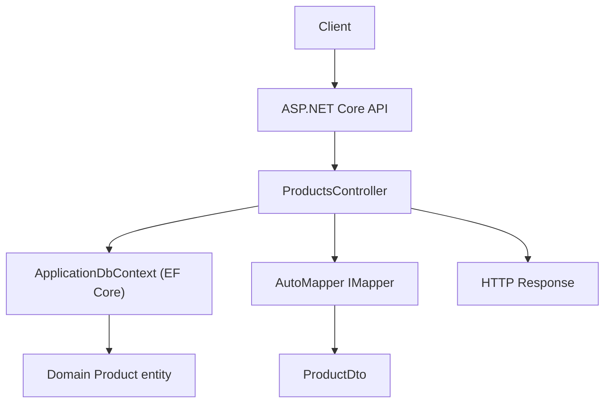
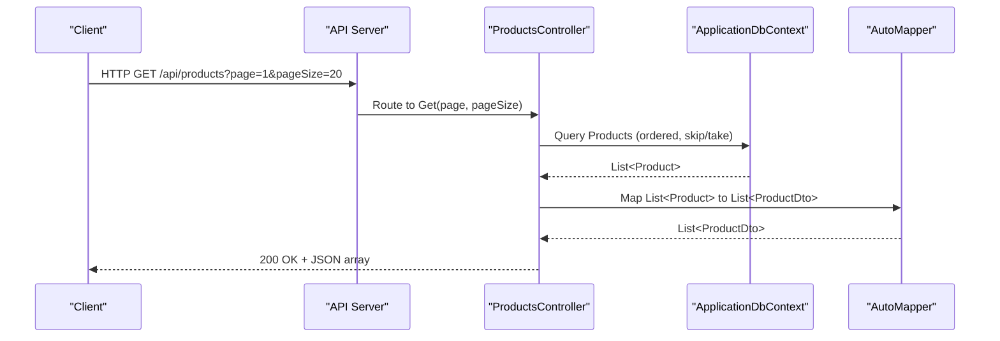
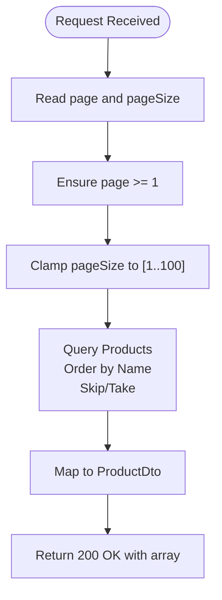
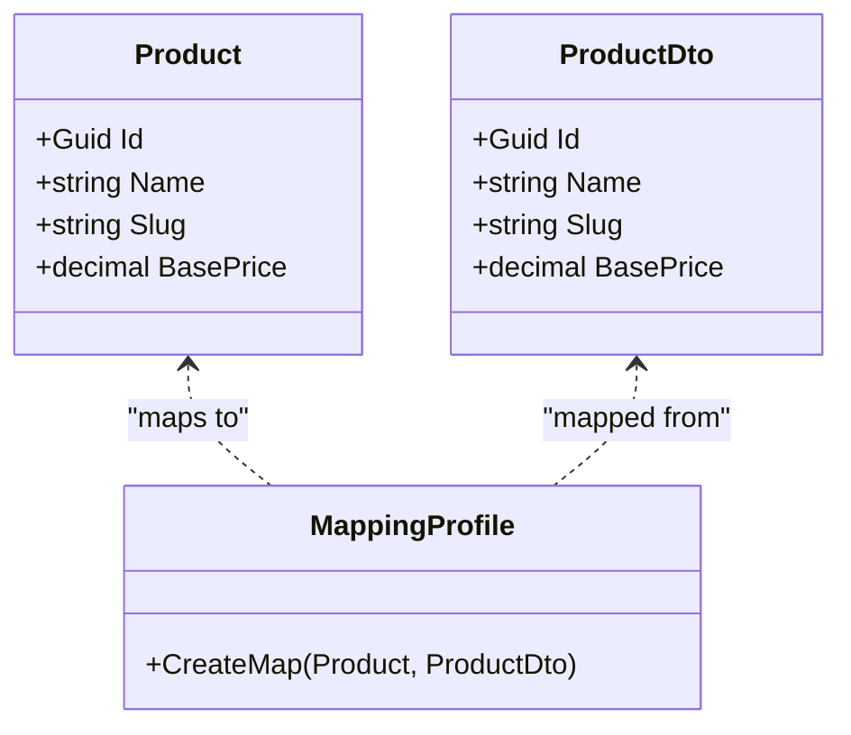
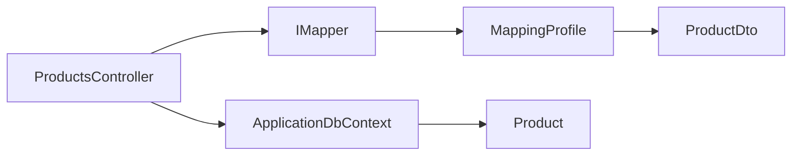

# Products API

<cite>
**Referenced Files in This Document**
- [ProductsController.cs](file://src/Ecommerce.Api/Controllers/ProductsController.cs)
- [ProductDto.cs](file://src/Ecommerce.Application/DTOs/ProductDto.cs)
- [MappingProfile.cs](file://src/Ecommerce.Application/Mappings/MappingProfile.cs)
- [Product.cs](file://src/Ecommerce.Domain/Entities/Product.cs)
- [ApplicationDbContext.cs](file://src/Ecommerce.Infrastructure/Persistence/ApplicationDbContext.cs)
- [Program.cs](file://src/Ecommerce.Api/Program.cs)
</cite>

## Table of Contents
1. [Introduction](#introduction)
2. [Project Structure](#project-structure)
3. [Core Components](#core-components)
4. [Architecture Overview](#architecture-overview)
5. [Detailed Component Analysis](#detailed-component-analysis)
6. [Dependency Analysis](#dependency-analysis)
7. [Performance Considerations](#performance-considerations)
8. [Troubleshooting Guide](#troubleshooting-guide)
9. [Conclusion](#conclusion)

## Introduction
This document provides detailed API documentation for the Products controller endpoints exposed by the Ecommerce API. It covers:
- GET /api/products with pagination parameters (page, pageSize)
- GET /api/products/{id} to retrieve a product by GUID
- GET /api/products/slug/{slug} to retrieve a product by slug

It includes request/response schemas, HTTP status codes, error handling behavior, authentication requirements, and how data is transformed using AutoMapper. Practical example requests and expected responses are provided.

## Project Structure
The Products API is implemented as an ASP.NET Core Web API controller that:
- Reads from the database via EF Core’s ApplicationDbContext
- Maps domain entities to DTOs using AutoMapper
- Returns standardized JSON responses

**Diagram sources**
- [ProductsController.cs:13-59](file://src/Ecommerce.Api/Controllers/ProductsController.cs#L13-L59)
- [ApplicationDbContext.cs:13-27](file://src/Ecommerce.Infrastructure/Persistence/ApplicationDbContext.cs#L13-L27)
- [MappingProfile.cs:22-27](file://src/Ecommerce.Application/Mappings/MappingProfile.cs#L22-L27)
- [Product.cs:6-42](file://src/Ecommerce.Domain/Entities/Product.cs#L6-L42)
- [ProductDto.cs:5-11](file://src/Ecommerce.Application/DTOs/ProductDto.cs#L5-L11)

**Section sources**
- [ProductsController.cs:13-59](file://src/Ecommerce.Api/Controllers/ProductsController.cs#L13-L59)
- [ApplicationDbContext.cs:13-27](file://src/Ecommerce.Infrastructure/Persistence/ApplicationDbContext.cs#L13-L27)
- [MappingProfile.cs:22-27](file://src/Ecommerce.Application/Mappings/MappingProfile.cs#L22-L27)
- [Product.cs:6-42](file://src/Ecommerce.Domain/Entities/Product.cs#L6-L42)
- [ProductDto.cs:5-11](file://src/Ecommerce.Application/DTOs/ProductDto.cs#L5-L11)

## Core Components
- ProductsController: Defines the REST endpoints for listing, retrieving by ID, and retrieving by slug. Implements pagination and validation for query parameters.
- ProductDto: The response schema returned by all endpoints.
- MappingProfile: Configures AutoMapper mapping from Product entity to ProductDto.
- ApplicationDbContext: Provides access to the Products DbSet for querying.
- Program: Registers controllers, Swagger, Identity/JWT (when available), and applies authentication/authorization middleware.

**Section sources**
- [ProductsController.cs:13-59](file://src/Ecommerce.Api/Controllers/ProductsController.cs#L13-L59)
- [ProductDto.cs:5-11](file://src/Ecommerce.Application/DTOs/ProductDto.cs#L5-L11)
- [MappingProfile.cs:22-27](file://src/Ecommerce.Application/Mappings/MappingProfile.cs#L22-L27)
- [ApplicationDbContext.cs:13-27](file://src/Ecommerce.Infrastructure/Persistence/ApplicationDbContext.cs#L13-L27)
- [Program.cs:12-74](file://src/Ecommerce.Api/Program.cs#L12-L74)

## Architecture Overview
The API follows a layered approach:
- Presentation layer: ASP.NET Core controller handles HTTP requests and returns responses.
- Data access layer: EF Core DbContext queries the database.
- Mapping layer: AutoMapper transforms domain entities into DTOs for consistent API responses.

**Diagram sources**
- [ProductsController.cs:26-41](file://src/Ecommerce.Api/Controllers/ProductsController.cs#L26-L41)
- [ApplicationDbContext.cs:20-20](file://src/Ecommerce.Infrastructure/Persistence/ApplicationDbContext.cs#L20-L20)
- [MappingProfile.cs:22-27](file://src/Ecommerce.Application/Mappings/MappingProfile.cs#L22-L27)

## Detailed Component Analysis

### Endpoint: GET /api/products
- Purpose: Retrieve a paginated list of products sorted by name.
- Route: /api/products
- Method: GET
- Query Parameters:
  - page: integer, default 1. Minimum enforced is 1.
  - pageSize: integer, default 20. Clamped between 1 and 100.
- Behavior:
  - Validates and normalizes page and pageSize.
  - Queries Products with AsNoTracking, ordered by Name, applying Skip/Take for pagination.
  - Maps results to ProductDto using AutoMapper.
  - Returns 200 OK with JSON array of ProductDto.
- Request Examples:
  - GET /api/products
  - GET /api/products?page=2&pageSize=10
- Response Schema:
  - Array of ProductDto objects with fields: Id (Guid), Name (string), Slug (string), BasePrice (decimal).
- Status Codes:
  - 200 OK: Successful retrieval.
- Error Handling:
  - Invalid or out-of-range parameters are normalized internally; no explicit error responses for these cases.
- Authentication:
  - Not explicitly required on this endpoint. However, global authentication/authorization middleware is enabled in the application pipeline. If JWT is configured and enforced globally, clients may need to include a valid token depending on deployment configuration.

**Section sources**
- [ProductsController.cs:26-41](file://src/Ecommerce.Api/Controllers/ProductsController.cs#L26-L41)
- [ProductDto.cs:5-11](file://src/Ecommerce.Application/DTOs/ProductDto.cs#L5-L11)
- [Program.cs:70-74](file://src/Ecommerce.Api/Program.cs#L70-L74)

### Endpoint: GET /api/products/{id}
- Purpose: Retrieve a single product by its GUID identifier.
- Route: /api/products/{id}
- Constraints:
  - id: must be a valid GUID.
- Behavior:
  - Looks up product by Id.
  - If not found, returns 404 Not Found.
  - If found, maps to ProductDto and returns 200 OK.
- Request Example:
  - GET /api/products/550e8400-e29b-41d4-a716-446655440000
- Response Schema:
  - Single ProductDto object with fields: Id (Guid), Name (string), Slug (string), BasePrice (decimal).
- Status Codes:
  - 200 OK: Product found.
  - 404 Not Found: No product with the given Id.
- Authentication:
  - Same as above; depends on global policy.

**Section sources**
- [ProductsController.cs:43-49](file://src/Ecommerce.Api/Controllers/ProductsController.cs#L43-L49)
- [ProductDto.cs:5-11](file://src/Ecommerce.Application/DTOs/ProductDto.cs#L5-L11)
- [Program.cs:70-74](file://src/Ecommerce.Api/Program.cs#L70-L74)

### Endpoint: GET /api/products/slug/{slug}
- Purpose: Retrieve a single product by its URL-friendly slug.
- Route: /api/products/slug/{slug}
- Behavior:
  - Validates that slug is not null or whitespace; returns 400 Bad Request if invalid.
  - Queries by Slug with AsNoTracking.
  - If not found, returns 404 Not Found.
  - If found, maps to ProductDto and returns 200 OK.
- Request Example:
  - GET /api/products/slug/wireless-headphones
- Response Schema:
  - Single ProductDto object with fields: Id (Guid), Name (string), Slug (string), BasePrice (decimal).
- Status Codes:
  - 200 OK: Product found.
  - 400 Bad Request: Empty or whitespace slug.
  - 404 Not Found: No product with the given slug.
- Authentication:
  - Same as above; depends on global policy.

**Section sources**
- [ProductsController.cs:51-58](file://src/Ecommerce.Api/Controllers/ProductsController.cs#L51-L58)
- [ProductDto.cs:5-11](file://src/Ecommerce.Application/DTOs/ProductDto.cs#L5-L11)
- [Program.cs:70-74](file://src/Ecommerce.Api/Program.cs#L70-L74)

### Pagination Behavior
- Default values: page = 1, pageSize = 20.
- Validation:
  - page is clamped to minimum 1.
  - pageSize is clamped to range [1, 100].
- Ordering: Results are ordered by product Name.
- Implementation: Uses EF Core’s Skip and Take to perform server-side pagination.

**Diagram sources**
- [ProductsController.cs:26-41](file://src/Ecommerce.Api/Controllers/ProductsController.cs#L26-L41)

**Section sources**
- [ProductsController.cs:26-41](file://src/Ecommerce.Api/Controllers/ProductsController.cs#L26-L41)

### Data Transformation Using AutoMapper
- Mapping configuration defines how Product entity fields map to ProductDto fields:
  - Id -> Id
  - Name -> Name
  - BasePrice -> BasePrice
  - Slug -> Slug
- All endpoints use AutoMapper to convert domain entities to DTOs before returning responses.

**Diagram sources**
- [MappingProfile.cs:22-27](file://src/Ecommerce.Application/Mappings/MappingProfile.cs#L22-L27)
- [Product.cs:6-42](file://src/Ecommerce.Domain/Entities/Product.cs#L6-L42)
- [ProductDto.cs:5-11](file://src/Ecommerce.Application/DTOs/ProductDto.cs#L5-L11)

**Section sources**
- [MappingProfile.cs:22-27](file://src/Ecommerce.Application/Mappings/MappingProfile.cs#L22-L27)
- [Product.cs:6-42](file://src/Ecommerce.Domain/Entities/Product.cs#L6-L42)
- [ProductDto.cs:5-11](file://src/Ecommerce.Application/DTOs/ProductDto.cs#L5-L11)

### Authentication Requirements
- Global middleware:
  - Authentication and Authorization middleware are registered in the application pipeline.
  - JWT Bearer scheme is configured when Identity/JWT packages are present.
- Effect on endpoints:
  - The Products endpoints do not have explicit [Authorize] attributes. Whether they require authentication depends on global policies or additional authorization rules applied elsewhere. In development without strict policies, these endpoints may be accessible without a token; in production with strict policies, tokens may be required.

**Section sources**
- [Program.cs:20-55](file://src/Ecommerce.Api/Program.cs#L20-L55)
- [Program.cs:70-74](file://src/Ecommerce.Api/Program.cs#L70-L74)

## Dependency Analysis
- ProductsController depends on:
  - ApplicationDbContext for data access
  - IMapper for DTO mapping
- ApplicationDbContext exposes Products DbSet
- MappingProfile configures Product to ProductDto mapping
- Program registers controllers, Swagger, and optional JWT authentication

**Diagram sources**
- [ProductsController.cs:17-24](file://src/Ecommerce.Api/Controllers/ProductsController.cs#L17-L24)
- [ApplicationDbContext.cs:20-20](file://src/Ecommerce.Infrastructure/Persistence/ApplicationDbContext.cs#L20-L20)
- [MappingProfile.cs:22-27](file://src/Ecommerce.Application/Mappings/MappingProfile.cs#L22-L27)
- [Product.cs:6-42](file://src/Ecommerce.Domain/Entities/Product.cs#L6-L42)
- [ProductDto.cs:5-11](file://src/Ecommerce.Application/DTOs/ProductDto.cs#L5-L11)

**Section sources**
- [ProductsController.cs:17-24](file://src/Ecommerce.Api/Controllers/ProductsController.cs#L17-L24)
- [ApplicationDbContext.cs:20-20](file://src/Ecommerce.Infrastructure/Persistence/ApplicationDbContext.cs#L20-L20)
- [MappingProfile.cs:22-27](file://src/Ecommerce.Application/Mappings/MappingProfile.cs#L22-L27)
- [Product.cs:6-42](file://src/Ecommerce.Domain/Entities/Product.cs#L6-L42)
- [ProductDto.cs:5-11](file://src/Ecommerce.Application/DTOs/ProductDto.cs#L5-L11)

## Performance Considerations
- Use of AsNoTracking improves read performance for non-updated queries.
- Server-side pagination via Skip/Take reduces payload size and memory usage.
- Ordering by Name ensures deterministic result sets across pages.
- For large datasets, consider indexing the Name and Slug columns in the database to optimize ordering and lookups.

[No sources needed since this section provides general guidance]

## Troubleshooting Guide
Common issues and resolutions:
- 404 Not Found:
  - Occurs when requesting a product by Id or Slug that does not exist.
  - Verify the Id format (GUID) or Slug value.
- 400 Bad Request:
  - Occurs when Slug is empty or whitespace in GET /api/products/slug/{slug}.
  - Ensure the slug parameter contains a non-empty string.
- Pagination anomalies:
  - If page or pageSize seem ignored, confirm query parameters are correctly passed and within allowed ranges.
- Authentication errors:
  - If JWT is configured globally and enforced, ensure requests include a valid bearer token.

**Section sources**
- [ProductsController.cs:43-58](file://src/Ecommerce.Api/Controllers/ProductsController.cs#L43-L58)
- [Program.cs:70-74](file://src/Ecommerce.Api/Program.cs#L70-L74)

## Conclusion
The Products API provides straightforward read operations for listing and retrieving products with robust pagination and clear error handling. Data is consistently mapped to a stable DTO shape using AutoMapper. Authentication can be enforced globally depending on deployment configuration. For best performance and reliability, ensure proper database indexing and adhere to the documented parameter constraints.

[No sources needed since this section summarizes without analyzing specific files]