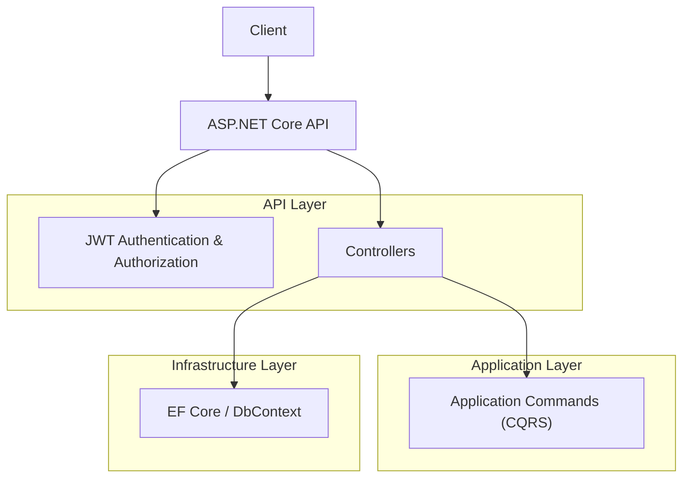
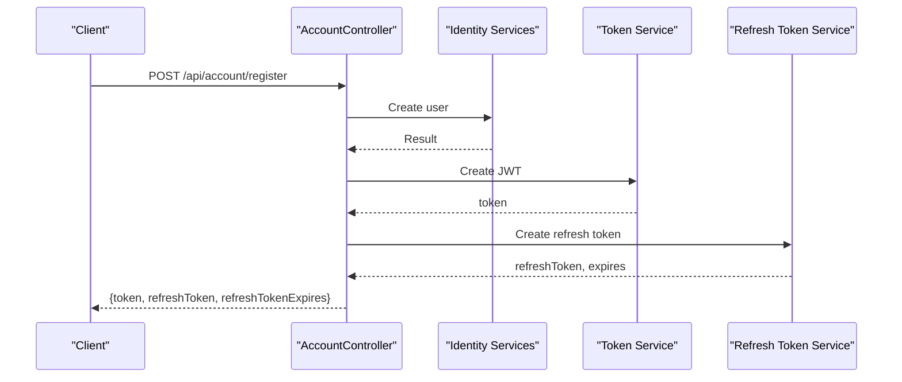
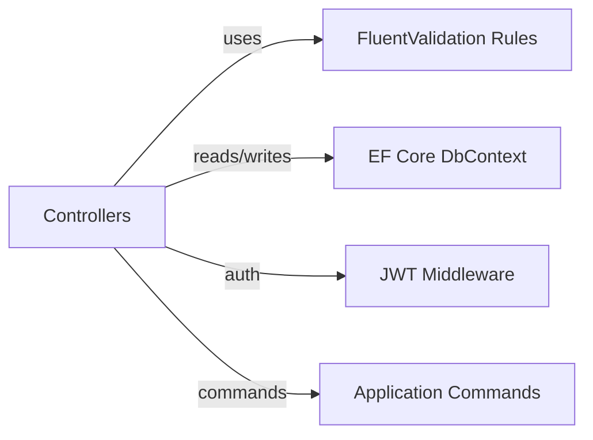
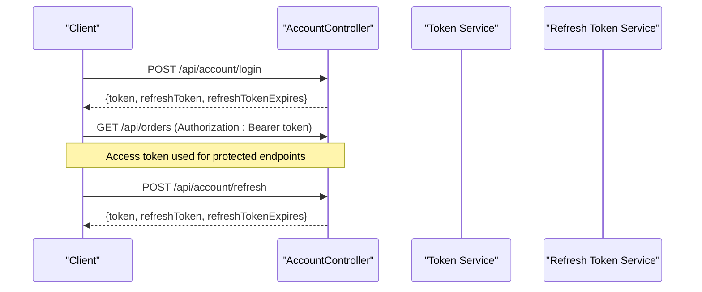

# API Reference

<cite>
**Referenced Files in This Document**
- [Program.cs](file://src/Ecommerce.Api/Program.cs)
- [AccountController.cs](file://src/Ecommerce.Api/Controllers/AccountController.cs)
- [CheckoutController.cs](file://src/Ecommerce.Api/Controllers/CheckoutController.cs)
- [OrdersController.cs](file://src/Ecommerce.Api/Controllers/OrdersController.cs)
- [ProductsController.cs](file://src/Ecommerce.Api/Controllers/ProductsController.cs)
- [CheckoutCommand.cs](file://src/Ecommerce.Application/Commands/Checkout/CheckoutCommand.cs)
- [ApplicationUserDto.cs](file://src/Ecommerce.Application/DTOs/ApplicationUserDto.cs)
- [OrderDto.cs](file://src/Ecommerce.Application/DTOs/OrderDto.cs)
- [ProductDto.cs](file://src/Ecommerce.Application/DTOs/ProductDto.cs)
- [CheckoutCommandFluentValidator.cs](file://src/Ecommerce.Application/Validators/CheckoutCommandFluentValidator.cs)
- [appsettings.Development.json](file://src/Ecommerce.Api/appsettings.Development.json)
</cite>

## Table of Contents
1. [Introduction](#introduction)
2. [Project Structure](#project-structure)
3. [Core Components](#core-components)
4. [Architecture Overview](#architecture-overview)
5. [Detailed Component Analysis](#detailed-component-analysis)
6. [Dependency Analysis](#dependency-analysis)
7. [Performance Considerations](#performance-considerations)
8. [Troubleshooting Guide](#troubleshooting-guide)
9. [Conclusion](#conclusion)
10. [Appendices](#appendices)

## Introduction
This document provides a comprehensive API reference for the RESTful endpoints exposed by the E-commerce backend. It covers HTTP methods, URL patterns, request/response schemas, authentication and authorization requirements, validation rules, pagination, filtering/sorting options where applicable, error responses, and client integration guidance. The API is built on ASP.NET Core with JWT-based authentication and uses Clean Architecture principles.

## Project Structure
The API surface is defined in the Api project controllers, which delegate to application commands or read from the database via EF Core. Authentication and authorization are configured centrally in Program.cs using JWT Bearer tokens. Configuration values such as JWT settings and connection strings are provided via appsettings files.

**Diagram sources**
- [Program.cs:19-55](file://src/Ecommerce.Api/Program.cs#L19-L55)
- [Program.cs:70-74](file://src/Ecommerce.Api/Program.cs#L70-L74)
- [CheckoutController.cs:19-24](file://src/Ecommerce.Api/Controllers/CheckoutController.cs#L19-L24)
- [OrdersController.cs:26-41](file://src/Ecommerce.Api/Controllers/OrdersController.cs#L26-L41)
- [ProductsController.cs:26-40](file://src/Ecommerce.Api/Controllers/ProductsController.cs#L26-L40)

**Section sources**
- [Program.cs:1-77](file://src/Ecommerce.Api/Program.cs#L1-L77)
- [appsettings.Development.json:1-16](file://src/Ecommerce.Api/appsettings.Development.json#L1-L16)

## Core Components
- Account management: register, login, refresh/revoke tokens, get current user profile.
- Checkout: submit an order (idempotent).
- Orders: list orders with pagination; retrieve a single order by ID.
- Products: list products with pagination; retrieve by ID or slug.

Authentication is enforced via JWT Bearer tokens for protected endpoints. Unauthenticated requests to protected routes receive Unauthorized responses. Validation is applied to command payloads using FluentValidation rules.

**Section sources**
- [AccountController.cs:13-114](file://src/Ecommerce.Api/Controllers/AccountController.cs#L13-L114)
- [CheckoutController.cs:8-24](file://src/Ecommerce.Api/Controllers/CheckoutController.cs#L8-L24)
- [OrdersController.cs:13-50](file://src/Ecommerce.Api/Controllers/OrdersController.cs#L13-L50)
- [ProductsController.cs:13-58](file://src/Ecommerce.Api/Controllers/ProductsController.cs#L13-L58)
- [CheckoutCommandFluentValidator.cs:5-17](file://src/Ecommerce.Application/Validators/CheckoutCommandFluentValidator.cs#L5-L17)

## Architecture Overview
The API follows a layered approach:
- Controllers handle HTTP requests and map them to application commands or data access operations.
- Application layer encapsulates business logic through commands and DTOs.
- Infrastructure provides persistence via EF Core and identity services.

**Diagram sources**
- [AccountController.cs:34-42](file://src/Ecommerce.Api/Controllers/AccountController.cs#L34-L42)
- [AccountController.cs:101-107](file://src/Ecommerce.Api/Controllers/AccountController.cs#L101-L107)

## Detailed Component Analysis

### Authentication and Accounts
Base route: /api/account

Endpoints:
- Register
  - Method: POST
  - URL: /api/account/register
  - Authentication: None
  - Request body:
    - email: string (required)
    - password: string (required)
  - Success response: 200 OK
    - token: string (JWT access token)
    - refreshToken: string
    - refreshTokenExpires: string (ISO datetime)
  - Error responses:
    - 400 Bad Request: invalid input or registration failure
- Login
  - Method: POST
  - URL: /api/account/login
  - Authentication: None
  - Request body:
    - email: string (required)
    - password: string (required)
  - Success response: 200 OK
    - token: string (JWT access token)
    - refreshToken: string
    - refreshTokenExpires: string (ISO datetime)
  - Error responses:
    - 401 Unauthorized: invalid credentials or user not found
- Refresh
  - Method: POST
  - URL: /api/account/refresh
  - Authentication: None
  - Request body:
    - refreshToken: string (required)
  - Success response: 200 OK
    - token: string (new JWT access token)
    - refreshToken: string (new refresh token)
    - refreshTokenExpires: string (ISO datetime)
  - Error responses:
    - 400 Bad Request: missing refresh token
    - 401 Unauthorized: invalid or expired refresh token
- Revoke
  - Method: POST
  - URL: /api/account/revoke
  - Authentication: Required (Bearer token)
  - Request body:
    - refreshToken: string (required)
  - Success response: 204 No Content
  - Error responses:
    - 400 Bad Request: missing refresh token
    - 404 Not Found: refresh token not found
- Revoke All
  - Method: POST
  - URL: /api/account/revoke-all
  - Authentication: Required (Bearer token)
  - Request body: none
  - Success response: 204 No Content
  - Error responses:
    - 401 Unauthorized: missing or invalid token
- Get Current User
  - Method: GET
  - URL: /api/account/me
  - Authentication: Required (Bearer token)
  - Response: 200 OK
    - id: string (GUID)
    - email: string
    - username: string
  - Error responses:
    - 401 Unauthorized: missing or invalid token
    - 404 Not Found: user not found

Notes:
- JWT configuration (issuer, signing key) is loaded from configuration. In development, these are set in appsettings.Development.json.
- Protected endpoints require a valid Bearer token in the Authorization header.

Example requests/responses:
- Register
  - Request:
    - POST /api/account/register
    - Body: {"email":"user@example.com","password":"SecurePass1!"}
  - Response:
    - 200 OK: {"token":"...","refreshToken":"...","refreshTokenExpires":"2026-01-01T00:00:00Z"}
- Login
  - Request:
    - POST /api/account/login
    - Body: {"email":"user@example.com","password":"SecurePass1!"}
  - Response:
    - 200 OK: {"token":"...","refreshToken":"...","refreshTokenExpires":"2026-01-01T00:00:00Z"}
- Refresh
  - Request:
    - POST /api/account/refresh
    - Body: {"refreshToken":"..."}
  - Response:
    - 200 OK: {"token":"...","refreshToken":"...","refreshTokenExpires":"2026-01-01T00:00:00Z"}
- Get Current User
  - Request:
    - GET /api/account/me
    - Headers: Authorization: Bearer <access_token>
  - Response:
    - 200 OK: {"id":"...","email":"user@example.com","username":"user@example.com"}

**Section sources**
- [AccountController.cs:34-99](file://src/Ecommerce.Api/Controllers/AccountController.cs#L34-L99)
- [AccountController.cs:117-132](file://src/Ecommerce.Api/Controllers/AccountController.cs#L117-L132)
- [ApplicationUserDto.cs:5-10](file://src/Ecommerce.Application/DTOs/ApplicationUserDto.cs#L5-L10)
- [Program.cs:26-48](file://src/Ecommerce.Api/Program.cs#L26-L48)
- [appsettings.Development.json:8-14](file://src/Ecommerce.Api/appsettings.Development.json#L8-L14)

### Checkout
Base route: /api/checkout

Endpoints:
- Submit Order
  - Method: POST
  - URL: /api/checkout
  - Authentication: Not enforced at controller level (depends on global policy if any)
  - Request body:
    - userId: string (GUID, required)
    - items: array of objects (required, non-empty)
      - productId: string (GUID, required)
      - productVariantId: string (GUID, required)
      - quantity: integer (required, > 0)
    - currency: string (optional, default USD)
    - shippingAddress: string (optional)
    - idempotencyKey: string (optional)
  - Success response: 202 Accepted
    - orderId: string (GUID)
  - Error responses:
    - 400 Bad Request: validation errors (e.g., empty cart, invalid quantities)
    - 422 Unprocessable Entity: domain-level validation failures (if implemented)

Notes:
- Validation rules include:
  - Cart must contain at least one item.
  - Each item quantity must be greater than zero.
- Idempotency support is available via idempotencyKey to prevent duplicate processing.

Example request/response:
- Request:
  - POST /api/checkout
  - Body: {"userId":"...","items":[{"productId":"...","productVariantId":"...","quantity":2}],"currency":"USD","shippingAddress":"123 Main St","idempotencyKey":"unique-key-123"}
- Response:
  - 202 Accepted: {"orderId":"..."}

**Section sources**
- [CheckoutController.cs:19-24](file://src/Ecommerce.Api/Controllers/CheckoutController.cs#L19-L24)
- [CheckoutCommand.cs:6-20](file://src/Ecommerce.Application/Commands/Checkout/CheckoutCommand.cs#L6-L20)
- [CheckoutCommandFluentValidator.cs:5-17](file://src/Ecommerce.Application/Validators/CheckoutCommandFluentValidator.cs#L5-L17)

### Orders
Base route: /api/orders

Endpoints:
- List Orders
  - Method: GET
  - URL: /api/orders
  - Query parameters:
    - page: integer (default 1, minimum 1)
    - pageSize: integer (default 20, maximum 100)
  - Sorting: newest first (by CreatedAt descending)
  - Filtering: none currently supported
  - Response: 200 OK
    - Array of order objects:
      - id: string (GUID)
      - orderNumber: string
      - totalAmount: number (decimal)
      - items: array of order item objects
        - productId: string (GUID)
        - productVariantId: string (GUID)
        - quantity: integer
        - unitPrice: number (decimal)
  - Pagination behavior:
    - Skip = (page - 1) * pageSize
    - Take = pageSize
- Get Order By ID
  - Method: GET
  - URL: /api/orders/{id}
  - Path parameter:
    - id: string (GUID)
  - Response: 200 OK
    - Order object (same schema as above)
  - Error responses:
    - 404 Not Found: order does not exist

Example requests/responses:
- List Orders
  - Request:
    - GET /api/orders?page=1&pageSize=20
  - Response:
    - 200 OK: [{"id":"...","orderNumber":"ORD-001","totalAmount":123.45,"items":[{"productId":"...","productVariantId":"...","quantity":1,"unitPrice":123.45}]}]
- Get Order By ID
  - Request:
    - GET /api/orders/{guid}
  - Response:
    - 200 OK: {"id":"...","orderNumber":"ORD-001","totalAmount":123.45,"items":[...]}

**Section sources**
- [OrdersController.cs:26-50](file://src/Ecommerce.Api/Controllers/OrdersController.cs#L26-L50)
- [OrderDto.cs:6-20](file://src/Ecommerce.Application/DTOs/OrderDto.cs#L6-L20)

### Products
Base route: /api/products

Endpoints:
- List Products
  - Method: GET
  - URL: /api/products
  - Query parameters:
    - page: integer (default 1, minimum 1)
    - pageSize: integer (default 20, maximum 100)
  - Sorting: alphabetical by Name ascending
  - Filtering: none currently supported
  - Response: 200 OK
    - Array of product objects:
      - id: string (GUID)
      - name: string
      - slug: string
      - basePrice: number (decimal)
  - Pagination behavior:
    - Skip = (page - 1) * pageSize
    - Take = pageSize
- Get Product By ID
  - Method: GET
  - URL: /api/products/{id}
  - Path parameter:
    - id: string (GUID)
  - Response: 200 OK
    - Product object (same schema as above)
  - Error responses:
    - 404 Not Found: product does not exist
- Get Product By Slug
  - Method: GET
  - URL: /api/products/slug/{slug}
  - Path parameter:
    - slug: string (required, non-empty)
  - Response: 200 OK
    - Product object (same schema as above)
  - Error responses:
    - 400 Bad Request: missing or empty slug
    - 404 Not Found: product not found

Example requests/responses:
- List Products
  - Request:
    - GET /api/products?page=1&pageSize=20
  - Response:
    - 200 OK: [{"id":"...","name":"Widget","slug":"widget","basePrice":19.99}]
- Get Product By Slug
  - Request:
    - GET /api/products/slug/widget
  - Response:
    - 200 OK: {"id":"...","name":"Widget","slug":"widget","basePrice":19.99}

**Section sources**
- [ProductsController.cs:26-58](file://src/Ecommerce.Api/Controllers/ProductsController.cs#L26-L58)
- [ProductDto.cs:5-11](file://src/Ecommerce.Application/DTOs/ProductDto.cs#L5-L11)

## Dependency Analysis
The API depends on:
- ASP.NET Core MVC controllers for routing and model binding.
- JWT Bearer authentication and authorization middleware.
- EF Core for data access.
- FluentValidation for command payload validation.

**Diagram sources**
- [Program.cs:26-48](file://src/Ecommerce.Api/Program.cs#L26-L48)
- [CheckoutCommandFluentValidator.cs:5-17](file://src/Ecommerce.Application/Validators/CheckoutCommandFluentValidator.cs#L5-L17)
- [OrdersController.cs:26-41](file://src/Ecommerce.Api/Controllers/OrdersController.cs#L26-L41)
- [ProductsController.cs:26-40](file://src/Ecommerce.Api/Controllers/ProductsController.cs#L26-L40)

**Section sources**
- [Program.cs:19-55](file://src/Ecommerce.Api/Program.cs#L19-L55)
- [CheckoutCommandFluentValidator.cs:5-17](file://src/Ecommerce.Application/Validators/CheckoutCommandFluentValidator.cs#L5-L17)

## Performance Considerations
- Use pagination for list endpoints to limit result sets. Default page size is 20 with a maximum of 100.
- Avoid N+1 queries by including related entities when necessary (e.g., Orders.Include(o => o.Items)).
- Use AsNoTracking for read-only queries to improve performance.
- Ensure indexes on frequently queried fields (e.g., Order.CreatedAt, Product.Slug) in the database.

[No sources needed since this section provides general guidance]

## Troubleshooting Guide
Common issues and resolutions:
- 401 Unauthorized on protected endpoints:
  - Ensure Authorization header includes a valid Bearer token.
  - Verify JWT issuer and signing key match server configuration.
- 400 Bad Request on checkout:
  - Validate that items array is non-empty and each item has a positive quantity.
- 404 Not Found:
  - Confirm resource IDs or slugs exist in the database.
- Database connectivity errors:
  - Check connection string in appsettings.Development.json and ensure the database is reachable.

Error response formats:
- Validation errors return 400 Bad Request with details from model binding or FluentValidation.
- Domain exceptions may propagate as appropriate HTTP status codes depending on middleware handling.

**Section sources**
- [CheckoutCommandFluentValidator.cs:5-17](file://src/Ecommerce.Application/Validators/CheckoutCommandFluentValidator.cs#L5-L17)
- [appsettings.Development.json:12-14](file://src/Ecommerce.Api/appsettings.Development.json#L12-L14)

## Conclusion
This API provides core e-commerce functionality with secure authentication, robust validation, and efficient data access patterns. Clients should implement proper error handling, respect pagination limits, and use idempotency keys for critical operations like checkout. For production, ensure strong JWT secrets, HTTPS enforcement, and rate limiting policies are configured.

[No sources needed since this section summarizes without analyzing specific files]

## Appendices

### Authentication Flow
- Register/Login returns a JWT access token and a refresh token.
- Use the access token for authenticated requests.
- When the access token expires, call /api/account/refresh with the refresh token to obtain a new pair.
- Revoke tokens via /api/account/revoke or /api/account/revoke-all to invalidate sessions.

**Diagram sources**
- [AccountController.cs:44-65](file://src/Ecommerce.Api/Controllers/AccountController.cs#L44-L65)
- [AccountController.cs:101-107](file://src/Ecommerce.Api/Controllers/AccountController.cs#L101-L107)

### Pagination, Filtering, and Sorting
- Pagination:
  - page: integer >= 1
  - pageSize: integer between 1 and 100
- Filtering:
  - Currently not implemented for Orders and Products.
- Sorting:
  - Orders: newest first (CreatedAt descending)
  - Products: alphabetical by Name ascending

**Section sources**
- [OrdersController.cs:26-41](file://src/Ecommerce.Api/Controllers/OrdersController.cs#L26-L41)
- [ProductsController.cs:26-40](file://src/Ecommerce.Api/Controllers/ProductsController.cs#L26-L40)

### Rate Limiting, Versioning, and Deprecation Policies
- Rate limiting: Not implemented in the current codebase. Consider adding middleware for production usage.
- Versioning: Not implemented. Base routes do not include version segments. Consider adding version prefixes (e.g., /api/v1) for future evolution.
- Deprecation: Not documented. Plan to communicate deprecation timelines via headers and documentation when introducing breaking changes.

[No sources needed since this section provides general guidance]

### Client Integration Examples
- Using cURL:
  - Register:
    - curl -X POST https://api.example.com/api/account/register -H "Content-Type: application/json" -d '{"email":"user@example.com","password":"SecurePass1!"}'
  - Login:
    - curl -X POST https://api.example.com/api/account/login -H "Content-Type: application/json" -d '{"email":"user@example.com","password":"SecurePass1!"}'
  - Place Order:
    - curl -X POST https://api.example.com/api/checkout -H "Content-Type: application/json" -d '{"userId":"...","items":[{"productId":"...","productVariantId":"...","quantity":2}],"currency":"USD","shippingAddress":"123 Main St","idempotencyKey":"unique-key-123"}'
  - List Products:
    - curl https://api.example.com/api/products?page=1&pageSize=20
  - List Orders:
    - curl https://api.example.com/api/orders?page=1&pageSize=20

- SDK usage patterns:
  - Initialize HTTP client with base URL and default headers.
  - Implement token storage and automatic refresh flow.
  - Handle common HTTP statuses (2xx success, 4xx client errors, 5xx server errors).
  - Map response DTOs to local models.

[No sources needed since this section provides general guidance]