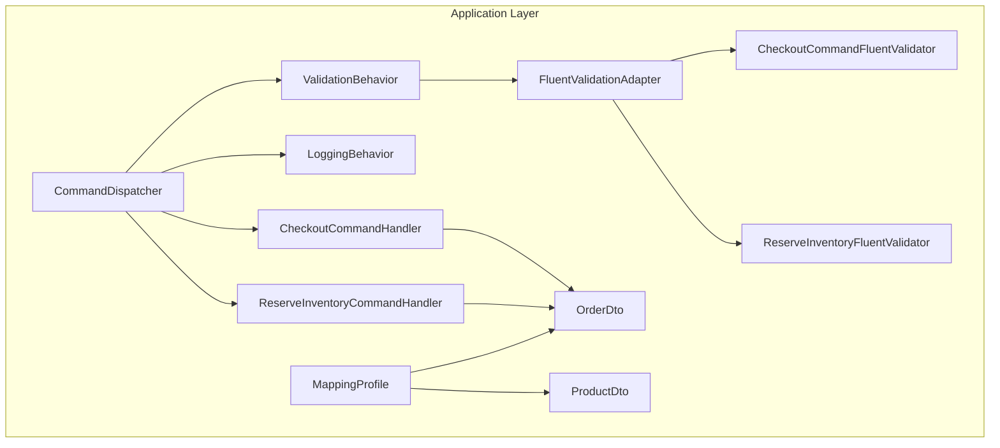
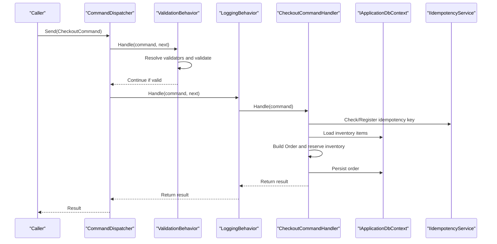
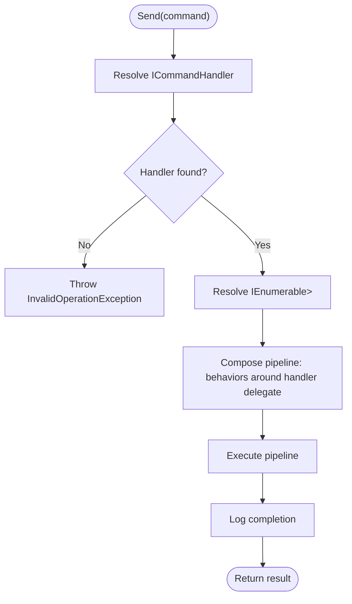
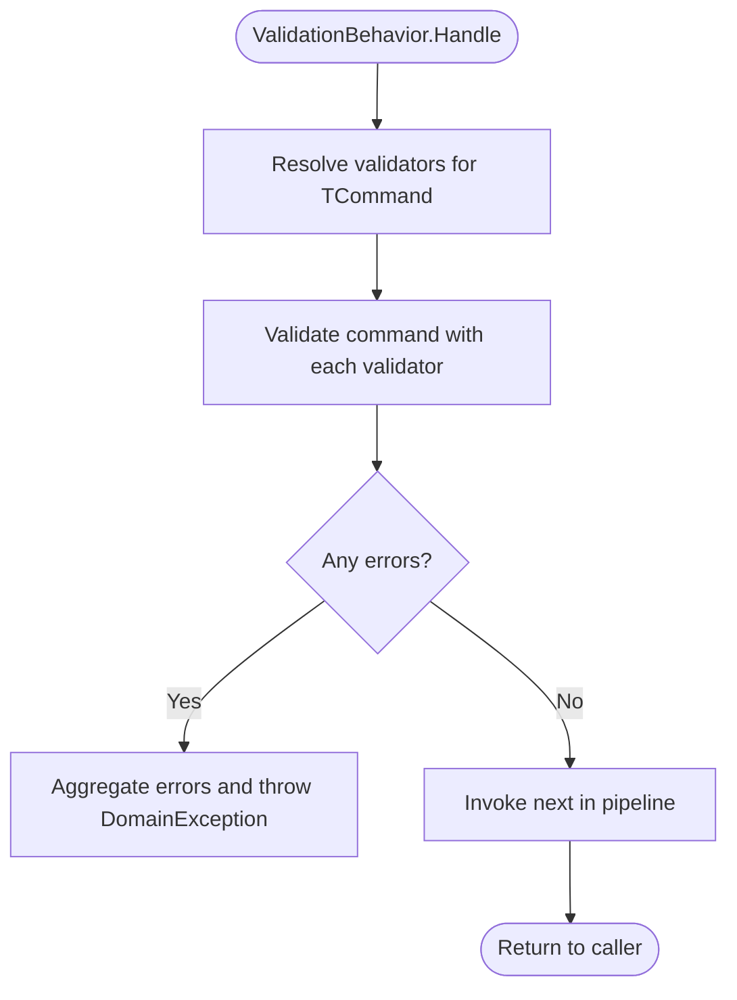
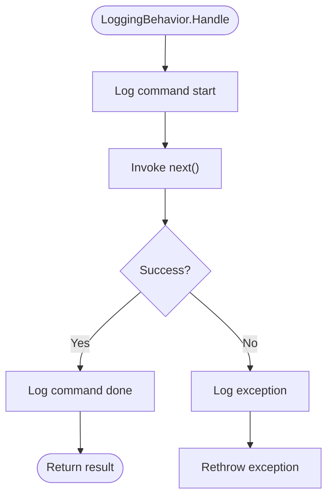
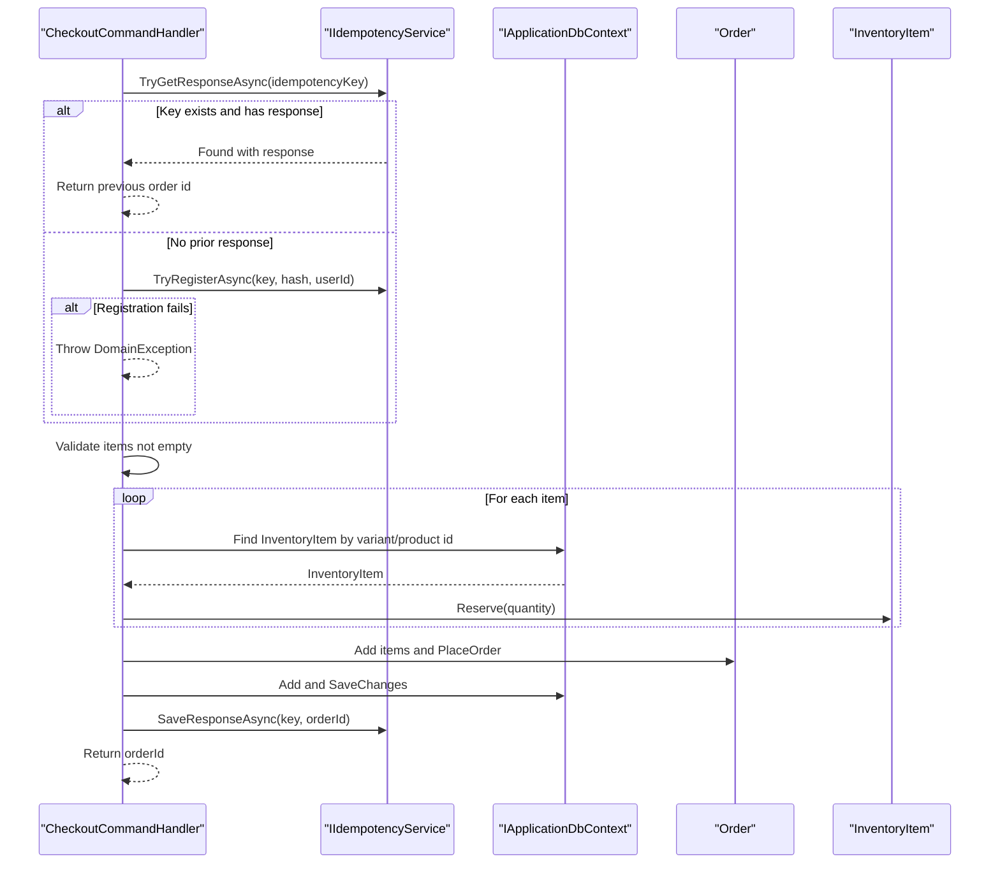
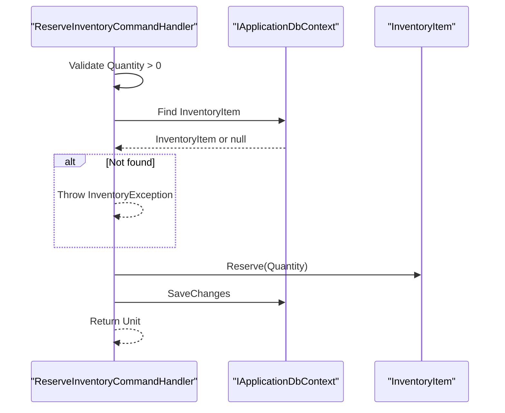
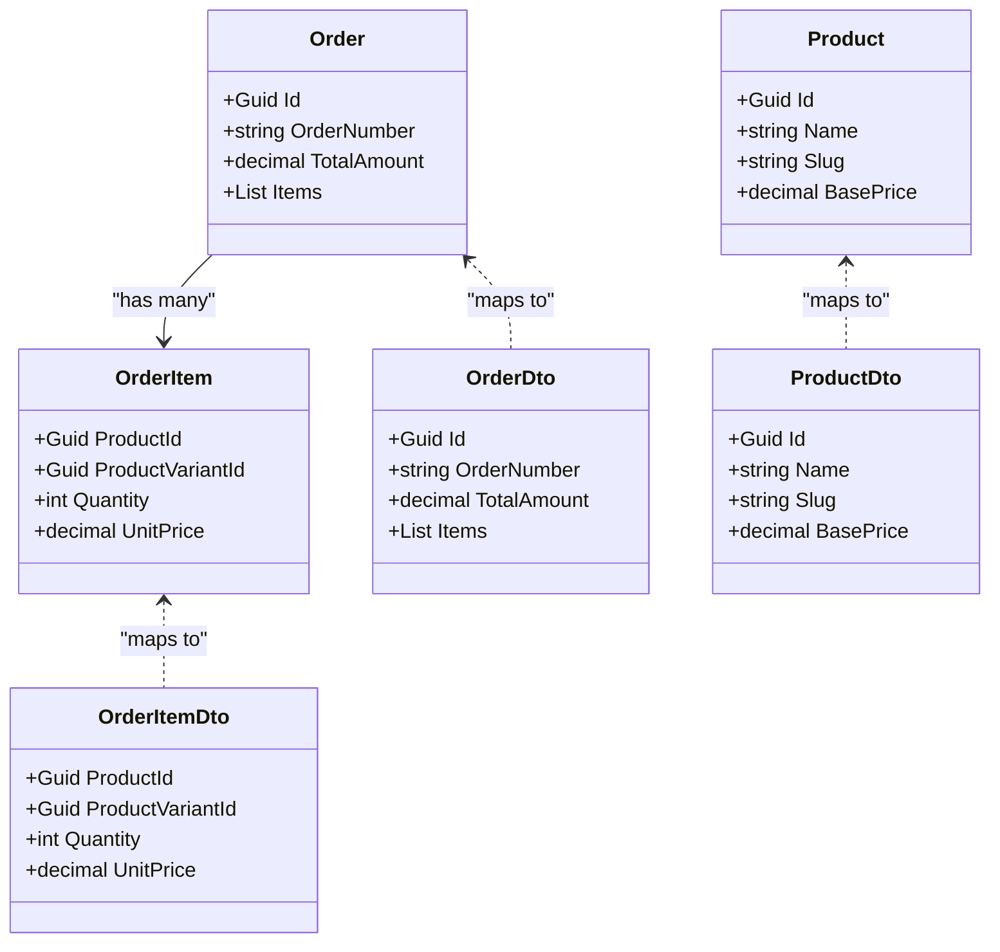
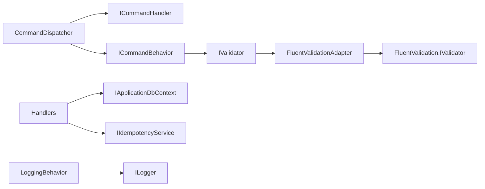

# Application Layer

<cite>
**Referenced Files in This Document**
- [CheckoutCommand.cs](file://src/Ecommerce.Application/Commands/Checkout/CheckoutCommand.cs)
- [CheckoutCommandHandler.cs](file://src/Ecommerce.Application/Commands/Checkout/CheckoutCommandHandler.cs)
- [ReserveInventoryCommand.cs](file://src/Ecommerce.Application/Commands/ReserveInventory/ReserveInventoryCommand.cs)
- [ReserveInventoryCommandHandler.cs](file://src/Ecommerce.Application/Commands/ReserveInventory/ReserveInventoryCommandHandler.cs)
- [CommandDispatcher.cs](file://src/Ecommerce.Application/Common/Commands/CommandDispatcher.cs)
- [ICommand.cs](file://src/Ecommerce.Application/Common/Commands/ICommand.cs)
- [ICommandHandler.cs](file://src/Ecommerce.Application/Common/Commands/ICommandHandler.cs)
- [LoggingBehavior.cs](file://src/Ecommerce.Application/Common/Commands/LoggingBehavior.cs)
- [ValidationBehavior.cs](file://src/Ecommerce.Application/Common/Commands/ValidationBehavior.cs)
- [FluentValidationAdapter.cs](file://src/Ecommerce.Application/Common\Validation/FluentValidationAdapter.cs)
- [CheckoutCommandFluentValidator.cs](file://src/Ecommerce.Application/Validators/CheckoutCommandFluentValidator.cs)
- [ReserveInventoryFluentValidator.cs](file://src/Ecommerce.Application/Validators/ReserveInventoryFluentValidator.cs)
- [OrderDto.cs](file://src/Ecommerce.Application/DTOs/OrderDto.cs)
- [ProductDto.cs](file://src/Ecommerce.Application/DTOs/ProductDto.cs)
- [MappingProfile.cs](file://src/Ecommerce.Application/Mappings/MappingProfile.cs)
</cite>

## Table of Contents
1. Introduction
2. Project Structure
3. Core Components
4. Architecture Overview
5. Detailed Component Analysis
6. Dependency Analysis
7. Performance Considerations
8. Troubleshooting Guide
9. Conclusion

## Introduction
This document explains the Application Layer that implements a Command Query Responsibility Segregation (CQRS) pattern for an e-commerce system. It focuses on command handlers such as CheckoutCommandHandler and ReserveInventoryCommandHandler, the command dispatcher, validation behaviors, logging mechanisms, DTOs, AutoMapper configuration, FluentValidation usage, transaction management, error handling, and cross-cutting concerns. The goal is to show how the application layer coordinates domain operations while maintaining clear separation of concerns.

## Project Structure
The Application Layer is organized around commands and their handlers, common abstractions for dispatching and behaviors, validators, DTOs, and mapping profiles. Commands represent write operations; handlers orchestrate workflows by interacting with domain entities and persistence through interfaces. Behaviors wrap handler execution to provide cross-cutting functionality like validation and logging.

**Diagram sources**
- [CommandDispatcher.cs:1-47](file://src/Ecommerce.Application/Common/Commands/CommandDispatcher.cs#L1-L47)
- [ValidationBehavior.cs:1-41](file://src/Ecommerce.Application/Common/Commands/ValidationBehavior.cs#L1-L41)
- [LoggingBehavior.cs:1-34](file://src/Ecommerce.Application/Common/Commands/LoggingBehavior.cs#L1-L34)
- [CheckoutCommandHandler.cs:1-94](file://src/Ecommerce.Application/Commands/Checkout/CheckoutCommandHandler.cs#L1-L94)
- [ReserveInventoryCommandHandler.cs:1-31](file://src/Ecommerce.Application/Commands/ReserveInventory/ReserveInventoryCommandHandler.cs#L1-L31)
- [CheckoutCommandFluentValidator.cs:1-19](file://src/Ecommerce.Application/Validators/CheckoutCommandFluentValidator.cs#L1-L19)
- [ReserveInventoryFluentValidator.cs:1-14](file://src/Ecommerce.Application/Validators/ReserveInventoryFluentValidator.cs#L1-L14)
- [FluentValidationAdapter.cs:1-28](file://src/Ecommerce.Application/Common\Validation/FluentValidationAdapter.cs#L1-L28)
- [OrderDto.cs:1-22](file://src/Ecommerce.Application/DTOs/OrderDto.cs#L1-L22)
- [ProductDto.cs:1-13](file://src/Ecommerce.Application/DTOs/ProductDto.cs#L1-L13)
- [MappingProfile.cs:1-30](file://src/Ecommerce.Application/Mappings/MappingProfile.cs#L1-L30)

**Section sources**
- [CommandDispatcher.cs:1-47](file://src/Ecommerce.Application/Common/Commands/CommandDispatcher.cs#L1-L47)
- [CheckoutCommandHandler.cs:1-94](file://src/Ecommerce.Application/Commands/Checkout/CheckoutCommandHandler.cs#L1-L94)
- [ReserveInventoryCommandHandler.cs:1-31](file://src/Ecommerce.Application/Commands/ReserveInventory/ReserveInventoryCommandHandler.cs#L1-L31)

## Core Components
- Command Dispatcher: Resolves handlers and executes them within a pipeline of behaviors for validation and logging.
- Handlers: Implement business workflows for specific commands.
- Validation Pipeline: Uses FluentValidation via an adapter and a behavior to validate commands before handler execution.
- Logging Pipeline: Logs entry and exit of command handling and captures exceptions.
- DTOs and Mapping: Define data transfer structures and AutoMapper mappings between domain entities and DTOs.

Key responsibilities:
- Keep handlers focused on orchestrating domain operations without leaking infrastructure details.
- Centralize cross-cutting concerns in behaviors.
- Provide consistent validation and logging across all commands.

**Section sources**
- [CommandDispatcher.cs:1-47](file://src/Ecommerce.Application/Common/Commands/CommandDispatcher.cs#L1-L47)
- [ValidationBehavior.cs:1-41](file://src/Ecommerce.Application/Common/Commands/ValidationBehavior.cs#L1-L41)
- [LoggingBehavior.cs:1-34](file://src/Ecommerce.Application/Common/Commands/LoggingBehavior.cs#L1-L34)
- [FluentValidationAdapter.cs:1-28](file://src/Ecommerce.Application/Common\Validation/FluentValidationAdapter.cs#L1-L28)
- [OrderDto.cs:1-22](file://src/Ecommerce.Application/DTOs/OrderDto.cs#L1-L22)
- [ProductDto.cs:1-13](file://src/Ecommerce.Application/DTOs/ProductDto.cs#L1-L13)
- [MappingProfile.cs:1-30](file://src/Ecommerce.Application/Mappings/MappingProfile.cs#L1-L30)

## Architecture Overview
The command flow uses a dispatcher to locate the appropriate handler and execute it through a pipeline of behaviors. Validation occurs first, then logging wraps the entire operation. Handlers interact with domain entities and persistence via interfaces, ensuring separation from infrastructure.

**Diagram sources**
- [CommandDispatcher.cs:1-47](file://src/Ecommerce.Application/Common/Commands/CommandDispatcher.cs#L1-L47)
- [ValidationBehavior.cs:1-41](file://src/Ecommerce.Application/Common/Commands/ValidationBehavior.cs#L1-L41)
- [LoggingBehavior.cs:1-34](file://src/Ecommerce.Application/Common/Commands/LoggingBehavior.cs#L1-L34)
- [CheckoutCommandHandler.cs:1-94](file://src/Ecommerce.Application/Commands/Checkout/CheckoutCommandHandler.cs#L1-L94)

## Detailed Component Analysis

### Command Dispatcher
- Purpose: Locates the correct ICommandHandler for a given command and executes it through a pipeline of behaviors.
- Behavior resolution: Retrieves registered ICommandBehavior implementations and composes them around the handler call.
- Logging: Logs command start and completion at the dispatcher level.

**Diagram sources**
- [CommandDispatcher.cs:1-47](file://src/Ecommerce.Application/Common/Commands/CommandDispatcher.cs#L1-L47)

**Section sources**
- [CommandDispatcher.cs:1-47](file://src/Ecommerce.Application/Common/Commands/CommandDispatcher.cs#L1-L47)

### Validation Pipeline
- Strategy: A behavior resolves all IValidator<TCommand> instances and validates the command before invoking the handler.
- Adapter: FluentValidation validators are wrapped by FluentValidationAdapter to conform to the project’s IValidator abstraction.
- Error propagation: Validation failures are aggregated and thrown as a domain exception, stopping handler execution.

**Diagram sources**
- [ValidationBehavior.cs:1-41](file://src/Ecommerce.Application/Common/Commands/ValidationBehavior.cs#L1-L41)
- [FluentValidationAdapter.cs:1-28](file://src/Ecommerce.Application/Common\Validation/FluentValidationAdapter.cs#L1-L28)

**Section sources**
- [ValidationBehavior.cs:1-41](file://src/Ecommerce.Application/Common/Commands/ValidationBehavior.cs#L1-L41)
- [FluentValidationAdapter.cs:1-28](file://src/Ecommerce.Application/Common\Validation/FluentValidationAdapter.cs#L1-L28)
- [CheckoutCommandFluentValidator.cs:1-19](file://src/Ecommerce.Application/Validators/CheckoutCommandFluentValidator.cs#L1-L19)
- [ReserveInventoryFluentValidator.cs:1-14](file://src/Ecommerce.Application/Validators/ReserveInventoryFluentValidator.cs#L1-L14)

### Logging Pipeline
- Purpose: Wraps handler execution to log entry, successful completion, and any exceptions.
- Exception handling: Re-throws exceptions after logging to preserve failure semantics.

**Diagram sources**
- [LoggingBehavior.cs:1-34](file://src/Ecommerce.Application/Common/Commands/LoggingBehavior.cs#L1-L34)

**Section sources**
- [LoggingBehavior.cs:1-34](file://src/Ecommerce.Application/Common/Commands/LoggingBehavior.cs#L1-L34)

### CheckoutCommandHandler
- Responsibilities:
  - Enforce idempotency using IIdempotencyService when an idempotency key is provided.
  - Validate input and build an Order entity.
  - Reserve inventory for each item by loading InventoryItem and calling its Reserve method.
  - Persist the order via IApplicationDbContext.
  - Save the idempotency response upon success.
- Error handling: Throws domain-specific exceptions for invalid inputs or missing inventory.

**Diagram sources**
- [CheckoutCommandHandler.cs:1-94](file://src/Ecommerce.Application/Commands/Checkout/CheckoutCommandHandler.cs#L1-L94)

**Section sources**
- [CheckoutCommandHandler.cs:1-94](file://src/Ecommerce.Application/Commands/Checkout/CheckoutCommandHandler.cs#L1-L94)
- [CheckoutCommand.cs:1-22](file://src/Ecommerce.Application/Commands/Checkout/CheckoutCommand.cs#L1-L22)

### ReserveInventoryCommandHandler
- Responsibilities:
  - Validate quantity and existence of the inventory item.
  - Reserve the requested quantity on the domain entity.
  - Persist changes via IApplicationDbContext.
- Error handling: Throws domain-specific exceptions for invalid quantities or missing items.

**Diagram sources**
- [ReserveInventoryCommandHandler.cs:1-31](file://src/Ecommerce.Application/Commands/ReserveInventory/ReserveInventoryCommandHandler.cs#L1-L31)

**Section sources**
- [ReserveInventoryCommandHandler.cs:1-31](file://src/Ecommerce.Application/Commands/ReserveInventory/ReserveInventoryCommandHandler.cs#L1-L31)

### DTOs and AutoMapper Configuration
- DTOs:
  - OrderDto and OrderItemDto represent read models for orders and their items.
  - ProductDto represents product information for queries.
- AutoMapper:
  - MappingProfile defines mappings from domain entities (Order, OrderItem, Product) to DTOs.
  - Mappings ensure consistent projection of domain state into API responses.

**Diagram sources**
- [OrderDto.cs:1-22](file://src/Ecommerce.Application/DTOs/OrderDto.cs#L1-L22)
- [ProductDto.cs:1-13](file://src/Ecommerce.Application/DTOs/ProductDto.cs#L1-L13)
- [MappingProfile.cs:1-30](file://src/Ecommerce.Application/Mappings/MappingProfile.cs#L1-L30)

**Section sources**
- [OrderDto.cs:1-22](file://src/Ecommerce.Application/DTOs/OrderDto.cs#L1-L22)
- [ProductDto.cs:1-13](file://src/Ecommerce.Application/DTOs/ProductDto.cs#L1-L13)
- [MappingProfile.cs:1-30](file://src/Ecommerce.Application/Mappings/MappingProfile.cs#L1-L30)

### Creating New Commands and Handlers
Follow these patterns to add new commands:
- Define a command type in a feature folder under Commands.
- Create a handler implementing ICommandHandler<TCommand, TResult>.
- Add a FluentValidator for the command and register it so the ValidationBehavior can resolve it.
- Use the CommandDispatcher.Send<TCommand, TResult> to invoke the command from higher layers.
- Ensure handlers only coordinate domain logic and persist via IApplicationDbContext.

Example steps:
- Create MyFeatureCommand and MyFeatureCommandHandler.
- Add MyFeatureCommandFluentValidator and wire it up via dependency injection.
- In your API controller or service, call CommandDispatcher.Send(new MyFeatureCommand(), cancellationToken).

**Section sources**
- [ICommandHandler.cs:1-11](file://src/Ecommerce.Application/Common/Commands/ICommandHandler.cs#L1-L11)
- [CommandDispatcher.cs:1-47](file://src/Ecommerce.Application/Common/Commands/CommandDispatcher.cs#L1-L47)
- [ValidationBehavior.cs:1-41](file://src/Ecommerce.Application/Common/Commands/ValidationBehavior.cs#L1-L41)
- [FluentValidationAdapter.cs:1-28](file://src/Ecommerce.Application/Common\Validation/FluentValidationAdapter.cs#L1-L28)

## Dependency Analysis
- CommandDispatcher depends on:
  - Service provider to resolve handlers and behaviors.
  - ILogger for logging.
- Handlers depend on:
  - IApplicationDbContext for persistence.
  - IIdempotencyService for idempotency support (in Checkout).
- ValidationBehavior depends on:
  - IServiceProvider to resolve validators.
  - IValidator<TCommand> implementations (via FluentValidationAdapter).
- LoggingBehavior depends on:
  - ILogger for structured logs.

**Diagram sources**
- [CommandDispatcher.cs:1-47](file://src/Ecommerce.Application/Common/Commands/CommandDispatcher.cs#L1-L47)
- [ValidationBehavior.cs:1-41](file://src/Ecommerce.Application/Common/Commands/ValidationBehavior.cs#L1-L41)
- [FluentValidationAdapter.cs:1-28](file://src/Ecommerce.Application/Common\Validation/FluentValidationAdapter.cs#L1-L28)
- [LoggingBehavior.cs:1-34](file://src/Ecommerce.Application/Common/Commands/LoggingBehavior.cs#L1-L34)
- [CheckoutCommandHandler.cs:1-94](file://src/Ecommerce.Application/Commands/Checkout/CheckoutCommandHandler.cs#L1-L94)
- [ReserveInventoryCommandHandler.cs:1-31](file://src/Ecommerce.Application/Commands/ReserveInventory/ReserveInventoryCommandHandler.cs#L1-L31)

**Section sources**
- [CommandDispatcher.cs:1-47](file://src/Ecommerce.Application/Common/Commands/CommandDispatcher.cs#L1-L47)
- [ValidationBehavior.cs:1-41](file://src/Ecommerce.Application/Common/Commands/ValidationBehavior.cs#L1-L41)
- [LoggingBehavior.cs:1-34](file://src/Ecommerce.Application/Common/Commands/LoggingBehavior.cs#L1-L34)
- [CheckoutCommandHandler.cs:1-94](file://src/Ecommerce.Application/Commands/Checkout/CheckoutCommandHandler.cs#L1-L94)
- [ReserveInventoryCommandHandler.cs:1-31](file://src/Ecommerce.Application/Commands/ReserveInventory/ReserveInventoryCommandHandler.cs#L1-L31)

## Performance Considerations
- Idempotency: Prevents duplicate processing of checkout requests by caching request hashes and results.
- Validation early exit: ValidationBehavior stops further processing when errors are found, reducing unnecessary work.
- Logging overhead: LoggingBehavior adds minimal overhead but provides valuable diagnostics; consider log levels in production.
- Database access: Handlers perform targeted lookups and updates; ensure indexes exist for frequently queried keys (e.g., product variant IDs).

[No sources needed since this section provides general guidance]

## Troubleshooting Guide
Common issues and resolutions:
- No handler registered: Occurs when a command lacks a corresponding handler. Ensure the handler is implemented and registered in DI.
- Validation failures: Aggregated errors are thrown as a domain exception. Check FluentValidation rules and messages.
- Missing inventory: Handlers throw domain exceptions when inventory cannot be found or reserved. Verify inventory records exist and have sufficient stock.
- Idempotency conflicts: If registration fails, the handler throws a domain exception indicating the request is already in flight. Retry with backoff or check existing response.
- Persistence errors: SaveChanges may fail due to constraints or concurrency. Wrap calls in transactions and handle exceptions appropriately.

**Section sources**
- [CommandDispatcher.cs:1-47](file://src/Ecommerce.Application/Common/Commands/CommandDispatcher.cs#L1-L47)
- [ValidationBehavior.cs:1-41](file://src/Ecommerce.Application/Common/Commands/ValidationBehavior.cs#L1-L41)
- [CheckoutCommandHandler.cs:1-94](file://src/Ecommerce.Application/Commands/Checkout/CheckoutCommandHandler.cs#L1-L94)
- [ReserveInventoryCommandHandler.cs:1-31](file://src/Ecommerce.Application/Commands/ReserveInventory/ReserveInventoryCommandHandler.cs#L1-L31)

## Conclusion
The Application Layer implements CQRS with a clean separation between commands and handlers, robust validation and logging via behaviors, and clear DTO/mapping strategies. Handlers coordinate domain operations while remaining decoupled from infrastructure through interfaces. Idempotency and explicit error handling improve reliability. Following the established patterns ensures consistency and maintainability as new features are added.

[No sources needed since this section summarizes without analyzing specific files]