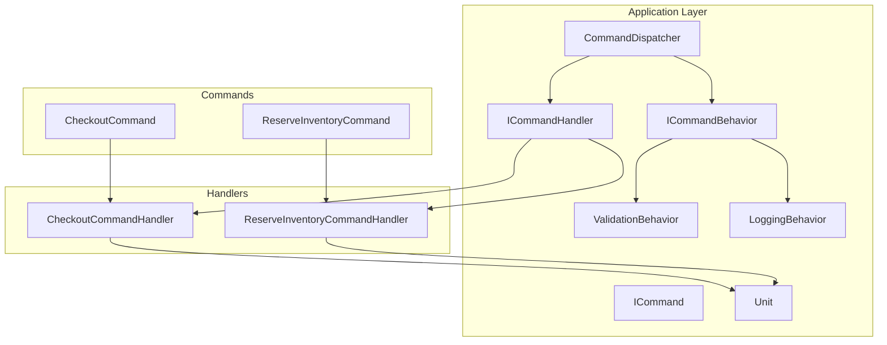
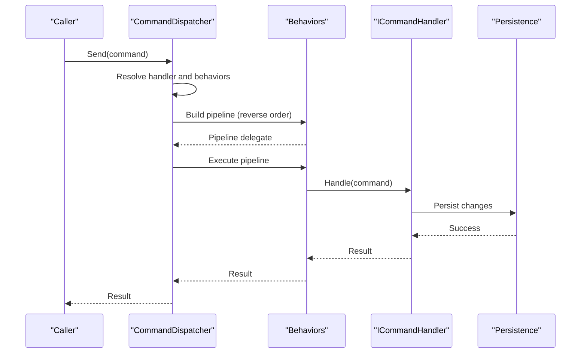
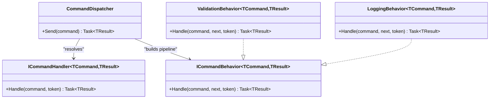
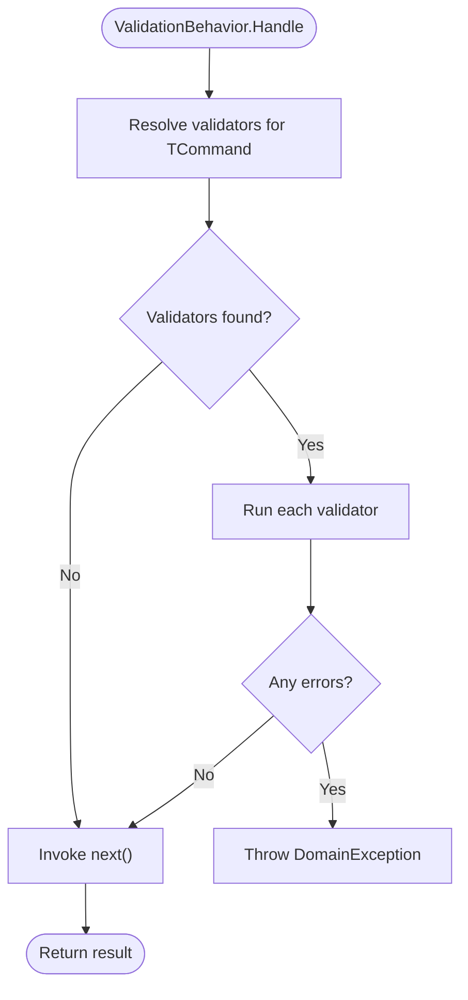
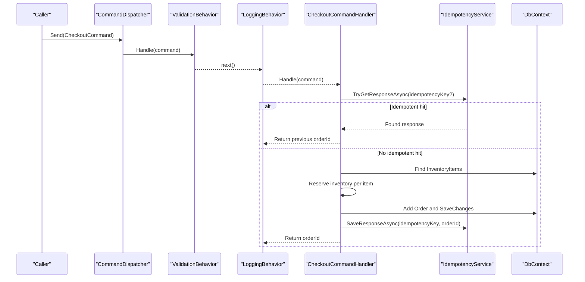
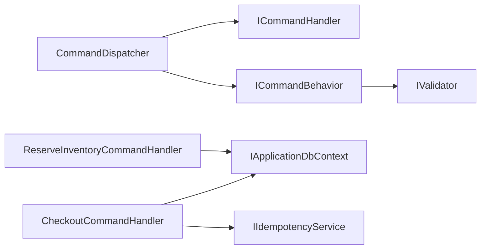

# CQRS Pattern Implementation

<cite>
**Referenced Files in This Document**
- [ICommand.cs](file://src/Ecommerce.Application/Common/Commands/ICommand.cs)
- [ICommandHandler.cs](file://src/Ecommerce.Application/Common/Commands/ICommandHandler.cs)
- [CommandDispatcher.cs](file://src/Ecommerce.Application/Common/Commands/CommandDispatcher.cs)
- [ICommandBehavior.cs](file://src/Ecommerce.Application/Common/Commands/ICommandBehavior.cs)
- [ValidationBehavior.cs](file://src/Ecommerce.Application/Common/Commands/ValidationBehavior.cs)
- [LoggingBehavior.cs](file://src/Ecommerce.Application/Common/Commands/LoggingBehavior.cs)
- [Unit.cs](file://src/Ecommerce.Application/Common/Unit.cs)
- [CheckoutCommand.cs](file://src/Ecommerce.Application/Commands/Checkout/CheckoutCommand.cs)
- [CheckoutCommandHandler.cs](file://src/Ecommerce.Application/Commands/Checkout/CheckoutCommandHandler.cs)
- [ReserveInventoryCommand.cs](file://src/Ecommerce.Application/Commands/ReserveInventory/ReserveInventoryCommand.cs)
- [ReserveInventoryCommandHandler.cs](file://src/Ecommerce.Application/Commands/ReserveInventory/ReserveInventoryCommandHandler.cs)
- [IValidator.cs](file://src/Ecommerce.Application/Common/Validation/IValidator.cs)
- [CheckoutCommandFluentValidator.cs](file://src/Ecommerce.Application/Validators/CheckoutCommandFluentValidator.cs)
</cite>

## Table of Contents
1. Introduction
2. Project Structure
3. Core Components
4. Architecture Overview
5. Detailed Component Analysis
6. Dependency Analysis
7. Performance Considerations
8. Troubleshooting Guide
9. Conclusion

## Introduction
This document explains the Command Query Responsibility Segregation (CQRS) implementation in the Application Layer. It focuses on how commands are modeled, dispatched through a pipeline with cross-cutting behaviors (validation and logging), and handled by dedicated handlers that encapsulate write operations. It also documents the Unit type used for command results without data, common command patterns, lifecycle, error handling strategies, and how read/write separation is maintained.

## Project Structure
The CQRS implementation lives primarily under Ecommerce.Application:
- Common abstractions define the command model, handler interface, behavior pipeline, and Unit result type.
- Commands and handlers implement domain-specific use cases (e.g., checkout, inventory reservation).
- Behaviors provide cross-cutting concerns like validation and logging.
- Validators integrate with FluentValidation to validate command inputs before execution.

**Diagram sources**
- [CommandDispatcher.cs:1-47](file://src/Ecommerce.Application/Common/Commands/CommandDispatcher.cs#L1-L47)
- [ICommandBehavior.cs:1-12](file://src/Ecommerce.Application/Common/Commands/ICommandBehavior.cs#L1-L12)
- [ValidationBehavior.cs:1-41](file://src/Ecommerce.Application/Common/Commands/ValidationBehavior.cs#L1-L41)
- [LoggingBehavior.cs:1-34](file://src/Ecommerce.Application/Common/Commands/LoggingBehavior.cs#L1-L34)
- [ICommandHandler.cs:1-11](file://src/Ecommerce.Application/Common/Commands/ICommandHandler.cs#L1-L11)
- [CheckoutCommand.cs:1-22](file://src/Ecommerce.Application/Commands/Checkout/CheckoutCommand.cs#L1-L22)
- [ReserveInventoryCommand.cs:1-11](file://src/Ecommerce.Application/Commands/ReserveInventory/ReserveInventoryCommand.cs#L1-L11)
- [CheckoutCommandHandler.cs:1-94](file://src/Ecommerce.Application/Commands/Checkout/CheckoutCommandHandler.cs#L1-L94)
- [ReserveInventoryCommandHandler.cs:1-31](file://src/Ecommerce.Application/Commands/ReserveInventory/ReserveInventoryCommandHandler.cs#L1-L31)

**Section sources**
- [CommandDispatcher.cs:1-47](file://src/Ecommerce.Application/Common/Commands/CommandDispatcher.cs#L1-L47)
- [ICommandHandler.cs:1-11](file://src/Ecommerce.Application/Common/Commands/ICommandHandler.cs#L1-L11)
- [ICommandBehavior.cs:1-12](file://src/Ecommerce.Application/Common/Commands/ICommandBehavior.cs#L1-L12)
- [ValidationBehavior.cs:1-41](file://src/Ecommerce.Application/Common/Commands/ValidationBehavior.cs#L1-L41)
- [LoggingBehavior.cs:1-34](file://src/Ecommerce.Application/Common/Commands/LoggingBehavior.cs#L1-L34)
- [CheckoutCommand.cs:1-22](file://src/Ecommerce.Application/Commands/Checkout/CheckoutCommand.cs#L1-L22)
- [ReserveInventoryCommand.cs:1-11](file://src/Ecommerce.Application/Commands/ReserveInventory/ReserveInventoryCommand.cs#L1-L11)
- [CheckoutCommandHandler.cs:1-94](file://src/Ecommerce.Application/Commands/Checkout/CheckoutCommandHandler.cs#L1-L94)
- [ReserveInventoryCommandHandler.cs:1-31](file://src/Ecommerce.Application/Commands/ReserveInventory/ReserveInventoryCommandHandler.cs#L1-L31)

## Core Components
- ICommand<TResult>: Marker interface for commands that produce a typed result.
- ICommandHandler<TCommand, TResult>: Defines asynchronous Handle method for executing a command.
- CommandDispatcher: Resolves handlers and behaviors from DI, builds an async pipeline, and executes it.
- ICommandBehavior<TCommand, TResult>: Pipeline step that wraps handler execution for cross-cutting logic.
- ValidationBehavior: Validates commands via registered validators before invoking the next step.
- LoggingBehavior: Logs entry, success, and errors around command execution.
- Unit: A lightweight result type for commands that do not return meaningful data.

Key responsibilities:
- Separation of concerns: Commands describe intent; handlers perform work; behaviors add cross-cutting concerns.
- Extensibility: New behaviors can be added without changing handlers or commands.
- Testability: Handlers depend on abstractions (e.g., DbContext, services) enabling unit tests.

**Section sources**
- [ICommand.cs:1-7](file://src/Ecommerce.Application/Common/Commands/ICommand.cs#L1-L7)
- [ICommandHandler.cs:1-11](file://src/Ecommerce.Application/Common/Commands/ICommandHandler.cs#L1-L11)
- [CommandDispatcher.cs:1-47](file://src/Ecommerce.Application/Common/Commands/CommandDispatcher.cs#L1-L47)
- [ICommandBehavior.cs:1-12](file://src/Ecommerce.Application/Common/Commands/ICommandBehavior.cs#L1-L12)
- [ValidationBehavior.cs:1-41](file://src/Ecommerce.Application/Common/Commands/ValidationBehavior.cs#L1-L41)
- [LoggingBehavior.cs:1-34](file://src/Ecommerce.Application/Common/Commands/LoggingBehavior.cs#L1-L34)
- [Unit.cs:1-5](file://src/Ecommerce.Application/Common/Unit.cs#L1-L5)

## Architecture Overview
The command pipeline flows as follows:
- The caller invokes CommandDispatcher.Send with a concrete command and expected result type.
- The dispatcher resolves the matching ICommandHandler from DI.
- It collects all registered ICommandBehavior implementations for the command/result pair.
- It constructs a pipeline where each behavior wraps the next step, starting with the handler.
- Execution proceeds through behaviors (e.g., validation, logging) before reaching the handler.
- Results propagate back through the pipeline; exceptions bubble up to callers.

**Diagram sources**
- [CommandDispatcher.cs:20-43](file://src/Ecommerce.Application/Common/Commands/CommandDispatcher.cs#L20-L43)
- [ValidationBehavior.cs:17-38](file://src/Ecommerce.Application/Common/Commands/ValidationBehavior.cs#L17-L38)
- [LoggingBehavior.cs:17-31](file://src/Ecommerce.Application/Common/Commands/LoggingBehavior.cs#L17-L31)
- [CheckoutCommandHandler.cs:22-90](file://src/Ecommerce.Application/Commands/Checkout/CheckoutCommandHandler.cs#L22-L90)

## Detailed Component Analysis

### Command Abstractions and Pipeline
- ICommand<TResult>: A marker interface to identify commands that return a result.
- ICommandHandler<TCommand, TResult>: Asynchronous contract for command execution.
- ICommandBehavior<TCommand, TResult>: Allows wrapping command execution with cross-cutting logic.
- CommandDispatcher: Central orchestrator that:
  - Logs dispatching and completion.
  - Resolves handler and behaviors via IServiceProvider.
  - Builds a pipeline using reverse aggregation so outermost behaviors wrap inner ones.
  - Executes the pipeline and returns the result.

**Diagram sources**
- [CommandDispatcher.cs:1-47](file://src/Ecommerce.Application/Common/Commands/CommandDispatcher.cs#L1-L47)
- [ICommandHandler.cs:1-11](file://src/Ecommerce.Application/Common/Commands/ICommandHandler.cs#L1-L11)
- [ICommandBehavior.cs:1-12](file://src/Ecommerce.Application/Common/Commands/ICommandBehavior.cs#L1-L12)
- [ValidationBehavior.cs:1-41](file://src/Ecommerce.Application/Common/Commands/ValidationBehavior.cs#L1-L41)
- [LoggingBehavior.cs:1-34](file://src/Ecommerce.Application/Common/Commands/LoggingBehavior.cs#L1-L34)

**Section sources**
- [CommandDispatcher.cs:20-43](file://src/Ecommerce.Application/Common/Commands/CommandDispatcher.cs#L20-L43)
- [ICommandHandler.cs:1-11](file://src/Ecommerce.Application/Common/Commands/ICommandHandler.cs#L1-L11)
- [ICommandBehavior.cs:1-12](file://src/Ecommerce.Application/Common/Commands/ICommandBehavior.cs#L1-L12)

### Validation Behavior and Validators
- ValidationBehavior<TCommand, TResult> resolves all IValidator<TCommand> instances and runs them before invoking the next pipeline step.
- If any validator reports invalid input, it aggregates errors and throws a DomainException.
- Validators can be implemented with FluentValidation and adapted via a shared validation abstraction.

**Diagram sources**
- [ValidationBehavior.cs:17-38](file://src/Ecommerce.Application/Common/Commands/ValidationBehavior.cs#L17-L38)
- [IValidator.cs:1-16](file://src/Ecommerce.Application/Common/Validation/IValidator.cs#L1-L16)

**Section sources**
- [ValidationBehavior.cs:1-41](file://src/Ecommerce.Application/Common/Commands/ValidationBehavior.cs#L1-L41)
- [IValidator.cs:1-16](file://src/Ecommerce.Application/Common/Validation/IValidator.cs#L1-L16)
- [CheckoutCommandFluentValidator.cs:1-19](file://src/Ecommerce.Application/Validators/CheckoutCommandFluentValidator.cs#L1-L19)

### Logging Behavior
- LoggingBehavior<TCommand, TResult> logs command start and successful completion.
- On exceptions, it logs the error and rethrows to preserve failure semantics.

**Section sources**
- [LoggingBehavior.cs:1-34](file://src/Ecommerce.Application/Common/Commands/LoggingBehavior.cs#L1-L34)

### Unit Type
- Unit is a minimal struct used as a result type for commands that do not need to return data, providing a consistent generic pattern across handlers.

**Section sources**
- [Unit.cs:1-5](file://src/Ecommerce.Application/Common/Unit.cs#L1-L5)

### Command Examples

#### Checkout Command and Handler
- CheckoutCommand carries user context, items, currency, shipping address, and optional idempotency key.
- CheckoutCommandHandler:
  - Enforces idempotency when a key is provided.
  - Validates items presence.
  - Builds an Order entity, reserves inventory per item, persists changes, and records idempotency response.
  - Returns the created order identifier.

**Diagram sources**
- [CheckoutCommandHandler.cs:22-90](file://src/Ecommerce.Application/Commands/Checkout/CheckoutCommandHandler.cs#L22-L90)
- [CommandDispatcher.cs:20-43](file://src/Ecommerce.Application/Common/Commands/CommandDispatcher.cs#L20-L43)
- [ValidationBehavior.cs:17-38](file://src/Ecommerce.Application/Common/Commands/ValidationBehavior.cs#L17-L38)
- [LoggingBehavior.cs:17-31](file://src/Ecommerce.Application/Common/Commands/LoggingBehavior.cs#L17-L31)

**Section sources**
- [CheckoutCommand.cs:1-22](file://src/Ecommerce.Application/Commands/Checkout/CheckoutCommand.cs#L1-L22)
- [CheckoutCommandHandler.cs:1-94](file://src/Ecommerce.Application/Commands/Checkout/CheckoutCommandHandler.cs#L1-L94)

#### Reserve Inventory Command and Handler
- ReserveInventoryCommand specifies an inventory item and quantity.
- ReserveInventoryCommandHandler validates quantity, locates the inventory item, reserves stock, persists changes, and returns Unit.

**Section sources**
- [ReserveInventoryCommand.cs:1-11](file://src/Ecommerce.Application/Commands/ReserveInventory/ReserveInventoryCommand.cs#L1-L11)
- [ReserveInventoryCommandHandler.cs:1-31](file://src/Ecommerce.Application/Commands/ReserveInventory/ReserveInventoryCommandHandler.cs#L1-L31)

### Creating New Commands and Handlers
Follow these established patterns:
- Define a command class with necessary properties. Optionally implement ICommand<TResult> if you want a marker.
- Implement ICommandHandler<TCommand, TResult>:
  - For no-result commands, use Unit as TResult.
  - For result-producing commands, choose an appropriate type (e.g., Guid).
- Register the handler and any validators in dependency injection (outside this layer).
- Use CommandDispatcher.Send<TCommand, TResult>(command) to execute.
- Add behaviors by registering ICommandBehavior<TCommand, TResult> implementations if needed.

Guidelines:
- Keep handlers focused on orchestration and persistence; avoid UI or infrastructure details.
- Use Unit for side-effect-only commands to keep signatures uniform.
- Prefer validators for input validation; throw domain exceptions for business rule violations.

[No sources needed since this section provides general guidance]

## Dependency Analysis
- CommandDispatcher depends on:
  - IServiceProvider to resolve handlers and behaviors.
  - ILogger for structured logging.
- Handlers depend on:
  - IApplicationDbContext for persistence.
  - External services (e.g., IIdempotencyService) for cross-cutting features.
- Behaviors depend on:
  - IServiceProvider to resolve validators.
  - ILogger for logging.

**Diagram sources**
- [CommandDispatcher.cs:1-47](file://src/Ecommerce.Application/Common/Commands/CommandDispatcher.cs#L1-L47)
- [CheckoutCommandHandler.cs:1-94](file://src/Ecommerce.Application/Commands/Checkout/CheckoutCommandHandler.cs#L1-L94)
- [ReserveInventoryCommandHandler.cs:1-31](file://src/Ecommerce.Application/Commands/ReserveInventory/ReserveInventoryCommandHandler.cs#L1-L31)
- [IValidator.cs:1-16](file://src/Ecommerce.Application/Common/Validation/IValidator.cs#L1-L16)

**Section sources**
- [CommandDispatcher.cs:1-47](file://src/Ecommerce.Application/Common/Commands/CommandDispatcher.cs#L1-L47)
- [CheckoutCommandHandler.cs:1-94](file://src/Ecommerce.Application/Commands/Checkout/CheckoutCommandHandler.cs#L1-L94)
- [ReserveInventoryCommandHandler.cs:1-31](file://src/Ecommerce.Application/Commands/ReserveInventory/ReserveInventoryCommandHandler.cs#L1-L31)
- [IValidator.cs:1-16](file://src/Ecommerce.Application/Common/Validation/IValidator.cs#L1-L16)

## Performance Considerations
- Pipeline overhead: Each behavior adds a small async call stack. Keep behaviors lightweight and efficient.
- Validation cost: Ensure validators are fast and avoid heavy computations; prefer simple rules.
- Database access: Batch operations where possible; minimize round-trips within handlers.
- Idempotency: Use idempotency keys to prevent duplicate processing and reduce redundant work.
- Logging: Use structured logging selectively to avoid excessive I/O.

[No sources needed since this section provides general guidance]

## Troubleshooting Guide
Common issues and remedies:
- No handler registered: Occurs when a handler is not registered in DI. Ensure all ICommandHandler<TCommand, TResult> implementations are registered.
- Validation failures: ValidationBehavior aggregates errors and throws a DomainException. Check validators for the command and ensure they are registered.
- Idempotency conflicts: When an idempotency key is already in use, the handler may detect a concurrent request and either return a cached response or throw a DomainException. Review idempotency service configuration and retry strategies.
- Missing inventory: Handlers throw domain exceptions when required entities are not found. Verify data setup and referential integrity.

Error propagation:
- Behaviors log errors but generally rethrow to preserve failure semantics.
- Handlers throw domain exceptions for business rule violations; callers should handle appropriately.

**Section sources**
- [CommandDispatcher.cs:20-43](file://src/Ecommerce.Application/Common/Commands/CommandDispatcher.cs#L20-L43)
- [ValidationBehavior.cs:17-38](file://src/Ecommerce.Application/Common/Commands/ValidationBehavior.cs#L17-L38)
- [LoggingBehavior.cs:17-31](file://src/Ecommerce.Application/Common/Commands/LoggingBehavior.cs#L17-L31)
- [CheckoutCommandHandler.cs:22-90](file://src/Ecommerce.Application/Commands/Checkout/CheckoutCommandHandler.cs#L22-L90)
- [ReserveInventoryCommandHandler.cs:17-27](file://src/Ecommerce.Application/Commands/ReserveInventory/ReserveInventoryCommandHandler.cs#L17-L27)

## Conclusion
The Application Layer implements CQRS with a clear separation between commands (write intent) and their handlers (write execution). The CommandDispatcher centralizes dispatching and composes a pipeline of behaviors for validation and logging. Commands are strongly typed, handlers are testable via abstractions, and Unit standardizes no-result outcomes. This design supports extensibility, maintainability, and robust error handling while keeping read and write paths distinct.

[No sources needed since this section summarizes without analyzing specific files]