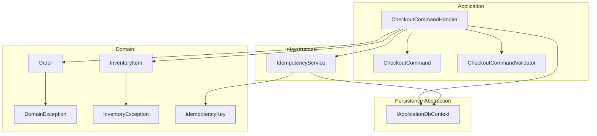
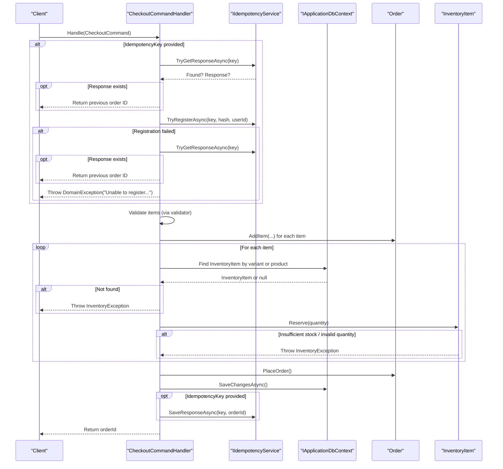
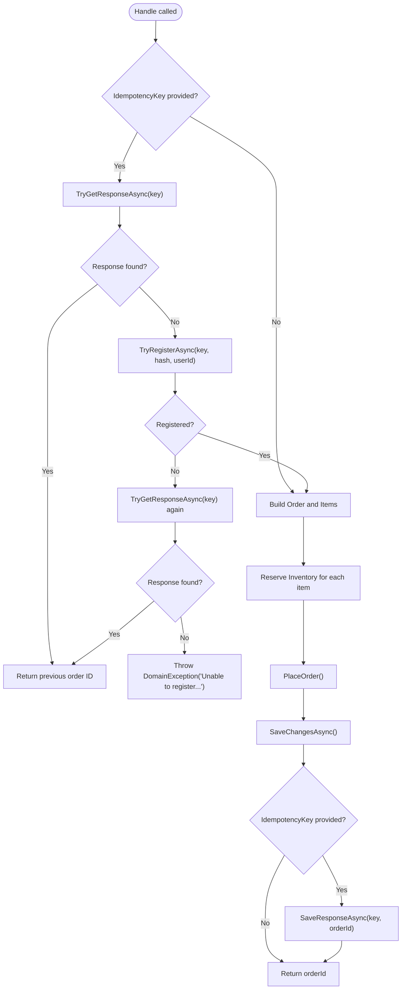
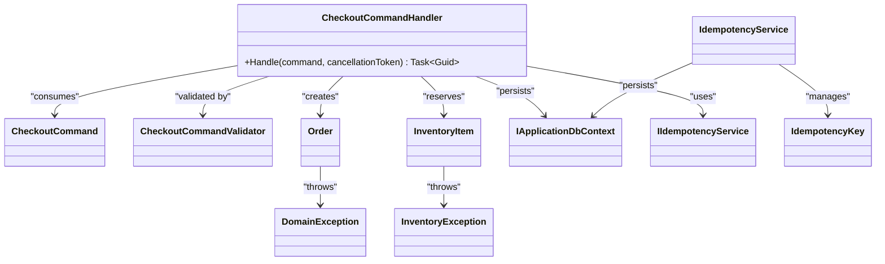

# Checkout Command Handler

<cite>
**Referenced Files in This Document**
- [CheckoutCommandHandler.cs](file://src/Ecommerce.Application/Commands/Checkout/CheckoutCommandHandler.cs)
- [CheckoutCommand.cs](file://src/Ecommerce.Application/Commands/Checkout/CheckoutCommand.cs)
- [CheckoutCommandValidator.cs](file://src/Ecommerce.Application/Commands/Checkout/CheckoutCommandValidator.cs)
- [Order.cs](file://src/Ecommerce.Domain/Entities/Order.cs)
- [InventoryItem.cs](file://src/Ecommerce.Domain/Entities/InventoryItem.cs)
- [IApplicationDbContext.cs](file://src/Ecommerce.Application/Interfaces/IApplicationDbContext.cs)
- [IIdempotencyService.cs](file://src/Ecommerce.Application/Interfaces/IIdempotencyService.cs)
- [IdempotencyService.cs](file://src/Ecommerce.Infrastructure/Services/IdempotencyService.cs)
- [DomainException.cs](file://src/Ecommerce.Domain/Exceptions/DomainException.cs)
- [InventoryException.cs](file://src/Ecommerce.Domain/Exceptions/InventoryException.cs)
- [IdempotencyKey.cs](file://src/Ecommerce.Domain/Entities/IdempotencyKey.cs)
- [CheckoutHandlerTests.cs](file://tests/Ecommerce.Application.Tests/CheckoutHandlerTests.cs)
- [CheckoutIdempotencyTests.cs](file://tests/Ecommerce.Application.Tests/CheckoutIdempotencyTests.cs)
</cite>

## Table of Contents
1. Introduction
2. Project Structure
3. Core Components
4. Architecture Overview
5. Detailed Component Analysis
6. Dependency Analysis
7. Performance Considerations
8. Troubleshooting Guide
9. Conclusion

## Introduction
This document explains the CheckoutCommandHandler, which orchestrates the end-to-end checkout workflow: validating input, enforcing idempotency to prevent duplicate orders, building and placing an Order with items, reserving inventory, persisting changes, and returning a stable order identifier. It also covers integration points with IApplicationDbContext for persistence, IIdempotencyService for request deduplication, and domain entities such as Order and InventoryItem. Error handling strategies using DomainException and InventoryException are documented, along with command structure, validation rules, response patterns, performance considerations, and best practices for concurrent checkout requests.

## Project Structure
The checkout feature spans Application (command and handler), Domain (entities and exceptions), Infrastructure (idempotency service implementation), and Tests. The handler composes domain logic via entities and persists state through a database abstraction.

**Diagram sources**
- [CheckoutCommandHandler.cs:11-90](file://src/Ecommerce.Application/Commands/Checkout/CheckoutCommandHandler.cs#L11-L90)
- [CheckoutCommand.cs:6-20](file://src/Ecommerce.Application/Commands/Checkout/CheckoutCommand.cs#L6-L20)
- [CheckoutCommandValidator.cs:6-30](file://src/Ecommerce.Application/Commands/Checkout/CheckoutCommandValidator.cs#L6-L30)
- [Order.cs:8-102](file://src/Ecommerce.Domain/Entities/Order.cs#L8-L102)
- [InventoryItem.cs:6-67](file://src/Ecommerce.Domain/Entities/InventoryItem.cs#L6-L67)
- [IApplicationDbContext.cs:8-13](file://src/Ecommerce.Application/Interfaces/IApplicationDbContext.cs#L8-L13)
- [IIdempotencyService.cs:6-11](file://src/Ecommerce.Application/Interfaces/IIdempotencyService.cs#L6-L11)
- [IdempotencyService.cs:10-54](file://src/Ecommerce.Infrastructure/Services/IdempotencyService.cs#L10-L54)
- [IdempotencyKey.cs:5-15](file://src/Ecommerce.Domain/Entities/IdempotencyKey.cs#L5-L15)

**Section sources**
- [CheckoutCommandHandler.cs:11-90](file://src/Ecommerce.Application/Commands/Checkout/CheckoutCommandHandler.cs#L11-L90)
- [CheckoutCommand.cs:6-20](file://src/Ecommerce.Application/Commands/Checkout/CheckoutCommand.cs#L6-L20)
- [CheckoutCommandValidator.cs:6-30](file://src/Ecommerce.Application/Commands/Checkout/CheckoutCommandValidator.cs#L6-L30)
- [Order.cs:8-102](file://src/Ecommerce.Domain/Entities/Order.cs#L8-L102)
- [InventoryItem.cs:6-67](file://src/Ecommerce.Domain/Entities/InventoryItem.cs#L6-L67)
- [IApplicationDbContext.cs:8-13](file://src/Ecommerce.Application/Interfaces/IApplicationDbContext.cs#L8-L13)
- [IIdempotencyService.cs:6-11](file://src/Ecommerce.Application/Interfaces/IIdempotencyService.cs#L6-L11)
- [IdempotencyService.cs:10-54](file://src/Ecommerce.Infrastructure/Services/IdempotencyService.cs#L10-L54)
- [IdempotencyKey.cs:5-15](file://src/Ecommerce.Domain/Entities/IdempotencyKey.cs#L5-L15)

## Core Components
- CheckoutCommand: Carries UserId, Items list, Currency, ShippingAddress, and optional IdempotencyKey. Each item includes ProductId, ProductVariantId, and Quantity.
- CheckoutCommandValidator: Ensures at least one item and that all quantities are greater than zero.
- CheckoutCommandHandler: Orchestrates idempotency checks, builds Order, reserves inventory, places the order, persists, and returns the order ID.
- Order: Domain entity that manages items, totals, and lifecycle transitions including PlaceOrder.
- InventoryItem: Domain entity that enforces stock constraints and supports Reserve and Release operations.
- IApplicationDbContext: Abstraction over EF DbContext exposing InventoryItems and SaveChangesAsync.
- IIdempotencyService and IdempotencyService: Provide TryGetResponseAsync, TryRegisterAsync, and SaveResponseAsync backed by IdempotencyKey records.
- Exceptions: DomainException and InventoryException represent business rule violations and inventory issues.

**Section sources**
- [CheckoutCommand.cs:6-20](file://src/Ecommerce.Application/Commands/Checkout/CheckoutCommand.cs#L6-L20)
- [CheckoutCommandValidator.cs:6-30](file://src/Ecommerce.Application/Commands/Checkout/CheckoutCommandValidator.cs#L6-L30)
- [CheckoutCommandHandler.cs:11-90](file://src/Ecommerce.Application/Commands/Checkout/CheckoutCommandHandler.cs#L11-L90)
- [Order.cs:8-102](file://src/Ecommerce.Domain/Entities/Order.cs#L8-L102)
- [InventoryItem.cs:6-67](file://src/Ecommerce.Domain/Entities/InventoryItem.cs#L6-L67)
- [IApplicationDbContext.cs:8-13](file://src/Ecommerce.Application/Interfaces/IApplicationDbContext.cs#L8-L13)
- [IIdempotencyService.cs:6-11](file://src/Ecommerce.Application/Interfaces/IIdempotencyService.cs#L6-L11)
- [IdempotencyService.cs:10-54](file://src/Ecommerce.Infrastructure/Services/IdempotencyService.cs#L10-L54)
- [DomainException.cs:5-8](file://src/Ecommerce.Domain/Exceptions/DomainException.cs#L5-L8)
- [InventoryException.cs:5-8](file://src/Ecommerce.Domain/Exceptions/InventoryException.cs#L5-L8)

## Architecture Overview
The handler follows a clear sequence: validate input, enforce idempotency, build and place the order, reserve inventory, persist, and return the order ID. Idempotency is enforced via a key-based registration and response caching mechanism.

**Diagram sources**
- [CheckoutCommandHandler.cs:22-90](file://src/Ecommerce.Application/Commands/Checkout/CheckoutCommandHandler.cs#L22-L90)
- [IIdempotencyService.cs:6-11](file://src/Ecommerce.Application/Interfaces/IIdempotencyService.cs#L6-L11)
- [IdempotencyService.cs:19-54](file://src/Ecommerce.Infrastructure/Services/IdempotencyService.cs#L19-L54)
- [Order.cs:36-102](file://src/Ecommerce.Domain/Entities/Order.cs#L36-L102)
- [InventoryItem.cs:29-40](file://src/Ecommerce.Domain/Entities/InventoryItem.cs#L29-L40)

## Detailed Component Analysis

### CheckoutCommandHandler
Responsibilities:
- Idempotency enforcement: checks for existing responses, registers attempts, and prevents concurrent duplicates.
- Validation gate: ensures items exist and have valid quantities (validator).
- Order creation: constructs Order and adds items.
- Inventory reservation: locates InventoryItem by variant or product and reserves stock.
- Persistence: persists Order and updates idempotency record with the final response.
- Response: returns the created order’s ID.

Key behaviors:
- If IdempotencyKey is present, it first tries to retrieve a cached response; if found, returns immediately.
- Registers the attempt with a simple request hash; on failure, retries retrieval before throwing DomainException.
- Builds Order and iterates items to add them and reserve inventory.
- Calls PlaceOrder to transition state and update totals.
- Persists changes and saves the response into idempotency storage when applicable.

Error handling:
- Throws DomainException for missing items or idempotency registration failures.
- Throws InventoryException when inventory cannot be found or reserved.

Transaction boundaries:
- The current implementation performs multiple asynchronous calls without an explicit transaction wrapper. In production, wrap the critical section (order creation, inventory reservations, persistence, and idempotency response save) in a single unit-of-work or distributed transaction to ensure consistency.

Performance considerations:
- Avoid repeated lookups by batching inventory queries where possible.
- Ensure indexes on IdempotencyKeys.Key and InventoryItem.ProductVariantId/ProductId for fast lookups.
- Use cancellation tokens consistently to support long-running cancellations.

**Section sources**
- [CheckoutCommandHandler.cs:22-90](file://src/Ecommerce.Application/Commands/Checkout/CheckoutCommandHandler.cs#L22-L90)
- [CheckoutCommandValidator.cs:8-30](file://src/Ecommerce.Application/Commands/Checkout/CheckoutCommandValidator.cs#L8-L30)
- [Order.cs:36-102](file://src/Ecommerce.Domain/Entities/Order.cs#L36-L102)
- [InventoryItem.cs:29-40](file://src/Ecommerce.Domain/Entities/InventoryItem.cs#L29-L40)
- [IIdempotencyService.cs:6-11](file://src/Ecommerce.Application/Interfaces/IIdempotencyService.cs#L6-L11)
- [IdempotencyService.cs:19-54](file://src/Ecommerce.Infrastructure/Services/IdempotencyService.cs#L19-L54)

### CheckoutCommand and Validation
Command structure:
- UserId: identifies the requester.
- Items: list of CheckoutItem with ProductId, ProductVariantId, Quantity.
- Currency: defaults to USD.
- ShippingAddress: optional shipping details.
- IdempotencyKey: optional unique key to deduplicate identical requests.

Validation rules:
- At least one item must be present.
- All item quantities must be greater than zero.

These rules are enforced by the validator and complement runtime checks in the handler.

**Section sources**
- [CheckoutCommand.cs:6-20](file://src/Ecommerce.Application/Commands/Checkout/CheckoutCommand.cs#L6-L20)
- [CheckoutCommandValidator.cs:8-30](file://src/Ecommerce.Application/Commands/Checkout/CheckoutCommandValidator.cs#L8-L30)

### Domain Entities: Order and InventoryItem
Order:
- Manages items collection and recalculation of totals.
- PlaceOrder sets status fields and timestamps, ensuring non-empty items.

InventoryItem:
- Tracks available stock and reserved quantities.
- Reserve enforces positive quantities and availability constraints, optionally allowing backorders based on configuration.

These entities encapsulate business invariants and throw domain-specific exceptions when violated.

**Section sources**
- [Order.cs:8-102](file://src/Ecommerce.Domain/Entities/Order.cs#L8-L102)
- [InventoryItem.cs:6-67](file://src/Ecommerce.Domain/Entities/InventoryItem.cs#L6-L67)
- [DomainException.cs:5-8](file://src/Ecommerce.Domain/Exceptions/DomainException.cs#L5-L8)
- [InventoryException.cs:5-8](file://src/Ecommerce.Domain/Exceptions/InventoryException.cs#L5-L8)

### Idempotency Flow
The idempotency flow ensures that duplicate requests with the same key do not create multiple orders.

**Diagram sources**
- [CheckoutCommandHandler.cs:22-90](file://src/Ecommerce.Application/Commands/Checkout/CheckoutCommandHandler.cs#L22-L90)
- [IdempotencyService.cs:19-54](file://src/Ecommerce.Infrastructure/Services/IdempotencyService.cs#L19-L54)

**Section sources**
- [CheckoutCommandHandler.cs:22-90](file://src/Ecommerce.Application/Commands/Checkout/CheckoutCommandHandler.cs#L22-L90)
- [IdempotencyService.cs:19-54](file://src/Ecommerce.Infrastructure/Services/IdempotencyService.cs#L19-L54)

### Data Persistence Integration
- IApplicationDbContext exposes InventoryItems and SaveChangesAsync.
- The handler uses FindAsync to locate inventory by variant or product, then persists the new Order via dynamic access to Orders DbSet.
- IdempotencyService persists IdempotencyKey records to track request state and responses.

Best practices:
- Expose Orders directly on IApplicationDbContext to avoid reflection/dynamic usage.
- Wrap order creation, inventory reservation, and persistence in a single transaction scope to guarantee atomicity.

**Section sources**
- [IApplicationDbContext.cs:8-13](file://src/Ecommerce.Application/Interfaces/IApplicationDbContext.cs#L8-L13)
- [CheckoutCommandHandler.cs:79-88](file://src/Ecommerce.Application/Commands/Checkout/CheckoutCommandHandler.cs#L79-L88)
- [IdempotencyService.cs:19-54](file://src/Ecommerce.Infrastructure/Services/IdempotencyService.cs#L19-L54)

## Dependency Analysis

**Diagram sources**
- [CheckoutCommandHandler.cs:11-90](file://src/Ecommerce.Application/Commands/Checkout/CheckoutCommandHandler.cs#L11-L90)
- [CheckoutCommand.cs:6-20](file://src/Ecommerce.Application/Commands/Checkout/CheckoutCommand.cs#L6-L20)
- [CheckoutCommandValidator.cs:6-30](file://src/Ecommerce.Application/Commands/Checkout/CheckoutCommandValidator.cs#L6-L30)
- [Order.cs:8-102](file://src/Ecommerce.Domain/Entities/Order.cs#L8-L102)
- [InventoryItem.cs:6-67](file://src/Ecommerce.Domain/Entities/InventoryItem.cs#L6-L67)
- [IApplicationDbContext.cs:8-13](file://src/Ecommerce.Application/Interfaces/IApplicationDbContext.cs#L8-L13)
- [IIdempotencyService.cs:6-11](file://src/Ecommerce.Application/Interfaces/IIdempotencyService.cs#L6-L11)
- [IdempotencyService.cs:10-54](file://src/Ecommerce.Infrastructure/Services/IdempotencyService.cs#L10-L54)
- [IdempotencyKey.cs:5-15](file://src/Ecommerce.Domain/Entities/IdempotencyKey.cs#L5-L15)
- [DomainException.cs:5-8](file://src/Ecommerce.Domain/Exceptions/DomainException.cs#L5-L8)
- [InventoryException.cs:5-8](file://src/Ecommerce.Domain/Exceptions/InventoryException.cs#L5-L8)

**Section sources**
- [CheckoutCommandHandler.cs:11-90](file://src/Ecommerce.Application/Commands/Checkout/CheckoutCommandHandler.cs#L11-L90)
- [IdempotencyService.cs:10-54](file://src/Ecommerce.Infrastructure/Services/IdempotencyService.cs#L10-L54)

## Performance Considerations
- Batch inventory lookups: Instead of per-item FindAsync, consider loading all required variants/products in a single query to reduce round-trips.
- Indexing: Ensure IdempotencyKeys.Key is indexed; index InventoryItem.ProductVariantId and ProductId for faster lookups.
- Cancellation: Propagate CancellationToken through async calls to support timely cancellation.
- Transactional integrity: Encapsulate order creation, inventory reservation, and persistence within a single transaction to avoid partial commits under concurrency.
- Concurrency control: Use optimistic concurrency (RowVersion) on Order and InventoryItem to detect conflicts during SaveChanges.
- Idempotency key lifetime: Configure expiration policies for IdempotencyKey records to prevent unbounded growth.

[No sources needed since this section provides general guidance]

## Troubleshooting Guide
Common errors and how they arise:
- No items to checkout: Thrown by the handler when Items is empty or null.
- Inventory item not found: Thrown when neither ProductVariantId nor ProductId maps to an InventoryItem.
- Insufficient stock: Thrown by InventoryItem.Reserve when Available is less than requested quantity and backorders are disallowed.
- Unable to register idempotency key: Thrown when another request is already processing the same key and no response is yet available.

Mitigations:
- Validate inputs early via CheckoutCommandValidator.
- Ensure inventory records exist before checkout.
- Implement retry logic with exponential backoff for transient database errors.
- Log idempotency key collisions and their outcomes for observability.

**Section sources**
- [CheckoutCommandHandler.cs:45-75](file://src/Ecommerce.Application/Commands/Checkout/CheckoutCommandHandler.cs#L45-L75)
- [CheckoutCommandHandler.cs:85-90](file://src/Ecommerce.Application/Commands/Checkout/CheckoutCommandHandler.cs#L85-L90)
- [Order.cs:89-102](file://src/Ecommerce.Domain/Entities/Order.cs#L89-L102)
- [InventoryItem.cs:29-40](file://src/Ecommerce.Domain/Entities/InventoryItem.cs#L29-L40)
- [DomainException.cs:5-8](file://src/Ecommerce.Domain/Exceptions/DomainException.cs#L5-L8)
- [InventoryException.cs:5-8](file://src/Ecommerce.Domain/Exceptions/InventoryException.cs#L5-L8)

## Conclusion
The CheckoutCommandHandler coordinates a robust checkout workflow with strong idempotency guarantees, domain-driven validation, and clear error signaling. By integrating with IApplicationDbContext and IIdempotencyService, it ensures data consistency and safe handling of concurrent requests. To further improve reliability and performance, adopt transactional boundaries, optimize queries, and apply concurrency controls.

[No sources needed since this section summarizes without analyzing specific files]

## Appendices

### Example Command Structure
- Fields: UserId, Items[], Currency, ShippingAddress, IdempotencyKey.
- Each item: ProductId, ProductVariantId, Quantity.

**Section sources**
- [CheckoutCommand.cs:6-20](file://src/Ecommerce.Application/Commands/Checkout/CheckoutCommand.cs#L6-L20)

### Validation Rules Summary
- Cart must contain at least one item.
- All item quantities must be greater than zero.

**Section sources**
- [CheckoutCommandValidator.cs:8-30](file://src/Ecommerce.Application/Commands/Checkout/CheckoutCommandValidator.cs#L8-L30)

### Response Patterns
- Success: Returns the created order’s Guid.
- Failure: Throws DomainException or InventoryException with descriptive messages.

**Section sources**
- [CheckoutCommandHandler.cs:22-90](file://src/Ecommerce.Application/Commands/Checkout/CheckoutCommandHandler.cs#L22-L90)
- [DomainException.cs:5-8](file://src/Ecommerce.Domain/Exceptions/DomainException.cs#L5-L8)
- [InventoryException.cs:5-8](file://src/Ecommerce.Domain/Exceptions/InventoryException.cs#L5-L8)

### Test Coverage Highlights
- Creates an order and reserves inventory correctly.
- Idempotency ensures only one order is created for duplicate keys.

**Section sources**
- [CheckoutHandlerTests.cs:23-54](file://tests/Ecommerce.Application.Tests/CheckoutHandlerTests.cs#L23-L54)
- [CheckoutIdempotencyTests.cs:22-53](file://tests/Ecommerce.Application.Tests/CheckoutIdempotencyTests.cs#L22-L53)