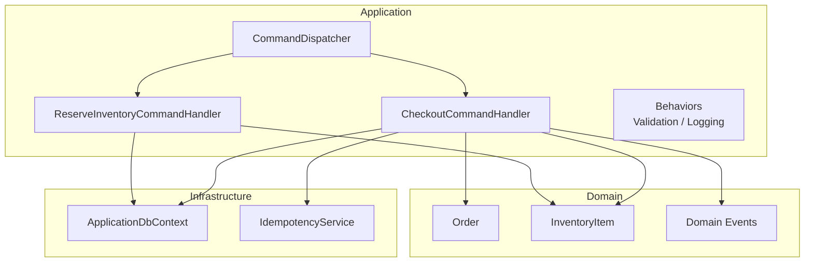
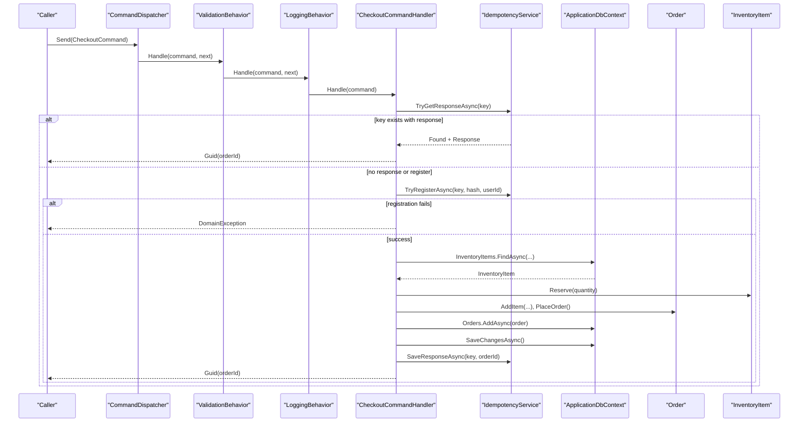
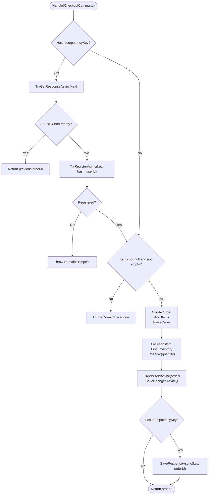
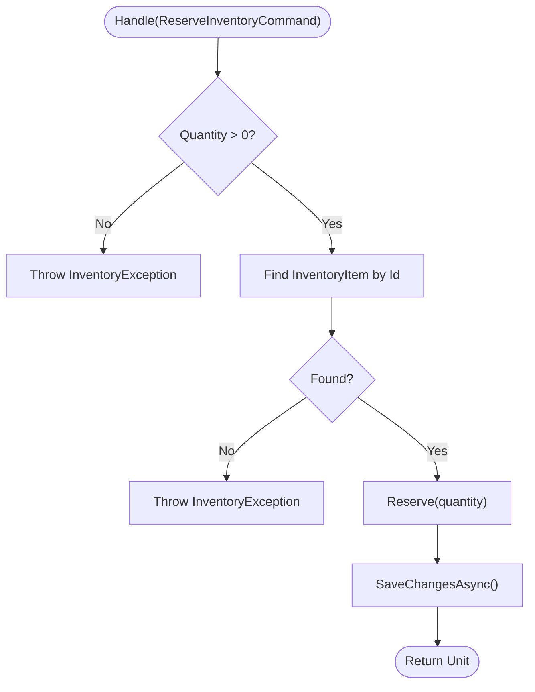
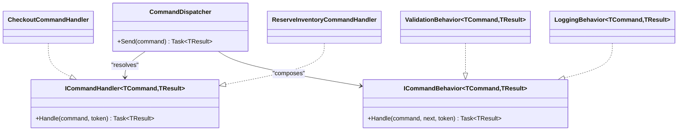
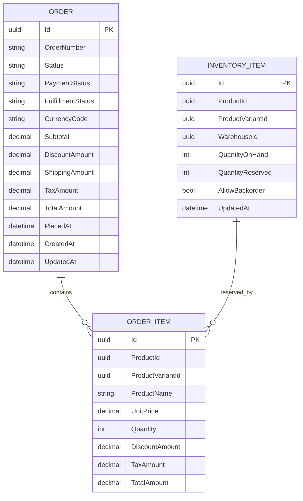
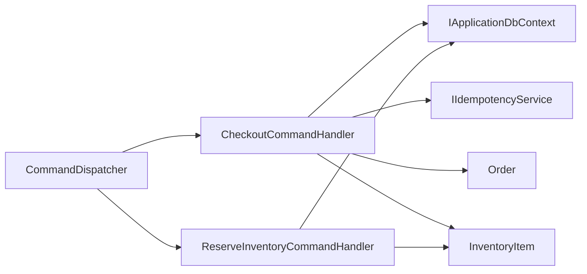

# Command Handlers

<cite>
**Referenced Files in This Document**
- [CheckoutCommandHandler.cs](file://src/Ecommerce.Application/Commands/Checkout/CheckoutCommandHandler.cs)
- [ReserveInventoryCommandHandler.cs](file://src/Ecommerce.Application/Commands/ReserveInventory/ReserveInventoryCommandHandler.cs)
- [CheckoutCommand.cs](file://src/Ecommerce.Application/Commands/Checkout/CheckoutCommand.cs)
- [ReserveInventoryCommand.cs](file://src/Ecommerce.Application/Commands/ReserveInventory/ReserveInventoryCommand.cs)
- [ICommandHandler.cs](file://src/Ecommerce.Application/Common/Commands/ICommandHandler.cs)
- [CommandDispatcher.cs](file://src/Ecommerce.Application/Common/Commands/CommandDispatcher.cs)
- [LoggingBehavior.cs](file://src/Ecommerce.Application/Common/Commands/LoggingBehavior.cs)
- [ValidationBehavior.cs](file://src/Ecommerce.Application/Common/Commands/ValidationBehavior.cs)
- [Order.cs](file://src/Ecommerce.Domain/Entities/Order.cs)
- [InventoryItem.cs](file://src/Ecommerce.Domain/Entities/InventoryItem.cs)
- [IApplicationDbContext.cs](file://src/Ecommerce.Application/Interfaces/IApplicationDbContext.cs)
- [ApplicationDbContext.cs](file://src/Ecommerce.Infrastructure/Persistence/ApplicationDbContext.cs)
- [IdempotencyService.cs](file://src/Ecommerce.Infrastructure/Services/IdempotencyService.cs)
- [OrderPlacedDomainEvent.cs](file://src/Ecommerce.Domain/DomainEvents/OrderPlacedDomainEvent.cs)
- [PaymentCompletedDomainEvent.cs](file://src/Ecommerce.Domain/DomainEvents/PaymentCompletedDomainEvent.cs)
- [InventoryException.cs](file://src/Ecommerce.Domain/Exceptions/InventoryException.cs)
</cite>

## Table of Contents
1. Introduction
2. Project Structure
3. Core Components
4. Architecture Overview
5. Detailed Component Analysis
6. Dependency Analysis
7. Performance Considerations
8. Troubleshooting Guide
9. Conclusion
10. Appendices

## Introduction
This document explains the command handlers that implement business workflows for checkout and inventory reservation. It focuses on:
- CheckoutCommandHandler: orchestrates order creation, inventory reservation, idempotency, persistence, and domain event publishing hooks.
- ReserveInventoryCommandHandler: reserves stock for a specific inventory item with validation and persistence.
It also covers handler composition via behaviors, dependency injection patterns, coordination with domain services and repositories (via DbContext), transaction management, error handling, and how to create new command handlers following established patterns.

## Project Structure
The command handlers live in the Application layer and coordinate with Domain entities and Infrastructure persistence through interfaces. The dispatcher wires handlers with behaviors (validation, logging) and resolves them from DI.

**Diagram sources**
- [CommandDispatcher.cs:20-43](file://src/Ecommerce.Application/Common/Commands/CommandDispatcher.cs#L20-L43)
- [CheckoutCommandHandler.cs:22-90](file://src/Ecommerce.Application/Commands/Checkout/CheckoutCommandHandler.cs#L22-L90)
- [ReserveInventoryCommandHandler.cs:17-27](file://src/Ecommerce.Application/Commands/ReserveInventory/ReserveInventoryCommandHandler.cs#L17-L27)
- [Order.cs:36-102](file://src/Ecommerce.Domain/Entities/Order.cs#L36-L102)
- [InventoryItem.cs:22-67](file://src/Ecommerce.Domain/Entities/InventoryItem.cs#L22-L67)
- [ApplicationDbContext.cs:19-31](file://src/Ecommerce.Infrastructure/Persistence/ApplicationDbContext.cs#L19-L31)
- [IdempotencyService.cs:19-53](file://src/Ecommerce.Infrastructure/Services/IdempotencyService.cs#L19-L53)

**Section sources**
- [CommandDispatcher.cs:20-43](file://src/Ecommerce.Application/Common/Commands/CommandDispatcher.cs#L20-L43)
- [CheckoutCommandHandler.cs:22-90](file://src/Ecommerce.Application/Commands/Checkout/CheckoutCommandHandler.cs#L22-L90)
- [ReserveInventoryCommandHandler.cs:17-27](file://src/Ecommerce.Application/Commands/ReserveInventory/ReserveInventoryCommandHandler.cs#L17-L27)

## Core Components
- ICommandHandler<TCommand, TResult>: defines the standard Handle method used by all command handlers.
- CommandDispatcher: resolves handlers and behaviors from DI, builds an execution pipeline, and invokes the handler.
- ValidationBehavior: validates commands using registered validators before invoking the handler.
- LoggingBehavior: logs entry/exit and errors around handler execution.
- CheckoutCommandHandler: implements checkout orchestration including idempotency checks, order building, inventory reservation, persistence, and response caching.
- ReserveInventoryCommandHandler: validates quantity, finds inventory, reserves stock, and persists changes.

Key responsibilities:
- Handlers encapsulate use cases and coordinate domain logic without leaking infrastructure concerns.
- Behaviors provide cross-cutting concerns (validation, logging) transparently.
- Persistence is abstracted via IApplicationDbContext; concrete implementation lives in Infrastructure.

**Section sources**
- [ICommandHandler.cs:6-9](file://src/Ecommerce.Application/Common/Commands/ICommandHandler.cs#L6-L9)
- [CommandDispatcher.cs:20-43](file://src/Ecommerce.Application/Common/Commands/CommandDispatcher.cs#L20-L43)
- [ValidationBehavior.cs:17-37](file://src/Ecommerce.Application/Common/Commands/ValidationBehavior.cs#L17-L37)
- [LoggingBehavior.cs:17-30](file://src/Ecommerce.Application/Common/Commands/LoggingBehavior.cs#L17-L30)
- [CheckoutCommandHandler.cs:22-90](file://src/Ecommerce.Application/Commands/Checkout/CheckoutCommandHandler.cs#L22-L90)
- [ReserveInventoryCommandHandler.cs:17-27](file://src/Ecommerce.Application/Commands/ReserveInventory/ReserveInventoryCommandHandler.cs#L17-L27)

## Architecture Overview
The command pipeline uses DI to wire behaviors around handlers. Commands are dispatched through CommandDispatcher, which:
- Logs the incoming command type.
- Resolves the appropriate handler.
- Builds a behavior chain (validation, logging).
- Executes the handler within the pipeline.
- Returns the result.

**Diagram sources**
- [CommandDispatcher.cs:20-43](file://src/Ecommerce.Application/Common/Commands/CommandDispatcher.cs#L20-L43)
- [ValidationBehavior.cs:17-37](file://src/Ecommerce.Application/Common/Commands/ValidationBehavior.cs#L17-L37)
- [LoggingBehavior.cs:17-30](file://src/Ecommerce.Application/Common/Commands/LoggingBehavior.cs#L17-L30)
- [CheckoutCommandHandler.cs:22-90](file://src/Ecommerce.Application/Commands/Checkout/CheckoutCommandHandler.cs#L22-L90)
- [IdempotencyService.cs:19-53](file://src/Ecommerce.Infrastructure/Services/IdempotencyService.cs#L19-L53)
- [Order.cs:36-102](file://src/Ecommerce.Domain/Entities/Order.cs#L36-L102)
- [InventoryItem.cs:22-67](file://src/Ecommerce.Domain/Entities/InventoryItem.cs#L22-L67)

## Detailed Component Analysis

### CheckoutCommandHandler
Responsibilities:
- Idempotency: check for existing response or register attempt; return cached result if available.
- Validation: ensure items list is not empty.
- Order creation: build Order, add items, set currency/shipping, place order.
- Inventory reservation: find inventory by variant or product, then reserve requested quantity.
- Persistence: add order and save changes.
- Idempotency completion: store final response keyed by idempotency key.
- Error handling: throw domain exceptions for missing inventory or conflicts.

Transaction management:
- Each SaveChangesAsync call commits its own unit of work. For stronger atomicity across multiple operations, consider grouping into a single database transaction at the application boundary or service level.

Error handling:
- Throws DomainException when idempotency registration fails or items are missing.
- Throws InventoryException when inventory cannot be found or reserved.

Domain events:
- A domain event type OrderPlacedDomainEvent exists; handlers can publish it after successful placement to decouple downstream processes.

**Diagram sources**
- [CheckoutCommandHandler.cs:22-90](file://src/Ecommerce.Application/Commands/Checkout/CheckoutCommandHandler.cs#L22-L90)
- [IdempotencyService.cs:19-53](file://src/Ecommerce.Infrastructure/Services/IdempotencyService.cs#L19-L53)
- [Order.cs:36-102](file://src/Ecommerce.Domain/Entities/Order.cs#L36-L102)
- [InventoryItem.cs:22-67](file://src/Ecommerce.Domain/Entities/InventoryItem.cs#L22-L67)

**Section sources**
- [CheckoutCommandHandler.cs:22-90](file://src/Ecommerce.Application/Commands/Checkout/CheckoutCommandHandler.cs#L22-L90)
- [Order.cs:36-102](file://src/Ecommerce.Domain/Entities/Order.cs#L36-L102)
- [InventoryItem.cs:22-67](file://src/Ecommerce.Domain/Entities/InventoryItem.cs#L22-L67)
- [IdempotencyService.cs:19-53](file://src/Ecommerce.Infrastructure/Services/IdempotencyService.cs#L19-L53)

### ReserveInventoryCommandHandler
Responsibilities:
- Validate quantity is positive.
- Find inventory item by ID.
- Reserve stock via domain method.
- Persist changes.

Error handling:
- Throws InventoryException for invalid quantity or missing inventory.

Transaction management:
- Single SaveChangesAsync ensures the reservation is persisted atomically for this operation.

**Diagram sources**
- [ReserveInventoryCommandHandler.cs:17-27](file://src/Ecommerce.Application/Commands/ReserveInventory/ReserveInventoryCommandHandler.cs#L17-L27)
- [InventoryItem.cs:22-67](file://src/Ecommerce.Domain/Entities/InventoryItem.cs#L22-L67)

**Section sources**
- [ReserveInventoryCommandHandler.cs:17-27](file://src/Ecommerce.Application/Commands/ReserveInventory/ReserveInventoryCommandHandler.cs#L17-L27)
- [InventoryItem.cs:22-67](file://src/Ecommerce.Domain/Entities/InventoryItem.cs#L22-L67)

### Handler Composition and Pipeline
Composition model:
- CommandDispatcher resolves ICommandHandler<TCommand, TResult> from DI.
- It also resolves IEnumerable<ICommandBehavior<TCommand, TResult>> and composes them around the handler.
- ValidationBehavior runs first to validate commands and throws DomainException on failures.
- LoggingBehavior wraps execution to log start/end/errors.

**Diagram sources**
- [CommandDispatcher.cs:20-43](file://src/Ecommerce.Application/Common/Commands/CommandDispatcher.cs#L20-L43)
- [ICommandHandler.cs:6-9](file://src/Ecommerce.Application/Common/Commands/ICommandHandler.cs#L6-L9)
- [ICommandBehavior.cs:7-10](file://src/Ecommerce.Application/Common/Commands/ICommandBehavior.cs#L7-L10)
- [ValidationBehavior.cs:17-37](file://src/Ecommerce.Application/Common/Commands/ValidationBehavior.cs#L17-L37)
- [LoggingBehavior.cs:17-30](file://src/Ecommerce.Application/Common/Commands/LoggingBehavior.cs#L17-L30)

**Section sources**
- [CommandDispatcher.cs:20-43](file://src/Ecommerce.Application/Common/Commands/CommandDispatcher.cs#L20-L43)
- [ValidationBehavior.cs:17-37](file://src/Ecommerce.Application/Common/Commands/ValidationBehavior.cs#L17-L37)
- [LoggingBehavior.cs:17-30](file://src/Ecommerce.Application/Common/Commands/LoggingBehavior.cs#L17-L30)

### Data Models and Relationships

**Diagram sources**
- [Order.cs:8-34](file://src/Ecommerce.Domain/Entities/Order.cs#L8-L34)
- [Order.cs:36-102](file://src/Ecommerce.Domain/Entities/Order.cs#L36-L102)
- [InventoryItem.cs:6-18](file://src/Ecommerce.Domain/Entities/InventoryItem.cs#L6-L18)

**Section sources**
- [Order.cs:8-102](file://src/Ecommerce.Domain/Entities/Order.cs#L8-L102)
- [InventoryItem.cs:6-67](file://src/Ecommerce.Domain/Entities/InventoryItem.cs#L6-L67)

## Dependency Analysis
- Handlers depend on IApplicationDbContext for persistence and on domain entities for business rules.
- CheckoutCommandHandler additionally depends on IIdempotencyService for idempotent request handling.
- CommandDispatcher depends on DI container to resolve handlers and behaviors.
- ValidationBehavior depends on registered validators for the command type.
- LoggingBehavior depends on ILogger for structured logging.

**Diagram sources**
- [CommandDispatcher.cs:20-43](file://src/Ecommerce.Application/Common/Commands/CommandDispatcher.cs#L20-L43)
- [CheckoutCommandHandler.cs:22-90](file://src/Ecommerce.Application/Commands/Checkout/CheckoutCommandHandler.cs#L22-L90)
- [ReserveInventoryCommandHandler.cs:17-27](file://src/Ecommerce.Application/Commands/ReserveInventory/ReserveInventoryCommandHandler.cs#L17-L27)
- [IApplicationDbContext.cs:8-13](file://src/Ecommerce.Application/Interfaces/IApplicationDbContext.cs#L8-L13)
- [IdempotencyService.cs:10-53](file://src/Ecommerce.Infrastructure/Services/IdempotencyService.cs#L10-L53)

**Section sources**
- [CommandDispatcher.cs:20-43](file://src/Ecommerce.Application/Common/Commands/CommandDispatcher.cs#L20-L43)
- [CheckoutCommandHandler.cs:22-90](file://src/Ecommerce.Application/Commands/Checkout/CheckoutCommandHandler.cs#L22-L90)
- [ReserveInventoryCommandHandler.cs:17-27](file://src/Ecommerce.Application/Commands/ReserveInventory/ReserveInventoryCommandHandler.cs#L17-L27)
- [IApplicationDbContext.cs:8-13](file://src/Ecommerce.Application/Interfaces/IApplicationDbContext.cs#L8-L13)
- [IdempotencyService.cs:10-53](file://src/Ecommerce.Infrastructure/Services/IdempotencyService.cs#L10-L53)

## Performance Considerations
- Idempotency reduces duplicate processing overhead and prevents race conditions on concurrent requests.
- Avoid N+1 queries: batch inventory lookups where possible; consider loading required inventory items in a single query before reserving.
- Keep transactions small but consistent: group related writes in a single SaveChangesAsync to reduce round-trips.
- Use async throughout to avoid blocking threads during IO-bound operations.
- Log only essential information to minimize overhead.

[No sources needed since this section provides general guidance]

## Troubleshooting Guide
Common issues and resolutions:
- No handler registered: CommandDispatcher throws InvalidOperationException when a handler is not resolved. Ensure the handler is registered in DI.
- Validation failures: ValidationBehavior aggregates validator errors and throws DomainException. Check command properties and validators.
- Missing inventory: Handlers throw InventoryException when inventory cannot be found or reserved. Verify inventory records exist and quantities are sufficient.
- Idempotency conflicts: If registration fails, a DomainException is thrown. Ensure unique idempotency keys per request intent.
- Persistence errors: SaveChangesAsync may fail due to constraints or concurrency. Wrap calls in retries or handle concurrency exceptions appropriately.

**Section sources**
- [CommandDispatcher.cs:25-26](file://src/Ecommerce.Application/Common/Commands/CommandDispatcher.cs#L25-L26)
- [ValidationBehavior.cs:20-34](file://src/Ecommerce.Application/Common/Commands/ValidationBehavior.cs#L20-L34)
- [CheckoutCommandHandler.cs:45-45](file://src/Ecommerce.Application/Commands/Checkout/CheckoutCommandHandler.cs#L45-L45)
- [CheckoutCommandHandler.cs:69-74](file://src/Ecommerce.Application/Commands/Checkout/CheckoutCommandHandler.cs#L69-L74)
- [ReserveInventoryCommandHandler.cs:19-24](file://src/Ecommerce.Application/Commands/ReserveInventory/ReserveInventoryCommandHandler.cs#L19-L24)
- [IdempotencyService.cs:27-44](file://src/Ecommerce.Infrastructure/Services/IdempotencyService.cs#L27-L44)

## Conclusion
The command handlers implement clear, testable use cases with strong separation of concerns:
- Handlers focus on business workflows and coordinate domain logic.
- Behaviors provide reusable cross-cutting functionality.
- Persistence is abstracted behind interfaces, enabling testing and flexibility.
- Idempotency protects against duplicate requests.
To extend the system, follow the established patterns: define a command, a handler implementing ICommandHandler, optional validators, and compose via the dispatcher.

[No sources needed since this section summarizes without analyzing specific files]

## Appendices

### Creating a New Command Handler: Best Practices
Steps:
1. Define a command class with necessary properties.
2. Implement a handler class implementing ICommandHandler<TCommand, TResult>.
3. Inject dependencies via constructor (e.g., IApplicationDbContext, domain services).
4. Validate inputs early; throw DomainException or rely on ValidationBehavior.
5. Apply domain rules via entities/services; avoid leaking infrastructure details.
6. Persist changes with SaveChangesAsync; consider wrapping multiple writes in a transaction.
7. Publish domain events after successful state changes.
8. Register the handler and any validators in DI.
9. Optionally add behaviors (logging, metrics) via the pipeline.

Examples of established patterns:
- Command definition pattern: see CheckoutCommand and ReserveInventoryCommand structures.
- Handler pattern: see CheckoutCommandHandler and ReserveInventoryCommandHandler implementations.
- Behavior pattern: see ValidationBehavior and LoggingBehavior usage in CommandDispatcher.

**Section sources**
- [CheckoutCommand.cs:6-20](file://src/Ecommerce.Application/Commands/Checkout/CheckoutCommand.cs#L6-L20)
- [ReserveInventoryCommand.cs:5-9](file://src/Ecommerce.Application/Commands/ReserveInventory/ReserveInventoryCommand.cs#L5-L9)
- [ICommandHandler.cs:6-9](file://src/Ecommerce.Application/Common/Commands/ICommandHandler.cs#L6-L9)
- [CommandDispatcher.cs:20-43](file://src/Ecommerce.Application/Common/Commands/CommandDispatcher.cs#L20-L43)
- [ValidationBehavior.cs:17-37](file://src/Ecommerce.Application/Common/Commands/ValidationBehavior.cs#L17-L37)
- [LoggingBehavior.cs:17-30](file://src/Ecommerce.Application/Common/Commands/LoggingBehavior.cs#L17-L30)