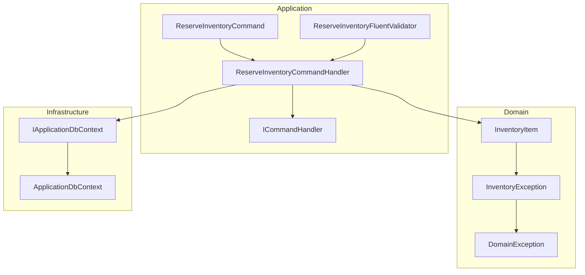
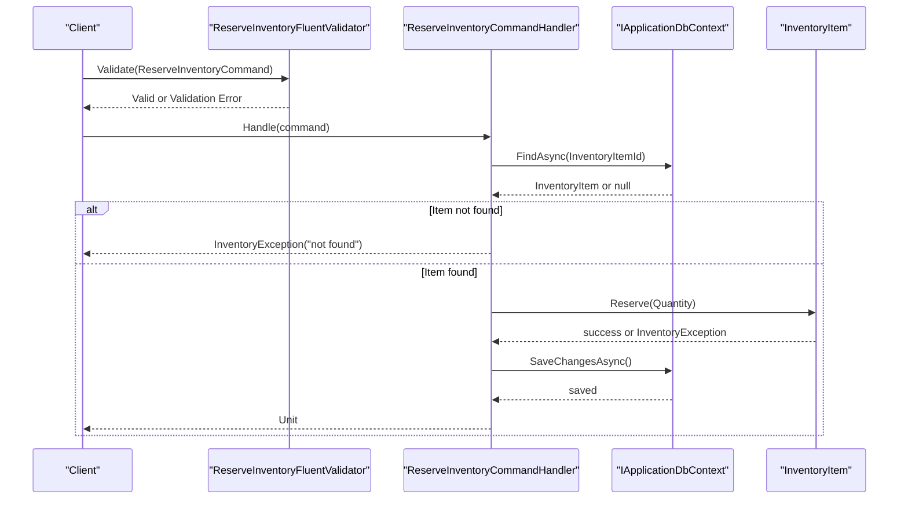
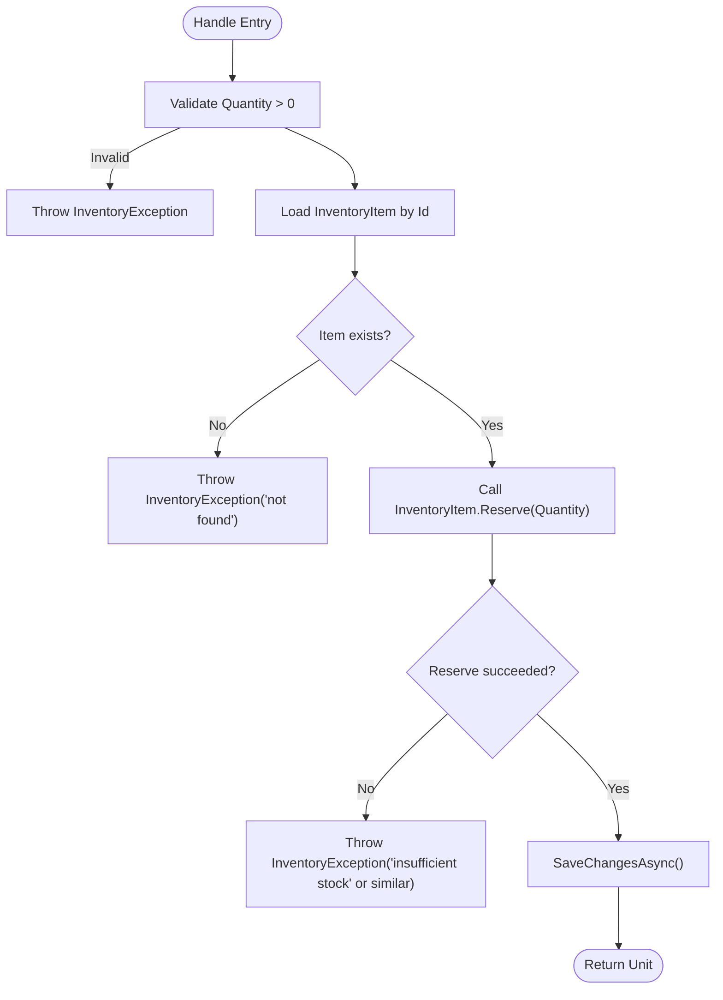
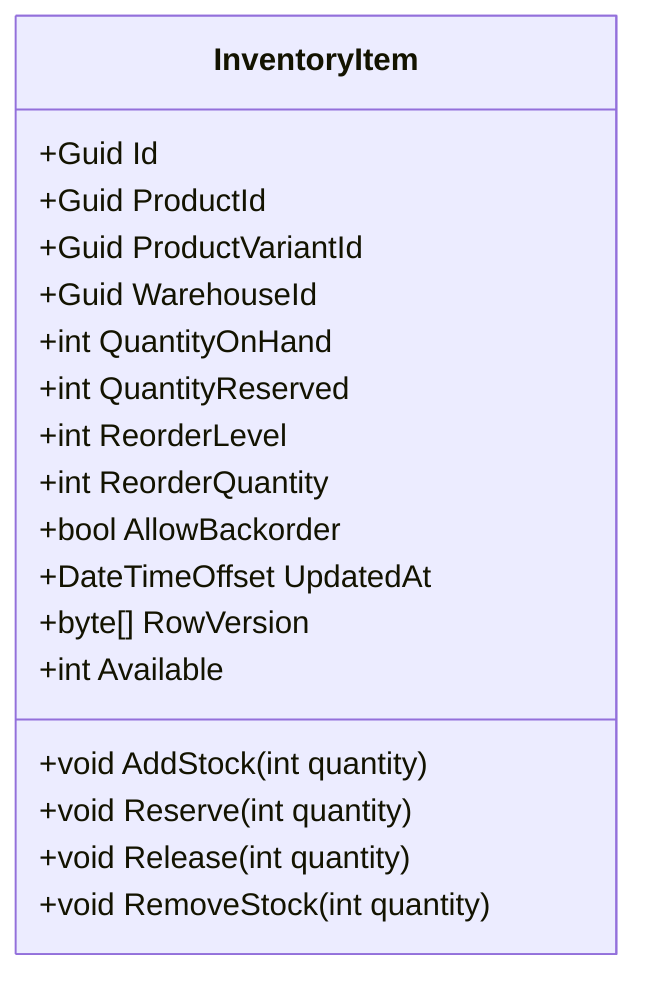
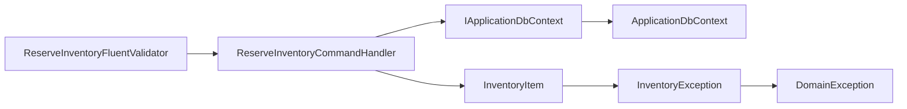

# Reserve Inventory Command Handler

<cite>
**Referenced Files in This Document**
- [ReserveInventoryCommandHandler.cs](file://src/Ecommerce.Application/Commands/ReserveInventory/ReserveInventoryCommandHandler.cs)
- [ReserveInventoryCommand.cs](file://src/Ecommerce.Application/Commands/ReserveInventory/ReserveInventoryCommand.cs)
- [ReserveInventoryFluentValidator.cs](file://src/Ecommerce.Application/Validators/ReserveInventoryFluentValidator.cs)
- [ICommandHandler.cs](file://src/Ecommerce.Application/Common/Commands/ICommandHandler.cs)
- [IApplicationDbContext.cs](file://src/Ecommerce.Application/Interfaces/IApplicationDbContext.cs)
- [InventoryItem.cs](file://src/Ecommerce.Domain/Entities/InventoryItem.cs)
- [DomainException.cs](file://src/Ecommerce.Domain/Exceptions/DomainException.cs)
- [InventoryException.cs](file://src/Ecommerce.Domain/Exceptions/InventoryException.cs)
- [ConcurrencyException.cs](file://src/Ecommerce.Domain/Exceptions/ConcurrencyException.cs)
- [ApplicationDbContext.cs](file://src/Ecommerce.Infrastructure/Persistence/ApplicationDbContext.cs)
- [ReserveInventoryHandlerTests.cs](file://tests/Ecommerce.Application.Tests/ReserveInventoryHandlerTests.cs)
- [InventoryReservationIntegrationTests.cs](file://tests/Ecommerce.IntegrationTests/InventoryReservationIntegrationTests.cs)
</cite>

## Table of Contents
1. [Introduction](#introduction)
2. [Project Structure](#project-structure)
3. [Core Components](#core-components)
4. [Architecture Overview](#architecture-overview)
5. [Detailed Component Analysis](#detailed-component-analysis)
6. [Dependency Analysis](#dependency-analysis)
7. [Performance Considerations](#performance-considerations)
8. [Troubleshooting Guide](#troubleshooting-guide)
9. [Conclusion](#conclusion)
10. [Appendices](#appendices)

## Introduction
This document explains the ReserveInventoryCommandHandler, which processes inventory reservation requests by validating inputs, ensuring stock availability, updating domain entities, and persisting changes. It integrates with the InventoryItem domain entity to enforce business rules such as backorder policy and quantity constraints. The handler is part of an application layer command pattern implementation that coordinates validation, domain logic, and persistence.

## Project Structure
The reserve inventory feature spans multiple layers:
- Application layer: command, command handler, validator, and common command interfaces
- Domain layer: InventoryItem entity with business rules for reservations, releases, and stock adjustments
- Infrastructure layer: EF Core DbContext exposing InventoryItems and SaveChangesAsync
- Tests: unit and integration tests verifying reservation behavior and database state changes

**Diagram sources**
- [ReserveInventoryCommandHandler.cs:1-30](file://src/Ecommerce.Application/Commands/ReserveInventory/ReserveInventoryCommandHandler.cs#L1-L30)
- [ReserveInventoryCommand.cs:1-10](file://src/Ecommerce.Application/Commands/ReserveInventory/ReserveInventoryCommand.cs#L1-L10)
- [ReserveInventoryFluentValidator.cs:1-13](file://src/Ecommerce.Application/Validators/ReserveInventoryFluentValidator.cs#L1-L13)
- [ICommandHandler.cs:1-11](file://src/Ecommerce.Application/Common/Commands/ICommandHandler.cs#L1-L11)
- [InventoryItem.cs:1-69](file://src/Ecommerce.Domain/Entities/InventoryItem.cs#L1-L69)
- [InventoryException.cs:1-10](file://src/Ecommerce.Domain/Exceptions/InventoryException.cs#L1-L10)
- [DomainException.cs:1-10](file://src/Ecommerce.Domain/Exceptions/DomainException.cs#L1-L10)
- [IApplicationDbContext.cs:1-15](file://src/Ecommerce.Application/Interfaces/IApplicationDbContext.cs#L1-L15)
- [ApplicationDbContext.cs:1-43](file://src/Ecommerce.Infrastructure/Persistence/ApplicationDbContext.cs#L1-L43)

**Section sources**
- [ReserveInventoryCommandHandler.cs:1-30](file://src/Ecommerce.Application/Commands/ReserveInventory/ReserveInventoryCommandHandler.cs#L1-L30)
- [ReserveInventoryCommand.cs:1-10](file://src/Ecommerce.Application/Commands/ReserveInventory/ReserveInventoryCommand.cs#L1-L10)
- [ReserveInventoryFluentValidator.cs:1-13](file://src/Ecommerce.Application/Validators/ReserveInventoryFluentValidator.cs#L1-L13)
- [ICommandHandler.cs:1-11](file://src/Ecommerce.Application/Common/Commands/ICommandHandler.cs#L1-L11)
- [InventoryItem.cs:1-69](file://src/Ecommerce.Domain/Entities/InventoryItem.cs#L1-L69)
- [IApplicationDbContext.cs:1-15](file://src/Ecommerce.Application/Interfaces/IApplicationDbContext.cs#L1-L15)
- [ApplicationDbContext.cs:1-43](file://src/Ecommerce.Infrastructure/Persistence/ApplicationDbContext.cs#L1-L43)

## Core Components
- ReserveInventoryCommand: carries the target InventoryItemId and Quantity to reserve.
- ReserveInventoryCommandHandler: validates quantity, loads InventoryItem, delegates reservation to the domain entity, and persists changes.
- ReserveInventoryFluentValidator: enforces non-empty InventoryItemId and positive Quantity at the application boundary.
- InventoryItem: encapsulates stock quantities and business rules for AddStock, Reserve, Release, RemoveStock, and exposes Available as a derived value.
- IApplicationDbContext and ApplicationDbContext: provide access to InventoryItems DbSet and transactional persistence via SaveChangesAsync.

Key behaviors:
- Validation ensures Quantity > 0 before domain processing.
- Domain-level Reserve enforces AllowBackorder policy and prevents over-reservation.
- Persistence updates QuantityReserved and UpdatedAt atomically within a single save operation.

**Section sources**
- [ReserveInventoryCommand.cs:1-10](file://src/Ecommerce.Application/Commands/ReserveInventory/ReserveInventoryCommand.cs#L1-L10)
- [ReserveInventoryCommandHandler.cs:1-30](file://src/Ecommerce.Application/Commands/ReserveInventory/ReserveInventoryCommandHandler.cs#L1-L30)
- [ReserveInventoryFluentValidator.cs:1-13](file://src/Ecommerce.Application/Validators/ReserveInventoryFluentValidator.cs#L1-L13)
- [InventoryItem.cs:1-69](file://src/Ecommerce.Domain/Entities/InventoryItem.cs#L1-L69)
- [IApplicationDbContext.cs:1-15](file://src/Ecommerce.Application/Interfaces/IApplicationDbContext.cs#L1-L15)
- [ApplicationDbContext.cs:1-43](file://src/Ecommerce.Infrastructure/Persistence/ApplicationDbContext.cs#L1-L43)

## Architecture Overview
The handler follows a layered approach:
- Input arrives as a command object.
- Validator runs prior to handling (via common pipeline).
- Handler performs domain operations on InventoryItem.
- Changes are persisted through the application context.

**Diagram sources**
- [ReserveInventoryCommandHandler.cs:17-27](file://src/Ecommerce.Application/Commands/ReserveInventory/ReserveInventoryCommandHandler.cs#L17-L27)
- [ReserveInventoryFluentValidator.cs:7-11](file://src/Ecommerce.Application/Validators/ReserveInventoryFluentValidator.cs#L7-L11)
- [InventoryItem.cs:29-40](file://src/Ecommerce.Domain/Entities/InventoryItem.cs#L29-L40)
- [IApplicationDbContext.cs:8-13](file://src/Ecommerce.Application/Interfaces/IApplicationDbContext.cs#L8-L13)

## Detailed Component Analysis

### ReserveInventoryCommand
- Purpose: Data carrier for reservation requests.
- Fields:
  - InventoryItemId: identifies the inventory item to reserve against.
  - Quantity: number of units to reserve; must be positive.

Validation is enforced by the fluent validator and further validated in the handler and domain.

**Section sources**
- [ReserveInventoryCommand.cs:5-9](file://src/Ecommerce.Application/Commands/ReserveInventory/ReserveInventoryCommand.cs#L5-L9)
- [ReserveInventoryFluentValidator.cs:7-11](file://src/Ecommerce.Application/Validators/ReserveInventoryFluentValidator.cs#L7-L11)

### ReserveInventoryCommandHandler
Responsibilities:
- Enforce positive quantity at the application level.
- Retrieve the InventoryItem from the data store.
- Delegate reservation logic to InventoryItem.Reserve.
- Persist changes using SaveChangesAsync.

Error handling:
- Throws InventoryException when quantity is invalid or item is missing.
- Delegates insufficient stock and backorder violations to InventoryItem, which throws InventoryException.

Concurrency considerations:
- The handler uses FindAsync followed by SaveChangesAsync without explicit optimistic concurrency checks in this flow. If concurrent modifications occur, conflicts may surface at the persistence layer.

**Diagram sources**
- [ReserveInventoryCommandHandler.cs:17-27](file://src/Ecommerce.Application/Commands/ReserveInventory/ReserveInventoryCommandHandler.cs#L17-L27)
- [InventoryItem.cs:29-40](file://src/Ecommerce.Domain/Entities/InventoryItem.cs#L29-L40)

**Section sources**
- [ReserveInventoryCommandHandler.cs:1-30](file://src/Ecommerce.Application/Commands/ReserveInventory/ReserveInventoryCommandHandler.cs#L1-L30)
- [InventoryException.cs:1-10](file://src/Ecommerce.Domain/Exceptions/InventoryException.cs#L1-L10)

### InventoryItem (Domain Entity)
Business rules:
- Available = QuantityOnHand - QuantityReserved.
- Reserve(quantity):
  - Validates quantity > 0.
  - If backorders are disallowed, ensures Available >= quantity.
  - Increments QuantityReserved and updates UpdatedAt.
- Release(quantity):
  - Validates quantity > 0 and does not exceed QuantityReserved.
  - Decrements QuantityReserved and updates UpdatedAt.
- AddStock and RemoveStock manage QuantityOnHand with validations and backorder-awareness.

These rules ensure consistency of inventory state and prevent invalid transitions.

**Diagram sources**
- [InventoryItem.cs:6-68](file://src/Ecommerce.Domain/Entities/InventoryItem.cs#L6-L68)

**Section sources**
- [InventoryItem.cs:1-69](file://src/Ecommerce.Domain/Entities/InventoryItem.cs#L1-L69)

### Validators and Common Interfaces
- ReserveInventoryFluentValidator ensures InventoryItemId is present and Quantity > 0.
- ICommandHandler defines the async Handle method signature used by the handler.
- IApplicationDbContext abstracts EF Core persistence for InventoryItems and SaveChangesAsync.

**Section sources**
- [ReserveInventoryFluentValidator.cs:1-13](file://src/Ecommerce.Application/Validators/ReserveInventoryFluentValidator.cs#L1-L13)
- [ICommandHandler.cs:1-11](file://src/Ecommerce.Application/Common/Commands/ICommandHandler.cs#L1-L11)
- [IApplicationDbContext.cs:1-15](file://src/Ecommerce.Application/Interfaces/IApplicationDbContext.cs#L1-L15)

### Persistence Layer
- ApplicationDbContext implements IApplicationDbContext and exposes InventoryItems DbSet.
- SaveChangesAsync commits changes to the database.

**Section sources**
- [ApplicationDbContext.cs:13-32](file://src/Ecommerce.Infrastructure/Persistence/ApplicationDbContext.cs#L13-L32)

## Dependency Analysis
The handler depends on:
- Fluent validation for input correctness.
- Domain entity for business rule enforcement.
- Application context for data access.

**Diagram sources**
- [ReserveInventoryCommandHandler.cs:1-30](file://src/Ecommerce.Application/Commands/ReserveInventory/ReserveInventoryCommandHandler.cs#L1-L30)
- [ReserveInventoryFluentValidator.cs:1-13](file://src/Ecommerce.Application/Validators/ReserveInventoryFluentValidator.cs#L1-L13)
- [InventoryItem.cs:1-69](file://src/Ecommerce.Domain/Entities/InventoryItem.cs#L1-L69)
- [IApplicationDbContext.cs:1-15](file://src/Ecommerce.Application/Interfaces/IApplicationDbContext.cs#L1-L15)
- [ApplicationDbContext.cs:1-43](file://src/Ecommerce.Infrastructure/Persistence/ApplicationDbContext.cs#L1-L43)
- [InventoryException.cs:1-10](file://src/Ecommerce.Domain/Exceptions/InventoryException.cs#L1-L10)
- [DomainException.cs:1-10](file://src/Ecommerce.Domain/Exceptions/DomainException.cs#L1-L10)

**Section sources**
- [ReserveInventoryCommandHandler.cs:1-30](file://src/Ecommerce.Application/Commands/ReserveInventory/ReserveInventoryCommandHandler.cs#L1-L30)
- [InventoryItem.cs:1-69](file://src/Ecommerce.Domain/Entities/InventoryItem.cs#L1-L69)
- [IApplicationDbContext.cs:1-15](file://src/Ecommerce.Application/Interfaces/IApplicationDbContext.cs#L1-L15)
- [ApplicationDbContext.cs:1-43](file://src/Ecommerce.Infrastructure/Persistence/ApplicationDbContext.cs#L1-L43)

## Performance Considerations
- Single-item reservation: The current handler processes one InventoryItem per command. For high-volume scenarios, consider batching commands to reduce round-trips.
- Database transactions: Ensure each reservation occurs within a short-lived transaction to minimize lock contention.
- Concurrency control: Use optimistic concurrency (e.g., RowVersion) or pessimistic locking to handle concurrent reservations on the same item.
- Indexing: Ensure efficient lookups by InventoryItemId to speed up FindAsync.
- Backpressure: Introduce rate limiting or queue-based processing if upstream demand exceeds system capacity.

[No sources needed since this section provides general guidance]

## Troubleshooting Guide
Common errors and their origins:
- Invalid quantity:
  - Thrown by the handler when Quantity <= 0.
  - Also enforced by the validator (Quantity > 0).
- Item not found:
  - Thrown when FindAsync returns null for the given InventoryItemId.
- Insufficient stock:
  - Thrown by InventoryItem.Reserve when backorders are disallowed and Available < requested quantity.
- Concurrent modification:
  - May result in persistence-level conflicts; consider using RowVersion or retry policies.

Relevant exception types:
- InventoryException: wraps domain-specific inventory errors.
- DomainException: base type for domain exceptions.
- ConcurrencyException: available for modeling concurrency issues.

Test references:
- Unit test verifies successful reservation when sufficient stock exists.
- Integration test verifies database state after reservation.

**Section sources**
- [ReserveInventoryCommandHandler.cs:17-27](file://src/Ecommerce.Application/Commands/ReserveInventory/ReserveInventoryCommandHandler.cs#L17-L27)
- [ReserveInventoryFluentValidator.cs:7-11](file://src/Ecommerce.Application/Validators/ReserveInventoryFluentValidator.cs#L7-L11)
- [InventoryItem.cs:29-40](file://src/Ecommerce.Domain/Entities/InventoryItem.cs#L29-L40)
- [InventoryException.cs:1-10](file://src/Ecommerce.Domain/Exceptions/InventoryException.cs#L1-L10)
- [DomainException.cs:1-10](file://src/Ecommerce.Domain/Exceptions/DomainException.cs#L1-L10)
- [ConcurrencyException.cs:1-9](file://src/Ecommerce.Domain/Exceptions/ConcurrencyException.cs#L1-L9)
- [ReserveInventoryHandlerTests.cs:22-39](file://tests/Ecommerce.Application.Tests/ReserveInventoryHandlerTests.cs#L22-L39)
- [InventoryReservationIntegrationTests.cs:21-49](file://tests/Ecommerce.IntegrationTests/InventoryReservationIntegrationTests.cs#L21-L49)

## Conclusion
The ReserveInventoryCommandHandler orchestrates inventory reservations by validating inputs, enforcing domain rules in InventoryItem, and persisting changes. It provides clear error signaling for invalid quantities, missing items, and insufficient stock. For robust distributed systems, incorporate concurrency controls, idempotency, and batched operations to maintain consistency under load.

[No sources needed since this section summarizes without analyzing specific files]

## Appendices

### Reservation Workflow Examples
- Single reservation:
  - Validate command fields.
  - Load InventoryItem.
  - Call Reserve and persist changes.
  - Assert updated QuantityReserved and Available.

- Bulk reservations:
  - Group multiple ReserveInventoryCommand instances.
  - Execute within a single transaction where possible.
  - Apply retries for transient failures.

- Rollback scenario:
  - If any step fails (validation, domain rule, persistence), the transaction should roll back to preserve inventory integrity.

[No sources needed since this section provides conceptual examples]