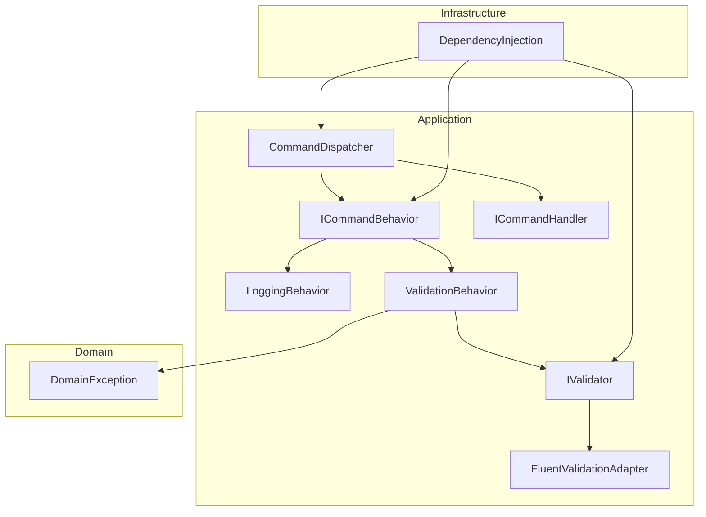
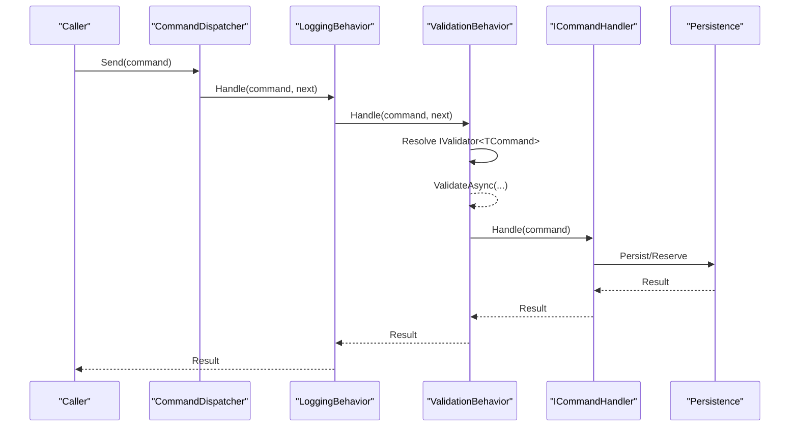
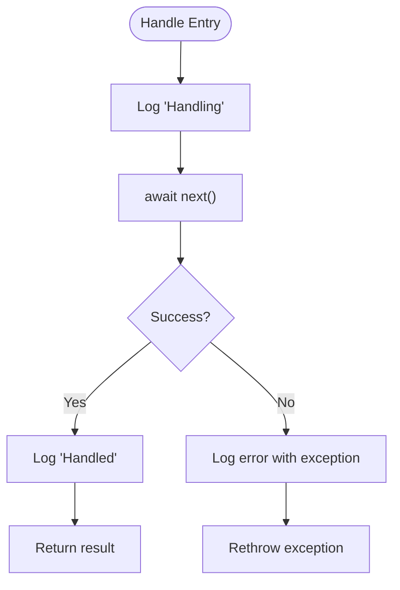
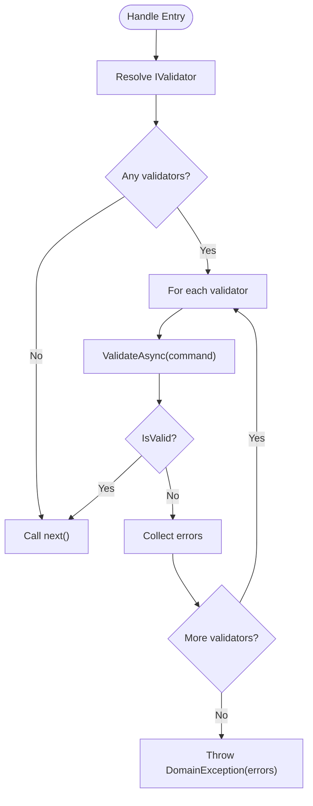
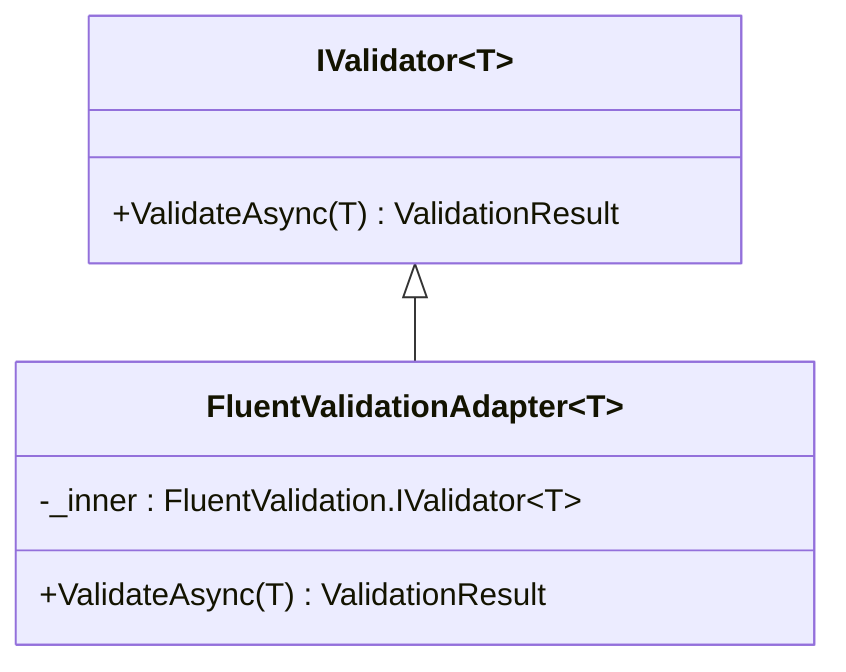
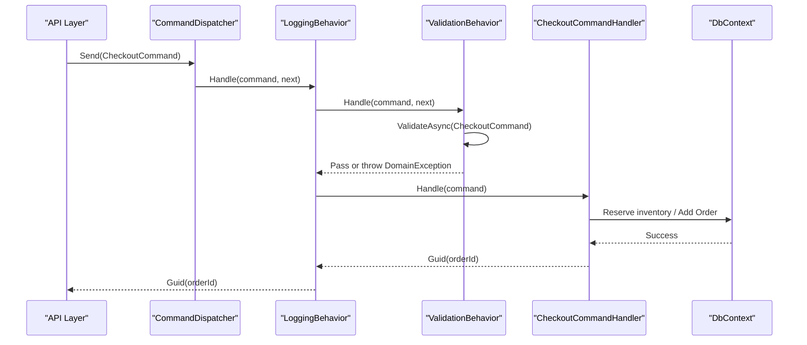
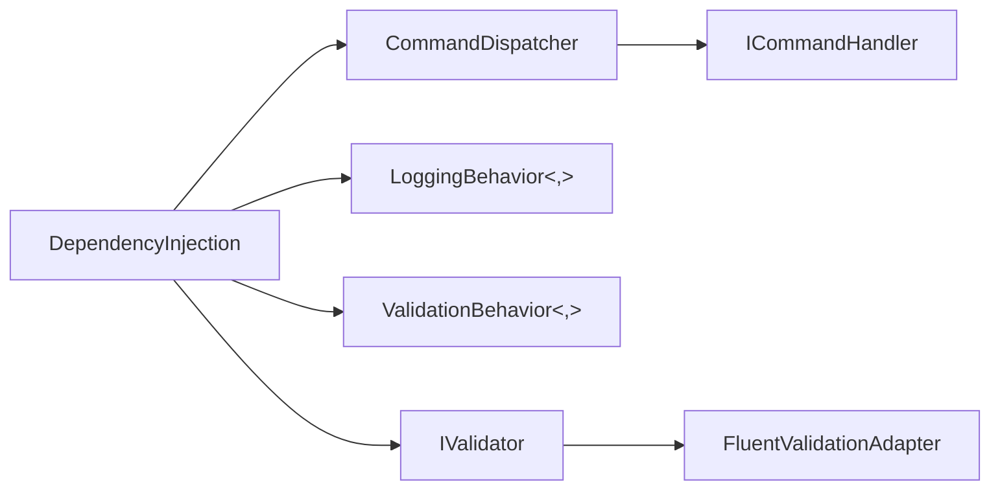

# Cross-Cutting Concerns

<cite>
**Referenced Files in This Document**
- [ICommandBehavior.cs](file://src/Ecommerce.Application/Common/Commands/ICommandBehavior.cs)
- [LoggingBehavior.cs](file://src/Ecommerce.Application/Common/Commands/LoggingBehavior.cs)
- [ValidationBehavior.cs](file://src/Ecommerce.Application/Common/Commands/ValidationBehavior.cs)
- [CommandDispatcher.cs](file://src/Ecommerce.Application/Common/Commands/CommandDispatcher.cs)
- [ICommandHandler.cs](file://src/Ecommerce.Application/Common/Commands/ICommandHandler.cs)
- [IValidator.cs](file://src/Ecommerce.Application/Common/Validation/IValidator.cs)
- [FluentValidationAdapter.cs](file://src/Ecommerce.Application/Common/Validation/FluentValidationAdapter.cs)
- [DependencyInjection.cs](file://src/Ecommerce.Infrastructure/DependencyInjection.cs)
- [CheckoutCommand.cs](file://src/Ecommerce.Application/Commands/Checkout/CheckoutCommand.cs)
- [CheckoutCommandHandler.cs](file://src/Ecommerce.Application/Commands/Checkout/CheckoutCommandHandler.cs)
- [CheckoutCommandFluentValidator.cs](file://src/Ecommerce.Application/Validators/CheckoutCommandFluentValidator.cs)
- [DomainException.cs](file://src/Ecommerce.Domain/Exceptions/DomainException.cs)
</cite>

## Table of Contents
1. Introduction
2. Project Structure
3. Core Components
4. Architecture Overview
5. Detailed Component Analysis
6. Dependency Analysis
7. Performance Considerations
8. Troubleshooting Guide
9. Conclusion
10. Appendices

## Introduction
This document explains how cross-cutting concerns are implemented as behaviors in the command processing pipeline. It covers LoggingBehavior for audit trails and debugging, ValidationBehavior for request validation, and the pipeline orchestration via CommandDispatcher. It also details behavior registration, ordering, execution, exception handling, performance monitoring hooks, security filtering patterns, creating custom behaviors, composition strategies, and testing approaches.

## Project Structure
The command pipeline is implemented in the Application layer with shared abstractions and concrete behaviors. Registration occurs in Infrastructure’s dependency injection setup. Validators can be FluentValidation-based and are adapted to a common IValidator<T> abstraction used by ValidationBehavior.



**Diagram sources**
- [ICommandBehavior.cs:7-10](file://src/Ecommerce.Application/Common/Commands/ICommandBehavior.cs#L7-L10)
- [LoggingBehavior.cs:8-31](file://src/Ecommerce.Application/Common/Commands/LoggingBehavior.cs#L8-L31)
- [ValidationBehavior.cs:8-38](file://src/Ecommerce.Application/Common/Commands/ValidationBehavior.cs#L8-L38)
- [CommandDispatcher.cs:20-43](file://src/Ecommerce.Application/Common/Commands/CommandDispatcher.cs#L20-L43)
- [ICommandHandler.cs:6-9](file://src/Ecommerce.Application/Common/Commands/ICommandHandler.cs#L6-L9)
- [IValidator.cs:5-14](file://src/Ecommerce.Application/Common/Validation/IValidator.cs#L5-L14)
- [FluentValidationAdapter.cs:6-25](file://src/Ecommerce.Application/Common/Validation/FluentValidationAdapter.cs#L6-L25)
- [DependencyInjection.cs:27-33](file://src/Ecommerce.Infrastructure/DependencyInjection.cs#L27-L33)
- [DomainException.cs:5-8](file://src/Ecommerce.Domain/Exceptions/DomainException.cs#L5-L8)

**Section sources**
- [CommandDispatcher.cs:20-43](file://src/Ecommerce.Application/Common/Commands/CommandDispatcher.cs#L20-L43)
- [DependencyInjection.cs:27-33](file://src/Ecommerce.Infrastructure/DependencyInjection.cs#L27-L33)

## Core Components
- ICommandBehavior<TCommand,TResult>: Defines the pipeline step contract with Handle(command, next, cancellationToken).
- LoggingBehavior<TCommand,TResult>: Logs before and after handler execution and logs errors on exceptions.
- ValidationBehavior<TCommand,TResult>: Resolves all IValidator<TCommand> implementations and runs them; throws DomainException if any validator fails.
- CommandDispatcher: Resolves handler and behaviors, builds an ordered pipeline, executes it, and logs dispatch lifecycle.
- IValidator<T> and FluentValidationAdapter<T>: Abstraction over validators; adapter bridges FluentValidation results to ValidationResult.

Key responsibilities:
- Decouple cross-cutting logic from business handlers.
- Centralize logging and validation around every command execution.
- Provide a consistent error model via DomainException for validation failures.

**Section sources**
- [ICommandBehavior.cs:7-10](file://src/Ecommerce.Application/Common/Commands/ICommandBehavior.cs#L7-L10)
- [LoggingBehavior.cs:17-31](file://src/Ecommerce.Application/Common/Commands/LoggingBehavior.cs#L17-L31)
- [ValidationBehavior.cs:17-38](file://src/Ecommerce.Application/Common/Commands/ValidationBehavior.cs#L17-L38)
- [CommandDispatcher.cs:20-43](file://src/Ecommerce.Application/Common/Commands/CommandDispatcher.cs#L20-L43)
- [IValidator.cs:5-14](file://src/Ecommerce.Application/Common/Validation/IValidator.cs#L5-L14)
- [FluentValidationAdapter.cs:15-25](file://src/Ecommerce.Application/Common/Validation/FluentValidationAdapter.cs#L15-L25)

## Architecture Overview
The pipeline is built at runtime by aggregating behaviors around the handler delegate. Behaviors are resolved as IEnumerable<ICommandBehavior<TCommand,TResult>> and composed in reverse order so that the first registered behavior wraps the outermost layer.



**Diagram sources**
- [CommandDispatcher.cs:20-43](file://src/Ecommerce.Application/Common/Commands/CommandDispatcher.cs#L20-L43)
- [LoggingBehavior.cs:17-31](file://src/Ecommerce.Application/Common/Commands/LoggingBehavior.cs#L17-L31)
- [ValidationBehavior.cs:17-38](file://src/Ecommerce.Application/Common/Commands/ValidationBehavior.cs#L17-L38)
- [ICommandHandler.cs:6-9](file://src/Ecommerce.Application/Common/Commands/ICommandHandler.cs#L6-L9)

## Detailed Component Analysis

### LoggingBehavior
- Purpose: Audit trail and debugging by capturing entry, exit, and error events per command.
- Execution points: Before calling next(), after successful completion, and on exceptions (logs then rethrows).
- Integration: Registered via DI; participates in every command execution.



**Diagram sources**
- [LoggingBehavior.cs:17-31](file://src/Ecommerce.Application/Common/Commands/LoggingBehavior.cs#L17-L31)

**Section sources**
- [LoggingBehavior.cs:17-31](file://src/Ecommerce.Application/Common/Commands/LoggingBehavior.cs#L17-L31)

### ValidationBehavior
- Purpose: Enforce input validation using one or more IValidator<TCommand> implementations.
- Behavior:
  - Resolves all IValidator<TCommand> from DI.
  - Executes each validator asynchronously.
  - Aggregates errors and throws DomainException if any exist.
  - Otherwise proceeds to next().
- Exception model: Uses DomainException to signal validation failure consistently.



**Diagram sources**
- [ValidationBehavior.cs:17-38](file://src/Ecommerce.Application/Common/Commands/ValidationBehavior.cs#L17-L38)
- [IValidator.cs:5-14](file://src/Ecommerce.Application/Common/Validation/IValidator.cs#L5-L14)
- [DomainException.cs:5-8](file://src/Ecommerce.Domain/Exceptions/DomainException.cs#L5-L8)

**Section sources**
- [ValidationBehavior.cs:17-38](file://src/Ecommerce.Application/Common/Commands/ValidationBehavior.cs#L17-L38)
- [IValidator.cs:5-14](file://src/Ecommerce.Application/Common/Validation/IValidator.cs#L5-L14)
- [DomainException.cs:5-8](file://src/Ecommerce.Domain/Exceptions/DomainException.cs#L5-L8)

### CommandDispatcher
- Purpose: Orchestrates behavior composition and handler invocation.
- Pipeline construction:
  - Resolves ICommandHandler<TCommand,TResult>.
  - Resolves IEnumerable<ICommandBehavior<TCommand,TResult>>.
  - Builds pipeline by wrapping the handler delegate with behaviors in reverse order.
- Logging: Logs dispatch start and completion.

```mermaid
sequenceDiagram
participant D as "CommandDispatcher"
participant S as "IServiceProvider"
participant H as "ICommandHandler"
participant B as "Behaviors[]"
D->>S : GetService<ICommandHandler>
D->>S : GetService<IEnumerable<ICommandBehavior>>
D->>D : Aggregate(handlerDelegate, behaviors.Reverse())
D->>B[0] : Handle(command, next)
B[0]->>B[1] : Handle(command, next)
...
B[n]->>H : Handle(command)
H-->>B[n] : Result
B[n]-->>... : Result
...-->>D : Result
```

**Diagram sources**
- [CommandDispatcher.cs:20-43](file://src/Ecommerce.Application/Common/Commands/CommandDispatcher.cs#L20-L43)
- [ICommandHandler.cs:6-9](file://src/Ecommerce.Application/Common/Commands/ICommandHandler.cs#L6-L9)
- [ICommandBehavior.cs:7-10](file://src/Ecommerce.Application/Common/Commands/ICommandBehavior.cs#L7-L10)

**Section sources**
- [CommandDispatcher.cs:20-43](file://src/Ecommerce.Application/Common/Commands/CommandDispatcher.cs#L20-L43)

### FluentValidation Integration
- Adapter: FluentValidationAdapter<T> maps FluentValidation results to ValidationResult consumed by ValidationBehavior.
- Registration: DI registers both FluentValidation validators and their adapters when available; otherwise gracefully skips.



**Diagram sources**
- [IValidator.cs:5-14](file://src/Ecommerce.Application/Common/Validation/IValidator.cs#L5-L14)
- [FluentValidationAdapter.cs:6-25](file://src/Ecommerce.Application/Common/Validation/FluentValidationAdapter.cs#L6-L25)

**Section sources**
- [FluentValidationAdapter.cs:15-25](file://src/Ecommerce.Application/Common/Validation/FluentValidationAdapter.cs#L15-L25)
- [DependencyInjection.cs:35-52](file://src/Ecommerce.Infrastructure/DependencyInjection.cs#L35-L52)

### Example Command Flow: Checkout
- Command: CheckoutCommand contains UserId, Items, Currency, IdempotencyKey.
- Handler: CheckoutCommandHandler performs idempotency checks, reserves inventory, creates order, persists, and returns order ID.
- Pipeline: ValidationBehavior validates via CheckoutCommandFluentValidator; LoggingBehavior logs entry/exit/errors.



**Diagram sources**
- [CheckoutCommand.cs:6-20](file://src/Ecommerce.Application/Commands/Checkout/CheckoutCommand.cs#L6-L20)
- [CheckoutCommandHandler.cs:22-90](file://src/Ecommerce.Application/Commands/Checkout/CheckoutCommandHandler.cs#L22-L90)
- [CheckoutCommandFluentValidator.cs:5-16](file://src/Ecommerce.Application/Validators/CheckoutCommandFluentValidator.cs#L5-L16)
- [LoggingBehavior.cs:17-31](file://src/Ecommerce.Application/Common/Commands/LoggingBehavior.cs#L17-L31)
- [ValidationBehavior.cs:17-38](file://src/Ecommerce.Application/Common/Commands/ValidationBehavior.cs#L17-L38)
- [CommandDispatcher.cs:20-43](file://src/Ecommerce.Application/Common/Commands/CommandDispatcher.cs#L20-L43)

**Section sources**
- [CheckoutCommand.cs:6-20](file://src/Ecommerce.Application/Commands/Checkout/CheckoutCommand.cs#L6-L20)
- [CheckoutCommandHandler.cs:22-90](file://src/Ecommerce.Application/Commands/Checkout/CheckoutCommandHandler.cs#L22-L90)
- [CheckoutCommandFluentValidator.cs:5-16](file://src/Ecommerce.Application/Validators/CheckoutCommandFluentValidator.cs#L5-L16)

## Dependency Analysis
- Registration:
  - CommandDispatcher and behaviors are registered in DependencyInjection.
  - Behaviors are registered as open generic services for ICommandBehavior<,>, enabling per-command resolution.
  - Validators are registered per command type; FluentValidation validators are wrapped by FluentValidationAdapter<T>.
- Ordering:
  - Behaviors are resolved as IEnumerable and aggregated in reverse order, so the first registered behavior becomes the outermost wrapper.
- Coupling:
  - ValidationBehavior depends on IServiceProvider to resolve validators dynamically.
  - LoggingBehavior depends only on ILogger.
  - Handlers depend on domain services and persistence interfaces.



**Diagram sources**
- [DependencyInjection.cs:27-33](file://src/Ecommerce.Infrastructure/DependencyInjection.cs#L27-L33)
- [DependencyInjection.cs:35-52](file://src/Ecommerce.Infrastructure/DependencyInjection.cs#L35-L52)
- [CommandDispatcher.cs:20-43](file://src/Ecommerce.Application/Common/Commands/CommandDispatcher.cs#L20-L43)

**Section sources**
- [DependencyInjection.cs:27-33](file://src/Ecommerce.Infrastructure/DependencyInjection.cs#L27-L33)
- [DependencyInjection.cs:35-52](file://src/Ecommerce.Infrastructure/DependencyInjection.cs#L35-L52)

## Performance Considerations
- Minimal overhead: Behaviors are lightweight delegates; LoggingBehavior uses structured logging which is efficient.
- Validation cost: Multiple validators are executed sequentially; keep validators focused and fast.
- Pipeline composition: Reverse aggregation avoids extra allocations beyond the delegate chain.
- Recommendations:
  - Use async throughout to avoid blocking threads.
  - Avoid heavy work in behaviors; offload to background tasks if necessary.
  - Consider sampling or log levels for high-throughput scenarios.

[No sources needed since this section provides general guidance]

## Troubleshooting Guide
Common issues and resolutions:
- No handler registered:
  - Symptom: InvalidOperationException during Send.
  - Cause: Missing handler registration.
  - Resolution: Register ICommandHandler<TCommand,TResult> in DI.
- Validation failures:
  - Symptom: DomainException thrown before handler execution.
  - Cause: One or more IValidator<TCommand> reports invalid input.
  - Resolution: Inspect collected errors; fix command data or validator rules.
- FluentValidation not available:
  - Symptom: Validators not applied.
  - Cause: Package missing; registration skipped.
  - Resolution: Install FluentValidation and ensure registrations run.
- Unexpected behavior order:
  - Symptom: Logging appears after validation or vice versa.
  - Cause: Registration order determines outer-to-inner wrapping due to reverse aggregation.
  - Resolution: Adjust registration order in DependencyInjection to achieve desired pipeline order.

**Section sources**
- [CommandDispatcher.cs:25-26](file://src/Ecommerce.Application/Common/Commands/CommandDispatcher.cs#L25-L26)
- [ValidationBehavior.cs:31-34](file://src/Ecommerce.Application/Common/Commands/ValidationBehavior.cs#L31-L34)
- [DependencyInjection.cs:35-52](file://src/Ecommerce.Infrastructure/DependencyInjection.cs#L35-L52)

## Conclusion
The command pipeline cleanly separates cross-cutting concerns through behaviors. LoggingBehavior provides auditability and debugging support, while ValidationBehavior centralizes input validation and error signaling. CommandDispatcher composes these behaviors around handlers with predictable ordering based on registration. The design supports extensibility for additional concerns such as security filtering, caching, metrics, and idempotency enforcement.

[No sources needed since this section summarizes without analyzing specific files]

## Appendices

### Creating a Custom Behavior
Steps:
1. Implement ICommandBehavior<TCommand,TResult>.
2. Inject dependencies via constructor (e.g., ILogger, ICurrentUserService).
3. In Handle, perform pre-processing, call next(), then post-processing.
4. Register the behavior in DependencyInjection as an open generic service.

Example pattern reference:
- See LoggingBehavior for a minimal example of pre/post processing and exception handling.
- See ValidationBehavior for resolving multiple collaborators via IServiceProvider.

**Section sources**
- [ICommandBehavior.cs:7-10](file://src/Ecommerce.Application/Common/Commands/ICommandBehavior.cs#L7-L10)
- [LoggingBehavior.cs:17-31](file://src/Ecommerce.Application/Common/Commands/LoggingBehavior.cs#L17-L31)
- [ValidationBehavior.cs:17-38](file://src/Ecommerce.Application/Common/Commands/ValidationBehavior.cs#L17-L38)
- [DependencyInjection.cs:27-33](file://src/Ecommerce.Infrastructure/DependencyInjection.cs#L27-L33)

### Security Filtering Pattern
- Implement a behavior that inspects the command for sensitive fields and sanitizes or rejects unauthorized access.
- Use ICurrentUserService (if present) to enforce authorization policies.
- Register the behavior early in the pipeline to protect downstream handlers.

[No sources needed since this section describes a conceptual pattern]

### Testing Strategies
- Unit test behaviors:
  - Mock ICommandBehavior<TCommand,TResult> to verify ordering and calls.
  - Assert LoggingBehavior emits expected log entries and rethrows exceptions.
  - Assert ValidationBehavior throws DomainException on invalid inputs and passes through on valid inputs.
- Test handlers in isolation:
  - Provide mocks for IApplicationDbContext and IIdempotencyService.
  - Verify side effects and returned values.
- Integration tests:
  - Spin up a test container for the database.
  - Register real services and execute commands through CommandDispatcher.
  - Validate end-to-end behavior including validation and persistence.

**Section sources**
- [LoggingBehavior.cs:17-31](file://src/Ecommerce.Application/Common/Commands/LoggingBehavior.cs#L17-L31)
- [ValidationBehavior.cs:17-38](file://src/Ecommerce.Application/Common/Commands/ValidationBehavior.cs#L17-L38)
- [CheckoutCommandHandler.cs:22-90](file://src/Ecommerce.Application/Commands/Checkout/CheckoutCommandHandler.cs#L22-L90)