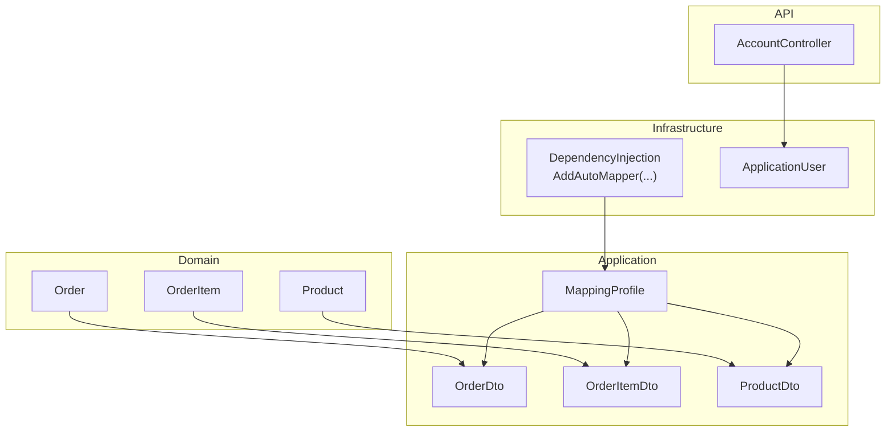
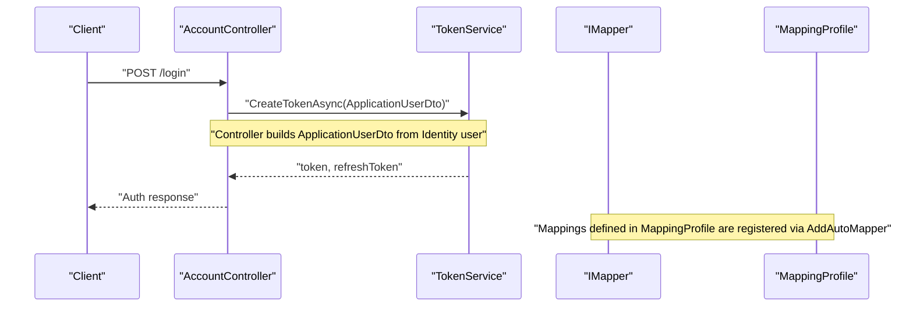
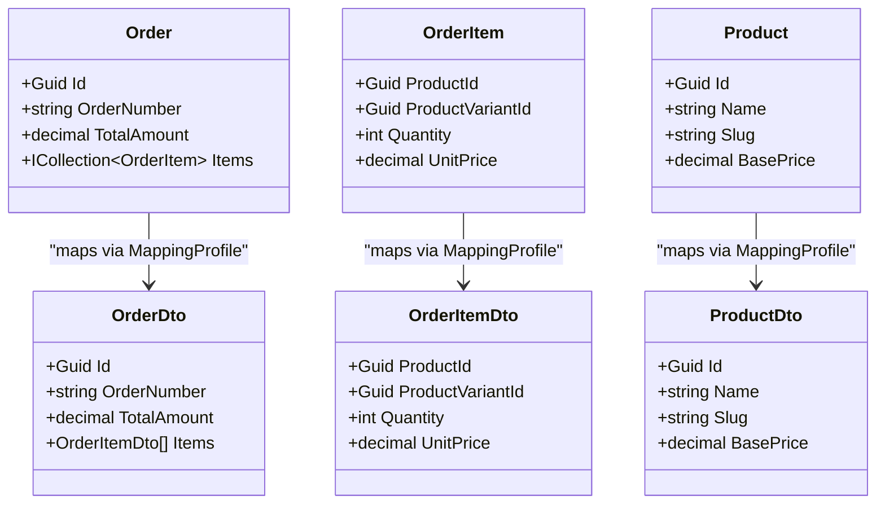
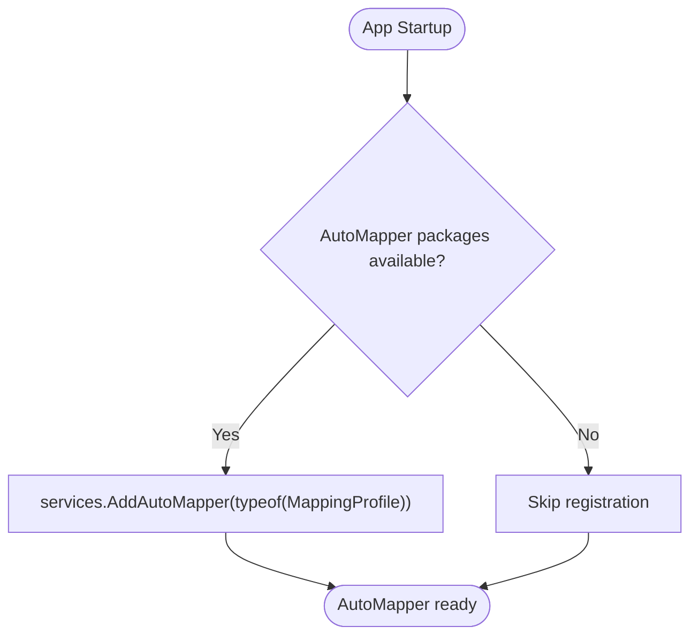
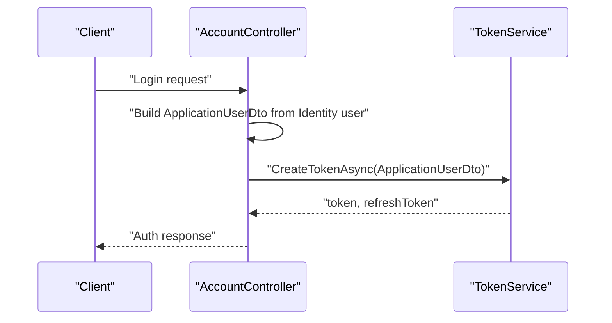

# DTOs and Mapping

<cite>
**Referenced Files in This Document**
- [OrderDto.cs](file://src/Ecommerce.Application/DTOs/OrderDto.cs)
- [ProductDto.cs](file://src/Ecommerce.Application/DTOs/ProductDto.cs)
- [ApplicationUserDto.cs](file://src/Ecommerce.Application/DTOs/ApplicationUserDto.cs)
- [MappingProfile.cs](file://src/Ecommerce.Application/Mappings/MappingProfile.cs)
- [Order.cs](file://src/Ecommerce.Domain/Entities/Order.cs)
- [OrderItem.cs](file://src/Ecommerce.Domain/Entities/OrderItem.cs)
- [Product.cs](file://src/Ecommerce.Domain/Entities/Product.cs)
- [ApplicationUser.cs](file://src/Ecommerce.Infrastructure/Identity/ApplicationUser.cs)
- [DependencyInjection.cs](file://src/Ecommerce.Infrastructure/DependencyInjection.cs)
- [AccountController.cs](file://src/Ecommerce.Api/Controllers/AccountController.cs)
- [Ecommerce.Application.csproj](file://src/Ecommerce.Application/Ecommerce.Application.csproj)
</cite>

## Table of Contents
1. [Introduction](#introduction)
2. [Project Structure](#project-structure)
3. [Core Components](#core-components)
4. [Architecture Overview](#architecture-overview)
5. [Detailed Component Analysis](#detailed-component-analysis)
6. [Dependency Analysis](#dependency-analysis)
7. [Performance Considerations](#performance-considerations)
8. [Troubleshooting Guide](#troubleshooting-guide)
9. [Conclusion](#conclusion)
10. [Appendices](#appendices)

## Introduction
This document explains how Data Transfer Objects (DTOs) and AutoMapper are used to decouple the API surface from domain entities. It focuses on:
- The DTOs used for data exchange: OrderDto, ProductDto, and ApplicationUserDto
- The AutoMapper configuration in MappingProfile that maps domain entities to DTOs
- Mapping strategies, conversion rules, and best practices for maintaining separation between domain models and API contracts
- Guidance for creating new DTOs and mapping configurations
- Performance considerations, validation, and testing approaches for mapping logic

## Project Structure
The mapping-related code is organized by layer:
- Domain layer defines rich entities with business behavior
- Application layer defines DTOs and AutoMapper profiles
- Infrastructure registers AutoMapper via dependency injection
- API controllers may construct DTOs or use mapped results

**Diagram sources**
- [Order.cs:8-34](file://src/Ecommerce.Domain/Entities/Order.cs#L8-L34)
- [OrderItem.cs:5-20](file://src/Ecommerce.Domain/Entities/OrderItem.cs#L5-L20)
- [Product.cs:6-42](file://src/Ecommerce.Domain/Entities/Product.cs#L6-L42)
- [OrderDto.cs:6-20](file://src/Ecommerce.Application/DTOs/OrderDto.cs#L6-L20)
- [ProductDto.cs:5-11](file://src/Ecommerce.Application/DTOs/ProductDto.cs#L5-L11)
- [MappingProfile.cs:7-27](file://src/Ecommerce.Application/Mappings/MappingProfile.cs#L7-L27)
- [DependencyInjection.cs:54-63](file://src/Ecommerce.Infrastructure/DependencyInjection.cs#L54-L63)
- [ApplicationUser.cs:6-17](file://src/Ecommerce.Infrastructure/Identity/ApplicationUser.cs#L6-L17)
- [AccountController.cs:102-106](file://src/Ecommerce.Api/Controllers/AccountController.cs#L102-L106)

**Section sources**
- [Order.cs:8-34](file://src/Ecommerce.Domain/Entities/Order.cs#L8-L34)
- [OrderItem.cs:5-20](file://src/Ecommerce.Domain/Entities/OrderItem.cs#L5-L20)
- [Product.cs:6-42](file://src/Ecommerce.Domain/Entities/Product.cs#L6-L42)
- [OrderDto.cs:6-20](file://src/Ecommerce.Application/DTOs/OrderDto.cs#L6-L20)
- [ProductDto.cs:5-11](file://src/Ecommerce.Application/DTOs/ProductDto.cs#L5-L11)
- [MappingProfile.cs:7-27](file://src/Ecommerce.Application/Mappings/MappingProfile.cs#L7-L27)
- [DependencyInjection.cs:54-63](file://src/Ecommerce.Infrastructure/DependencyInjection.cs#L54-L63)
- [ApplicationUser.cs:6-17](file://src/Ecommerce.Infrastructure/Identity/ApplicationUser.cs#L6-L17)
- [AccountController.cs:102-106](file://src/Ecommerce.Api/Controllers/AccountController.cs#L102-L106)

## Core Components
- OrderDto and OrderItemDto represent order data returned to consumers. They include identifiers, totals, and a list of items with product references, quantities, and pricing.
- ProductDto exposes a minimal product view suitable for APIs.
- ApplicationUserDto represents user identity information exposed to clients.
- MappingProfile configures AutoMapper mappings from domain entities to DTOs for Order, OrderItem, and Product.
- DependencyInjection registers AutoMapper with the application’s service container using the profile type.

Key responsibilities:
- Keep API contracts stable and independent of domain internals
- Centralize transformation rules in one place (MappingProfile)
- Avoid leaking domain-only fields into responses

**Section sources**
- [OrderDto.cs:6-20](file://src/Ecommerce.Application/DTOs/OrderDto.cs#L6-L20)
- [ProductDto.cs:5-11](file://src/Ecommerce.Application/DTOs/ProductDto.cs#L5-L11)
- [ApplicationUserDto.cs:5-10](file://src/Ecommerce.Application/DTOs/ApplicationUserDto.cs#L5-L10)
- [MappingProfile.cs:7-27](file://src/Ecommerce.Application/Mappings/MappingProfile.cs#L7-L27)
- [DependencyInjection.cs:54-63](file://src/Ecommerce.Infrastructure/DependencyInjection.cs#L54-L63)

## Architecture Overview
AutoMapper is configured in the infrastructure layer and consumed by application services or controllers. The mapping profile lives in the application layer, keeping transformation rules close to DTOs while remaining decoupled from persistence details.

**Diagram sources**
- [AccountController.cs:102-106](file://src/Ecommerce.Api/Controllers/AccountController.cs#L102-L106)
- [MappingProfile.cs:7-27](file://src/Ecommerce.Application/Mappings/MappingProfile.cs#L7-L27)
- [DependencyInjection.cs:54-63](file://src/Ecommerce.Infrastructure/DependencyInjection.cs#L54-L63)

## Detailed Component Analysis

### DTOs
- OrderDto
  - Purpose: Expose order summary and line items to API consumers
  - Fields: Id, OrderNumber, TotalAmount, Items
  - Notes: Items is a collection of OrderItemDto; this keeps payload size controlled and avoids exposing internal navigation properties
- OrderItemDto
  - Purpose: Represent a single line item with product references, quantity, and unit price
  - Fields: ProductId, ProductVariantId, Quantity, UnitPrice
- ProductDto
  - Purpose: Minimal product representation for listings or summaries
  - Fields: Id, Name, Slug, BasePrice
- ApplicationUserDto
  - Purpose: Lightweight user identity payload for token issuance or user info endpoints
  - Fields: Id, Email, UserName

Best practices observed:
- DTOs contain only what the API needs
- No domain behavior or persistence artifacts leak into DTOs
- Collections are explicitly typed to avoid accidental exposure of internal structures

**Section sources**
- [OrderDto.cs:6-20](file://src/Ecommerce.Application/DTOs/OrderDto.cs#L6-L20)
- [ProductDto.cs:5-11](file://src/Ecommerce.Application/DTOs/ProductDto.cs#L5-L11)
- [ApplicationUserDto.cs:5-10](file://src/Ecommerce.Application/DTOs/ApplicationUserDto.cs#L5-L10)

### AutoMapper Configuration
MappingProfile defines explicit mappings for:
- Order to OrderDto
- OrderItem to OrderItemDto
- Product to ProductDto

Current mapping strategy:
- Uses ForMember with MapFrom to map selected source properties to destination fields
- Keeps mapping rules explicit and readable
- Does not map all properties automatically, which helps prevent accidental exposure of sensitive or unused fields

**Diagram sources**
- [Order.cs:8-34](file://src/Ecommerce.Domain/Entities/Order.cs#L8-L34)
- [OrderItem.cs:5-20](file://src/Ecommerce.Domain/Entities/OrderItem.cs#L5-L20)
- [Product.cs:6-42](file://src/Ecommerce.Domain/Entities/Product.cs#L6-L42)
- [OrderDto.cs:6-20](file://src/Ecommerce.Application/DTOs/OrderDto.cs#L6-L20)
- [ProductDto.cs:5-11](file://src/Ecommerce.Application/DTOs/ProductDto.cs#L5-L11)
- [MappingProfile.cs:11-26](file://src/Ecommerce.Application/Mappings/MappingProfile.cs#L11-L26)

**Section sources**
- [MappingProfile.cs:7-27](file://src/Ecommerce.Application/Mappings/MappingProfile.cs#L7-L27)

### Dependency Injection Registration
AutoMapper is registered conditionally in the infrastructure layer. If the packages are present, it scans the specified profile assembly and registers mappings.

**Diagram sources**
- [DependencyInjection.cs:54-63](file://src/Ecommerce.Infrastructure/DependencyInjection.cs#L54-L63)
- [Ecommerce.Application.csproj:8-11](file://src/Ecommerce.Application/Ecommerce.Application.csproj#L8-L11)

**Section sources**
- [DependencyInjection.cs:54-63](file://src/Ecommerce.Infrastructure/DependencyInjection.cs#L54-L63)
- [Ecommerce.Application.csproj:8-11](file://src/Ecommerce.Application/Ecommerce.Application.csproj#L8-L11)

### Usage Example: AccountController
In the API controller, an ApplicationUserDto is constructed directly from the Identity user before issuing tokens. This demonstrates a simple case where manual construction is used instead of AutoMapper.

**Diagram sources**
- [AccountController.cs:102-106](file://src/Ecommerce.Api/Controllers/AccountController.cs#L102-L106)

**Section sources**
- [AccountController.cs:102-106](file://src/Ecommerce.Api/Controllers/AccountController.cs#L102-L106)

## Dependency Analysis
- Application layer depends on Domain for entity types used in mappings
- Infrastructure registers AutoMapper and provides IMapper to consumers
- API controllers can consume IMapper or build DTOs manually when appropriate

**Diagram sources**
- [Order.cs:8-34](file://src/Ecommerce.Domain/Entities/Order.cs#L8-L34)
- [OrderDto.cs:6-20](file://src/Ecommerce.Application/DTOs/OrderDto.cs#L6-L20)
- [MappingProfile.cs:7-27](file://src/Ecommerce.Application/Mappings/MappingProfile.cs#L7-L27)
- [DependencyInjection.cs:54-63](file://src/Ecommerce.Infrastructure/DependencyInjection.cs#L54-L63)
- [AccountController.cs:102-106](file://src/Ecommerce.Api/Controllers/AccountController.cs#L102-L106)

**Section sources**
- [Order.cs:8-34](file://src/Ecommerce.Domain/Entities/Order.cs#L8-L34)
- [OrderDto.cs:6-20](file://src/Ecommerce.Application/DTOs/OrderDto.cs#L6-L20)
- [MappingProfile.cs:7-27](file://src/Ecommerce.Application/Mappings/MappingProfile.cs#L7-L27)
- [DependencyInjection.cs:54-63](file://src/Ecommerce.Infrastructure/DependencyInjection.cs#L54-L63)
- [AccountController.cs:102-106](file://src/Ecommerce.Api/Controllers/AccountController.cs#L102-L106)

## Performance Considerations
- Prefer explicit mappings for large or complex objects to avoid unnecessary property copying
- Use CreateMap once per type pair; AutoMapper caches mappings after first use
- Avoid deep object graphs in DTOs; project only required fields to reduce serialization overhead
- When mapping collections, ensure the destination collection is initialized to avoid extra allocations
- Consider projection at the query layer (e.g., Select projections) to minimize data transferred before mapping

[No sources needed since this section provides general guidance]

## Troubleshooting Guide
Common issues and resolutions:
- AutoMapper not registered
  - Ensure AddAutoMapper is called with the correct profile type during startup
  - Verify package references exist in the application project
- Missing mappings cause runtime errors
  - Add missing CreateMap entries in MappingProfile
  - Validate property names and types match between source and destination
- Unexpected nulls or empty collections
  - Initialize collections in DTOs if needed
  - Confirm source collections are not null before mapping
- Circular references or deep graphs
  - Limit DTO depth; avoid including full entity graphs unless necessary

Validation tips:
- Enable AutoMapper configuration validation in tests to catch mapping issues early
- Write unit tests that assert expected fields are mapped correctly

Testing approach:
- Create unit tests that instantiate source entities and verify the resulting DTOs have expected values
- Test edge cases such as null collections, zero quantities, and boundary numeric values

**Section sources**
- [DependencyInjection.cs:54-63](file://src/Ecommerce.Infrastructure/DependencyInjection.cs#L54-L63)
- [Ecommerce.Application.csproj:8-11](file://src/Ecommerce.Application/Ecommerce.Application.csproj#L8-L11)
- [MappingProfile.cs:7-27](file://src/Ecommerce.Application/Mappings/MappingProfile.cs#L7-L27)

## Conclusion
The application uses DTOs to define stable API contracts and AutoMapper to transform domain entities into those contracts. MappingProfile centralizes transformation rules, while dependency injection wires AutoMapper into the app. Following the patterns here ensures clear separation between domain models and API surfaces, predictable behavior, and maintainable evolution of both layers.

[No sources needed since this section summarizes without analyzing specific files]

## Appendices

### How to Create a New DTO and Mapping
Steps:
1. Define a new DTO in the Application layer under DTOs
2. Add a CreateMap entry in MappingProfile to map from the relevant domain entity
3. Use IMapper in your service or controller to perform the mapping
4. Add unit tests to validate the mapping produces expected output

Example pattern reference:
- See existing mappings for Order, OrderItem, and Product to guide structure and style

**Section sources**
- [OrderDto.cs:6-20](file://src/Ecommerce.Application/DTOs/OrderDto.cs#L6-L20)
- [ProductDto.cs:5-11](file://src/Ecommerce.Application/DTOs/ProductDto.cs#L5-L11)
- [MappingProfile.cs:11-26](file://src/Ecommerce.Application/Mappings/MappingProfile.cs#L11-L26)