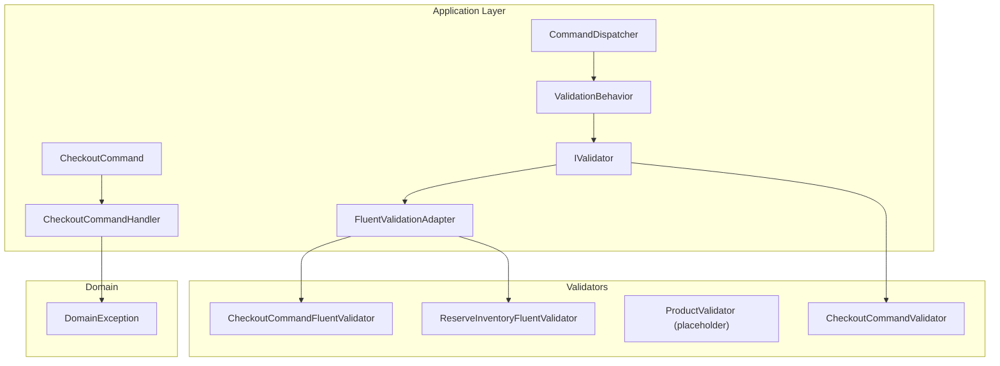
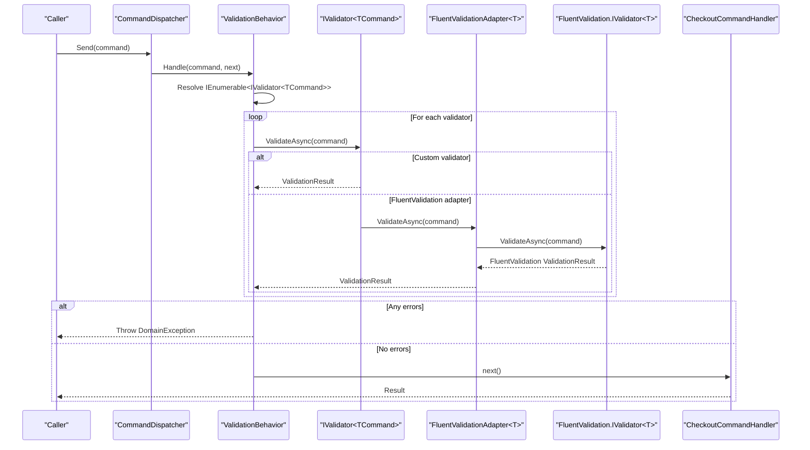
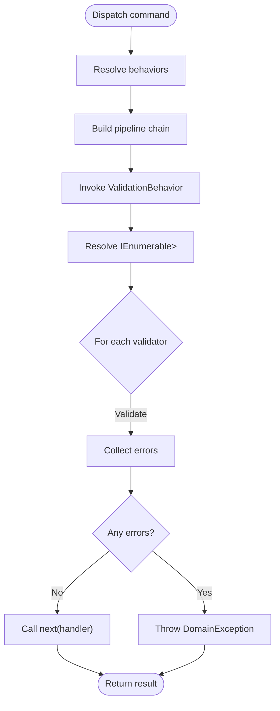
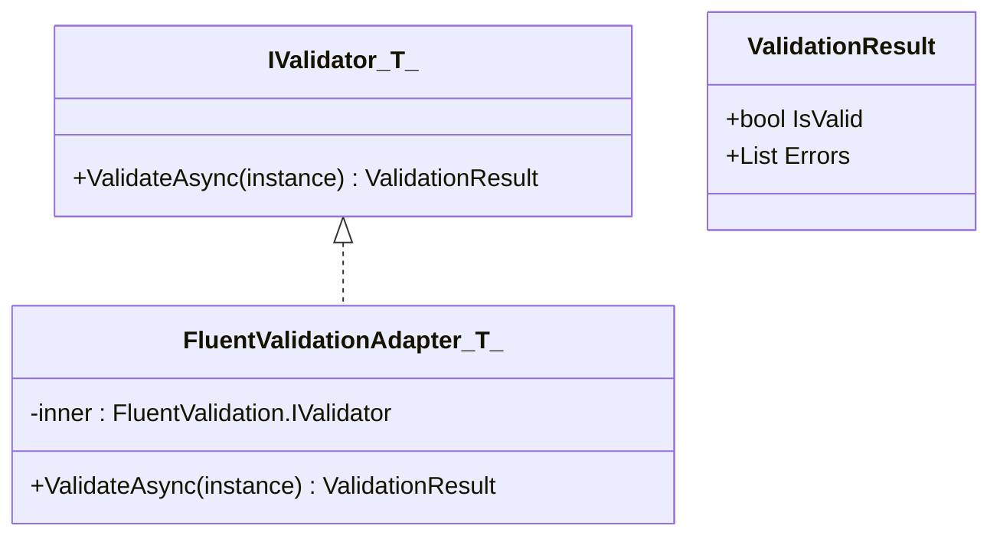
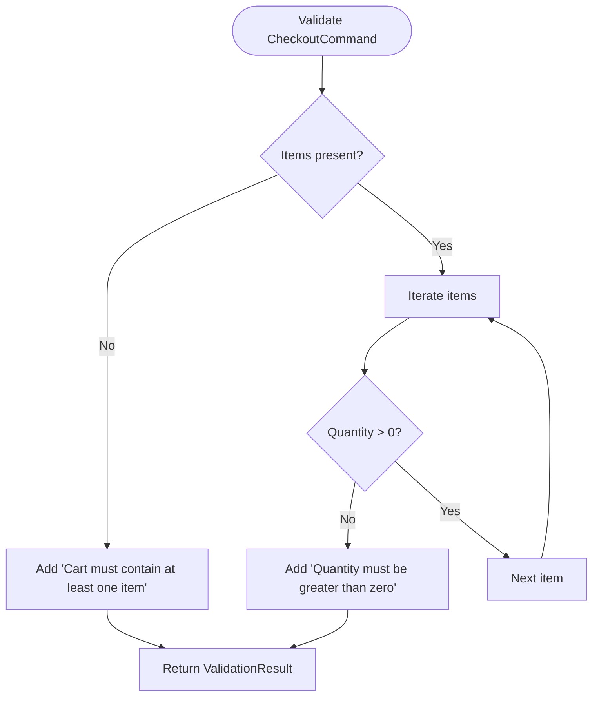
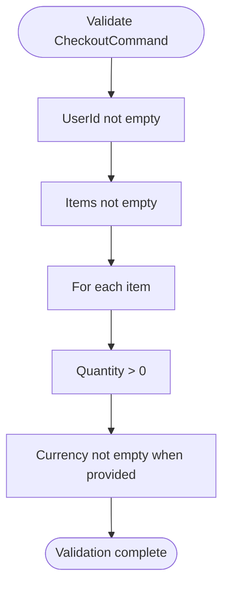
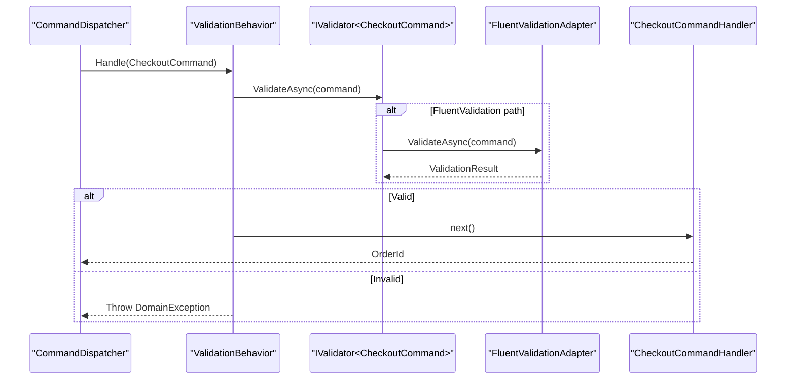
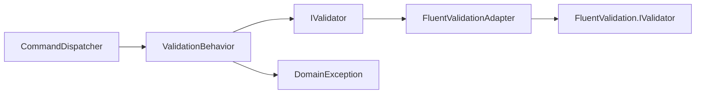

# Validation System

<cite>
**Referenced Files in This Document**
- [CheckoutCommand.cs](file://src/Ecommerce.Application/Commands/Checkout/CheckoutCommand.cs)
- [CheckoutCommandHandler.cs](file://src/Ecommerce.Application/Commands/Checkout/CheckoutCommandHandler.cs)
- [CheckoutCommandValidator.cs](file://src/Ecommerce.Application/Commands/Checkout/CheckoutCommandValidator.cs)
- [CheckoutCommandFluentValidator.cs](file://src/Ecommerce.Application/Validators/CheckoutCommandFluentValidator.cs)
- [ProductValidator.cs](file://src/Ecommerce.Application/Validators/ProductValidator.cs)
- [ReserveInventoryFluentValidator.cs](file://src/Ecommerce.Application/Validators/ReserveInventoryFluentValidator.cs)
- [IValidator.cs](file://src/Ecommerce.Application/Common\Validation\IValidator.cs)
- [FluentValidationAdapter.cs](file://src/Ecommerce.Application/Common\Validation\FluentValidationAdapter.cs)
- [CommandDispatcher.cs](file://src/Ecommerce.Application/Common\Commands\CommandDispatcher.cs)
- [ICommandBehavior.cs](file://src/Ecommerce.Application/Common\Commands\ICommandBehavior.cs)
- [ValidationBehavior.cs](file://src/Ecommerce.Application\Common\Commands\ValidationBehavior.cs)
- [DomainException.cs](file://src/Ecommerce.Domain\Exceptions\DomainException.cs)
</cite>

## Table of Contents
1. [Introduction](#introduction)
2. [Project Structure](#project-structure)
3. [Core Components](#core-components)
4. [Architecture Overview](#architecture-overview)
5. [Detailed Component Analysis](#detailed-component-analysis)
6. [Dependency Analysis](#dependency-analysis)
7. [Performance Considerations](#performance-considerations)
8. [Troubleshooting Guide](#troubleshooting-guide)
9. [Conclusion](#conclusion)
10. [Appendices](#appendices)

## Introduction
This document explains the validation system that integrates FluentValidation into the application layer via a consistent IValidator abstraction and a command pipeline behavior. It covers how custom validators enforce business rules, how validation errors are collected and surfaced, and how to create new validators and integrate them into the command pipeline. It also addresses cross-field validation scenarios, performance considerations, and testing strategies.

## Project Structure
The validation system spans three main areas:
- Command model and handlers under Commands
- Validators (both custom IValidator implementations and FluentValidation-based validators) under Validators
- Common abstractions and pipeline behaviors under Common

**Diagram sources**
- [CommandDispatcher.cs:20-44](file://src/Ecommerce.Application/Common/Commands/CommandDispatcher.cs#L20-L44)
- [ValidationBehavior.cs:17-38](file://src/Ecommerce.Application/Common/Commands/ValidationBehavior.cs#L17-L38)
- [IValidator.cs:5-14](file://src/Ecommerce.Application/Common/Validation/IValidator.cs#L5-L14)
- [FluentValidationAdapter.cs:6-25](file://src/Ecommerce.Application/Common/Validation/FluentValidationAdapter.cs#L6-L25)
- [CheckoutCommandFluentValidator.cs:5-16](file://src/Ecommerce.Application/Validators/CheckoutCommandFluentValidator.cs#L5-L16)
- [ReserveInventoryFluentValidator.cs:5-11](file://src/Ecommerce.Application/Validators/ReserveInventoryFluentValidator.cs#L5-L11)
- [CheckoutCommandValidator.cs:6-30](file://src/Ecommerce.Application/Commands/Checkout/CheckoutCommandValidator.cs#L6-L30)
- [CheckoutCommandHandler.cs:22-90](file://src/Ecommerce.Application/Commands/Checkout/CheckoutCommandHandler.cs#L22-L90)
- [DomainException.cs:5-8](file://src/Ecommerce.Domain/Exceptions/Dom ainException.cs#L5-L8)

**Section sources**
- [CommandDispatcher.cs:20-44](file://src/Ecommerce.Application/Common/Commands/CommandDispatcher.cs#L20-L44)
- [ValidationBehavior.cs:17-38](file://src/Ecommerce.Application/Common/Commands/ValidationBehavior.cs#L17-L38)
- [IValidator.cs:5-14](file://src/Ecommerce.Application/Common/Validation/IValidator.cs#L5-L14)
- [FluentValidationAdapter.cs:6-25](file://src/Ecommerce.Application/Common/Validation/FluentValidationAdapter.cs#L6-L25)
- [CheckoutCommandFluentValidator.cs:5-16](file://src/Ecommerce.Application/Validators/CheckoutCommandFluentValidator.cs#L5-L16)
- [ReserveInventoryFluentValidator.cs:5-11](file://src/Ecommerce.Application/Validators/ReserveInventoryFluentValidator.cs#L5-L11)
- [CheckoutCommandValidator.cs:6-30](file://src/Ecommerce.Application/Commands/Checkout/CheckoutCommandValidator.cs#L6-L30)
- [CheckoutCommandHandler.cs:22-90](file://src/Ecommerce.Application/Commands/Checkout/CheckoutCommandHandler.cs#L22-L90)
- [DomainException.cs:5-8](file://src/Ecommerce.Domain/Exceptions/Dom ainException.cs#L5-L8)

## Core Components
- IValidator<T> and ValidationResult define a uniform validation contract used by the pipeline.
- FluentValidationAdapter bridges FluentValidation’s validators to IValidator<T>, mapping FluentValidation results to ValidationResult.
- ValidationBehavior executes all registered IValidator<TCommand> instances before invoking the handler, aggregating errors and throwing a DomainException when validation fails.
- CommandDispatcher wires behaviors around the handler, enabling cross-cutting concerns like validation and logging.

Key responsibilities:
- Abstraction: IValidator<T> decouples validation logic from FluentValidation specifics.
- Integration: FluentValidationAdapter adapts FluentValidation validators for use with IValidator<T>.
- Pipeline: ValidationBehavior ensures commands are validated before processing.
- Error handling: ValidationBehavior aggregates errors and throws a domain-level exception to be handled upstream.

**Section sources**
- [IValidator.cs:5-14](file://src/Ecommerce.Application/Common/Validation/IValidator.cs#L5-L14)
- [FluentValidationAdapter.cs:6-25](file://src/Ecommerce.Application/Common/Validation/FluentValidationAdapter.cs#L6-L25)
- [ValidationBehavior.cs:17-38](file://src/Ecommerce.Application/Common/Commands/ValidationBehavior.cs#L17-L38)
- [CommandDispatcher.cs:20-44](file://src/Ecommerce.Application/Common/Commands/CommandDispatcher.cs#L20-L44)
- [DomainException.cs:5-8](file://src/Ecommerce.Domain/Exceptions/Dom ainException.cs#L5-L8)

## Architecture Overview
The command pipeline applies behaviors in reverse order around the handler. ValidationBehavior runs first, resolving all IValidator<TCommand> instances, validating the command, and either proceeding or failing fast with a DomainException.

**Diagram sources**
- [CommandDispatcher.cs:20-44](file://src/Ecommerce.Application/Common/Commands/CommandDispatcher.cs#L20-L44)
- [ValidationBehavior.cs:17-38](file://src/Ecommerce.Application/Common/Commands/ValidationBehavior.cs#L17-L38)
- [FluentValidationAdapter.cs:15-25](file://src/Ecommerce.Application/Common/Validation/FluentValidationAdapter.cs#L15-L25)
- [CheckoutCommandHandler.cs:22-90](file://src/Ecommerce.Application/Commands/Checkout/CheckoutCommandHandler.cs#L22-L90)

## Detailed Component Analysis

### ValidationPipeline (CommandDispatcher + ValidationBehavior)
- CommandDispatcher resolves ICommandHandler<TCommand, TResult> and composes behaviors around it. Behaviors are resolved as an enumerable and chained so that the last behavior wraps the handler first.
- ValidationBehavior resolves all IValidator<TCommand> implementations, validates the command through each, aggregates errors, and throws a DomainException if any exist.

**Diagram sources**
- [CommandDispatcher.cs:20-44](file://src/Ecommerce.Application/Common/Commands/CommandDispatcher.cs#L20-L44)
- [ValidationBehavior.cs:17-38](file://src/Ecommerce.Application/Common/Commands/ValidationBehavior.cs#L17-L38)
- [DomainException.cs:5-8](file://src/Ecommerce.Domain/Exceptions/Dom ainException.cs#L5-L8)

**Section sources**
- [CommandDispatcher.cs:20-44](file://src/Ecommerce.Application/Common/Commands/CommandDispatcher.cs#L20-L44)
- [ValidationBehavior.cs:17-38](file://src/Ecommerce.Application/Common/Commands/ValidationBehavior.cs#L17-L38)

### IValidator<T> and FluentValidationAdapter
- IValidator<T> defines a single async validation method returning ValidationResult.
- FluentValidationAdapter<T> wraps a FluentValidation.IValidator<T> and maps its result to ValidationResult, including error messages.

**Diagram sources**
- [IValidator.cs:5-14](file://src/Ecommerce.Application/Common/Validation/IValidator.cs#L5-L14)
- [FluentValidationAdapter.cs:6-25](file://src/Ecommerce.Application/Common/Validation/FluentValidationAdapter.cs#L6-L25)

**Section sources**
- [IValidator.cs:5-14](file://src/Ecommerce.Application/Common/Validation/IValidator.cs#L5-L14)
- [FluentValidationAdapter.cs:6-25](file://src/Ecommerce.Application/Common/Validation/FluentValidationAdapter.cs#L6-L25)

### Custom Validators

#### CheckoutCommandValidator (custom IValidator implementation)
- Validates that the cart contains at least one item and that each item has a positive quantity.
- Returns ValidationResult with aggregated error messages.

**Diagram sources**
- [CheckoutCommandValidator.cs:6-30](file://src/Ecommerce.Application/Commands/Checkout/CheckoutCommandValidator.cs#L6-L30)

**Section sources**
- [CheckoutCommandValidator.cs:6-30](file://src/Ecommerce.Application/Commands/Checkout/CheckoutCommandValidator.cs#L6-L30)

#### CheckoutCommandFluentValidator (FluentValidation-based)
- Enforces non-empty UserId, non-empty Items, per-item Quantity > 0, and conditional Currency rule.
- Uses FluentValidation’s RuleFor, RuleForEach, ChildRules, and When constructs.

**Diagram sources**
- [CheckoutCommandFluentValidator.cs:5-16](file://src/Ecommerce.Application/Validators/CheckoutCommandFluentValidator.cs#L5-L16)

**Section sources**
- [CheckoutCommandFluentValidator.cs:5-16](file://src/Ecommerce.Application/Validators/CheckoutCommandFluentValidator.cs#L5-L16)

#### ReserveInventoryFluentValidator
- Ensures InventoryItemId is not empty and Quantity is greater than zero.

**Section sources**
- [ReserveInventoryFluentValidator.cs:5-11](file://src/Ecommerce.Application/Validators/ReserveInventoryFluentValidator.cs#L5-L11)

#### ProductValidator (placeholder)
- Placeholder class indicating where product-related validation can be added.

**Section sources**
- [ProductValidator.cs:1-8](file://src/Ecommerce.Application/Validators/ProductValidator.cs#L1-L8)

### Command Model and Handler
- CheckoutCommand carries UserId, Items, Currency, ShippingAddress, and IdempotencyKey.
- CheckoutCommandHandler performs idempotency checks, builds an order, reserves inventory, persists changes, and returns the order identifier.

**Diagram sources**
- [CommandDispatcher.cs:20-44](file://src/Ecommerce.Application/Common/Commands/CommandDispatcher.cs#L20-L44)
- [ValidationBehavior.cs:17-38](file://src/Ecommerce.Application/Common/Commands/ValidationBehavior.cs#L17-L38)
- [FluentValidationAdapter.cs:15-25](file://src/Ecommerce.Application/Common/Validation/FluentValidationAdapter.cs#L15-L25)
- [CheckoutCommandHandler.cs:22-90](file://src/Ecommerce.Application/Commands/Checkout/CheckoutCommandHandler.cs#L22-L90)

**Section sources**
- [CheckoutCommand.cs:6-20](file://src/Ecommerce.Application/Commands/Checkout/CheckoutCommand.cs#L6-L20)
- [CheckoutCommandHandler.cs:22-90](file://src/Ecommerce.Application/Commands/Checkout/CheckoutCommandHandler.cs#L22-L90)

## Dependency Analysis
- CommandDispatcher depends on Microsoft.Extensions.DependencyInjection to resolve handlers and behaviors.
- ValidationBehavior depends on IServiceProvider to resolve all IValidator<TCommand> implementations.
- FluentValidationAdapter depends on FluentValidation.IValidator<T>.
- Handlers may throw DomainException; ValidationBehavior surfaces validation failures as DomainException.

**Diagram sources**
- [CommandDispatcher.cs:20-44](file://src/Ecommerce.Application/Common/Commands/CommandDispatcher.cs#L20-L44)
- [ValidationBehavior.cs:17-38](file://src/Ecommerce.Application/Common/Commands/ValidationBehavior.cs#L17-L38)
- [FluentValidationAdapter.cs:6-25](file://src/Ecommerce.Application/Common/Validation/FluentValidationAdapter.cs#L6-L25)
- [DomainException.cs:5-8](file://src/Ecommerce.Domain/Exceptions/Dom ainException.cs#L5-L8)

**Section sources**
- [CommandDispatcher.cs:20-44](file://src/Ecommerce.Application/Common/Commands/CommandDispatcher.cs#L20-L44)
- [ValidationBehavior.cs:17-38](file://src/Ecommerce.Application/Common/Commands/ValidationBehavior.cs#L17-L38)
- [FluentValidationAdapter.cs:6-25](file://src/Ecommerce.Application/Common/Validation/FluentValidationAdapter.cs#L6-L25)
- [DomainException.cs:5-8](file://src/Ecommerce.Domain/Exceptions/Dom ainException.cs#L5-L8)

## Performance Considerations
- Validation occurs once per command invocation within the pipeline; ensure validators are lightweight and avoid expensive operations inside validation rules.
- Prefer FluentValidation’s built-in rules for efficiency and readability.
- Avoid redundant validations across multiple validators for the same command; consolidate rules where possible.
- Use asynchronous validation only when necessary; synchronous checks are faster for simple validations.
- Be mindful of object graph traversal in complex commands; validate only required fields to reduce overhead.

[No sources needed since this section provides general guidance]

## Troubleshooting Guide
- Validation errors surface as a DomainException thrown by ValidationBehavior. Upstream layers should catch and translate these into appropriate HTTP responses or user-facing messages.
- If no errors appear despite invalid input, verify that:
  - The command has a corresponding IValidator<TCommand> registered in DI.
  - For FluentValidation validators, ensure they are wrapped with FluentValidationAdapter<T> and registered as IValidator<TCommand>.
  - The command pipeline includes ValidationBehavior.
- For cross-field validation, prefer FluentValidation’s When and custom rules to express dependencies between fields cleanly.

**Section sources**
- [ValidationBehavior.cs:17-38](file://src/Ecommerce.Application/Common/Commands/ValidationBehavior.cs#L17-L38)
- [DomainException.cs:5-8](file://src/Ecommerce.Domain/Exceptions/Dom ainException.cs#L5-L8)

## Conclusion
The validation system provides a clean separation of concerns:
- IValidator<T> abstracts validation logic.
- FluentValidationAdapter enables seamless integration with FluentValidation.
- ValidationBehavior enforces validation early in the command pipeline and centralizes error aggregation.
- Custom and FluentValidation-based validators coexist and are uniformly executed by the pipeline.

This design supports extensibility, testability, and maintainable business rule enforcement at the application layer.

[No sources needed since this section summarizes without analyzing specific files]

## Appendices

### Creating a New Validator
- For simple rules, implement IValidator<TCommand> and register it in dependency injection.
- For complex or reusable rules, create a FluentValidation.AbstractValidator<TCommand> and wrap it with FluentValidationAdapter<TCommand> for registration as IValidator<TCommand>.
- Ensure ValidationBehavior is included in the command pipeline so your validator is executed automatically.

[No sources needed since this section provides general guidance]

### Cross-Field Validation Scenarios
- Use FluentValidation’s When to conditionally apply rules based on other fields.
- Use custom rules to compare fields or enforce constraints across multiple properties.
- Aggregate meaningful error messages to aid debugging and user feedback.

[No sources needed since this section provides general guidance]

### Testing Strategies
- Unit test validators directly against sample commands to assert IsValid and Errors.
- Test the command pipeline by invoking CommandDispatcher.Send with both valid and invalid commands and asserting expected outcomes or exceptions.
- Mock external dependencies in handlers to isolate validation behavior.

[No sources needed since this section provides general guidance]