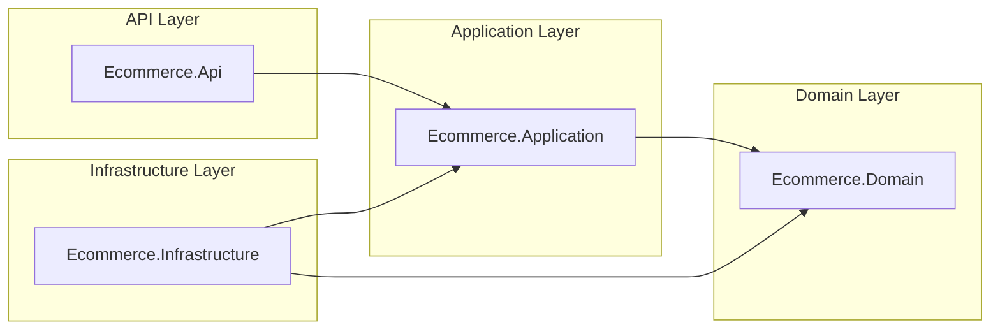
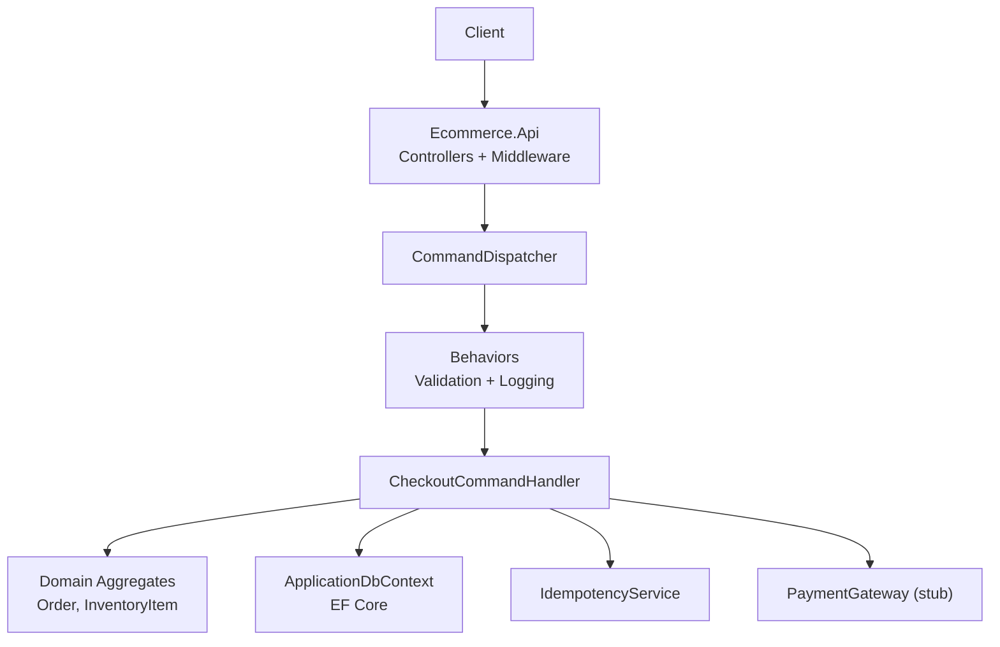
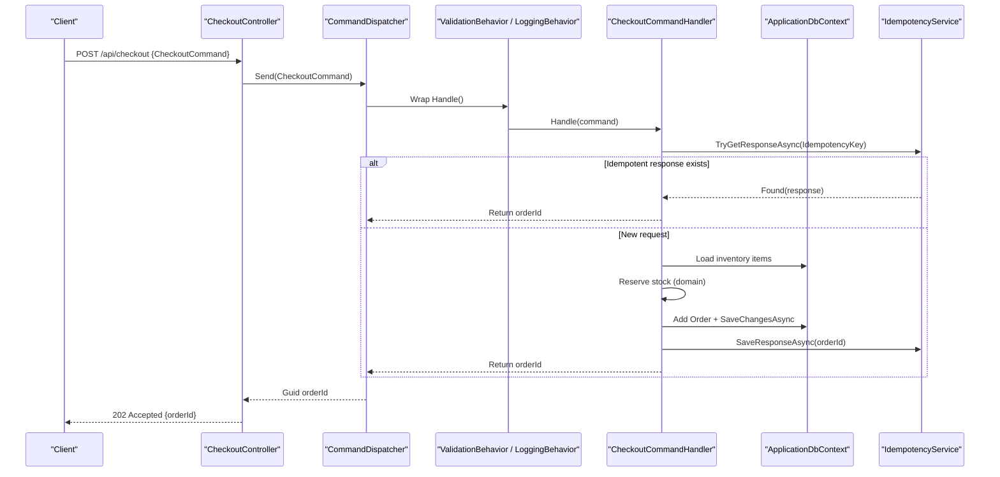
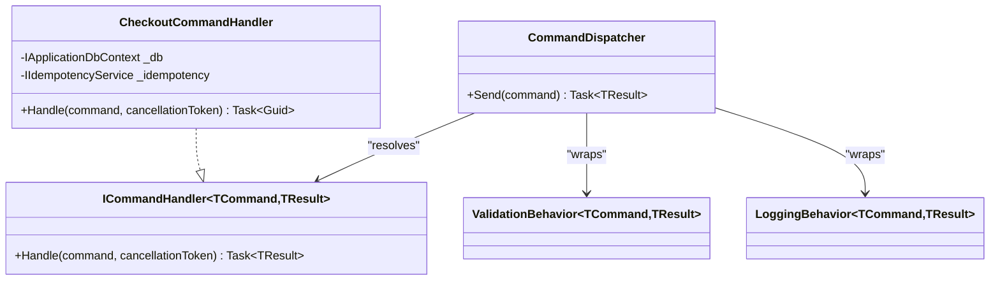
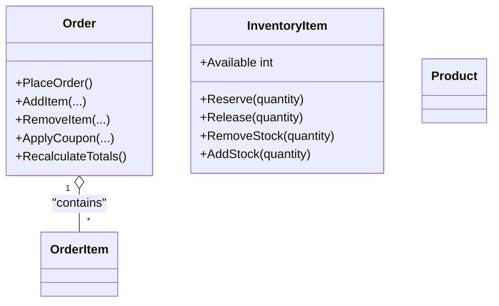
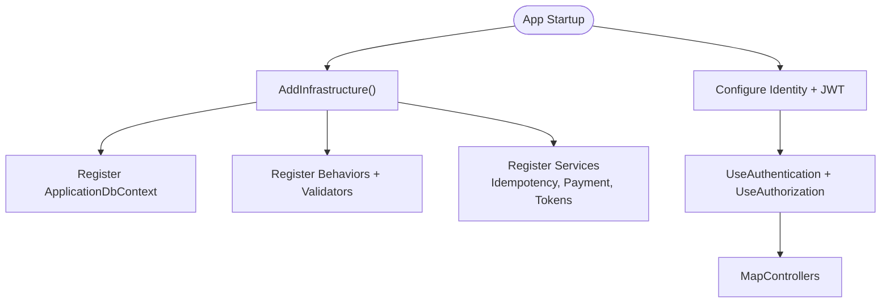
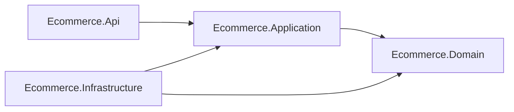

# Architecture

<cite>
**Referenced Files in This Document**
- [README.md](file://README.md)
- [Program.cs](file://src/Ecommerce.Api/Program.cs)
- [CheckoutController.cs](file://src/Ecommerce.Api/Controllers/CheckoutController.cs)
- [DependencyInjection.cs](file://src/Ecommerce.Infrastructure/DependencyInjection.cs)
- [ApplicationDbContext.cs](file://src/Ecommerce.Infrastructure/Persistence/ApplicationDbContext.cs)
- [CommandDispatcher.cs](file://src/Ecommerce.Application/Common/Commands/CommandDispatcher.cs)
- [ICommandHandler.cs](file://src/Ecommerce.Application/Common/Commands/ICommandHandler.cs)
- [CheckoutCommand.cs](file://src/Ecommerce.Application/Commands/Checkout/CheckoutCommand.cs)
- [CheckoutCommandHandler.cs](file://src/Ecommerce.Application/Commands/Checkout/CheckoutCommandHandler.cs)
- [Product.cs](file://src/Ecommerce.Domain/Entities/Product.cs)
- [Order.cs](file://src/Ecommerce.Domain/Entities/Order.cs)
- [InventoryItem.cs](file://src/Ecommerce.Domain/Entities/InventoryItem.cs)
- [dependency_diagram.md](file://docs/architecture/dependency_diagram.md)
- [domain_rules_and_usecases.md](file://docs/architecture/domain_rules_and_usecases.md)
</cite>

## Table of Contents
1. Introduction
2. Project Structure
3. Core Components
4. Architecture Overview
5. Detailed Component Analysis
6. Dependency Analysis
7. Performance Considerations
8. Troubleshooting Guide
9. Conclusion

## Introduction
This document describes the E-Commerce Backend architecture implemented with Clean Architecture principles. It explains how the API, Application, Domain, and Infrastructure layers are separated, how CQRS is applied via commands and handlers, and how cross-cutting concerns such as authentication, validation, logging, and idempotency are integrated. It also covers data flows, integration patterns, scalability considerations, and architectural trade-offs.

The system scaffolds a production-ready e-commerce backend with:
- A thin API layer that delegates to application use cases
- An application layer implementing CQRS (commands and handlers) with behaviors for validation and logging
- A domain layer encapsulating business rules in entities and value objects
- An infrastructure layer providing persistence (EF Core), identity/JWT configuration, payment gateway stubs, and idempotency services

**Section sources**
- [README.md:1-34](file://README.md#L1-L34)

## Project Structure
The solution follows Clean Architecture with clear layer boundaries:
- Ecommerce.Api: HTTP controllers, middleware pipeline, DI composition root
- Ecommerce.Application: Commands, handlers, DTOs, validators, interfaces for external dependencies
- Ecommerce.Domain: Entities, value objects, domain events, exceptions
- Ecommerce.Infrastructure: EF Core DbContext, repositories, identity, payments, idempotency, background services

**Diagram sources**
- [dependency_diagram.md:1-33](file://docs/architecture/dependency_diagram.md#L1-L33)

**Section sources**
- [dependency_diagram.md:1-33](file://docs/architecture/dependency_diagram.md#L1-L33)

## Core Components
- Command Dispatcher: Central entry point for command handling; resolves handlers and applies pipeline behaviors (validation, logging).
- Command Handlers: Implement use cases (e.g., checkout) using domain aggregates and infrastructure abstractions.
- Domain Aggregates: Encapsulate business rules (e.g., Order totals, Inventory reservations).
- Persistence Abstraction: IApplicationDbContext exposes DbSets while keeping EF Core details in Infrastructure.
- Cross-Cutting Services: Idempotency, JWT token service, payment gateway interface, refresh token management.

Key responsibilities:
- API: Receives requests, maps to commands, returns results.
- Application: Orchestrates use cases, validates inputs, coordinates domain and infrastructure.
- Domain: Enforces invariants and state transitions.
- Infrastructure: Implements persistence, auth, payments, and background tasks.

**Section sources**
- [CommandDispatcher.cs:1-47](file://src/Ecommerce.Application/Common/Commands/CommandDispatcher.cs#L1-L47)
- [ICommandHandler.cs:1-11](file://src/Ecommerce.Application/Common/Commands/ICommandHandler.cs#L1-L11)
- [CheckoutCommandHandler.cs:1-94](file://src/Ecommerce.Application/Commands/Checkout/CheckoutCommandHandler.cs#L1-L94)
- [Order.cs:1-105](file://src/Ecommerce.Domain/Entities/Order.cs#L1-L105)
- [InventoryItem.cs:1-70](file://src/Ecommerce.Domain/Entities/InventoryItem.cs#L1-L70)
- [ApplicationDbContext.cs:1-43](file://src/Ecommerce.Infrastructure/Persistence/ApplicationDbContext.cs#L1-L43)

## Architecture Overview
The system uses Clean Architecture with CQRS at the application layer. Requests enter through controllers, which dispatch commands via the CommandDispatcher. Behaviors wrap handler execution for validation and logging. Handlers coordinate domain operations and persist changes through IApplicationDbContext. Infrastructure provides concrete implementations for persistence, identity/JWT, payments, and idempotency.

**Diagram sources**
- [Program.cs:1-77](file://src/Ecommerce.Api/Program.cs#L1-L77)
- [CheckoutController.cs:1-27](file://src/Ecommerce.Api/Controllers/CheckoutController.cs#L1-L27)
- [CommandDispatcher.cs:1-47](file://src/Ecommerce.Application/Common/Commands/CommandDispatcher.cs#L1-L47)
- [CheckoutCommandHandler.cs:1-94](file://src/Ecommerce.Application/Commands/Checkout/CheckoutCommandHandler.cs#L1-L94)
- [ApplicationDbContext.cs:1-43](file://src/Ecommerce.Infrastructure/Persistence/ApplicationDbContext.cs#L1-L43)
- [DependencyInjection.cs:1-89](file://src/Ecommerce.Infrastructure/DependencyInjection.cs#L1-L89)

## Detailed Component Analysis

### API Layer: Controllers and Middleware
- Controllers map HTTP endpoints to commands via CommandDispatcher.
- Authentication and authorization are configured in Program.cs using ASP.NET Core Identity and JWT Bearer.
- Swagger is enabled in development for API exploration.

**Diagram sources**
- [CheckoutController.cs:1-27](file://src/Ecommerce.Api/Controllers/CheckoutController.cs#L1-L27)
- [CommandDispatcher.cs:1-47](file://src/Ecommerce.Application/Common/Commands/CommandDispatcher.cs#L1-L47)
- [CheckoutCommandHandler.cs:1-94](file://src/Ecommerce.Application/Commands/Checkout/CheckoutCommandHandler.cs#L1-L94)
- [ApplicationDbContext.cs:1-43](file://src/Ecommerce.Infrastructure/Persistence/ApplicationDbContext.cs#L1-L43)
- [DependencyInjection.cs:1-89](file://src/Ecommerce.Infrastructure/DependencyInjection.cs#L1-L89)

**Section sources**
- [Program.cs:1-77](file://src/Ecommerce.Api/Program.cs#L1-L77)
- [CheckoutController.cs:1-27](file://src/Ecommerce.Api/Controllers/CheckoutController.cs#L1-L27)

### Application Layer: CQRS and Behaviors
- Commands represent intent (e.g., CheckoutCommand).
- Handlers implement use cases by orchestrating domain logic and infrastructure calls.
- Behaviors provide cross-cutting concerns:
  - ValidationBehavior: Validates commands before handling.
  - LoggingBehavior: Logs command lifecycle.
- The dispatcher composes behaviors around handlers.

**Diagram sources**
- [CommandDispatcher.cs:1-47](file://src/Ecommerce.Application/Common/Commands/CommandDispatcher.cs#L1-L47)
- [ICommandHandler.cs:1-11](file://src/Ecommerce.Application/Common/Commands/ICommandHandler.cs#L1-L11)
- [CheckoutCommandHandler.cs:1-94](file://src/Ecommerce.Application/Commands/Checkout/CheckoutCommandHandler.cs#L1-L94)

**Section sources**
- [CommandDispatcher.cs:1-47](file://src/Ecommerce.Application/Common/Commands/CommandDispatcher.cs#L1-L47)
- [ICommandHandler.cs:1-11](file://src/Ecommerce.Application/Common/Commands/ICommandHandler.cs#L1-L11)
- [CheckoutCommand.cs:1-22](file://src/Ecommerce.Application/Commands/Checkout/CheckoutCommand.cs#L1-L22)
- [CheckoutCommandHandler.cs:1-94](file://src/Ecommerce.Application/Commands/Checkout/CheckoutCommandHandler.cs#L1-L94)

### Domain Layer: Aggregates and Invariants
- Order aggregate enforces pricing and status invariants, recalculates totals, and manages order lifecycle.
- InventoryItem aggregate enforces stock constraints and supports reservation/release/remove operations.
- Product entity models catalog attributes and relationships.

**Diagram sources**
- [Order.cs:1-105](file://src/Ecommerce.Domain/Entities/Order.cs#L1-L105)
- [InventoryItem.cs:1-70](file://src/Ecommerce.Domain/Entities/InventoryItem.cs#L1-L70)
- [Product.cs:1-44](file://src/Ecommerce.Domain/Entities/Product.cs#L1-L44)

**Section sources**
- [Order.cs:1-105](file://src/Ecommerce.Domain/Entities/Order.cs#L1-L105)
- [InventoryItem.cs:1-70](file://src/Ecommerce.Domain/Entities/InventoryItem.cs#L1-L70)
- [Product.cs:1-44](file://src/Ecommerce.Domain/Entities/Product.cs#L1-L44)

### Infrastructure Layer: Persistence, Auth, and Services
- DependencyInjection registers EF Core DbContext, command dispatcher, behaviors, validators, AutoMapper, payment gateway, idempotency, refresh tokens, and hosted cleanup service.
- ApplicationDbContext implements IApplicationDbContext and configures EF Core model from assembly configurations.
- Identity and JWT are configured in Program.cs for authentication and authorization.

**Diagram sources**
- [DependencyInjection.cs:1-89](file://src/Ecommerce.Infrastructure/DependencyInjection.cs#L1-L89)
- [ApplicationDbContext.cs:1-43](file://src/Ecommerce.Infrastructure/Persistence/ApplicationDbContext.cs#L1-L43)
- [Program.cs:1-77](file://src/Ecommerce.Api/Program.cs#L1-L77)

**Section sources**
- [DependencyInjection.cs:1-89](file://src/Ecommerce.Infrastructure/DependencyInjection.cs#L1-L89)
- [ApplicationDbContext.cs:1-43](file://src/Ecommerce.Infrastructure/Persistence/ApplicationDbContext.cs#L1-L43)
- [Program.cs:1-77](file://src/Ecommerce.Api/Program.cs#L1-L77)

## Dependency Analysis
Layer dependency direction ensures loose coupling:
- API depends on Application (commands, dispatcher).
- Application depends on Domain (entities, exceptions) and defines interfaces for infrastructure.
- Infrastructure depends on both Application and Domain to implement interfaces and manipulate domain aggregates.

**Diagram sources**
- [dependency_diagram.md:1-33](file://docs/architecture/dependency_diagram.md#L1-L33)

**Section sources**
- [dependency_diagram.md:1-33](file://docs/architecture/dependency_diagram.md#L1-L33)

## Performance Considerations
- Idempotency: Prevents duplicate orders/payments by caching responses keyed by IdempotencyKey; reduces race conditions and retries impact.
- Optimistic Concurrency: RowVersion fields on entities help detect concurrent updates and avoid lost writes.
- Validation Pipeline: Early validation reduces unnecessary processing and database round-trips.
- Logging: Structured logging per request aids observability without blocking critical paths.
- Database Access: Minimize N+1 queries; consider batching or projection where needed.
- External Integrations: Payment and email services should be asynchronous and resilient with retries and timeouts.

[No sources needed since this section provides general guidance]

## Troubleshooting Guide
Common issues and mitigations:
- Missing FluentValidation or AutoMapper packages: Registration is wrapped in try/catch; ensure packages are installed locally or in CI to enable validation and mapping features.
- Identity/JWT configuration errors: Program.cs wraps Identity/JWT setup in try/catch; verify configuration keys and package references.
- No handler registered: CommandDispatcher throws when no handler is found; ensure all command handlers are registered in DI.
- Idempotency conflicts: If registration fails, the handler attempts to fetch an existing response; handle transient failures and ensure idempotency storage is reliable.
- Inventory reservation failures: Domain exceptions indicate insufficient stock or invalid quantities; validate cart and enforce server-side pricing and availability checks.

**Section sources**
- [DependencyInjection.cs:1-89](file://src/Ecommerce.Infrastructure/DependencyInjection.cs#L1-L89)
- [Program.cs:1-77](file://src/Ecommerce.Api/Program.cs#L1-L77)
- [CommandDispatcher.cs:1-47](file://src/Ecommerce.Application/Common/Commands/CommandDispatcher.cs#L1-L47)
- [CheckoutCommandHandler.cs:1-94](file://src/Ecommerce.Application/Commands/Checkout/CheckoutCommandHandler.cs#L1-L94)
- [InventoryItem.cs:1-70](file://src/Ecommerce.Domain/Entities/InventoryItem.cs#L1-L70)

## Conclusion
The E-Commerce Backend adopts Clean Architecture with CQRS to separate concerns and maintain loose coupling across layers. The API remains thin, delegating to application use cases that orchestrate domain logic and infrastructure services. Domain aggregates enforce business invariants, while infrastructure abstracts persistence, identity, payments, and idempotency. This design supports scalability, testability, and extensibility, enabling future growth in features like catalog, customer, inventory, checkout, payments, and post-order processes.

[No sources needed since this section summarizes without analyzing specific files]