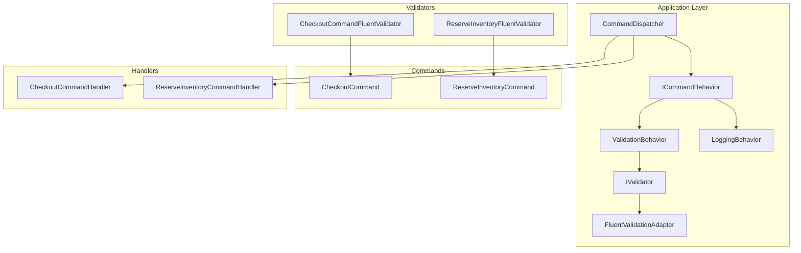
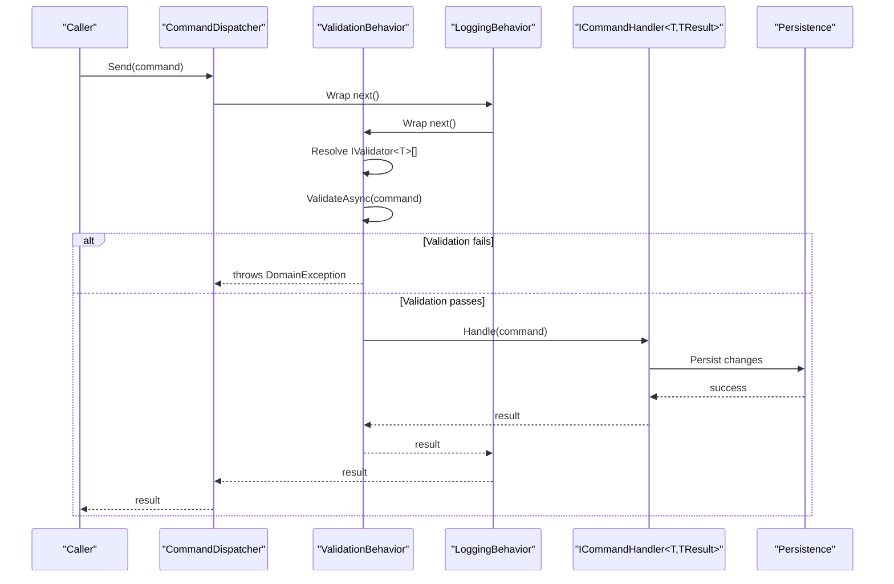
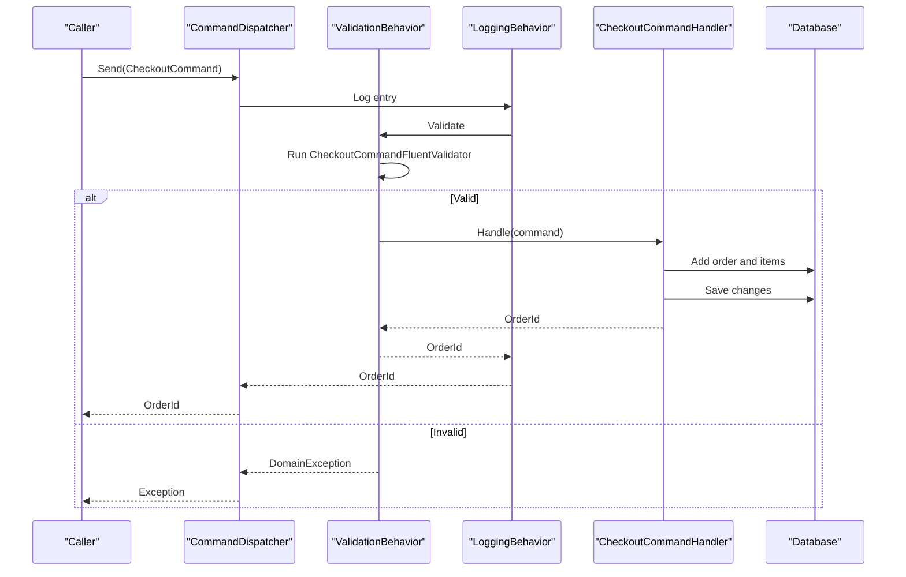
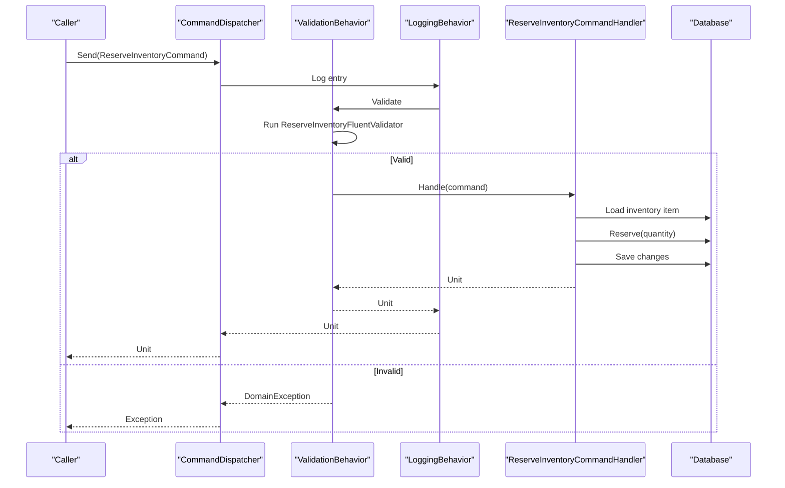
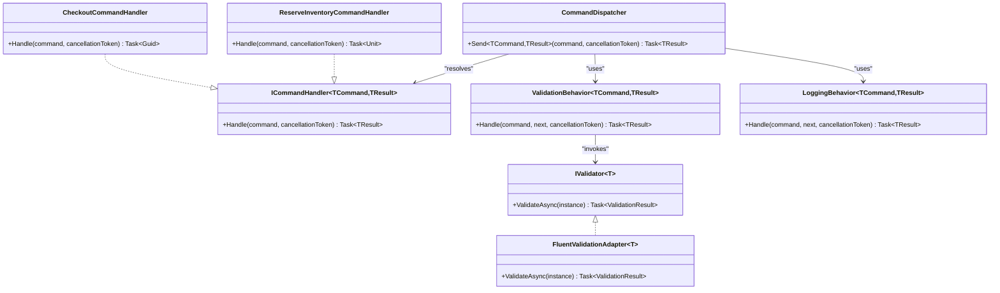

# CQRS Pattern Implementation

<cite>
**Referenced Files in This Document**
- [ICommand.cs](file://src/Ecommerce.Application/Common/Commands/ICommand.cs)
- [ICommandHandler.cs](file://src/Ecommerce.Application/Common/Commands/ICommandHandler.cs)
- [CommandDispatcher.cs](file://src/Ecommerce.Application/Common/Commands/CommandDispatcher.cs)
- [ICommandBehavior.cs](file://src/Ecommerce.Application/Common/Commands/ICommandBehavior.cs)
- [ValidationBehavior.cs](file://src/Ecommerce.Application/Common/Commands/ValidationBehavior.cs)
- [LoggingBehavior.cs](file://src/Ecommerce.Application/Common/Commands/LoggingBehavior.cs)
- [FluentValidationAdapter.cs](file://src/Ecommerce.Application/Common\Validation/FluentValidationAdapter.cs)
- [IValidator.cs](file://src/Ecommerce.Application/Common\Validation/IValidator.cs)
- [CheckoutCommand.cs](file://src/Ecommerce.Application/Commands/Checkout/CheckoutCommand.cs)
- [CheckoutCommandHandler.cs](file://src/Ecommerce.Application/Commands/Checkout/CheckoutCommandHandler.cs)
- [ReserveInventoryCommand.cs](file://src/Ecommerce.Application/Commands/ReserveInventory/ReserveInventoryCommand.cs)
- [ReserveInventoryCommandHandler.cs](file://src/Ecommerce.Application/Commands/ReserveInventory/ReserveInventoryCommandHandler.cs)
- [CheckoutCommandFluentValidator.cs](file://src/Ecommerce.Application/Validators/CheckoutCommandFluentValidator.cs)
- [ReserveInventoryFluentValidator.cs](file://src/Ecommerce.Application/Validators/ReserveInventoryFluentValidator.cs)
</cite>

## Table of Contents
1. [Introduction](#introduction)
2. [Project Structure](#project-structure)
3. [Core Components](#core-components)
4. [Architecture Overview](#architecture-overview)
5. [Detailed Component Analysis](#detailed-component-analysis)
6. [Dependency Analysis](#dependency-analysis)
7. [Performance Considerations](#performance-considerations)
8. [Troubleshooting Guide](#troubleshooting-guide)
9. [Conclusion](#conclusion)

## Introduction
This document explains the Command Query Responsibility Segregation (CQRS) implementation for write operations in the e-commerce system. Commands represent intent to change state and are processed by dedicated handlers. A command pipeline provides cross-cutting concerns such as validation and logging, while a dispatcher resolves handlers and executes behaviors. The design separates concerns, improves testability, and enables scalable write paths independent from read models.

## Project Structure
The CQRS implementation lives primarily in the Application layer:
- Commands define the shape of write requests.
- Handlers implement ICommandHandler and encapsulate business logic for each command.
- Behaviors wrap command execution with cross-cutting concerns.
- A dispatcher wires behaviors and handlers together using dependency injection.
- FluentValidation validators are adapted to the project’s validator abstraction and executed by the validation behavior.

**Diagram sources**
- [CommandDispatcher.cs:9-44](file://src/Ecommerce.Application/Common/Commands/CommandDispatcher.cs#L9-L44)
- [ICommandBehavior.cs:7-10](file://src/Ecommerce.Application/Common/Commands/ICommandBehavior.cs#L7-L10)
- [ValidationBehavior.cs:8-38](file://src/Ecommerce.Application/Common/Commands/ValidationBehavior.cs#L8-L38)
- [LoggingBehavior.cs:8-31](file://src/Ecommerce.Application/Common/Commands/LoggingBehavior.cs#L8-L31)
- [IValidator.cs:5-14](file://src/Ecommerce.Application/Common\Validation/IValidator.cs#L5-L14)
- [FluentValidationAdapter.cs:6-25](file://src/Ecommerce.Application/Common\Validation/FluentValidationAdapter.cs#L6-L25)
- [CheckoutCommand.cs:6-20](file://src/Ecommerce.Application/Commands/Checkout/CheckoutCommand.cs#L6-L20)
- [ReserveInventoryCommand.cs:5-9](file://src/Ecommerce.Application/Commands/ReserveInventory/ReserveInventoryCommand.cs#L5-L9)
- [CheckoutCommandHandler.cs:11-91](file://src/Ecommerce.Application/Commands/Checkout/CheckoutCommandHandler.cs#L11-L91)
- [ReserveInventoryCommandHandler.cs:9-28](file://src/Ecommerce.Application/Commands/ReserveInventory/ReserveInventoryCommandHandler.cs#L9-L28)
- [CheckoutCommandFluentValidator.cs:5-16](file://src/Ecommerce.Application/Validators/CheckoutCommandFluentValidator.cs#L5-L16)
- [ReserveInventoryFluentValidator.cs:5-11](file://src/Ecommerce.Application/Validators/ReserveInventoryFluentValidator.cs#L5-L11)

**Section sources**
- [CommandDispatcher.cs:9-44](file://src/Ecommerce.Application/Common/Commands/CommandDispatcher.cs#L9-L44)
- [ICommandBehavior.cs:7-10](file://src/Ecommerce.Application/Common/Commands/ICommandBehavior.cs#L7-L10)
- [ValidationBehavior.cs:8-38](file://src/Ecommerce.Application/Common/Commands/ValidationBehavior.cs#L8-L38)
- [LoggingBehavior.cs:8-31](file://src/Ecommerce.Application/Common/Commands/LoggingBehavior.cs#L8-L31)
- [IValidator.cs:5-14](file://src/Ecommerce.Application/Common\Validation/IValidator.cs#L5-L14)
- [FluentValidationAdapter.cs:6-25](file://src/Ecommerce.Application/Common\Validation/FluentValidationAdapter.cs#L6-L25)
- [CheckoutCommand.cs:6-20](file://src/Ecommerce.Application/Commands/Checkout/CheckoutCommand.cs#L6-L20)
- [ReserveInventoryCommand.cs:5-9](file://src/Ecommerce.Application/Commands/ReserveInventory/ReserveInventoryCommand.cs#L5-L9)
- [CheckoutCommandHandler.cs:11-91](file://src/Ecommerce.Application/Commands/Checkout/CheckoutCommandHandler.cs#L11-L91)
- [ReserveInventoryCommandHandler.cs:9-28](file://src/Ecommerce.Application/Commands/ReserveInventory/ReserveInventoryCommandHandler.cs#L9-L28)
- [CheckoutCommandFluentValidator.cs:5-16](file://src/Ecommerce.Application/Validators/CheckoutCommandFluentValidator.cs#L5-L16)
- [ReserveInventoryFluentValidator.cs:5-11](file://src/Ecommerce.Application/Validators/ReserveInventoryFluentValidator.cs#L5-L11)

## Core Components
- Command contracts: ICommand<TResult> defines the generic contract for commands that return results.
- Handler contract: ICommandHandler<TCommand, TResult> declares Handle(command, cancellationToken).
- Dispatcher: CommandDispatcher resolves handler and behaviors via IServiceProvider, builds an async pipeline, and invokes it.
- Behaviors:
  - ValidationBehavior<TCommand, TResult> runs all registered IValidator<TCommand> implementations and aggregates errors into a domain exception.
  - LoggingBehavior<TCommand, TResult> logs entry, success, and errors around command handling.
- Validator abstraction: IValidator<T> and ValidationResult provide a uniform interface; FluentValidationAdapter bridges FluentValidation to this abstraction.

Key responsibilities:
- Commands carry input data for write operations.
- Handlers implement domain-specific write logic and persist changes.
- Behaviors enforce non-functional requirements without polluting handlers.
- Dispatcher centralizes resolution and orchestration.

**Section sources**
- [ICommand.cs:3-5](file://src/Ecommerce.Application/Common/Commands/ICommand.cs#L3-L5)
- [ICommandHandler.cs:6-9](file://src/Ecommerce.Application/Common/Commands/ICommandHandler.cs#L6-L9)
- [CommandDispatcher.cs:20-43](file://src/Ecommerce.Application/Common/Commands/CommandDispatcher.cs#L20-L43)
- [ICommandBehavior.cs:7-10](file://src/Ecommerce.Application/Common/Commands/ICommandBehavior.cs#L7-L10)
- [ValidationBehavior.cs:17-38](file://src/Ecommerce.Application/Common/Commands/ValidationBehavior.cs#L17-L38)
- [LoggingBehavior.cs:17-31](file://src/Ecommerce.Application/Common/Commands/LoggingBehavior.cs#L17-L31)
- [IValidator.cs:5-14](file://src/Ecommerce.Application/Common\Validation/IValidator.cs#L5-L14)
- [FluentValidationAdapter.cs:15-25](file://src/Ecommerce.Application/Common\Validation/FluentValidationAdapter.cs#L15-L25)

## Architecture Overview
The CQRS write path is driven by the dispatcher, which composes behaviors around the handler. Validators run before the handler, ensuring invalid commands fail fast. Logging wraps the entire flow for observability.

**Diagram sources**
- [CommandDispatcher.cs:20-43](file://src/Ecommerce.Application/Common/Commands/CommandDispatcher.cs#L20-L43)
- [ValidationBehavior.cs:17-38](file://src/Ecommerce.Application/Common/Commands/ValidationBehavior.cs#L17-L38)
- [LoggingBehavior.cs:17-31](file://src/Ecommerce.Application/Common/Commands/LoggingBehavior.cs#L17-L31)

## Detailed Component Analysis

### Command: CheckoutCommand
- Purpose: Represents a checkout request including user identity, items, currency, shipping address, and optional idempotency key.
- Data model: Contains a list of items with product identifiers and quantities.

Usage example (conceptual):
- Create a CheckoutCommand with UserId, Items, Currency, ShippingAddress, and IdempotencyKey.
- Dispatch via CommandDispatcher.Send<CheckoutCommand, Guid>(command).
- The pipeline validates inputs, then the handler processes the order and returns the new Order identifier.

**Section sources**
- [CheckoutCommand.cs:6-20](file://src/Ecommerce.Application/Commands/Checkout/CheckoutCommand.cs#L6-L20)

### Command: ReserveInventoryCommand
- Purpose: Reserves a specific quantity of inventory for a given item.
- Data model: InventoryItemId and Quantity.

Usage example (conceptual):
- Create a ReserveInventoryCommand with a valid InventoryItemId and positive Quantity.
- Dispatch via CommandDispatcher.Send<ReserveInventoryCommand, Unit>(command).
- The pipeline validates inputs, then the handler reserves stock and persists changes.

**Section sources**
- [ReserveInventoryCommand.cs:5-9](file://src/Ecommerce.Application/Commands/ReserveInventory/ReserveInventoryCommand.cs#L5-L9)

### Handler: CheckoutCommandHandler
- Implements ICommandHandler<CheckoutCommand, Guid>.
- Responsibilities:
  - Idempotency: If an IdempotencyKey is provided, checks for existing responses or registers the attempt to prevent duplicate processing.
  - Business rules: Ensures there are items to checkout.
  - Domain actions: Builds an order, adds items, reserves inventory per item, and places the order.
  - Persistence: Saves the order to the database and records the response for idempotency.
  - Returns: The newly created Order identifier.

Error handling:
- Throws domain exceptions when no items are present, inventory not found, or idempotency registration fails.

**Section sources**
- [CheckoutCommandHandler.cs:11-91](file://src/Ecommerce.Application/Commands/Checkout/CheckoutCommandHandler.cs#L11-L91)

### Handler: ReserveInventoryCommandHandler
- Implements ICommandHandler<ReserveInventoryCommand, Unit>.
- Responsibilities:
  - Validates quantity is positive.
  - Loads the inventory item and calls its Reserve method.
  - Persists changes and returns Unit.

Error handling:
- Throws domain exceptions for invalid quantity or missing inventory item.

**Section sources**
- [ReserveInventoryCommandHandler.cs:9-28](file://src/Ecommerce.Application/Commands/ReserveInventory/ReserveInventoryCommandHandler.cs#L9-L28)

### Validation Pipeline with FluentValidation
- ValidationBehavior<TCommand, TResult> resolves all IValidator<TCommand> instances and executes them before the handler.
- FluentValidationAdapter<T> adapts FluentValidation.IValidator<T> to IValidator<T>, mapping validation results to ValidationResult with error messages.
- Per-command validators:
  - CheckoutCommandFluentValidator enforces required fields and item quantity constraints.
  - ReserveInventoryFluentValidator enforces required inventory item and positive quantity.

Flow:
- On validation failure, ValidationBehavior aggregates errors and throws a domain exception, short-circuiting handler execution.

**Section sources**
- [ValidationBehavior.cs:17-38](file://src/Ecommerce.Application/Common/Commands/ValidationBehavior.cs#L17-L38)
- [FluentValidationAdapter.cs:15-25](file://src/Ecommerce.Application/Common\Validation/FluentValidationAdapter.cs#L15-L25)
- [CheckoutCommandFluentValidator.cs:5-16](file://src/Ecommerce.Application/Validators/CheckoutCommandFluentValidator.cs#L5-L16)
- [ReserveInventoryFluentValidator.cs:5-11](file://src/Ecommerce.Application/Validators/ReserveInventoryFluentValidator.cs#L5-L11)

### Command Execution Flow (Sequence Diagrams)

#### Checkout Command Flow

**Diagram sources**
- [CommandDispatcher.cs:20-43](file://src/Ecommerce.Application/Common/Commands/CommandDispatcher.cs#L20-L43)
- [ValidationBehavior.cs:17-38](file://src/Ecommerce.Application/Common/Commands/ValidationBehavior.cs#L17-L38)
- [LoggingBehavior.cs:17-31](file://src/Ecommerce.Application/Common/Commands/LoggingBehavior.cs#L17-L31)
- [CheckoutCommandHandler.cs:22-91](file://src/Ecommerce.Application/Commands/Checkout/CheckoutCommandHandler.cs#L22-L91)
- [CheckoutCommandFluentValidator.cs:5-16](file://src/Ecommerce.Application/Validators/CheckoutCommandFluentValidator.cs#L5-L16)

#### Reserve Inventory Command Flow

**Diagram sources**
- [CommandDispatcher.cs:20-43](file://src/Ecommerce.Application/Common/Commands/CommandDispatcher.cs#L20-L43)
- [ValidationBehavior.cs:17-38](file://src/Ecommerce.Application/Common/Commands/ValidationBehavior.cs#L17-L38)
- [LoggingBehavior.cs:17-31](file://src/Ecommerce.Application/Common/Commands/LoggingBehavior.cs#L17-L31)
- [ReserveInventoryCommandHandler.cs:17-28](file://src/Ecommerce.Application/Commands/ReserveInventory/ReserveInventoryCommandHandler.cs#L17-L28)
- [ReserveInventoryFluentValidator.cs:5-11](file://src/Ecommerce.Application/Validators/ReserveInventoryFluentValidator.cs#L5-L11)

### Class Relationships (Code-Level Diagram)

**Diagram sources**
- [ICommandHandler.cs:6-9](file://src/Ecommerce.Application/Common/Commands/ICommandHandler.cs#L6-L9)
- [CommandDispatcher.cs:20-43](file://src/Ecommerce.Application/Common/Commands/CommandDispatcher.cs#L20-L43)
- [ValidationBehavior.cs:8-38](file://src/Ecommerce.Application/Common/Commands/ValidationBehavior.cs#L8-L38)
- [LoggingBehavior.cs:8-31](file://src/Ecommerce.Application/Common/Commands/LoggingBehavior.cs#L8-L31)
- [IValidator.cs:5-14](file://src/Ecommerce.Application/Common\Validation/IValidator.cs#L5-L14)
- [FluentValidationAdapter.cs:6-25](file://src/Ecommerce.Application/Common\Validation/FluentValidationAdapter.cs#L6-L25)
- [CheckoutCommandHandler.cs:11-91](file://src/Ecommerce.Application/Commands/Checkout/CheckoutCommandHandler.cs#L11-L91)
- [ReserveInventoryCommandHandler.cs:9-28](file://src/Ecommerce.Application/Commands/ReserveInventory/ReserveInventoryCommandHandler.cs#L9-L28)

## Dependency Analysis
- CommandDispatcher depends on:
  - IServiceProvider to resolve ICommandHandler<TCommand, TResult> and IEnumerable<ICommandBehavior<TCommand, TResult>>.
  - ILogger for tracing dispatch lifecycle.
- ValidationBehavior depends on:
  - IServiceProvider to resolve all IValidator<TCommand> implementations.
- Handlers depend on:
  - IApplicationDbContext for persistence.
  - IIdempotencyService (in CheckoutCommandHandler) for idempotency support.
- Validators depend on:
  - FluentValidation.IValidator<T> via FluentValidationAdapter.

Potential coupling points:
- Strong reliance on DI container for behavior and validator resolution.
- Handlers directly access persistence through IApplicationDbContext; ensure consistent configuration across environments.

Circular dependencies:
- None observed between commands, handlers, and behaviors.

External integrations:
- FluentValidation library for declarative validation rules.
- Database persistence via IApplicationDbContext.

**Section sources**
- [CommandDispatcher.cs:20-43](file://src/Ecommerce.Application/Common/Commands/CommandDispatcher.cs#L20-L43)
- [ValidationBehavior.cs:17-38](file://src/Ecommerce.Application/Common/Commands/ValidationBehavior.cs#L17-L38)
- [CheckoutCommandHandler.cs:11-91](file://src/Ecommerce.Application/Commands/Checkout/CheckoutCommandHandler.cs#L11-L91)
- [ReserveInventoryCommandHandler.cs:9-28](file://src/Ecommerce.Application/Commands/ReserveInventory/ReserveInventoryCommandHandler.cs#L9-L28)
- [FluentValidationAdapter.cs:6-25](file://src/Ecommerce.Application/Common\Validation/FluentValidationAdapter.cs#L6-L25)

## Performance Considerations
- Validation occurs before handler execution, reducing unnecessary work on invalid commands.
- Logging is lightweight but should be tuned for high-throughput scenarios (e.g., sampling or structured logging).
- Idempotency in CheckoutCommandHandler prevents duplicate processing at the application level; ensure underlying storage supports efficient lookups and writes for idempotency keys.
- Avoid excessive synchronous calls inside handlers; use asynchronous patterns consistently.

[No sources needed since this section provides general guidance]

## Troubleshooting Guide
Common issues and resolutions:
- No handler registered:
  - Symptom: InvalidOperationException indicating no handler found.
  - Cause: Missing registration of ICommandHandler<TCommand, TResult> in DI.
  - Resolution: Ensure the handler is registered with the service provider.

- Validation failures:
  - Symptom: DomainException containing aggregated validation errors.
  - Cause: One or more FluentValidation rules failed.
  - Resolution: Inspect validator rules and correct command payloads.

- Inventory not found:
  - Symptom: DomainException indicating missing inventory item.
  - Cause: Invalid or missing InventoryItemId/ProductVariantId.
  - Resolution: Verify data integrity and ensure inventory exists before checkout.

- Idempotency conflicts:
  - Symptom: DomainException about inability to register idempotency key.
  - Cause: Concurrent requests with the same key or storage contention.
  - Resolution: Retry with backoff or adjust client retry policy; ensure idempotency store is available and performant.

**Section sources**
- [CommandDispatcher.cs:25-26](file://src/Ecommerce.Application/Common/Commands/CommandDispatcher.cs#L25-L26)
- [ValidationBehavior.cs:31-34](file://src/Ecommerce.Application/Common/Commands/ValidationBehavior.cs#L31-L34)
- [CheckoutCommandHandler.cs:45-45](file://src/Ecommerce.Application/Commands/Checkout/CheckoutCommandHandler.cs#L45-L45)
- [CheckoutCommandHandler.cs:71-72](file://src/Ecommerce.Application/Commands/Checkout/CheckoutCommandHandler.cs#L71-L72)
- [CheckoutCommandHandler.cs:37-43](file://src/Ecommerce.Application/Commands/Checkout/CheckoutCommandHandler.cs#L37-L43)

## Conclusion
This CQRS implementation cleanly separates write operations into commands and handlers, with a robust pipeline for validation and logging. Commands like CheckoutCommand and ReserveInventoryCommand encapsulate distinct intents, while their handlers focus solely on business logic. The dispatcher and behaviors promote reusability, testability, and scalability. By isolating concerns and enforcing validation early, the system maintains consistency and resilience under load, enabling better separation of concerns in the e-commerce platform.

[No sources needed since this section summarizes without analyzing specific files]