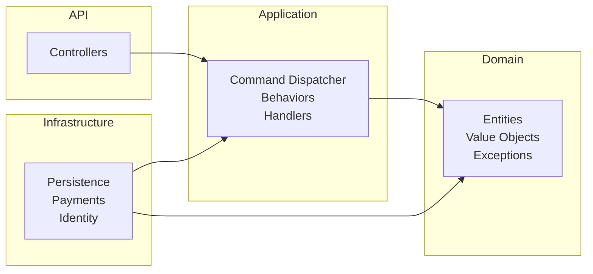
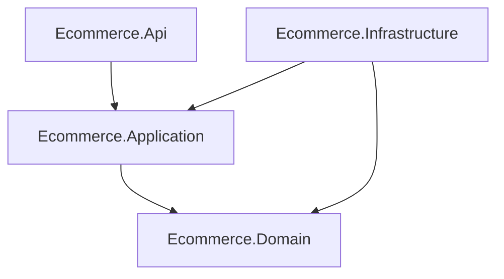
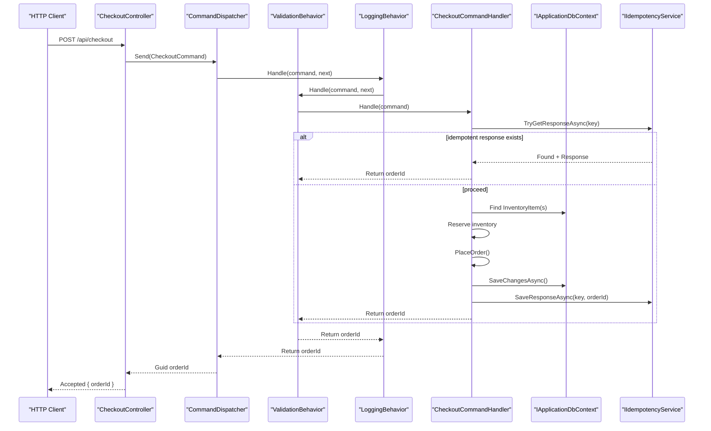
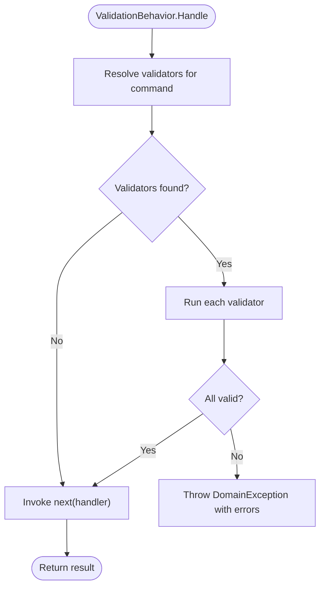
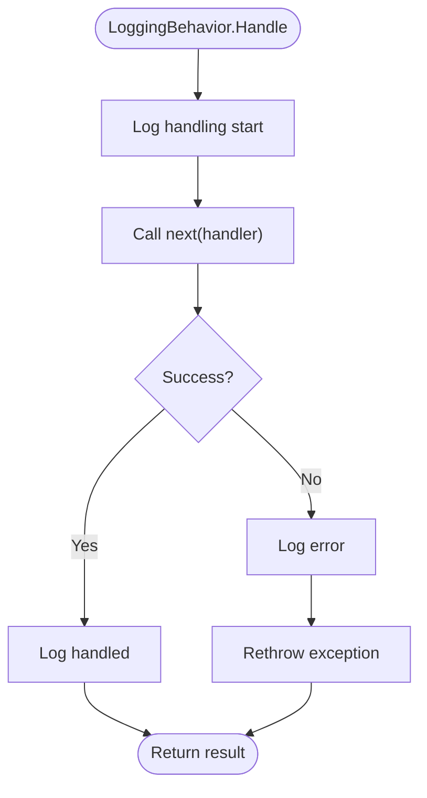
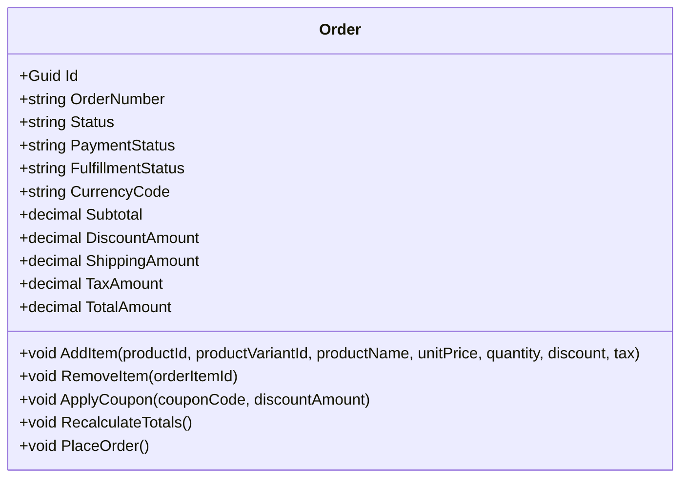
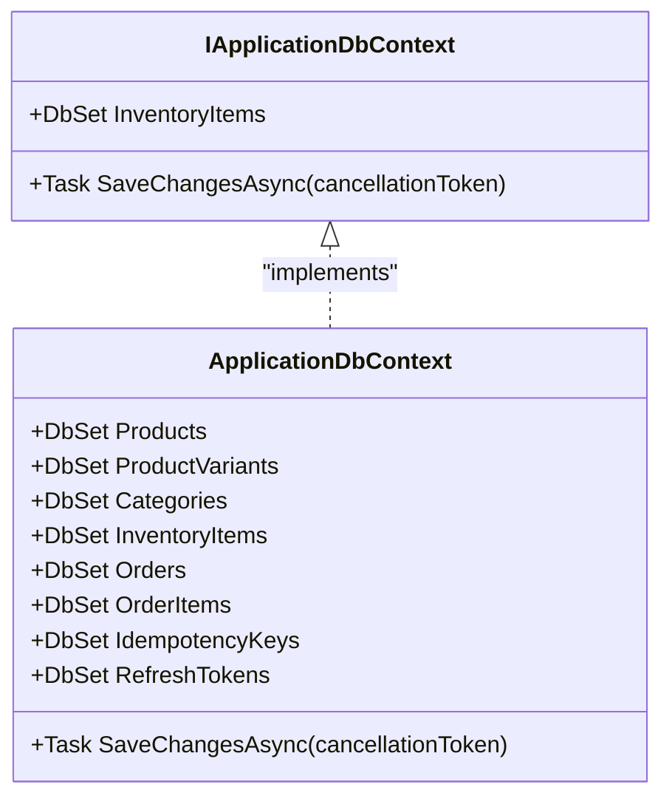

# Clean Architecture Implementation

<cite>
**Referenced Files in This Document**
- [Program.cs](file://src/Ecommerce.Api/Program.cs)
- [CheckoutController.cs](file://src/Ecommerce.Api/Controllers/CheckoutController.cs)
- [CommandDispatcher.cs](file://src/Ecommerce.Application/Common/Commands/CommandDispatcher.cs)
- [ICommand.cs](file://src/Ecommerce.Application/Common/Commands/ICommand.cs)
- [ICommandHandler.cs](file://src/Ecommerce.Application/Common/Commands/ICommandHandler.cs)
- [ICommandBehavior.cs](file://src/Ecommerce.Application/Common/Commands/ICommandBehavior.cs)
- [ValidationBehavior.cs](file://src/Ecommerce.Application/Common/Commands/ValidationBehavior.cs)
- [LoggingBehavior.cs](file://src/Ecommerce.Application/Common/Commands/LoggingBehavior.cs)
- [CheckoutCommand.cs](file://src/Ecommerce.Application/Commands/Checkout/CheckoutCommand.cs)
- [CheckoutCommandHandler.cs](file://src/Ecommerce.Application/Commands/Checkout/CheckoutCommandHandler.cs)
- [IApplicationDbContext.cs](file://src/Ecommerce.Application/Interfaces/IApplicationDbContext.cs)
- [Order.cs](file://src/Ecommerce.Domain/Entities/Order.cs)
- [DependencyInjection.cs](file://src/Ecommerce.Infrastructure/DependencyInjection.cs)
- [ApplicationDbContext.cs](file://src/Ecommerce.Infrastructure/Persistence/ApplicationDbContext.cs)
- [dependency_diagram.md](file://docs/architecture/dependency_diagram.md)
</cite>

## Table of Contents
1. Introduction
2. Project Structure
3. Core Components
4. Architecture Overview
5. Detailed Component Analysis
6. Dependency Analysis
7. Performance Considerations
8. Troubleshooting Guide
9. Conclusion
10. Appendices

## Introduction
This document explains the Clean Architecture implementation for the e-commerce backend, focusing on the four-layer separation: API, Application, Domain, and Infrastructure. It details how each layer maintains its responsibilities, how dependency inversion is applied via interfaces, and how the command dispatcher pattern routes commands to handlers with cross-cutting behaviors such as validation and logging. It also provides diagrams showing layer dependencies and data flow patterns, and guidance for adding new features while adhering to Clean Architecture principles.

## Project Structure
The solution follows a layered architecture:
- API (Ecommerce.Api): HTTP controllers that accept requests and dispatch commands.
- Application (Ecommerce.Application): Use cases implemented as commands and handlers, orchestrating domain logic and infrastructure via interfaces.
- Domain (Ecommerce.Domain): Business entities, value objects, exceptions, and domain rules.
- Infrastructure (Ecommerce.Infrastructure): Concrete implementations of application interfaces (e.g., persistence, payments, identity).

**Diagram sources**
- [Program.cs:1-77](file://src/Ecommerce.Api/Program.cs#L1-L77)
- [DependencyInjection.cs:1-89](file://src/Ecommerce.Infrastructure/DependencyInjection.cs#L1-L89)
- [dependency_diagram.md:1-33](file://docs/architecture/dependency_diagram.md#L1-L33)

**Section sources**
- [Program.cs:1-77](file://src/Ecommerce.Api/Program.cs#L1-L77)
- [DependencyInjection.cs:1-89](file://src/Ecommerce.Infrastructure/DependencyInjection.cs#L1-L89)
- [dependency_diagram.md:1-33](file://docs/architecture/dependency_diagram.md#L1-L33)

## Core Components
- Command Dispatcher: Resolves handlers and pipeline behaviors for a given command type and executes them in order.
- Behaviors: Cross-cutting concerns like validation and logging are implemented as behaviors that wrap handler execution.
- Handlers: Encapsulate use case logic, coordinate domain operations, and persist changes through application interfaces.
- Interfaces: The Application layer defines interfaces (e.g., IApplicationDbContext) that Infrastructure implements, enabling dependency inversion.

Key responsibilities:
- API: Accepts HTTP requests, maps to commands, and delegates to the dispatcher.
- Application: Defines commands, handlers, and behaviors; orchestrates domain and infrastructure via interfaces.
- Domain: Contains business rules and state invariants; no knowledge of external systems.
- Infrastructure: Provides concrete implementations for persistence, authentication, payments, etc.

**Section sources**
- [CommandDispatcher.cs:1-47](file://src/Ecommerce.Application/Common/Commands/CommandDispatcher.cs#L1-L47)
- [ValidationBehavior.cs:1-41](file://src/Ecommerce.Application/Common/Commands/ValidationBehavior.cs#L1-L41)
- [LoggingBehavior.cs:1-34](file://src/Ecommerce.Application/Common/Commands/LoggingBehavior.cs#L1-L34)
- [CheckoutCommandHandler.cs:1-94](file://src/Ecommerce.Application/Commands/Checkout/CheckoutCommandHandler.cs#L1-L94)
- [IApplicationDbContext.cs:1-15](file://src/Ecommerce.Application/Interfaces/IApplicationDbContext.cs#L1-L15)

## Architecture Overview
The system enforces strict layer boundaries:
- API depends only on Application abstractions.
- Application depends on Domain and defines interfaces for Infrastructure.
- Infrastructure depends on both Application and Domain to implement those interfaces.

**Diagram sources**
- [dependency_diagram.md:1-33](file://docs/architecture/dependency_diagram.md#L1-L33)

## Detailed Component Analysis

### Command Dispatcher and Pipeline
The dispatcher resolves a handler for a command and builds a pipeline of behaviors around it. Behaviors execute in reverse registration order, allowing cross-cutting concerns to wrap handler execution.

**Diagram sources**
- [CheckoutController.cs:1-27](file://src/Ecommerce.Api/Controllers/CheckoutController.cs#L1-L27)
- [CommandDispatcher.cs:1-47](file://src/Ecommerce.Application/Common/Commands/CommandDispatcher.cs#L1-L47)
- [ValidationBehavior.cs:1-41](file://src/Ecommerce.Application/Common/Commands/ValidationBehavior.cs#L1-L41)
- [LoggingBehavior.cs:1-34](file://src/Ecommerce.Application/Common/Commands/LoggingBehavior.cs#L1-L34)
- [CheckoutCommandHandler.cs:1-94](file://src/Ecommerce.Application/Commands/Checkout/CheckoutCommandHandler.cs#L1-L94)
- [IApplicationDbContext.cs:1-15](file://src/Ecommerce.Application/Interfaces/IApplicationDbContext.cs#L1-L15)

**Section sources**
- [CommandDispatcher.cs:1-47](file://src/Ecommerce.Application/Common/Commands/CommandDispatcher.cs#L1-L47)
- [CheckoutController.cs:1-27](file://src/Ecommerce.Api/Controllers/CheckoutController.cs#L1-L27)
- [CheckoutCommandHandler.cs:1-94](file://src/Ecommerce.Application/Commands/Checkout/CheckoutCommandHandler.cs#L1-L94)

### Validation Flow
Validation is performed by behavior before handler execution. Validators are resolved per command type and errors are aggregated into a domain exception.

**Diagram sources**
- [ValidationBehavior.cs:1-41](file://src/Ecommerce.Application/Common/Commands/ValidationBehavior.cs#L1-L41)

**Section sources**
- [ValidationBehavior.cs:1-41](file://src/Ecommerce.Application/Common/Commands/ValidationBehavior.cs#L1-L41)

### Logging Flow
Logging wraps handler execution to record start, success, and error events. Errors are rethrown after logging.

**Diagram sources**
- [LoggingBehavior.cs:1-34](file://src/Ecommerce.Application/Common/Commands/LoggingBehavior.cs#L1-L34)

**Section sources**
- [LoggingBehavior.cs:1-34](file://src/Ecommerce.Application/Common/Commands/LoggingBehavior.cs#L1-L34)

### Domain Logic: Order Placement
The domain encapsulates business rules for orders, including item addition, totals recalculation, and placing an order.

**Diagram sources**
- [Order.cs:1-105](file://src/Ecommerce.Domain/Entities/Order.cs#L1-L105)

**Section sources**
- [Order.cs:1-105](file://src/Ecommerce.Domain/Entities/Order.cs#L1-L105)

### Persistence Abstraction and Implementation
The Application layer defines IApplicationDbContext to abstract persistence. Infrastructure provides ApplicationDbContext implementing this interface and EF Core configuration.

**Diagram sources**
- [IApplicationDbContext.cs:1-15](file://src/Ecommerce.Application/Interfaces/IApplicationDbContext.cs#L1-L15)
- [ApplicationDbContext.cs:1-43](file://src/Ecommerce.Infrastructure/Persistence/ApplicationDbContext.cs#L1-L43)

**Section sources**
- [IApplicationDbContext.cs:1-15](file://src/Ecommerce.Application/Interfaces/IApplicationDbContext.cs#L1-L15)
- [ApplicationDbContext.cs:1-43](file://src/Ecommerce.Infrastructure/Persistence/ApplicationDbContext.cs#L1-L43)

## Dependency Analysis
Layer dependencies follow Clean Architecture rules:
- API depends on Application.
- Application depends on Domain and defines interfaces for Infrastructure.
- Infrastructure depends on Application and Domain to implement abstractions.

**Diagram sources**
- [dependency_diagram.md:1-33](file://docs/architecture/dependency_diagram.md#L1-L33)

**Section sources**
- [dependency_diagram.md:1-33](file://docs/architecture/dependency_diagram.md#L1-L33)

## Performance Considerations
- Command pipeline overhead: Each behavior adds minimal overhead; keep behaviors lightweight and avoid heavy work inside behaviors.
- Database access: Ensure queries are efficient and use appropriate indexes; consider batching where possible.
- Idempotency checks: Avoid redundant lookups; cache or deduplicate within a request scope if needed.
- Logging: Use structured logging and filter verbose logs in production to reduce I/O.

[No sources needed since this section provides general guidance]

## Troubleshooting Guide
Common issues and resolutions:
- No handler registered for command: Ensure the command handler is registered in DI and matches the command type and return type.
- Validation failures: Check validators registered for the command; ensure FluentValidation adapters are present when using FluentValidation.
- Missing DbContext or connection string: Verify DefaultConnection is configured and EF provider package is referenced.
- Authentication/JWT setup: Confirm JWT settings and Identity packages are installed and configured; otherwise, startup may skip these services gracefully.

**Section sources**
- [CommandDispatcher.cs:1-47](file://src/Ecommerce.Application/Common/Commands/CommandDispatcher.cs#L1-L47)
- [DependencyInjection.cs:1-89](file://src/Ecommerce.Infrastructure/DependencyInjection.cs#L1-L89)
- [Program.cs:1-77](file://src/Ecommerce.Api/Program.cs#L1-L77)

## Conclusion
This implementation cleanly separates concerns across layers, uses dependency inversion to decouple components, and applies the command dispatcher pattern with behaviors for cross-cutting concerns. The result is a maintainable, testable, and extensible system aligned with Clean Architecture principles.

[No sources needed since this section summarizes without analyzing specific files]

## Appendices

### Adding a New Feature Following Clean Architecture
Steps to add a new feature:
1. Define domain concepts in Domain (entities, value objects, exceptions).
2. Create a command in Application (command class) and a handler (implement ICommandHandler<TCommand, TResult>).
3. Implement any required application interfaces in Infrastructure (e.g., repository or service).
4. Register the handler and any validators/behaviors in Infrastructure DI.
5. Expose an API endpoint in API that accepts input, constructs the command, and calls CommandDispatcher.Send.
6. Write tests at appropriate layers (Domain unit tests, Application unit tests, Integration tests).

Example references:
- Command and handler structure: [CheckoutCommand.cs:1-22](file://src/Ecommerce.Application/Commands/Checkout/CheckoutCommand.cs#L1-L22), [CheckoutCommandHandler.cs:1-94](file://src/Ecommerce.Application/Commands/Checkout/CheckoutCommandHandler.cs#L1-L94)
- DI registration: [DependencyInjection.cs:1-89](file://src/Ecommerce.Infrastructure/DependencyInjection.cs#L1-L89)
- API controller usage: [CheckoutController.cs:1-27](file://src/Ecommerce.Api/Controllers/CheckoutController.cs#L1-L27)

**Section sources**
- [CheckoutCommand.cs:1-22](file://src/Ecommerce.Application/Commands/Checkout/CheckoutCommand.cs#L1-L22)
- [CheckoutCommandHandler.cs:1-94](file://src/Ecommerce.Application/Commands/Checkout/CheckoutCommandHandler.cs#L1-L94)
- [DependencyInjection.cs:1-89](file://src/Ecommerce.Infrastructure/DependencyInjection.cs#L1-L89)
- [CheckoutController.cs:1-27](file://src/Ecommerce.Api/Controllers/CheckoutController.cs#L1-L27)