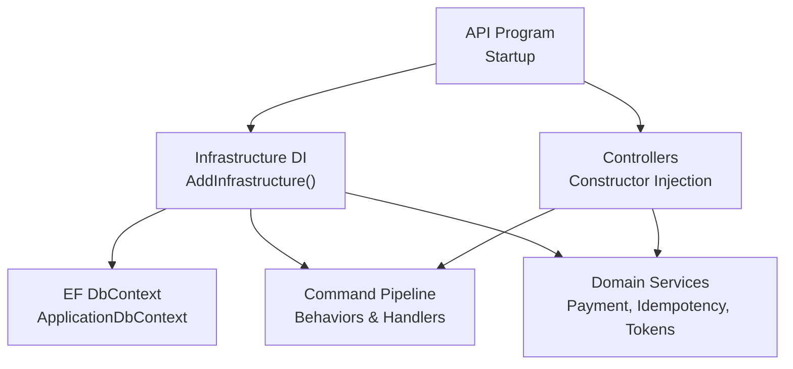
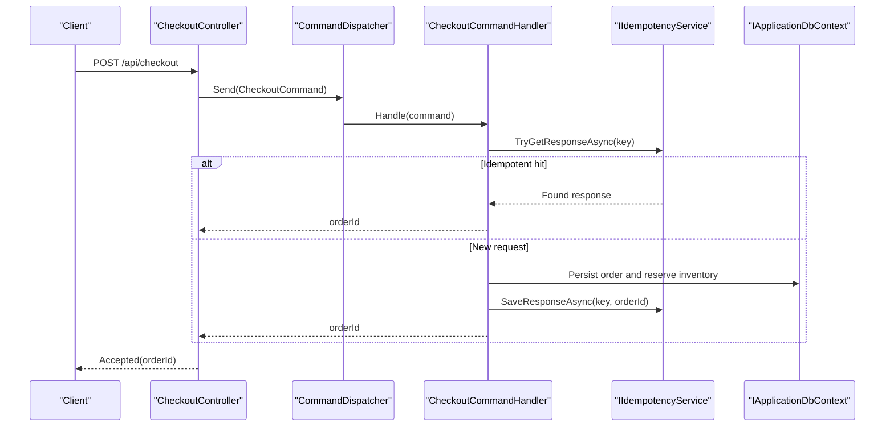
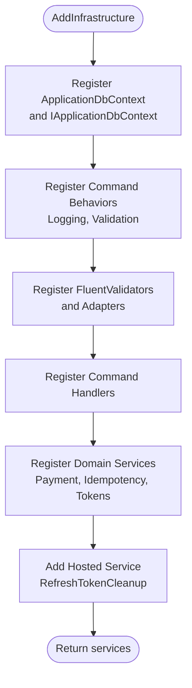
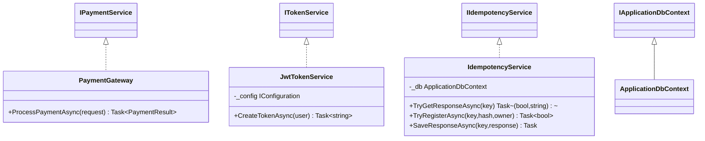
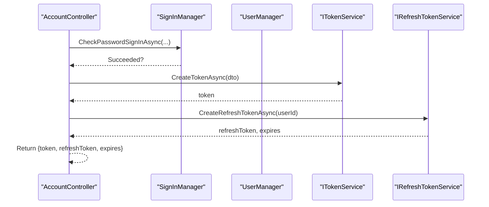
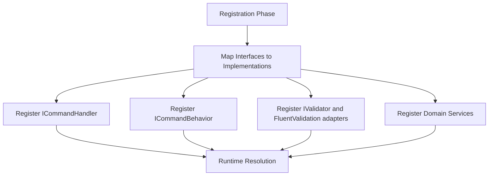
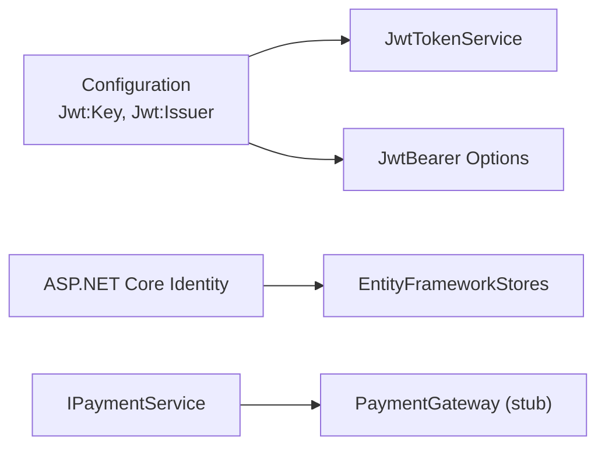
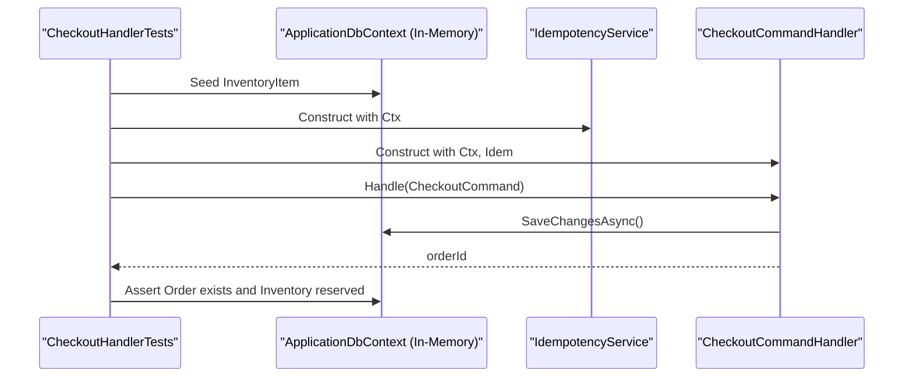
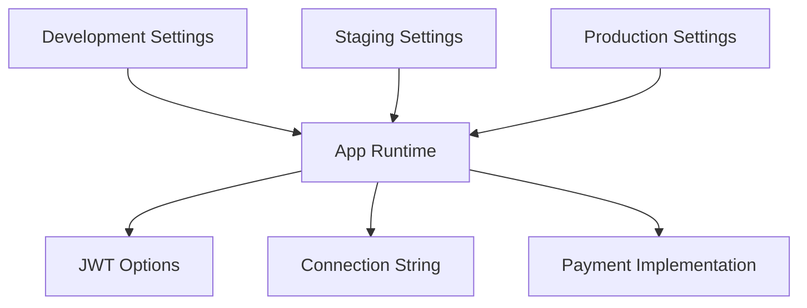
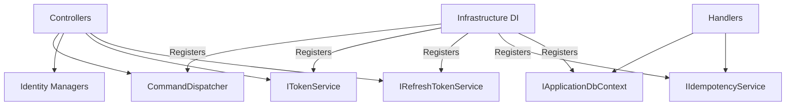

# Dependency Injection and Service Registration

<cite>
**Referenced Files in This Document**
- [Program.cs](file://src/Ecommerce.Api/Program.cs)
- [DependencyInjection.cs](file://src/Ecommerce.Infrastructure/DependencyInjection.cs)
- [CheckoutController.cs](file://src/Ecommerce.Api/Controllers/CheckoutController.cs)
- [AccountController.cs](file://src/Ecommerce.Api/Controllers/AccountController.cs)
- [IPaymentService.cs](file://src/Ecommerce.Application/Interfaces/IPaymentService.cs)
- [IIdentityService.cs](file://src/Ecommerce.Application/Interfaces/IIdentityService.cs)
- [ITokenService.cs](file://src/Ecommerce.Application/Interfaces/ITokenService.cs)
- [PaymentGateway.cs](file://src/Ecommerce.Infrastructure/Payments/PaymentGateway.cs)
- [JwtTokenService.cs](file://src/Ecommerce.Infrastructure/Auth/JwtTokenService.cs)
- [CheckoutCommandHandler.cs](file://src/Ecommerce.Application/Commands/Checkout/CheckoutCommandHandler.cs)
- [IdempotencyService.cs](file://src/Ecommerce.Infrastructure/Services/IdempotencyService.cs)
- [CheckoutHandlerTests.cs](file://tests/Ecommerce.Application.Tests/CheckoutHandlerTests.cs)
- [appsettings.Development.json](file://src/Ecommerce.Api/appsettings.Development.json)
</cite>

## Table of Contents
1. Introduction
2. Project Structure
3. Core Components
4. Architecture Overview
5. Detailed Component Analysis
6. Dependency Analysis
7. Performance Considerations
8. Troubleshooting Guide
9. Conclusion

## Introduction
This document explains how dependency injection (DI) is configured and how services are registered across the application. It focuses on:
- Where and how services are registered in the infrastructure layer
- How lifetimes (Singleton, Scoped, Transient) are applied
- The interface-to-implementation mapping pattern used for service discovery
- Configuration of external dependencies such as payment, identity, and token services
- Constructor injection usage in controllers and handlers
- Testing strategies using mocks and in-memory services
- Environment-specific configurations for development, staging, and production

## Project Structure
The DI configuration is centralized in the infrastructure layer and consumed by the API project at startup. Key responsibilities:
- Infrastructure registers EF DbContext, command pipeline behaviors, validators, AutoMapper profiles, command handlers, and domain services
- API wires up ASP.NET Core features (controllers, authentication, authorization) and invokes the infrastructure registration
- Controllers and handlers consume services via constructor injection

**Diagram sources**
- [Program.cs:11-17](file://src/Ecommerce.Api/Program.cs#L11-L17)
- [DependencyInjection.cs:11-85](file://src/Ecommerce.Infrastructure/DependencyInjection.cs#L11-L85)
- [CheckoutController.cs:12-17](file://src/Ecommerce.Api/Controllers/CheckoutController.cs#L12-L17)

**Section sources**
- [Program.cs:11-17](file://src/Ecommerce.Api/Program.cs#L11-L17)
- [DependencyInjection.cs:11-85](file://src/Ecommerce.Infrastructure/DependencyInjection.cs#L11-L85)

## Core Components
- Centralized registration method AddInfrastructure configures:
  - EF DbContext with a connection string from configuration
  - Application-level abstractions exposed to the application layer
  - Command dispatcher and pipeline behaviors (logging, validation)
  - FluentValidation adapters and validators
  - AutoMapper profiles
  - Command handlers
  - Domain services: payment gateway, idempotency, refresh tokens, JWT token service
  - A hosted background service for token cleanup

- Lifetimes used:
  - Scoped: DbContext, command handlers, most domain services
  - Transient: validators and adapter instances
  - Singleton: not explicitly registered here; default ASP.NET Core singletons apply where needed

- External dependencies:
  - Payment: IPaymentService mapped to a stub implementation for development/testing
  - Identity: ASP.NET Core Identity configured in Program
  - Token: ITokenService implemented by JwtTokenService reading configuration values

**Section sources**
- [DependencyInjection.cs:11-85](file://src/Ecommerce.Infrastructure/DependencyInjection.cs#L11-L85)
- [Program.cs:19-55](file://src/Ecommerce.Api/Program.cs#L19-L55)

## Architecture Overview
The DI architecture follows a layered approach:
- API layer depends on abstractions defined in the application layer
- Infrastructure implements those abstractions and registers them
- Controllers and handlers depend on interfaces, enabling testability and environment-specific behavior

**Diagram sources**
- [CheckoutController.cs:19-24](file://src/Ecommerce.Api/Controllers/CheckoutController.cs#L19-L24)
- [CheckoutCommandHandler.cs:22-90](file://src/Ecommerce.Application/Commands/Checkout/CheckoutCommandHandler.cs#L22-L90)
- [IdempotencyService.cs:19-54](file://src/Ecommerce.Infrastructure/Services/IdempotencyService.cs#L19-L54)

## Detailed Component Analysis

### Service Registration in DependencyInjection
- Registers EF DbContext with SQL Server provider and exposes it as IApplicationDbContext
- Registers command pipeline behaviors (logging, validation) and command handlers
- Registers FluentValidation validators and adapters when available
- Registers AutoMapper profiles when available
- Registers domain services:
  - IPaymentService -> PaymentGateway (Scoped)
  - IIdempotencyService -> IdempotencyService (Scoped)
  - IRefreshTokenService -> RefreshTokenService (Scoped)
  - ITokenService -> JwtTokenService (Scoped)
- Adds a hosted service for refresh token cleanup

**Diagram sources**
- [DependencyInjection.cs:11-85](file://src/Ecommerce.Infrastructure/DependencyInjection.cs#L11-L85)

**Section sources**
- [DependencyInjection.cs:11-85](file://src/Ecommerce.Infrastructure/DependencyInjection.cs#L11-L85)

### Interface-to-Implementation Mapping
- IPaymentService is implemented by PaymentGateway for development and can be swapped for a real provider in production
- ITokenService is implemented by JwtTokenService, which reads signing key and issuer from configuration
- IIdempotencyService is implemented by IdempotencyService backed by EF persistence
- IApplicationDbContext is exposed as a facade over ApplicationDbContext

**Diagram sources**
- [IPaymentService.cs:5-23](file://src/Ecommerce.Application/Interfaces/IPaymentService.cs#L5-L23)
- [PaymentGateway.cs:7-23](file://src/Ecommerce.Infrastructure/Payments/PaymentGateway.cs#L7-L23)
- [ITokenService.cs:6-9](file://src/Ecommerce.Application/Interfaces/ITokenService.cs#L6-L9)
- [JwtTokenService.cs:13-45](file://src/Ecommerce.Infrastructure/Auth/JwtTokenService.cs#L13-L45)
- [IdempotencyService.cs:10-54](file://src/Ecommerce.Infrastructure/Services/IdempotencyService.cs#L10-L54)

**Section sources**
- [IPaymentService.cs:5-23](file://src/Ecommerce.Application/Interfaces/IPaymentService.cs#L5-L23)
- [PaymentGateway.cs:7-23](file://src/Ecommerce.Infrastructure/Payments/PaymentGateway.cs#L7-L23)
- [ITokenService.cs:6-9](file://src/Ecommerce.Application/Interfaces/ITokenService.cs#L6-L9)
- [JwtTokenService.cs:13-45](file://src/Ecommerce.Infrastructure/Auth/JwtTokenService.cs#L13-L45)
- [IdempotencyService.cs:10-54](file://src/Ecommerce.Infrastructure/Services/IdempotencyService.cs#L10-L54)

### Constructor Injection in Controllers and Handlers
- Controllers receive services through constructors:
  - CheckoutController receives CommandDispatcher to send commands
  - AccountController receives UserManager, SignInManager, ITokenService, and IRefreshTokenService
- Handlers receive dependencies via constructor:
  - CheckoutCommandHandler receives IApplicationDbContext and IIdempotencyService

**Diagram sources**
- [AccountController.cs:22-32](file://src/Ecommerce.Api/Controllers/AccountController.cs#L22-L32)
- [AccountController.cs:44-54](file://src/Ecommerce.Api/Controllers/AccountController.cs#L44-L54)
- [AccountController.cs:101-107](file://src/Ecommerce.Api/Controllers/AccountController.cs#L101-L107)
- [JwtTokenService.cs:22-45](file://src/Ecommerce.Infrastructure/Auth/JwtTokenService.cs#L22-L45)

**Section sources**
- [CheckoutController.cs:12-17](file://src/Ecommerce.Api/Controllers/CheckoutController.cs#L12-L17)
- [AccountController.cs:22-32](file://src/Ecommerce.Api/Controllers/AccountController.cs#L22-L32)
- [CheckoutCommandHandler.cs:13-20](file://src/Ecommerce.Application/Commands/Checkout/CheckoutCommandHandler.cs#L13-L20)

### Service Discovery Pattern
- The application uses explicit interface-to-implementation registrations rather than assembly scanning
- Each handler and validator is registered by its interface type to concrete type
- Optional packages (FluentValidation, AutoMapper) are conditionally registered with try/catch blocks to keep the build portable

**Diagram sources**
- [DependencyInjection.cs:27-80](file://src/Ecommerce.Infrastructure/DependencyInjection.cs#L27-L80)

**Section sources**
- [DependencyInjection.cs:27-80](file://src/Ecommerce.Infrastructure/DependencyInjection.cs#L27-L80)

### External Dependencies Configuration
- Payment:
  - IPaymentService is registered to PaymentGateway (a stub) for development
  - Replace with a production implementation by changing the registration
- Identity:
  - ASP.NET Core Identity is configured in Program with Entity Framework stores and default token providers
  - Authentication scheme set to JWT Bearer
- Token:
  - JwtTokenService reads Jwt:Key and Jwt:Issuer from configuration
  - Program also reads these values for JWT bearer options

**Diagram sources**
- [Program.cs:22-48](file://src/Ecommerce.Api/Program.cs#L22-L48)
- [JwtTokenService.cs:22-45](file://src/Ecommerce.Infrastructure/Auth/JwtTokenService.cs#L22-L45)
- [DependencyInjection.cs:70-80](file://src/Ecommerce.Infrastructure/DependencyInjection.cs#L70-L80)

**Section sources**
- [Program.cs:19-55](file://src/Ecommerce.Api/Program.cs#L19-L55)
- [DependencyInjection.cs:70-80](file://src/Ecommerce.Infrastructure/DependencyInjection.cs#L70-L80)
- [JwtTokenService.cs:22-45](file://src/Ecommerce.Infrastructure/Auth/JwtTokenService.cs#L22-L45)

### Testing Strategies with Mock Services
- Unit tests construct handlers directly with injected dependencies
- In-memory database is used for EF-backed operations
- Tests demonstrate isolation of business logic without external services

**Diagram sources**
- [CheckoutHandlerTests.cs:14-54](file://tests/Ecommerce.Application.Tests/CheckoutHandlerTests.cs#L14-L54)
- [CheckoutCommandHandler.cs:22-90](file://src/Ecommerce.Application/Commands/Checkout/CheckoutCommandHandler.cs#L22-L90)
- [IdempotencyService.cs:19-54](file://src/Ecommerce.Infrastructure/Services/IdempotencyService.cs#L19-L54)

**Section sources**
- [CheckoutHandlerTests.cs:14-54](file://tests/Ecommerce.Application.Tests/CheckoutHandlerTests.cs#L14-L54)

### Environment-Specific Service Configuration
- Development settings include logging levels, JWT configuration, and a local SQL Server connection string
- Program reads Jwt:Key and Jwt:Issuer from configuration for both Identity and JWT bearer options
- To support staging and production:
  - Provide separate appsettings files or environment variables for each environment
  - Update Jwt:Key and Issuer per environment
  - Swap IPaymentService implementation to a real provider in production
  - Ensure connection strings point to appropriate databases

**Diagram sources**
- [appsettings.Development.json:1-15](file://src/Ecommerce.Api/appsettings.Development.json#L1-L15)
- [Program.cs:26-48](file://src/Ecommerce.Api/Program.cs#L26-L48)
- [DependencyInjection.cs:15-20](file://src/Ecommerce.Infrastructure/DependencyInjection.cs#L15-L20)

**Section sources**
- [appsettings.Development.json:1-15](file://src/Ecommerce.Api/appsettings.Development.json#L1-L15)
- [Program.cs:26-48](file://src/Ecommerce.Api/Program.cs#L26-L48)
- [DependencyInjection.cs:15-20](file://src/Ecommerce.Infrastructure/DependencyInjection.cs#L15-L20)

## Dependency Analysis
- Controllers depend on:
  - CommandDispatcher (for command handling)
  - ASP.NET Core Identity managers
  - ITokenService and IRefreshTokenService
- Handlers depend on:
  - IApplicationDbContext for persistence
  - IIdempotencyService for idempotency
- Infrastructure depends on:
  - Microsoft.Extensions.Configuration
  - Microsoft.EntityFrameworkCore
  - Optional packages (FluentValidation, AutoMapper)

**Diagram sources**
- [CheckoutController.cs:12-17](file://src/Ecommerce.Api/Controllers/CheckoutController.cs#L12-L17)
- [AccountController.cs:22-32](file://src/Ecommerce.Api/Controllers/AccountController.cs#L22-L32)
- [CheckoutCommandHandler.cs:13-20](file://src/Ecommerce.Application/Commands/Checkout/CheckoutCommandHandler.cs#L13-L20)
- [DependencyInjection.cs:11-85](file://src/Ecommerce.Infrastructure/DependencyInjection.cs#L11-L85)

**Section sources**
- [CheckoutController.cs:12-17](file://src/Ecommerce.Api/Controllers/CheckoutController.cs#L12-L17)
- [AccountController.cs:22-32](file://src/Ecommerce.Api/Controllers/AccountController.cs#L22-L32)
- [CheckoutCommandHandler.cs:13-20](file://src/Ecommerce.Application/Commands/Checkout/CheckoutCommandHandler.cs#L13-L20)
- [DependencyInjection.cs:11-85](file://src/Ecommerce.Infrastructure/DependencyInjection.cs#L11-L85)

## Performance Considerations
- Use Scoped lifetime for DbContext to align with HTTP request scope and avoid cross-request state sharing
- Prefer Transient for lightweight validators to reduce memory footprint per use
- Avoid heavy work in Singleton services; prefer Scoped or Transient for request-scoped resources
- Keep optional package registrations guarded to prevent startup overhead when not used
- Consider caching strategies for expensive lookups behind interfaces to enable swapping implementations

[No sources needed since this section provides general guidance]

## Troubleshooting Guide
- Missing connection string:
  - Ensure DefaultConnection is present in configuration for the current environment
- JWT misconfiguration:
  - Verify Jwt:Key and Jwt:Issuer match between token creation and bearer validation
- Optional packages not installed:
  - FluentValidation and AutoMapper registrations are wrapped in try/catch; missing packages will be skipped gracefully
- Payment integration:
  - Replace the stub PaymentGateway with a production implementation and update configuration accordingly
- Background service issues:
  - Confirm the hosted service is registered and that any required services (e.g., DbContext) are available

**Section sources**
- [DependencyInjection.cs:35-63](file://src/Ecommerce.Infrastructure/DependencyInjection.cs#L35-L63)
- [DependencyInjection.cs:70-85](file://src/Ecommerce.Infrastructure/DependencyInjection.cs#L70-L85)
- [Program.cs:26-48](file://src/Ecommerce.Api/Program.cs#L26-L48)
- [appsettings.Development.json:8-14](file://src/Ecommerce.Api/appsettings.Development.json#L8-L14)

## Conclusion
The application uses a clear, layered DI strategy:
- Centralized registration in Infrastructure simplifies setup and keeps concerns separated
- Explicit interface-to-implementation mappings enable easy testing and environment-specific swaps
- Constructors in controllers and handlers enforce explicit dependencies
- Environment configuration drives runtime behavior for authentication, persistence, and external integrations
Adopting these patterns ensures maintainable, testable, and deployable code across environments.