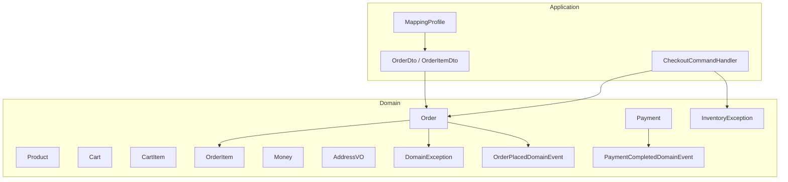
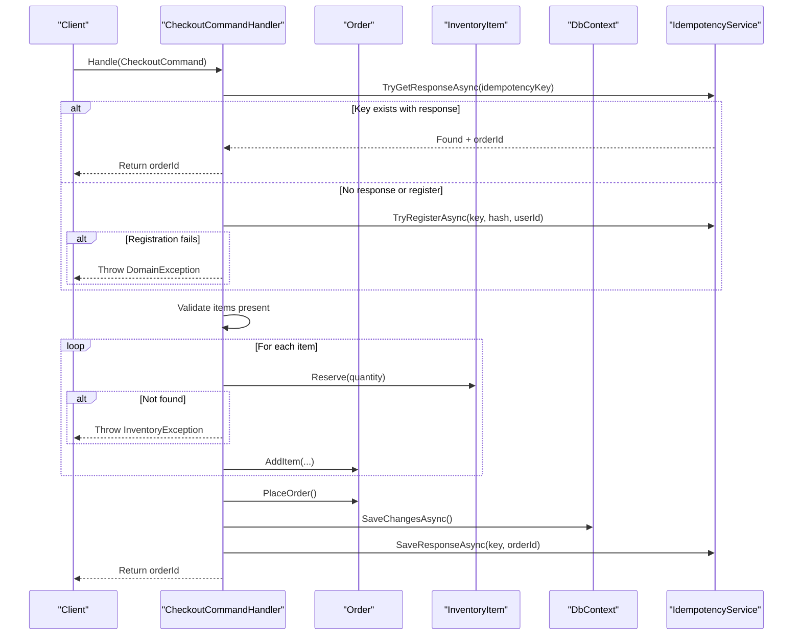
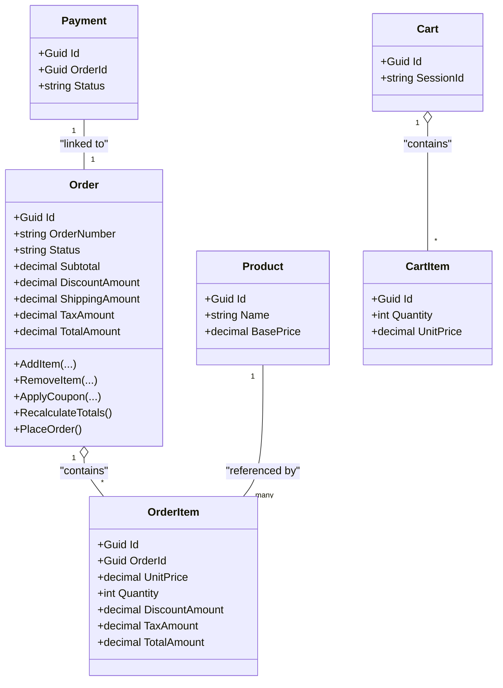
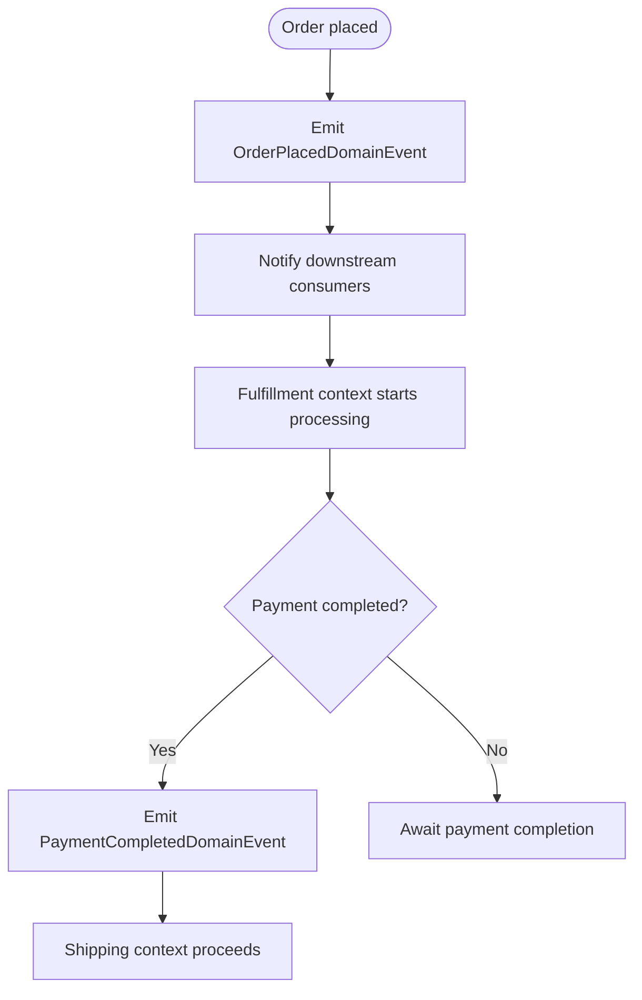
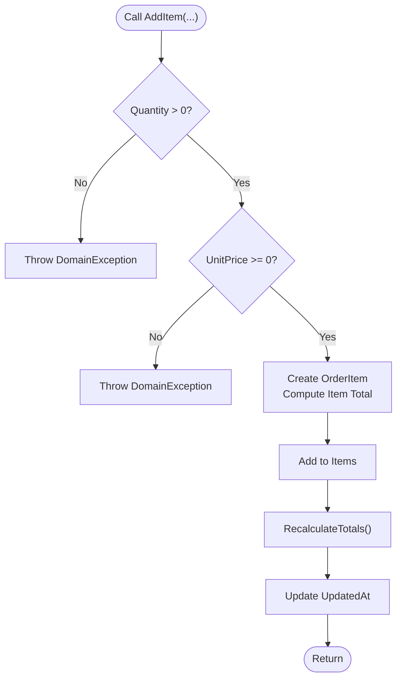
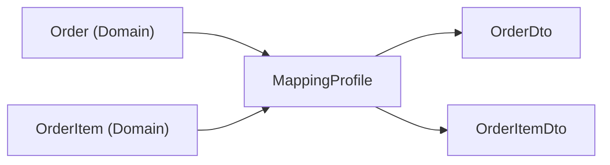
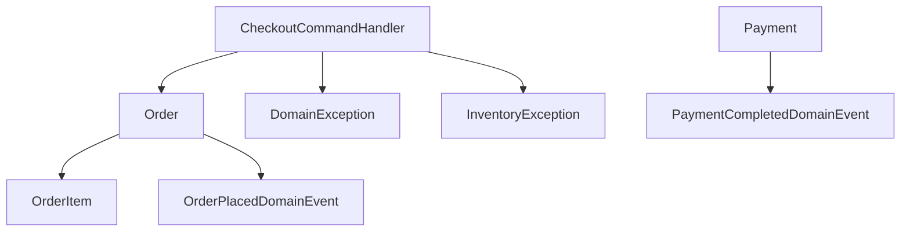

# Domain-Driven Design Principles

<cite>
**Referenced Files in This Document**
- [Order.cs](file://src/Ecommerce.Domain/Entities/Order.cs)
- [Product.cs](file://src/Ecommerce.Domain/Entities/Product.cs)
- [Cart.cs](file://src/Ecommerce.Domain/Entities/Cart.cs)
- [CartItem.cs](file://src/Ecommerce.Domain/Entities/CartItem.cs)
- [OrderItem.cs](file://src/Ecommerce.Domain/Entities/OrderItem.cs)
- [Payment.cs](file://src/Ecommerce.Domain/Entities/Payment.cs)
- [Money.cs](file://src/Ecommerce.Domain/ValueObjects/Money.cs)
- [AddressVO.cs](file://src/Ecommerce.Domain/ValueObjects/AddressVO.cs)
- [DomainException.cs](file://src/Ecommerce.Domain/Exceptions/DomainException.cs)
- [InventoryException.cs](file://src/Ecommerce.Domain/Exceptions/InventoryException.cs)
- [OrderPlacedDomainEvent.cs](file://src/Ecommerce.Domain/DomainEvents/OrderPlacedDomainEvent.cs)
- [PaymentCompletedDomainEvent.cs](file://src/Ecommerce.Domain/DomainEvents/PaymentCompletedDomainEvent.cs)
- [CheckoutCommandHandler.cs](file://src/Ecommerce.Application/Commands/Checkout/CheckoutCommandHandler.cs)
- [OrderDto.cs](file://src/Ecommerce.Application/DTOs/OrderDto.cs)
- [MappingProfile.cs](file://src/Ecommerce.Application/Mappings/MappingProfile.cs)
</cite>

## Table of Contents
1. Introduction
2. Project Structure
3. Core Components
4. Architecture Overview
5. Detailed Component Analysis
6. Dependency Analysis
7. Performance Considerations
8. Troubleshooting Guide
9. Conclusion

## Introduction
This document explains how the e-commerce system applies Domain-Driven Design (DDD) to encapsulate business logic within rich domain models, enforce invariants, and express a clear domain language. It focuses on value objects such as Money and AddressVO, domain entities like Order that enforce rules through behavior, domain events for loose coupling across bounded contexts, and the mapping between domain entities and application-layer DTOs.

## Project Structure
The DDD layers are organized under:
- Domain: Entities, Value Objects, Domain Events, and Exceptions
- Application: Commands, handlers, DTOs, and mappings
- Infrastructure: Persistence and external integrations (not detailed here)

**Diagram sources**
- [Order.cs:1-105](file://src/Ecommerce.Domain/Entities/Order.cs#L1-L105)
- [Product.cs:1-44](file://src/Ecommerce.Domain/Entities/Product.cs#L1-L44)
- [Cart.cs:1-20](file://src/Ecommerce.Domain/Entities/Cart.cs#L1-L20)
- [CartItem.cs:1-17](file://src/Ecommerce.Domain/Entities/CartItem.cs#L1-L17)
- [OrderItem.cs:1-22](file://src/Ecommerce.Domain/Entities/OrderItem.cs#L1-L22)
- [Payment.cs:1-23](file://src/Ecommerce.Domain/Entities/Payment.cs#L1-L23)
- [Money.cs:1-20](file://src/Ecommerce.Domain/ValueObjects/Money.cs#L1-L20)
- [AddressVO.cs:1-27](file://src/Ecommerce.Domain/ValueObjects/AddressVO.cs#L1-L27)
- [DomainException.cs:1-10](file://src/Ecommerce.Domain/Exceptions/DomainException.cs#L1-L10)
- [InventoryException.cs:1-10](file://src/Ecommerce.Domain/Exceptions/InventoryException.cs#L1-L10)
- [OrderPlacedDomainEvent.cs:1-16](file://src/Ecommerce.Domain/DomainEvents/OrderPlacedDomainEvent.cs#L1-L16)
- [PaymentCompletedDomainEvent.cs:1-18](file://src/Ecommerce.Domain/DomainEvents/PaymentCompletedDomainEvent.cs#L1-L18)
- [CheckoutCommandHandler.cs:1-94](file://src/Ecommerce.Application/Commands/Checkout/CheckoutCommandHandler.cs#L1-L94)
- [OrderDto.cs:1-22](file://src/Ecommerce.Application/DTOs/OrderDto.cs#L1-L22)
- [MappingProfile.cs:1-30](file://src/Ecommerce.Application/Mappings/MappingProfile.cs#L1-L30)

**Section sources**
- [Order.cs:1-105](file://src/Ecommerce.Domain/Entities/Order.cs#L1-L105)
- [CheckoutCommandHandler.cs:1-94](file://src/Ecommerce.Application/Commands/Checkout/CheckoutCommandHandler.cs#L1-L94)
- [OrderDto.cs:1-22](file://src/Ecommerce.Application/DTOs/OrderDto.cs#L1-L22)
- [MappingProfile.cs:1-30](file://src/Ecommerce.Application/Mappings/MappingProfile.cs#L1-L30)

## Core Components
- Rich domain entities encapsulate business logic and maintain invariants via methods rather than public setters. For example, Order enforces item validation, totals recalculation, and state transitions through methods like adding items, removing items, applying coupons, recalculating totals, and placing orders.
- Value objects provide expressive, immutable building blocks with built-in validation:
  - Money represents monetary amounts with currency codes and validates non-negative values.
  - AddressVO captures shipping/billing address data with required fields validated at construction.
- Domain events model meaningful business occurrences that enable loose coupling across bounded contexts:
  - OrderPlacedDomainEvent signals when an order is placed.
  - PaymentCompletedDomainEvent signals successful payment completion.
- Domain exceptions represent business rule violations, providing clear failure semantics:
  - DomainException for general rule breaches.
  - InventoryException for inventory-related failures.

**Section sources**
- [Order.cs:36-102](file://src/Ecommerce.Domain/Entities/Order.cs#L36-L102)
- [Money.cs:5-18](file://src/Ecommerce.Domain/ValueObjects/Money.cs#L5-L18)
- [AddressVO.cs:5-24](file://src/Ecommerce.Domain/ValueObjects/AddressVO.cs#L5-L24)
- [OrderPlacedDomainEvent.cs:5-14](file://src/Ecommerce.Domain/DomainEvents/OrderPlacedDomainEvent.cs#L5-L14)
- [PaymentCompletedDomainEvent.cs:5-16](file://src/Ecommerce.Domain/DomainEvents/PaymentCompletedDomainEvent.cs#L5-L16)
- [DomainException.cs:5-8](file://src/Ecommerce.Domain/Exceptions/DomainException.cs#L5-L8)
- [InventoryException.cs:5-8](file://src/Ecommerce.Domain/Exceptions/InventoryException.cs#L5-L8)

## Architecture Overview
The checkout flow demonstrates how the application layer orchestrates domain behavior while preserving domain integrity:

**Diagram sources**
- [CheckoutCommandHandler.cs:22-90](file://src/Ecommerce.Application/Commands/Checkout/CheckoutCommandHandler.cs#L22-L90)
- [Order.cs:36-102](file://src/Ecommerce.Domain/Entities/Order.cs#L36-L102)
- [DomainException.cs:5-8](file://src/Ecommerce.Domain/Exceptions/DomainException.cs#L5-L8)
- [InventoryException.cs:5-8](file://src/Ecommerce.Domain/Exceptions/InventoryException.cs#L5-L8)

## Detailed Component Analysis

### Value Objects: Money and AddressVO
- Money encapsulates amount and currency code, enforcing non-negative amounts and non-null currency at construction. This ensures all monetary calculations start from a valid base.
- AddressVO encapsulates shipping/billing details with required fields validated at creation, preventing invalid addresses from entering the domain.

These value objects promote a strong domain language by making illegal states unrepresentable and by enabling expressive operations (e.g., arithmetic over Money).

**Section sources**
- [Money.cs:5-18](file://src/Ecommerce.Domain/ValueObjects/Money.cs#L5-L18)
- [AddressVO.cs:5-24](file://src/Ecommerce.Domain/ValueObjects/AddressVO.cs#L5-L24)

### Domain Entities: Order and Related Models
- Order encapsulates core checkout and pricing logic:
  - Adding/removing items validates quantities and prices, computes per-item totals, and updates aggregate totals.
  - Applying coupons integrates discounts into totals.
  - Recalculating totals derives Subtotal, TaxAmount, DiscountAmount, and TotalAmount consistently.
  - PlacingOrder enforces non-empty orders and sets lifecycle timestamps and statuses.
- Supporting entities include Product, Cart, CartItem, OrderItem, and Payment, which model product catalog, shopping session, line items, and payment records respectively.

**Diagram sources**
- [Order.cs:1-105](file://src/Ecommerce.Domain/Entities/Order.cs#L1-L105)
- [OrderItem.cs:1-22](file://src/Ecommerce.Domain/Entities/OrderItem.cs#L1-L22)
- [Product.cs:1-44](file://src/Ecommerce.Domain/Entities/Product.cs#L1-L44)
- [Cart.cs:1-20](file://src/Ecommerce.Domain/Entities/Cart.cs#L1-L20)
- [CartItem.cs:1-17](file://src/Ecommerce.Domain/Entities/CartItem.cs#L1-L17)
- [Payment.cs:1-23](file://src/Ecommerce.Domain/Entities/Payment.cs#L1-L23)

**Section sources**
- [Order.cs:36-102](file://src/Ecommerce.Domain/Entities/Order.cs#L36-L102)
- [OrderItem.cs:1-22](file://src/Ecommerce.Domain/Entities/OrderItem.cs#L1-L22)
- [Product.cs:1-44](file://src/Ecommerce.Domain/Entities/Product.cs#L1-L44)
- [Cart.cs:1-20](file://src/Ecommerce.Domain/Entities/Cart.cs#L1-L20)
- [CartItem.cs:1-17](file://src/Ecommerce.Domain/Entities/CartItem.cs#L1-L17)
- [Payment.cs:1-23](file://src/Ecommerce.Domain/Entities/Payment.cs#L1-L23)

### Domain Events: Loose Coupling Across Bounded Contexts
- OrderPlacedDomainEvent carries the order identifier and timestamp, signaling that an order has been successfully placed. Downstream processes (e.g., fulfillment, notifications) can react without tight coupling to the Order entity.
- PaymentCompletedDomainEvent carries payment and order identifiers plus timestamp, indicating successful payment completion. This enables subsequent steps like releasing reservations or starting shipment workflows.

**Diagram sources**
- [OrderPlacedDomainEvent.cs:5-14](file://src/Ecommerce.Domain/DomainEvents/OrderPlacedDomainEvent.cs#L5-L14)
- [PaymentCompletedDomainEvent.cs:5-16](file://src/Ecommerce.Domain/DomainEvents/PaymentCompletedDomainEvent.cs#L5-L16)

**Section sources**
- [OrderPlacedDomainEvent.cs:5-14](file://src/Ecommerce.Domain/DomainEvents/OrderPlacedDomainEvent.cs#L5-L14)
- [PaymentCompletedDomainEvent.cs:5-16](file://src/Ecommerce.Domain/DomainEvents/PaymentCompletedDomainEvent.cs#L5-L16)

### Domain Exceptions: Business Rule Violations
- DomainException provides a base type for domain-level errors, used when invariants are violated (e.g., empty order placement, invalid inputs).
- InventoryException specializes domain error handling for inventory issues (e.g., missing inventory for a product/variant), allowing precise error propagation and handling.

These exceptions ensure that invalid domain states are surfaced early and explicitly, keeping the application layer free of ad-hoc error checks.

**Section sources**
- [DomainException.cs:5-8](file://src/Ecommerce.Domain/Exceptions/DomainException.cs#L5-L8)
- [InventoryException.cs:5-8](file://src/Ecommerce.Domain/Exceptions/InventoryException.cs#L5-L8)
- [Order.cs:89-102](file://src/Ecommerce.Domain/Entities/Order.cs#L89-L102)
- [CheckoutCommandHandler.cs:45-75](file://src/Ecommerce.Application/Commands/Checkout/CheckoutCommandHandler.cs#L45-L75)

### Enforcing Rules Through Behavior Rather Than Setters
- Order exposes behavior-driven methods:
  - AddItem validates quantity and unit price, creates an OrderItem, and recalculates totals.
  - RemoveItem locates and removes an item, then recalculates totals.
  - ApplyCoupon integrates discount logic and recalculates totals.
  - RecalculateTotals derives consistent financial figures from items and coupon/discount/tax inputs.
  - PlaceOrder enforces non-empty orders and sets lifecycle state and timestamps.
- These methods centralize business rules inside the domain, ensuring consistency regardless of who modifies the aggregate.

**Diagram sources**
- [Order.cs:36-59](file://src/Ecommerce.Domain/Entities/Order.cs#L36-L59)
- [Order.cs:79-87](file://src/Ecommerce.Domain/Entities/Order.cs#L79-L87)

**Section sources**
- [Order.cs:36-102](file://src/Ecommerce.Domain/Entities/Order.cs#L36-L102)

### Relationship Between Domain Entities and DTOs
- The application layer defines DTOs for API boundaries and responses, such as OrderDto and OrderItemDto.
- MappingProfile configures AutoMapper mappings from domain entities (Order, OrderItem) to DTOs, isolating presentation concerns from domain logic.
- This separation ensures that changes in domain models do not directly impact API contracts and vice versa.

**Diagram sources**
- [MappingProfile.cs:11-20](file://src/Ecommerce.Application/Mappings/MappingProfile.cs#L11-L20)
- [OrderDto.cs:6-20](file://src/Ecommerce.Application/DTOs/OrderDto.cs#L6-L20)

**Section sources**
- [OrderDto.cs:6-20](file://src/Ecommerce.Application/DTOs/OrderDto.cs#L6-L20)
- [MappingProfile.cs:11-20](file://src/Ecommerce.Application/Mappings/MappingProfile.cs#L11-L20)

## Dependency Analysis
- CheckoutCommandHandler depends on:
  - Domain entities (Order) to enforce business rules.
  - Domain exceptions (DomainException, InventoryException) to signal rule violations.
  - Infrastructure abstractions (DbContext, IdempotencyService) for persistence and idempotency.
- Order depends on:
  - OrderItem for line-item modeling.
  - DomainException for invariant enforcement.
- Domain events are independent data structures consumed by other bounded contexts, decoupling producers from consumers.

**Diagram sources**
- [CheckoutCommandHandler.cs:1-94](file://src/Ecommerce.Application/Commands/Checkout/CheckoutCommandHandler.cs#L1-L94)
- [Order.cs:1-105](file://src/Ecommerce.Domain/Entities/Order.cs#L1-L105)
- [OrderItem.cs:1-22](file://src/Ecommerce.Domain/Entities/OrderItem.cs#L1-L22)
- [DomainException.cs:1-10](file://src/Ecommerce.Domain/Exceptions/DomainException.cs#L1-L10)
- [InventoryException.cs:1-10](file://src/Ecommerce.Domain/Exceptions/InventoryException.cs#L1-L10)
- [OrderPlacedDomainEvent.cs:1-16](file://src/Ecommerce.Domain/DomainEvents/OrderPlacedDomainEvent.cs#L1-L16)
- [PaymentCompletedDomainEvent.cs:1-18](file://src/Ecommerce.Domain/DomainEvents/PaymentCompletedDomainEvent.cs#L1-L18)

**Section sources**
- [CheckoutCommandHandler.cs:1-94](file://src/Ecommerce.Application/Commands/Checkout/CheckoutCommandHandler.cs#L1-L94)
- [Order.cs:1-105](file://src/Ecommerce.Domain/Entities/Order.cs#L1-L105)

## Performance Considerations
- Keep domain aggregates small and focused; Order manages its own totals to avoid cross-aggregate queries during writes.
- Use value objects to reduce validation overhead and prevent redundant checks in callers.
- Prefer method calls that encapsulate multiple related validations and updates (e.g., AddItem followed by RecalculateTotals) to minimize inconsistent states.
- In the application layer, leverage idempotency to avoid duplicate work and protect downstream systems.

[No sources needed since this section provides general guidance]

## Troubleshooting Guide
Common domain-level issues and their indicators:
- Empty order placement: Thrown when attempting to place an order without items.
- Invalid item inputs: Negative unit price or non-positive quantity triggers domain exceptions during item addition.
- Missing inventory: When reserving stock fails due to absence of inventory records, an inventory exception is raised.
- Idempotency conflicts: If registering an idempotency key fails because another request is in flight, a domain exception indicates the conflict.

Resolution strategies:
- Ensure orders contain at least one valid item before placing.
- Validate input parameters prior to invoking domain methods.
- Verify inventory availability for products/variants before checkout.
- Use unique idempotency keys per client request and handle conflicts gracefully.

**Section sources**
- [Order.cs:89-102](file://src/Ecommerce.Domain/Entities/Order.cs#L89-L102)
- [Order.cs:36-59](file://src/Ecommerce.Domain/Entities/Order.cs#L36-L59)
- [CheckoutCommandHandler.cs:22-44](file://src/Ecommerce.Application/Commands/Checkout/CheckoutCommandHandler.cs#L22-L44)
- [CheckoutCommandHandler.cs:45-75](file://src/Ecommerce.Application/Commands/Checkout/CheckoutCommandHandler.cs#L45-L75)
- [DomainException.cs:5-8](file://src/Ecommerce.Domain/Exceptions/DomainException.cs#L5-L8)
- [InventoryException.cs:5-8](file://src/Ecommerce.Domain/Exceptions/InventoryException.cs#L5-L8)

## Conclusion
The e-commerce system applies DDD principles to create a robust, expressive domain model:
- Rich entities like Order encapsulate business rules and maintain invariants through behavior.
- Value objects such as Money and AddressVO provide safe, immutable building blocks with enforced constraints.
- Domain events like OrderPlacedDomainEvent and PaymentCompletedDomainEvent enable loose coupling across bounded contexts.
- Domain exceptions clearly communicate business rule violations.
- The application layer maps domain entities to DTOs for clean API boundaries.

This design promotes clarity, testability, and resilience, making it easier to evolve the system while preserving business integrity.

[No sources needed since this section summarizes without analyzing specific files]