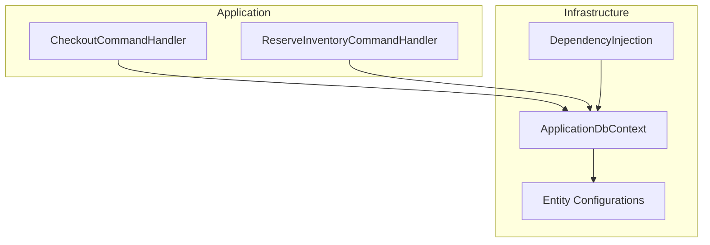
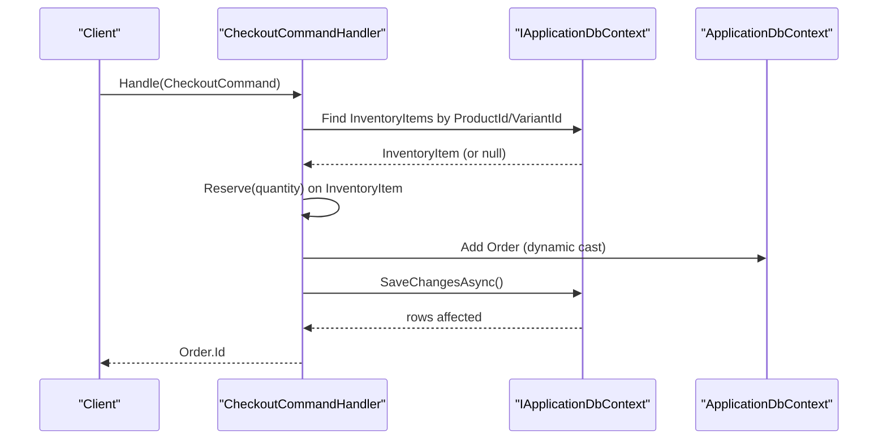
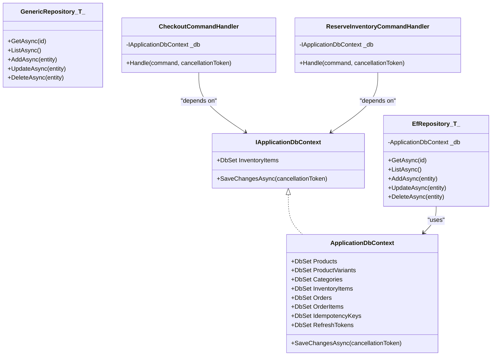

# Repository Pattern and Data Access

<cite>
**Referenced Files in This Document**
- [GenericRepository.cs](file://src/Ecommerce.Infrastructure/Repositories/GenericRepository.cs)
- [EfRepository.cs](file://src/Ecommerce.Infrastructure/Repositories/EfRepository.cs)
- [IApplicationDbContext.cs](file://src/Ecommerce.Application/Interfaces/IApplicationDbContext.cs)
- [ApplicationDbContext.cs](file://src/Ecommerce.Infrastructure/Persistence/ApplicationDbContext.cs)
- [InventoryItemConfiguration.cs](file://src/Ecommerce.Infrastructure/Persistence/Configurations/InventoryItemConfiguration.cs)
- [OrderConfiguration.cs](file://src/Ecommerce.Infrastructure/Persistence/Configurations/OrderConfiguration.cs)
- [ProductConfiguration.cs](file://src/Ecommerce.Infrastructure/Persistence/Configurations/ProductConfiguration.cs)
- [OrderItemConfiguration.cs](file://src/Ecommerce.Infrastructure/Persistence/Configurations/OrderItemConfiguration.cs)
- [CheckoutCommandHandler.cs](file://src/Ecommerce.Application/Commands/Checkout/CheckoutCommandHandler.cs)
- [ReserveInventoryCommandHandler.cs](file://src/Ecommerce.Application/Commands/ReserveInventory/ReserveInventoryCommandHandler.cs)
- [DependencyInjection.cs](file://src/Ecommerce.Infrastructure/DependencyInjection.cs)
- [InventoryItem.cs](file://src/Ecommerce.Domain/Entities/InventoryItem.cs)
- [Order.cs](file://src/Ecommerce.Domain/Entities/Order.cs)
</cite>

## Table of Contents
1. Introduction
2. Project Structure
3. Core Components
4. Architecture Overview
5. Detailed Component Analysis
6. Dependency Analysis
7. Performance Considerations
8. Troubleshooting Guide
9. Conclusion

## Introduction
This document explains the repository pattern implementation and data access layer in the project. It covers:
- The role of GenericRepository as a placeholder for common CRUD operations
- How EfRepository extends repository functionality with Entity Framework Core
- The IApplicationDbContext interface that abstracts database operations from the application layer
- Entity configurations that define relationships, constraints, and concurrency tokens
- Usage examples in command handlers and how transaction boundaries are maintained
- Caching strategies, query optimization, and performance considerations when working with repositories

## Project Structure
The data access layer is primarily implemented in the Infrastructure project, while the Application layer consumes an abstraction over the database via IApplicationDbContext. Command handlers orchestrate business workflows using this abstraction.

**Diagram sources**
- [CheckoutCommandHandler.cs:1-94](file://src/Ecommerce.Application/Commands/Checkout/CheckoutCommandHandler.cs#L1-L94)
- [ReserveInventoryCommandHandler.cs:1-31](file://src/Ecommerce.Application/Commands/ReserveInventory/ReserveInventoryCommandHandler.cs#L1-L31)
- [ApplicationDbContext.cs:1-43](file://src/Ecommerce.Infrastructure/Persistence/ApplicationDbContext.cs#L1-L43)
- [DependencyInjection.cs:1-89](file://src/Ecommerce.Infrastructure/DependencyInjection.cs#L1-L89)

**Section sources**
- [ApplicationDbContext.cs:1-43](file://src/Ecommerce.Infrastructure/Persistence/ApplicationDbContext.cs#L1-L43)
- [DependencyInjection.cs:1-89](file://src/Ecommerce.Infrastructure/DependencyInjection.cs#L1-L89)

## Core Components
- GenericRepository<T>: A simple placeholder implementing common CRUD signatures without EF Core integration.
- EfRepository<T>: An EF Core-based repository that performs actual persistence operations against ApplicationDbContext.
- IApplicationDbContext: An interface exposing specific DbSets and SaveChangesAsync to decouple the Application layer from EF Core specifics.
- ApplicationDbContext: Concrete EF Core DbContext implementing IApplicationDbContext, registering DbSets and applying entity configurations.

Key responsibilities:
- GenericRepository defines a consistent API surface for CRUD operations across entities.
- EfRepository implements these operations using EF Core Set methods and SaveChangesAsync.
- IApplicationDbContext provides a minimal, stable contract for the Application layer to perform queries and persist changes.
- ApplicationDbContext centralizes model configuration and exposes typed DbSets for domain entities.

**Section sources**
- [GenericRepository.cs:1-17](file://src/Ecommerce.Infrastructure/Repositories/GenericRepository.cs#L1-L17)
- [EfRepository.cs:1-47](file://src/Ecommerce.Infrastructure/Repositories/EfRepository.cs#L1-L47)
- [IApplicationDbContext.cs:1-15](file://src/Ecommerce.Application/Interfaces/IApplicationDbContext.cs#L1-L15)
- [ApplicationDbContext.cs:1-43](file://src/Ecommerce.Infrastructure/Persistence/ApplicationDbContext.cs#L1-L43)

## Architecture Overview
The Application layer uses IApplicationDbContext to interact with the database. Command handlers coordinate domain logic and persist changes through SaveChangesAsync within a single unit of work. Entity configurations define schema details, relationships, and concurrency control.

**Diagram sources**
- [CheckoutCommandHandler.cs:22-90](file://src/Ecommerce.Application/Commands/Checkout/CheckoutCommandHandler.cs#L22-L90)
- [ApplicationDbContext.cs:19-32](file://src/Ecommerce.Infrastructure/Persistence/ApplicationDbContext.cs#L19-L32)

**Section sources**
- [CheckoutCommandHandler.cs:1-94](file://src/Ecommerce.Application/Commands/Checkout/CheckoutCommandHandler.cs#L1-L94)
- [ApplicationDbContext.cs:1-43](file://src/Ecommerce.Infrastructure/Persistence/ApplicationDbContext.cs#L1-L43)

## Detailed Component Analysis

### GenericRepository<T>
- Purpose: Provides a generic CRUD interface for entities.
- Behavior: Placeholder implementations return default values or no-ops; intended to be replaced or extended by concrete EF-backed repositories.
- Methods: GetAsync, ListAsync, AddAsync, UpdateAsync, DeleteAsync.

Use cases:
- Define a stable repository API for future implementations.
- Encapsulate common patterns like querying by ID or listing all entities.

Limitations:
- No real EF Core integration; does not persist changes to the database.

**Section sources**
- [GenericRepository.cs:1-17](file://src/Ecommerce.Infrastructure/Repositories/GenericRepository.cs#L1-L17)

### EfRepository<T>
- Purpose: Implements CRUD operations using EF Core against a specific DbSet.
- Behavior: Uses _db.Set<T>() for queries and mutations; calls SaveChangesAsync after mutations.
- Methods: GetAsync, ListAsync, AddAsync, UpdateAsync, DeleteAsync.

Notes:
- Each mutation method persists immediately via SaveChangesAsync, which can lead to multiple round-trips if used frequently.
- Suitable for simple scenarios; consider batching or unit-of-work patterns for complex transactions.

**Section sources**
- [EfRepository.cs:1-47](file://src/Ecommerce.Infrastructure/Repositories/EfRepository.cs#L1-L47)

### IApplicationDbContext
- Purpose: Abstracts database access for the Application layer.
- Exposes:
  - Typed DbSets for key entities (e.g., InventoryItems).
  - SaveChangesAsync with cancellation token support.

Benefits:
- Decouples Application from EF Core specifics.
- Enables testability by mocking the interface.

Usage in commands:
- Handlers use FindAsync and SaveChangesAsync to read and write domain state consistently.

**Section sources**
- [IApplicationDbContext.cs:1-15](file://src/Ecommerce.Application/Interfaces/IApplicationDbContext.cs#L1-L15)
- [CheckoutCommandHandler.cs:22-90](file://src/Ecommerce.Application/Commands/Checkout/CheckoutCommandHandler.cs#L22-L90)
- [ReserveInventoryCommandHandler.cs:17-27](file://src/Ecommerce.Application/Commands/ReserveInventory/ReserveInventoryCommandHandler.cs#L17-L27)

### ApplicationDbContext
- Purpose: EF Core DbContext implementing IApplicationDbContext.
- Responsibilities:
  - Declares DbSets for Products, ProductVariants, Categories, InventoryItems, Orders, OrderItems, IdempotencyKeys, RefreshTokens.
  - Overrides SaveChangesAsync to pass cancellation tokens.
  - Applies entity configurations from the assembly.

Model configuration:
- Uses ApplyConfigurationsFromAssembly to load all IEntityTypeConfiguration classes automatically.

**Section sources**
- [ApplicationDbContext.cs:1-43](file://src/Ecommerce.Infrastructure/Persistence/ApplicationDbContext.cs#L1-L43)

### Entity Configurations
Entity configurations define table names, keys, property constraints, indexes, relationships, and concurrency tokens.

- InventoryItemConfiguration:
  - Table name and primary key.
  - Required properties for stock levels and reorder settings.
  - RowVersion configured as a concurrency token.
  - Ignores computed property Available.

- OrderConfiguration:
  - Table name and primary key.
  - Decimal precision for monetary fields.
  - Timestamps and optional metadata fields.
  - One-to-many relationship with OrderItems (cascade delete).

- ProductConfiguration:
  - Primary key and required string properties with length limits.
  - Unique index on Slug.
  - Precision for price-related decimal fields.
  - RowVersion for optimistic concurrency.

- OrderItemConfiguration:
  - Table name and primary key.
  - String field lengths and optional fields.
  - Decimal precision for pricing fields.
  - Index on OrderId for efficient lookups.

These configurations ensure consistent mapping between domain models and the relational schema.

**Section sources**
- [InventoryItemConfiguration.cs:1-37](file://src/Ecommerce.Infrastructure/Persistence/Configurations/InventoryItemConfiguration.cs#L1-L37)
- [OrderConfiguration.cs:1-47](file://src/Ecommerce.Infrastructure/Persistence/Configurations/OrderConfiguration.cs#L1-L47)
- [ProductConfiguration.cs:1-24](file://src/Ecommerce.Infrastructure/Persistence/Configurations/ProductConfiguration.cs#L1-L24)
- [OrderItemConfiguration.cs:1-29](file://src/Ecommerce.Infrastructure/Persistence/Configurations/OrderItemConfiguration.cs#L1-L29)

### Command Handlers and Transaction Boundaries
- CheckoutCommandHandler:
  - Validates idempotency key and attempts to register or reuse responses.
  - Builds an Order and adds items.
  - Reserves inventory by finding InventoryItem by variant or product and calling Reserve.
  - Persists the order and saves changes in a single SaveChangesAsync call.
  - Records idempotency response upon success.

- ReserveInventoryCommandHandler:
  - Validates quantity and finds the InventoryItem.
  - Calls Reserve on the entity and persists changes.

Transaction behavior:
- Each handler invokes SaveChangesAsync once per operation, ensuring atomicity at the command level.
- For multi-step operations spanning multiple aggregates, consider wrapping logic in explicit transactions to guarantee consistency.

**Section sources**
- [CheckoutCommandHandler.cs:22-90](file://src/Ecommerce.Application/Commands/Checkout/CheckoutCommandHandler.cs#L22-L90)
- [ReserveInventoryCommandHandler.cs:17-27](file://src/Ecommerce.Application/Commands/ReserveInventory/ReserveInventoryCommandHandler.cs#L17-L27)

### Domain Entities Involved
- InventoryItem:
  - Tracks QuantityOnHand, QuantityReserved, ReorderLevel, AllowBackorder.
  - Enforces business rules for Reserve, Release, AddStock, RemoveStock.
  - Includes UpdatedAt and RowVersion for auditing and concurrency.

- Order:
  - Manages Items collection and recalculates totals.
  - Enforces validation during AddItem and PlaceOrder.
  - Includes timestamps and RowVersion for concurrency.

**Section sources**
- [InventoryItem.cs:1-70](file://src/Ecommerce.Domain/Entities/InventoryItem.cs#L1-L70)
- [Order.cs:1-105](file://src/Ecommerce.Domain/Entities/Order.cs#L1-L105)

## Dependency Analysis
The following diagram shows how components depend on each other:

**Diagram sources**
- [IApplicationDbContext.cs:1-15](file://src/Ecommerce.Application/Interfaces/IApplicationDbContext.cs#L1-L15)
- [ApplicationDbContext.cs:1-43](file://src/Ecommerce.Infrastructure/Persistence/ApplicationDbContext.cs#L1-L43)
- [GenericRepository.cs:1-17](file://src/Ecommerce.Infrastructure/Repositories/GenericRepository.cs#L1-L17)
- [EfRepository.cs:1-47](file://src/Ecommerce.Infrastructure/Repositories/EfRepository.cs#L1-L47)
- [CheckoutCommandHandler.cs:1-94](file://src/Ecommerce.Application/Commands/Checkout/CheckoutCommandHandler.cs#L1-L94)
- [ReserveInventoryCommandHandler.cs:1-31](file://src/Ecommerce.Application/Commands/ReserveInventory/ReserveInventoryCommandHandler.cs#L1-L31)

**Section sources**
- [DependencyInjection.cs:1-89](file://src/Ecommerce.Infrastructure/DependencyInjection.cs#L1-L89)

## Performance Considerations
- Query efficiency:
  - Use FindAsync with composite keys where appropriate to avoid unnecessary scans.
  - Ensure indexes exist on frequently queried columns (e.g., OrderItems.OrderId, Products.Slug).
  - Prefer projecting only needed fields to reduce payload size.

- Concurrency:
  - Leverage RowVersion as a concurrency token to detect conflicts during updates.
  - Wrap critical sections in explicit transactions when multiple aggregates must be updated atomically.

- Unit of Work:
  - Batch related changes and call SaveChangesAsync once per logical operation to minimize round-trips.
  - Avoid calling SaveChangesAsync inside tight loops; accumulate changes and persist once.

- Caching strategy:
  - Introduce caching for read-heavy, rarely changing data (e.g., product catalogs) using an in-memory cache or distributed cache.
  - Cache invalidation should align with update paths to prevent stale reads.
  - Consider second-level caching providers compatible with EF Core if applicable.

- Connection management:
  - Register ApplicationDbContext as scoped to align with request lifetime.
  - Ensure connection strings and provider packages are correctly configured.

- Monitoring:
  - Log slow queries and enable EF Core logging in development to identify bottlenecks.
  - Monitor database metrics for lock contention and long-running transactions.

[No sources needed since this section provides general guidance]

## Troubleshooting Guide
Common issues and resolutions:
- Missing DbSet or incorrect type:
  - Verify that the entity’s DbSet is declared in ApplicationDbContext and that the corresponding configuration exists.

- Relationship mapping errors:
  - Check entity configurations for correct foreign key definitions and cascade behaviors.

- Concurrency exceptions:
  - Ensure RowVersion is configured and handled appropriately in update flows.

- Idempotency key collisions:
  - Confirm registration and retrieval logic in idempotency service to avoid race conditions.

- Validation failures:
  - Ensure validators are registered and invoked via pipeline behaviors.

- Configuration binding:
  - Validate connection strings and provider setup in DependencyInjection.

**Section sources**
- [ApplicationDbContext.cs:19-32](file://src/Ecommerce.Infrastructure/Persistence/ApplicationDbContext.cs#L19-L32)
- [OrderConfiguration.cs:40-44](file://src/Ecommerce.Infrastructure/Persistence/Configurations/OrderConfiguration.cs#L40-L44)
- [InventoryItemConfiguration.cs:23-30](file://src/Ecommerce.Infrastructure/Persistence/Configurations/InventoryItemConfiguration.cs#L23-L30)
- [DependencyInjection.cs:11-24](file://src/Ecommerce.Infrastructure/DependencyInjection.cs#L11-L24)

## Conclusion
The repository pattern in this project provides a clear separation between the Application layer and data persistence. While GenericRepository offers a placeholder API, EfRepository demonstrates EF Core integration. IApplicationDbContext abstracts database operations, enabling testable and maintainable code. Entity configurations enforce schema integrity and relationships. Command handlers coordinate business logic and persist changes within transactional boundaries. Adopting robust caching, indexing, and concurrency controls will further improve performance and reliability.

[No sources needed since this section summarizes without analyzing specific files]