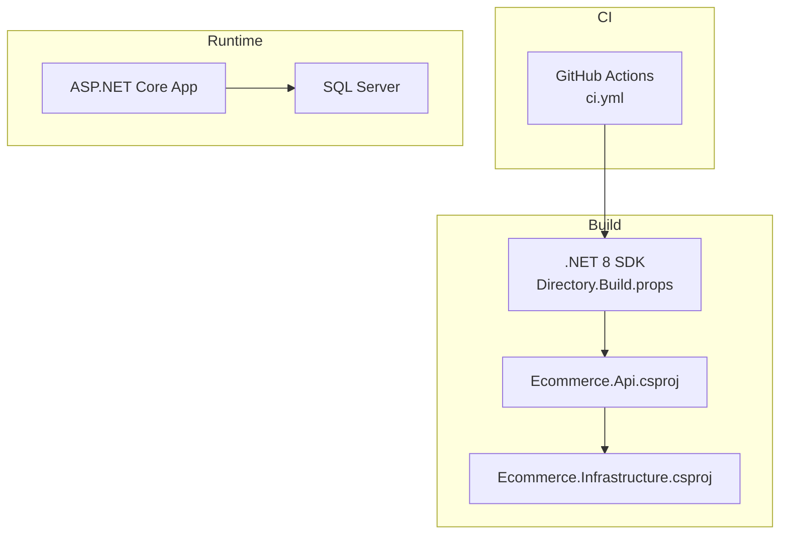
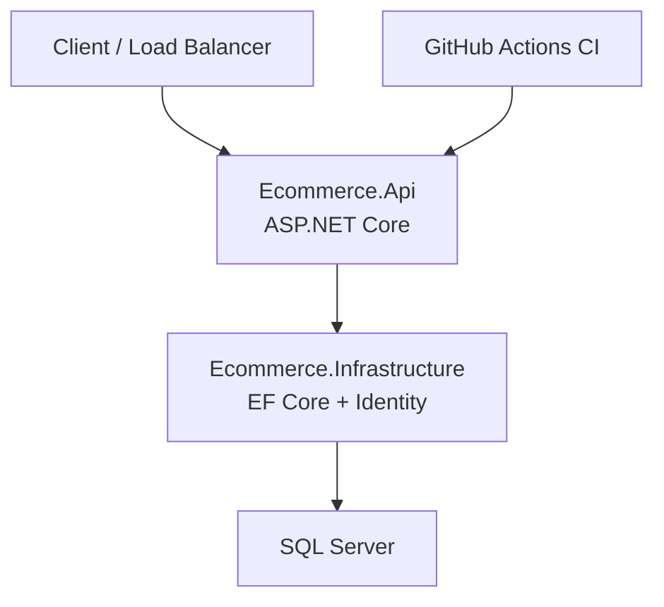
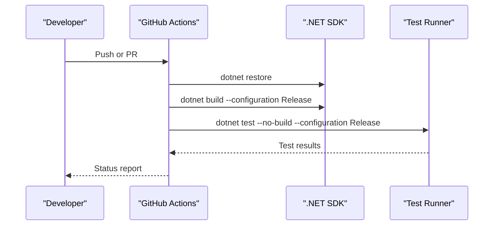
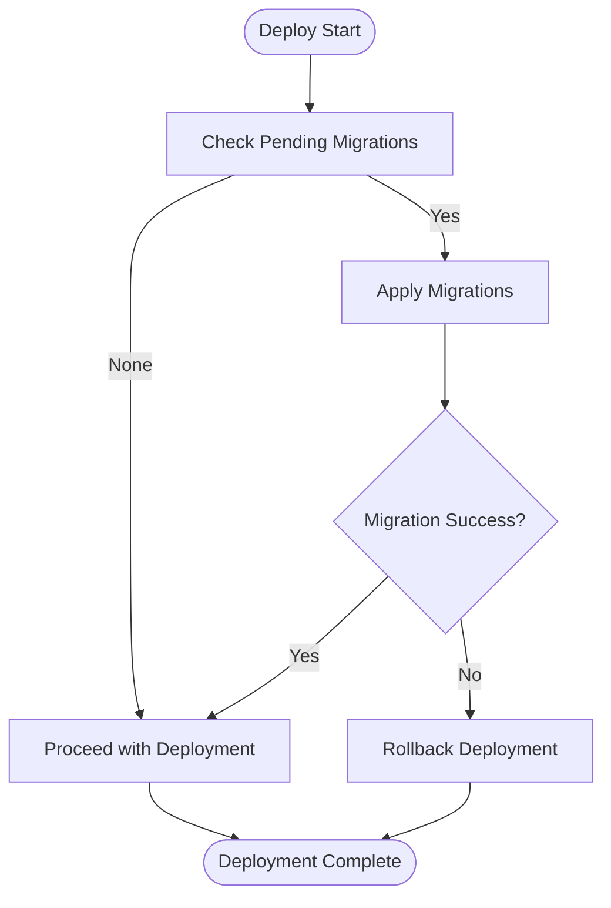
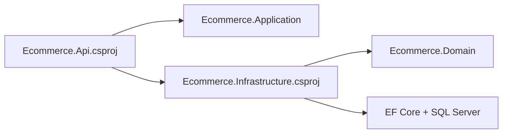

# Deployment & DevOps

<cite>
**Referenced Files in This Document**
- [ci.yml](file://.github/workflows/ci.yml)
- [Directory.Build.props](file://Directory.Build.props)
- [Ecommerce.Api.csproj](file://src/Ecommerce.Api/Ecommerce.Api.csproj)
- [appsettings.Development.json](file://src/Ecommerce.Api/appsettings.Development.json)
- [Ecommerce.Infrastructure.csproj](file://src/Ecommerce.Infrastructure/Ecommerce.Infrastructure.csproj)
- [ApplicationDbContext.cs](file://src/Ecommerce.Infrastructure/Persistence/ApplicationDbContext.cs)
- [InitialCreate.cs](file://src/Ecommerce.Infrastructure/Migrations/20260815214939_InitialCreate.cs)
- [AddRefreshTokensTable.cs](file://src/Ecommerce.Infrastructure/Migrations/20260816140220_AddRefreshTokensTable.cs)
- [AddRefreshTokenIndexes.cs](file://src/Ecommerce.Infrastructure/Migrations/20260816141752_AddRefreshTokenIndexes.cs)
- [PaymentGateway.cs](file://src/Ecommerce.Infrastructure/Payments/PaymentGateway.cs)
</cite>

## Table of Contents
1. Introduction
2. Project Structure
3. Core Components
4. Architecture Overview
5. Detailed Component Analysis
6. Dependency Analysis
7. Performance Considerations
8. Troubleshooting Guide
9. Conclusion
10. Appendices

## Introduction
This document provides deployment and DevOps guidance for the E-Commerce Backend, focusing on CI/CD with GitHub Actions, containerization with Docker, orchestration with Kubernetes, environment configuration management across development, staging, and production, monitoring/logging/alerting strategies, database migration and backup procedures, scaling considerations, load balancing, performance optimization, and safe release practices including checklists and rollback procedures.

## Project Structure
The repository is a .NET 8 solution organized by layers (API, Application, Domain, Infrastructure) with tests and GitHub Actions for continuous integration. The API project references Application and Infrastructure layers and includes Swagger and JWT authentication packages. Infrastructure uses EF Core with SQL Server and contains migrations.

**Diagram sources**
- [ci.yml:1-24](file://.github/workflows/ci.yml#L1-L24)
- [Directory.Build.props:1-9](file://Directory.Build.props#L1-L9)
- [Ecommerce.Api.csproj:1-20](file://src/Ecommerce.Api/Ecommerce.Api.csproj#L1-L20)
- [Ecommerce.Infrastructure.csproj:1-18](file://src/Ecommerce.Infrastructure/Ecommerce.Infrastructure.csproj#L1-L18)

**Section sources**
- [ci.yml:1-24](file://.github/workflows/ci.yml#L1-L24)
- [Directory.Build.props:1-9](file://Directory.Build.props#L1-L9)
- [Ecommerce.Api.csproj:1-20](file://src/Ecommerce.Api/Ecommerce.Api.csproj#L1-L20)
- [Ecommerce.Infrastructure.csproj:1-18](file://src/Ecommerce.Infrastructure/Ecommerce.Infrastructure.csproj#L1-L18)

## Core Components
- CI pipeline: Builds and runs tests on push to main and release branches, and on pull requests to main.
- Build targets: .NET 8, nullable enabled, implicit usings, latest language version.
- API layer: ASP.NET Core Web API with Swagger and JWT Bearer authentication.
- Infrastructure layer: EF Core with SQL Server provider, Identity, and migrations.
- Configuration: Environment-specific settings via appsettings files; development connection string present.

Key responsibilities:
- ci.yml orchestrates restore, build, and test steps.
- Directory.Build.props centralizes global build properties.
- Ecommerce.Api.csproj wires up API dependencies and features.
- Ecommerce.Infrastructure.csproj configures EF Core and SQL Server.
- appsettings.Development.json defines logging level, JWT issuer/key, and local DB connection.

**Section sources**
- [ci.yml:1-24](file://.github/workflows/ci.yml#L1-L24)
- [Directory.Build.props:1-9](file://Directory.Build.props#L1-L9)
- [Ecommerce.Api.csproj:1-20](file://src/Ecommerce.Api/Ecommerce.Api.csproj#L1-L20)
- [Ecommerce.Infrastructure.csproj:1-18](file://src/Ecommerce.Infrastructure/Ecommerce.Infrastructure.csproj#L1-L18)
- [appsettings.Development.json:1-16](file://src/Ecommerce.Api/appsettings.Development.json#L1-L16)

## Architecture Overview
High-level runtime architecture showing how the API interacts with infrastructure services and the database, and how CI drives builds and tests.

**Diagram sources**
- [Ecommerce.Api.csproj:1-20](file://src/Ecommerce.Api/Ecommerce.Api.csproj#L1-L20)
- [Ecommerce.Infrastructure.csproj:1-18](file://src/Ecommerce.Infrastructure/Ecommerce.Infrastructure.csproj#L1-L18)

## Detailed Component Analysis

### CI/CD Pipeline (GitHub Actions)
- Triggers: Push to main and release/**; Pull requests to main.
- Steps: Checkout code, set up .NET 8, restore packages, build Release, run tests with normal verbosity.
- Recommendations: Add artifact upload, security scanning, and deployment jobs for staging/production.

**Diagram sources**
- [ci.yml:1-24](file://.github/workflows/ci.yml#L1-L24)

**Section sources**
- [ci.yml:1-24](file://.github/workflows/ci.yml#L1-L24)

### Containerization Strategy (Docker)
- Target image: Multi-stage build using .NET 8 SDK to build and publish a minimal runtime image for the API project.
- Base images: Use official Microsoft ASP.NET Core runtime images aligned with net8.0.
- Build inputs: Publish output from Ecommerce.Api; ensure all referenced projects are included via project references.
- Runtime config: Provide environment variables for ConnectionStrings and Jwt settings at runtime.
- Security: Run as non-root user, minimize attack surface, scan images.

Suggested workflow:
- Build and publish inside the container using the SDK stage.
- Copy only the published output into a runtime-only stage.
- Expose the HTTP port used by the API.
- Set health checks and readiness probes.

[No sources needed since this section provides general guidance]

### Orchestration with Kubernetes
- Deployments: One Deployment per service (API), with replicas scaled based on load.
- Services: ClusterIP Service to expose the API internally; Ingress for external access.
- ConfigMaps/Secrets: Store non-sensitive configuration in ConfigMaps; secrets (JWT keys, DB credentials) in Secrets.
- Probes: Liveness and readiness probes to manage rolling updates and traffic routing.
- Horizontal Pod Autoscaler: Scale based on CPU/memory or custom metrics.
- Rolling updates: Configure maxUnavailable and maxSurge for zero-downtime deployments.

[No sources needed since this section provides general guidance]

### Environment Configuration Management
- Development: Local connection string and JWT settings defined in appsettings.Development.json.
- Staging/Production: Externalize configuration via environment variables or mounted secrets/configmaps. Avoid committing sensitive values.
- Logging: Adjust log levels per environment; enable structured logging and correlation IDs.
- Feature flags: Use configuration sections to toggle features safely across environments.

**Section sources**
- [appsettings.Development.json:1-16](file://src/Ecommerce.Api/appsettings.Development.json#L1-L16)

### Monitoring, Logging, and Alerting
- Structured logs: Emit JSON logs with request context, user identity, and operation IDs.
- Centralized logging: Ship logs to a log aggregation system (e.g., Elasticsearch, Azure Monitor, CloudWatch).
- Metrics: Expose application metrics (request rate, latency, error rates) and integrate with a metrics collector.
- Alerts: Define SLO-based alerts for error rates, latency, and resource utilization.
- Distributed tracing: Add correlation IDs and consider OpenTelemetry for end-to-end traces.

[No sources needed since this section provides general guidance]

### Database Migration Strategies and Backup Procedures
- Migrations: EF Core migrations exist for schema changes. Apply migrations during deployment or as a pre-deployment job.
- Rollback: Keep migration scripts reversible; use feature flags to decouple deploy and migrate when necessary.
- Backups: Schedule regular full and incremental backups; test restore procedures regularly.
- Data safety: Validate migration compatibility before applying to production; use separate databases per environment.

**Diagram sources**
- [InitialCreate.cs:1-200](file://src/Ecommerce.Infrastructure/Migrations/20260815214939_InitialCreate.cs#L1-L200)
- [AddRefreshTokensTable.cs:1-200](file://src/Ecommerce.Infrastructure/Migrations/20260816140220_AddRefreshTokensTable.cs#L1-L200)
- [AddRefreshTokenIndexes.cs:1-200](file://src/Ecommerce.Infrastructure/Migrations/20260816141752_AddRefreshTokenIndexes.cs#L1-L200)

**Section sources**
- [InitialCreate.cs:1-200](file://src/Ecommerce.Infrastructure/Migrations/20260815214939_InitialCreate.cs#L1-L200)
- [AddRefreshTokensTable.cs:1-200](file://src/Ecommerce.Infrastructure/Migrations/20260816140220_AddRefreshTokensTable.cs#L1-L200)
- [AddRefreshTokenIndexes.cs:1-200](file://src/Ecommerce.Infrastructure/Migrations/20260816141752_AddRefreshTokenIndexes.cs#L1-L200)

### Scaling, Load Balancing, and Performance Optimization
- Horizontal scaling: Increase replicas behind a load balancer; use HPA in Kubernetes.
- Caching: Introduce caching for read-heavy endpoints (products, categories).
- Database tuning: Indexes, query optimization, connection pooling, read replicas if needed.
- API performance: Enable response compression, async I/O, efficient DTO mapping, and pagination.
- Observability: Track key metrics and set thresholds for auto-scaling decisions.

[No sources needed since this section provides general guidance]

### Safe Releases: Checklists and Rollback Procedures
Pre-deployment checklist:
- All tests pass in CI.
- Migrations reviewed and tested against staging data.
- Secrets and configuration validated for target environment.
- Health checks configured and verified.
- Rollback plan documented and rehearsed.

Deployment steps:
- Deploy new version with rolling update strategy.
- Verify health and smoke tests post-deploy.
- Monitor metrics and logs for anomalies.

Rollback procedure:
- If issues detected, revert to previous stable image/version.
- Re-run smoke tests and verify service restoration.
- Investigate root cause and prepare fix; repeat deployment if necessary.

[No sources needed since this section provides general guidance]

## Dependency Analysis
Project dependency relationships and tooling:
- API depends on Application and Infrastructure layers.
- Infrastructure depends on Application and Domain layers.
- EF Core and SQL Server provider are used for persistence.
- JWT and Identity packages are integrated for authentication.

**Diagram sources**
- [Ecommerce.Api.csproj:1-20](file://src/Ecommerce.Api/Ecommerce.Api.csproj#L1-L20)
- [Ecommerce.Infrastructure.csproj:1-18](file://src/Ecommerce.Infrastructure/Ecommerce.Infrastructure.csproj#L1-L18)

**Section sources**
- [Ecommerce.Api.csproj:1-20](file://src/Ecommerce.Api/Ecommerce.Api.csproj#L1-L20)
- [Ecommerce.Infrastructure.csproj:1-18](file://src/Ecommerce.Infrastructure/Ecommerce.Infrastructure.csproj#L1-L18)

## Performance Considerations
- Use connection pooling and tune pool sizes for high concurrency.
- Enable gzip/brotli compression for responses.
- Cache static or frequently accessed data where appropriate.
- Optimize queries and avoid N+1 problems.
- Profile hot paths and add targeted instrumentation.

[No sources needed since this section provides general guidance]

## Troubleshooting Guide
Common issues and resolutions:
- Build failures: Ensure .NET 8 SDK is installed and versions match Directory.Build.props.
- Test failures: Verify test database connectivity and required fixtures.
- Migration errors: Confirm connection strings and permissions; apply migrations in order.
- Authentication issues: Validate JWT keys and issuers in environment configuration.
- Payment integration: Replace stub implementation with real provider in production.

**Section sources**
- [PaymentGateway.cs:1-24](file://src/Ecommerce.Infrastructure/Payments/PaymentGateway.cs#L1-L24)

## Conclusion
The repository provides a solid foundation for CI-driven builds and tests, layered architecture, and EF Core-based persistence. To reach production-grade operations, extend CI with packaging and deployment stages, adopt Docker and Kubernetes for containerization and orchestration, externalize configuration securely, implement comprehensive monitoring and alerting, and establish robust migration and backup procedures with clear rollback plans.

## Appendices

### Appendix A: CI/CD Enhancements
- Add artifact publishing for binaries.
- Integrate security scanning (dependency and container).
- Add deployment jobs for staging and production with approvals.

[No sources needed since this section provides general guidance]

### Appendix B: Kubernetes Manifests Overview
- Deployment with replicas and rolling update strategy.
- Service and Ingress for exposure.
- ConfigMap and Secret references for configuration.
- HPA for autoscaling.

[No sources needed since this section provides general guidance]

### Appendix C: Environment Variables Reference
- ConnectionStrings__DefaultConnection: Database connection string.
- Jwt__Key: Signing key for JWT tokens.
- Jwt__Issuer: Token issuer.
- Logging__LogLevel__Default: Log level.

**Section sources**
- [appsettings.Development.json:1-16](file://src/Ecommerce.Api/appsettings.Development.json#L1-L16)