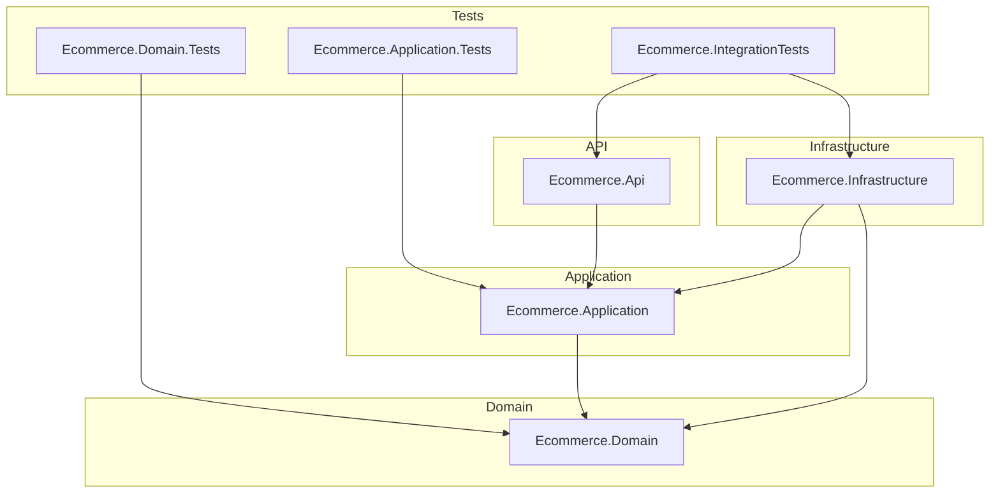
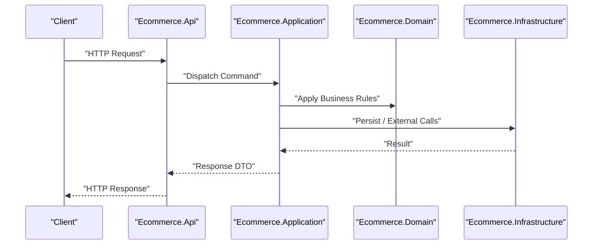
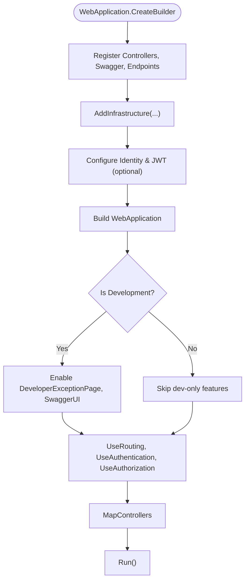
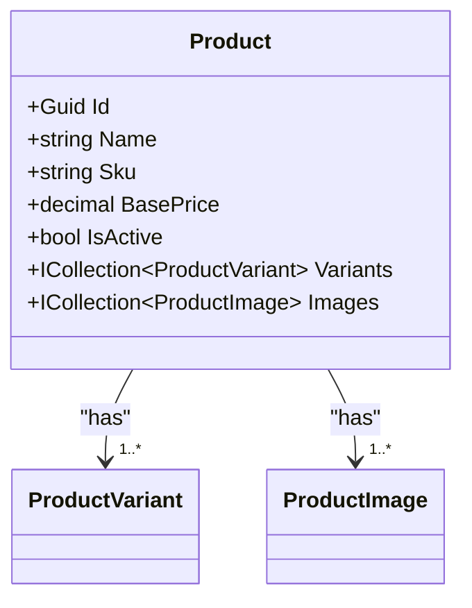
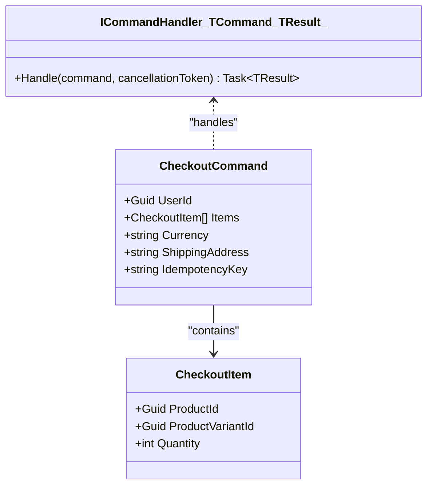
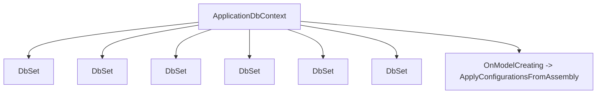
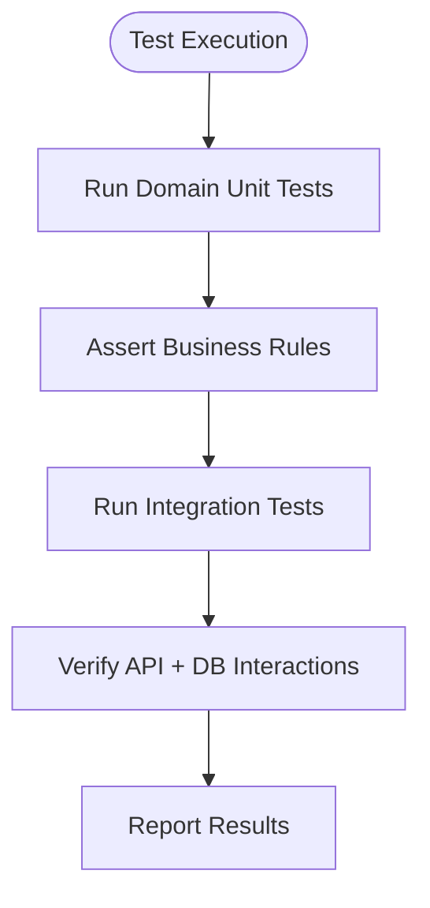
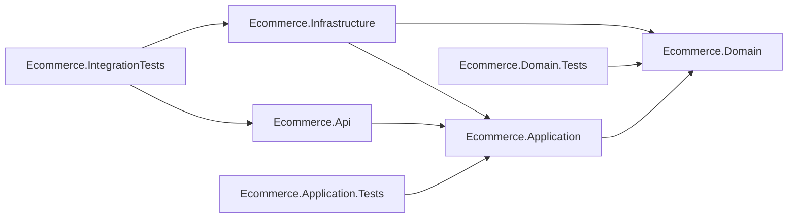

# Development Guide

<cite>
**Referenced Files in This Document**
- [README.md](file://README.md)
- [Ecommerce.sln](file://Ecommerce.sln)
- [Directory.Build.props](file://Directory.Build.props)
- [Program.cs](file://src/Ecommerce.Api/Program.cs)
- [dependency_diagram.md](file://docs/architecture/dependency_diagram.md)
- [Domain README](file://src/Ecommerce.Domain/README.md)
- [Application README](file://src/Ecommerce.Application/README.md)
- [Infrastructure README](file://src/Ecommerce.Infrastructure/README.md)
- [ci.yml](file://.github/workflows/ci.yml)
- [Product.cs](file://src/Ecommerce.Domain/Entities/Product.cs)
- [CheckoutCommand.cs](file://src/Ecommerce.Application/Commands/Checkout/CheckoutCommand.cs)
- [ICommandHandler.cs](file://src/Ecommerce.Application/Common/Commands/ICommandHandler.cs)
- [ApplicationDbContext.cs](file://src/Ecommerce.Infrastructure/Persistence/ApplicationDbContext.cs)
- [OrderTests.cs](file://tests/Ecommerce.Domain.Tests/OrderTests.cs)
</cite>

## Table of Contents
1. Introduction
2. Project Structure
3. Core Components
4. Architecture Overview
5. Detailed Component Analysis
6. Dependency Analysis
7. Performance Considerations
8. Troubleshooting Guide
9. Conclusion
10. Appendices

## Introduction
This guide provides a comprehensive development workflow for contributing to the E-Commerce Backend. It covers coding conventions, naming standards, project structure guidelines, branching and commit practices, pull request processes, debugging and profiling techniques, code review guidelines, testing strategies, documentation practices, and how to extend features consistently with established patterns.

The solution follows Clean Architecture with clear separation between Domain, Application, Infrastructure, and API layers, and includes CI that builds and tests on push and pull requests.

**Section sources**
- [README.md:1-34](file://README.md#L1-L34)

## Project Structure
The repository is organized into four main source projects and three test projects under a single solution. The dependency direction is strictly enforced: API depends on Application; Application depends on Domain; Infrastructure implements interfaces from Application and depends on both Application and Domain. Tests target the appropriate layer(s).

Key structural elements:
- Solution file defines all projects and configurations.
- Directory-level build properties set global C# language settings and target framework.
- API entrypoint wires up controllers, Swagger, authentication, authorization, and infrastructure services.
- Domain contains entities, value objects, domain events, exceptions, and pure business rules.
- Application contains DTOs, commands/queries, behaviors, validators, and orchestration logic.
- Infrastructure contains EF Core configuration, Identity setup, repositories, background services, and DI registration.

**Diagram sources**
- [dependency_diagram.md:1-33](file://docs/architecture/dependency_diagram.md#L1-L33)

**Section sources**
- [Ecommerce.sln:1-64](file://Ecommerce.sln#L1-L64)
- [Directory.Build.props:1-9](file://Directory.Build.props#L1-L9)
- [dependency_diagram.md:1-33](file://docs/architecture/dependency_diagram.md#L1-L33)

## Core Components
- API Layer: ASP.NET Core application bootstrapping, controller routing, Swagger, authentication/authorization, and service registration.
- Application Layer: CQRS-style command handling, validation, DTOs, and cross-cutting behaviors (logging, validation).
- Domain Layer: Entities, value objects, domain events, exceptions, and business invariants.
- Infrastructure Layer: EF Core DbContext and configurations, Identity integration, repositories, payment gateway, idempotency service, refresh token management, and DI wiring.

Coding conventions observed:
- Strongly typed identifiers using Guid for primary keys.
- Command-driven workflows with explicit handlers and validators.
- Configuration via appsettings and environment-specific files.
- Use of nullable reference types and implicit usings globally.

**Section sources**
- [Program.cs:1-77](file://src/Ecommerce.Api/Program.cs#L1-L77)
- [ICommandHandler.cs:1-11](file://src/Ecommerce.Application/Common/Commands/ICommandHandler.cs#L1-L11)
- [Product.cs:1-44](file://src/Ecommerce.Domain/Entities/Product.cs#L1-L44)
- [ApplicationDbContext.cs:1-43](file://src/Ecommerce.Infrastructure/Persistence/ApplicationDbContext.cs#L1-L43)

## Architecture Overview
The system uses Clean Architecture with layered responsibilities:
- API exposes HTTP endpoints and delegates work to Application commands.
- Application orchestrates use cases, validates inputs, and invokes domain logic or infrastructure services.
- Domain encapsulates business rules and state transitions without external dependencies.
- Infrastructure provides concrete implementations for persistence, identity, payments, and other cross-cutting concerns.

[No diagram sources needed since this diagram shows conceptual workflow, not actual code structure]

## Detailed Component Analysis

### API Bootstrap and Middleware Pipeline
The API project configures controllers, Swagger, authentication, authorization, and registers infrastructure services. It also conditionally sets up Identity and JWT based on available packages and configuration.

Key points:
- Controllers are mapped after routing and middleware pipeline setup.
- Authentication and authorization are enabled in the pipeline.
- Swagger UI is enabled in development.
- Infrastructure services are registered via a dedicated extension method.

**Diagram sources**
- [Program.cs:1-77](file://src/Ecommerce.Api/Program.cs#L1-L77)

**Section sources**
- [Program.cs:1-77](file://src/Ecommerce.Api/Program.cs#L1-L77)

### Domain Model and Business Rules
The Domain layer defines core entities such as Product and Order-related structures, along with value objects and exceptions. Entities expose strongly-typed properties and relationships. Business rules are enforced within domain methods and validated by tests.

Observations:
- Entities use Guid identifiers and include audit fields like CreatedAt/UpdatedAt.
- Relationships are modeled via collections (e.g., product variants and images).
- Domain exceptions represent invalid states or operations.

**Diagram sources**
- [Product.cs:1-44](file://src/Ecommerce.Domain/Entities/Product.cs#L1-L44)

**Section sources**
- [Product.cs:1-44](file://src/Ecommerce.Domain/Entities/Product.cs#L1-L44)

### Application Commands and Handlers
The Application layer implements CQRS-style commands with dedicated handlers and validators. For example, checkout flow is represented by a command carrying user context, items, currency, shipping address, and an idempotency key.

Patterns:
- Commands carry input data and are handled by specific handler classes.
- Validators enforce preconditions before execution.
- Handlers coordinate domain actions and infrastructure calls.

**Diagram sources**
- [CheckoutCommand.cs:1-22](file://src/Ecommerce.Application/Commands/Checkout/CheckoutCommand.cs#L1-L22)
- [ICommandHandler.cs:1-11](file://src/Ecommerce.Application/Common/Commands/ICommandHandler.cs#L1-L11)

**Section sources**
- [CheckoutCommand.cs:1-22](file://src/Ecommerce.Application/Commands/Checkout/CheckoutCommand.cs#L1-L22)
- [ICommandHandler.cs:1-11](file://src/Ecommerce.Application/Common/Commands/ICommandHandler.cs#L1-L11)

### Persistence and Data Access
The Infrastructure layer provides an EF Core DbContext that exposes DbSets for core entities and applies model configurations from the assembly. It integrates with ASP.NET Core Identity and supports asynchronous save operations.

Key aspects:
- Centralized entity exposure via DbSet properties.
- Automatic application of EF Core configurations from the assembly.
- Overridden SaveChangesAsync to allow future cross-cutting behavior (e.g., auditing).

**Diagram sources**
- [ApplicationDbContext.cs:1-43](file://src/Ecommerce.Infrastructure/Persistence/ApplicationDbContext.cs#L1-L43)

**Section sources**
- [ApplicationDbContext.cs:1-43](file://src/Ecommerce.Infrastructure/Persistence/ApplicationDbContext.cs#L1-L43)

### Testing Strategy and Quality Gates
Unit tests validate domain behavior and ensure business invariants hold. Integration tests exercise end-to-end flows including persistence and external interactions.

Examples:
- Domain tests assert totals update correctly and that placing an order without items throws a domain exception.
- Tests use xUnit and verify expected outcomes through assertions.

**Diagram sources**
- [OrderTests.cs:1-42](file://tests/Ecommerce.Domain.Tests/OrderTests.cs#L1-L42)

**Section sources**
- [OrderTests.cs:1-42](file://tests/Ecommerce.Domain.Tests/OrderTests.cs#L1-L42)

## Dependency Analysis
The solution enforces strict dependency directions to maintain clean architecture boundaries. API depends on Application; Application depends on Domain; Infrastructure depends on both Application and Domain. Tests depend on the layers they validate.

**Diagram sources**
- [dependency_diagram.md:1-33](file://docs/architecture/dependency_diagram.md#L1-L33)

**Section sources**
- [dependency_diagram.md:1-33](file://docs/architecture/dependency_diagram.md#L1-L33)

## Performance Considerations
- Use async I/O throughout the pipeline (SaveChangesAsync, async handlers).
- Keep domain logic free of heavy I/O; offload persistence and external calls to infrastructure.
- Leverage EF Core query optimization via proper configurations and selective projections in higher layers.
- Enable caching where appropriate at the API boundary for read-heavy endpoints.
- Profile hot paths using built-in .NET tools and consider distributed tracing for multi-service scenarios.

[No sources needed since this section provides general guidance]

## Troubleshooting Guide
Common issues and resolutions:
- Missing Identity/JWT packages: The API gracefully skips Identity/JWT configuration if packages are unavailable. Install required packages locally using provided scripts to enable full functionality.
- Database connectivity: Ensure connection strings are configured for the environment and migrations are applied before running.
- Validation failures: Command validators enforce preconditions; inspect validator errors when requests fail early.
- Idempotency: Use the idempotency key in commands to prevent duplicate processing during retries.

Debugging tips:
- Enable developer exception page and Swagger UI in development to inspect errors and API contracts.
- Log command execution and results in behaviors/handlers for traceability.
- Use EF Core logging to diagnose query performance and mapping issues.

Quality gates:
- CI pipeline runs restore, build, and tests on push to main and release branches, and on pull requests targeting main.
- All changes should pass unit and integration tests before merging.

**Section sources**
- [Program.cs:19-55](file://src/Ecommerce.Api/Program.cs#L19-L55)
- [ci.yml:1-24](file://.github/workflows/ci.yml#L1-L24)

## Conclusion
This development guide outlines the project’s architecture, coding conventions, and workflows to help contributors implement features safely and consistently. Follow the established patterns for commands, domain modeling, and persistence, and rely on CI and tests to maintain quality. Extend existing features by adding new commands, handlers, validators, and domain logic while respecting layer boundaries.

[No sources needed since this section summarizes without analyzing specific files]

## Appendices

### Coding Conventions and Naming Standards
- Use PascalCase for classes, methods, and properties; use camelCase for local variables and parameters.
- Prefer strongly-typed identifiers (Guid) for primary keys.
- Place domain logic in Domain; orchestration in Application; persistence in Infrastructure; HTTP in API.
- Use CQRS-style commands for write operations with dedicated handlers and validators.
- Configure EF models in Infrastructure and apply them centrally via OnModelCreating.

**Section sources**
- [Product.cs:1-44](file://src/Ecommerce.Domain/Entities/Product.cs#L1-L44)
- [CheckoutCommand.cs:1-22](file://src/Ecommerce.Application/Commands/Checkout/CheckoutCommand.cs#L1-L22)
- [ApplicationDbContext.cs:1-43](file://src/Ecommerce.Infrastructure/Persistence/ApplicationDbContext.cs#L1-L43)

### Development Workflow
- Branching strategy: Use feature branches per feature or bug fix; merge into main via pull requests. Release branches follow a release/** pattern as indicated by CI triggers.
- Commit messages: Use concise, descriptive messages referencing the change scope and purpose.
- Pull requests: Ensure tests pass, code adheres to conventions, and updates include necessary documentation.

**Section sources**
- [ci.yml:1-24](file://.github/workflows/ci.yml#L1-L24)

### Debugging Techniques and Profiling Tools
- Local debugging: Run the API in development mode to leverage developer exception page and Swagger UI.
- Logging: Add structured logs in handlers and infrastructure services to trace command flows.
- Profiling: Use .NET diagnostics tools to analyze CPU and memory usage; focus on slow queries and blocking operations.

**Section sources**
- [Program.cs:63-68](file://src/Ecommerce.Api/Program.cs#L63-L68)

### Code Review Guidelines and Quality Gates
- Verify adherence to Clean Architecture boundaries and CQRS patterns.
- Ensure domain invariants are tested and documented.
- Confirm that API endpoints are well-documented via Swagger and that error responses are consistent.
- Require passing CI checks and adequate test coverage for new features.

**Section sources**
- [ci.yml:1-24](file://.github/workflows/ci.yml#L1-L24)

### Writing Documentation and Adding Tests
- Update architecture docs when introducing new entities or flows.
- Add unit tests for domain logic and integration tests for end-to-end scenarios.
- Include examples and usage notes in README files for each layer as needed.

**Section sources**
- [Domain README:1-6](file://src/Ecommerce.Domain/README.md#L1-L6)
- [Application README:1-7](file://src/Ecommerce.Application/README.md#L1-L7)
- [Infrastructure README:1-8](file://src/Ecommerce.Infrastructure/README.md#L1-L8)
- [OrderTests.cs:1-42](file://tests/Ecommerce.Domain.Tests/OrderTests.cs#L1-L42)

### Extending Features and Adding New Functionality
- Define new domain entities/value objects in Domain with clear invariants.
- Create commands and handlers in Application with corresponding validators.
- Implement persistence mappings and repository access in Infrastructure.
- Expose new endpoints in API, wire up DI, and document via Swagger.
- Add tests across appropriate layers to validate behavior and integration.

**Section sources**
- [Program.cs:57-59](file://src/Ecommerce.Api/Program.cs#L57-L59)
- [ApplicationDbContext.cs:19-27](file://src/Ecommerce.Infrastructure/Persistence/ApplicationDbContext.cs#L19-L27)