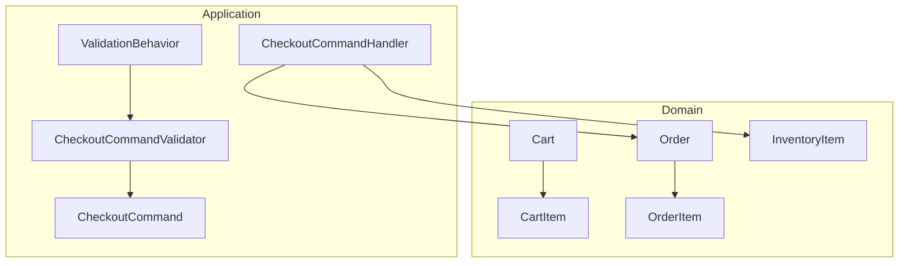
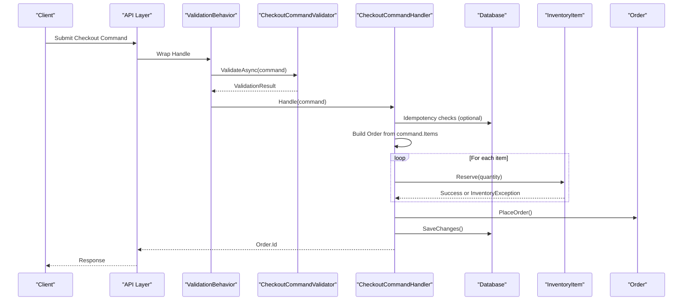
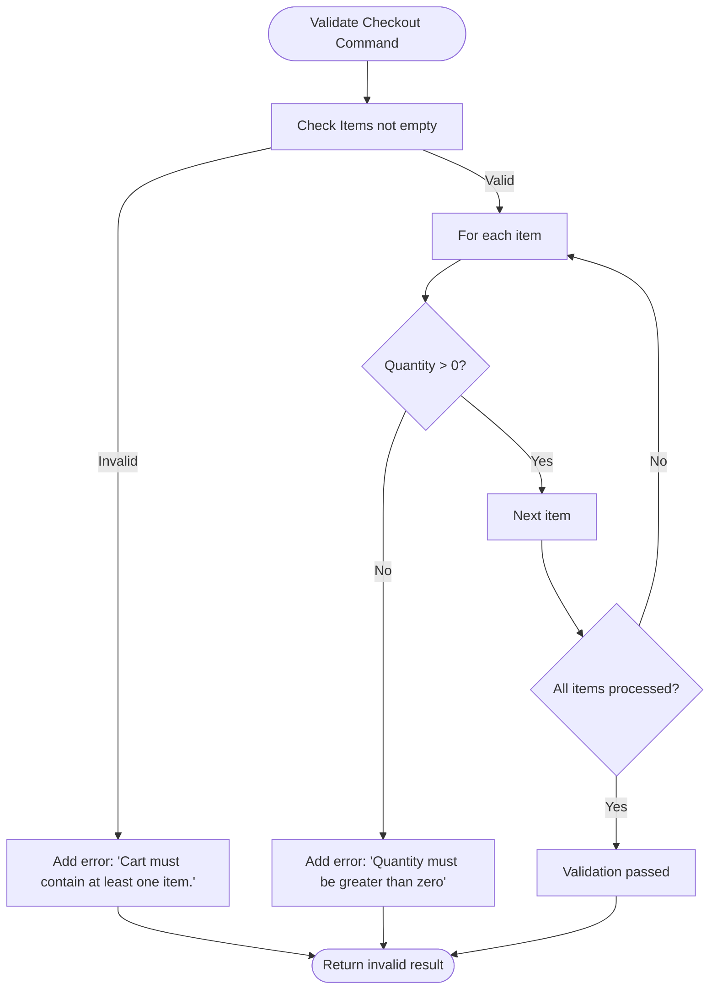
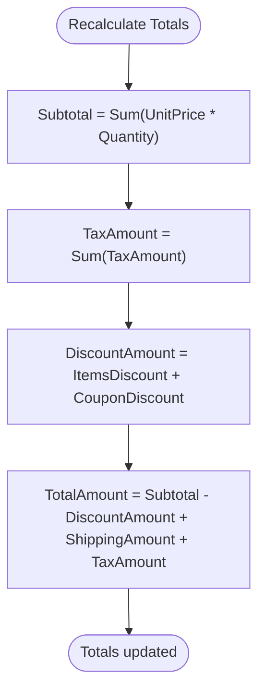
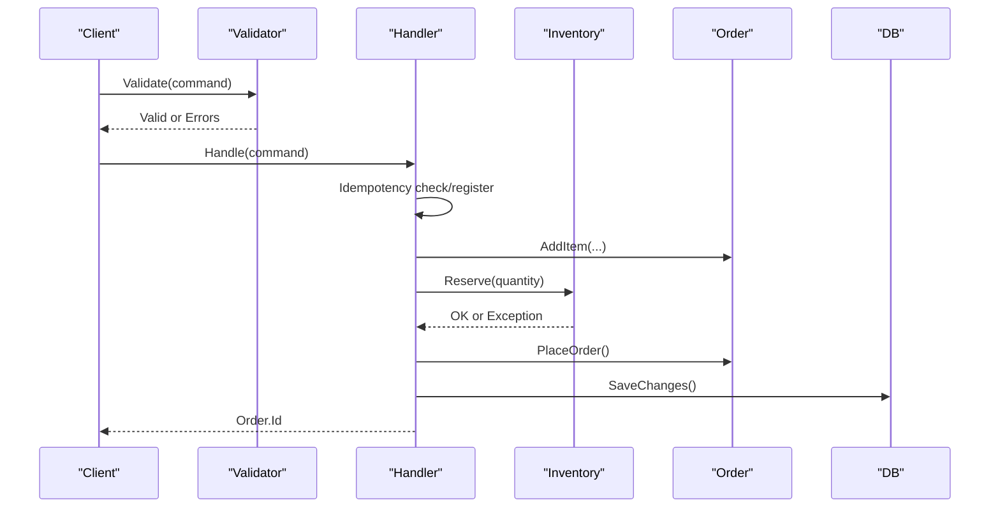
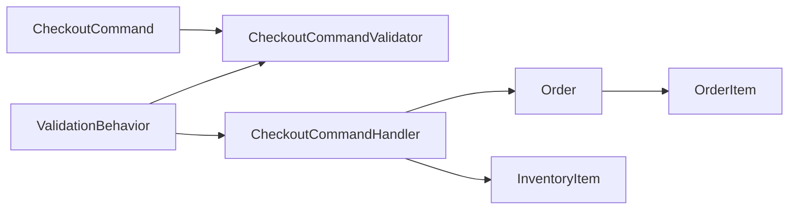

# Cart Entity

<cite>
**Referenced Files in This Document**
- [Cart.cs](file://src/Ecommerce.Domain/Entities/Cart.cs)
- [CartItem.cs](file://src/Ecommerce.Domain/Entities/CartItem.cs)
- [Order.cs](file://src/Ecommerce.Domain/Entities/Order.cs)
- [OrderItem.cs](file://src/Ecommerce.Domain/Entities/OrderItem.cs)
- [CheckoutCommand.cs](file://src/Ecommerce.Application/Commands/Checkout/CheckoutCommand.cs)
- [CheckoutCommandHandler.cs](file://src/Ecommerce.Application/Commands/Checkout/CheckoutCommandHandler.cs)
- [CheckoutCommandValidator.cs](file://src/Ecommerce.Application/Commands/Checkout/CheckoutCommandValidator.cs)
- [ValidationBehavior.cs](file://src/Ecommerce.Application/Common/Commands/ValidationBehavior.cs)
- [InventoryItem.cs](file://src/Ecommerce.Domain/Entities/InventoryItem.cs)
- [entities_and_constraints.md](file://docs/architecture/entities_and_constraints.md)
</cite>

## Table of Contents
1. [Introduction](#introduction)
2. [Project Structure](#project-structure)
3. [Core Components](#core-components)
4. [Architecture Overview](#architecture-overview)
5. [Detailed Component Analysis](#detailed-component-analysis)
6. [Dependency Analysis](#dependency-analysis)
7. [Performance Considerations](#performance-considerations)
8. [Troubleshooting Guide](#troubleshooting-guide)
9. [Conclusion](#conclusion)

## Introduction
This document provides comprehensive documentation for the Cart entity and its role in shopping cart functionality. It explains the cart structure, the items collection, session management fields, validation rules, item quantity management, price calculations, and how carts integrate with the checkout process to create orders. It also covers persistence considerations, expiration handling, and conversion to orders during checkout.

## Project Structure
The cart domain is defined in the Domain layer as entities, while the application layer orchestrates checkout operations that ultimately convert cart-like inputs into orders. The architecture separates concerns:
- Domain: Entities (Cart, CartItem, Order, OrderItem), value objects, exceptions
- Application: Commands, handlers, validators, behaviors
- Infrastructure: Persistence and services (not detailed here)



**Diagram sources**
- [Cart.cs:6-18](file://src/Ecommerce.Domain/Entities/Cart.cs#L6-L18)
- [CartItem.cs:5-15](file://src/Ecommerce.Domain/Entities/CartItem.cs#L5-L15)
- [Order.cs:8-34](file://src/Ecommerce.Domain/Entities/Order.cs#L8-L34)
- [OrderItem.cs:5-20](file://src/Ecommerce.Domain/Entities/OrderItem.cs#L5-L20)
- [CheckoutCommand.cs:6-21](file://src/Ecommerce.Application/Commands/Checkout/CheckoutCommand.cs#L6-L21)
- [CheckoutCommandHandler.cs:11-94](file://src/Ecommerce.Application/Commands/Checkout/CheckoutCommandHandler.cs#L11-L94)
- [CheckoutCommandValidator.cs:6-32](file://src/Ecommerce.Application/Commands/Checkout/CheckoutCommandValidator.cs#L6-L32)
- [ValidationBehavior.cs:8-40](file://src/Ecommerce.Application/Common/Commands/ValidationBehavior.cs#L8-L40)
- [InventoryItem.cs:6-38](file://src/Ecommerce.Domain/Entities/InventoryItem.cs#L6-L38)

**Section sources**
- [Cart.cs:6-18](file://src/Ecommerce.Domain/Entities/Cart.cs#L6-L18)
- [CartItem.cs:5-15](file://src/Ecommerce.Domain/Entities/CartItem.cs#L5-L15)
- [Order.cs:8-34](file://src/Ecommerce.Domain/Entities/Order.cs#L8-L34)
- [OrderItem.cs:5-20](file://src/Ecommerce.Domain/Entities/OrderItem.cs#L5-L20)
- [CheckoutCommand.cs:6-21](file://src/Ecommerce.Application/Commands/Checkout/CheckoutCommand.cs#L6-L21)
- [CheckoutCommandHandler.cs:11-94](file://src/Ecommerce.Application/Commands/Checkout/CheckoutCommandHandler.cs#L11-L94)
- [CheckoutCommandValidator.cs:6-32](file://src/Ecommerce.Application/Commands/Checkout/CheckoutCommandValidator.cs#L6-L32)
- [ValidationBehavior.cs:8-40](file://src/Ecommerce.Application/Common/Commands/ValidationBehavior.cs#L8-L40)
- [InventoryItem.cs:6-38](file://src/Ecommerce.Domain/Entities/InventoryItem.cs#L6-L38)

## Core Components
- Cart: Represents a user’s or session’s shopping cart with identity, currency, status, timestamps, and an optional expiration time. Holds a collection of CartItem entries.
- CartItem: Represents a single line item in the cart, linking to a product and variant, capturing quantity and unit price at the time it was added.
- Order and OrderItem: Represent the finalized purchase after checkout, including totals and snapshots of item details.
- Checkout flow: Application command and handler orchestrate validation, inventory reservation, order creation, and idempotency.

Key responsibilities:
- Cart and CartItem define the data model for temporary shopping selections.
- Order and OrderItem enforce business rules for order integrity and totals.
- CheckoutCommandHandler converts validated checkout input into an Order and reserves inventory.

**Section sources**
- [Cart.cs:6-18](file://src/Ecommerce.Domain/Entities/Cart.cs#L6-L18)
- [CartItem.cs:5-15](file://src/Ecommerce.Domain/Entities/CartItem.cs#L5-L15)
- [Order.cs:8-105](file://src/Ecommerce.Domain/Entities/Order.cs#L8-L105)
- [OrderItem.cs:5-20](file://src/Ecommerce.Domain/Entities/OrderItem.cs#L5-L20)
- [CheckoutCommandHandler.cs:22-94](file://src/Ecommerce.Application/Commands/Checkout/CheckoutCommandHandler.cs#L22-L94)

## Architecture Overview
The checkout process validates input, ensures idempotency, builds an order, reserves inventory, persists the order, and returns the order identifier. While the current handler accepts explicit checkout items, the Cart entity remains available for scenarios where carts are persisted and later converted to orders.



**Diagram sources**
- [CheckoutCommandHandler.cs:22-94](file://src/Ecommerce.Application/Commands/Checkout/CheckoutCommandHandler.cs#L22-L94)
- [CheckoutCommandValidator.cs:6-32](file://src/Ecommerce.Application/Commands/Checkout/CheckoutCommandValidator.cs#L6-L32)
- [ValidationBehavior.cs:8-40](file://src/Ecommerce.Application/Common/Commands/ValidationBehavior.cs#L8-L40)
- [InventoryItem.cs:29-38](file://src/Ecommerce.Domain/Entities/InventoryItem.cs#L29-L38)
- [Order.cs:89-102](file://src/Ecommerce.Domain/Entities/Order.cs#L89-L102)

## Detailed Component Analysis

### Cart Entity
- Identity and linkage:
  - Unique identifier and optional user association enable per-user carts.
  - SessionId supports anonymous or session-scoped carts.
- Currency and lifecycle:
  - CurrencyCode defines pricing context.
  - Status tracks cart state; CreatedAt/UpdatedAt track changes.
  - ExpiresAt enables expiration policies for inactive carts.
- Items:
  - One-to-many relationship with CartItem via Items collection.

Operational notes:
- Use UserId or SessionId to locate the correct cart.
- Enforce expiration by checking ExpiresAt before allowing modifications or checkout.
- Maintain consistent CurrencyCode across all items.

**Section sources**
- [Cart.cs:6-18](file://src/Ecommerce.Domain/Entities/Cart.cs#L6-L18)
- [entities_and_constraints.md:197-210](file://docs/architecture/entities_and_constraints.md#L197-L210)

### CartItem Entity
- Links to a specific product and variant to ensure accurate fulfillment.
- Captures Quantity and UnitPrice at the time of addition to preserve pricing history.
- Timestamps track when items were added or updated.

Business rules:
- Quantity must be positive.
- UnitPrice should reflect the price snapshot at add/update time.

**Section sources**
- [CartItem.cs:5-15](file://src/Ecommerce.Domain/Entities/CartItem.cs#L5-L15)
- [entities_and_constraints.md:197-210](file://docs/architecture/entities_and_constraints.md#L197-L210)

### Relationship Between Cart and CartItem
- A Cart contains multiple CartItems.
- Deleting a cart cascades to its items per design constraints.

```mermaid
erDiagram
CART {
guid Id PK
guid? UserId
string SessionId
string CurrencyCode
string Status
datetimeoffset CreatedAt
datetimeoffset UpdatedAt
datetimeoffset? ExpiresAt
}
CART_ITEM {
guid Id PK
guid CartId FK
guid ProductId
guid ProductVariantId
int Quantity
decimal UnitPrice
datetimeoffset CreatedAt
datetimeoffset UpdatedAt
}
CART ||--o{ CART_ITEM : "contains"
```

**Diagram sources**
- [Cart.cs:6-18](file://src/Ecommerce.Domain/Entities/Cart.cs#L6-L18)
- [CartItem.cs:5-15](file://src/Ecommerce.Domain/Entities/CartItem.cs#L5-L15)
- [entities_and_constraints.md:197-210](file://docs/architecture/entities_and_constraints.md#L197-L210)

### Validation Rules and Business Logic
- Checkout command validation:
  - Ensures at least one item exists.
  - Validates quantities are greater than zero.
- Behavior pipeline:
  - ValidationBehavior runs registered validators before handling commands and aggregates errors into a domain exception if any exist.



**Diagram sources**
- [CheckoutCommandValidator.cs:6-32](file://src/Ecommerce.Application/Commands/Checkout/CheckoutCommandValidator.cs#L6-L32)
- [ValidationBehavior.cs:8-40](file://src/Ecommerce.Application/Common/Commands/ValidationBehavior.cs#L8-L40)

**Section sources**
- [CheckoutCommandValidator.cs:6-32](file://src/Ecommerce.Application/Commands/Checkout/CheckoutCommandValidator.cs#L6-L32)
- [ValidationBehavior.cs:8-40](file://src/Ecommerce.Application/Common/Commands/ValidationBehavior.cs#L8-L40)

### Item Quantity Management
- CartItem.Quantity stores the requested quantity for a product variant.
- During checkout, the handler reserves inventory for the specified quantity using InventoryItem.Reserve, which enforces availability and backorder policy.

Rules enforced:
- Positive quantities only.
- Insufficient stock raises an inventory exception unless backorders are allowed.

**Section sources**
- [CartItem.cs:5-15](file://src/Ecommerce.Domain/Entities/CartItem.cs#L5-L15)
- [CheckoutCommandHandler.cs:56-75](file://src/Ecommerce.Application/Commands/Checkout/CheckoutCommandHandler.cs#L56-L75)
- [InventoryItem.cs:29-38](file://src/Ecommerce.Domain/Entities/InventoryItem.cs#L29-L38)

### Price Calculations
- CartItem.UnitPrice captures the price snapshot at add/update time.
- Order-level totals are calculated consistently:
  - Subtotal sums unit price times quantity across items.
  - TaxAmount sums tax amounts per item.
  - DiscountAmount includes both item-level discounts and coupon discounts.
  - TotalAmount = Subtotal - DiscountAmount + ShippingAmount + TaxAmount.



**Diagram sources**
- [Order.cs:79-87](file://src/Ecommerce.Domain/Entities/Order.cs#L79-L87)

**Section sources**
- [Order.cs:36-87](file://src/Ecommerce.Domain/Entities/Order.cs#L36-L87)

### Integration with Checkout Process
- The checkout command carries items, currency, shipping address, and optional idempotency key.
- The handler:
  - Checks idempotency to prevent duplicate orders.
  - Validates items and quantities.
  - Builds an Order and adds items.
  - Reserves inventory for each item.
  - Places the order and persists it.
  - Saves idempotency response if provided.



**Diagram sources**
- [CheckoutCommand.cs:6-21](file://src/Ecommerce.Application/Commands/Checkout/CheckoutCommand.cs#L6-L21)
- [CheckoutCommandHandler.cs:22-94](file://src/Ecommerce.Application/Commands/Checkout/CheckoutCommandHandler.cs#L22-L94)
- [Order.cs:36-102](file://src/Ecommerce.Domain/Entities/Order.cs#L36-L102)
- [InventoryItem.cs:29-38](file://src/Ecommerce.Domain/Entities/InventoryItem.cs#L29-L38)

**Section sources**
- [CheckoutCommand.cs:6-21](file://src/Ecommerce.Application/Commands/Checkout/CheckoutCommand.cs#L6-L21)
- [CheckoutCommandHandler.cs:22-94](file://src/Ecommerce.Application/Commands/Checkout/CheckoutCommandHandler.cs#L22-L94)
- [Order.cs:36-102](file://src/Ecommerce.Domain/Entities/Order.cs#L36-L102)

### Examples of Cart Operations
While the current checkout path uses explicit command items, typical cart operations include:
- Adding items:
  - Create or retrieve a Cart by UserId or SessionId.
  - Add or update a CartItem with ProductId, ProductVariantId, Quantity, and UnitPrice.
  - Ensure CurrencyCode matches the cart’s currency.
- Updating quantities:
  - Locate the CartItem by ProductVariantId.
  - Update Quantity and optionally refresh UnitPrice.
  - Validate positive quantity.
- Removing items:
  - Remove the CartItem from the Items collection.
  - Persist changes.

These operations align with the Cart and CartItem structures and can be implemented in application services that interact with persistence.

[No sources needed since this section describes conceptual operations aligned with existing entities]

### Persistence, Expiration Handling, and Conversion to Orders
- Persistence:
  - Cart and CartItem are domain entities designed for persistence; indexes on UserId and SessionId are recommended for efficient lookup.
- Expiration:
  - ExpiresAt allows marking carts as expired; business logic should reject modifications or checkout for expired carts.
- Conversion to orders:
  - In the current implementation, checkout consumes a command with items directly.
  - To convert a persisted Cart to an Order:
    - Validate the Cart is not expired and has items.
    - Build an Order, mapping CartItem to OrderItem with snapshots (product name, variant name, SKU, image URL).
    - Reserve inventory per item.
    - Place the order and persist.

**Section sources**
- [entities_and_constraints.md:197-210](file://docs/architecture/entities_and_constraints.md#L197-L210)
- [CheckoutCommandHandler.cs:22-94](file://src/Ecommerce.Application/Commands/Checkout/CheckoutCommandHandler.cs#L22-L94)
- [Order.cs:36-102](file://src/Ecommerce.Domain/Entities/Order.cs#L36-L102)

## Dependency Analysis
- Cart depends on CartItem for line items.
- CheckoutCommandHandler depends on:
  - IApplicationDbContext for persistence and inventory queries.
  - IIdempotencyService for idempotent checkout.
  - Order and InventoryItem domain logic for order creation and stock reservation.
- ValidationBehavior composes validators to enforce preconditions before handling commands.



**Diagram sources**
- [CheckoutCommand.cs:6-21](file://src/Ecommerce.Application/Commands/Checkout/CheckoutCommand.cs#L6-L21)
- [CheckoutCommandValidator.cs:6-32](file://src/Ecommerce.Application/Commands/Checkout/CheckoutCommandValidator.cs#L6-L32)
- [ValidationBehavior.cs:8-40](file://src/Ecommerce.Application/Common/Commands/ValidationBehavior.cs#L8-L40)
- [CheckoutCommandHandler.cs:11-94](file://src/Ecommerce.Application/Commands/Checkout/CheckoutCommandHandler.cs#L11-L94)
- [Order.cs:8-34](file://src/Ecommerce.Domain/Entities/Order.cs#L8-L34)
- [OrderItem.cs:5-20](file://src/Ecommerce.Domain/Entities/OrderItem.cs#L5-L20)
- [InventoryItem.cs:6-38](file://src/Ecommerce.Domain/Entities/InventoryItem.cs#L6-L38)

**Section sources**
- [CheckoutCommandHandler.cs:11-94](file://src/Ecommerce.Application/Commands/Checkout/CheckoutCommandHandler.cs#L11-L94)
- [ValidationBehavior.cs:8-40](file://src/Ecommerce.Application/Common/Commands/ValidationBehavior.cs#L8-L40)
- [CheckoutCommandValidator.cs:6-32](file://src/Ecommerce.Application/Commands/Checkout/CheckoutCommandValidator.cs#L6-L32)

## Performance Considerations
- Indexing:
  - Use indexes on UserId and SessionId for fast cart retrieval.
- Batch operations:
  - When updating multiple CartItems, batch updates to reduce database round-trips.
- Idempotency:
  - Leverage idempotency keys in checkout to avoid duplicate processing under retries.
- Inventory reservation:
  - Reserve stock within a transaction boundary to prevent overselling.

[No sources needed since this section provides general guidance]

## Troubleshooting Guide
Common issues and resolutions:
- Empty cart at checkout:
  - Validation fails if no items are present. Ensure at least one item is included in the command or cart.
- Invalid quantity:
  - Quantities must be greater than zero. Correct negative or zero values before checkout.
- Insufficient inventory:
  - Reservation fails if stock is unavailable and backorders are not allowed. Adjust quantities or allow backorders.
- Duplicate checkout attempts:
  - Use idempotency keys to ensure repeated requests return the same order identifier.

**Section sources**
- [CheckoutCommandValidator.cs:6-32](file://src/Ecommerce.Application/Commands/Checkout/CheckoutCommandValidator.cs#L6-L32)
- [CheckoutCommandHandler.cs:22-94](file://src/Ecommerce.Application/Commands/Checkout/CheckoutCommandHandler.cs#L22-L94)
- [InventoryItem.cs:29-38](file://src/Ecommerce.Domain/Entities/InventoryItem.cs#L29-L38)

## Conclusion
The Cart and CartItem entities provide a robust foundation for managing shopping carts with support for user or session scoping, currency context, and expiration. While the current checkout flow operates on explicit command items, the domain model supports converting persisted carts to orders with proper validation, inventory reservation, and idempotency. Adhering to the outlined validation rules, quantity management, and price calculation logic ensures consistency and reliability throughout the checkout process.