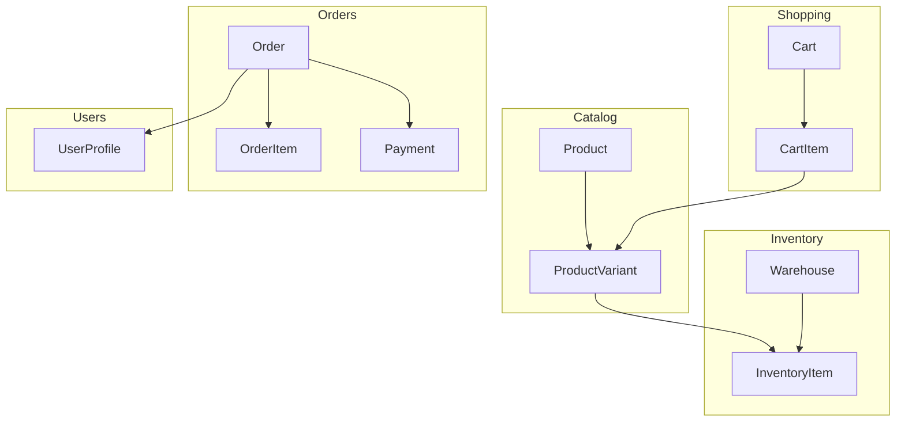
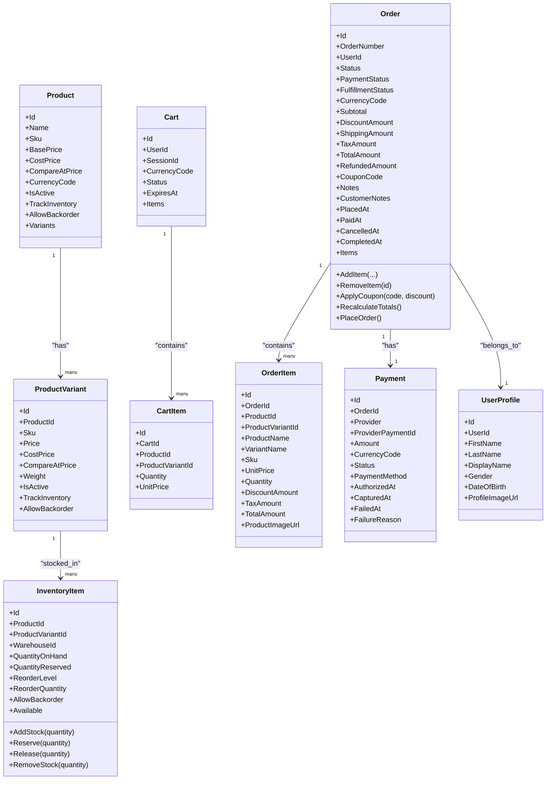
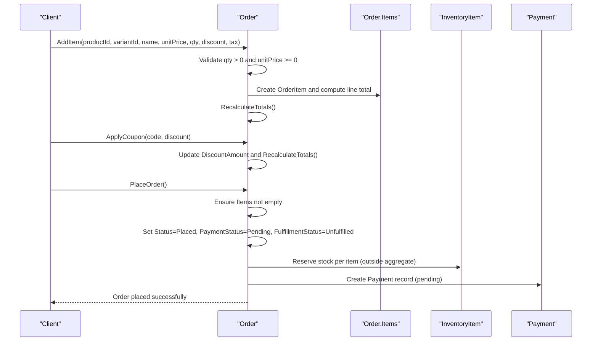
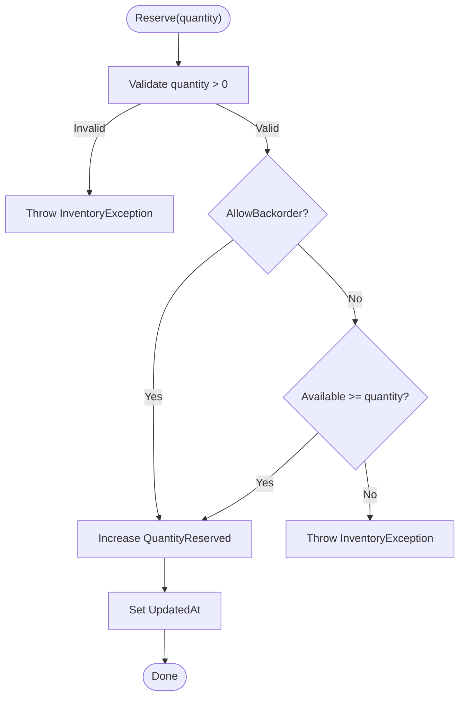
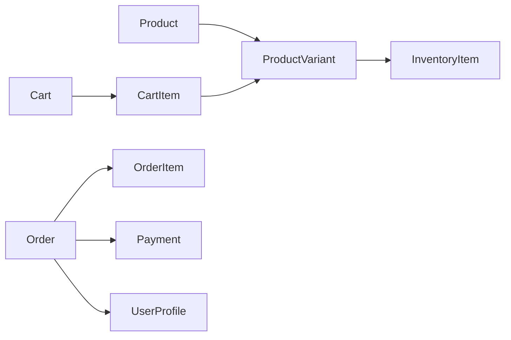

# Core Entities

<cite>
**Referenced Files in This Document**
- [Product.cs](file://src/Ecommerce.Domain/Entities/Product.cs)
- [ProductVariant.cs](file://src/Ecommerce.Domain/Entities/ProductVariant.cs)
- [Order.cs](file://src/Ecommerce.Domain/Entities/Order.cs)
- [OrderItem.cs](file://src/Ecommerce.Domain/Entities/OrderItem.cs)
- [InventoryItem.cs](file://src/Ecommerce.Domain/Entities/InventoryItem.cs)
- [UserProfile.cs](file://src/Ecommerce.Domain/Entities/UserProfile.cs)
- [Cart.cs](file://src/Ecommerce.Domain/Entities/Cart.cs)
- [CartItem.cs](file://src/Ecommerce.Domain/Entities/CartItem.cs)
- [Payment.cs](file://src/Ecommerce.Domain/Entities/Payment.cs)
- [Money.cs](file://src/Ecommerce.Domain/ValueObjects/Money.cs)
- [DomainException.cs](file://src/Ecommerce.Domain/Exceptions/DomainException.cs)
- [InventoryException.cs](file://src/Ecommerce.Domain/Exceptions/InventoryException.cs)
- [erd.md](file://docs/architecture/erd.md)
- [entities_and_constraints.md](file://docs/architecture/entities_and_constraints.md)
</cite>

## Table of Contents
1. Introduction
2. Project Structure
3. Core Components
4. Architecture Overview
5. Detailed Component Analysis
6. Dependency Analysis
7. Performance Considerations
8. Troubleshooting Guide
9. Conclusion

## Introduction
This document describes the core domain entities that form the business model of the E-Commerce system: Product and its variants, Order and its lifecycle, InventoryItem for stock management, UserProfile for user data, Cart for shopping cart functionality, and related value objects and exceptions. It explains entity relationships, validation rules, business invariants, and how these components interact to maintain consistency across catalog, inventory, orders, and payments.

## Project Structure
The core domain is implemented as a set of entities and value objects within the Domain layer. Supporting documentation defines constraints, indexes, and concurrency strategies. The high-level ERD outlines primary relationships among entities such as Product, ProductVariant, InventoryItem, Cart, CartItem, Order, OrderItem, Payment, and UserProfile.

**Diagram sources**
- [erd.md:1-98](file://docs/architecture/erd.md#L1-L98)

**Section sources**
- [erd.md:1-98](file://docs/architecture/erd.md#L1-L98)
- [entities_and_constraints.md:83-123](file://docs/architecture/entities_and_constraints.md#L83-L123)
- [entities_and_constraints.md:168-189](file://docs/architecture/entities_and_constraints.md#L168-L189)
- [entities_and_constraints.md:199-210](file://docs/architecture/entities_and_constraints.md#L199-L210)
- [entities_and_constraints.md:219-241](file://docs/architecture/entities_and_constraints.md#L219-L241)
- [entities_and_constraints.md:259-264](file://docs/architecture/entities_and_constraints.md#L259-L264)

## Core Components
- Product and ProductVariant define the catalog with pricing, dimensions, and flags controlling shipping and inventory behavior.
- Order encapsulates order lifecycle, item snapshots, totals, and coupon application.
- InventoryItem manages stock on hand, reservations, backorder policy, and available quantity.
- UserProfile stores user profile details linked to an identity user.
- Cart and CartItem represent a shopping session or user’s cart with line items referencing product variants.
- Payment records provider interactions and statuses tied to an Order.
- Money value object enforces non-negative amounts and currency codes.

Key behaviors and invariants are enforced by entity methods and domain exceptions.

**Section sources**
- [Product.cs:6-42](file://src/Ecommerce.Domain/Entities/Product.cs#L6-L42)
- [ProductVariant.cs:5-26](file://src/Ecommerce.Domain/Entities/ProductVariant.cs#L5-L26)
- [Order.cs:8-103](file://src/Ecommerce.Domain/Entities/Order.cs#L8-L103)
- [OrderItem.cs:5-21](file://src/Ecommerce.Domain/Entities/OrderItem.cs#L5-L21)
- [InventoryItem.cs:6-68](file://src/Ecommerce.Domain/Entities/InventoryItem.cs#L6-L68)
- [UserProfile.cs:5-17](file://src/Ecommerce.Domain/Entities/UserProfile.cs#L5-L17)
- [Cart.cs:6-18](file://src/Ecommerce.Domain/Entities/Cart.cs#L6-L18)
- [CartItem.cs:5-16](file://src/Ecommerce.Domain/Entities/CartItem.cs#L5-L16)
- [Payment.cs:5-22](file://src/Ecommerce.Domain/Entities/Payment.cs#L5-L22)
- [Money.cs:5-18](file://src/Ecommerce.Domain/ValueObjects/Money.cs#L5-L18)

## Architecture Overview
The domain follows aggregate boundaries:
- Catalog aggregate: Product owns ProductVariant; both carry pricing and inventory-related flags.
- Inventory aggregate: InventoryItem tracks stock and reservations per warehouse and variant.
- Shopping aggregate: Cart aggregates CartItems; items reference ProductVariant for price and availability context.
- Order aggregate: Order aggregates OrderItems and maintains totals, status, and timestamps; it coordinates payment via Payment entity.

Concurrency control uses RowVersion on key entities to prevent lost updates. Business rules are enforced inside entity methods, throwing domain-specific exceptions when invariants are violated.

**Diagram sources**
- [Product.cs:6-42](file://src/Ecommerce.Domain/Entities/Product.cs#L6-L42)
- [ProductVariant.cs:5-26](file://src/Ecommerce.Domain/Entities/ProductVariant.cs#L5-L26)
- [InventoryItem.cs:6-68](file://src/Ecommerce.Domain/Entities/InventoryItem.cs#L6-L68)
- [Cart.cs:6-18](file://src/Ecommerce.Domain/Entities/Cart.cs#L6-L18)
- [CartItem.cs:5-16](file://src/Ecommerce.Domain/Entities/CartItem.cs#L5-L16)
- [Order.cs:8-103](file://src/Ecommerce.Domain/Entities/Order.cs#L8-L103)
- [OrderItem.cs:5-21](file://src/Ecommerce.Domain/Entities/OrderItem.cs#L5-L21)
- [Payment.cs:5-22](file://src/Ecommerce.Domain/Entities/Payment.cs#L5-L22)
- [UserProfile.cs:5-17](file://src/Ecommerce.Domain/Entities/UserProfile.cs#L5-L17)

## Detailed Component Analysis

### Product and ProductVariant
- Purpose: Define sellable items and their specific options (size, color, etc.) with distinct pricing and physical attributes.
- Pricing structure:
  - BasePrice and CostPrice at Product level.
  - Variant-level Price, CostPrice, CompareAtPrice override or refine pricing for specific SKUs.
- Business rules:
  - TrackInventory and AllowBackorder flags influence inventory reservation and removal logic downstream.
  - IsActive controls visibility and purchasability.
- Relationships:
  - One-to-many with ProductVariant.
  - Variants link to InventoryItem per warehouse for stock control.
- Validation and invariants:
  - Non-negative monetary values are enforced by value objects and application validators; domain entities rely on consistent decimal fields.
  - Unique Sku per variant is recommended by design docs.

Examples of consistency:
- When adding an OrderItem, UnitPrice is captured as a snapshot to preserve historical accuracy even if variant price changes later.

**Section sources**
- [Product.cs:6-42](file://src/Ecommerce.Domain/Entities/Product.cs#L6-L42)
- [ProductVariant.cs:5-26](file://src/Ecommerce.Domain/Entities/ProductVariant.cs#L5-L26)
- [entities_and_constraints.md:83-123](file://docs/architecture/entities_and_constraints.md#L83-L123)
- [Order.cs:36-59](file://src/Ecommerce.Domain/Entities/Order.cs#L36-L59)

### Order and OrderItem
- Lifecycle states:
  - Status transitions through creation to Placed; PaymentStatus and FulfillmentStatus track downstream processes.
- Items collection:
  - AddItem validates positive quantity and non-negative unit price, creates OrderItem, computes total, recalculates order totals, and updates timestamps.
  - RemoveItem deletes an item and recalculates totals.
- Totals calculation:
  - Subtotal sums unit prices times quantities.
  - TaxAmount sums per-item taxes.
  - DiscountAmount includes both item-level discounts and coupon discounts.
  - TotalAmount = Subtotal - DiscountAmount + ShippingAmount + TaxAmount.
- PlaceOrder:
  - Ensures non-empty order, sets statuses, timestamps, and recalculates totals.
- Snapshotting:
  - OrderItem stores ProductName, VariantName, Sku, UnitPrice, and image URL to preserve purchase context.

Business invariants:
- Cannot place empty orders.
- Quantities must be positive; unit prices cannot be negative.

**Section sources**
- [Order.cs:8-103](file://src/Ecommerce.Domain/Entities/Order.cs#L8-L103)
- [OrderItem.cs:5-21](file://src/Ecommerce.Domain/Entities/OrderItem.cs#L5-L21)
- [entities_and_constraints.md:219-241](file://docs/architecture/entities_and_constraints.md#L219-L241)

#### Order Placement Sequence

**Diagram sources**
- [Order.cs:36-103](file://src/Ecommerce.Domain/Entities/Order.cs#L36-L103)
- [InventoryItem.cs:29-40](file://src/Ecommerce.Domain/Entities/InventoryItem.cs#L29-L40)
- [Payment.cs:5-22](file://src/Ecommerce.Domain/Entities/Payment.cs#L5-L22)

### InventoryItem
- Stock management:
  - QuantityOnHand reflects physical stock.
  - QuantityReserved tracks allocations for pending orders or carts.
  - Available computed as QuantityOnHand - QuantityReserved.
- Operations:
  - AddStock increases on-hand stock; requires positive quantity.
  - Reserve checks AllowBackorder and Available before increasing reserved quantity.
  - Release decreases reserved quantity; ensures not releasing more than reserved.
  - RemoveStock decreases on-hand stock; prevents negative stock unless backorders allowed.
- Concurrency:
  - Uses RowVersion for optimistic concurrency to avoid oversell.

Business invariants:
- Positive quantities for all mutations.
- Respect AllowBackorder flag during reserve/remove operations.

**Section sources**
- [InventoryItem.cs:6-68](file://src/Ecommerce.Domain/Entities/InventoryItem.cs#L6-L68)
- [entities_and_constraints.md:168-189](file://docs/architecture/entities_and_constraints.md#L168-L189)

#### Inventory Reservation Flowchart

**Diagram sources**
- [InventoryItem.cs:29-40](file://src/Ecommerce.Domain/Entities/InventoryItem.cs#L29-L40)

### UserProfile
- Stores user profile details such as names, display name, gender, date of birth, and profile image URL.
- Linked to an identity user via UserId.
- Timestamps track creation and updates.

Usage:
- Provides human-readable user information associated with Orders and other user-centric features.

**Section sources**
- [UserProfile.cs:5-17](file://src/Ecommerce.Domain/Entities/UserProfile.cs#L5-L17)
- [entities_and_constraints.md:46-52](file://docs/architecture/entities_and_constraints.md#L46-L52)

### Cart and CartItem
- Cart represents a shopping session or user-owned cart with optional expiration and currency.
- CartItem references Product and ProductVariant, storing quantity and unit price snapshot at time of addition.
- Relationship:
  - One-to-many from Cart to CartItem.
  - Items point to ProductVariant for pricing and inventory context.

Consistency:
- UnitPrice in CartItem should reflect the variant price at selection time to ensure accurate checkout totals.

**Section sources**
- [Cart.cs:6-18](file://src/Ecommerce.Domain/Entities/Cart.cs#L6-L18)
- [CartItem.cs:5-16](file://src/Ecommerce.Domain/Entities/CartItem.cs#L5-L16)
- [entities_and_constraints.md:199-210](file://docs/architecture/entities_and_constraints.md#L199-L210)

### Payment
- Records provider details, amount, currency, method, and lifecycle timestamps (authorized, captured, failed).
- Tied to an Order; used to integrate with external payment services.
- Status indicates current state of the payment process.

Integration points:
- Application commands and handlers coordinate creating Payment records and updating statuses based on provider responses.

**Section sources**
- [Payment.cs:5-22](file://src/Ecommerce.Domain/Entities/Payment.cs#L5-L22)
- [entities_and_constraints.md:259-264](file://docs/architecture/entities_and_constraints.md#L259-L264)

### Value Objects and Exceptions
- Money:
  - Encapsulates Amount and CurrencyCode with validation to prevent negative amounts and null currencies.
  - Useful for representing monetary values consistently across the domain.
- DomainException:
  - Base exception type for domain rule violations.
- InventoryException:
  - Specialized exception for inventory-related rule violations.

These support strong invariants and clear error signaling throughout the domain.

**Section sources**
- [Money.cs:5-18](file://src/Ecommerce.Domain/ValueObjects/Money.cs#L5-L18)
- [DomainException.cs:5-8](file://src/Ecommerce.Domain/Exceptions/DomainException.cs#L5-L8)
- [InventoryException.cs:5-8](file://src/Ecommerce.Domain/Exceptions/InventoryException.cs#L5-L8)

## Dependency Analysis
- Catalog depends on ProductVariant for SKU-specific pricing and inventory flags.
- InventoryItem depends on ProductVariant and Warehouse to manage stock per location.
- Cart depends on ProductVariant to capture pricing and availability context.
- Order depends on OrderItem for line details and on Payment for transactional state.
- UserProfile is referenced by Order to associate purchases with users.

**Diagram sources**
- [Product.cs:6-42](file://src/Ecommerce.Domain/Entities/Product.cs#L6-L42)
- [ProductVariant.cs:5-26](file://src/Ecommerce.Domain/Entities/ProductVariant.cs#L5-L26)
- [InventoryItem.cs:6-68](file://src/Ecommerce.Domain/Entities/InventoryItem.cs#L6-L68)
- [Cart.cs:6-18](file://src/Ecommerce.Domain/Entities/Cart.cs#L6-L18)
- [CartItem.cs:5-16](file://src/Ecommerce.Domain/Entities/CartItem.cs#L5-L16)
- [Order.cs:8-103](file://src/Ecommerce.Domain/Entities/Order.cs#L8-L103)
- [OrderItem.cs:5-21](file://src/Ecommerce.Domain/Entities/OrderItem.cs#L5-L21)
- [Payment.cs:5-22](file://src/Ecommerce.Domain/Entities/Payment.cs#L5-L22)
- [UserProfile.cs:5-17](file://src/Ecommerce.Domain/Entities/UserProfile.cs#L5-L17)

**Section sources**
- [erd.md:1-98](file://docs/architecture/erd.md#L1-L98)
- [entities_and_constraints.md:83-123](file://docs/architecture/entities_and_constraints.md#L83-L123)
- [entities_and_constraints.md:168-189](file://docs/architecture/entities_and_constraints.md#L168-L189)
- [entities_and_constraints.md:199-210](file://docs/architecture/entities_and_constraints.md#L199-L210)
- [entities_and_constraints.md:219-241](file://docs/architecture/entities_and_constraints.md#L219-L241)
- [entities_and_constraints.md:259-264](file://docs/architecture/entities_and_constraints.md#L259-L264)

## Performance Considerations
- Use RowVersion on Product, ProductVariant, InventoryItem, and Order to enforce optimistic concurrency and prevent race conditions during concurrent updates.
- Keep OrderItem snapshots small but sufficient to avoid frequent joins and preserve historical accuracy.
- Indexes recommended by design docs include unique keys for Sku, OrderNumber, and ProviderPaymentId, plus common query filters like Status and IsActive.
- Avoid unnecessary recomputation; recalculate totals only when items or coupons change.

[No sources needed since this section provides general guidance]

## Troubleshooting Guide
Common domain errors and their causes:
- Invalid quantity or negative unit price when adding order items:
  - Cause: Violation of Order.AddItem validations.
  - Action: Ensure quantity > 0 and unitPrice >= 0.
- Attempting to place an empty order:
  - Cause: Order.PlaceOrder invariant check.
  - Action: Add at least one item before placing.
- Insufficient stock or over-reservation:
  - Cause: InventoryItem.Reserve or RemoveStock checks against Available or AllowBackorder.
  - Action: Adjust stock levels, enable backorders if appropriate, or reduce requested quantities.
- Releasing more than reserved:
  - Cause: InventoryItem.Release validation.
  - Action: Ensure release quantity does not exceed QuantityReserved.

Exceptions thrown:
- DomainException for general domain rule violations.
- InventoryException for inventory-specific violations.

**Section sources**
- [Order.cs:36-103](file://src/Ecommerce.Domain/Entities/Order.cs#L36-L103)
- [InventoryItem.cs:22-67](file://src/Ecommerce.Domain/Entities/InventoryItem.cs#L22-L67)
- [DomainException.cs:5-8](file://src/Ecommerce.Domain/Exceptions/DomainException.cs#L5-L8)
- [InventoryException.cs:5-8](file://src/Ecommerce.Domain/Exceptions/InventoryException.cs#L5-L8)

## Conclusion
The core domain entities provide a robust foundation for e-commerce operations:
- Product and ProductVariant model catalog and pricing with inventory controls.
- Order encapsulates lifecycle, item snapshots, totals, and integrates with Payment.
- InventoryItem enforces stock integrity with reservation and backorder policies.
- UserProfile associates user data with orders and other features.
- Cart and CartItem capture shopping intent with price snapshots.
- Money and exceptions enforce invariants and communicate failures clearly.

Together, these entities and their interactions maintain consistency, enforce business rules, and support scalable checkout and fulfillment workflows.