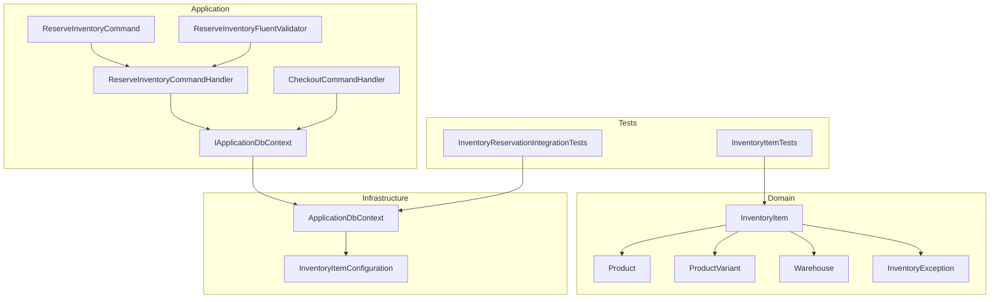
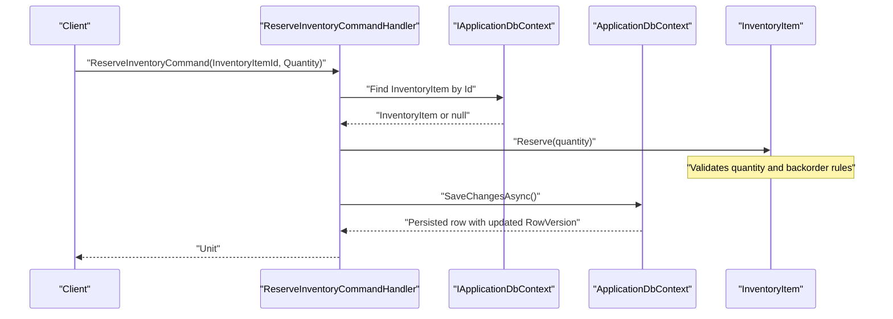
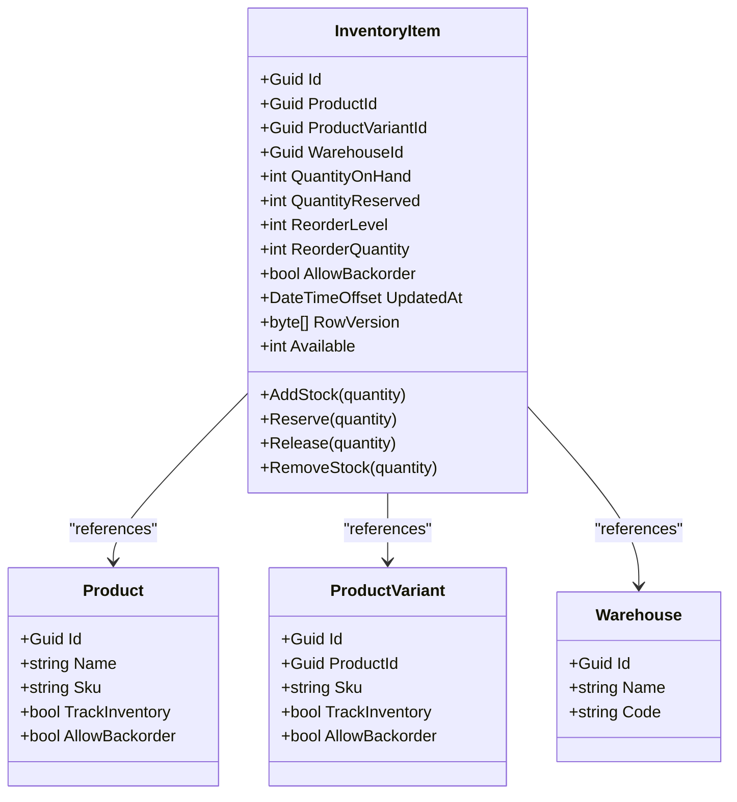
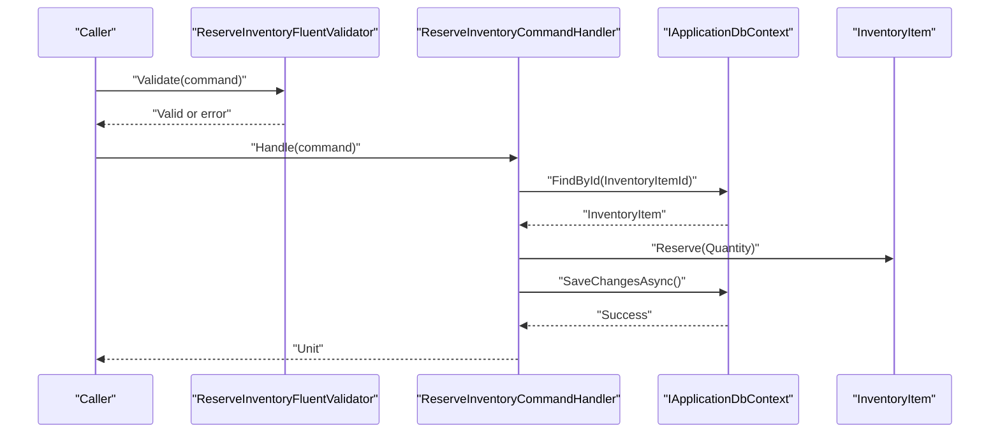
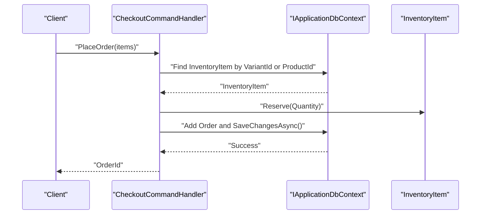
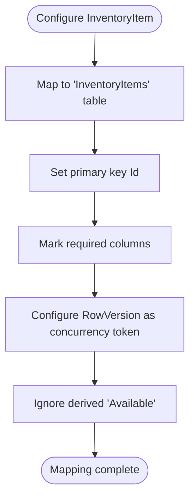
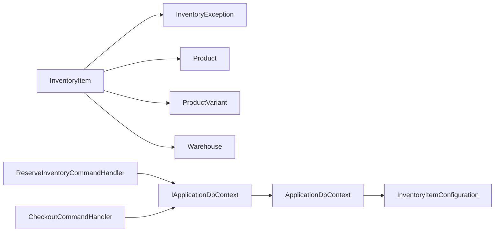

# Inventory Item Entity

<cite>
**Referenced Files in This Document**
- [InventoryItem.cs](file://src/Ecommerce.Domain/Entities/InventoryItem.cs)
- [Product.cs](file://src/Ecommerce.Domain/Entities/Product.cs)
- [ProductVariant.cs](file://src/Ecommerce.Domain/Entities/ProductVariant.cs)
- [Warehouse.cs](file://src/Ecommerce.Domain/Entities/Warehouse.cs)
- [ReserveInventoryCommand.cs](file://src/Ecommerce.Application/Commands/ReserveInventory/ReserveInventoryCommand.cs)
- [ReserveInventoryCommandHandler.cs](file://src/Ecommerce.Application/Commands/ReserveInventory/ReserveInventoryCommandHandler.cs)
- [ReserveInventoryFluentValidator.cs](file://src/Ecommerce.Application/Validators/ReserveInventoryFluentValidator.cs)
- [CheckoutCommandHandler.cs](file://src/Ecommerce.Application/Commands/Checkout/CheckoutCommandHandler.cs)
- [IApplicationDbContext.cs](file://src/Ecommerce.Application/Interfaces/IApplicationDbContext.cs)
- [ApplicationDbContext.cs](file://src/Ecommerce.Infrastructure/Persistence/ApplicationDbContext.cs)
- [InventoryItemConfiguration.cs](file://src/Ecommerce.Infrastructure/Persistence/Configurations/InventoryItemConfiguration.cs)
- [InventoryException.cs](file://src/Ecommerce.Domain/Exceptions/InventoryException.cs)
- [entities_and_constraints.md](file://docs/architecture/entities_and_constraints.md)
- [InventoryItemTests.cs](file://tests/Ecommerce.Domain.Tests/InventoryItemTests.cs)
- [InventoryReservationIntegrationTests.cs](file://tests/Ecommerce.IntegrationTests/InventoryReservationIntegrationTests.cs)
</cite>

## Table of Contents
1. Introduction
2. Project Structure
3. Core Components
4. Architecture Overview
5. Detailed Component Analysis
6. Dependency Analysis
7. Performance Considerations
8. Troubleshooting Guide
9. Conclusion

## Introduction
This document explains the InventoryItem entity and its role in managing stock levels, reservations, and backorder behavior across the order lifecycle. It covers inventory tracking properties, validation rules, low-stock considerations, concurrency handling via optimistic concurrency tokens, and integration points with Product and ProductVariant entities. It also provides examples of reservation, release, and adjustment operations, along with performance guidance for high-volume scenarios.

## Project Structure
The inventory feature spans Domain, Application, Infrastructure, and Tests:
- Domain defines InventoryItem and related entities (Product, ProductVariant, Warehouse), plus domain exceptions.
- Application implements commands to reserve inventory and orchestrates checkout flows that reserve stock.
- Infrastructure configures EF Core mapping for InventoryItem and exposes the DbContext with InventoryItems DbSet.
- Tests validate domain rules and integration behavior for reservation.

**Diagram sources**
- [InventoryItem.cs:1-69](file://src/Ecommerce.Domain/Entities/InventoryItem.cs#L1-L69)
- [Product.cs:1-44](file://src/Ecommerce.Domain/Entities/Product.cs#L1-L44)
- [ProductVariant.cs:1-28](file://src/Ecommerce.Domain/Entities/ProductVariant.cs#L1-L28)
- [Warehouse.cs:1-15](file://src/Ecommerce.Domain/Entities/Warehouse.cs#L1-L15)
- [ReserveInventoryCommand.cs:1-11](file://src/Ecommerce.Application/Commands/ReserveInventory/ReserveInventoryCommand.cs#L1-L11)
- [ReserveInventoryCommandHandler.cs:1-31](file://src/Ecommerce.Application/Commands/ReserveInventory/ReserveInventoryCommandHandler.cs#L1-L31)
- [ReserveInventoryFluentValidator.cs:1-14](file://src/Ecommerce.Application/Validators/ReserveInventoryFluentValidator.cs#L1-L14)
- [CheckoutCommandHandler.cs:1-94](file://src/Ecommerce.Application/Commands/Checkout/CheckoutCommandHandler.cs#L1-L94)
- [IApplicationDbContext.cs:1-15](file://src/Ecommerce.Application/Interfaces/IApplicationDbContext.cs#L1-L15)
- [ApplicationDbContext.cs:1-43](file://src/Ecommerce.Infrastructure/Persistence/ApplicationDbContext.cs#L1-L43)
- [InventoryItemConfiguration.cs:1-37](file://src/Ecommerce.Infrastructure/Persistence/Configurations/InventoryItemConfiguration.cs#L1-L37)
- [InventoryException.cs:1-10](file://src/Ecommerce.Domain/Exceptions/InventoryException.cs#L1-L10)
- [InventoryItemTests.cs:1-39](file://tests/Ecommerce.Domain.Tests/InventoryItemTests.cs#L1-L39)
- [InventoryReservationIntegrationTests.cs:1-52](file://tests/Ecommerce.IntegrationTests/InventoryReservationIntegrationTests.cs#L1-L52)

**Section sources**
- [InventoryItem.cs:1-69](file://src/Ecommerce.Domain/Entities/InventoryItem.cs#L1-L69)
- [ApplicationDbContext.cs:1-43](file://src/Ecommerce.Infrastructure/Persistence/ApplicationDbContext.cs#L1-L43)
- [InventoryItemConfiguration.cs:1-37](file://src/Ecommerce.Infrastructure/Persistence/Configurations/InventoryItemConfiguration.cs#L1-L37)

## Core Components
- InventoryItem: Encapsulates stock state and mutation methods for adding/removing stock and reserving/releasing quantities. Includes a computed Available property and an UpdatedAt timestamp.
- Product and ProductVariant: Provide catalog context; InventoryItem references both ProductId and ProductVariantId to scope stock by variant and warehouse.
- Warehouse: Represents physical location where stock is held; InventoryItem links to a specific warehouse.
- ReserveInventoryCommand and Handler: Validate and execute reservation against a specific InventoryItem.
- Checkout flow: Reserves inventory per item during order placement.
- EF Core configuration: Maps InventoryItem, enforces required fields, ignores derived Available, and enables RowVersion-based optimistic concurrency.

Key responsibilities:
- Maintain QuantityOnHand and QuantityReserved accurately.
- Enforce business rules for backorders and negative stock.
- Update UpdatedAt on mutations.
- Support optimistic concurrency via RowVersion.

**Section sources**
- [InventoryItem.cs:1-69](file://src/Ecommerce.Domain/Entities/InventoryItem.cs#L1-L69)
- [Product.cs:1-44](file://src/Ecommerce.Domain/Entities/Product.cs#L1-L44)
- [ProductVariant.cs:1-28](file://src/Ecommerce.Domain/Entities/ProductVariant.cs#L1-L28)
- [Warehouse.cs:1-15](file://src/Ecommerce.Domain/Entities/Warehouse.cs#L1-L15)
- [ReserveInventoryCommand.cs:1-11](file://src/Ecommerce.Application/Commands/ReserveInventory/ReserveInventoryCommand.cs#L1-L11)
- [ReserveInventoryCommandHandler.cs:1-31](file://src/Ecommerce.Application/Commands/ReserveInventory/ReserveInventoryCommandHandler.cs#L1-L31)
- [CheckoutCommandHandler.cs:1-94](file://src/Ecommerce.Application/Commands/Checkout/CheckoutCommandHandler.cs#L1-L94)
- [InventoryItemConfiguration.cs:1-37](file://src/Ecommerce.Infrastructure/Persistence/Configurations/InventoryItemConfiguration.cs#L1-L37)

## Architecture Overview
The inventory subsystem follows a layered architecture:
- Domain layer owns InventoryItem invariants and business rules.
- Application layer coordinates commands (reserve, checkout) and persists changes through IApplicationDbContext.
- Infrastructure layer maps InventoryItem to the database using EF Core configurations and provides ApplicationDbContext.

**Diagram sources**
- [ReserveInventoryCommandHandler.cs:1-31](file://src/Ecommerce.Application/Commands/ReserveInventory/ReserveInventoryCommandHandler.cs#L1-L31)
- [IApplicationDbContext.cs:1-15](file://src/Ecommerce.Application/Interfaces/IApplicationDbContext.cs#L1-L15)
- [ApplicationDbContext.cs:1-43](file://src/Ecommerce.Infrastructure/Persistence/ApplicationDbContext.cs#L1-L43)
- [InventoryItem.cs:1-69](file://src/Ecommerce.Domain/Entities/InventoryItem.cs#L1-L69)

## Detailed Component Analysis

### InventoryItem Entity
- Properties:
  - Identifiers: Id, ProductId, ProductVariantId, WarehouseId
  - Stock metrics: QuantityOnHand, QuantityReserved, Available (computed)
  - Replenishment: ReorderLevel, ReorderQuantity
  - Policy: AllowBackorder
  - Audit: UpdatedAt
  - Concurrency: RowVersion
- Methods:
  - AddStock(quantity): Validates positive quantity and increases QuantityOnHand; updates UpdatedAt.
  - Reserve(quantity): Validates positive quantity; if backorders are disallowed, ensures Available >= quantity; then increases QuantityReserved; updates UpdatedAt.
  - Release(quantity): Validates positive quantity; prevents releasing more than reserved; decreases QuantityReserved; updates UpdatedAt.
  - RemoveStock(quantity): Validates positive quantity; if backorders are disallowed, prevents going below zero; decreases QuantityOnHand; clamps to non-negative; updates UpdatedAt.

Validation and business rules:
- All mutating methods enforce positive quantity inputs.
- Backorder policy enforced at reservation and removal boundaries.
- Negative stock is prevented when backorders are disabled.

Concurrency:
- RowVersion is configured as a concurrency token in EF Core to detect concurrent modifications and prevent oversell.

**Diagram sources**
- [InventoryItem.cs:1-69](file://src/Ecommerce.Domain/Entities/InventoryItem.cs#L1-L69)
- [Product.cs:1-44](file://src/Ecommerce.Domain/Entities/Product.cs#L1-L44)
- [ProductVariant.cs:1-28](file://src/Ecommerce.Domain/Entities/ProductVariant.cs#L1-L28)
- [Warehouse.cs:1-15](file://src/Ecommerce.Domain/Entities/Warehouse.cs#L1-L15)

**Section sources**
- [InventoryItem.cs:1-69](file://src/Ecommerce.Domain/Entities/InventoryItem.cs#L1-L69)
- [InventoryItemConfiguration.cs:1-37](file://src/Ecommerce.Infrastructure/Persistence/Configurations/InventoryItemConfiguration.cs#L1-L37)

### Reservation Mechanism and Command Flow
- ReserveInventoryCommand carries InventoryItemId and Quantity.
- ReserveInventoryCommandHandler validates input, loads InventoryItem, invokes Reserve, and persists changes.
- Fluent validator enforces non-empty InventoryItemId and positive Quantity.

**Diagram sources**
- [ReserveInventoryCommand.cs:1-11](file://src/Ecommerce.Application/Commands/ReserveInventory/ReserveInventoryCommand.cs#L1-L11)
- [ReserveInventoryCommandHandler.cs:1-31](file://src/Ecommerce.Application/Commands/ReserveInventory/ReserveInventoryCommandHandler.cs#L1-L31)
- [ReserveInventoryFluentValidator.cs:1-14](file://src/Ecommerce.Application/Validators/ReserveInventoryFluentValidator.cs#L1-L14)
- [IApplicationDbContext.cs:1-15](file://src/Ecommerce.Application/Interfaces/IApplicationDbContext.cs#L1-L15)

**Section sources**
- [ReserveInventoryCommand.cs:1-11](file://src/Ecommerce.Application/Commands/ReserveInventory/ReserveInventoryCommand.cs#L1-L11)
- [ReserveInventoryCommandHandler.cs:1-31](file://src/Ecommerce.Application/Commands/ReserveInventory/ReserveInventoryCommandHandler.cs#L1-L31)
- [ReserveInventoryFluentValidator.cs:1-14](file://src/Ecommerce.Application/Validators/ReserveInventoryFluentValidator.cs#L1-L14)

### Checkout Integration and Order Lifecycle
During checkout:
- The handler builds an Order and iterates items.
- For each item, it locates InventoryItem by ProductVariantId or fallback to ProductId.
- It calls Reserve on InventoryItem before persisting the order.
- Idempotency support avoids duplicate orders and redundant reservations.

**Diagram sources**
- [CheckoutCommandHandler.cs:1-94](file://src/Ecommerce.Application/Commands/Checkout/CheckoutCommandHandler.cs#L1-L94)
- [IApplicationDbContext.cs:1-15](file://src/Ecommerce.Application/Interfaces/IApplicationDbContext.cs#L1-L15)

**Section sources**
- [CheckoutCommandHandler.cs:1-94](file://src/Ecommerce.Application/Commands/Checkout/CheckoutCommandHandler.cs#L1-L94)

### Data Model and Mapping
- InventoryItem table includes Id, ProductId, ProductVariantId, WarehouseId, QuantityOnHand, QuantityReserved, ReorderLevel, ReorderQuantity, AllowBackorder, UpdatedAt, and RowVersion.
- Required fields are enforced.
- Available is ignored in EF mapping since it is derived.
- RowVersion is configured as a concurrency token for optimistic concurrency.

**Diagram sources**
- [InventoryItemConfiguration.cs:1-37](file://src/Ecommerce.Infrastructure/Persistence/Configurations/InventoryItemConfiguration.cs#L1-L37)

**Section sources**
- [InventoryItemConfiguration.cs:1-37](file://src/Ecommerce.Infrastructure/Persistence/Configurations/InventoryItemConfiguration.cs#L1-L37)
- [ApplicationDbContext.cs:1-43](file://src/Ecommerce.Infrastructure/Persistence/ApplicationDbContext.cs#L1-L43)

### Validation Rules, Low Stock Alerts, and Backorder Handling
- Validation:
  - Positive quantity enforced for all mutations.
  - Reserve enforces Available >= requested unless AllowBackorder is true.
  - Release cannot exceed QuantityReserved.
  - RemoveStock prevents negative stock unless AllowBackorder allows it.
- Low stock alerts:
  - ReorderLevel and ReorderQuantity exist on InventoryItem to support replenishment workflows.
  - A typical approach is to check if Available <= ReorderLevel and trigger alerts or purchase orders.
- Backorder handling:
  - When AllowBackorder is false, Reserve and RemoveStock block actions that would result in negative effective stock.
  - When AllowBackorder is true, Reserve can proceed even if Available < quantity, enabling future fulfillment.

**Section sources**
- [InventoryItem.cs:1-69](file://src/Ecommerce.Domain/Entities/InventoryItem.cs#L1-L69)
- [entities_and_constraints.md:161-176](file://docs/architecture/entities_and_constraints.md#L161-L176)

### Examples of Operations
- Stock reservation:
  - Use ReserveInventoryCommand with a valid InventoryItemId and positive Quantity.
  - The handler finds the item, calls Reserve, and saves changes.
- Stock release:
  - Call Release on InventoryItem with a positive quantity not exceeding QuantityReserved.
- Stock adjustment:
  - AddStock to increase QuantityOnHand.
  - RemoveStock to decrease QuantityOnHand respecting backorder policy.

These operations are validated by domain rules and persisted via SaveChangesAsync.

**Section sources**
- [ReserveInventoryCommandHandler.cs:1-31](file://src/Ecommerce.Application/Commands/ReserveInventory/ReserveInventoryCommandHandler.cs#L1-L31)
- [InventoryItem.cs:1-69](file://src/Ecommerce.Domain/Entities/InventoryItem.cs#L1-L69)

### Relationship with Product Entities
- InventoryItem references ProductId and ProductVariantId to scope stock by product and variant.
- Product and ProductVariant expose TrackInventory and AllowBackorder flags that influence inventory behavior at higher layers.
- In checkout, the system attempts to find InventoryItem by ProductVariantId first, falling back to ProductId.

**Section sources**
- [Product.cs:1-44](file://src/Ecommerce.Domain/Entities/Product.cs#L1-L44)
- [ProductVariant.cs:1-28](file://src/Ecommerce.Domain/Entities/ProductVariant.cs#L1-L28)
- [CheckoutCommandHandler.cs:1-94](file://src/Ecommerce.Application/Commands/Checkout/CheckoutCommandHandler.cs#L1-L94)

### Concurrency Handling and Synchronization
- Optimistic concurrency:
  - RowVersion is used as a concurrency token on InventoryItem.
  - Concurrent updates will fail on SaveChangesAsync if the RowVersion has changed, preventing oversell.
- Transactional boundaries:
  - Ensure inventory mutations and order creation occur within a single transaction to maintain consistency.
- Idempotency:
  - Checkout supports idempotency keys to avoid duplicate reservations and orders.

**Section sources**
- [InventoryItemConfiguration.cs:1-37](file://src/Ecommerce.Infrastructure/Persistence/Configurations/InventoryItemConfiguration.cs#L1-L37)
- [entities_and_constraints.md:450-458](file://docs/architecture/entities_and_constraints.md#L450-L458)
- [CheckoutCommandHandler.cs:1-94](file://src/Ecommerce.Application/Commands/Checkout/CheckoutCommandHandler.cs#L1-L94)

### Testing and Verification
- Unit tests verify:
  - Reserve reduces Available and increases QuantityReserved.
  - Insufficient stock throws InventoryException when backorders are disabled.
  - Release beyond reserved quantity throws InventoryException.
- Integration tests verify persistence of reservation changes and computed Available after SaveChangesAsync.

**Section sources**
- [InventoryItemTests.cs:1-39](file://tests/Ecommerce.Domain.Tests/InventoryItemTests.cs#L1-L39)
- [InventoryReservationIntegrationTests.cs:1-52](file://tests/Ecommerce.IntegrationTests/InventoryReservationIntegrationTests.cs#L1-L52)

## Dependency Analysis
- Domain dependencies:
  - InventoryItem depends on InventoryException for validation errors.
  - References Product, ProductVariant, and Warehouse for scoping.
- Application dependencies:
  - Commands depend on IApplicationDbContext to access InventoryItems.
  - Handlers orchestrate domain logic and persistence.
- Infrastructure dependencies:
  - ApplicationDbContext exposes InventoryItems DbSet.
  - InventoryItemConfiguration maps entity to database schema and sets concurrency token.

**Diagram sources**
- [InventoryItem.cs:1-69](file://src/Ecommerce.Domain/Entities/InventoryItem.cs#L1-L69)
- [InventoryException.cs:1-10](file://src/Ecommerce.Domain/Exceptions/InventoryException.cs#L1-L10)
- [Product.cs:1-44](file://src/Ecommerce.Domain/Entities/Product.cs#L1-L44)
- [ProductVariant.cs:1-28](file://src/Ecommerce.Domain/Entities/ProductVariant.cs#L1-L28)
- [Warehouse.cs:1-15](file://src/Ecommerce.Domain/Entities/Warehouse.cs#L1-L15)
- [ReserveInventoryCommandHandler.cs:1-31](file://src/Ecommerce.Application/Commands/ReserveInventory/ReserveInventoryCommandHandler.cs#L1-L31)
- [CheckoutCommandHandler.cs:1-94](file://src/Ecommerce.Application/Commands/Checkout/CheckoutCommandHandler.cs#L1-L94)
- [IApplicationDbContext.cs:1-15](file://src/Ecommerce.Application/Interfaces/IApplicationDbContext.cs#L1-L15)
- [ApplicationDbContext.cs:1-43](file://src/Ecommerce.Infrastructure/Persistence/ApplicationDbContext.cs#L1-L43)
- [InventoryItemConfiguration.cs:1-37](file://src/Ecommerce.Infrastructure/Persistence/Configurations/InventoryItemConfiguration.cs#L1-L37)

**Section sources**
- [InventoryItem.cs:1-69](file://src/Ecommerce.Domain/Entities/InventoryItem.cs#L1-L69)
- [ReserveInventoryCommandHandler.cs:1-31](file://src/Ecommerce.Application/Commands/ReserveInventory/ReserveInventoryCommandHandler.cs#L1-L31)
- [CheckoutCommandHandler.cs:1-94](file://src/Ecommerce.Application/Commands/Checkout/CheckoutCommandHandler.cs#L1-L94)
- [ApplicationDbContext.cs:1-43](file://src/Ecommerce.Infrastructure/Persistence/ApplicationDbContext.cs#L1-L43)
- [InventoryItemConfiguration.cs:1-37](file://src/Ecommerce.Infrastructure/Persistence/Configurations/InventoryItemConfiguration.cs#L1-L37)

## Performance Considerations
- Indexes:
  - Ensure indexes on WarehouseId, ProductId, and ProductVariantId for fast lookups during checkout and reservations.
- Concurrency:
  - Use RowVersion to prevent oversell under concurrent load; handle concurrency conflicts gracefully by retrying or notifying users.
- Transactions:
  - Wrap inventory reservation and order creation in a single transaction to ensure atomicity.
- Idempotency:
  - Leverage idempotency keys to avoid duplicate reservations and orders in high-throughput scenarios.
- Read patterns:
  - Avoid loading full entity graphs for availability checks; query only necessary fields when possible.
- Batching:
  - Batch multiple inventory adjustments within a single SaveChanges call to reduce round trips.

[No sources needed since this section provides general guidance]

## Troubleshooting Guide
Common issues and resolutions:
- Insufficient stock to reserve:
  - Occurs when AllowBackorder is false and Available < requested quantity.
  - Resolution: Increase stock, allow backorders, or reduce request quantity.
- Cannot release more than reserved:
  - Occurs when attempting to release more than QuantityReserved.
  - Resolution: Verify reservation amounts and adjust release accordingly.
- Inventory item not found:
  - Occurs when lookup by ProductVariantId or ProductId fails.
  - Resolution: Ensure InventoryItem exists for the variant/product and warehouse.
- Concurrency conflict:
  - Occurs when RowVersion mismatch during SaveChangesAsync.
  - Resolution: Retry the operation or inform the user to refresh and try again.

**Section sources**
- [InventoryItem.cs:1-69](file://src/Ecommerce.Domain/Entities/InventoryItem.cs#L1-L69)
- [ReserveInventoryCommandHandler.cs:1-31](file://src/Ecommerce.Application/Commands/ReserveInventory/ReserveInventoryCommandHandler.cs#L1-L31)
- [CheckoutCommandHandler.cs:1-94](file://src/Ecommerce.Application/Commands/Checkout/CheckoutCommandHandler.cs#L1-L94)
- [InventoryException.cs:1-10](file://src/Ecommerce.Domain/Exceptions/InventoryException.cs#L1-L10)

## Conclusion
InventoryItem centralizes stock management with clear invariants for adding, removing, reserving, and releasing quantities. It integrates tightly with Product and ProductVariant to scope stock by variant and warehouse, and participates in the checkout flow to secure stock before order completion. Optimistic concurrency via RowVersion protects against oversell, while idempotency safeguards against duplicate operations. Proper indexing, transactions, and batching support high-volume scenarios. Low stock alerts can be implemented using ReorderLevel and ReorderQuantity to proactively manage replenishment.