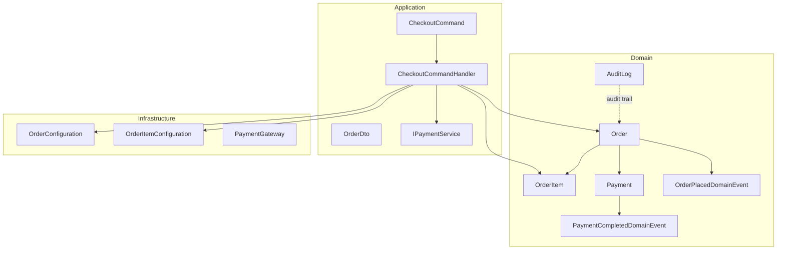
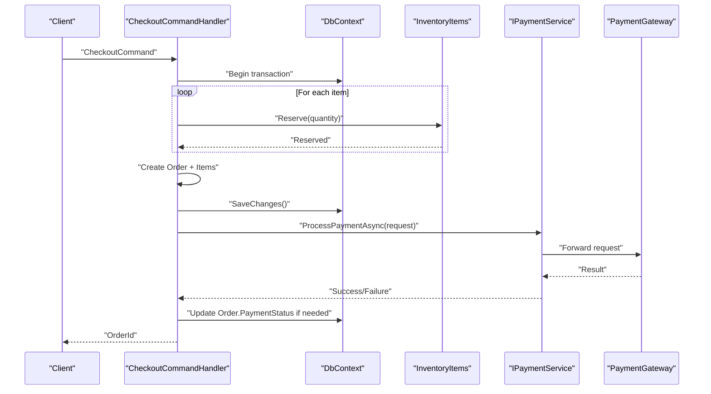
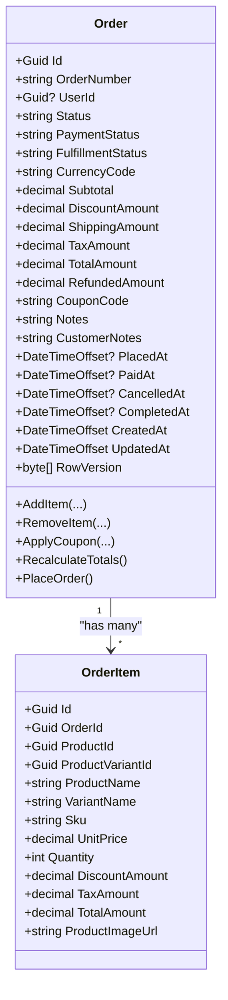
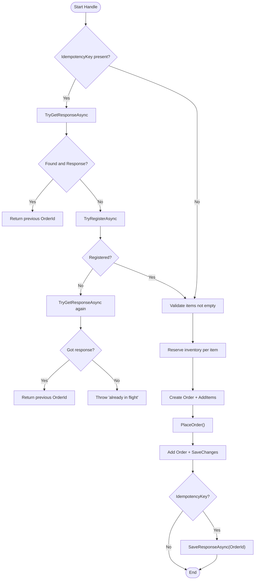
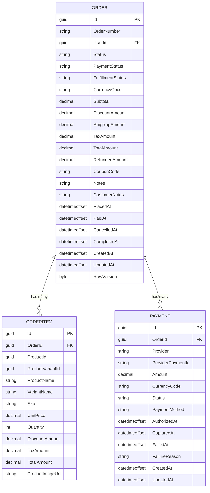
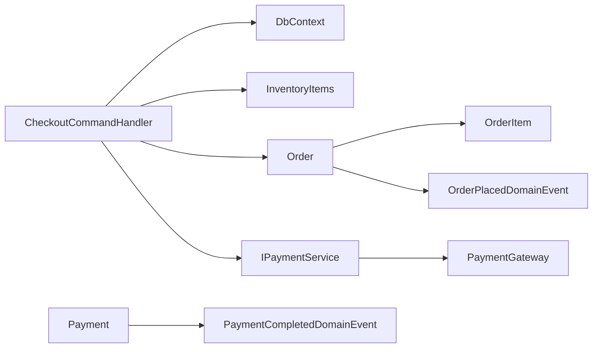

# Order Entity

<cite>
**Referenced Files in This Document**
- [Order.cs](file://src/Ecommerce.Domain/Entities/Order.cs)
- [OrderItem.cs](file://src/Ecommerce.Domain/Entities/OrderItem.cs)
- [Payment.cs](file://src/Ecommerce.Domain/Entities/Payment.cs)
- [CheckoutCommand.cs](file://src/Ecommerce.Application/Commands/Checkout/CheckoutCommand.cs)
- [CheckoutCommandHandler.cs](file://src/Ecommerce.Application/Commands/Checkout/CheckoutCommandHandler.cs)
- [OrderDto.cs](file://src/Ecommerce.Application/DTOs/OrderDto.cs)
- [IPaymentService.cs](file://src/Ecommerce.Application/Interfaces/IPaymentService.cs)
- [PaymentGateway.cs](file://src/Ecommerce.Infrastructure/Payments/PaymentGateway.cs)
- [OrderConfiguration.cs](file://src/Ecommerce.Infrastructure/Persistence/Configurations/OrderConfiguration.cs)
- [OrderItemConfiguration.cs](file://src/Ecommerce.Infrastructure/Persistence/Configurations/OrderItemConfiguration.cs)
- [AuditLog.cs](file://src/Ecommerce.Domain/Entities/AuditLog.cs)
- [OrderPlacedDomainEvent.cs](file://src/Ecommerce.Domain/DomainEvents/OrderPlacedDomainEvent.cs)
- [PaymentCompletedDomainEvent.cs](file://src/Ecommerce.Domain/DomainEvents/PaymentCompletedDomainEvent.cs)
- [OrderTests.cs](file://tests/Ecommerce.Domain.Tests/OrderTests.cs)
- [entities_and_constraints.md](file://docs/architecture/entities_and_constraints.md)
</cite>

## Table of Contents
1. Introduction
2. Project Structure
3. Core Components
4. Architecture Overview
5. Detailed Component Analysis
6. Dependency Analysis
7. Performance Considerations
8. Troubleshooting Guide
9. Conclusion

## Introduction
This document provides comprehensive documentation for the Order entity and its surrounding order management functionality. It explains the order lifecycle states, item collection behavior, payment integration points, customer information tracking, validation rules, status transitions, business invariants, persistence configuration, audit logging, and data consistency requirements. It also includes examples of creating orders, adding items, updating statuses, and processing payments.

## Project Structure
The Order entity resides in the Domain layer and is used by Application commands (checkout), Infrastructure persistence configurations, and domain events to coordinate cross-cutting concerns such as auditing and payment completion.

**Diagram sources**
- [Order.cs:8-103](file://src/Ecommerce.Domain/Entities/Order.cs#L8-L103)
- [OrderItem.cs:5-20](file://src/Ecommerce.Domain/Entities/OrderItem.cs#L5-L20)
- [Payment.cs:5-21](file://src/Ecommerce.Domain/Entities/Payment.cs#L5-L21)
- [CheckoutCommand.cs:6-20](file://src/Ecommerce.Application/Commands/Checkout/CheckoutCommand.cs#L6-L20)
- [CheckoutCommandHandler.cs:11-91](file://src/Ecommerce.Application/Commands/Checkout/CheckoutCommandHandler.cs#L11-L91)
- [OrderConfiguration.cs:7-44](file://src/Ecommerce.Infrastructure/Persistence/Configurations/OrderConfiguration.cs#L7-L44)
- [OrderItemConfiguration.cs:7-26](file://src/Ecommerce.Infrastructure/Persistence/Configurations/OrderItemConfiguration.cs#L7-L26)
- [IPaymentService.cs:5-23](file://src/Ecommerce.Application/Interfaces/IPaymentService.cs#L5-L23)
- [PaymentGateway.cs:7-23](file://src/Ecommerce.Infrastructure/Payments/PaymentGateway.cs#L7-L23)
- [OrderPlacedDomainEvent.cs:5-14](file://src/Ecommerce.Domain/DomainEvents/OrderPlacedDomainEvent.cs#L5-L14)
- [PaymentCompletedDomainEvent.cs:5-16](file://src/Ecommerce.Domain/DomainEvents/PaymentCompletedDomainEvent.cs#L5-L16)
- [AuditLog.cs:5-17](file://src/Ecommerce.Domain/Entities/AuditLog.cs#L5-L17)

**Section sources**
- [Order.cs:8-103](file://src/Ecommerce.Domain/Entities/Order.cs#L8-L103)
- [OrderItem.cs:5-20](file://src/Ecommerce.Domain/Entities/OrderItem.cs#L5-L20)
- [Payment.cs:5-21](file://src/Ecommerce.Domain/Entities/Payment.cs#L5-L21)
- [CheckoutCommand.cs:6-20](file://src/Ecommerce.Application/Commands/Checkout/CheckoutCommand.cs#L6-L20)
- [CheckoutCommandHandler.cs:11-91](file://src/Ecommerce.Application/Commands/Checkout/CheckoutCommandHandler.cs#L11-L91)
- [OrderConfiguration.cs:7-44](file://src/Ecommerce.Infrastructure/Persistence/Configurations/OrderConfiguration.cs#L7-L44)
- [OrderItemConfiguration.cs:7-26](file://src/Ecommerce.Infrastructure/Persistence/Configurations/OrderItemConfiguration.cs#L7-L26)
- [IPaymentService.cs:5-23](file://src/Ecommerce.Application/Interfaces/IPaymentService.cs#L5-L23)
- [PaymentGateway.cs:7-23](file://src/Ecommerce.Infrastructure/Payments/PaymentGateway.cs#L7-L23)
- [OrderPlacedDomainEvent.cs:5-14](file://src/Ecommerce.Domain/DomainEvents/OrderPlacedDomainEvent.cs#L5-L14)
- [PaymentCompletedDomainEvent.cs:5-16](file://src/Ecommerce.Domain/DomainEvents/PaymentCompletedDomainEvent.cs#L5-L16)
- [AuditLog.cs:5-17](file://src/Ecommerce.Domain/Entities/AuditLog.cs#L5-L17)

## Core Components
- Order: Core aggregate representing a customer’s purchase with monetary totals, timestamps, and lifecycle state fields. It owns a collection of OrderItem line items and exposes methods to add/remove items, apply coupons, recalculate totals, and place the order.
- OrderItem: Snapshot of a line item at time of order creation, including product identifiers, names, SKU, pricing, discounts, tax, and computed total.
- Payment: Represents a transaction record linked to an order, capturing provider details, amounts, currency, status, and lifecycle timestamps.
- Checkout flow: Application command that builds an Order from input, reserves inventory, persists the order, and returns the order identifier. Idempotency support prevents duplicate order creation.
- Persistence: EF Core configurations define table mappings, column types, constraints, relationships, and concurrency tokens.
- Domain events: Signals emitted on key milestones (order placed, payment completed).
- Audit log: Generic entity to record changes across the system.

Key responsibilities and interactions are illustrated below.

**Section sources**
- [Order.cs:8-103](file://src/Ecommerce.Domain/Entities/Order.cs#L8-L103)
- [OrderItem.cs:5-20](file://src/Ecommerce.Domain/Entities/OrderItem.cs#L5-L20)
- [Payment.cs:5-21](file://src/Ecommerce.Domain/Entities/Payment.cs#L5-L21)
- [CheckoutCommandHandler.cs:22-91](file://src/Ecommerce.Application/Commands/Checkout/CheckoutCommandHandler.cs#L22-L91)
- [OrderConfiguration.cs:7-44](file://src/Ecommerce.Infrastructure/Persistence/Configurations/OrderConfiguration.cs#L7-L44)
- [OrderItemConfiguration.cs:7-26](file://src/Ecommerce.Infrastructure/Persistence/Configurations/OrderItemConfiguration.cs#L7-L26)
- [OrderPlacedDomainEvent.cs:5-14](file://src/Ecommerce.Domain/DomainEvents/OrderPlacedDomainEvent.cs#L5-L14)
- [PaymentCompletedDomainEvent.cs:5-16](file://src/Ecommerce.Domain/DomainEvents/PaymentCompletedDomainEvent.cs#L5-L16)
- [AuditLog.cs:5-17](file://src/Ecommerce.Domain/Entities/AuditLog.cs#L5-L17)

## Architecture Overview
The order management architecture follows layered design:
- Domain: Encapsulates business logic and invariants within Order and related entities.
- Application: Orchestrates use cases via commands (e.g., checkout), handlers, and interfaces (e.g., IPaymentService).
- Infrastructure: Provides persistence (EF Core configurations), external integrations (payment gateway), and shared services (idempotency).

**Diagram sources**
- [CheckoutCommandHandler.cs:22-91](file://src/Ecommerce.Application/Commands/Checkout/CheckoutCommandHandler.cs#L22-L91)
- [IPaymentService.cs:5-23](file://src/Ecommerce.Application/Interfaces/IPaymentService.cs#L5-L23)
- [PaymentGateway.cs:7-23](file://src/Ecommerce.Infrastructure/Payments/PaymentGateway.cs#L7-L23)

## Detailed Component Analysis

### Order Entity
- Purpose: Central aggregate for order state, totals, and lifecycle.
- Key properties:
  - Identifiers and metadata: Id, OrderNumber, UserId, CurrencyCode, Notes, CustomerNotes, CouponCode
  - Financials: Subtotal, DiscountAmount, ShippingAmount, TaxAmount, TotalAmount, RefundedAmount
  - Lifecycle timestamps: PlacedAt, PaidAt, CancelledAt, CompletedAt, CreatedAt, UpdatedAt
  - Concurrency: RowVersion
- Collections:
  - Items: ICollection<OrderItem>
- Business methods:
  - AddItem(productId, productVariantId, productName, unitPrice, quantity, discount, tax): Validates inputs, creates OrderItem snapshot, computes line total, updates order totals, sets timestamps.
  - RemoveItem(orderItemId): Removes item, recalculates totals, updates timestamp.
  - ApplyCoupon(couponCode, discountAmount): Applies coupon discount, recalculates totals, updates timestamp.
  - RecalculateTotals(): Computes Subtotal, TaxAmount, DiscountAmount (including item-level discounts and coupon), and TotalAmount based on current items and shipping.
  - PlaceOrder(): Enforces non-empty items, sets Status to “Placed”, PaymentStatus to “Pending”, FulfillmentStatus to “Unfulfilled”, records PlacedAt, ensures totals are up to date.

Validation rules and invariants:
- Quantity must be positive; unit price cannot be negative.
- Cannot place an empty order.
- Totals are derived from items and shipping; any mutation triggers recalculation.

Lifecycle states:
- Status: Initialized (default) -> Placed (via PlaceOrder). Additional statuses can be introduced later (e.g., Processing, Shipped, Completed, Cancelled).
- PaymentStatus: Pending (on place); updated when payment completes or fails.
- FulfillmentStatus: Unfulfilled (on place); updated when shipped/delivered.

Customer information tracking:
- UserId links the order to a user account.
- Notes and CustomerNotes allow internal and customer-facing annotations.

Examples:
- Create order and add items: Use AddItem multiple times to build the order line items.
- Apply coupon: Call ApplyCoupon before placing the order to include discount in totals.
- Place order: Invoke PlaceOrder to transition to “Placed” and set initial payment and fulfillment statuses.

**Section sources**
- [Order.cs:8-103](file://src/Ecommerce.Domain/Entities/Order.cs#L8-L103)
- [OrderTests.cs:10-39](file://tests/Ecommerce.Domain.Tests/OrderTests.cs#L10-L39)

#### Class Diagram: Order and OrderItem

**Diagram sources**
- [Order.cs:8-103](file://src/Ecommerce.Domain/Entities/Order.cs#L8-L103)
- [OrderItem.cs:5-20](file://src/Ecommerce.Domain/Entities/OrderItem.cs#L5-L20)

### OrderItem Entity
- Purpose: Immutable snapshot of a line item at order time to preserve historical accuracy even if product data changes later.
- Fields capture product identity, descriptive text, SKU, pricing, discounts, tax, and computed total.

Relationships:
- Belongs to one Order via OrderId.

Persistence:
- Configured with appropriate string lengths and decimal precision; indexed by OrderId for efficient queries.

**Section sources**
- [OrderItem.cs:5-20](file://src/Ecommerce.Domain/Entities/OrderItem.cs#L5-L20)
- [OrderItemConfiguration.cs:7-26](file://src/Ecommerce.Infrastructure/Persistence/Configurations/OrderItemConfiguration.cs#L7-L26)

### Payment Entity and Integration Points
- Purpose: Records a payment attempt and outcome for an order, including provider details, amount, currency, method, status, and lifecycle timestamps.
- Integration:
  - IPaymentService defines ProcessPaymentAsync(PaymentRequest) returning PaymentResult.
  - PaymentGateway implements a stub provider for development/testing.
  - In production, replace with a real provider while preserving the interface contract.

Workflow:
- After order placement, initiate payment using IPaymentService.
- On success, update Order.PaymentStatus and Payment.Status accordingly; record AuthorizedAt/CapturedAt as applicable.
- On failure, record FailedAt and FailureReason.

Domain events:
- PaymentCompletedDomainEvent signals successful completion with PaymentId and OrderId.

**Section sources**
- [Payment.cs:5-21](file://src/Ecommerce.Domain/Entities/Payment.cs#L5-L21)
- [IPaymentService.cs:5-23](file://src/Ecommerce.Application/Interfaces/IPaymentService.cs#L5-L23)
- [PaymentGateway.cs:7-23](file://src/Ecommerce.Infrastructure/Payments/PaymentGateway.cs#L7-L23)
- [PaymentCompletedDomainEvent.cs:5-16](file://src/Ecommerce.Domain/DomainEvents/PaymentCompletedDomainEvent.cs#L5-L16)

### Checkout Command and Handler
- Input: CheckoutCommand contains UserId, list of items, currency, shipping address, and optional idempotency key.
- Behavior:
  - Idempotency check: If provided, attempts to reuse prior response or register a new attempt.
  - Validation: Ensures items exist.
  - Inventory reservation: Reserves stock per item variant/product.
  - Order creation: Builds Order, adds items, calls PlaceOrder.
  - Persistence: Adds Order to DbContext and saves changes.
  - Idempotency response: Stores returned OrderId for subsequent requests with same key.

**Diagram sources**
- [CheckoutCommandHandler.cs:22-91](file://src/Ecommerce.Application/Commands/Checkout/CheckoutCommandHandler.cs#L22-L91)
- [CheckoutCommand.cs:6-20](file://src/Ecommerce.Application/Commands/Checkout/CheckoutCommand.cs#L6-L20)

**Section sources**
- [CheckoutCommand.cs:6-20](file://src/Ecommerce.Application/Commands/Checkout/CheckoutCommand.cs#L6-L20)
- [CheckoutCommandHandler.cs:22-91](file://src/Ecommerce.Application/Commands/Checkout/CheckoutCommandHandler.cs#L22-L91)

### Data Models and Relationships

**Diagram sources**
- [OrderConfiguration.cs:7-44](file://src/Ecommerce.Infrastructure/Persistence/Configurations/OrderConfiguration.cs#L7-L44)
- [OrderItemConfiguration.cs:7-26](file://src/Ecommerce.Infrastructure/Persistence/Configurations/OrderItemConfiguration.cs#L7-L26)
- [Payment.cs:5-21](file://src/Ecommerce.Domain/Entities/Payment.cs#L5-L21)

### Validation Rules, Status Transitions, and Business Invariants
- Validation:
  - Item quantity must be positive; unit price cannot be negative.
  - Orders cannot be placed without items.
- Status transitions:
  - Order.Status: Default -> “Placed” via PlaceOrder.
  - Order.PaymentStatus: “Pending” on place; updated upon payment success/failure.
  - Order.FulfillmentStatus: “Unfulfilled” on place; updated when shipped/delivered.
- Invariants:
  - Totals are always derived from items and shipping; any change triggers recalculation.
  - Discounts may come from both item-level discounts and coupon application.
  - Historical snapshots preserved in OrderItem ensure accurate reporting.

**Section sources**
- [Order.cs:36-102](file://src/Ecommerce.Domain/Entities/Order.cs#L36-L102)
- [entities_and_constraints.md:217-255](file://docs/architecture/entities_and_constraints.md#L217-L255)

### Examples

- Order creation and item addition:
  - Use CheckoutCommand with items to create an order through CheckoutCommandHandler, which internally constructs Order and adds items.
  - Alternatively, construct Order directly and call AddItem multiple times.

- Applying a coupon:
  - Call ApplyCoupon with code and discount amount before placing the order to include it in totals.

- Updating order status:
  - PlaceOrder transitions the order to “Placed” and initializes payment and fulfillment statuses.

- Payment processing workflow:
  - After order placement, call IPaymentService.ProcessPaymentAsync with amount, currency, method, and idempotency key.
  - On success, update Order.PaymentStatus and Payment.Status; record timestamps.
  - On failure, record failure reason and timestamps.

- Idempotent checkout:
  - Provide IdempotencyKey to prevent duplicate orders; handler checks and caches responses.

**Section sources**
- [CheckoutCommandHandler.cs:22-91](file://src/Ecommerce.Application/Commands/Checkout/CheckoutCommandHandler.cs#L22-L91)
- [Order.cs:36-102](file://src/Ecommerce.Domain/Entities/Order.cs#L36-L102)
- [IPaymentService.cs:5-23](file://src/Ecommerce.Application/Interfaces/IPaymentService.cs#L5-L23)
- [PaymentGateway.cs:7-23](file://src/Ecommerce.Infrastructure/Payments/PaymentGateway.cs#L7-L23)

### Persistence, Audit Logging, and Data Consistency

- Persistence:
  - Order and OrderItem are configured with EF Core, including table names, property types, constraints, and cascade delete for OrderItems.
  - Monetary columns use decimal(18,2) for precision.
  - RowVersion is configured as a concurrency token for optimistic concurrency control.

- Audit logging:
  - AuditLog entity captures action, entity name/id, old/new values, and request context.
  - Integrate with middleware or domain event handlers to persist relevant changes.

- Data consistency:
  - Checkout executes within a transaction boundary: reserve inventory, create order and items, save changes, then process payment.
  - Idempotency keys prevent duplicate operations under concurrent or retried requests.
  - Domain events (OrderPlacedDomainEvent, PaymentCompletedDomainEvent) enable decoupled side effects like notifications or analytics.

**Section sources**
- [OrderConfiguration.cs:7-44](file://src/Ecommerce.Infrastructure/Persistence/Configurations/OrderConfiguration.cs#L7-L44)
- [OrderItemConfiguration.cs:7-26](file://src/Ecommerce.Infrastructure/Persistence/Configurations/OrderItemConfiguration.cs#L7-L26)
- [AuditLog.cs:5-17](file://src/Ecommerce.Domain/Entities/AuditLog.cs#L5-L17)
- [OrderPlacedDomainEvent.cs:5-14](file://src/Ecommerce.Domain/DomainEvents/OrderPlacedDomainEvent.cs#L5-L14)
- [PaymentCompletedDomainEvent.cs:5-16](file://src/Ecommerce.Domain/DomainEvents/PaymentCompletedDomainEvent.cs#L5-L16)
- [entities_and_constraints.md:450-457](file://docs/architecture/entities_and_constraints.md#L450-L457)

## Dependency Analysis
- Order depends on OrderItem for line items and uses them to compute totals.
- CheckoutCommandHandler depends on DbContext, InventoryItems, and IPaymentService to orchestrate the checkout flow.
- PaymentGateway implements IPaymentService to provide a concrete payment integration.
- EF Core configurations depend on Domain entities to map persistence details.

**Diagram sources**
- [CheckoutCommandHandler.cs:22-91](file://src/Ecommerce.Application/Commands/Checkout/CheckoutCommandHandler.cs#L22-L91)
- [Order.cs:8-103](file://src/Ecommerce.Domain/Entities/Order.cs#L8-L103)
- [OrderItem.cs:5-20](file://src/Ecommerce.Domain/Entities/OrderItem.cs#L5-L20)
- [IPaymentService.cs:5-23](file://src/Ecommerce.Application/Interfaces/IPaymentService.cs#L5-L23)
- [PaymentGateway.cs:7-23](file://src/Ecommerce.Infrastructure/Payments/PaymentGateway.cs#L7-L23)
- [OrderPlacedDomainEvent.cs:5-14](file://src/Ecommerce.Domain/DomainEvents/OrderPlacedDomainEvent.cs#L5-L14)
- [PaymentCompletedDomainEvent.cs:5-16](file://src/Ecommerce.Domain/DomainEvents/PaymentCompletedDomainEvent.cs#L5-L16)

**Section sources**
- [CheckoutCommandHandler.cs:22-91](file://src/Ecommerce.Application/Commands/Checkout/CheckoutCommandHandler.cs#L22-L91)
- [Order.cs:8-103](file://src/Ecommerce.Domain/Entities/Order.cs#L8-L103)
- [OrderItem.cs:5-20](file://src/Ecommerce.Domain/Entities/OrderItem.cs#L5-L20)
- [IPaymentService.cs:5-23](file://src/Ecommerce.Application/Interfaces/IPaymentService.cs#L5-L23)
- [PaymentGateway.cs:7-23](file://src/Ecommerce.Infrastructure/Payments/PaymentGateway.cs#L7-L23)

## Performance Considerations
- Monetary calculations: Keep totals derived from items to avoid redundant storage and ensure consistency.
- Indexing: Ensure indexes on Order.OrderNumber, Order.UserId, Order.Status, and Order.CreatedAt for query performance.
- Concurrency: Use RowVersion to detect conflicting updates during checkout and payment processing.
- Idempotency: Leverage idempotency keys to reduce duplicate work and protect against retries.
- Transaction boundaries: Group inventory reservation, order creation, and persistence into a single transaction to maintain ACID properties.

[No sources needed since this section provides general guidance]

## Troubleshooting Guide
Common issues and resolutions:
- Empty order placement:
  - Symptom: Exception when calling PlaceOrder on an order without items.
  - Resolution: Ensure at least one item is added before placing.

- Invalid item parameters:
  - Symptom: Exception when adding items with non-positive quantity or negative unit price.
  - Resolution: Validate inputs before calling AddItem.

- Duplicate order creation:
  - Symptom: Multiple orders created for the same intent.
  - Resolution: Use IdempotencyKey in CheckoutCommand; handler will return existing OrderId if already processed.

- Inventory not reserved:
  - Symptom: Checkout proceeds but stock remains unchanged.
  - Resolution: Verify inventory lookup and Reserve call paths in the handler.

- Payment failures:
  - Symptom: PaymentStatus remains pending after processing.
  - Resolution: Inspect Payment.Status and FailureReason; handle retries or fallbacks appropriately.

- Concurrency conflicts:
  - Symptom: Update failures due to RowVersion mismatch.
  - Resolution: Refresh aggregates and retry operations; consider exponential backoff.

**Section sources**
- [Order.cs:36-102](file://src/Ecommerce.Domain/Entities/Order.cs#L36-L102)
- [CheckoutCommandHandler.cs:22-91](file://src/Ecommerce.Application/Commands/Checkout/CheckoutCommandHandler.cs#L22-L91)
- [PaymentGateway.cs:7-23](file://src/Ecommerce.Infrastructure/Payments/PaymentGateway.cs#L7-L23)

## Conclusion
The Order entity encapsulates core order management functionality with robust validation, clear lifecycle transitions, and strong data integrity guarantees. Its relationship with OrderItem preserves historical accuracy, while Payment integrates transaction processing through a pluggable service. The checkout flow enforces idempotency and inventory reservations, and persistence configurations ensure consistent storage. Domain events and audit logging support extensibility and traceability. Following these patterns ensures reliable, scalable order processing.

[No sources needed since this section summarizes without analyzing specific files]