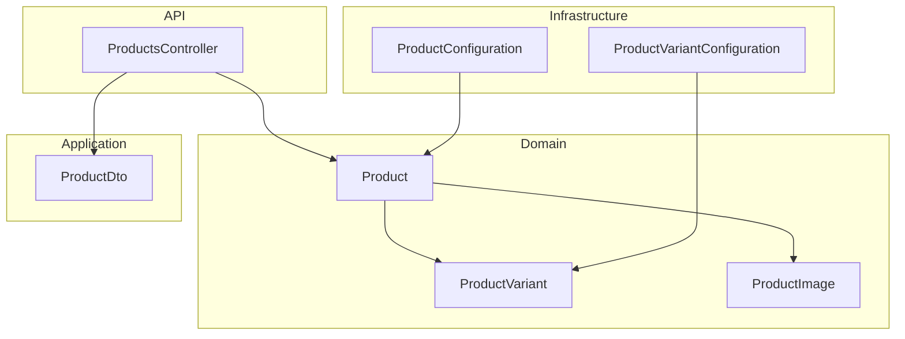
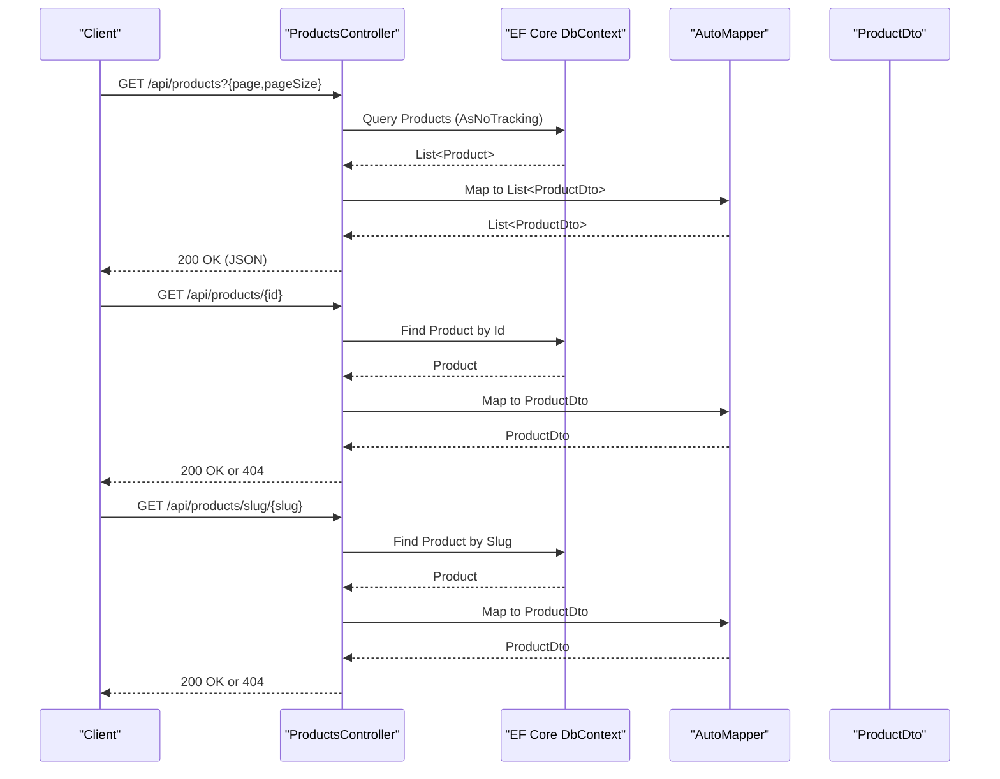
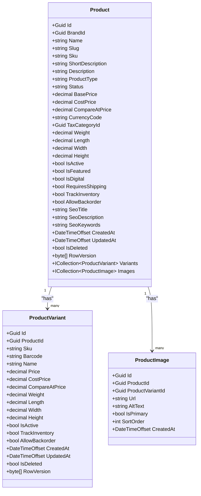
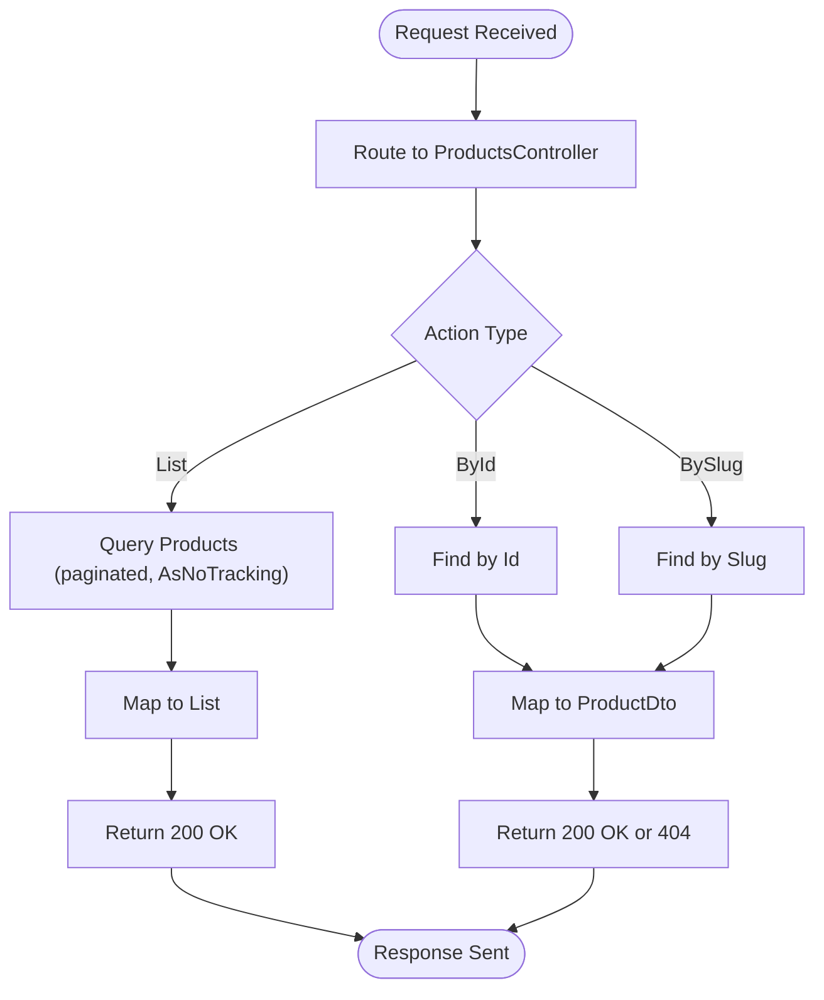
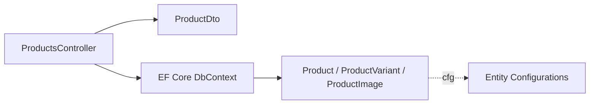

# Product Entity

<cite>
**Referenced Files in This Document**
- [Product.cs](file://src/Ecommerce.Domain/Entities/Product.cs)
- [ProductVariant.cs](file://src/Ecommerce.Domain/Entities/ProductVariant.cs)
- [ProductImage.cs](file://src/Ecommerce.Domain/Entities/ProductImage.cs)
- [ProductConfiguration.cs](file://src/Ecommerce.Infrastructure/Persistence/Configurations/ProductConfiguration.cs)
- [ProductVariantConfiguration.cs](file://src/Ecommerce.Infrastructure/Persistence/Configurations/ProductVariantConfiguration.cs)
- [ProductsController.cs](file://src/Ecommerce.Api/Controllers/ProductsController.cs)
- [ProductDto.cs](file://src/Ecommerce.Application/DTOs/ProductDto.cs)
- [domain_rules_and_usecases.md](file://docs/architecture/domain_rules_and_usecases.md)
- [entities_and_constraints.md](file://docs/architecture/entities_and_constraints.md)
</cite>

## Table of Contents
1. Introduction
2. Project Structure
3. Core Components
4. Architecture Overview
5. Detailed Component Analysis
6. Dependency Analysis
7. Performance Considerations
8. Troubleshooting Guide
9. Conclusion

## Introduction
This document provides comprehensive documentation for the Product entity within the E-Commerce domain. It covers identification, descriptive fields, pricing structure, physical attributes, business flags, relationships with ProductVariant and ProductImage, validation rules, business invariants, and how products maintain consistency across the catalog system. It also includes examples of product creation, variant management, and status transitions.

## Project Structure
The Product entity is defined in the Domain layer and configured in Infrastructure. The API exposes read operations via a controller that returns DTOs. Validation placeholders exist in the Application layer.

**Diagram sources**
- [Product.cs:6-42](file://src/Ecommerce.Domain/Entities/Product.cs#L6-L42)
- [ProductVariant.cs:5-26](file://src/Ecommerce.Domain/Entities/ProductVariant.cs#L5-L26)
- [ProductImage.cs:5-15](file://src/Ecommerce.Domain/Entities/ProductImage.cs#L5-L15)
- [ProductConfiguration.cs:7-21](file://src/Ecommerce.Infrastructure/Persistence/Configurations/ProductConfiguration.cs#L7-L21)
- [ProductVariantConfiguration.cs:7-26](file://src/Ecommerce.Infrastructure/Persistence/Configurations/ProductVariantConfiguration.cs#L7-L26)
- [ProductsController.cs:15-58](file://src/Ecommerce.Api/Controllers/ProductsController.cs#L15-L58)
- [ProductDto.cs:5-11](file://src/Ecommerce.Application/DTOs/ProductDto.cs#L5-L11)

**Section sources**
- [Product.cs:6-42](file://src/Ecommerce.Domain/Entities/Product.cs#L6-L42)
- [ProductConfiguration.cs:7-21](file://src/Ecommerce.Infrastructure/Persistence/Configurations/ProductConfiguration.cs#L7-L21)
- [ProductsController.cs:15-58](file://src/Ecommerce.Api/Controllers/ProductsController.cs#L15-L58)

## Core Components
- Product: Central catalog entity representing a sellable item with identification, description, pricing, dimensions, and business flags.
- ProductVariant: Represents specific options or configurations of a product (e.g., size/color), with its own pricing and inventory behavior.
- ProductImage: Media associated with a product or a specific variant.

Key responsibilities:
- Maintain price integrity and dimension data.
- Enforce unique identifiers (Slug, Sku).
- Support media attachments per product or variant.
- Provide auditability and concurrency control via RowVersion.

**Section sources**
- [Product.cs:6-42](file://src/Ecommerce.Domain/Entities/Product.cs#L6-L42)
- [ProductVariant.cs:5-26](file://src/Ecommerce.Domain/Entities/ProductVariant.cs#L5-L26)
- [ProductImage.cs:5-15](file://src/Ecommerce.Domain/Entities/ProductImage.cs#L5-L15)

## Architecture Overview
The API exposes read endpoints for listing, retrieving by ID, and retrieving by Slug. These map to domain entities and return simplified DTOs. EF Core configurations enforce constraints such as required fields, precision for monetary values, uniqueness, and concurrency tokens.

**Diagram sources**
- [ProductsController.cs:26-58](file://src/Ecommerce.Api/Controllers/ProductsController.cs#L26-L58)
- [ProductDto.cs:5-11](file://src/Ecommerce.Application/DTOs/ProductDto.cs#L5-L11)

## Detailed Component Analysis

### Product Entity
Identification:
- Id: Unique identifier (Guid).
- Sku: Stock Keeping Unit; may be globally unique or scoped depending on policy.
- Slug: URL-friendly unique identifier; enforced unique index.

Descriptive fields:
- Name: Required, max length constrained.
- ShortDescription: Brief summary.
- Description: Full details.

Pricing structure:
- BasePrice: Selling price; decimal(18,2).
- CostPrice: Internal cost; decimal(18,2).
- CompareAtPrice: Reference price for promotions/discounts; decimal(18,2).
- CurrencyCode: ISO currency code for display and calculations.

Physical attributes:
- Weight, Length, Width, Height: Decimal dimensions used for shipping and logistics.

Business flags:
- IsActive: Controls visibility and availability.
- IsFeatured: Highlights in catalogs.
- IsDigital: Indicates digital goods (no shipping).
- RequiresShipping: Determines fulfillment path.
- TrackInventory: Enables stock tracking at product level.
- AllowBackorder: Allows orders when out of stock.

Audit and concurrency:
- CreatedAt, UpdatedAt, IsDeleted (soft delete), RowVersion (optimistic concurrency token).

Relationships:
- Variants: One-to-many collection of ProductVariant.
- Images: One-to-many collection of ProductImage.

Validation and invariants:
- Price integrity: BasePrice >= 0, CostPrice >= 0.
- Slug uniqueness enforced at database level.
- Soft-delete semantics via global filters.

**Section sources**
- [Product.cs:6-42](file://src/Ecommerce.Domain/Entities/Product.cs#L6-L42)
- [ProductConfiguration.cs:9-21](file://src/Ecommerce.Infrastructure/Persistence/Configurations/ProductConfiguration.cs#L9-L21)
- [entities_and_constraints.md:83-113](file://docs/architecture/entities_and_constraints.md#L83-L113)
- [domain_rules_and_usecases.md:3-17](file://docs/architecture/domain_rules_and_usecases.md#L3-L17)

#### Class Diagram: Product and Relationships

**Diagram sources**
- [Product.cs:6-42](file://src/Ecommerce.Domain/Entities/Product.cs#L6-L42)
- [ProductVariant.cs:5-26](file://src/Ecommerce.Domain/Entities/ProductVariant.cs#L5-L26)
- [ProductImage.cs:5-15](file://src/Ecommerce.Domain/Entities/ProductImage.cs#L5-L15)

### ProductVariant Entity
Purpose:
- Captures option-specific details for a product (e.g., size, color).
- Overrides pricing and dimensions per variant.

Key properties:
- Sku, Barcode: Identifiers for the variant.
- Name: Variant-specific name.
- Price, CostPrice, CompareAtPrice: Variant-level pricing (decimal(18,2)).
- Weight, Length, Width, Height: Variant-level dimensions.
- IsActive, TrackInventory, AllowBackorder: Variant-level business flags.
- Audit and concurrency: CreatedAt, UpdatedAt, IsDeleted, RowVersion.

Constraints:
- Sku uniqueness enforced at database level.
- Monetary and dimensional precision enforced via configuration.

**Section sources**
- [ProductVariant.cs:5-26](file://src/Ecommerce.Domain/Entities/ProductVariant.cs#L5-L26)
- [ProductVariantConfiguration.cs:9-26](file://src/Ecommerce.Infrastructure/Persistence/Configurations/ProductVariantConfiguration.cs#L9-L26)
- [entities_and_constraints.md:115-123](file://docs/architecture/entities_and_constraints.md#L115-L123)

### ProductImage Entity
Purpose:
- Associates media assets with a product or a specific variant.

Key properties:
- ProductId: Parent product reference.
- ProductVariantId: Optional link to a variant for variant-specific images.
- Url, AltText: Media location and accessibility text.
- IsPrimary, SortOrder: Ordering and primary image selection.
- CreatedAt: Timestamp.

**Section sources**
- [ProductImage.cs:5-15](file://src/Ecommerce.Domain/Entities/ProductImage.cs#L5-L15)
- [entities_and_constraints.md:125-130](file://docs/architecture/entities_and_constraints.md#L125-L130)

### Validation Rules and Business Invariants
- Price integrity: BasePrice and CostPrice must be non-negative.
- Variant pricing: Variant Price must be non-negative; Sku must be unique.
- Concurrency: RowVersion ensures safe updates to critical entities.
- Soft deletes: IsDeleted indicates logical deletion; queries should filter out deleted records.
- Sensitive operations: Price changes and inventory adjustments should be audited.

These rules are documented at the architecture level and enforced through application logic and database constraints.

**Section sources**
- [domain_rules_and_usecases.md:3-17](file://docs/architecture/domain_rules_and_usecases.md#L3-L17)
- [entities_and_constraints.md:450-465](file://docs/architecture/entities_and_constraints.md#L450-L465)

### Data Flow and Processing Logic
- Listing products: Paginated query using AsNoTracking for performance.
- Retrieval by Id or Slug: Direct lookup with appropriate error responses.
- Mapping: Entities mapped to lightweight DTOs for API responses.

**Diagram sources**
- [ProductsController.cs:26-58](file://src/Ecommerce.Api/Controllers/ProductsController.cs#L26-L58)
- [ProductDto.cs:5-11](file://src/Ecommerce.Application/DTOs/ProductDto.cs#L5-L11)

**Section sources**
- [ProductsController.cs:26-58](file://src/Ecommerce.Api/Controllers/ProductsController.cs#L26-L58)

## Dependency Analysis
- Layering: Domain defines entities; Infrastructure configures persistence; API consumes domain via DbContext and maps to DTOs.
- Coupling: API depends on Infrastructure (DbContext) and Application (DTOs); Domain remains free of infrastructure concerns.
- Indexes and constraints: Slug uniqueness for Product; Sku uniqueness for ProductVariant; precision for monetary/dimensional fields.

**Diagram sources**
- [ProductsController.cs:15-58](file://src/Ecommerce.Api/Controllers/ProductsController.cs#L15-L58)
- [ProductConfiguration.cs:7-21](file://src/Ecommerce.Infrastructure/Persistence/Configurations/ProductConfiguration.cs#L7-L21)
- [ProductVariantConfiguration.cs:7-26](file://src/Ecommerce.Infrastructure/Persistence/Configurations/ProductVariantConfiguration.cs#L7-L26)

**Section sources**
- [entities_and_constraints.md:438-447](file://docs/architecture/entities_and_constraints.md#L438-L447)

## Performance Considerations
- Use AsNoTracking for read-only queries to reduce change-tracking overhead.
- Apply pagination to list endpoints to limit payload size.
- Ensure indexes on frequently queried fields (e.g., Slug, Sku, IsActive, Status).
- Avoid loading unnecessary related data unless explicitly requested.

[No sources needed since this section provides general guidance]

## Troubleshooting Guide
Common issues and resolutions:
- Duplicate Slug: Database enforces uniqueness; ensure slug generation avoids collisions.
- Invalid prices: Validate BasePrice and CostPrice are non-negative before persisting.
- Concurrency conflicts: Handle RowVersion mismatches by re-fetching and retrying updates.
- Missing images: Verify ProductId and optional ProductVariantId associations.

Operational notes:
- Audit sensitive operations like price changes and inventory adjustments.
- Use soft deletes consistently; ensure global filters exclude deleted records.

**Section sources**
- [domain_rules_and_usecases.md:3-17](file://docs/architecture/domain_rules_and_usecases.md#L3-L17)
- [entities_and_constraints.md:450-465](file://docs/architecture/entities_and_constraints.md#L450-L465)

## Conclusion
The Product entity serves as the core of the catalog with robust identification, descriptive fields, pricing, dimensions, and business flags. Relationships with ProductVariant and ProductImage enable rich product modeling. Validation and invariants ensure data integrity, while EF Core configurations enforce constraints and concurrency. The API provides efficient read access with clear mappings to DTOs. Following these guidelines ensures consistent and reliable product management across the e-commerce system.