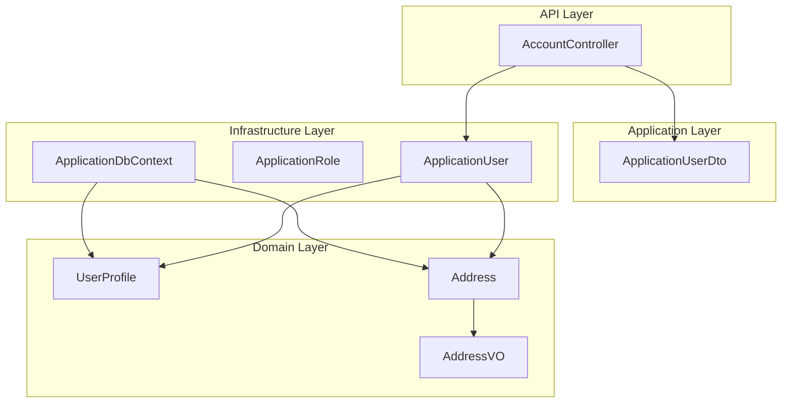
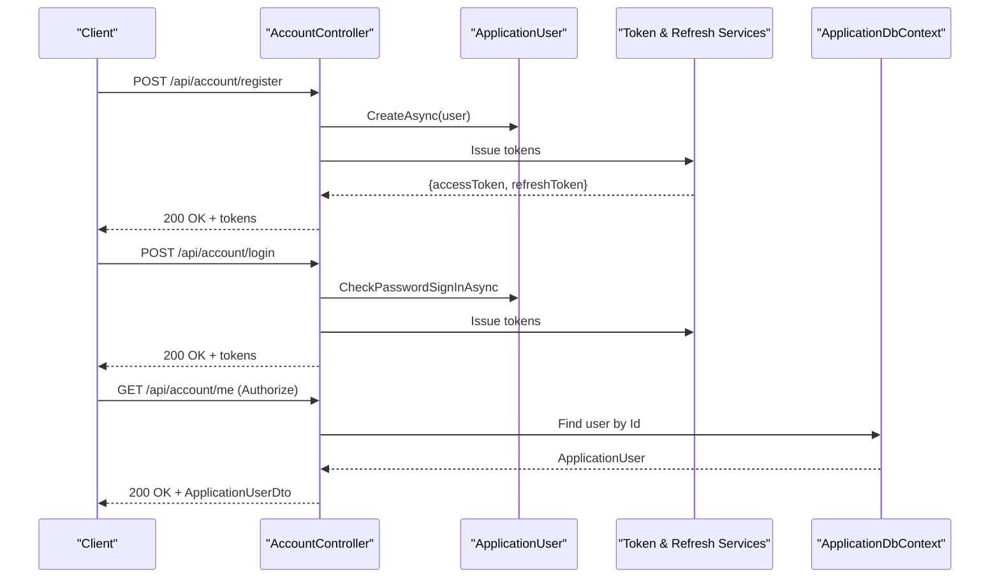
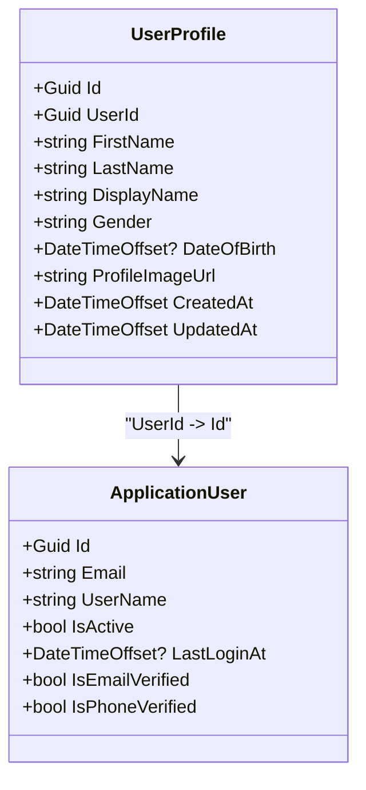
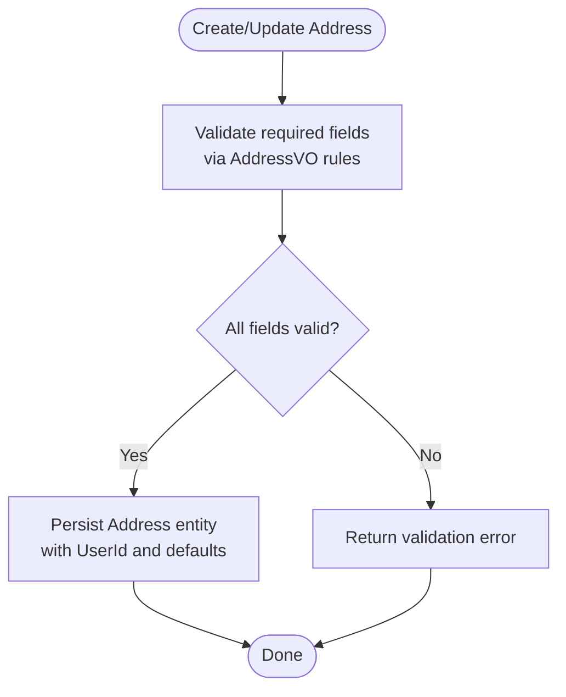
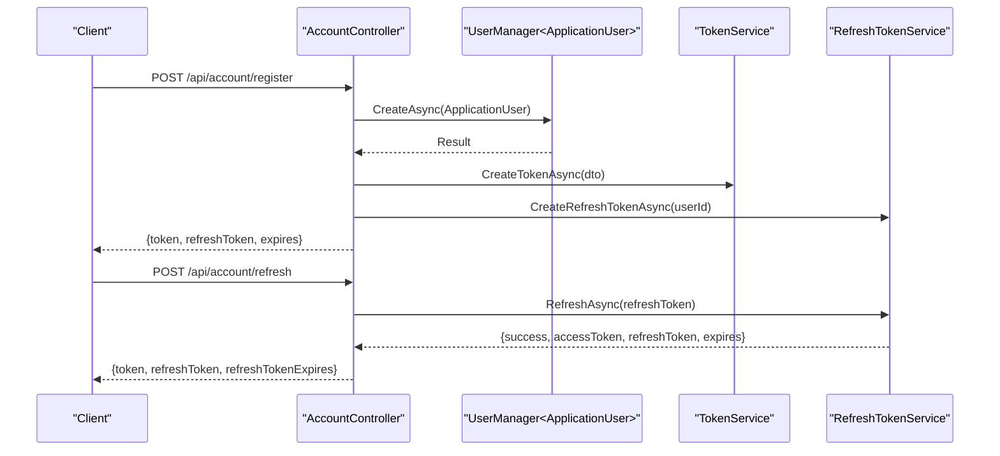
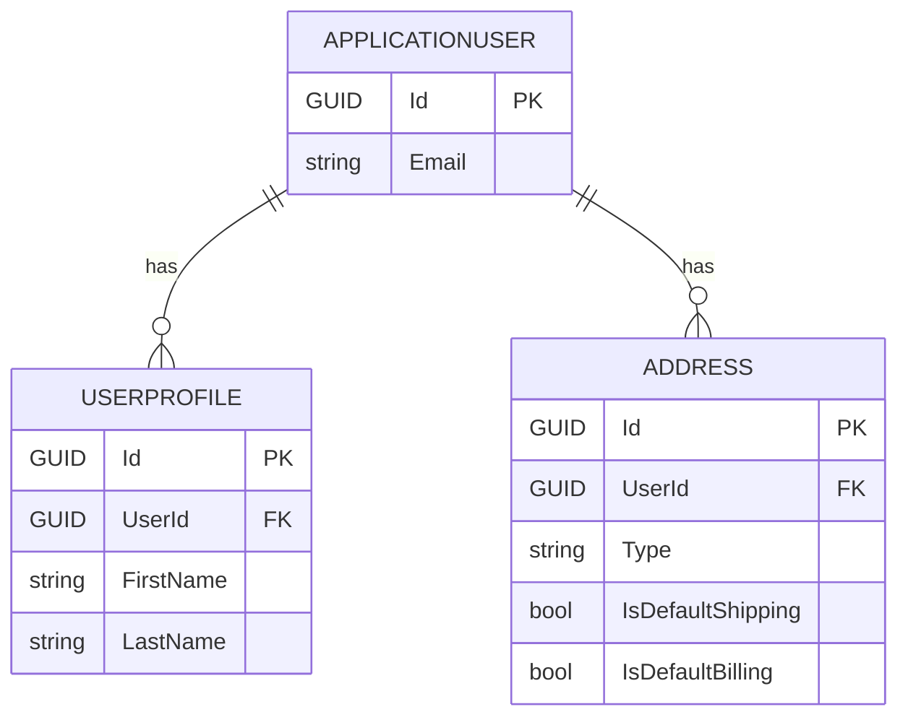
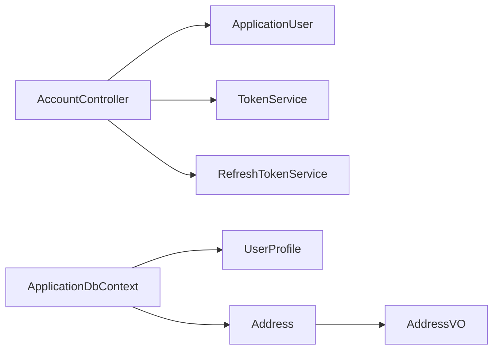

# User Profile Entity

<cite>
**Referenced Files in This Document**
- [UserProfile.cs](file://src/Ecommerce.Domain/Entities/UserProfile.cs)
- [Address.cs](file://src/Ecommerce.Domain/Entities/Address.cs)
- [ApplicationUser.cs](file://src/Ecommerce.Infrastructure/Identity/ApplicationUser.cs)
- [AccountController.cs](file://src/Ecommerce.Api/Controllers/AccountController.cs)
- [ApplicationUserDto.cs](file://src/Ecommerce.Application/DTOs/ApplicationUserDto.cs)
- [AddressVO.cs](file://src/Ecommerce.Domain/ValueObjects/AddressVO.cs)
- [ApplicationDbContext.cs](file://src/Ecommerce.Infrastructure/Persistence/ApplicationDbContext.cs)
- [entities_and_constraints.md](file://docs/architecture/entities_and_constraints.md)
- [erd.md](file://docs/architecture/erd.md)
</cite>

## Table of Contents
1. Introduction
2. Project Structure
3. Core Components
4. Architecture Overview
5. Detailed Component Analysis
6. Dependency Analysis
7. Performance Considerations
8. Troubleshooting Guide
9. Conclusion

## Introduction
This document explains the UserProfile entity and its role in managing user account information and preferences within the e-commerce system. It covers:
- User profile properties and lifecycle fields
- Relationship with Address entities for shipping and billing addresses
- Integration with authentication (ASP.NET Identity) and authorization policies
- Data validation, privacy, and compliance considerations for personal data handling
- Practical examples for registration, profile updates, and address management

## Project Structure
The project follows a layered architecture:
- Domain layer defines core entities such as UserProfile and Address
- Infrastructure layer provides ASP.NET Identity integration and persistence via EF Core
- Application/API layers expose endpoints for authentication and user operations

**Diagram sources**
- [AccountController.cs:1-134](file://src/Ecommerce.Api/Controllers/AccountController.cs#L1-L134)
- [ApplicationUserDto.cs:1-12](file://src/Ecommerce.Application/DTOs/ApplicationUserDto.cs#L1-L12)
- [ApplicationUser.cs:1-19](file://src/Ecommerce.Infrastructure/Identity/ApplicationUser.cs#L1-L19)
- [ApplicationDbContext.cs:1-43](file://src/Ecommerce.Infrastructure/Persistence/ApplicationDbContext.cs#L1-L43)
- [UserProfile.cs:1-19](file://src/Ecommerce.Domain/Entities/UserProfile.cs#L1-L19)
- [Address.cs:1-27](file://src/Ecommerce.Domain/Entities/Address.cs#L1-L27)
- [AddressVO.cs:1-27](file://src/Ecommerce.Domain/ValueObjects/AddressVO.cs#L1-L27)

**Section sources**
- [AccountController.cs:1-134](file://src/Ecommerce.Api/Controllers/AccountController.cs#L1-L134)
- [ApplicationDbContext.cs:1-43](file://src/Ecommerce.Infrastructure/Persistence/ApplicationDbContext.cs#L1-L43)

## Core Components
- UserProfile: Stores personal details and timestamps for a user’s profile.
- Address: Stores shipping/billing addresses with default flags and soft delete support.
- ApplicationUser: ASP.NET Identity user with additional profile-related fields and verification flags.
- AddressVO: Immutable value object representing an address for domain use.

Key responsibilities:
- UserProfile: Owns display name, gender, date of birth, and profile image URL; tracks creation/update times.
- Address: Manages full address lines, city/state/postal/country, phone, company, and defaults for shipping/billing.
- ApplicationUser: Integrates with identity services for login, token issuance, and session refresh.
- AddressVO: Enforces non-null constraints for essential address fields at the domain level.

**Section sources**
- [UserProfile.cs:1-19](file://src/Ecommerce.Domain/Entities/UserProfile.cs#L1-L19)
- [Address.cs:1-27](file://src/Ecommerce.Domain/Entities/Address.cs#L1-L27)
- [ApplicationUser.cs:1-19](file://src/Ecommerce.Infrastructure/Identity/ApplicationUser.cs#L1-L19)
- [AddressVO.cs:1-27](file://src/Ecommerce.Domain/ValueObjects/AddressVO.cs#L1-L27)

## Architecture Overview
The system uses ASP.NET Identity for authentication and EF Core for persistence. UserProfile and Address are domain entities that relate to the application user. The API exposes secure endpoints for registration, login, token refresh, and retrieving current user info.

**Diagram sources**
- [AccountController.cs:34-99](file://src/Ecommerce.Api/Controllers/AccountController.cs#L34-L99)
- [ApplicationUser.cs:1-19](file://src/Ecommerce.Infrastructure/Identity/ApplicationUser.cs#L1-L19)
- [ApplicationDbContext.cs:13-40](file://src/Ecommerce.Infrastructure/Persistence/ApplicationDbContext.cs#L13-L40)

## Detailed Component Analysis

### UserProfile Entity
- Purpose: Captures user-specific profile information beyond identity credentials.
- Properties:
  - Identifier: Id (Guid), UserId (Guid) linking to the application user
  - Personal: FirstName, LastName, DisplayName, Gender, DateOfBirth (nullable)
  - Media: ProfileImageUrl
  - Audit: CreatedAt, UpdatedAt
- Relationships:
  - One-to-one with ApplicationUser via UserId
  - Referenced by orders or other features through UserId when needed
- Validation and constraints:
  - Unique UserId enforced at database level per design docs
  - Nullable DateOfBirth allows optional age-related features
- Privacy considerations:
  - DateOfBirth and Gender are sensitive; ensure explicit consent and minimal exposure in responses
  - ProfileImageUrl should be validated and sanitized to prevent XSS or unsafe URLs

**Diagram sources**
- [UserProfile.cs:5-17](file://src/Ecommerce.Domain/Entities/UserProfile.cs#L5-L17)
- [ApplicationUser.cs:6-16](file://src/Ecommerce.Infrastructure/Identity/ApplicationUser.cs#L6-L16)

**Section sources**
- [UserProfile.cs:1-19](file://src/Ecommerce.Domain/Entities/UserProfile.cs#L1-L19)
- [entities_and_constraints.md:46-52](file://docs/architecture/entities_and_constraints.md#L46-L52)

### Address Entity and Value Object
- Purpose: Store shipping and billing addresses associated with users.
- Properties:
  - Identifier: Id (Guid), UserId (nullable FK to ApplicationUser.Id)
  - Classification: Type (e.g., Billing/Shipping), IsDefaultShipping, IsDefaultBilling
  - Details: FirstName, LastName, CompanyName, AddressLine1, AddressLine2, City, State, PostalCode, CountryCode, PhoneNumber
  - Audit: CreatedAt, UpdatedAt, IsDeleted (soft delete)
- Relationships:
  - Many-to-one with ApplicationUser via UserId
  - Used during checkout and order fulfillment workflows
- Domain value object:
  - AddressVO enforces non-null constraints on critical fields for immutable domain usage

**Diagram sources**
- [Address.cs:5-25](file://src/Ecommerce.Domain/Entities/Address.cs#L5-L25)
- [AddressVO.cs:5-24](file://src/Ecommerce.Domain/ValueObjects/AddressVO.cs#L5-L24)

**Section sources**
- [Address.cs:1-27](file://src/Ecommerce.Domain/Entities/Address.cs#L1-L27)
- [AddressVO.cs:1-27](file://src/Ecommerce.Domain/ValueObjects/AddressVO.cs#L1-L27)
- [entities_and_constraints.md:54-60](file://docs/architecture/entities_and_constraints.md#L54-L60)

### Authentication and Authorization Integration
- Registration and Login:
  - AccountController exposes register and login endpoints using UserManager and SignInManager
  - Issues access tokens and refresh tokens upon success
- Token Management:
  - Refresh endpoint rotates refresh tokens securely
  - Revoke endpoints allow single or all-token revocation for security
- Current User Access:
  - Protected “me” endpoint retrieves current user info and returns a minimal DTO

**Diagram sources**
- [AccountController.cs:34-107](file://src/Ecommerce.Api/Controllers/AccountController.cs#L34-L107)

**Section sources**
- [AccountController.cs:34-107](file://src/Ecommerce.Api/Controllers/AccountController.cs#L34-L107)
- [ApplicationUserDto.cs:1-12](file://src/Ecommerce.Application/DTOs/ApplicationUserDto.cs#L1-L12)

### Data Model and Relationships
- ERD highlights relationships between ApplicationUser, UserProfile, and Address
- Constraints and indexes are defined in design docs to optimize queries and enforce uniqueness

**Diagram sources**
- [erd.md:7-22](file://docs/architecture/erd.md#L7-L22)
- [erd.md:81-82](file://docs/architecture/erd.md#L81-L82)

**Section sources**
- [erd.md:1-93](file://docs/architecture/erd.md#L1-L93)
- [entities_and_constraints.md:46-60](file://docs/architecture/entities_and_constraints.md#L46-L60)

## Dependency Analysis
- API depends on Identity services and token services for authentication flows
- Persistence depends on EF Core configurations applied from the assembly
- Domain entities are independent but referenced by infrastructure and API layers

**Diagram sources**
- [AccountController.cs:1-134](file://src/Ecommerce.Api/Controllers/AccountController.cs#L1-L134)
- [ApplicationDbContext.cs:13-40](file://src/Ecommerce.Infrastructure/Persistence/ApplicationDbContext.cs#L13-L40)
- [UserProfile.cs:1-19](file://src/Ecommerce.Domain/Entities/UserProfile.cs#L1-L19)
- [Address.cs:1-27](file://src/Ecommerce.Domain/Entities/Address.cs#L1-L27)
- [AddressVO.cs:1-27](file://src/Ecommerce.Domain/ValueObjects/AddressVO.cs#L1-L27)

**Section sources**
- [ApplicationDbContext.cs:13-40](file://src/Ecommerce.Infrastructure/Persistence/ApplicationDbContext.cs#L13-L40)

## Performance Considerations
- Indexing:
  - Ensure UserId is indexed on UserProfile and Address for fast lookups
  - Consider composite indexes on (UserId, IsDefaultShipping) and (UserId, IsDefaultBilling)
- Query minimization:
  - Return minimal DTOs (e.g., ApplicationUserDto) to reduce payload size
- Soft deletes:
  - Use IsDeleted flag on Address to avoid heavy cascading deletes and preserve historical data integrity
- Caching:
  - Cache frequently accessed profile data where appropriate, respecting cache invalidation on updates

[No sources needed since this section provides general guidance]

## Troubleshooting Guide
Common issues and resolutions:
- Authentication failures:
  - Verify email/password and ensure user exists before sign-in attempts
  - Check token issuance and refresh token validity
- Unauthorized access:
  - Confirm JWT claims contain correct subject (userId) and that endpoints require authorization
- Data validation errors:
  - Validate required fields using AddressVO rules before persisting addresses
  - Ensure DateTime and string fields meet expected formats
- Database constraints:
  - Unique UserId on UserProfile prevents duplicate profiles
  - Soft delete on Address avoids accidental removal of historical references

**Section sources**
- [AccountController.cs:44-99](file://src/Ecommerce.Api/Controllers/AccountController.cs#L44-L99)
- [AddressVO.cs:16-24](file://src/Ecommerce.Domain/ValueObjects/AddressVO.cs#L16-L24)
- [entities_and_constraints.md:46-60](file://docs/architecture/entities_and_constraints.md#L46-L60)

## Conclusion
UserProfile serves as the central place for user-specific profile data, complemented by Address entities for logistics. The system integrates robust authentication via ASP.NET Identity and secure token management. By adhering to validation rules, privacy best practices, and compliance requirements, the platform ensures safe and efficient handling of personal data. For further enhancements, consider adding explicit profile update endpoints, richer preference settings, and enhanced audit logging for sensitive changes.

[No sources needed since this section summarizes without analyzing specific files]