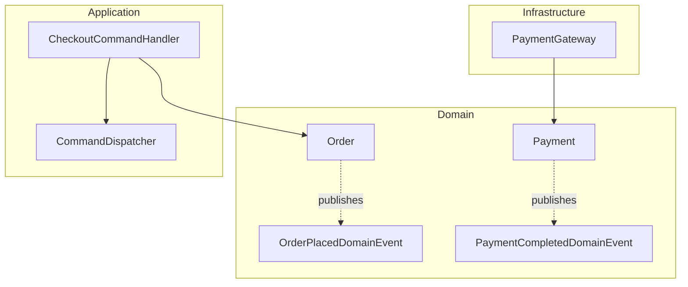
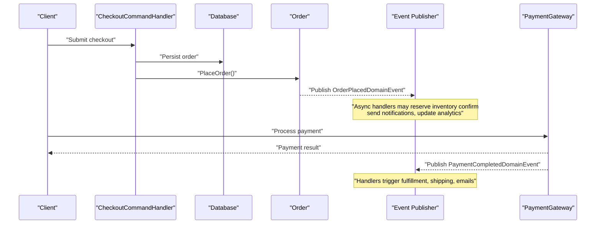
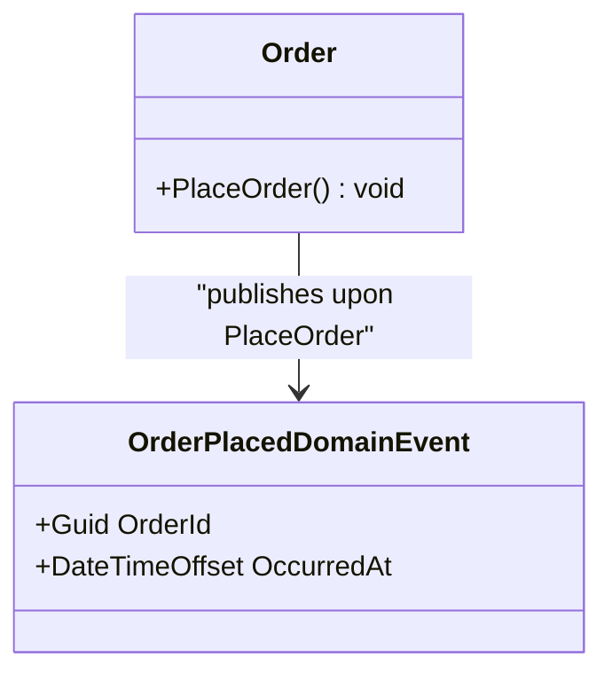
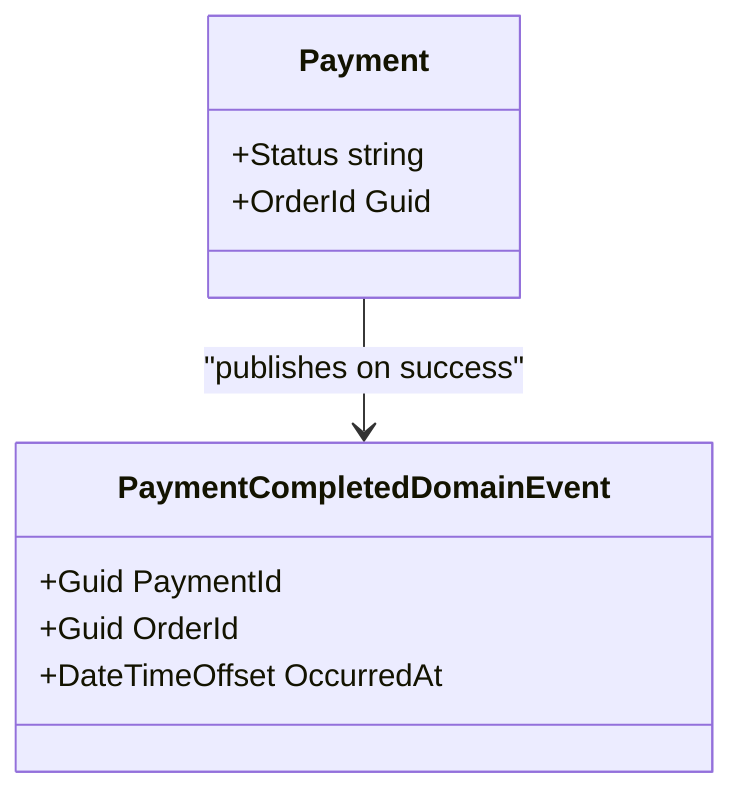
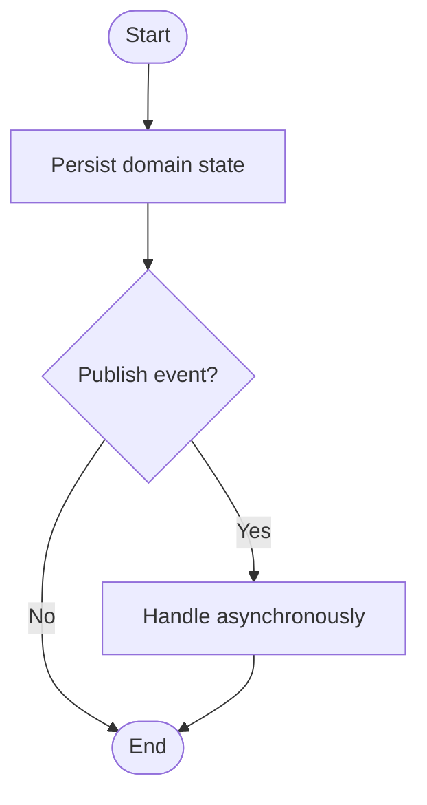
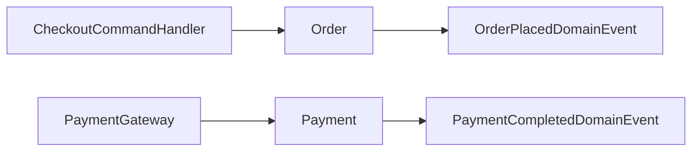

# Domain Events

<cite>
**Referenced Files in This Document**
- [OrderPlacedDomainEvent.cs](file://src/Ecommerce.Domain/DomainEvents/OrderPlacedDomainEvent.cs)
- [PaymentCompletedDomainEvent.cs](file://src/Ecommerce.Domain/DomainEvents/PaymentCompletedDomainEvent.cs)
- [Order.cs](file://src/Ecommerce.Domain/Entities/Order.cs)
- [Payment.cs](file://src/Ecommerce.Domain/Entities/Payment.cs)
- [CheckoutCommandHandler.cs](file://src/Ecommerce.Application/Commands/Checkout/CheckoutCommandHandler.cs)
- [CommandDispatcher.cs](file://src/Ecommerce.Application/Common/Commands/CommandDispatcher.cs)
- [PaymentGateway.cs](file://src/Ecommerce.Infrastructure/Payments/PaymentGateway.cs)
</cite>

## Table of Contents
1. Introduction
2. Project Structure
3. Core Components
4. Architecture Overview
5. Detailed Component Analysis
6. Dependency Analysis
7. Performance Considerations
8. Troubleshooting Guide
9. Conclusion
10. Appendices

## Introduction
This document explains how domain events enable loose coupling within the E-Commerce system’s domain layer and outlines a practical event-driven approach for order creation and payment completion. It focuses on two concrete domain events:
- OrderPlacedDomainEvent: signals that an order has been placed, enabling downstream processes such as inventory reservation confirmation, notifications, analytics, or audit logging.
- PaymentCompletedDomainEvent: signals that payment has completed successfully, triggering fulfillment workflows, shipping preparation, and customer communications.

The goal is to decouple core domain behavior from side effects by publishing immutable facts about state changes. Consumers can react asynchronously without tight coupling to the domain entities.

## Project Structure
Domain events are defined in the Domain project under a dedicated namespace, keeping them close to the domain logic they describe. The application layer orchestrates commands and persists domain state; infrastructure provides external integrations (e.g., payments). This separation supports clear boundaries and testability.

**Diagram sources**
- [Order.cs:89-102](file://src/Ecommerce.Domain/Entities/Order.cs#L89-L102)
- [OrderPlacedDomainEvent.cs:5-14](file://src/Ecommerce.Domain/DomainEvents/OrderPlacedDomainEvent.cs#L5-L14)
- [PaymentCompletedDomainEvent.cs:5-16](file://src/Ecommerce.Domain/DomainEvents/PaymentCompletedDomainEvent.cs#L5-L16)
- [CheckoutCommandHandler.cs:22-90](file://src/Ecommerce.Application/Commands/Checkout/CheckoutCommandHandler.cs#L22-L90)
- [CommandDispatcher.cs:20-44](file://src/Ecommerce.Application/Common/Commands/CommandDispatcher.cs#L20-L44)
- [PaymentGateway.cs:10-22](file://src/Ecommerce.Infrastructure/Payments/PaymentGateway.cs#L10-L22)

**Section sources**
- [Order.cs:89-102](file://src/Ecommerce.Domain/Entities/Order.cs#L89-L102)
- [OrderPlacedDomainEvent.cs:5-14](file://src/Ecommerce.Domain/DomainEvents/OrderPlacedDomainEvent.cs#L5-L14)
- [PaymentCompletedDomainEvent.cs:5-16](file://src/Ecommerce.Domain/DomainEvents/PaymentCompletedDomainEvent.cs#L5-L16)
- [CheckoutCommandHandler.cs:22-90](file://src/Ecommerce.Application/Commands/Checkout/CheckoutCommandHandler.cs#L22-L90)
- [CommandDispatcher.cs:20-44](file://src/Ecommerce.Application/Common/Commands/CommandDispatcher.cs#L20-L44)
- [PaymentGateway.cs:10-22](file://src/Ecommerce.Infrastructure/Payments/PaymentGateway.cs#L10-L22)

## Core Components
- OrderPlacedDomainEvent: Represents the fact that an order was successfully placed. Payload includes the order identifier and a timestamp indicating when the event occurred.
- PaymentCompletedDomainEvent: Represents successful payment completion. Payload includes the payment identifier, associated order identifier, and a timestamp.

These events are immutable value-like facts about domain state transitions. They should be published after the domain state change is persisted to ensure consistency between the database and the event stream.

Key design principles:
- Immutability: Events capture a point-in-time snapshot of what happened.
- Minimal payload: Only include data necessary for consumers to act.
- Stable identifiers: Use stable IDs (OrderId, PaymentId) to correlate related events.
- Timestamps: Include OccurredAt to support ordering and time-based queries.

**Section sources**
- [OrderPlacedDomainEvent.cs:5-14](file://src/Ecommerce.Domain/DomainEvents/OrderPlacedDomainEvent.cs#L5-L14)
- [PaymentCompletedDomainEvent.cs:5-16](file://src/Ecommerce.Domain/DomainEvents/PaymentCompletedDomainEvent.cs#L5-L16)

## Architecture Overview
The event-driven flow integrates with existing command handling and infrastructure services:

**Diagram sources**
- [CheckoutCommandHandler.cs:22-90](file://src/Ecommerce.Application/Commands/Checkout/CheckoutCommandHandler.cs#L22-L90)
- [Order.cs:89-102](file://src/Ecommerce.Domain/Entities/Order.cs#L89-L102)
- [OrderPlacedDomainEvent.cs:5-14](file://src/Ecommerce.Domain/DomainEvents/OrderPlacedDomainEvent.cs#L5-L14)
- [PaymentCompletedDomainEvent.cs:5-16](file://src/Ecommerce.Domain/DomainEvents/PaymentCompletedDomainEvent.cs#L5-L16)
- [PaymentGateway.cs:10-22](file://src/Ecommerce.Infrastructure/Payments/PaymentGateway.cs#L10-L22)

## Detailed Component Analysis

### OrderPlacedDomainEvent
Purpose:
- Notifies interested parties that an order has been placed, enabling downstream processing such as inventory reservation confirmation, email notifications, analytics ingestion, and audit logging.

Payload design:
- OrderId: Unique identifier for the order being placed.
- OccurredAt: UTC timestamp when the event was created.

Naming convention:
- Verb-noun pattern reflecting a completed action in the domain (e.g., “OrderPlaced”).

Integration points:
- Should be published after Order.PlaceOrder() completes and the order is persisted.
- Consumers subscribe to this event to perform side effects without coupling to Order internals.

**Diagram sources**
- [Order.cs:89-102](file://src/Ecommerce.Domain/Entities/Order.cs#L89-L102)
- [OrderPlacedDomainEvent.cs:5-14](file://src/Ecommerce.Domain/DomainEvents/OrderPlacedDomainEvent.cs#L5-L14)

**Section sources**
- [Order.cs:89-102](file://src/Ecommerce.Domain/Entities/Order.cs#L89-L102)
- [OrderPlacedDomainEvent.cs:5-14](file://src/Ecommerce.Domain/DomainEvents/OrderPlacedDomainEvent.cs#L5-L14)

### PaymentCompletedDomainEvent
Purpose:
- Signals that payment has completed successfully, allowing downstream systems to proceed with fulfillment, shipping, invoicing, and customer communication.

Payload design:
- PaymentId: Unique identifier for the payment transaction.
- OrderId: Associates the payment with the corresponding order.
- OccurredAt: UTC timestamp when the event was created.

Naming convention:
- Reflects a completed business action (“PaymentCompleted”) to indicate finality.

Integration points:
- Publish after payment success is confirmed by the payment provider or gateway.
- Downstream handlers can transition order status to paid and initiate fulfillment workflows.

**Diagram sources**
- [Payment.cs:5-21](file://src/Ecommerce.Domain/Entities/Payment.cs#L5-L21)
- [PaymentCompletedDomainEvent.cs:5-16](file://src/Ecommerce.Domain/DomainEvents/PaymentCompletedDomainEvent.cs#L5-L16)

**Section sources**
- [Payment.cs:5-21](file://src/Ecommerce.Domain/Entities/Payment.cs#L5-L21)
- [PaymentCompletedDomainEvent.cs:5-16](file://src/Ecommerce.Domain/DomainEvents/PaymentCompletedDomainEvent.cs#L5-L16)

### Event Publishing and Handling Patterns
Recommended patterns:
- Publish after persistence: Ensure the domain state is committed before publishing events to avoid inconsistent states.
- Asynchronous handling: Use background workers or message brokers to process events without blocking the caller.
- Idempotent handlers: Design handlers to tolerate duplicates using unique keys (e.g., OrderId, PaymentId).
- Outbox pattern: Persist events atomically with domain state changes, then publish reliably.

Example flows:
- Order placement: CheckoutCommandHandler persists the order and triggers Order.PlaceOrder(), which publishes OrderPlacedDomainEvent.
- Payment completion: PaymentGateway returns success; application code updates Payment and publishes PaymentCompletedDomainEvent.

[No sources needed since this diagram shows conceptual workflow, not actual code structure]

**Section sources**
- [CheckoutCommandHandler.cs:22-90](file://src/Ecommerce.Application/Commands/Checkout/CheckoutCommandHandler.cs#L22-L90)
- [CommandDispatcher.cs:20-44](file://src/Ecommerce.Application/Common/Commands/CommandDispatcher.cs#L20-L44)
- [PaymentGateway.cs:10-22](file://src/Ecommerce.Infrastructure/Payments/PaymentGateway.cs#L10-L22)

## Dependency Analysis
Coupling and cohesion:
- Domain events reside in the Domain layer, promoting cohesion around business facts.
- Application and Infrastructure layers depend on these events via publishers/subscribers, maintaining loose coupling.

Direct dependencies:
- Order depends on its own lifecycle methods; events are published externally or via a publisher abstraction.
- PaymentCompletedDomainEvent depends on Payment state changes.

Potential circular dependencies:
- Avoid having domain entities directly depend on event infrastructure. Use abstractions or separate publishers to prevent cycles.

External integration points:
- PaymentGateway interacts with external providers; results drive PaymentCompletedDomainEvent publication.

**Diagram sources**
- [Order.cs:89-102](file://src/Ecommerce.Domain/Entities/Order.cs#L89-L102)
- [OrderPlacedDomainEvent.cs:5-14](file://src/Ecommerce.Domain/DomainEvents/OrderPlacedDomainEvent.cs#L5-L14)
- [Payment.cs:5-21](file://src/Ecommerce.Domain/Entities/Payment.cs#L5-L21)
- [PaymentCompletedDomainEvent.cs:5-16](file://src/Ecommerce.Domain/DomainEvents/PaymentCompletedDomainEvent.cs#L5-L16)
- [CheckoutCommandHandler.cs:22-90](file://src/Ecommerce.Application/Commands/Checkout/CheckoutCommandHandler.cs#L22-L90)
- [PaymentGateway.cs:10-22](file://src/Ecommerce.Infrastructure/Payments/PaymentGateway.cs#L10-L22)

**Section sources**
- [Order.cs:89-102](file://src/Ecommerce.Domain/Entities/Order.cs#L89-L102)
- [OrderPlacedDomainEvent.cs:5-14](file://src/Ecommerce.Domain/DomainEvents/OrderPlacedDomainEvent.cs#L5-L14)
- [Payment.cs:5-21](file://src/Ecommerce.Domain/Entities/Payment.cs#L5-L21)
- [PaymentCompletedDomainEvent.cs:5-16](file://src/Ecommerce.Domain/DomainEvents/PaymentCompletedDomainEvent.cs#L5-L16)
- [CheckoutCommandHandler.cs:22-90](file://src/Ecommerce.Application/Commands/Checkout/CheckoutCommandHandler.cs#L22-L90)
- [PaymentGateway.cs:10-22](file://src/Ecommerce.Infrastructure/Payments/PaymentGateway.cs#L10-L22)

## Performance Considerations
- Keep payloads small to reduce serialization overhead and network bandwidth.
- Publish events asynchronously to avoid blocking user requests.
- Use idempotency keys and deduplication in handlers to handle retries safely.
- Batch or aggregate events where appropriate for high-volume scenarios.
- Monitor event throughput and latency; scale consumers horizontally.

[No sources needed since this section provides general guidance]

## Troubleshooting Guide
Common issues and mitigations:
- Duplicate events: Implement idempotent handlers keyed by OrderId or PaymentId.
- Ordering issues: Use OccurredAt and sequence numbers if strict ordering is required.
- Backward compatibility: Version events when changing payloads; maintain multiple versions during migration.
- Missing handlers: Ensure all subscribers are registered and healthy; add dead-letter queues for failed processing.
- Inconsistent state: Publish events only after successful persistence; consider outbox pattern.

**Section sources**
- [OrderPlacedDomainEvent.cs:5-14](file://src/Ecommerce.Domain/DomainEvents/OrderPlacedDomainEvent.cs#L5-L14)
- [PaymentCompletedDomainEvent.cs:5-16](file://src/Ecommerce.Domain/DomainEvents/PaymentCompletedDomainEvent.cs#L5-L16)

## Conclusion
Domain events provide a robust mechanism for decoupling domain components and enabling scalable, asynchronous workflows. By defining clear, minimal, and versioned events like OrderPlacedDomainEvent and PaymentCompletedDomainEvent, the system can evolve independently across teams while maintaining consistency and reliability. Adopting best practices such as immutability, idempotency, and outbox publishing ensures a resilient event-driven architecture.

[No sources needed since this section summarizes without analyzing specific files]

## Appendices

### Event Structure and Naming Conventions
- Names: Use verb-noun format describing a completed domain action (e.g., OrderPlaced, PaymentCompleted).
- Payload fields:
  - OrderId: Guid identifying the order.
  - PaymentId: Guid identifying the payment.
  - OccurredAt: DateTimeOffset.UtcNow for consistent timestamps.
- Immutability: Events should be immutable once created.

**Section sources**
- [OrderPlacedDomainEvent.cs:5-14](file://src/Ecommerce.Domain/DomainEvents/OrderPlacedDomainEvent.cs#L5-L14)
- [PaymentCompletedDomainEvent.cs:5-16](file://src/Ecommerce.Domain/DomainEvents/PaymentCompletedDomainEvent.cs#L5-L16)

### Event Versioning Strategies and Backward Compatibility
- Add new fields as optional to preserve backward compatibility.
- Introduce versioned event types (e.g., OrderPlacedV2) when breaking changes are unavoidable.
- Support multiple event versions during migration windows.
- Use schema registries or contracts to validate event shapes at runtime.

[No sources needed since this section provides general guidance]

### Best Practices for Effective Domain Events
- Publish after persistence to ensure consistency.
- Keep payloads minimal and focused on consumer needs.
- Make handlers idempotent and resilient to retries.
- Use correlation IDs to trace events across systems.
- Monitor and alert on event processing failures.

[No sources needed since this section provides general guidance]