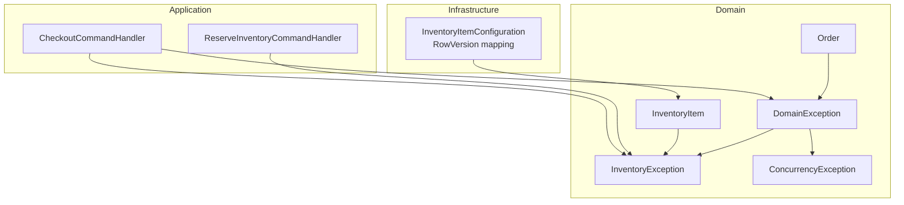
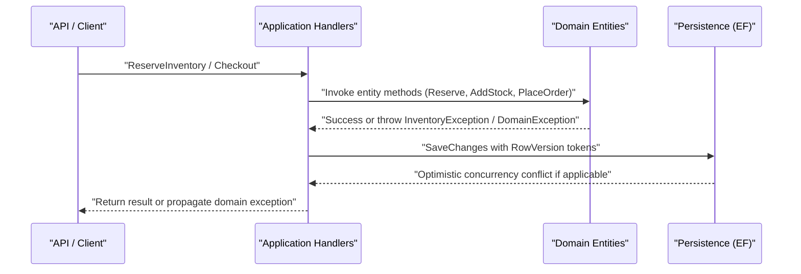
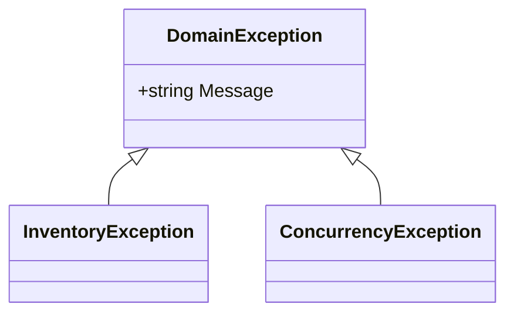
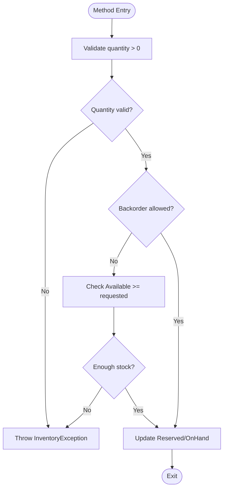
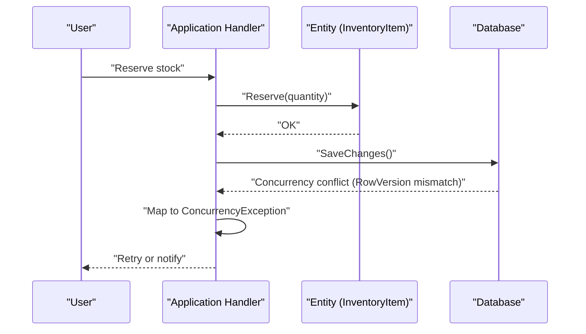
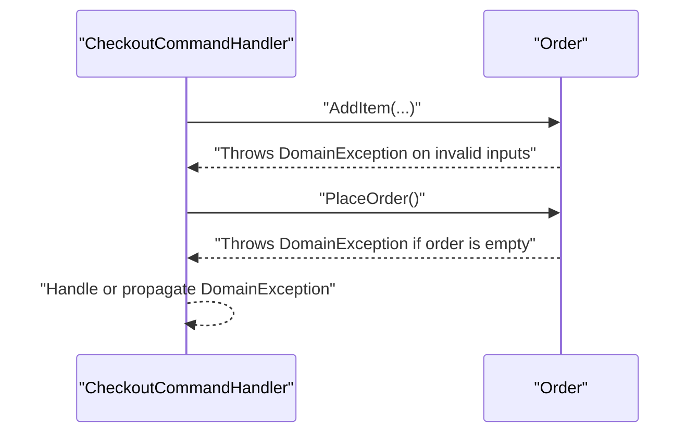
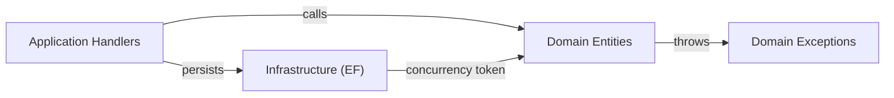

# Domain Exceptions

<cite>
**Referenced Files in This Document**
- [DomainException.cs](file://src/Ecommerce.Domain/Exceptions/DomainException.cs)
- [ConcurrencyException.cs](file://src/Ecommerce.Domain/Exceptions/ConcurrencyException.cs)
- [InventoryException.cs](file://src/Ecommerce.Domain/Exceptions/InventoryException.cs)
- [InventoryItem.cs](file://src/Ecommerce.Domain/Entities/InventoryItem.cs)
- [Order.cs](file://src/Ecommerce.Domain/Entities/Order.cs)
- [ReserveInventoryCommandHandler.cs](file://src/Ecommerce.Application/Commands/ReserveInventory/ReserveInventoryCommandHandler.cs)
- [CheckoutCommandHandler.cs](file://src/Ecommerce.Application/Commands/Checkout/CheckoutCommandHandler.cs)
- [InventoryItemConfiguration.cs](file://src/Ecommerce.Infrastructure/Persistence/Configurations/InventoryItemConfiguration.cs)
- [domain_rules_and_usecases.md](file://docs/architecture/domain_rules_and_usecases.md)
- [InventoryItemTests.cs](file://tests/Ecommerce.Domain.Tests/InventoryItemTests.cs)
</cite>

## Table of Contents
1. Introduction
2. Project Structure
3. Core Components
4. Architecture Overview
5. Detailed Component Analysis
6. Dependency Analysis
7. Performance Considerations
8. Troubleshooting Guide
9. Conclusion

## Introduction
This document explains the domain exception hierarchy and error handling strategies used to protect business invariants in the Domain Layer. It focuses on:
- DomainException as the base class for all domain-specific errors
- ConcurrencyException for optimistic locking conflicts and data races
- InventoryException for inventory-related business rule violations
It also clarifies when to use domain exceptions versus application-level exceptions, how they preserve domain integrity, and how they provide meaningful error messages to upper layers.

## Project Structure
The exception types are defined in the Domain project and consumed by Domain entities and Application handlers. Infrastructure provides persistence configuration that enables optimistic concurrency via a row version token. Tests validate domain behavior and exception throwing.

**Diagram sources**
- [DomainException.cs:5-8](file://src/Ecommerce.Domain/Exceptions/DomainException.cs#L5-L8)
- [InventoryException.cs:5-8](file://src/Ecommerce.Domain/Exceptions/InventoryException.cs#L5-L8)
- [ConcurrencyException.cs:5-8](file://src/Ecommerce.Domain/Exceptions/ConcurrencyException.cs#L5-L8)
- [InventoryItem.cs:22-67](file://src/Ecommerce.Domain/Entities/InventoryItem.cs#L22-L67)
- [Order.cs:36-102](file://src/Ecommerce.Domain/Entities/Order.cs#L36-L102)
- [ReserveInventoryCommandHandler.cs:17-28](file://src/Ecommerce.Application/Commands/ReserveInventory/ReserveInventoryCommandHandler.cs#L17-L28)
- [CheckoutCommandHandler.cs:22-90](file://src/Ecommerce.Application/Commands/Checkout/CheckoutCommandHandler.cs#L22-L90)
- [InventoryItemConfiguration.cs:23-27](file://src/Ecommerce.Infrastructure/Persistence/Configurations/InventoryItemConfiguration.cs#L23-L27)

**Section sources**
- [DomainException.cs:5-8](file://src/Ecommerce.Domain/Exceptions/DomainException.cs#L5-L8)
- [InventoryException.cs:5-8](file://src/Ecommerce.Domain/Exceptions/InventoryException.cs#L5-L8)
- [ConcurrencyException.cs:5-8](file://src/Ecommerce.Domain/Exceptions/ConcurrencyException.cs#L5-L8)
- [InventoryItem.cs:22-67](file://src/Ecommerce.Domain/Entities/InventoryItem.cs#L22-L67)
- [Order.cs:36-102](file://src/Ecommerce.Domain/Entities/Order.cs#L36-L102)
- [ReserveInventoryCommandHandler.cs:17-28](file://src/Ecommerce.Application/Commands/ReserveInventory/ReserveInventoryCommandHandler.cs#L17-L28)
- [CheckoutCommandHandler.cs:22-90](file://src/Ecommerce.Application/Commands/Checkout/CheckoutCommandHandler.cs#L22-L90)
- [InventoryItemConfiguration.cs:23-27](file://src/Ecommerce.Infrastructure/Persistence/Configurations/InventoryItemConfiguration.cs#L23-L27)

## Core Components
- DomainException: Base exception for all domain-specific errors. Use it to signal invariant violations within domain logic or application orchestration where the failure is domain-scoped.
- InventoryException: Specialized domain exception for inventory business rules (e.g., insufficient stock, invalid reservation/release quantities). Thrown by InventoryItem methods when invariants cannot be satisfied.
- ConcurrencyException: Specialized domain exception for optimistic locking conflicts and data races. Use it when concurrent updates would violate consistency (e.g., conflicting reservations), enabling clear signaling to callers for retry or user feedback.

Design principles:
- Keep exceptions close to the invariant they protect. For example, inventory invariants live in InventoryItem; therefore, throw InventoryException there.
- Prefer domain exceptions over generic exceptions to communicate business meaning across layers.
- Provide concise, actionable messages that describe what violated the invariant and why.

**Section sources**
- [DomainException.cs:5-8](file://src/Ecommerce.Domain/Exceptions/DomainException.cs#L5-L8)
- [InventoryException.cs:5-8](file://src/Ecommerce.Domain/Exceptions/InventoryException.cs#L5-L8)
- [ConcurrencyException.cs:5-8](file://src/Ecommerce.Domain/Exceptions/ConcurrencyException.cs#L5-L8)
- [InventoryItem.cs:22-67](file://src/Ecommerce.Domain/Entities/InventoryItem.cs#L22-L67)
- [Order.cs:36-102](file://src/Ecommerce.Domain/Entities/Order.cs#L36-L102)

## Architecture Overview
The exception hierarchy enforces domain integrity at the boundary of business logic. Entities enforce invariants and throw domain exceptions. Application handlers coordinate workflows and may also throw domain exceptions when preconditions fail. Infrastructure configures optimistic concurrency tokens so that concurrent modifications can be detected and handled consistently.

**Diagram sources**
- [ReserveInventoryCommandHandler.cs:17-28](file://src/Ecommerce.Application/Commands/ReserveInventory/ReserveInventoryCommandHandler.cs#L17-L28)
- [CheckoutCommandHandler.cs:22-90](file://src/Ecommerce.Application/Commands/Checkout/CheckoutCommandHandler.cs#L22-L90)
- [InventoryItem.cs:22-67](file://src/Ecommerce.Domain/Entities/InventoryItem.cs#L22-L67)
- [Order.cs:36-102](file://src/Ecommerce.Domain/Entities/Order.cs#L36-L102)
- [InventoryItemConfiguration.cs:23-27](file://src/Ecommerce.Infrastructure/Persistence/Configurations/InventoryItemConfiguration.cs#L23-L27)

## Detailed Component Analysis

### Exception Hierarchy Design
- DomainException is the root for domain-specific failures. It carries a message describing the violated invariant.
- InventoryException extends DomainException to specialize inventory-related violations.
- ConcurrencyException extends DomainException to specialize optimistic locking and race condition scenarios.

**Diagram sources**
- [DomainException.cs:5-8](file://src/Ecommerce.Domain/Exceptions/DomainException.cs#L5-L8)
- [InventoryException.cs:5-8](file://src/Ecommerce.Domain/Exceptions/InventoryException.cs#L5-L8)
- [ConcurrencyException.cs:5-8](file://src/Ecommerce.Domain/Exceptions/ConcurrencyException.cs#L5-L8)

**Section sources**
- [DomainException.cs:5-8](file://src/Ecommerce.Domain/Exceptions/DomainException.cs#L5-L8)
- [InventoryException.cs:5-8](file://src/Ecommerce.Domain/Exceptions/InventoryException.cs#L5-L8)
- [ConcurrencyException.cs:5-8](file://src/Ecommerce.Domain/Exceptions/ConcurrencyException.cs#L5-L8)

### InventoryException Usage in Business Logic
InventoryItem enforces key invariants:
- Positive quantity for add/reserve/release/remove operations
- Sufficient available stock when backorders are not allowed
- Release cannot exceed reserved quantity

These validations throw InventoryException with descriptive messages, ensuring that invalid state transitions never occur.

**Diagram sources**
- [InventoryItem.cs:22-67](file://src/Ecommerce.Domain/Entities/InventoryItem.cs#L22-L67)

**Section sources**
- [InventoryItem.cs:22-67](file://src/Ecommerce.Domain/Entities/InventoryItem.cs#L22-L67)
- [InventoryItemTests.cs:10-36](file://tests/Ecommerce.Domain.Tests/InventoryItemTests.cs#L10-L36)

### ConcurrencyException and Optimistic Locking
- The InventoryItem entity includes a RowVersion property configured as a concurrency token in infrastructure mappings.
- When multiple requests attempt to modify the same inventory item concurrently, EF Core detects mismatches in RowVersion during SaveChanges, indicating an optimistic locking conflict.
- ConcurrencyException should be thrown to represent this scenario in domain terms, allowing callers to decide whether to retry or inform the user.

**Diagram sources**
- [InventoryItemConfiguration.cs:23-27](file://src/Ecommerce.Infrastructure/Persistence/Configurations/InventoryItemConfiguration.cs#L23-L27)
- [InventoryItem.cs:17-18](file://src/Ecommerce.Domain/Entities/InventoryItem.cs#L17-L18)
- [ConcurrencyException.cs:5-8](file://src/Ecommerce.Domain/Exceptions/ConcurrencyException.cs#L5-L8)

**Section sources**
- [InventoryItemConfiguration.cs:23-27](file://src/Ecommerce.Infrastructure/Persistence/Configurations/InventoryItemConfiguration.cs#L23-L27)
- [InventoryItem.cs:17-18](file://src/Ecommerce.Domain/Entities/InventoryItem.cs#L17-L18)
- [ConcurrencyException.cs:5-8](file://src/Ecommerce.Domain/Exceptions/ConcurrencyException.cs#L5-L8)

### DomainException Usage in Order and Application Orchestration
- Order validates preconditions such as positive quantities and non-negative unit prices, throwing DomainException when violated.
- Application handlers may also throw DomainException for higher-level domain constraints, such as idempotency registration failures or empty orders.

**Diagram sources**
- [Order.cs:36-102](file://src/Ecommerce.Domain/Entities/Order.cs#L36-L102)
- [CheckoutCommandHandler.cs:22-90](file://src/Ecommerce.Application/Commands/Checkout/CheckoutCommandHandler.cs#L22-L90)

**Section sources**
- [Order.cs:36-102](file://src/Ecommerce.Domain/Entities/Order.cs#L36-L102)
- [CheckoutCommandHandler.cs:22-90](file://src/Ecommerce.Application/Commands/Checkout/CheckoutCommandHandler.cs#L22-L90)

### When to Use Domain Exceptions vs Application-Level Exceptions
- Use DomainException (and its specialized subclasses) when:
  - A domain invariant is violated inside an entity or value object
  - An application command fails due to a domain constraint (e.g., idempotency key conflict)
- Avoid using domain exceptions for:
  - Technical failures (network timeouts, database connectivity) — these belong to infrastructure or application concerns
  - Input validation failures from clients — prefer application-layer validation results
- Benefits:
  - Clear separation of concerns between domain rules and technical concerns
  - Meaningful error messages that reflect business context
  - Consistent propagation to upper layers for unified handling

**Section sources**
- [domain_rules_and_usecases.md:3-17](file://docs/architecture/domain_rules_and_usecases.md#L3-L17)
- [CheckoutCommandHandler.cs:22-90](file://src/Ecommerce.Application/Commands/Checkout/CheckoutCommandHandler.cs#L22-L90)

## Dependency Analysis
- Domain layer defines exceptions and entities that throw them.
- Application layer consumes domain entities and may throw domain exceptions for orchestration-level constraints.
- Infrastructure maps entities to storage and configures concurrency tokens that enable detection of data races.

**Diagram sources**
- [ReserveInventoryCommandHandler.cs:17-28](file://src/Ecommerce.Application/Commands/ReserveInventory/ReserveInventoryCommandHandler.cs#L17-L28)
- [CheckoutCommandHandler.cs:22-90](file://src/Ecommerce.Application/Commands/Checkout/CheckoutCommandHandler.cs#L22-L90)
- [InventoryItem.cs:22-67](file://src/Ecommerce.Domain/Entities/InventoryItem.cs#L22-L67)
- [Order.cs:36-102](file://src/Ecommerce.Domain/Entities/Order.cs#L36-L102)
- [InventoryItemConfiguration.cs:23-27](file://src/Ecommerce.Infrastructure/Persistence/Configurations/InventoryItemConfiguration.cs#L23-L27)

**Section sources**
- [ReserveInventoryCommandHandler.cs:17-28](file://src/Ecommerce.Application/Commands/ReserveInventory/ReserveInventoryCommandHandler.cs#L17-L28)
- [CheckoutCommandHandler.cs:22-90](file://src/Ecommerce.Application/Commands/Checkout/CheckoutCommandHandler.cs#L22-L90)
- [InventoryItem.cs:22-67](file://src/Ecommerce.Domain/Entities/InventoryItem.cs#L22-L67)
- [Order.cs:36-102](file://src/Ecommerce.Domain/Entities/Order.cs#L36-L102)
- [InventoryItemConfiguration.cs:23-27](file://src/Ecommerce.Infrastructure/Persistence/Configurations/InventoryItemConfiguration.cs#L23-L27)

## Performance Considerations
- Validate early in entity methods to fail fast and avoid unnecessary work.
- Use optimistic concurrency (RowVersion) to detect conflicts quickly without heavy locking.
- Keep exception creation minimal; only throw when necessary to maintain performance under normal flows.
- In high-concurrency scenarios, consider retry policies at the application layer for transient concurrency conflicts.

[No sources needed since this section provides general guidance]

## Troubleshooting Guide
Common issues and resolutions:
- Insufficient stock during reservation:
  - Ensure AllowBackorder is set appropriately and sufficient QuantityOnHand exists.
  - Verify that Reserve is called with correct quantities and that previous reservations were released if needed.
- Cannot release more than reserved:
  - Confirm that Release is invoked with a quantity less than or equal to QuantityReserved.
- Empty order placement:
  - Ensure at least one item is added before placing the order.
- Idempotency conflicts:
  - If registering an idempotency key fails, handle the resulting domain exception by returning or retrying based on system policy.

**Section sources**
- [InventoryItem.cs:22-67](file://src/Ecommerce.Domain/Entities/InventoryItem.cs#L22-L67)
- [Order.cs:36-102](file://src/Ecommerce.Domain/Entities/Order.cs#L36-L102)
- [CheckoutCommandHandler.cs:22-90](file://src/Ecommerce.Application/Commands/Checkout/CheckoutCommandHandler.cs#L22-L90)
- [InventoryItemTests.cs:10-36](file://tests/Ecommerce.Domain.Tests/InventoryItemTests.cs#L10-L36)

## Conclusion
The domain exception hierarchy centralizes business rule enforcement and communicates clear, meaningful errors to upper layers. InventoryException protects inventory invariants, ConcurrencyException signals optimistic locking conflicts, and DomainException covers broader domain constraints. By throwing these exceptions close to the invariant and handling them consistently in application handlers, the system maintains domain integrity while providing actionable feedback to clients and operators.

[No sources needed since this section summarizes without analyzing specific files]