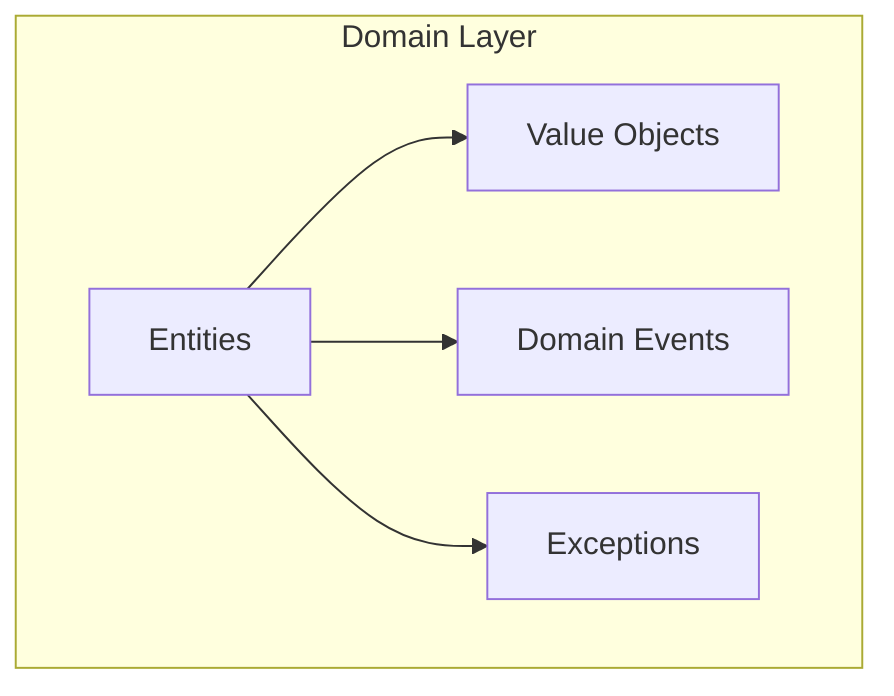
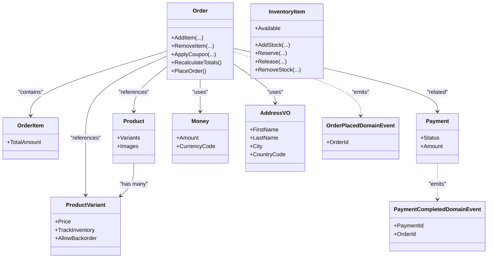
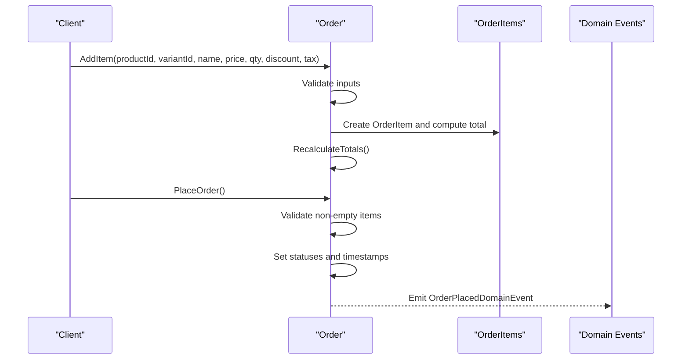
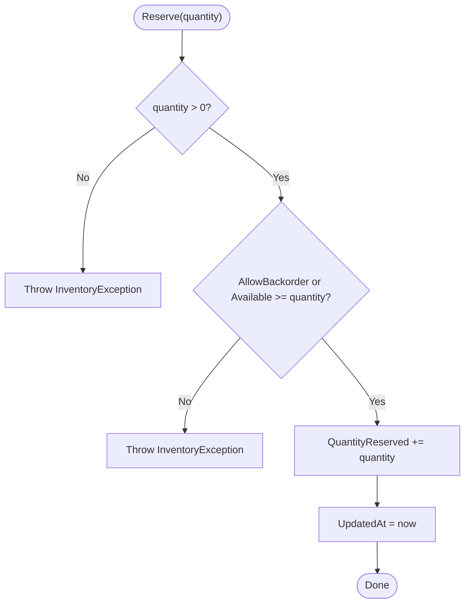
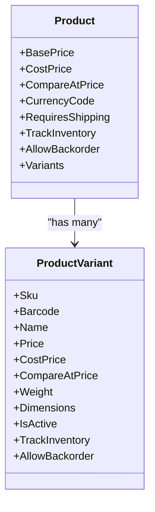
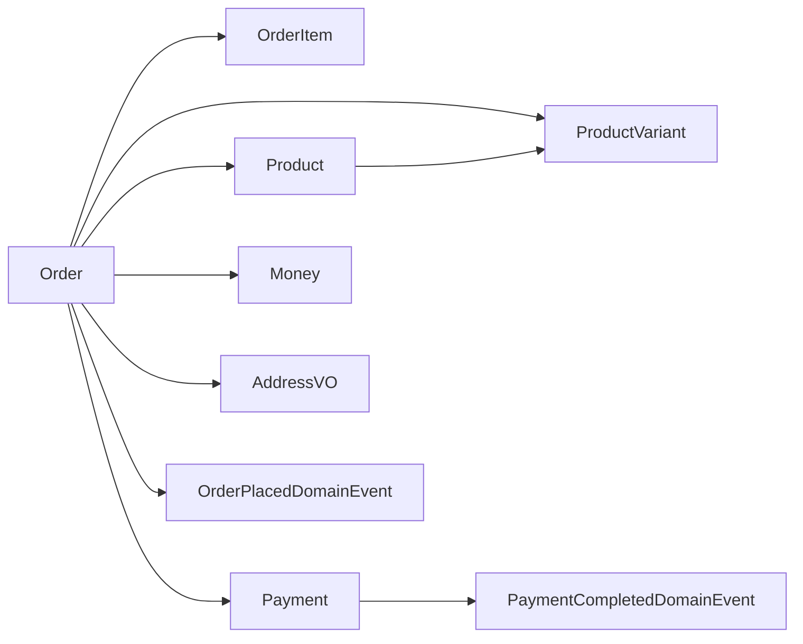

# Domain Layer

<cite>
**Referenced Files in This Document**
- [Product.cs](file://src/Ecommerce.Domain/Entities/Product.cs)
- [Order.cs](file://src/Ecommerce.Domain/Entities/Order.cs)
- [InventoryItem.cs](file://src/Ecommerce.Domain/Entities/InventoryItem.cs)
- [UserProfile.cs](file://src/Ecommerce.Domain/Entities/UserProfile.cs)
- [Payment.cs](file://src/Ecommerce.Domain/Entities/Payment.cs)
- [OrderItem.cs](file://src/Ecommerce.Domain/Entities/OrderItem.cs)
- [ProductVariant.cs](file://src/Ecommerce.Domain/Entities/ProductVariant.cs)
- [Cart.cs](file://src/Ecommerce.Domain/Entities/Cart.cs)
- [CartItem.cs](file://src/Ecommerce.Domain/Entities/CartItem.cs)
- [Money.cs](file://src/Ecommerce.Domain/ValueObjects/Money.cs)
- [AddressVO.cs](file://src/Ecommerce.Domain/ValueObjects/AddressVO.cs)
- [OrderPlacedDomainEvent.cs](file://src/Ecommerce.Domain/DomainEvents/OrderPlacedDomainEvent.cs)
- [PaymentCompletedDomainEvent.cs](file://src/Ecommerce.Domain/DomainEvents/PaymentCompletedDomainEvent.cs)
- [DomainException.cs](file://src/Ecommerce.Domain/Exceptions/DomainException.cs)
- [InventoryException.cs](file://src/Ecommerce.Domain/Exceptions/InventoryException.cs)
- [ConcurrencyException.cs](file://src/Ecommerce.Domain/Exceptions/ConcurrencyException.cs)
</cite>

## Table of Contents
1. Introduction
2. Project Structure
3. Core Components
4. Architecture Overview
5. Detailed Component Analysis
6. Dependency Analysis
7. Performance Considerations
8. Troubleshooting Guide
9. Conclusion
10. Appendices

## Introduction
This document explains the Domain Layer of the E-Commerce Backend with a focus on core business entities, value objects, domain events, exceptions, and business rules. It emphasizes a rich domain model where entities encapsulate behavior and enforce invariants, contrasting it with anemic models that only hold data.

## Project Structure
The Domain Layer is organized into:
- Entities: Product, Order, InventoryItem, UserProfile, Payment, OrderItem, ProductVariant, Cart, CartItem
- Value Objects: Money, AddressVO
- Domain Events: OrderPlacedDomainEvent, PaymentCompletedDomainEvent
- Exceptions: DomainException, InventoryException, ConcurrencyException

[No sources needed since this diagram shows conceptual structure]

## Core Components
- Product: Represents catalog items with pricing, dimensions, and flags for digital products, shipping requirements, inventory tracking, and backorders. It relates to variants and images.
- Order: Aggregates order line items, enforces totals calculation, applies coupons, and transitions state when placed. It maintains audit timestamps and concurrency control via RowVersion.
- InventoryItem: Manages stock levels per product variant and warehouse, supports adding/removing stock, reserving/releasing quantities, and enforces backorder policies.
- UserProfile: Stores user profile details linked to a user identity.
- Payment: Records payment provider details, amounts, currency, status, and lifecycle timestamps.
- OrderItem: Snapshot of product information at time of order including price, quantity, discounts, taxes, and totals.
- ProductVariant: Variant-level attributes such as SKU, barcode, pricing, dimensions, and inventory controls.
- Cart and CartItem: Pre-checkout collection of items with unit prices and quantities.

Key behaviors and invariants are enforced within these entities to maintain consistency without relying on external services.

**Section sources**
- [Product.cs:6-42](file://src/Ecommerce.Domain/Entities/Product.cs#L6-L42)
- [Order.cs:8-103](file://src/Ecommerce.Domain/Entities/Order.cs#L8-L103)
- [InventoryItem.cs:6-68](file://src/Ecommerce.Domain/Entities/InventoryItem.cs#L6-L68)
- [UserProfile.cs:5-17](file://src/Ecommerce.Domain/Entities/UserProfile.cs#L5-L17)
- [Payment.cs:5-21](file://src/Ecommerce.Domain/Entities/Payment.cs#L5-L21)
- [OrderItem.cs:5-20](file://src/Ecommerce.Domain/Entities/OrderItem.cs#L5-L20)
- [ProductVariant.cs:5-26](file://src/Ecommerce.Domain/Entities/ProductVariant.cs#L5-L26)
- [Cart.cs:6-18](file://src/Ecommerce.Domain/Entities/Cart.cs#L6-L18)
- [CartItem.cs:5-15](file://src/Ecommerce.Domain/Entities/CartItem.cs#L5-L15)

## Architecture Overview
The domain model follows a rich object-oriented approach:
- Entities own their behavior and enforce invariants through methods.
- Value objects encapsulate immutable concepts like Money and AddressVO.
- Domain events capture significant business occurrences for decoupled communication.
- Exceptions represent domain-specific failures (e.g., insufficient stock).

**Diagram sources**
- [Order.cs:8-103](file://src/Ecommerce.Domain/Entities/Order.cs#L8-L103)
- [OrderItem.cs:5-20](file://src/Ecommerce.Domain/Entities/OrderItem.cs#L5-L20)
- [Product.cs:6-42](file://src/Ecommerce.Domain/Entities/Product.cs#L6-L42)
- [ProductVariant.cs:5-26](file://src/Ecommerce.Domain/Entities/ProductVariant.cs#L5-L26)
- [InventoryItem.cs:6-68](file://src/Ecommerce.Domain/Entities/InventoryItem.cs#L6-L68)
- [Payment.cs:5-21](file://src/Ecommerce.Domain/Entities/Payment.cs#L5-L21)
- [Money.cs:5-18](file://src/Ecommerce.Domain/ValueObjects/Money.cs#L5-L18)
- [AddressVO.cs:5-25](file://src/Ecommerce.Domain/ValueObjects/AddressVO.cs#L5-L25)
- [OrderPlacedDomainEvent.cs:5-14](file://src/Ecommerce.Domain/DomainEvents/OrderPlacedDomainEvent.cs#L5-L14)
- [PaymentCompletedDomainEvent.cs:5-16](file://src/Ecommerce.Domain/DomainEvents/PaymentCompletedDomainEvent.cs#L5-L16)

## Detailed Component Analysis

### Order Entity
- Responsibilities:
  - Add/remove order items with validation.
  - Apply coupon discounts and recalculate totals consistently.
  - Place order with state transitions and timestamp updates.
- Business rules and invariants:
  - Quantity must be positive; unit price cannot be negative.
  - Cannot place an empty order.
  - Totals include subtotal, item-level discounts, coupon discount, shipping, and tax.
- Consistency mechanisms:
  - Recalculates totals after mutations.
  - Updates UpdatedAt and initializes CreatedAt when necessary.
  - Uses RowVersion for optimistic concurrency.

**Diagram sources**
- [Order.cs:36-102](file://src/Ecommerce.Domain/Entities/Order.cs#L36-L102)
- [OrderPlacedDomainEvent.cs:5-14](file://src/Ecommerce.Domain/DomainEvents/OrderPlacedDomainEvent.cs#L5-L14)

**Section sources**
- [Order.cs:36-102](file://src/Ecommerce.Domain/Entities/Order.cs#L36-L102)
- [OrderItem.cs:5-20](file://src/Ecommerce.Domain/Entities/OrderItem.cs#L5-L20)

### InventoryItem Entity
- Responsibilities:
  - Manage stock levels and reservations per product variant and warehouse.
  - Enforce backorder policy and availability checks.
- Business rules and invariants:
  - All quantity operations require positive values.
  - Reservation requires sufficient available stock unless backorders are allowed.
  - Release cannot exceed reserved quantity.
  - Removal ensures stock never goes negative.

**Diagram sources**
- [InventoryItem.cs:29-40](file://src/Ecommerce.Domain/Entities/InventoryItem.cs#L29-L40)

**Section sources**
- [InventoryItem.cs:6-68](file://src/Ecommerce.Domain/Entities/InventoryItem.cs#L6-L68)

### Product and ProductVariant
- Product:
  - Holds base pricing, dimensions, flags for digital/shipping/inventory/backorder, and relationships to variants and images.
- ProductVariant:
  - Captures variant-specific attributes including SKU, barcode, pricing, dimensions, and inventory controls.
- Relationship:
  - One-to-many from Product to ProductVariant enables granular inventory and pricing per variant.

**Diagram sources**
- [Product.cs:6-42](file://src/Ecommerce.Domain/Entities/Product.cs#L6-L42)
- [ProductVariant.cs:5-26](file://src/Ecommerce.Domain/Entities/ProductVariant.cs#L5-L26)

**Section sources**
- [Product.cs:6-42](file://src/Ecommerce.Domain/Entities/Product.cs#L6-L42)
- [ProductVariant.cs:5-26](file://src/Ecommerce.Domain/Entities/ProductVariant.cs#L5-L26)

### Value Objects: Money and AddressVO
- Money:
  - Encapsulates amount and currency code with validation to prevent negative amounts and null currencies.
  - Provides a formatted string representation.
- AddressVO:
  - Immutable address with required fields validated at construction.

These value objects ensure consistent representation and validation across the domain.

**Section sources**
- [Money.cs:5-18](file://src/Ecommerce.Domain/ValueObjects/Money.cs#L5-L18)
- [AddressVO.cs:5-25](file://src/Ecommerce.Domain/ValueObjects/AddressVO.cs#L5-L25)

### Domain Events
- OrderPlacedDomainEvent:
  - Carries OrderId and OccurredAt timestamp to signal that an order has been placed.
- PaymentCompletedDomainEvent:
  - Carries PaymentId, OrderId, and OccurredAt timestamp to signal successful payment completion.

These events enable event-driven communication between bounded contexts or subsystems without tight coupling.

**Section sources**
- [OrderPlacedDomainEvent.cs:5-14](file://src/Ecommerce.Domain/DomainEvents/OrderPlacedDomainEvent.cs#L5-L14)
- [PaymentCompletedDomainEvent.cs:5-16](file://src/Ecommerce.Domain/DomainEvents/PaymentCompletedDomainEvent.cs#L5-L16)

### Exceptions and Error Handling
- DomainException:
  - Base exception for domain rule violations.
- InventoryException:
  - Specialized exception for inventory-related errors (e.g., insufficient stock).
- ConcurrencyException:
  - Indicates concurrent modification conflicts.

Strategy:
- Entities throw domain exceptions when invariants are violated.
- Callers should handle these exceptions to provide meaningful feedback or retry logic.

**Section sources**
- [DomainException.cs:5-8](file://src/Ecommerce.Domain/Exceptions/DomainException.cs#L5-L8)
- [InventoryException.cs:5-8](file://src/Ecommerce.Domain/Exceptions/InventoryException.cs#L5-L8)
- [ConcurrencyException.cs:5-8](file://src/Ecommerce.Domain/Exceptions/ConcurrencyException.cs#L5-L8)

### Rich Domain Model vs Anemic Model
- Rich domain model:
  - Entities encapsulate behavior and enforce business rules internally (e.g., Order.AddItem validates inputs and recalculates totals; InventoryItem.Reserve enforces availability and backorder policy).
- Anemic model:
  - Entities act as passive data holders with business logic in services or handlers, leading to scattered invariants and harder maintenance.

Guidance:
- Prefer placing business rules inside entities and value objects.
- Use services/handlers to orchestrate workflows while delegating invariants to the domain.

[No sources needed since this section provides general guidance]

## Dependency Analysis
- Entities depend on:
  - Value Objects for consistent data representation (Money, AddressVO).
  - Domain Events to communicate state changes.
  - Exceptions to signal invalid operations.
- Relationships:
  - Order aggregates OrderItem and references Product/ProductVariant.
  - Product contains ProductVariant(s).
  - InventoryItem ties to ProductVariant and Warehouse (via IDs).
  - Payment associates with Order.

**Diagram sources**
- [Order.cs:8-103](file://src/Ecommerce.Domain/Entities/Order.cs#L8-L103)
- [OrderItem.cs:5-20](file://src/Ecommerce.Domain/Entities/OrderItem.cs#L5-L20)
- [Product.cs:6-42](file://src/Ecommerce.Domain/Entities/Product.cs#L6-L42)
- [ProductVariant.cs:5-26](file://src/Ecommerce.Domain/Entities/ProductVariant.cs#L5-L26)
- [Payment.cs:5-21](file://src/Ecommerce.Domain/Entities/Payment.cs#L5-L21)
- [Money.cs:5-18](file://src/Ecommerce.Domain/ValueObjects/Money.cs#L5-L18)
- [AddressVO.cs:5-25](file://src/Ecommerce.Domain/ValueObjects/AddressVO.cs#L5-L25)
- [OrderPlacedDomainEvent.cs:5-14](file://src/Ecommerce.Domain/DomainEvents/OrderPlacedDomainEvent.cs#L5-L14)
- [PaymentCompletedDomainEvent.cs:5-16](file://src/Ecommerce.Domain/DomainEvents/PaymentCompletedDomainEvent.cs#L5-L16)

**Section sources**
- [Order.cs:8-103](file://src/Ecommerce.Domain/Entities/Order.cs#L8-L103)
- [Product.cs:6-42](file://src/Ecommerce.Domain/Entities/Product.cs#L6-L42)
- [ProductVariant.cs:5-26](file://src/Ecommerce.Domain/Entities/ProductVariant.cs#L5-L26)
- [Payment.cs:5-21](file://src/Ecommerce.Domain/Entities/Payment.cs#L5-L21)
- [Money.cs:5-18](file://src/Ecommerce.Domain/ValueObjects/Money.cs#L5-L18)
- [AddressVO.cs:5-25](file://src/Ecommerce.Domain/ValueObjects/AddressVO.cs#L5-L25)
- [OrderPlacedDomainEvent.cs:5-14](file://src/Ecommerce.Domain/DomainEvents/OrderPlacedDomainEvent.cs#L5-L14)
- [PaymentCompletedDomainEvent.cs:5-16](file://src/Ecommerce.Domain/DomainEvents/PaymentCompletedDomainEvent.cs#L5-L16)

## Performance Considerations
- Avoid heavy computations in hot paths; keep entity methods focused on invariants and minimal calculations.
- Use RowVersion for optimistic concurrency to reduce locking overhead.
- Defer expensive operations (e.g., notifications) to background processes triggered by domain events.
- Cache read-heavy lookups (e.g., product catalogs) outside the domain layer.

[No sources needed since this section provides general guidance]

## Troubleshooting Guide
Common issues and strategies:
- Invalid order modifications:
  - Ensure quantities and prices meet constraints before calling Order.AddItem.
  - Handle DomainException for invalid inputs.
- Stock reservation failures:
  - Verify AllowBackorder and Available before Reserve.
  - Catch InventoryException to inform users or trigger alternative flows.
- Concurrent updates:
  - Detect ConcurrencyException and prompt refresh or retry.
- Event-driven side effects:
  - If downstream systems fail, implement idempotent handlers for OrderPlacedDomainEvent and PaymentCompletedDomainEvent.

**Section sources**
- [Order.cs:36-102](file://src/Ecommerce.Domain/Entities/Order.cs#L36-L102)
- [InventoryItem.cs:29-67](file://src/Ecommerce.Domain/Entities/InventoryItem.cs#L29-L67)
- [DomainException.cs:5-8](file://src/Ecommerce.Domain/Exceptions/DomainException.cs#L5-L8)
- [InventoryException.cs:5-8](file://src/Ecommerce.Domain/Exceptions/InventoryException.cs#L5-L8)
- [ConcurrencyException.cs:5-8](file://src/Ecommerce.Domain/Exceptions/ConcurrencyException.cs#L5-L8)

## Conclusion
The Domain Layer implements a rich domain model where entities encapsulate behavior and enforce business rules, supported by value objects and domain events. This approach improves maintainability, clarity of intent, and robustness compared to anemic models. By centralizing invariants within entities and using events for loose coupling, the system remains scalable and testable.

[No sources needed since this section summarizes without analyzing specific files]

## Appendices

### Extending the Domain
- Adding a new entity:
  - Define clear responsibilities and invariants.
  - Use value objects for shared concepts (e.g., Money, AddressVO).
  - Emit domain events for significant state changes.
  - Introduce specialized exceptions for domain-specific failures.
- Adding business rules:
  - Place rules inside relevant entities or value objects.
  - Validate inputs early and throw domain exceptions on violation.
  - Keep cross-entity coordination in application services while preserving invariants in the domain.

[No sources needed since this section provides general guidance]