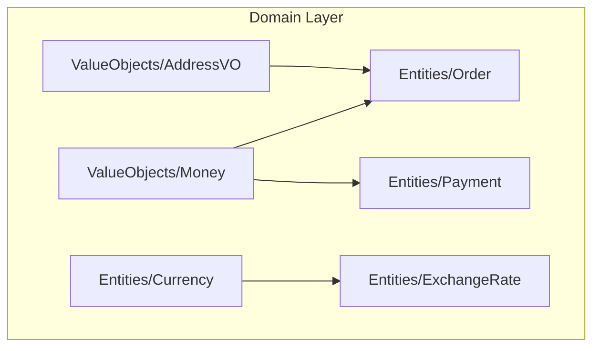
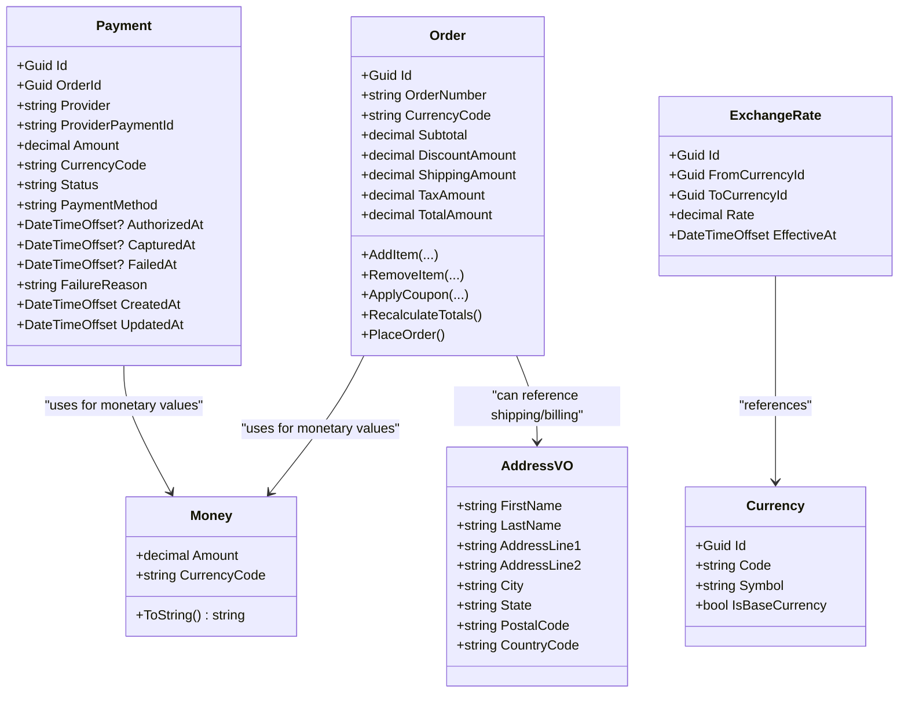
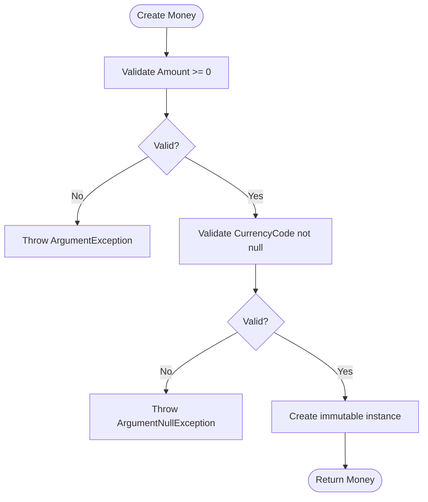
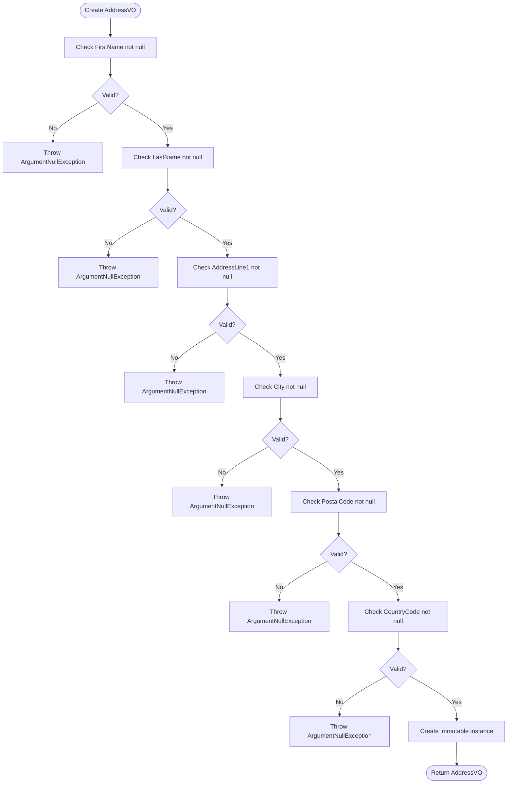
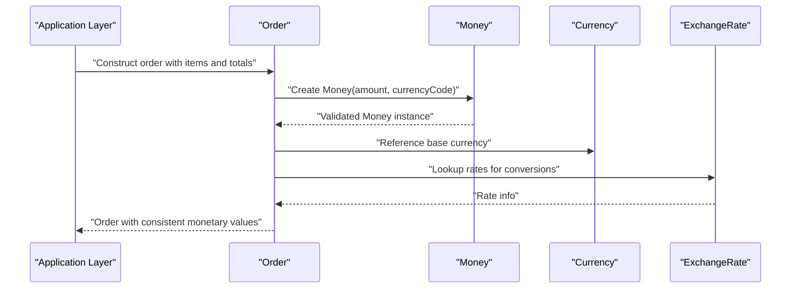
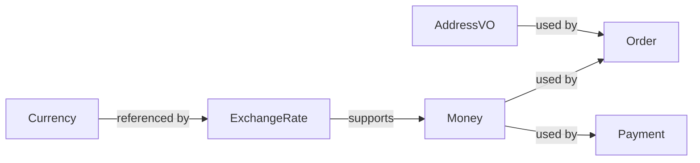

# Value Objects

<cite>
**Referenced Files in This Document**
- [Money.cs](file://src/Ecommerce.Domain/ValueObjects/Money.cs)
- [AddressVO.cs](file://src/Ecommerce.Domain/ValueObjects/AddressVO.cs)
- [Currency.cs](file://src/Ecommerce.Domain/Entities/Currency.cs)
- [ExchangeRate.cs](file://src/Ecommerce.Domain/Entities/ExchangeRate.cs)
- [Order.cs](file://src/Ecommerce.Domain/Entities/Order.cs)
- [Payment.cs](file://src/Ecommerce.Domain/Entities/Payment.cs)
</cite>

## Table of Contents
1. [Introduction](#introduction)
2. [Project Structure](#project-structure)
3. [Core Components](#core-components)
4. [Architecture Overview](#architecture-overview)
5. [Detailed Component Analysis](#detailed-component-analysis)
6. [Dependency Analysis](#dependency-analysis)
7. [Performance Considerations](#performance-considerations)
8. [Troubleshooting Guide](#troubleshooting-guide)
9. [Conclusion](#conclusion)

## Introduction
This document explains the value objects defined in the Domain Layer and how they encapsulate business rules, ensure data integrity, and integrate with entities such as Order and Payment. It focuses on:
- Money value object for currency-aware monetary values and formatting
- Address value object for shipping/billing addresses with validation
- Immutability principles and differences from entities
- Serialization considerations and integration patterns
- Common patterns like factories and conversion methods

## Project Structure
The Domain Layer contains:
- Value objects under ValueObjects directory (Money, AddressVO)
- Entities that model core business concepts (Order, Payment, Currency, ExchangeRate)
- Exceptions used to enforce domain rules

**Diagram sources**
- [Money.cs:5-18](file://src/Ecommerce.Domain/ValueObjects/Money.cs#L5-L18)
- [AddressVO.cs:5-24](file://src/Ecommerce.Domain/ValueObjects/AddressVO.cs#L5-L24)
- [Order.cs:8-34](file://src/Ecommerce.Domain/Entities/Order.cs#L8-L34)
- [Payment.cs:5-20](file://src/Ecommerce.Domain/Entities/Payment.cs#L5-L20)
- [Currency.cs:5-11](file://src/Ecommerce.Domain/Entities/Currency.cs#L5-L11)
- [ExchangeRate.cs:5-12](file://src/Ecommerce.Domain/Entities/ExchangeRate.cs#L5-L12)

**Section sources**
- [Money.cs:5-18](file://src/Ecommerce.Domain/ValueObjects/Money.cs#L5-L18)
- [AddressVO.cs:5-24](file://src/Ecommerce.Domain/ValueObjects/AddressVO.cs#L5-L24)
- [Order.cs:8-34](file://src/Ecommerce.Domain/Entities/Order.cs#L8-L34)
- [Payment.cs:5-20](file://src/Ecommerce.Domain/Entities/Payment.cs#L5-L20)
- [Currency.cs:5-11](file://src/Ecommerce.Domain/Entities/Currency.cs#L5-L11)
- [ExchangeRate.cs:5-12](file://src/Ecommerce.Domain/Entities/ExchangeRate.cs#L5-L12)

## Core Components
- Money: A sealed, immutable value object representing a monetary amount with an associated currency code. It validates non-negative amounts and enforces non-null currency codes. It provides a formatted string representation for display.
- AddressVO: A sealed, immutable value object representing a shipping or billing address. It validates required fields and stores normalized address components.

These value objects encapsulate constraints and behavior close to the data, reducing invalid states at the boundaries of the domain model.

**Section sources**
- [Money.cs:5-18](file://src/Ecommerce.Domain/ValueObjects/Money.cs#L5-L18)
- [AddressVO.cs:5-24](file://src/Ecommerce.Domain/ValueObjects/AddressVO.cs#L5-L24)

## Architecture Overview
Value objects are consumed by entities to express domain concepts clearly:
- Order uses monetary totals and currency context; it can be extended to use Money for precise currency handling.
- Payment records monetary amounts and currency codes; it can be enhanced to use Money for consistency.
- Currency and ExchangeRate entities support exchange rate management and can be used to convert between currencies when needed.

**Diagram sources**
- [Money.cs:5-18](file://src/Ecommerce.Domain/ValueObjects/Money.cs#L5-L18)
- [AddressVO.cs:5-24](file://src/Ecommerce.Domain/ValueObjects/AddressVO.cs#L5-L24)
- [Order.cs:8-34](file://src/Ecommerce.Domain/Entities/Order.cs#L8-L34)
- [Payment.cs:5-20](file://src/Ecommerce.Domain/Entities/Payment.cs#L5-L20)
- [Currency.cs:5-11](file://src/Ecommerce.Domain/Entities/Currency.cs#L5-L11)
- [ExchangeRate.cs:5-12](file://src/Ecommerce.Domain/Entities/ExchangeRate.cs#L5-L12)

## Detailed Component Analysis

### Money Value Object
Purpose:
- Encapsulates a monetary amount with its currency code.
- Enforces domain rules: non-negative amounts and valid currency codes.
- Provides consistent formatting via ToString.

Key behaviors:
- Constructor validation ensures invariant maintenance.
- Immutable properties prevent accidental mutation after creation.
- String representation standardizes display across the system.

Integration points:
- Can replace decimal fields in Order and Payment to guarantee currency awareness.
- Works alongside Currency and ExchangeRate entities to support conversions and validations.

**Diagram sources**
- [Money.cs:10-15](file://src/Ecommerce.Domain/ValueObjects/Money.cs#L10-L15)

**Section sources**
- [Money.cs:5-18](file://src/Ecommerce.Domain/ValueObjects/Money.cs#L5-L18)

### Address Value Object
Purpose:
- Represents shipping or billing addresses with validated required fields.
- Ensures immutability and clear structure for address data.

Validation rules:
- Required fields: first name, last name, address line 1, city, postal code, country code.
- Null checks enforced in constructor to maintain invariants.

Usage:
- Can be embedded in Order or separate Address entities to represent shipping/billing details consistently.

**Diagram sources**
- [AddressVO.cs:16-24](file://src/Ecommerce.Domain/ValueObjects/AddressVO.cs#L16-L24)

**Section sources**
- [AddressVO.cs:5-24](file://src/Ecommerce.Domain/ValueObjects/AddressVO.cs#L5-L24)

### Immutability Principle and Differences from Entities
- Value objects are immutable: once created, their state cannot change. This eliminates side effects and simplifies reasoning about state transitions.
- Entities are mutable and identified by unique IDs; they evolve over time through explicit operations.
- Value objects focus on equality by value (same fields mean same identity), while entities rely on identity over time.

Benefits:
- Prevents accidental mutations in domain logic.
- Simplifies testing and concurrency safety.
- Encourages explicit state changes via entity methods.

**Section sources**
- [Money.cs:5-18](file://src/Ecommerce.Domain/ValueObjects/Money.cs#L5-L18)
- [AddressVO.cs:5-24](file://src/Ecommerce.Domain/ValueObjects/AddressVO.cs#L5-L24)
- [Order.cs:8-34](file://src/Ecommerce.Domain/Entities/Order.cs#L8-L34)
- [Payment.cs:5-20](file://src/Ecommerce.Domain/Entities/Payment.cs#L5-L20)

### Encapsulation of Business Logic and Data Integrity
- Money enforces non-negative amounts and requires a currency code, preventing invalid monetary states.
- AddressVO enforces required fields, ensuring every address has essential information for shipping and billing.
- These constraints centralize business rules near the data, reducing duplication and risk.

Examples:
- Creating a Money instance fails fast if amount is negative or currency is missing.
- Creating an AddressVO fails fast if any required field is null.

**Section sources**
- [Money.cs:10-15](file://src/Ecommerce.Domain/ValueObjects/Money.cs#L10-L15)
- [AddressVO.cs:16-24](file://src/Ecommerce.Domain/ValueObjects/AddressVO.cs#L16-L24)

### Integration with Broader Domain Model
- Order currently tracks currency context and monetary totals; adopting Money would make currency explicit and reduce ambiguity.
- Payment records amounts and currency codes; using Money would unify monetary representation.
- Currency and ExchangeRate entities provide the foundation for currency conversion and rate management.

**Diagram sources**
- [Order.cs:8-34](file://src/Ecommerce.Domain/Entities/Order.cs#L8-L34)
- [Money.cs:5-18](file://src/Ecommerce.Domain/ValueObjects/Money.cs#L5-L18)
- [Currency.cs:5-11](file://src/Ecommerce.Domain/Entities/Currency.cs#L5-L11)
- [ExchangeRate.cs:5-12](file://src/Ecommerce.Domain/Entities/ExchangeRate.cs#L5-L12)

**Section sources**
- [Order.cs:8-34](file://src/Ecommerce.Domain/Entities/Order.cs#L8-L34)
- [Payment.cs:5-20](file://src/Ecommerce.Domain/Entities/Payment.cs#L5-L20)
- [Currency.cs:5-11](file://src/Ecommerce.Domain/Entities/Currency.cs#L5-L11)
- [ExchangeRate.cs:5-12](file://src/Ecommerce.Domain/Entities/ExchangeRate.cs#L5-L12)

### Serialization Considerations
- Value objects should serialize to stable, versioned structures (e.g., JSON with explicit fields).
- For Money, include both amount and currency code to preserve precision and context.
- For AddressVO, include all address components to avoid loss of information during persistence or messaging.
- Avoid exposing internal implementation details; serialize only necessary fields.

Best practices:
- Use explicit serializers or mapping layers to control output shape.
- Ensure deserialization reconstructs immutable instances via constructors or factory methods.
- Validate inputs during deserialization to maintain invariants.

[No sources needed since this section provides general guidance]

### Patterns: Factories and Conversion Methods
- Factory methods: Provide named constructors for common cases (e.g., creating Money from integer cents, or AddressVO with normalized strings).
- Conversion methods: Implement safe conversions between types (e.g., converting decimal to Money with currency context, or parsing strings into AddressVO).
- Validation within factories ensures consistent rule enforcement.

Recommendations:
- Keep constructors minimal and focused on invariants.
- Move complex construction logic into static factory methods.
- Expose conversion helpers that return new value objects rather than mutating existing ones.

[No sources needed since this section provides general guidance]

## Dependency Analysis
- Money depends on primitive types and throws exceptions for invalid input.
- AddressVO depends on primitive types and throws exceptions for invalid input.
- Order references currency context and monetary totals; it can depend on Money for stronger typing.
- Payment references monetary amount and currency; it can depend on Money for consistency.
- Currency and ExchangeRate support exchange rate lookups and conversions.

**Diagram sources**
- [Money.cs:5-18](file://src/Ecommerce.Domain/ValueObjects/Money.cs#L5-L18)
- [AddressVO.cs:5-24](file://src/Ecommerce.Domain/ValueObjects/AddressVO.cs#L5-L24)
- [Order.cs:8-34](file://src/Ecommerce.Domain/Entities/Order.cs#L8-L34)
- [Payment.cs:5-20](file://src/Ecommerce.Domain/Entities/Payment.cs#L5-L20)
- [Currency.cs:5-11](file://src/Ecommerce.Domain/Entities/Currency.cs#L5-L11)
- [ExchangeRate.cs:5-12](file://src/Ecommerce.Domain/Entities/ExchangeRate.cs#L5-L12)

**Section sources**
- [Money.cs:5-18](file://src/Ecommerce.Domain/ValueObjects/Money.cs#L5-L18)
- [AddressVO.cs:5-24](file://src/Ecommerce.Domain/ValueObjects/AddressVO.cs#L5-L24)
- [Order.cs:8-34](file://src/Ecommerce.Domain/Entities/Order.cs#L8-L34)
- [Payment.cs:5-20](file://src/Ecommerce.Domain/Entities/Payment.cs#L5-L20)
- [Currency.cs:5-11](file://src/Ecommerce.Domain/Entities/Currency.cs#L5-L11)
- [ExchangeRate.cs:5-12](file://src/Ecommerce.Domain/Entities/ExchangeRate.cs#L5-L12)

## Performance Considerations
- Value objects are lightweight and immutable; prefer small, focused instances.
- Avoid excessive allocations in hot paths; reuse where appropriate but maintain immutability.
- Formatting (e.g., ToString) should be used for display, not for calculations; keep numeric operations on primitives or decimals.
- Exchange rate lookups should be cached to minimize overhead during conversions.

[No sources needed since this section provides general guidance]

## Troubleshooting Guide
Common issues and resolutions:
- Negative amounts: Money constructor rejects negative values; ensure upstream logic validates pricing before constructing Money.
- Missing currency codes: Money constructor requires non-null currency; validate currency presence early.
- Null address fields: AddressVO constructor rejects null required fields; ensure callers populate all address components.
- Inconsistent totals: Order recalculates totals on item changes; verify RecalculateTotals is invoked after modifications.

Diagnostic steps:
- Inspect exception messages thrown by constructors to identify invalid inputs.
- Verify that Order methods update totals and timestamps consistently.
- Confirm that Payment and Order currency codes align with Money usage.

**Section sources**
- [Money.cs:10-15](file://src/Ecommerce.Domain/ValueObjects/Money.cs#L10-L15)
- [AddressVO.cs:16-24](file://src/Ecommerce.Domain/ValueObjects/AddressVO.cs#L16-L24)
- [Order.cs:79-87](file://src/Ecommerce.Domain/Entities/Order.cs#L79-L87)

## Conclusion
Value objects in the Domain Layer encapsulate critical business rules around money and addresses, ensuring data integrity and clarity. By enforcing immutability and validation at construction, they prevent invalid states and simplify domain logic. Integrating Money and AddressVO with entities like Order and Payment strengthens the model, making currency and address handling explicit and robust. Adopting factories and conversion methods further enhances usability and consistency across the application.