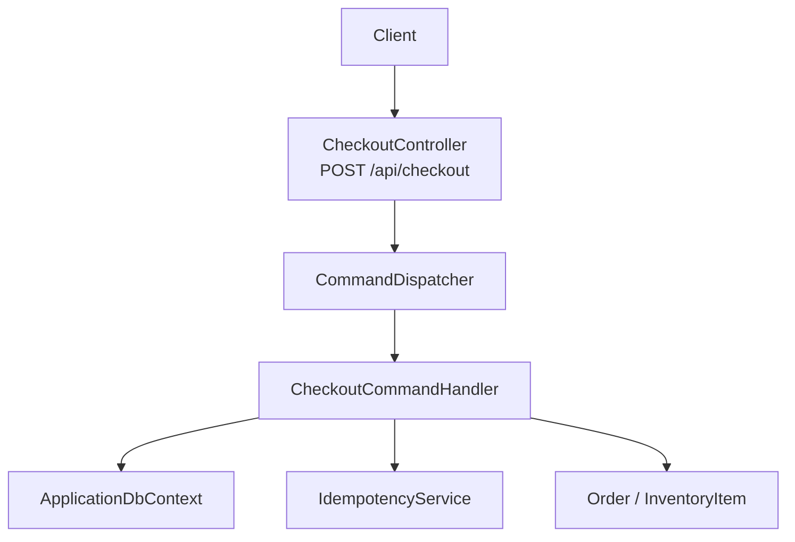
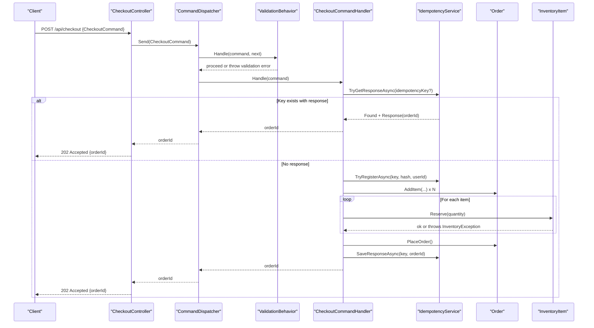
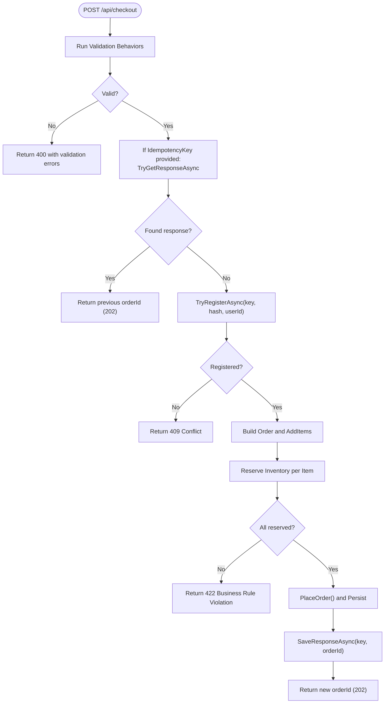
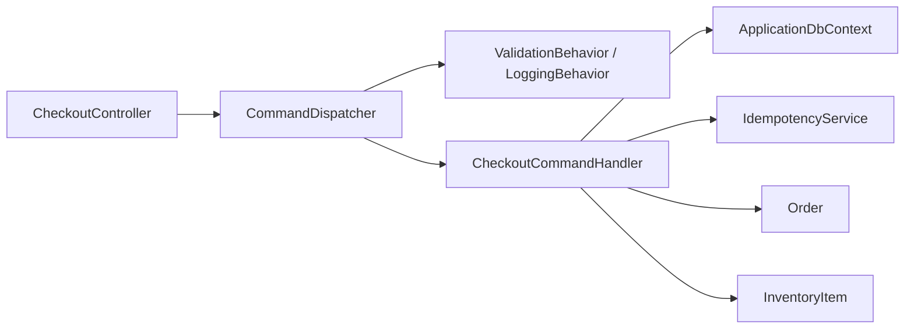

# Checkout API Endpoints

<cite>
**Referenced Files in This Document**
- [CheckoutController.cs](file://src/Ecommerce.Api/Controllers/CheckoutController.cs)
- [Program.cs](file://src/Ecommerce.Api/Program.cs)
- [CheckoutCommand.cs](file://src/Ecommerce.Application/Commands/Checkout/CheckoutCommand.cs)
- [CheckoutCommandHandler.cs](file://src/Ecommerce.Application/Commands/Checkout/CheckoutCommandHandler.cs)
- [CheckoutCommandFluentValidator.cs](file://src/Ecommerce.Application/Validators/CheckoutCommandFluentValidator.cs)
- [CheckoutCommandValidator.cs](file://src/Ecommerce.Application/Commands/Checkout/CheckoutCommandValidator.cs)
- [CommandDispatcher.cs](file://src/Ecommerce.Application/Common/Commands/CommandDispatcher.cs)
- [ValidationBehavior.cs](file://src/Ecommerce.Application/Common/Commands/ValidationBehavior.cs)
- [LoggingBehavior.cs](file://src/Ecommerce.Application/Common/Commands/LoggingBehavior.cs)
- [Order.cs](file://src/Ecommerce.Domain/Entities/Order.cs)
- [InventoryItem.cs](file://src/Ecommerce.Domain/Entities/InventoryItem.cs)
- [DomainException.cs](file://src/Ecommerce.Domain/Exceptions/DomainException.cs)
- [InventoryException.cs](file://src/Ecommerce.Domain/Exceptions/InventoryException.cs)
- [IdempotencyService.cs](file://src/Ecommerce.Infrastructure/Services/IdempotencyService.cs)
</cite>

## Table of Contents
1. [Introduction](#introduction)
2. [Project Structure](#project-structure)
3. [Core Components](#core-components)
4. [Architecture Overview](#architecture-overview)
5. [Detailed Component Analysis](#detailed-component-analysis)
6. [Dependency Analysis](#dependency-analysis)
7. [Performance Considerations](#performance-considerations)
8. [Troubleshooting Guide](#troubleshooting-guide)
9. [Conclusion](#conclusion)
10. [Appendices](#appendices)

## Introduction
This document specifies the checkout API endpoints for placing orders, including HTTP methods, URL patterns, request and response schemas, authentication requirements, error responses, validation rules, and client implementation guidelines for robust checkout flows with idempotency and retry strategies.

## Project Structure
The checkout feature follows a layered architecture:
- API layer exposes an HTTP endpoint that dispatches commands.
- Application layer handles business logic via command handlers, validators, and behaviors.
- Domain layer enforces business rules on entities like Order and InventoryItem.
- Infrastructure provides persistence and idempotency support.

**Diagram sources**
- [CheckoutController.cs:8-24](file://src/Ecommerce.Api/Controllers/CheckoutController.cs#L8-L24)
- [CommandDispatcher.cs:20-43](file://src/Ecommerce.Application/Common/Commands/CommandDispatcher.cs#L20-L43)
- [CheckoutCommandHandler.cs:22-90](file://src/Ecommerce.Application/Commands/Checkout/CheckoutCommandHandler.cs#L22-L90)
- [IdempotencyService.cs:19-53](file://src/Ecommerce.Infrastructure/Services/IdempotencyService.cs#L19-L53)
- [Order.cs:36-102](file://src/Ecommerce.Domain/Entities/Order.cs#L36-L102)
- [InventoryItem.cs:29-40](file://src/Ecommerce.Domain/Entities/InventoryItem.cs#L29-L40)

**Section sources**
- [CheckoutController.cs:8-24](file://src/Ecommerce.Api/Controllers/CheckoutController.cs#L8-L24)
- [Program.cs:11-74](file://src/Ecommerce.Api/Program.cs#L11-L74)

## Core Components
- Endpoint: POST /api/checkout
  - Accepts a JSON body representing a checkout command.
  - Returns 202 Accepted with the created order identifier.
- Command: CheckoutCommand
  - Contains user context, items to purchase, currency, shipping address, and optional idempotency key.
- Handler: CheckoutCommandHandler
  - Enforces idempotency, validates input via pipeline behaviors, builds and places an order, reserves inventory, persists changes, and returns the order ID.
- Validators and Behaviors
  - ValidationBehavior runs FluentValidation and custom validators; errors are thrown as domain exceptions.
  - LoggingBehavior logs handling lifecycle.
- Domain Entities
  - Order manages line items, totals, and state transitions (placing the order).
  - InventoryItem enforces stock availability and reservation rules.
- Idempotency
  - IdempotencyService prevents duplicate processing using a client-provided key and stores final responses.

**Section sources**
- [CheckoutController.cs:19-24](file://src/Ecommerce.Api/Controllers/CheckoutController.cs#L19-L24)
- [CheckoutCommand.cs:6-20](file://src/Ecommerce.Application/Commands/Checkout/CheckoutCommand.cs#L6-L20)
- [CheckoutCommandHandler.cs:22-90](file://src/Ecommerce.Application/Commands/Checkout/CheckoutCommandHandler.cs#L22-L90)
- [ValidationBehavior.cs:17-37](file://src/Ecommerce.Application/Common/Commands/ValidationBehavior.cs#L17-L37)
- [LoggingBehavior.cs:17-30](file://src/Ecommerce.Application/Common/Commands/LoggingBehavior.cs#L17-L30)
- [Order.cs:36-102](file://src/Ecommerce.Domain/Entities/Order.cs#L36-L102)
- [InventoryItem.cs:29-40](file://src/Ecommerce.Domain/Entities/InventoryItem.cs#L29-L40)
- [IdempotencyService.cs:19-53](file://src/Ecommerce.Infrastructure/Services/IdempotencyService.cs#L19-L53)

## Architecture Overview
The checkout flow uses a command pattern with middleware-like behaviors:
- The controller receives the request and delegates to the command dispatcher.
- The dispatcher resolves the handler and executes registered behaviors (validation, logging).
- The handler performs idempotency checks, builds the order, reserves inventory, persists, and returns the order ID.
- Idempotency ensures safe retries by caching the final response keyed by a client-supplied idempotency key.

**Diagram sources**
- [CheckoutController.cs:19-24](file://src/Ecommerce.Api/Controllers/CheckoutController.cs#L19-L24)
- [CommandDispatcher.cs:20-43](file://src/Ecommerce.Application/Common/Commands/CommandDispatcher.cs#L20-L43)
- [ValidationBehavior.cs:17-37](file://src/Ecommerce.Application/Common/Commands/ValidationBehavior.cs#L17-L37)
- [CheckoutCommandHandler.cs:22-90](file://src/Ecommerce.Application/Commands/Checkout/CheckoutCommandHandler.cs#L22-L90)
- [IdempotencyService.cs:19-53](file://src/Ecommerce.Infrastructure/Services/IdempotencyService.cs#L19-L53)
- [Order.cs:36-102](file://src/Ecommerce.Domain/Entities/Order.cs#L36-L102)
- [InventoryItem.cs:29-40](file://src/Ecommerce.Domain/Entities/InventoryItem.cs#L29-L40)

## Detailed Component Analysis

### Endpoint Specification
- Method: POST
- URL: /api/checkout
- Authentication: Enabled globally via JWT Bearer in Program configuration. Requests must include a valid Authorization header with a bearer token unless disabled in development.
- Request Body: CheckoutCommand
  - UserId: string (GUID) — required
  - Items: array of CheckoutItem — required, at least one item
    - ProductId: string (GUID)
    - ProductVariantId: string (GUID)
    - Quantity: integer — must be greater than zero
  - Currency: string — defaults to USD if omitted
  - ShippingAddress: string — optional
  - IdempotencyKey: string — optional but recommended for retries
- Success Response: 202 Accepted
  - Body: { "orderId": "string (GUID)" }
- Error Responses:
  - 400 Bad Request: Validation failures from FluentValidation or custom validator (e.g., empty cart, invalid quantity).
  - 401 Unauthorized: Missing or invalid JWT token.
  - 403 Forbidden: Insufficient permissions (if authorization policies are enforced).
  - 409 Conflict: Idempotency registration conflict (request already in flight).
  - 422 Unprocessable Entity: Business rule violations such as insufficient inventory or missing inventory records.
  - 500 Internal Server Error: Unexpected server-side errors.

**Section sources**
- [CheckoutController.cs:8-24](file://src/Ecommerce.Api/Controllers/CheckoutController.cs#L8-L24)
- [Program.cs:29-50](file://src/Ecommerce.Api/Program.cs#L29-L50)
- [CheckoutCommand.cs:6-20](file://src/Ecommerce.Application/Commands/Checkout/CheckoutCommand.cs#L6-L20)
- [CheckoutCommandFluentValidator.cs:7-16](file://src/Ecommerce.Application/Validators/CheckoutCommandFluentValidator.cs#L7-L16)
- [CheckoutCommandValidator.cs:8-30](file://src/Ecommerce.Application/Commands/Checkout/CheckoutCommandValidator.cs#L8-L30)
- [CheckoutCommandHandler.cs:22-90](file://src/Ecommerce.Application/Commands/Checkout/CheckoutCommandHandler.cs#L22-L90)
- [InventoryItem.cs:29-40](file://src/Ecommerce.Domain/Entities/InventoryItem.cs#L29-L40)

### Request Schemas
- CheckoutCommand
  - Fields:
    - UserId: GUID
    - Items: list of CheckoutItem
    - Currency: string (default "USD")
    - ShippingAddress: string
    - IdempotencyKey: string
- CheckoutItem
  - Fields:
    - ProductId: GUID
    - ProductVariantId: GUID
    - Quantity: integer (> 0)

Example payloads:
- Minimal payload:
  - { "userId": "<guid>", "items": [{ "productId": "<guid>", "productVariantId": "<guid>", "quantity": 1 }] }
- With currency and shipping:
  - { "userId": "<guid>", "items": [...], "currency": "EUR", "shippingAddress": "123 Main St" }
- With idempotency key:
  - { "userId": "<guid>", "items": [...], "idempotencyKey": "<unique-request-id>" }

**Section sources**
- [CheckoutCommand.cs:6-20](file://src/Ecommerce.Application/Commands/Checkout/CheckoutCommand.cs#L6-L20)
- [CheckoutCommandFluentValidator.cs:7-16](file://src/Ecommerce.Application/Validators/CheckoutCommandFluentValidator.cs#L7-L16)
- [CheckoutCommandValidator.cs:8-30](file://src/Ecommerce.Application/Commands/Checkout/CheckoutCommandValidator.cs#L8-L30)

### Authentication Requirements
- JWT Bearer authentication is configured globally.
- Requests must include Authorization: Bearer <token>.
- In development, HTTPS metadata requirement can be disabled; ensure secure deployment settings in production.

**Section sources**
- [Program.cs:29-50](file://src/Ecommerce.Api/Program.cs#L29-L50)
- [Program.cs:70-72](file://src/Ecommerce.Api/Program.cs#L70-L72)

### Processing Logic and Business Rules
- Idempotency:
  - If IdempotencyKey is provided, the system checks for an existing response or registers the attempt.
  - Duplicate keys return the previously recorded order ID.
  - Conflicts during registration indicate another request is in flight.
- Validation:
  - UserId must be present.
  - Items must not be empty; each item’s quantity must be greater than zero.
  - Currency must be non-empty when provided.
- Order Creation:
  - Builds an order, adds line items, sets initial statuses, and recalculates totals.
- Inventory Reservation:
  - Reserves stock per item; throws if inventory is missing or insufficient.
- Persistence:
  - Persists the order and saves the idempotency response.

**Diagram sources**
- [CheckoutCommandHandler.cs:22-90](file://src/Ecommerce.Application/Commands/Checkout/CheckoutCommandHandler.cs#L22-L90)
- [IdempotencyService.cs:19-53](file://src/Ecommerce.Infrastructure/Services/IdempotencyService.cs#L19-L53)
- [Order.cs:36-102](file://src/Ecommerce.Domain/Entities/Order.cs#L36-L102)
- [InventoryItem.cs:29-40](file://src/Ecommerce.Domain/Entities/InventoryItem.cs#L29-L40)
- [ValidationBehavior.cs:17-37](file://src/Ecommerce.Application/Common/Commands/ValidationBehavior.cs#L17-L37)

**Section sources**
- [CheckoutCommandHandler.cs:22-90](file://src/Ecommerce.Application/Commands/Checkout/CheckoutCommandHandler.cs#L22-L90)
- [IdempotencyService.cs:19-53](file://src/Ecommerce.Infrastructure/Services/IdempotencyService.cs#L19-L53)
- [Order.cs:36-102](file://src/Ecommerce.Domain/Entities/Order.cs#L36-L102)
- [InventoryItem.cs:29-40](file://src/Ecommerce.Domain/Entities/InventoryItem.cs#L29-L40)
- [CheckoutCommandFluentValidator.cs:7-16](file://src/Ecommerce.Application/Validators/CheckoutCommandFluentValidator.cs#L7-L16)
- [CheckoutCommandValidator.cs:8-30](file://src/Ecommerce.Application/Commands/Checkout/CheckoutCommandValidator.cs#L8-L30)

### Error Handling and Response Codes
- Validation Errors (400):
  - Empty cart or invalid quantities.
  - Thrown via ValidationBehavior aggregating validator errors.
- Business Rule Violations (422):
  - Missing inventory or insufficient stock.
  - Thrown by InventoryItem.Reserve or handler checks.
- Idempotency Conflicts (409):
  - When idempotency key registration fails due to concurrent requests.
- Authentication Failures (401/403):
  - Invalid or missing JWT token; authorization policy enforcement.
- Server Errors (500):
  - Unexpected exceptions during processing.

Error types used:
- DomainException for general domain-level errors.
- InventoryException for inventory-specific issues.

**Section sources**
- [ValidationBehavior.cs:17-37](file://src/Ecommerce.Application/Common/Commands/ValidationBehavior.cs#L17-L37)
- [CheckoutCommandHandler.cs:22-90](file://src/Ecommerce.Application/Commands/Checkout/CheckoutCommandHandler.cs#L22-L90)
- [InventoryItem.cs:29-40](file://src/Ecommerce.Domain/Entities/InventoryItem.cs#L29-L40)
- [DomainException.cs:5-8](file://src/Ecommerce.Domain/Exceptions/DomainException.cs#L5-L8)
- [InventoryException.cs:5-8](file://src/Ecommerce.Domain/Exceptions/InventoryException.cs#L5-L8)

### Client Implementation Guidelines
- Always include a unique IdempotencyKey per checkout attempt to safely retry.
- Retry Strategy:
  - On 409 Conflict, wait briefly and retry with the same IdempotencyKey.
  - On 422 Unprocessable Entity due to inventory, consider backoff and retry after stock replenishment or notify the user.
  - On 400 Bad Request, fix payload issues before retrying.
  - On 401/403, refresh tokens or prompt re-authentication.
- Timeouts and Retries:
  - Use exponential backoff with jitter for transient errors.
  - Limit maximum retries to avoid infinite loops.
- Payload Construction:
  - Ensure all required fields are present and valid.
  - Provide Currency and ShippingAddress as needed.
- Observability:
  - Log correlation IDs and idempotency keys for traceability.
  - Capture error responses and messages for diagnostics.

[No sources needed since this section provides general guidance]

## Dependency Analysis
The checkout flow depends on several components:
- Controller depends on CommandDispatcher.
- CommandDispatcher resolves handlers and behaviors.
- Handler depends on DbContext, IdempotencyService, and domain entities.
- IdempotencyService depends on persistence.

**Diagram sources**
- [CheckoutController.cs:12-24](file://src/Ecommerce.Api/Controllers/CheckoutController.cs#L12-L24)
- [CommandDispatcher.cs:20-43](file://src/Ecommerce.Application/Common/Commands/CommandDispatcher.cs#L20-L43)
- [ValidationBehavior.cs:17-37](file://src/Ecommerce.Application/Common/Commands/ValidationBehavior.cs#L17-L37)
- [LoggingBehavior.cs:17-30](file://src/Ecommerce.Application/Common/Commands/LoggingBehavior.cs#L17-L30)
- [CheckoutCommandHandler.cs:22-90](file://src/Ecommerce.Application/Commands/Checkout/CheckoutCommandHandler.cs#L22-L90)
- [IdempotencyService.cs:19-53](file://src/Ecommerce.Infrastructure/Services/IdempotencyService.cs#L19-L53)
- [Order.cs:36-102](file://src/Ecommerce.Domain/Entities/Order.cs#L36-L102)
- [InventoryItem.cs:29-40](file://src/Ecommerce.Domain/Entities/InventoryItem.cs#L29-L40)

**Section sources**
- [CheckoutController.cs:12-24](file://src/Ecommerce.Api/Controllers/CheckoutController.cs#L12-L24)
- [CommandDispatcher.cs:20-43](file://src/Ecommerce.Application/Common/Commands/CommandDispatcher.cs#L20-L43)
- [CheckoutCommandHandler.cs:22-90](file://src/Ecommerce.Application/Commands/Checkout/CheckoutCommandHandler.cs#L22-L90)
- [IdempotencyService.cs:19-53](file://src/Ecommerce.Infrastructure/Services/IdempotencyService.cs#L19-L53)

## Performance Considerations
- Idempotency reduces duplicate work and protects against race conditions during retries.
- Validation early in the pipeline avoids unnecessary processing.
- Inventory reservation occurs within the same transactional scope as order creation to maintain consistency.
- Avoid large payloads; keep item lists reasonable to minimize memory and network overhead.
- Use connection pooling and efficient queries in infrastructure layers.

[No sources needed since this section provides general guidance]

## Troubleshooting Guide
Common issues and resolutions:
- Validation errors:
  - Ensure UserId is present and Items is non-empty with positive quantities.
  - Check Currency format when provided.
- Inventory errors:
  - Verify product variant exists and has sufficient available stock.
  - Confirm AllowBackorder behavior aligns with business expectations.
- Idempotency conflicts:
  - If receiving 409, retry with the same IdempotencyKey after a short delay.
- Authentication issues:
  - Ensure a valid JWT token is included in the Authorization header.
  - Verify issuer and signing key configuration matches the identity provider.

**Section sources**
- [CheckoutCommandFluentValidator.cs:7-16](file://src/Ecommerce.Application/Validators/CheckoutCommandFluentValidator.cs#L7-L16)
- [CheckoutCommandValidator.cs:8-30](file://src/Ecommerce.Application/Commands/Checkout/CheckoutCommandValidator.cs#L8-L30)
- [CheckoutCommandHandler.cs:22-90](file://src/Ecommerce.Application/Commands/Checkout/CheckoutCommandHandler.cs#L22-L90)
- [InventoryItem.cs:29-40](file://src/Ecommerce.Domain/Entities/InventoryItem.cs#L29-L40)
- [Program.cs:29-50](file://src/Ecommerce.Api/Program.cs#L29-L50)

## Conclusion
The checkout API provides a robust, idempotent endpoint for placing orders with strong validation and business rule enforcement. Clients should use idempotency keys, implement resilient retry logic, and handle error responses appropriately to ensure reliable checkout experiences.

[No sources needed since this section summarizes without analyzing specific files]

## Appendices

### Example Requests and Responses
- Successful checkout:
  - Request: POST /api/checkout
    - Body: { "userId": "<guid>", "items": [{ "productId": "<guid>", "productVariantId": "<guid>", "quantity": 1 }], "currency": "USD", "idempotencyKey": "<unique-id>" }
  - Response: 202 Accepted
    - Body: { "orderId": "<guid>" }
- Validation failure:
  - Response: 400 Bad Request
    - Body: Array of validation error messages
- Inventory insufficient:
  - Response: 422 Unprocessable Entity
    - Body: Error message indicating insufficient stock
- Idempotency conflict:
  - Response: 409 Conflict
    - Body: Error message indicating request already in flight

**Section sources**
- [CheckoutController.cs:19-24](file://src/Ecommerce.Api/Controllers/CheckoutController.cs#L19-L24)
- [CheckoutCommand.cs:6-20](file://src/Ecommerce.Application/Commands/Checkout/CheckoutCommand.cs#L6-L20)
- [CheckoutCommandHandler.cs:22-90](file://src/Ecommerce.Application/Commands/Checkout/CheckoutCommandHandler.cs#L22-L90)
- [InventoryItem.cs:29-40](file://src/Ecommerce.Domain/Entities/InventoryItem.cs#L29-L40)
- [IdempotencyService.cs:19-53](file://src/Ecommerce.Infrastructure/Services/IdempotencyService.cs#L19-L53)