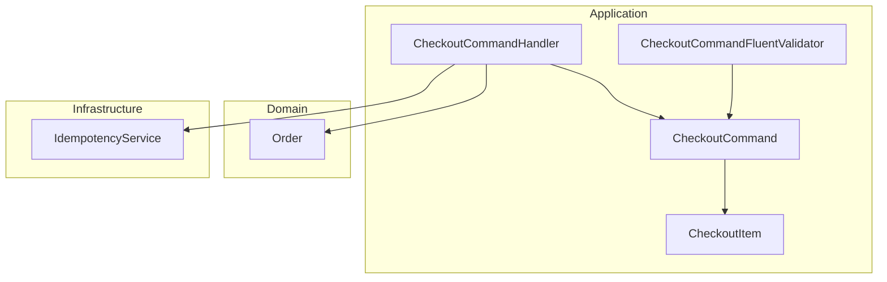
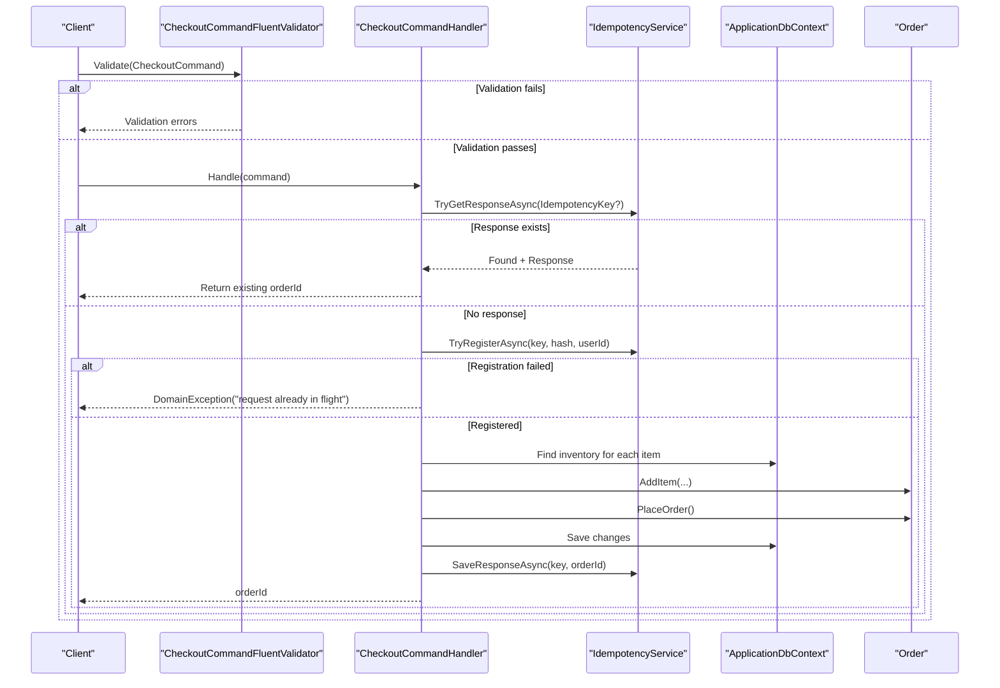
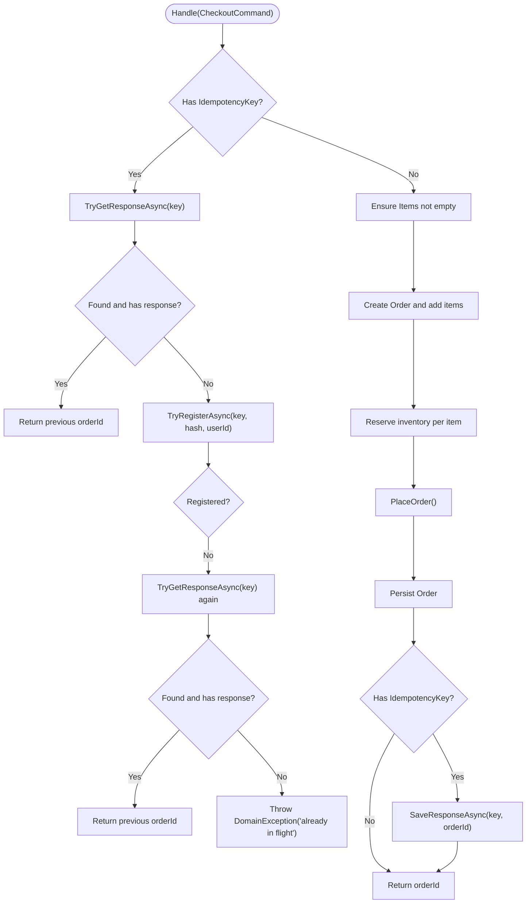
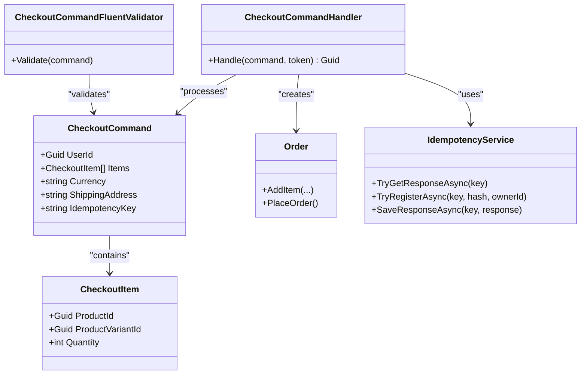

# Checkout Command

<cite>
**Referenced Files in This Document**
- [CheckoutCommand.cs](file://src/Ecommerce.Application/Commands/Checkout/CheckoutCommand.cs)
- [CheckoutCommandFluentValidator.cs](file://src/Ecommerce.Application/Validators/CheckoutCommandFluentValidator.cs)
- [CheckoutCommandHandler.cs](file://src/Ecommerce.Application/Commands/Checkout/CheckoutCommandHandler.cs)
- [Order.cs](file://src/Ecommerce.Domain/Entities/Order.cs)
- [IdempotencyService.cs](file://src/Ecommerce.Infrastructure/Services/IdempotencyService.cs)
- [CheckoutHandlerTests.cs](file://tests/Ecommerce.Application.Tests/CheckoutHandlerTests.cs)
- [CheckoutIdempotencyTests.cs](file://tests/Ecommerce.Application.Tests/CheckoutIdempotencyTests.cs)
</cite>

## Table of Contents
1. [Introduction](#introduction)
2. [Project Structure](#project-structure)
3. [Core Components](#core-components)
4. [Architecture Overview](#architecture-overview)
5. [Detailed Component Analysis](#detailed-component-analysis)
6. [Dependency Analysis](#dependency-analysis)
7. [Performance Considerations](#performance-considerations)
8. [Troubleshooting Guide](#troubleshooting-guide)
9. [Conclusion](#conclusion)
10. [Appendices](#appendices)

## Introduction
This document explains the Checkout command model and its processing pipeline with a focus on the CheckoutCommand and CheckoutItem classes, their validation rules, and idempotent checkout behavior. It provides guidance on constructing valid commands, handling errors, and using IdempotencyKey to prevent duplicate orders.

## Project Structure
The checkout feature spans Application, Domain, Infrastructure, and Tests layers:
- Application layer defines the command (CheckoutCommand), its item model (CheckoutItem), validator (CheckoutCommandFluentValidator), and handler (CheckoutCommandHandler).
- Domain layer contains Order and related entities used during checkout.
- Infrastructure layer provides IdempotencyService for idempotent request handling.
- Tests demonstrate usage patterns and idempotency guarantees.

**Diagram sources**
- [CheckoutCommand.cs:6-20](file://src/Ecommerce.Application/Commands/Checkout/CheckoutCommand.cs#L6-L20)
- [CheckoutCommandFluentValidator.cs:5-16](file://src/Ecommerce.Application/Validators/CheckoutCommandFluentValidator.cs#L5-L16)
- [CheckoutCommandHandler.cs:11-91](file://src/Ecommerce.Application/Commands/Checkout/CheckoutCommandHandler.cs#L11-L91)
- [Order.cs:8-103](file://src/Ecommerce.Domain/Entities/Order.cs#L8-L103)
- [IdempotencyService.cs:10-54](file://src/Ecommerce.Infrastructure/Services/IdempotencyService.cs#L10-L54)

**Section sources**
- [CheckoutCommand.cs:6-20](file://src/Ecommerce.Application/Commands/Checkout/CheckoutCommand.cs#L6-L20)
- [CheckoutCommandHandler.cs:11-91](file://src/Ecommerce.Application/Commands/Checkout/CheckoutCommandHandler.cs#L11-L91)

## Core Components
- CheckoutCommand
  - UserId: Identifies the user placing the order.
  - Items: Collection of CheckoutItem entries to purchase.
  - Currency: Currency code for the order; defaults to USD when not provided.
  - ShippingAddress: Shipping address string (not validated by the FluentValidator).
  - IdempotencyKey: Optional key to ensure duplicate requests produce the same result.

- CheckoutItem
  - ProductId: Identifier of the product being purchased.
  - ProductVariantId: Identifier of the specific variant.
  - Quantity: Number of units to purchase; must be greater than zero.

Validation rules enforced by CheckoutCommandFluentValidator:
- UserId must be present.
- Items collection must contain at least one item.
- Each item’s Quantity must be greater than zero.
- Currency must be non-empty when provided.

Notes:
- The handler enforces that Items is not empty before creating an order.
- Inventory reservation requires matching inventory items by ProductVariantId or fallback to ProductId.

**Section sources**
- [CheckoutCommand.cs:6-20](file://src/Ecommerce.Application/Commands/Checkout/CheckoutCommand.cs#L6-L20)
- [CheckoutCommandFluentValidator.cs:5-16](file://src/Ecommerce.Application/Validators/CheckoutCommandFluentValidator.cs#L5-L16)
- [CheckoutCommandHandler.cs:22-91](file://src/Ecommerce.Application/Commands/Checkout/CheckoutCommandHandler.cs#L22-L91)

## Architecture Overview
The checkout flow validates the command, optionally checks idempotency, builds and persists an order, reserves inventory, and returns the order identifier.

**Diagram sources**
- [CheckoutCommandFluentValidator.cs:5-16](file://src/Ecommerce.Application/Validators/CheckoutCommandFluentValidator.cs#L5-L16)
- [CheckoutCommandHandler.cs:22-91](file://src/Ecommerce.Application/Commands/Checkout/CheckoutCommandHandler.cs#L22-L91)
- [IdempotencyService.cs:19-54](file://src/Ecommerce.Infrastructure/Services/IdempotencyService.cs#L19-L54)
- [Order.cs:36-102](file://src/Ecommerce.Domain/Entities/Order.cs#L36-L102)

## Detailed Component Analysis

### CheckoutCommand and CheckoutItem
- Purpose: Carry out a single checkout request from a client.
- Key properties:
  - UserId: Required by validator.
  - Items: Must be non-empty; each item must have positive quantity.
  - Currency: Defaults to USD; must be non-empty if provided.
  - ShippingAddress: String field; no explicit validation rule here.
  - IdempotencyKey: Optional; enables idempotent retries.

Usage pattern examples (described):
- Valid request: Provide a non-empty UserId, at least one CheckoutItem with positive Quantity, optional Currency and ShippingAddress, and an optional IdempotencyKey for safe retries.
- Invalid request: Empty UserId, empty Items, or any item with Quantity <= 0 will fail validation.

**Section sources**
- [CheckoutCommand.cs:6-20](file://src/Ecommerce.Application/Commands/Checkout/CheckoutCommand.cs#L6-L20)
- [CheckoutCommandFluentValidator.cs:5-16](file://src/Ecommerce.Application/Validators/CheckoutCommandFluentValidator.cs#L5-L16)

### CheckoutCommandFluentValidator
Enforced rules:
- UserId must be present.
- Items must contain at least one element.
- For each item, Quantity > 0.
- If Currency is provided, it must be non-empty.

Behavioral notes:
- Validation runs before handler execution via the application pipeline.
- Errors are surfaced as validation failures prior to domain processing.

**Section sources**
- [CheckoutCommandFluentValidator.cs:5-16](file://src/Ecommerce.Application/Validators/CheckoutCommandFluentValidator.cs#L5-L16)

### CheckoutCommandHandler
Responsibilities:
- Idempotency handling:
  - If IdempotencyKey is provided, check for an existing response; return the stored order id if found.
  - Register the key with a simple request hash and owner context; if registration fails, attempt to fetch any completed response; otherwise throw a domain exception indicating the request is already in flight.
- Business logic:
  - Ensure Items is not empty.
  - Build an Order, add items, reserve inventory per item, place the order, and persist changes.
  - On success, save the response under the IdempotencyKey.
- Error scenarios:
  - Missing inventory for a product/variant raises an inventory-specific exception.
  - Duplicate registration attempts raise a domain exception.

**Diagram sources**
- [CheckoutCommandHandler.cs:22-91](file://src/Ecommerce.Application/Commands/Checkout/CheckoutCommandHandler.cs#L22-L91)
- [IdempotencyService.cs:19-54](file://src/Ecommerce.Infrastructure/Services/IdempotencyService.cs#L19-L54)
- [Order.cs:36-102](file://src/Ecommerce.Domain/Entities/Order.cs#L36-L102)

**Section sources**
- [CheckoutCommandHandler.cs:22-91](file://src/Ecommerce.Application/Commands/Checkout/CheckoutCommandHandler.cs#L22-L91)

### IdempotencyKey Behavior
- Purpose: Prevent duplicate orders when clients retry due to network issues.
- Mechanism:
  - First call registers the key and processes the checkout; stores the resulting orderId.
  - Subsequent calls with the same key return the stored orderId without reprocessing.
- Test coverage demonstrates that two identical requests with the same key yield the same orderId and only one order is created.

**Section sources**
- [CheckoutIdempotencyTests.cs:22-53](file://tests/Ecommerce.Application.Tests/CheckoutIdempotencyTests.cs#L22-L53)
- [IdempotencyService.cs:19-54](file://src/Ecommerce.Infrastructure/Services/IdempotencyService.cs#L19-L54)

## Dependency Analysis
- CheckoutCommand depends on CheckoutItem for line items.
- CheckoutCommandFluentValidator depends on CheckoutCommand to enforce rules.
- CheckoutCommandHandler depends on:
  - IApplicationDbContext for persistence and inventory lookup.
  - IIdempotencyService for idempotency.
  - Order entity for business operations.
- Tests validate both normal checkout and idempotency behavior.

**Diagram sources**
- [CheckoutCommand.cs:6-20](file://src/Ecommerce.Application/Commands/Checkout/CheckoutCommand.cs#L6-L20)
- [CheckoutCommandFluentValidator.cs:5-16](file://src/Ecommerce.Application/Validators/CheckoutCommandFluentValidator.cs#L5-L16)
- [CheckoutCommandHandler.cs:11-91](file://src/Ecommerce.Application/Commands/Checkout/CheckoutCommandHandler.cs#L11-L91)
- [Order.cs:8-103](file://src/Ecommerce.Domain/Entities/Order.cs#L8-L103)
- [IdempotencyService.cs:10-54](file://src/Ecommerce.Infrastructure/Services/IdempotencyService.cs#L10-L54)

**Section sources**
- [CheckoutCommand.cs:6-20](file://src/Ecommerce.Application/Commands/Checkout/CheckoutCommand.cs#L6-L20)
- [CheckoutCommandHandler.cs:11-91](file://src/Ecommerce.Application/Commands/Checkout/CheckoutCommandHandler.cs#L11-L91)

## Performance Considerations
- Idempotency checks avoid redundant processing and database writes on retries.
- Inventory lookups are performed per item; consider batching or indexing strategies in high-throughput environments.
- Order totals are recalculated incrementally; keep item additions minimal to reduce recomputation overhead.

[No sources needed since this section provides general guidance]

## Troubleshooting Guide
Common error scenarios and how they arise:
- Validation failures:
  - Missing UserId or empty Items or non-positive Quantity will be caught by the validator.
- Domain exceptions:
  - Empty Items after validation: handler throws a domain exception indicating no items to checkout.
  - Inventory not found: handler throws an inventory-specific exception when neither ProductVariantId nor ProductId matches inventory.
  - Idempotency conflict: if registration fails and no response is available, a domain exception indicates the request is already in flight.

Remediation tips:
- Ensure all required fields are set before sending the command.
- Verify inventory availability for products/variants before checkout.
- Use a unique IdempotencyKey per intended checkout to safely retry.

**Section sources**
- [CheckoutCommandFluentValidator.cs:5-16](file://src/Ecommerce.Application/Validators/CheckoutCommandFluentValidator.cs#L5-L16)
- [CheckoutCommandHandler.cs:22-91](file://src/Ecommerce.Application/Commands/Checkout/CheckoutCommandHandler.cs#L22-L91)

## Conclusion
CheckoutCommand and CheckoutItem define a concise, validated request model for purchasing items. The handler orchestrates idempotent processing, inventory reservation, and order creation. Using IdempotencyKey ensures reliable retries without duplicate orders. Follow the validation rules and error scenarios outlined above to construct robust checkout flows.

[No sources needed since this section summarizes without analyzing specific files]

## Appendices

### Example Usage Patterns (descriptive)
- Valid checkout:
  - Set UserId to a valid identifier.
  - Provide at least one CheckoutItem with positive Quantity.
  - Optionally set Currency (defaults to USD) and ShippingAddress.
  - Optionally set IdempotencyKey to enable idempotent retries.
- Invalid checkout:
  - Omitting UserId or providing an empty Items list triggers validation errors.
  - Any item with Quantity <= 0 triggers validation errors.
  - Missing inventory leads to domain-level errors during processing.

**Section sources**
- [CheckoutHandlerTests.cs:23-54](file://tests/Ecommerce.Application.Tests/CheckoutHandlerTests.cs#L23-L54)
- [CheckoutIdempotencyTests.cs:22-53](file://tests/Ecommerce.Application.Tests/CheckoutIdempotencyTests.cs#L22-L53)