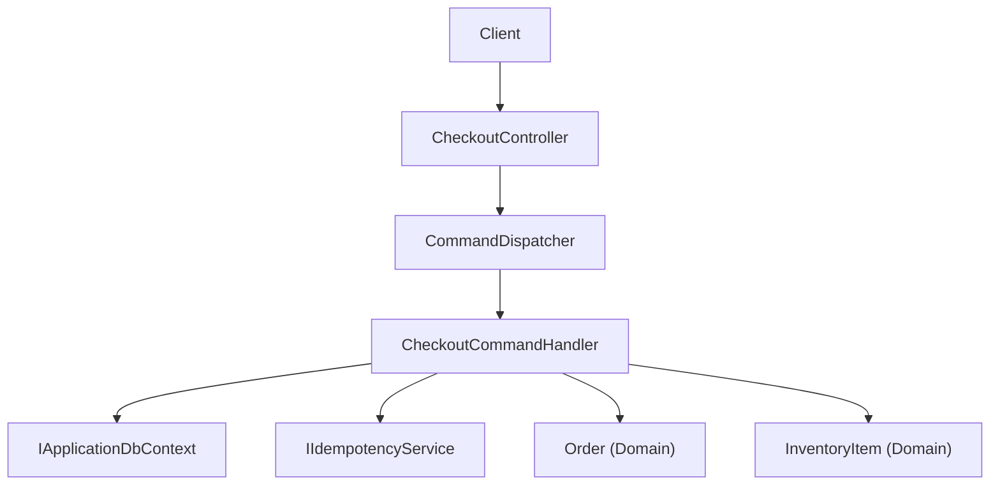
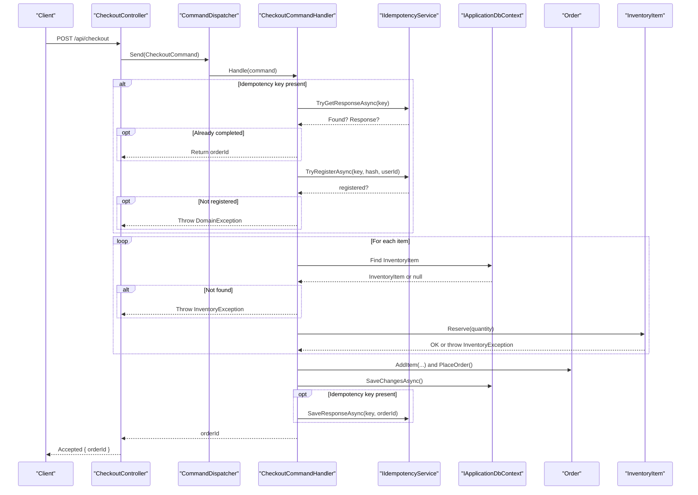
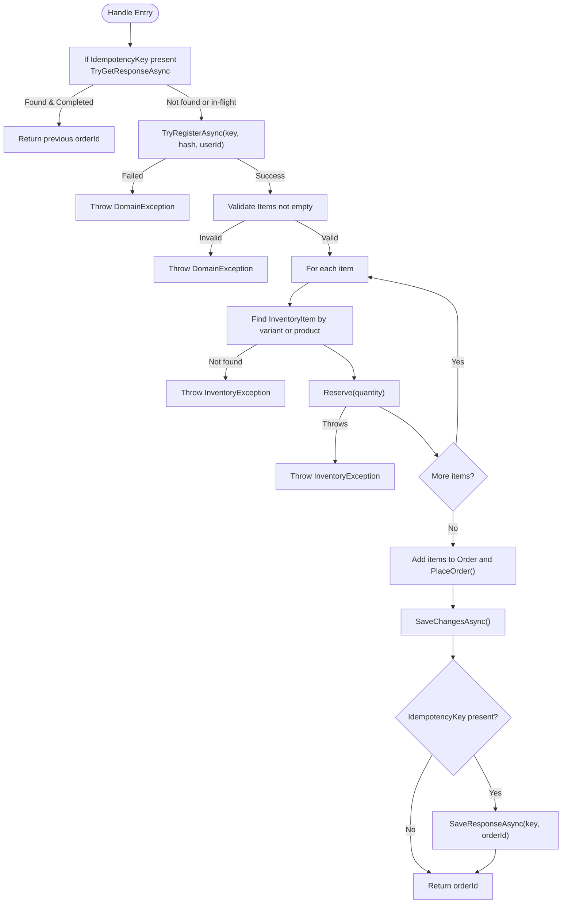
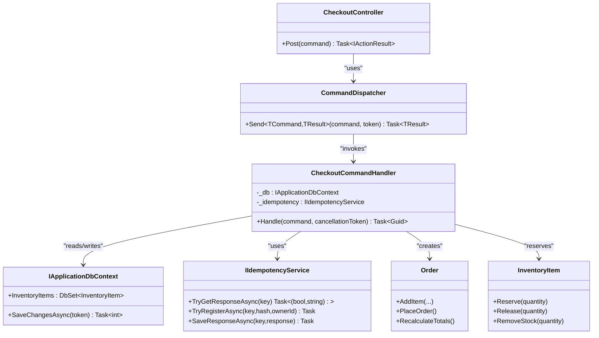

# Checkout Handler

<cite>
**Referenced Files in This Document**
- [CheckoutCommandHandler.cs](file://src/Ecommerce.Application/Commands/Checkout/CheckoutCommandHandler.cs)
- [CheckoutCommand.cs](file://src/Ecommerce.Application/Commands/Checkout/CheckoutCommand.cs)
- [CheckoutCommandValidator.cs](file://src/Ecommerce.Application/Commands/Checkout/CheckoutCommandValidator.cs)
- [CheckoutController.cs](file://src/Ecommerce.Api/Controllers/CheckoutController.cs)
- [Order.cs](file://src/Ecommerce.Domain/Entities/Order.cs)
- [InventoryItem.cs](file://src/Ecommerce.Domain/Entities/InventoryItem.cs)
- [IApplicationDbContext.cs](file://src/Ecommerce.Application/Interfaces/IApplicationDbContext.cs)
- [IIdempotencyService.cs](file://src/Ecommerce.Application/Interfaces/IIdempotencyService.cs)
- [CommandDispatcher.cs](file://src/Ecommerce.Application/Common/Commands/CommandDispatcher.cs)
- [DomainException.cs](file://src/Ecommerce.Domain/Exceptions/DomainException.cs)
- [InventoryException.cs](file://src/Ecommerce.Domain/Exceptions/InventoryException.cs)
- [IdempotencyService.cs](file://src/Ecommerce.Infrastructure/Services/IdempotencyService.cs)
- [CheckoutHandlerTests.cs](file://tests/Ecommerce.Application.Tests/CheckoutHandlerTests.cs)
- [CheckoutIdempotencyTests.cs](file://tests/Ecommerce.Application.Tests/CheckoutIdempotencyTests.cs)
</cite>

## Table of Contents
1. [Introduction](#introduction)
2. [Project Structure](#project-structure)
3. [Core Components](#core-components)
4. [Architecture Overview](#architecture-overview)
5. [Detailed Component Analysis](#detailed-component-analysis)
6. [Dependency Analysis](#dependency-analysis)
7. [Performance Considerations](#performance-considerations)
8. [Troubleshooting Guide](#troubleshooting-guide)
9. [Conclusion](#conclusion)

## Introduction
This document explains the CheckoutCommandHandler implementation within a CQRS-based e-commerce application. It details how the handler orchestrates checkout operations including cart validation, inventory reservation, order creation, and idempotent request handling. It also covers error handling strategies, transactional considerations, and rollback behavior, with examples for successful flows and failure scenarios.

## Project Structure
The checkout feature spans API, Application, Domain, Infrastructure, and Tests layers:
- API layer exposes an HTTP endpoint that dispatches commands.
- Application layer contains the command, validator, and handler implementing business orchestration.
- Domain layer defines entities (Order, InventoryItem) and domain exceptions.
- Infrastructure provides persistence and idempotency services.
- Tests validate success paths and idempotency guarantees.

**Diagram sources**
- [CheckoutController.cs:19-24](file://src/Ecommerce.Api/Controllers/CheckoutController.cs#L19-L24)
- [CommandDispatcher.cs:20-43](file://src/Ecommerce.Application/Common/Commands/CommandDispatcher.cs#L20-L43)
- [CheckoutCommandHandler.cs:22-90](file://src/Ecommerce.Application/Commands/Checkout/CheckoutCommandHandler.cs#L22-L90)
- [Order.cs:36-102](file://src/Ecommerce.Domain/Entities/Order.cs#L36-L102)
- [InventoryItem.cs:29-40](file://src/Ecommerce.Domain/Entities/InventoryItem.cs#L29-L40)
- [IApplicationDbContext.cs:8-13](file://src/Ecommerce.Application/Interfaces/IApplicationDbContext.cs#L8-L13)
- [IIdempotencyService.cs:6-11](file://src/Ecommerce.Application/Interfaces/IIdempotencyService.cs#L6-L11)

**Section sources**
- [CheckoutController.cs:1-27](file://src/Ecommerce.Api/Controllers/CheckoutController.cs#L1-L27)
- [CommandDispatcher.cs:1-47](file://src/Ecommerce.Application/Common/Commands/CommandDispatcher.cs#L1-L47)
- [CheckoutCommandHandler.cs:1-94](file://src/Ecommerce.Application/Commands/Checkout/CheckoutCommandHandler.cs#L1-L94)

## Core Components
- CheckoutCommand: Represents user intent to purchase items, including optional idempotency key and currency.
- CheckoutCommandValidator: Validates input constraints such as non-empty cart and positive quantities.
- CheckoutCommandHandler: Orchestrates checkout by validating inputs, reserving inventory, building and placing orders, persisting changes, and ensuring idempotency.
- CommandDispatcher: Resolves handlers and applies pipeline behaviors before invoking Handle.
- Domain Entities: Order encapsulates order lifecycle; InventoryItem enforces stock rules and reservations.
- IIdempotencyService: Prevents duplicate processing of identical requests.

Key responsibilities:
- Validate command via built-in validators.
- Enforce idempotency using keys when provided.
- Reserve inventory per item.
- Create and place the order.
- Persist changes and record idempotency response.

**Section sources**
- [CheckoutCommand.cs:6-20](file://src/Ecommerce.Application/Commands/Checkout/CheckoutCommand.cs#L6-L20)
- [CheckoutCommandValidator.cs:6-30](file://src/Ecommerce.Application/Commands/Checkout/CheckoutCommandValidator.cs#L6-L30)
- [CheckoutCommandHandler.cs:22-90](file://src/Ecommerce.Application/Commands/Checkout/CheckoutCommandHandler.cs#L22-L90)
- [CommandDispatcher.cs:20-43](file://src/Ecommerce.Application/Common/Commands/CommandDispatcher.cs#L20-L43)
- [Order.cs:36-102](file://src/Ecommerce.Domain/Entities/Order.cs#L36-L102)
- [InventoryItem.cs:29-40](file://src/Ecommerce.Domain/Entities/InventoryItem.cs#L29-L40)
- [IIdempotencyService.cs:6-11](file://src/Ecommerce.Application/Interfaces/IIdempotencyService.cs#L6-L11)

## Architecture Overview
The checkout flow follows CQRS:
- The API receives a POST request and sends a CheckoutCommand through the dispatcher.
- Behaviors (validation, logging) wrap the handler execution.
- The handler performs domain operations and persists state.
- Idempotency ensures repeated requests with the same key return the same result without side effects.

**Diagram sources**
- [CheckoutController.cs:19-24](file://src/Ecommerce.Api/Controllers/CheckoutController.cs#L19-L24)
- [CommandDispatcher.cs:20-43](file://src/Ecommerce.Application/Common/Commands/CommandDispatcher.cs#L20-L43)
- [CheckoutCommandHandler.cs:22-90](file://src/Ecommerce.Application/Commands/Checkout/CheckoutCommandHandler.cs#L22-L90)
- [Order.cs:36-102](file://src/Ecommerce.Domain/Entities/Order.cs#L36-L102)
- [InventoryItem.cs:29-40](file://src/Ecommerce.Domain/Entities/InventoryItem.cs#L29-L40)
- [IIdempotencyService.cs:6-11](file://src/Ecommerce.Application/Interfaces/IIdempotencyService.cs#L6-L11)

## Detailed Component Analysis

### CheckoutCommandHandler
Responsibilities:
- Idempotency gating: checks for existing responses, registers attempts, and returns cached results on duplicates.
- Input validation: ensures at least one item is present.
- Inventory reservation: locates inventory by variant or product and reserves requested quantity.
- Order creation: builds order items, places the order, and persists it.
- Idempotency completion: records the final order ID when a key was used.

Error handling:
- Throws DomainException for invalid input or idempotency conflicts.
- Throws InventoryException when inventory is missing or insufficient.

Transaction management:
- Persistence occurs via SaveChangesAsync after adding the order.
- No explicit unit-of-work or ambient transaction is visible in the handler; failures during SaveChanges will roll back unsaved changes at the database level.

**Diagram sources**
- [CheckoutCommandHandler.cs:22-90](file://src/Ecommerce.Application/Commands/Checkout/CheckoutCommandHandler.cs#L22-L90)
- [Order.cs:36-102](file://src/Ecommerce.Domain/Entities/Order.cs#L36-L102)
- [InventoryItem.cs:29-40](file://src/Ecommerce.Domain/Entities/InventoryItem.cs#L29-L40)
- [IIdempotencyService.cs:6-11](file://src/Ecommerce.Application/Interfaces/IIdempotencyService.cs#L6-L11)

**Section sources**
- [CheckoutCommandHandler.cs:22-90](file://src/Ecommerce.Application/Commands/Checkout/CheckoutCommandHandler.cs#L22-L90)

### Command and Validation
- CheckoutCommand carries UserId, Items, Currency, ShippingAddress, and optional IdempotencyKey.
- Validators enforce:
  - Non-empty cart.
  - Positive quantities per item.
  - Optional currency presence.

Validation is applied via pipeline behaviors around the handler invocation.

**Section sources**
- [CheckoutCommand.cs:6-20](file://src/Ecommerce.Application/Commands/Checkout/CheckoutCommand.cs#L6-L20)
- [CheckoutCommandValidator.cs:6-30](file://src/Ecommerce.Application/Commands/Checkout/CheckoutCommandValidator.cs#L6-L30)

### Domain Entities
- Order:
  - Adds items with price, quantity, discounts, and taxes.
  - Recalculates totals.
  - Places the order, setting status fields and timestamps.
- InventoryItem:
  - Tracks on-hand and reserved quantities.
  - Enforces reserve/release/remove rules and backorder policy.

These entities encapsulate business invariants and are mutated by the handler during checkout.

**Section sources**
- [Order.cs:36-102](file://src/Ecommerce.Domain/Entities/Order.cs#L36-L102)
- [InventoryItem.cs:20-67](file://src/Ecommerce.Domain/Entities/InventoryItem.cs#L20-L67)

### Idempotency Service
- TryGetResponseAsync: retrieves stored response if available.
- TryRegisterAsync: creates a registration record to prevent concurrent/duplicate processing.
- SaveResponseAsync: marks the key as completed and stores the result.

Used by the handler to ensure repeated requests with the same key do not create duplicate orders.

**Section sources**
- [IdempotencyService.cs:19-53](file://src/Ecommerce.Infrastructure/Services/IdempotencyService.cs#L19-L53)
- [IIdempotencyService.cs:6-11](file://src/Ecommerce.Application/Interfaces/IIdempotencyService.cs#L6-L11)

### API Endpoint
- CheckoutController posts to /api/checkout and delegates to CommandDispatcher.
- Returns Accepted with the created order ID.

**Section sources**
- [CheckoutController.cs:19-24](file://src/Ecommerce.Api/Controllers/CheckoutController.cs#L19-L24)

## Dependency Analysis

**Diagram sources**
- [CheckoutCommandHandler.cs:11-20](file://src/Ecommerce.Application/Commands/Checkout/CheckoutCommandHandler.cs#L11-L20)
- [CommandDispatcher.cs:20-43](file://src/Ecommerce.Application/Common/Commands/CommandDispatcher.cs#L20-L43)
- [CheckoutController.cs:19-24](file://src/Ecommerce.Api/Controllers/CheckoutController.cs#L19-L24)
- [Order.cs:36-102](file://src/Ecommerce.Domain/Entities/Order.cs#L36-L102)
- [InventoryItem.cs:29-67](file://src/Ecommerce.Domain/Entities/InventoryItem.cs#L29-L67)
- [IApplicationDbContext.cs:8-13](file://src/Ecommerce.Application/Interfaces/IApplicationDbContext.cs#L8-L13)
- [IIdempotencyService.cs:6-11](file://src/Ecommerce.Application/Interfaces/IIdempotencyService.cs#L6-L11)

**Section sources**
- [CheckoutCommandHandler.cs:11-20](file://src/Ecommerce.Application/Commands/Checkout/CheckoutCommandHandler.cs#L11-L20)
- [CommandDispatcher.cs:20-43](file://src/Ecommerce.Application/Common/Commands/CommandDispatcher.cs#L20-L43)
- [CheckoutController.cs:19-24](file://src/Ecommerce.Api/Controllers/CheckoutController.cs#L19-L24)

## Performance Considerations
- Idempotency checks avoid duplicate work and reduce load on downstream processes.
- Inventory lookup uses direct queries; consider indexing ProductVariantId and ProductId for faster retrieval.
- Batch operations: if many items are checked out, consider batching inventory updates and order item inserts to reduce round trips.
- Avoid unnecessary object graph materialization; only fetch required fields.

[No sources needed since this section provides general guidance]

## Troubleshooting Guide
Common errors and their origins:
- Empty cart:
  - Cause: Command has no items or all quantities are zero/negative.
  - Handled by validators and early guard in handler.
  - Response: Validation error from pipeline; handler throws DomainException for empty items.
- Missing inventory:
  - Cause: No inventory record found for product/variant.
  - Handler throws InventoryException.
- Insufficient stock:
  - Cause: Available stock less than requested and backorders not allowed.
  - InventoryItem.Reserve throws InventoryException.
- Idempotency conflict:
  - Cause: Key already registered and not yet completed.
  - Handler throws DomainException indicating request in flight.
- Persistence failure:
  - Cause: Database write fails.
  - Behavior: Uncommitted changes are rolled back by the underlying context/database transaction scope.

Recovery recommendations:
- Retry with a new idempotency key for transient failures.
- Ensure inventory is replenished or allow backorders where appropriate.
- Log and surface validation errors to clients for correction.

**Section sources**
- [CheckoutCommandValidator.cs:6-30](file://src/Ecommerce.Application/Commands/Checkout/CheckoutCommandValidator.cs#L6-L30)
- [CheckoutCommandHandler.cs:22-90](file://src/Ecommerce.Application/Commands/Checkout/CheckoutCommandHandler.cs#L22-L90)
- [InventoryItem.cs:29-40](file://src/Ecommerce.Domain/Entities/InventoryItem.cs#L29-L40)
- [DomainException.cs:5-8](file://src/Ecommerce.Domain/Exceptions/DomainException.cs#L5-L8)
- [InventoryException.cs:5-8](file://src/Ecommerce.Domain/Exceptions/InventoryException.cs#L5-L8)

## Conclusion
The CheckoutCommandHandler implements a robust, idempotent checkout workflow within a CQRS architecture. It validates inputs, reserves inventory, constructs and places orders, and persists changes while preventing duplicate processing. Error handling leverages domain-specific exceptions, and transactional boundaries are managed by the persistence layer. Tests demonstrate successful order creation and idempotency guarantees.

[No sources needed since this section summarizes without analyzing specific files]

## Appendices

### Example Scenarios

- Successful checkout:
  - A client sends a valid CheckoutCommand with items and optional idempotency key.
  - The handler reserves inventory, creates and places the order, persists it, and returns the order ID.
  - If an idempotency key is provided, subsequent identical requests return the same order ID without creating duplicates.

- Failure: missing inventory:
  - If no inventory record exists for the requested product/variant, the handler throws InventoryException.
  - The API surfaces a validation/business error to the client.

- Failure: insufficient stock:
  - If available stock is less than requested and backorders are disallowed, InventoryItem.Reserve throws InventoryException.
  - The client should adjust quantity or enable backorders.

- Failure: idempotency conflict:
  - If a key is already registered and not completed, the handler throws DomainException indicating the request is in flight.
  - The client can retry later or use a new key.

- Failure: empty cart:
  - Validators reject requests with no items or invalid quantities.
  - The handler also guards against empty item lists.

**Section sources**
- [CheckoutHandlerTests.cs:23-54](file://tests/Ecommerce.Application.Tests/CheckoutHandlerTests.cs#L23-L54)
- [CheckoutIdempotencyTests.cs:22-53](file://tests/Ecommerce.Application.Tests/CheckoutIdempotencyTests.cs#L22-L53)
- [CheckoutCommandHandler.cs:22-90](file://src/Ecommerce.Application/Commands/Checkout/CheckoutCommandHandler.cs#L22-L90)
- [InventoryItem.cs:29-40](file://src/Ecommerce.Domain/Entities/InventoryItem.cs#L29-L40)
- [CheckoutCommandValidator.cs:6-30](file://src/Ecommerce.Application/Commands/Checkout/CheckoutCommandValidator.cs#L6-L30)