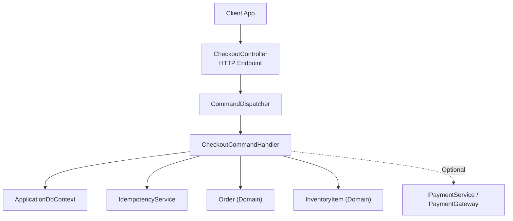
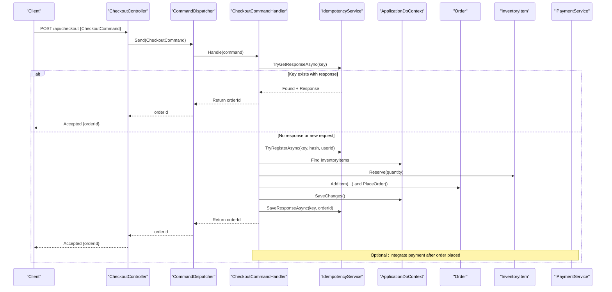
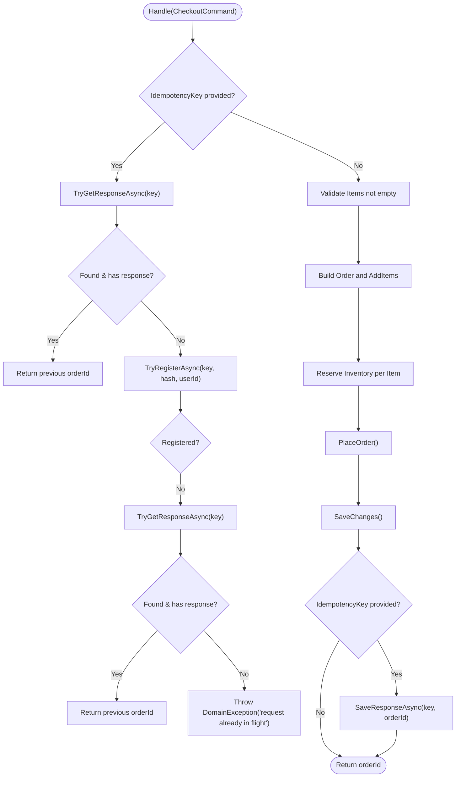
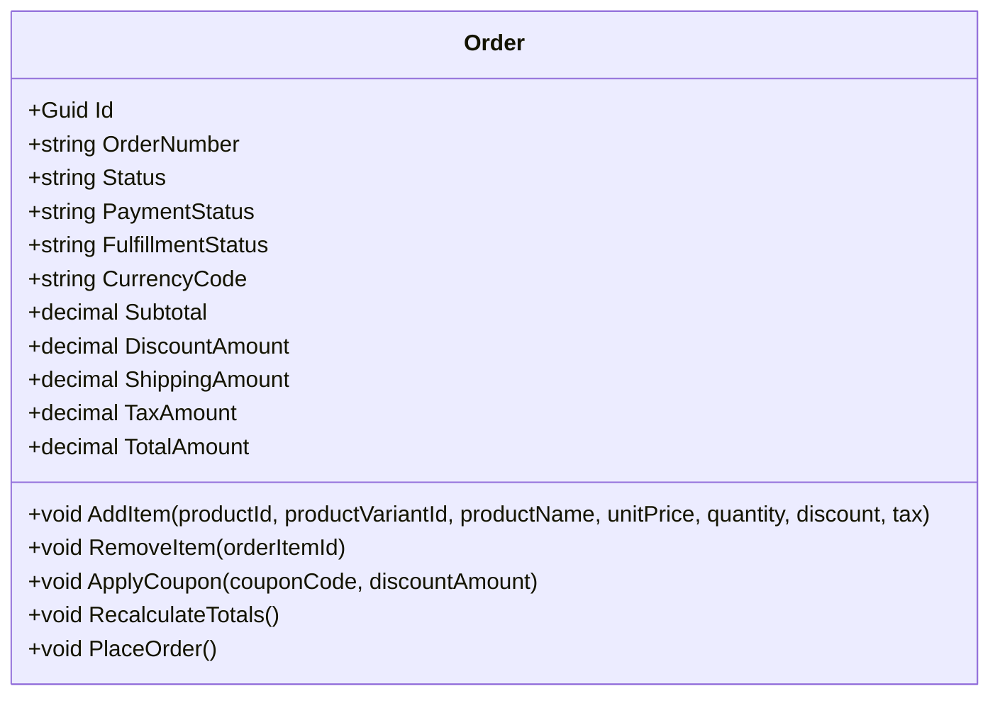
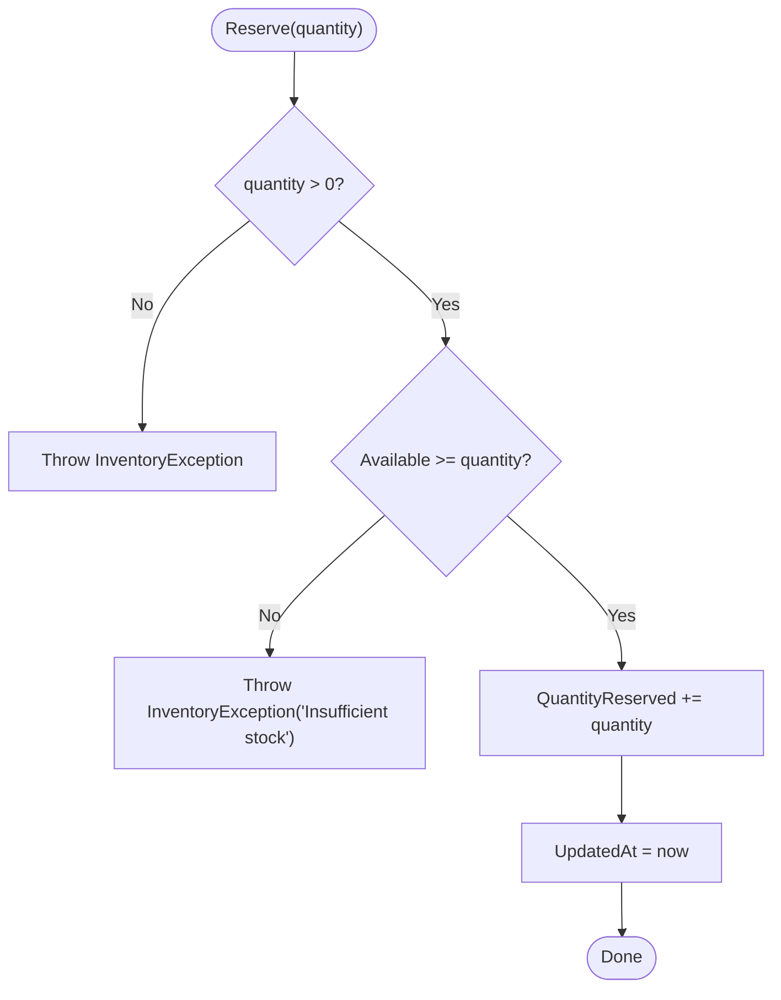
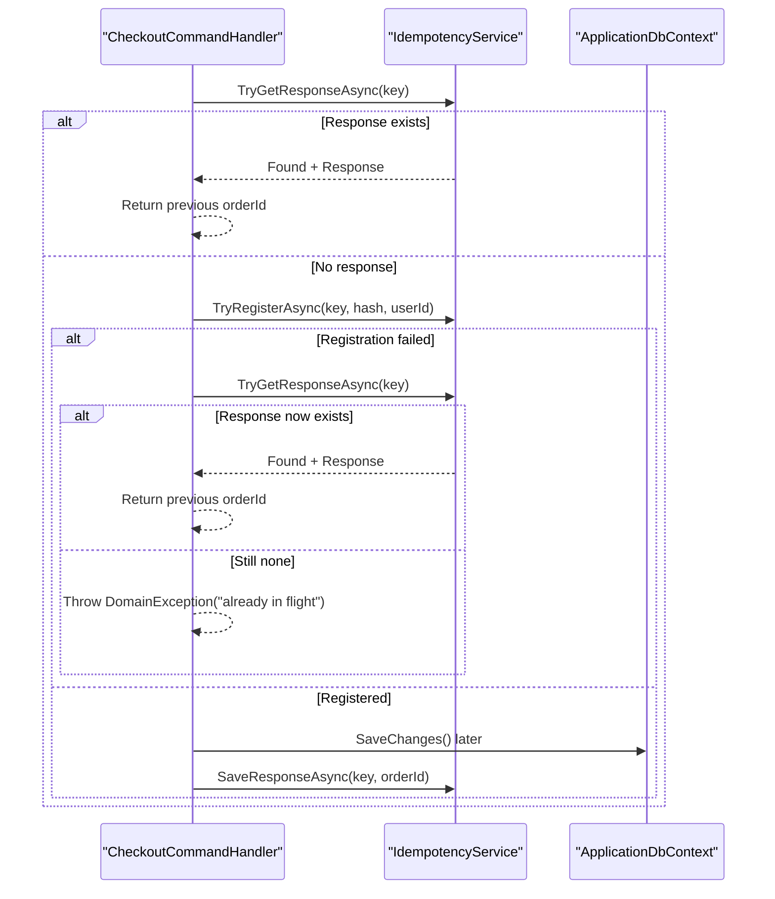
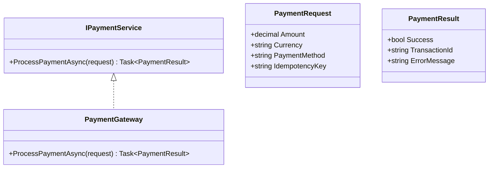
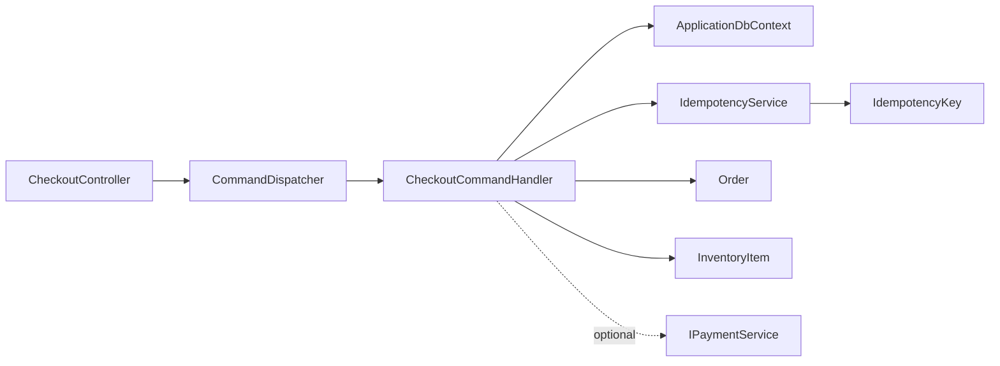

# Checkout Process

<cite>
**Referenced Files in This Document**
- [CheckoutController.cs](file://src/Ecommerce.Api/Controllers/CheckoutController.cs)
- [CheckoutCommand.cs](file://src/Ecommerce.Application/Commands/Checkout/CheckoutCommand.cs)
- [CheckoutCommandHandler.cs](file://src/Ecommerce.Application/Commands/Checkout/CheckoutCommandHandler.cs)
- [Order.cs](file://src/Ecommerce.Domain/Entities/Order.cs)
- [InventoryItem.cs](file://src/Ecommerce.Domain/Entities/InventoryItem.cs)
- [IdempotencyKey.cs](file://src/Ecommerce.Domain/Entities/IdempotencyKey.cs)
- [IdempotencyService.cs](file://src/Ecommerce.Infrastructure/Services/IdempotencyService.cs)
- [PaymentGateway.cs](file://src/Ecommerce.Infrastructure/Payments/PaymentGateway.cs)
- [IPaymentService.cs](file://src/Ecommerce.Application/Interfaces/IPaymentService.cs)
- [ReserveInventoryCommand.cs](file://src/Ecommerce.Application/Commands/ReserveInventory/ReserveInventoryCommand.cs)
- [ReserveInventoryCommandHandler.cs](file://src/Ecommerce.Application/Commands/ReserveInventory/ReserveInventoryCommandHandler.cs)
- [DomainException.cs](file://src/Ecommerce.Domain/Exceptions/DomainException.cs)
- [InventoryException.cs](file://src/Ecommerce.Domain/Exceptions/InventoryException.cs)
- [CheckoutHandlerTests.cs](file://tests/Ecommerce.Application.Tests/CheckoutHandlerTests.cs)
</cite>

## Table of Contents
1. [Introduction](#introduction)
2. [Project Structure](#project-structure)
3. [Core Components](#core-components)
4. [Architecture Overview](#architecture-overview)
5. [Detailed Component Analysis](#detailed-component-analysis)
6. [Dependency Analysis](#dependency-analysis)
7. [Performance Considerations](#performance-considerations)
8. [Troubleshooting Guide](#troubleshooting-guide)
9. [Conclusion](#conclusion)
10. [Appendices](#appendices)

## Introduction
This document explains the checkout process from cart validation to order creation, with a focus on idempotency, inventory reservation, payment integration points, error handling, concurrency safeguards, timeouts, and rollback strategies. It is designed for both technical and non-technical readers and includes diagrams, API examples, and common error scenarios.

## Project Structure
The checkout feature spans multiple layers:
- API layer exposes an HTTP endpoint that dispatches a command.
- Application layer orchestrates business logic via commands and handlers.
- Domain layer defines entities (Order, InventoryItem), value objects, and exceptions.
- Infrastructure layer provides persistence and external integrations (payments).

**Diagram sources**
- [CheckoutController.cs:8-24](file://src/Ecommerce.Api/Controllers/CheckoutController.cs#L8-L24)
- [CheckoutCommandHandler.cs:11-91](file://src/Ecommerce.Application/Commands/Checkout/CheckoutCommandHandler.cs#L11-L91)
- [IdempotencyService.cs:10-54](file://src/Ecommerce.Infrastructure/Services/IdempotencyService.cs#L10-L54)
- [Order.cs:8-102](file://src/Ecommerce.Domain/Entities/Order.cs#L8-L102)
- [InventoryItem.cs:6-67](file://src/Ecommerce.Domain/Entities/InventoryItem.cs#L6-L67)
- [PaymentGateway.cs:7-23](file://src/Ecommerce.Infrastructure/Payments/PaymentGateway.cs#L7-L23)

**Section sources**
- [CheckoutController.cs:8-24](file://src/Ecommerce.Api/Controllers/CheckoutController.cs#L8-L24)
- [CheckoutCommandHandler.cs:11-91](file://src/Ecommerce.Application/Commands/Checkout/CheckoutCommandHandler.cs#L11-L91)

## Core Components
- CheckoutController: Accepts POST requests and dispatches CheckoutCommand.
- CheckoutCommand: Carries UserId, Items, Currency, ShippingAddress, and optional IdempotencyKey.
- CheckoutCommandHandler: Validates input, enforces idempotency, builds Order, reserves inventory, persists changes, and records idempotent response.
- Order: Domain entity representing an order with items, totals, and lifecycle methods like PlaceOrder.
- InventoryItem: Domain entity managing stock levels and reservations.
- IdempotencyService: Ensures duplicate requests are handled safely by tracking keys and responses.
- IPaymentService and PaymentGateway: Abstraction and stub implementation for payment processing.

**Section sources**
- [CheckoutController.cs:8-24](file://src/Ecommerce.Api/Controllers/CheckoutController.cs#L8-L24)
- [CheckoutCommand.cs:6-20](file://src/Ecommerce.Application/Commands/Checkout/CheckoutCommand.cs#L6-L20)
- [CheckoutCommandHandler.cs:11-91](file://src/Ecommerce.Application/Commands/Checkout/CheckoutCommandHandler.cs#L11-L91)
- [Order.cs:8-102](file://src/Ecommerce.Domain/Entities/Order.cs#L8-L102)
- [InventoryItem.cs:6-67](file://src/Ecommerce.Domain/Entities/InventoryItem.cs#L6-L67)
- [IdempotencyService.cs:10-54](file://src/Ecommerce.Infrastructure/Services/IdempotencyService.cs#L10-L54)
- [IPaymentService.cs:5-23](file://src/Ecommerce.Application/Interfaces/IPaymentService.cs#L5-L23)
- [PaymentGateway.cs:7-23](file://src/Ecommerce.Infrastructure/Payments/PaymentGateway.cs#L7-L23)

## Architecture Overview
The checkout workflow follows a command-driven pattern:
- The client sends a POST to the checkout endpoint with a command payload.
- The controller delegates to a command dispatcher which invokes the handler.
- The handler performs idempotency checks, validates items, constructs an Order, reserves inventory, persists changes, and optionally integrates with payments.
- Idempotency ensures that repeated requests with the same key return the same result without creating duplicate orders.

**Diagram sources**
- [CheckoutController.cs:19-24](file://src/Ecommerce.Api/Controllers/CheckoutController.cs#L19-L24)
- [CheckoutCommandHandler.cs:22-91](file://src/Ecommerce.Application/Commands/Checkout/CheckoutCommandHandler.cs#L22-L91)
- [IdempotencyService.cs:19-54](file://src/Ecommerce.Infrastructure/Services/IdempotencyService.cs#L19-L54)
- [Order.cs:36-102](file://src/Ecommerce.Domain/Entities/Order.cs#L36-L102)
- [InventoryItem.cs:29-40](file://src/Ecommerce.Domain/Entities/InventoryItem.cs#L29-L40)
- [IPaymentService.cs:5-23](file://src/Ecommerce.Application/Interfaces/IPaymentService.cs#L5-L23)

## Detailed Component Analysis

### Checkout Command and Handler
- Input: CheckoutCommand contains UserId, Items list, Currency, ShippingAddress, and optional IdempotencyKey.
- Validation: Ensures items are present; throws domain exception if empty.
- Idempotency:
  - If IdempotencyKey provided, attempts to retrieve existing response.
  - Registers attempt with a simple request hash; if registration fails due to concurrent in-flight request, tries to fetch response again or throws a domain exception indicating conflict.
- Order Creation:
  - Builds Order, adds items, calls PlaceOrder to set statuses and timestamps.
- Inventory Reservation:
  - For each item, locates InventoryItem by ProductVariantId or fallback to ProductId, then reserves quantity.
  - Throws InventoryException if not found or insufficient stock.
- Persistence:
  - Persists Order and related changes within a single save operation.
  - Records final orderId in IdempotencyService when key was used.

**Diagram sources**
- [CheckoutCommandHandler.cs:22-91](file://src/Ecommerce.Application/Commands/Checkout/CheckoutCommandHandler.cs#L22-L91)
- [IdempotencyService.cs:19-54](file://src/Ecommerce.Infrastructure/Services/IdempotencyService.cs#L19-L54)
- [Order.cs:36-102](file://src/Ecommerce.Domain/Entities/Order.cs#L36-L102)
- [InventoryItem.cs:29-40](file://src/Ecommerce.Domain/Entities/InventoryItem.cs#L29-L40)

**Section sources**
- [CheckoutCommand.cs:6-20](file://src/Ecommerce.Application/Commands/Checkout/CheckoutCommand.cs#L6-L20)
- [CheckoutCommandHandler.cs:22-91](file://src/Ecommerce.Application/Commands/Checkout/CheckoutCommandHandler.cs#L22-L91)

### Order Entity
- Maintains items, totals, and lifecycle states.
- PlaceOrder sets status fields and timestamps, recalculates totals.
- AddItem enforces positive quantity and non-negative unit price.

**Diagram sources**
- [Order.cs:8-102](file://src/Ecommerce.Domain/Entities/Order.cs#L8-L102)

**Section sources**
- [Order.cs:8-102](file://src/Ecommerce.Domain/Entities/Order.cs#L8-L102)

### Inventory Reservation System
- InventoryItem tracks QuantityOnHand and QuantityReserved.
- Reserve enforces availability unless backorders are allowed; updates reserved quantity.
- Release and RemoveStock provide reversal and consumption operations.

**Diagram sources**
- [InventoryItem.cs:29-40](file://src/Ecommerce.Domain/Entities/InventoryItem.cs#L29-L40)

**Section sources**
- [InventoryItem.cs:6-67](file://src/Ecommerce.Domain/Entities/InventoryItem.cs#L6-L67)
- [ReserveInventoryCommand.cs:5-9](file://src/Ecommerce.Application/Commands/ReserveInventory/ReserveInventoryCommand.cs#L5-L9)
- [ReserveInventoryCommandHandler.cs:17-28](file://src/Ecommerce.Application/Commands/ReserveInventory/ReserveInventoryCommandHandler.cs#L17-L28)

### Idempotency Mechanism
- IdempotencyKey prevents duplicate order creation.
- Flow:
  - TryGetResponseAsync returns existing response if available.
  - TryRegisterAsync creates a record with status Registered; if key exists, registration fails.
  - On success, SaveResponseAsync stores orderId and marks Completed.
- Concurrency safeguard: If registration fails and no response yet, handler throws a domain exception indicating the request is already in flight.

**Diagram sources**
- [IdempotencyService.cs:19-54](file://src/Ecommerce.Infrastructure/Services/IdempotencyService.cs#L19-L54)
- [CheckoutCommandHandler.cs:22-44](file://src/Ecommerce.Application/Commands/Checkout/CheckoutCommandHandler.cs#L22-L44)
- [IdempotencyKey.cs:5-14](file://src/Ecommerce.Domain/Entities/IdempotencyKey.cs#L5-L14)

**Section sources**
- [IdempotencyService.cs:19-54](file://src/Ecommerce.Infrastructure/Services/IdempotencyService.cs#L19-L54)
- [CheckoutCommandHandler.cs:22-44](file://src/Ecommerce.Application/Commands/Checkout/CheckoutCommandHandler.cs#L22-L44)
- [IdempotencyKey.cs:5-14](file://src/Ecommerce.Domain/Entities/IdempotencyKey.cs#L5-L14)

### Payment Processing Integration Points
- IPaymentService defines ProcessPaymentAsync with PaymentRequest and PaymentResult.
- PaymentGateway is a stub returning success with a generated transaction id.
- In production, integrate with providers such as Stripe, PayPal, Adyen.
- Current checkout flow does not call payment; it can be added after order placement and before finalizing payment status.

**Diagram sources**
- [IPaymentService.cs:5-23](file://src/Ecommerce.Application/Interfaces/IPaymentService.cs#L5-L23)
- [PaymentGateway.cs:7-23](file://src/Ecommerce.Infrastructure/Payments/PaymentGateway.cs#L7-L23)

**Section sources**
- [IPaymentService.cs:5-23](file://src/Ecommerce.Application/Interfaces/IPaymentService.cs#L5-L23)
- [PaymentGateway.cs:7-23](file://src/Ecommerce.Infrastructure/Payments/PaymentGateway.cs#L7-L23)

## Dependency Analysis
- CheckoutController depends on CommandDispatcher to route commands.
- CheckoutCommandHandler depends on:
  - IApplicationDbContext for persistence (Orders, InventoryItems).
  - IIdempotencyService for idempotency.
  - Domain entities Order and InventoryItem for business rules.
- IdempotencyService depends on ApplicationDbContext and IdempotencyKey entity.
- Payment integration is decoupled via IPaymentService; current implementation uses PaymentGateway stub.

**Diagram sources**
- [CheckoutController.cs:8-24](file://src/Ecommerce.Api/Controllers/CheckoutController.cs#L8-L24)
- [CheckoutCommandHandler.cs:11-91](file://src/Ecommerce.Application/Commands/Checkout/CheckoutCommandHandler.cs#L11-L91)
- [IdempotencyService.cs:10-54](file://src/Ecommerce.Infrastructure/Services/IdempotencyService.cs#L10-L54)
- [IdempotencyKey.cs:5-14](file://src/Ecommerce.Domain/Entities/IdempotencyKey.cs#L5-L14)
- [IPaymentService.cs:5-23](file://src/Ecommerce.Application/Interfaces/IPaymentService.cs#L5-L23)

**Section sources**
- [CheckoutController.cs:8-24](file://src/Ecommerce.Api/Controllers/CheckoutController.cs#L8-L24)
- [CheckoutCommandHandler.cs:11-91](file://src/Ecommerce.Application/Commands/Checkout/CheckoutCommandHandler.cs#L11-L91)
- [IdempotencyService.cs:10-54](file://src/Ecommerce.Infrastructure/Services/IdempotencyService.cs#L10-L54)

## Performance Considerations
- Idempotency lookups and registrations should be indexed on Key to minimize database load under high concurrency.
- Batch inventory reservations and order creation within a single transaction to reduce round-trips and ensure consistency.
- Use asynchronous operations consistently to avoid blocking threads.
- Consider caching frequently accessed product/variant details during checkout to reduce DB queries.
- Monitor and tune connection pooling and query timeouts for high-throughput scenarios.

[No sources needed since this section provides general guidance]

## Troubleshooting Guide
Common errors and their causes:
- No items to checkout: Occurs when Items list is null or empty.
- Inventory item not found: Occurs when neither ProductVariantId nor ProductId maps to an InventoryItem.
- Insufficient stock: Occurs when Available < requested quantity and backorders are disallowed.
- Request already in flight: Occurs when idempotency key registration fails and no response is available yet.

Error types:
- DomainException: General domain-level errors (e.g., invalid inputs).
- InventoryException: Specific to inventory operations (e.g., negative quantities, insufficient stock).

Recovery strategies:
- Validate inputs early to fail fast.
- Provide clear error messages to clients for retry with corrected data.
- Use idempotency keys to safely retry failed requests without duplication.
- Implement compensation actions (release reserved inventory) on failure paths where appropriate.

**Section sources**
- [CheckoutCommandHandler.cs:45-75](file://src/Ecommerce.Application/Commands/Checkout/CheckoutCommandHandler.cs#L45-L75)
- [InventoryItem.cs:29-40](file://src/Ecommerce.Domain/Entities/InventoryItem.cs#L29-L40)
- [DomainException.cs:5-8](file://src/Ecommerce.Domain/Exceptions/DomainException.cs#L5-L8)
- [InventoryException.cs:5-8](file://src/Ecommerce.Domain/Exceptions/InventoryException.cs#L5-L8)

## Conclusion
The checkout process leverages a command-driven architecture with strong idempotency guarantees, robust inventory reservation, and extensible payment integration. By validating inputs, enforcing business rules in domain entities, and persisting changes atomically, the system ensures transaction safety and prevents duplicate orders even under concurrent access. Proper error handling and idempotency keys enable reliable retries and consistent state across failures.

[No sources needed since this section summarizes without analyzing specific files]

## Appendices

### API Examples
- Endpoint: POST /api/checkout
- Request body example:
  - Fields:
    - UserId: string (Guid)
    - Items: array of objects with ProductId (Guid), ProductVariantId (Guid), Quantity (int)
    - Currency: string (default USD)
    - ShippingAddress: string
    - IdempotencyKey: string (optional)
- Response:
  - Status: 202 Accepted
  - Body: { orderId: Guid }

Notes:
- Include IdempotencyKey to prevent duplicate orders on retries.
- Ensure all required fields are present; otherwise, expect validation or domain exceptions.

**Section sources**
- [CheckoutController.cs:19-24](file://src/Ecommerce.Api/Controllers/CheckoutController.cs#L19-L24)
- [CheckoutCommand.cs:6-20](file://src/Ecommerce.Application/Commands/Checkout/CheckoutCommand.cs#L6-L20)

### Common Error Scenarios
- Empty items list: Returns domain exception indicating no items to checkout.
- Missing inventory: Returns inventory exception indicating item not found.
- Insufficient stock: Returns inventory exception indicating insufficient stock.
- Duplicate request: With idempotency key, returns previously recorded orderId; without key and concurrent conflicts, may throw domain exception indicating request already in flight.

**Section sources**
- [CheckoutCommandHandler.cs:45-44](file://src/Ecommerce.Application/Commands/Checkout/CheckoutCommandHandler.cs#L45-L44)
- [CheckoutCommandHandler.cs:62-75](file://src/Ecommerce.Application/Commands/Checkout/CheckoutCommandHandler.cs#L62-L75)
- [IdempotencyService.cs:19-44](file://src/Ecommerce.Infrastructure/Services/IdempotencyService.cs#L19-L44)

### Concurrency Handling and Rollback Procedures
- Concurrency:
  - IdempotencyService uses unique keys to serialize duplicate requests.
  - Handlers check for existing responses before proceeding.
- Rollback:
  - If any step fails after partial changes, ensure transactions are rolled back at the database level.
  - For inventory reservations, implement release mechanisms to revert reserved quantities on failure.
  - Integrate payment failures with order cancellation or status updates to maintain consistency.

[No sources needed since this section provides general guidance]

### Tests and Verification
- Unit tests verify that checkout creates an order and reserves inventory correctly.
- Example test setup uses an in-memory database and asserts order existence and updated reserved quantity.

**Section sources**
- [CheckoutHandlerTests.cs:23-54](file://tests/Ecommerce.Application.Tests/CheckoutHandlerTests.cs#L23-L54)