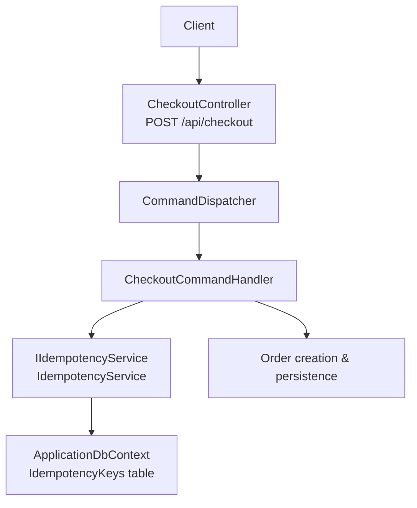
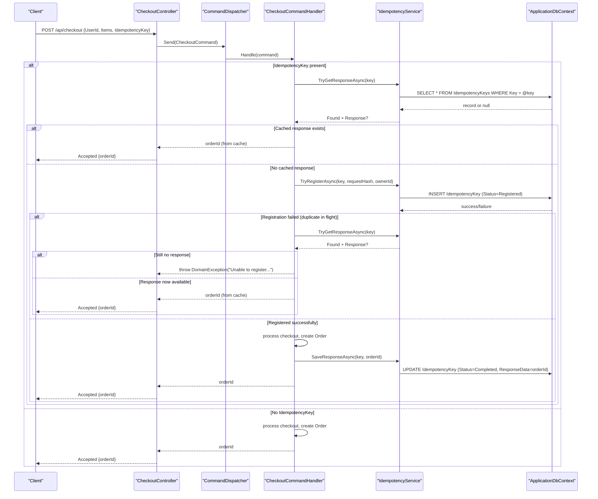
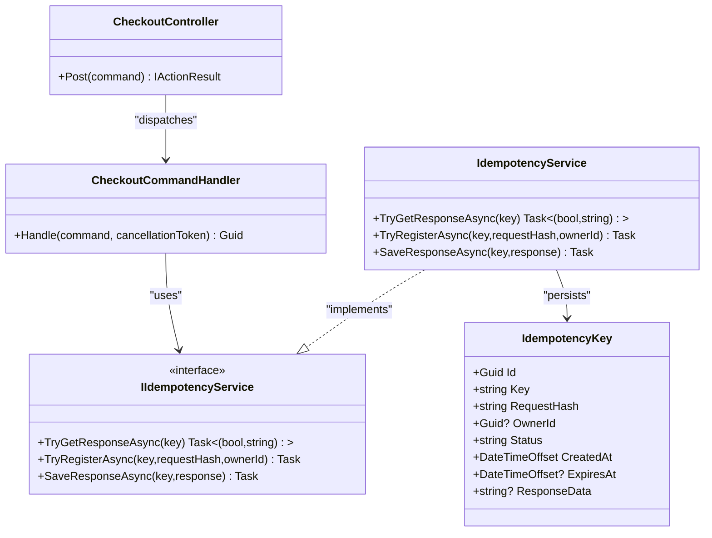

# Idempotency Mechanism

<cite>
**Referenced Files in This Document**
- [IdempotencyKey.cs](file://src/Ecommerce.Domain/Entities/IdempotencyKey.cs)
- [IIdempotencyService.cs](file://src/Ecommerce.Application/Interfaces/IIdempotencyService.cs)
- [IdempotencyService.cs](file://src/Ecommerce.Infrastructure/Services/IdempotencyService.cs)
- [CheckoutCommand.cs](file://src/Ecommerce.Application/Commands/Checkout/CheckoutCommand.cs)
- [CheckoutCommandHandler.cs](file://src/Ecommerce.Application/Commands/Checkout/CheckoutCommandHandler.cs)
- [CheckoutController.cs](file://src/Ecommerce.Api/Controllers/CheckoutController.cs)
- [20260815214939_InitialCreate.cs](file://src/Ecommerce.Infrastructure/Migrations/20260815214939_InitialCreate.cs)
- [RefreshTokenCleanupService.cs](file://src/Ecommerce.Infrastructure/Services/RefreshTokenCleanupService.cs)
- [CheckoutIdempotencyTests.cs](file://tests/Ecommerce.Application.Tests/CheckoutIdempotencyTests.cs)
- [CheckoutIdempotencyIntegrationTests.cs](file://tests/Ecommerce.IntegrationTests/CheckoutIdempotencyIntegrationTests.cs)
</cite>

## Table of Contents
1. [Introduction](#introduction)
2. [Project Structure](#project-structure)
3. [Core Components](#core-components)
4. [Architecture Overview](#architecture-overview)
5. [Detailed Component Analysis](#detailed-component-analysis)
6. [Dependency Analysis](#dependency-analysis)
7. [Performance Considerations](#performance-considerations)
8. [Troubleshooting Guide](#troubleshooting-guide)
9. [Conclusion](#conclusion)

## Introduction
This document explains the idempotency mechanism that prevents duplicate checkout operations. It covers how an IdempotencyKey identifies unique checkout requests, how duplicates are detected and handled, where and how idempotency records are stored, and what cleanup or expiration policies exist. It also addresses edge cases such as key collisions and storage failures, with references to the relevant source files.

## Project Structure
The idempotency feature spans multiple layers:
- API layer receives checkout requests and dispatches commands.
- Application layer enforces idempotency around command handling.
- Infrastructure layer persists idempotency state using a database-backed service.
- Domain defines the idempotency entity model.

**Diagram sources**
- [CheckoutController.cs:19-24](file://src/Ecommerce.Api/Controllers/CheckoutController.cs#L19-L24)
- [CheckoutCommandHandler.cs:22-90](file://src/Ecommerce.Application/Commands/Checkout/CheckoutCommandHandler.cs#L22-L90)
- [IdempotencyService.cs:19-54](file://src/Ecommerce.Infrastructure/Services/IdempotencyService.cs#L19-L54)
- [20260815214939_InitialCreate.cs:94-104](file://src/Ecommerce.Infrastructure/Migrations/20260815214939_InitialCreate.cs#L94-L104)

**Section sources**
- [CheckoutController.cs:19-24](file://src/Ecommerce.Api/Controllers/CheckoutController.cs#L19-L24)
- [CheckoutCommandHandler.cs:22-90](file://src/Ecommerce.Application/Commands/Checkout/CheckoutCommandHandler.cs#L22-L90)
- [IdempotencyService.cs:19-54](file://src/Ecommerce.Infrastructure/Services/IdempotencyService.cs#L19-L54)
- [20260815214939_InitialCreate.cs:94-104](file://src/Ecommerce.Infrastructure/Migrations/20260815214939_InitialCreate.cs#L94-L104)

## Core Components
- IdempotencyKey (domain entity): stores Key, RequestHash, OwnerId, Status, CreatedAt, ExpiresAt, ResponseData.
- IIdempotencyService (application interface): exposes TryGetResponseAsync, TryRegisterAsync, SaveResponseAsync.
- IdempotencyService (infrastructure implementation): performs lookups, registration, and response caching via EF Core.
- CheckoutCommandHandler: orchestrates idempotency checks before processing checkout logic and caches the order ID on success.
- CheckoutController: entry point for POST /api/checkout; returns Accepted with orderId.

Key behaviors:
- If an IdempotencyKey is provided, the handler first attempts to return a cached response if available.
- If not cached, it tries to register the key to prevent concurrent duplicates.
- On successful checkout, the resulting order ID is saved under the same key for future reuse.

**Section sources**
- [IdempotencyKey.cs:5-15](file://src/Ecommerce.Domain/Entities/IdempotencyKey.cs#L5-L15)
- [IIdempotencyService.cs:6-11](file://src/Ecommerce.Application/Interfaces/IIdempotencyService.cs#L6-L11)
- [IdempotencyService.cs:19-54](file://src/Ecommerce.Infrastructure/Services/IdempotencyService.cs#L19-L54)
- [CheckoutCommandHandler.cs:22-90](file://src/Ecommerce.Application/Commands/Checkout/CheckoutCommandHandler.cs#L22-L90)
- [CheckoutController.cs:19-24](file://src/Ecommerce.Api/Controllers/CheckoutController.cs#L19-L24)

## Architecture Overview
The idempotency flow ensures that identical checkout requests identified by the same IdempotencyKey produce exactly one order.

**Diagram sources**
- [CheckoutController.cs:19-24](file://src/Ecommerce.Api/Controllers/CheckoutController.cs#L19-L24)
- [CheckoutCommandHandler.cs:22-90](file://src/Ecommerce.Application/Commands/Checkout/CheckoutCommandHandler.cs#L22-L90)
- [IdempotencyService.cs:19-54](file://src/Ecommerce.Infrastructure/Services/IdempotencyService.cs#L19-L54)
- [20260815214939_InitialCreate.cs:94-104](file://src/Ecommerce.Infrastructure/Migrations/20260815214939_InitialCreate.cs#L94-L104)

## Detailed Component Analysis

### IdempotencyKey Entity
- Purpose: Represents a single idempotency attempt for a checkout request.
- Fields:
  - Key: Unique client-provided identifier for deduplication.
  - RequestHash: A hash derived from request content used to detect mismatched retries.
  - OwnerId: The user who initiated the request.
  - Status: Lifecycle states like Registered and Completed.
  - CreatedAt: When the idempotency record was created.
  - ExpiresAt: Intended for expiration policy (not enforced in current code).
  - ResponseData: Cached result (order ID string) returned on duplicate requests.

Storage strategy:
- Persisted in the IdempotencyKeys table via EF Core migrations.

**Section sources**
- [IdempotencyKey.cs:5-15](file://src/Ecommerce.Domain/Entities/IdempotencyKey.cs#L5-L15)
- [20260815214939_InitialCreate.cs:94-104](file://src/Ecommerce.Infrastructure/Migrations/20260815214939_InitialCreate.cs#L94-L104)

### IIdempotencyService Interface
Defines three core operations:
- TryGetResponseAsync: Returns whether a record exists and any cached response.
- TryRegisterAsync: Attempts to register a new idempotency key; returns false if already present.
- SaveResponseAsync: Saves the final response and marks status as completed.

**Section sources**
- [IIdempotencyService.cs:6-11](file://src/Ecommerce.Application/Interfaces/IIdempotencyService.cs#L6-L11)

### IdempotencyService Implementation
Behavior:
- TryGetResponseAsync queries by Key; returns cached ResponseData if present.
- TryRegisterAsync checks existence; inserts a new record with Status=Registered and CreatedAt set.
- SaveResponseAsync updates the existing record with ResponseData and Status=Completed; throws if record missing.

Concurrency note:
- Current implementation uses separate existence check and insert; this can allow race conditions under high concurrency without database-level constraints.

**Section sources**
- [IdempotencyService.cs:19-54](file://src/Ecommerce.Infrastructure/Services/IdempotencyService.cs#L19-L54)

### CheckoutCommandHandler
Idempotency integration:
- If IdempotencyKey is present:
  - First, try to return a cached order ID.
  - Then, attempt to register the key with a simple request hash based on UserId and item count.
  - If registration fails, re-check for a response; if still absent, throw a domain exception indicating the request is in flight.
- After successful checkout, save the order ID under the same key for future reuse.

Edge case handling:
- Throws when unable to register due to concurrent duplicate requests.
- Ensures only one order is persisted per unique key.

**Section sources**
- [CheckoutCommandHandler.cs:22-90](file://src/Ecommerce.Application/Commands/Checkout/CheckoutCommandHandler.cs#L22-L90)

### CheckoutController
- Exposes POST /api/checkout.
- Accepts a CheckoutCommand and returns Accepted with the orderId.

**Section sources**
- [CheckoutController.cs:19-24](file://src/Ecommerce.Api/Controllers/CheckoutController.cs#L19-L24)

### Data Model and Storage
- IdempotencyKeys table includes columns for Key, RequestHash, OwnerId, Status, CreatedAt, ExpiresAt, and ResponseData.
- The migration defines these fields; however, there is no explicit unique constraint or index shown in the referenced migration snippet.

Implications:
- Without a unique constraint on Key, concurrent registrations could lead to duplicates unless application-level checks succeed faster than contention.
- Query performance depends on indexes; consider adding an index on Key for frequent lookups.

**Section sources**
- [20260815214939_InitialCreate.cs:94-104](file://src/Ecommerce.Infrastructure/Migrations/20260815214939_InitialCreate.cs#L94-L104)

### Expiration and Cleanup
- The IdempotencyKey entity includes an ExpiresAt field, but the current IdempotencyService does not enforce or use it.
- There is no background job or scheduled task specifically for cleaning up expired idempotency keys in the codebase.
- A RefreshTokenCleanupService exists for refresh tokens, demonstrating a pattern for periodic cleanup jobs, but it is not applied to idempotency keys.

Recommendation:
- Implement a cleanup routine similar to the refresh token cleanup service to delete or archive expired idempotency records.

**Section sources**
- [IdempotencyKey.cs:12-13](file://src/Ecommerce.Domain/Entities/IdempotencyKey.cs#L12-L13)
- [IdempotencyService.cs:19-54](file://src/Ecommerce.Infrastructure/Services/IdempotencyService.cs#L19-L54)
- [RefreshTokenCleanupService.cs:21-43](file://src/Ecommerce.Infrastructure/Services/RefreshTokenCleanupService.cs#L21-L43)

### Tests and Validation
- Unit and integration tests verify that repeated calls with the same IdempotencyKey return the same orderId and that only one order is created.
- Tests seed inventory and execute the handler directly against an in-memory database.

**Section sources**
- [CheckoutIdempotencyTests.cs:22-53](file://tests/Ecommerce.Application.Tests/CheckoutIdempotencyTests.cs#L22-L53)
- [CheckoutIdempotencyIntegrationTests.cs:24-66](file://tests/Ecommerce.IntegrationTests/CheckoutIdempotencyIntegrationTests.cs#L24-L66)

## Dependency Analysis

**Diagram sources**
- [CheckoutController.cs:19-24](file://src/Ecommerce.Api/Controllers/CheckoutController.cs#L19-L24)
- [CheckoutCommandHandler.cs:22-90](file://src/Ecommerce.Application/Commands/Checkout/CheckoutCommandHandler.cs#L22-L90)
- [IIdempotencyService.cs:6-11](file://src/Ecommerce.Application/Interfaces/IIdempotencyService.cs#L6-L11)
- [IdempotencyService.cs:19-54](file://src/Ecommerce.Infrastructure/Services/IdempotencyService.cs#L19-L54)
- [IdempotencyKey.cs:5-15](file://src/Ecommerce.Domain/Entities/IdempotencyKey.cs#L5-L15)

**Section sources**
- [CheckoutController.cs:19-24](file://src/Ecommerce.Api/Controllers/CheckoutController.cs#L19-L24)
- [CheckoutCommandHandler.cs:22-90](file://src/Ecommerce.Application/Commands/Checkout/CheckoutCommandHandler.cs#L22-L90)
- [IIdempotencyService.cs:6-11](file://src/Ecommerce.Application/Interfaces/IIdempotencyService.cs#L6-L11)
- [IdempotencyService.cs:19-54](file://src/Ecommerce.Infrastructure/Services/IdempotencyService.cs#L19-L54)
- [IdempotencyKey.cs:5-15](file://src/Ecommerce.Domain/Entities/IdempotencyKey.cs#L5-L15)

## Performance Considerations
- Database reads/writes: Each idempotent request triggers at least two reads (lookup and possibly another after registration failure) and one write (registration or update). Ensure efficient indexing on Key.
- Concurrency: Without a database-level unique constraint on Key, high concurrency may cause duplicate registrations before the second read catches up. Consider adding a unique constraint and handling unique violation errors gracefully.
- Response caching: Storing the order ID avoids recomputation and reduces load on downstream services.

[No sources needed since this section provides general guidance]

## Troubleshooting Guide
Common issues and mitigations:
- Duplicate orders despite idempotency key:
  - Cause: Concurrent requests registering simultaneously without a unique constraint.
  - Mitigation: Add a unique constraint on Key and handle unique violations by treating them as “already registered” and returning the existing response.
- Key collision:
  - Risk: Two different users sending the same IdempotencyKey could collide.
  - Mitigation: Scope keys by OwnerId or include additional context in the key generation strategy.
- Storage failures:
  - Registration or response save failures will propagate exceptions. Wrap critical steps with retries or circuit breakers as appropriate.
- Missing cleanup:
  - Idempotency records accumulate over time. Implement a background job to purge or archive expired entries using ExpiresAt.

**Section sources**
- [IdempotencyService.cs:27-54](file://src/Ecommerce.Infrastructure/Services/IdempotencyService.cs#L27-L54)
- [CheckoutCommandHandler.cs:22-90](file://src/Ecommerce.Application/Commands/Checkout/CheckoutCommandHandler.cs#L22-L90)
- [RefreshTokenCleanupService.cs:21-43](file://src/Ecommerce.Infrastructure/Services/RefreshTokenCleanupService.cs#L21-L43)

## Conclusion
The idempotency mechanism leverages a client-provided IdempotencyKey to ensure that checkout operations are processed at most once. The handler checks for cached responses, registers new keys to prevent concurrent duplicates, and saves the resulting order ID for future reuse. While the domain model supports expiration via ExpiresAt, enforcement and cleanup are not implemented in the current codebase. To improve robustness, add database-level uniqueness on Key, implement expiration-based cleanup, and scope keys to avoid cross-user collisions.

[No sources needed since this section summarizes without analyzing specific files]