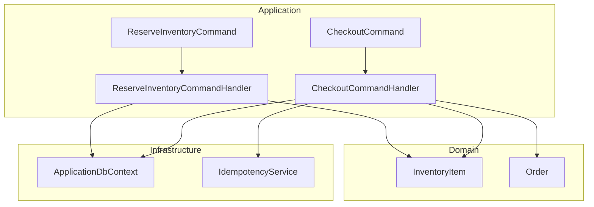
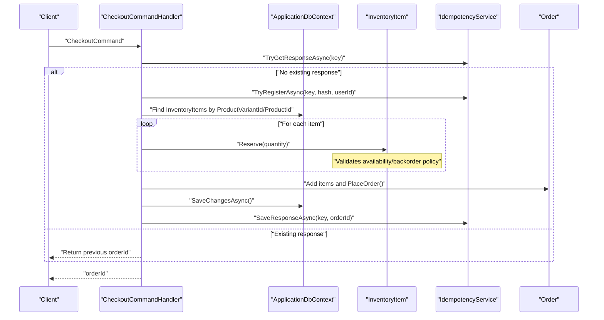
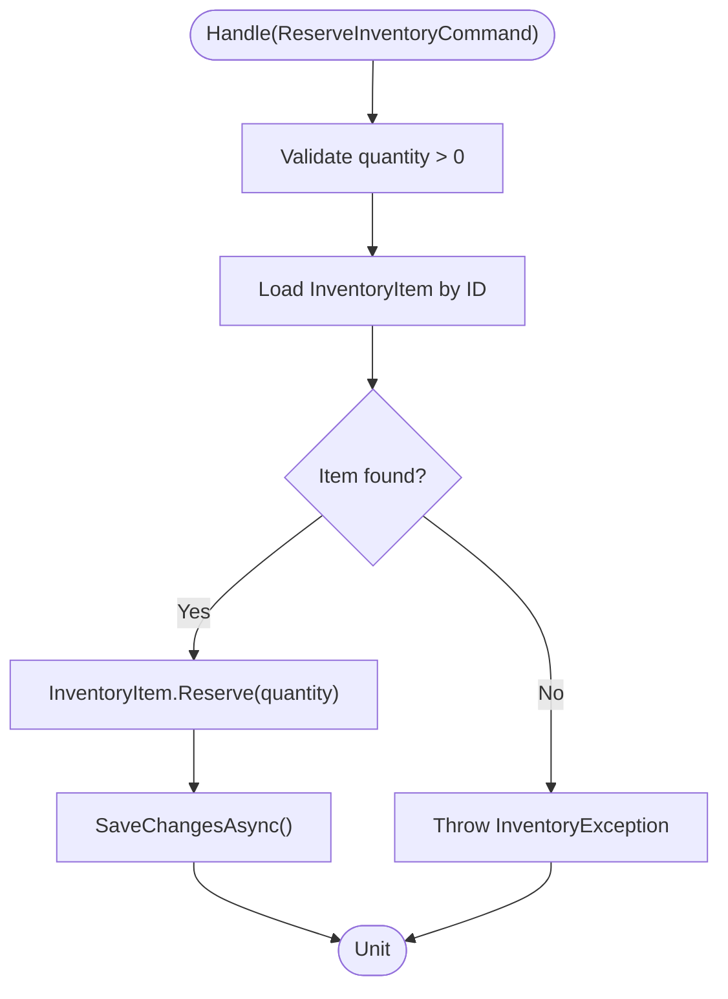
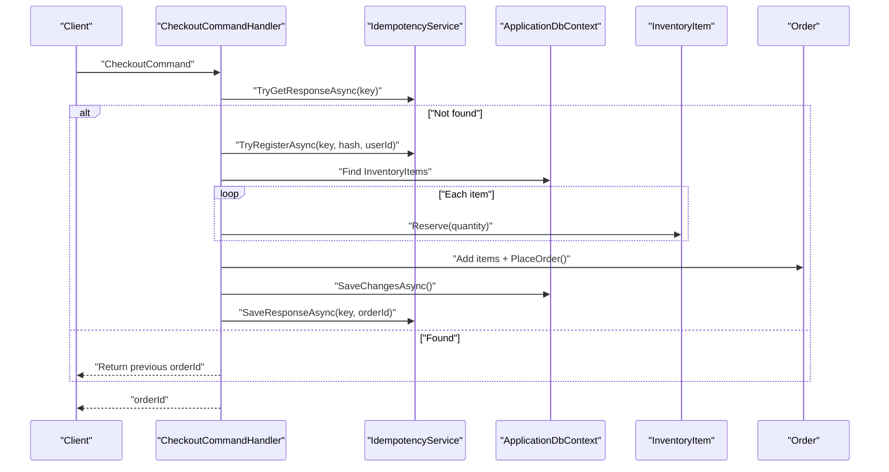
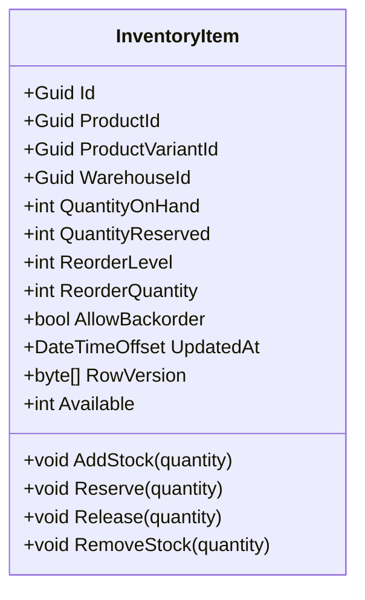
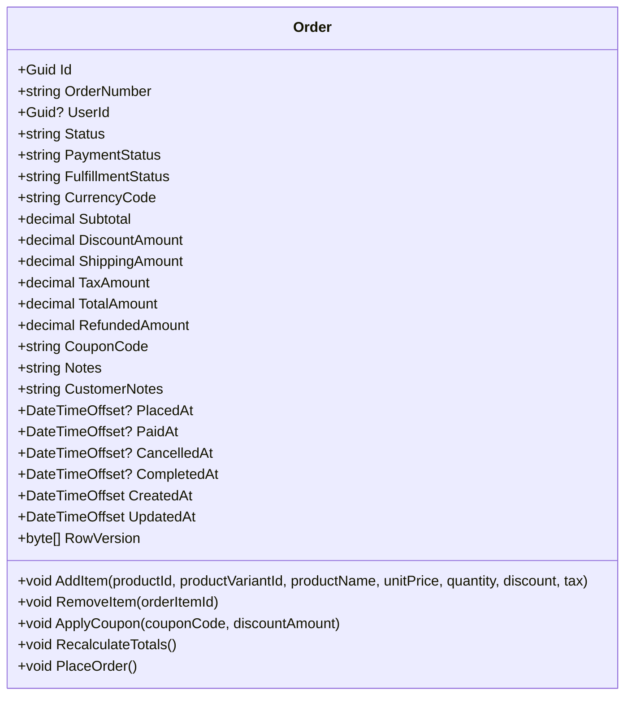
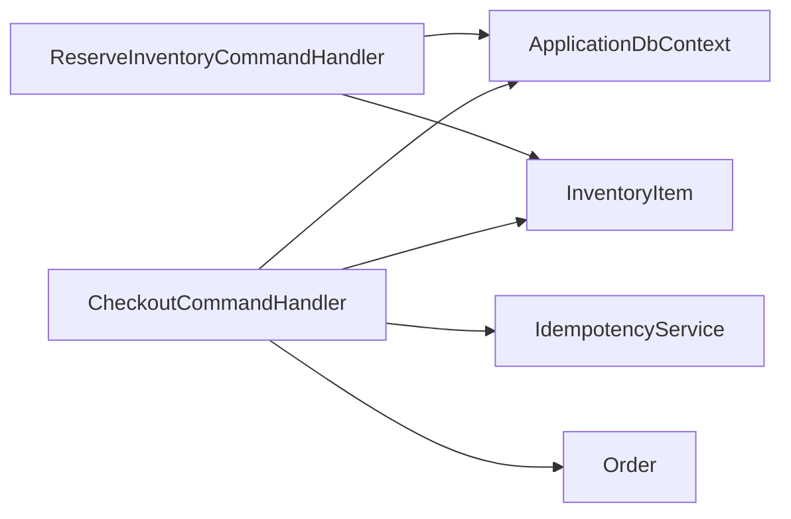

# Inventory Reservation

<cite>
**Referenced Files in This Document**
- [ReserveInventoryCommand.cs](file://src/Ecommerce.Application/Commands/ReserveInventory/ReserveInventoryCommand.cs)
- [ReserveInventoryCommandHandler.cs](file://src/Ecommerce.Application/Commands/ReserveInventory/ReserveInventoryCommandHandler.cs)
- [ReserveInventoryFluentValidator.cs](file://src/Ecommerce.Application/Validators/ReserveInventoryFluentValidator.cs)
- [CheckoutCommand.cs](file://src/Ecommerce.Application/Commands/Checkout/CheckoutCommand.cs)
- [CheckoutCommandHandler.cs](file://src/Ecommerce.Application/Commands/Checkout/CheckoutCommandHandler.cs)
- [InventoryItem.cs](file://src/Ecommerce.Domain/Entities/InventoryItem.cs)
- [Order.cs](file://src/Ecommerce.Domain/Entities/Order.cs)
- [IdempotencyService.cs](file://src/Ecommerce.Infrastructure/Services/IdempotencyService.cs)
- [ApplicationDbContext.cs](file://src/Ecommerce.Infrastructure/Persistence/ApplicationDbContext.cs)
- [InventoryException.cs](file://src/Ecommerce.Domain/Exceptions/InventoryException.cs)
- [ReserveInventoryHandlerTests.cs](file://tests/Ecommerce.Application.Tests/ReserveInventoryHandlerTests.cs)
- [CheckoutHandlerTests.cs](file://tests/Ecommerce.Application.Tests/CheckoutHandlerTests.cs)
- [CheckoutIdempotencyIntegrationTests.cs](file://tests/Ecommerce.IntegrationTests/CheckoutIdempotencyIntegrationTests.cs)
- [InventoryReservationIntegrationTests.cs](file://tests/Ecommerce.IntegrationTests/InventoryReservationIntegrationTests.cs)
</cite>

## Table of Contents
1. Introduction
2. Project Structure
3. Core Components
4. Architecture Overview
5. Detailed Component Analysis
6. Dependency Analysis
7. Performance Considerations
8. Troubleshooting Guide
9. Conclusion

## Introduction
This document explains the inventory reservation system used during checkout to prevent overselling. It focuses on how ReserveInventoryCommand temporarily holds stock, the full reservation lifecycle (creation, confirmation, release), concurrency handling for simultaneous checkout attempts, timeout considerations, and conflict resolution when inventory is insufficient.

## Project Structure
The reservation logic spans Application commands/handlers, Domain entities, Infrastructure persistence, and tests that validate behavior:
- Application layer defines commands and handlers for reserving inventory and performing checkout.
- Domain layer encapsulates inventory state and business rules for reserving, releasing, and removing stock.
- Infrastructure provides persistence via EF Core and idempotency support.
- Tests demonstrate expected behaviors including reservation, order creation, and idempotent checkout.

**Diagram sources**
- [ReserveInventoryCommand.cs:1-10](file://src/Ecommerce.Application/Commands/ReserveInventory/ReserveInventoryCommand.cs#L1-L10)
- [ReserveInventoryCommandHandler.cs:1-30](file://src/Ecommerce.Application/Commands/ReserveInventory/ReserveInventoryCommandHandler.cs#L1-L30)
- [CheckoutCommand.cs:1-22](file://src/Ecommerce.Application/Commands/Checkout/CheckoutCommand.cs#L1-L22)
- [CheckoutCommandHandler.cs:1-94](file://src/Ecommerce.Application/Commands/Checkout/CheckoutCommandHandler.cs#L1-L94)
- [InventoryItem.cs:1-70](file://src/Ecommerce.Domain/Entities/InventoryItem.cs#L1-L70)
- [Order.cs:1-105](file://src/Ecommerce.Domain/Entities/Order.cs#L1-L105)
- [ApplicationDbContext.cs:1-43](file://src/Ecommerce.Infrastructure/Persistence/ApplicationDbContext.cs#L1-L43)
- [IdempotencyService.cs:1-57](file://src/Ecommerce.Infrastructure/Services/IdempotencyService.cs#L1-L57)

**Section sources**
- [ReserveInventoryCommand.cs:1-10](file://src/Ecommerce.Application/Commands/ReserveInventory/ReserveInventoryCommand.cs#L1-L10)
- [ReserveInventoryCommandHandler.cs:1-30](file://src/Ecommerce.Application/Commands/ReserveInventory/ReserveInventoryCommandHandler.cs#L1-L30)
- [CheckoutCommand.cs:1-22](file://src/Ecommerce.Application/Commands/Checkout/CheckoutCommand.cs#L1-L22)
- [CheckoutCommandHandler.cs:1-94](file://src/Ecommerce.Application/Commands/Checkout/CheckoutCommandHandler.cs#L1-L94)
- [InventoryItem.cs:1-70](file://src/Ecommerce.Domain/Entities/InventoryItem.cs#L1-L70)
- [Order.cs:1-105](file://src/Ecommerce.Domain/Entities/Order.cs#L1-L105)
- [ApplicationDbContext.cs:1-43](file://src/Ecommerce.Infrastructure/Persistence/ApplicationDbContext.cs#L1-L43)
- [IdempotencyService.cs:1-57](file://src/Ecommerce.Infrastructure/Services/IdempotencyService.cs#L1-L57)

## Core Components
- ReserveInventoryCommand: Carries the target inventory item identifier and quantity to reserve.
- ReserveInventoryCommandHandler: Validates input, loads the inventory item, applies domain-level reservation, and persists changes.
- InventoryItem: Encapsulates stock quantities and enforces business rules for Reserve, Release, RemoveStock, and backorder policy.
- CheckoutCommand and CheckoutCommandHandler: Orchestrates checkout, reserves inventory per item, creates an Order, persists it, and supports idempotency.
- IdempotencyService: Ensures duplicate checkout requests with the same key return the same result without double-reserving or double-ordering.
- ApplicationDbContext: Provides access to InventoryItems and Orders for persistence.

Key responsibilities:
- Temporary stock holding: Reserve increases QuantityReserved, reducing Available until confirmed or released.
- Conflict prevention: Domain rules reject reservations that exceed available stock unless backorders are allowed.
- Concurrency control: Database transactions and idempotency keys reduce race conditions; row versioning fields exist on entities for optimistic concurrency.

**Section sources**
- [ReserveInventoryCommand.cs:1-10](file://src/Ecommerce.Application/Commands/ReserveInventory/ReserveInventoryCommand.cs#L1-L10)
- [ReserveInventoryCommandHandler.cs:1-30](file://src/Ecommerce.Application/Commands/ReserveInventory/ReserveInventoryCommandHandler.cs#L1-L30)
- [InventoryItem.cs:1-70](file://src/Ecommerce.Domain/Entities/InventoryItem.cs#L1-L70)
- [CheckoutCommand.cs:1-22](file://src/Ecommerce.Application/Commands/Checkout/CheckoutCommand.cs#L1-L22)
- [CheckoutCommandHandler.cs:1-94](file://src/Ecommerce.Application/Commands/Checkout/CheckoutCommandHandler.cs#L1-L94)
- [IdempotencyService.cs:1-57](file://src/Ecommerce.Infrastructure/Services/IdempotencyService.cs#L1-L57)
- [ApplicationDbContext.cs:1-43](file://src/Ecommerce.Infrastructure/Persistence/ApplicationDbContext.cs#L1-L43)

## Architecture Overview
The reservation flow integrates command handling with domain enforcement and persistence. During checkout, inventory is reserved before the order is persisted. Idempotency prevents duplicate processing.

**Diagram sources**
- [CheckoutCommandHandler.cs:1-94](file://src/Ecommerce.Application/Commands/Checkout/CheckoutCommandHandler.cs#L1-L94)
- [InventoryItem.cs:1-70](file://src/Ecommerce.Domain/Entities/InventoryItem.cs#L1-L70)
- [Order.cs:1-105](file://src/Ecommerce.Domain/Entities/Order.cs#L1-L105)
- [IdempotencyService.cs:1-57](file://src/Ecommerce.Infrastructure/Services/IdempotencyService.cs#L1-L57)
- [ApplicationDbContext.cs:1-43](file://src/Ecommerce.Infrastructure/Persistence/ApplicationDbContext.cs#L1-L43)

## Detailed Component Analysis

### ReserveInventoryCommand and Handler
Purpose:
- Accept a request to reserve a specific quantity of a given inventory item.
- Validate inputs and enforce domain constraints.
- Persist the reservation change atomically.

Behavior:
- Validates quantity positivity.
- Loads the inventory item by ID.
- Calls domain Reserve method to update QuantityReserved and UpdatedAt.
- Persists changes via SaveChangesAsync.

Concurrency and validation:
- Validation occurs at both validator and handler levels.
- Domain Reserve enforces availability and backorder policy.
- Persistence uses EF Core within a transactional context provided by SaveChangesAsync.

**Diagram sources**
- [ReserveInventoryCommandHandler.cs:1-30](file://src/Ecommerce.Application/Commands/ReserveInventory/ReserveInventoryCommandHandler.cs#L1-L30)
- [InventoryItem.cs:1-70](file://src/Ecommerce.Domain/Entities/InventoryItem.cs#L1-L70)

**Section sources**
- [ReserveInventoryCommand.cs:1-10](file://src/Ecommerce.Application/Commands/ReserveInventory/ReserveInventoryCommand.cs#L1-L10)
- [ReserveInventoryCommandHandler.cs:1-30](file://src/Ecommerce.Application/Commands/ReserveInventory/ReserveInventoryCommandHandler.cs#L1-L30)
- [ReserveInventoryFluentValidator.cs:1-14](file://src/Ecommerce.Application/Validators/ReserveInventoryFluentValidator.cs#L1-L14)
- [InventoryItem.cs:1-70](file://src/Ecommerce.Domain/Entities/InventoryItem.cs#L1-L70)

### Checkout Command and Inventory Reservation
Purpose:
- Create an order and reserve inventory for each line item before persisting.
- Support idempotency to avoid duplicate orders and reservations.

Behavior:
- Checks idempotency key; returns previous order if already completed.
- Reserves inventory per item using domain methods.
- Creates and places the order, then persists.
- Saves the response to idempotency store.

Concurrency and idempotency:
- Idempotency service ensures duplicate requests do not create multiple orders or reservations.
- The handler performs reservations within a single unit of work before saving the order.

**Diagram sources**
- [CheckoutCommandHandler.cs:1-94](file://src/Ecommerce.Application/Commands/Checkout/CheckoutCommandHandler.cs#L1-L94)
- [IdempotencyService.cs:1-57](file://src/Ecommerce.Infrastructure/Services/IdempotencyService.cs#L1-L57)
- [InventoryItem.cs:1-70](file://src/Ecommerce.Domain/Entities/InventoryItem.cs#L1-L70)
- [Order.cs:1-105](file://src/Ecommerce.Domain/Entities/Order.cs#L1-L105)
- [ApplicationDbContext.cs:1-43](file://src/Ecommerce.Infrastructure/Persistence/ApplicationDbContext.cs#L1-L43)

**Section sources**
- [CheckoutCommand.cs:1-22](file://src/Ecommerce.Application/Commands/Checkout/CheckoutCommand.cs#L1-L22)
- [CheckoutCommandHandler.cs:1-94](file://src/Ecommerce.Application/Commands/Checkout/CheckoutCommandHandler.cs#L1-L94)
- [IdempotencyService.cs:1-57](file://src/Ecommerce.Infrastructure/Services/IdempotencyService.cs#L1-L57)

### InventoryItem Domain Model
Responsibilities:
- Track QuantityOnHand and QuantityReserved.
- Compute Available = QuantityOnHand - QuantityReserved.
- Enforce business rules for Reserve, Release, RemoveStock, and backorder policy.

Concurrency and consistency:
- RowVersion field exists for optimistic concurrency control at the entity level.
- Domain methods update UpdatedAt timestamps to reflect changes.

**Diagram sources**
- [InventoryItem.cs:1-70](file://src/Ecommerce.Domain/Entities/InventoryItem.cs#L1-L70)

**Section sources**
- [InventoryItem.cs:1-70](file://src/Ecommerce.Domain/Entities/InventoryItem.cs#L1-L70)

### Order Entity and Placement
Responsibilities:
- Aggregate order items and compute totals.
- Transition states when placing an order.

Interaction with reservation:
- Checkout handler adds items to the order and calls PlaceOrder after reserving inventory.

**Diagram sources**
- [Order.cs:1-105](file://src/Ecommerce.Domain/Entities/Order.cs#L1-L105)

**Section sources**
- [Order.cs:1-105](file://src/Ecommerce.Domain/Entities/Order.cs#L1-L105)

## Dependency Analysis
- Handlers depend on ApplicationDbContext for data access.
- Handlers call domain entities to enforce business rules.
- Checkout depends on IdempotencyService to ensure safe retries.
- Tests validate reservation and idempotency behavior against in-memory databases.

**Diagram sources**
- [ReserveInventoryCommandHandler.cs:1-30](file://src/Ecommerce.Application/Commands/ReserveInventory/ReserveInventoryCommandHandler.cs#L1-L30)
- [CheckoutCommandHandler.cs:1-94](file://src/Ecommerce.Application/Commands/Checkout/CheckoutCommandHandler.cs#L1-L94)
- [ApplicationDbContext.cs:1-43](file://src/Ecommerce.Infrastructure/Persistence/ApplicationDbContext.cs#L1-L43)
- [InventoryItem.cs:1-70](file://src/Ecommerce.Domain/Entities/InventoryItem.cs#L1-L70)
- [IdempotencyService.cs:1-57](file://src/Ecommerce.Infrastructure/Services/IdempotencyService.cs#L1-L57)
- [Order.cs:1-105](file://src/Ecommerce.Domain/Entities/Order.cs#L1-L105)

**Section sources**
- [ReserveInventoryCommandHandler.cs:1-30](file://src/Ecommerce.Application/Commands/ReserveInventory/ReserveInventoryCommandHandler.cs#L1-L30)
- [CheckoutCommandHandler.cs:1-94](file://src/Ecommerce.Application/Commands/Checkout/CheckoutCommandHandler.cs#L1-L94)
- [ApplicationDbContext.cs:1-43](file://src/Ecommerce.Infrastructure/Persistence/ApplicationDbContext.cs#L1-L43)
- [InventoryItem.cs:1-70](file://src/Ecommerce.Domain/Entities/InventoryItem.cs#L1-L70)
- [IdempotencyService.cs:1-57](file://src/Ecommerce.Infrastructure/Services/IdempotencyService.cs#L1-L57)
- [Order.cs:1-105](file://src/Ecommerce.Domain/Entities/Order.cs#L1-L105)

## Performance Considerations
- Minimize round-trips: Reserve all items in a single unit of work before saving the order to reduce database load.
- Use efficient lookups: Find inventory by primary keys where possible; current implementation tries variant first, then product fallback.
- Avoid unnecessary allocations: Keep command payloads minimal and reuse contexts appropriately.
- Idempotency reduces redundant processing under retries.

[No sources needed since this section provides general guidance]

## Troubleshooting Guide
Common issues and resolutions:
- Insufficient stock:
  - Symptom: Reservation fails due to lack of available stock.
  - Cause: Available < requested quantity and backorders are disallowed.
  - Resolution: Reduce quantity, allow backorders, or replenish stock.
  - Evidence: Domain Reserve enforces this rule and throws InventoryException.
- Invalid quantity:
  - Symptom: Reservation rejected for non-positive quantity.
  - Cause: Input validation or domain guard.
  - Resolution: Ensure quantity > 0.
- Duplicate checkout:
  - Symptom: Multiple orders created for the same intent.
  - Cause: Missing or ignored idempotency key.
  - Resolution: Provide a stable IdempotencyKey; use IdempotencyService to deduplicate.
- Item not found:
  - Symptom: Reservation fails because inventory item cannot be located.
  - Cause: Incorrect IDs or missing records.
  - Resolution: Verify ProductVariantId/ProductId mapping and data presence.

Validation and error types:
- FluentValidation enforces command-level constraints.
- Domain exceptions signal business rule violations.

**Section sources**
- [ReserveInventoryFluentValidator.cs:1-14](file://src/Ecommerce.Application/Validators/ReserveInventoryFluentValidator.cs#L1-L14)
- [InventoryItem.cs:1-70](file://src/Ecommerce.Domain/Entities/InventoryItem.cs#L1-L70)
- [InventoryException.cs:1-10](file://src/Ecommerce.Domain/Exceptions/InventoryException.cs#L1-L10)
- [CheckoutCommandHandler.cs:1-94](file://src/Ecommerce.Application/Commands/Checkout/CheckoutCommandHandler.cs#L1-L94)

## Conclusion
The reservation system uses domain-driven design to safely hold stock during checkout. ReserveInventoryCommand and the checkout handler coordinate with InventoryItem to enforce availability and backorder policies. Idempotency safeguards against duplicate processing. Together, these mechanisms prevent overselling while supporting reliable, concurrent checkout operations.

[No sources needed since this section summarizes without analyzing specific files]