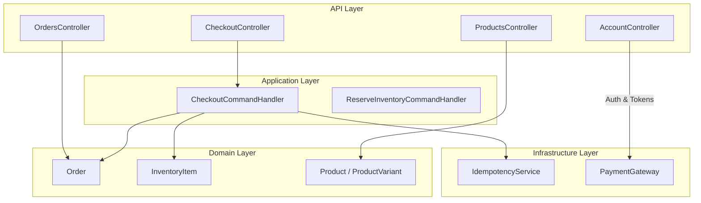
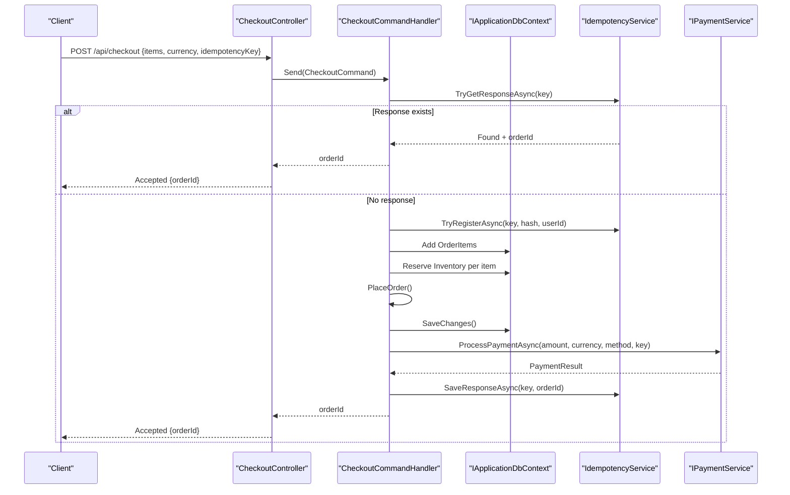
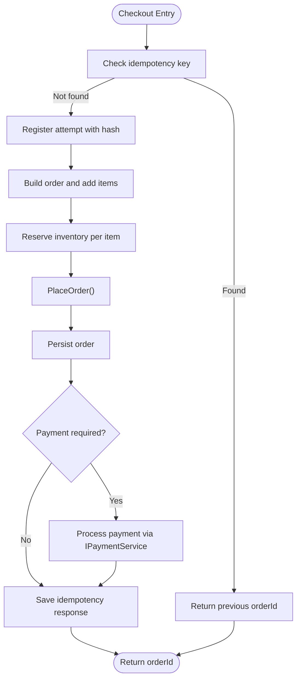
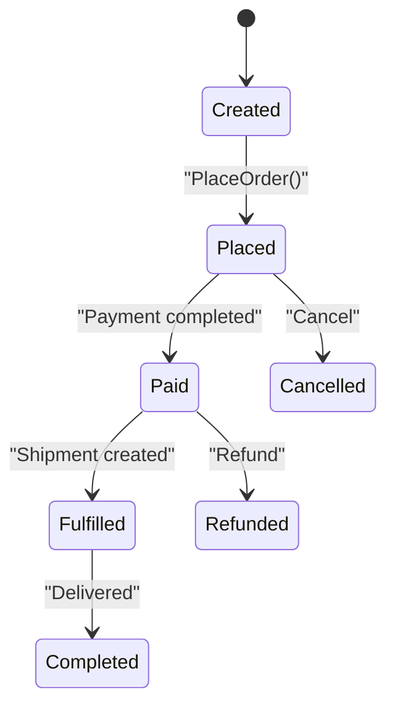
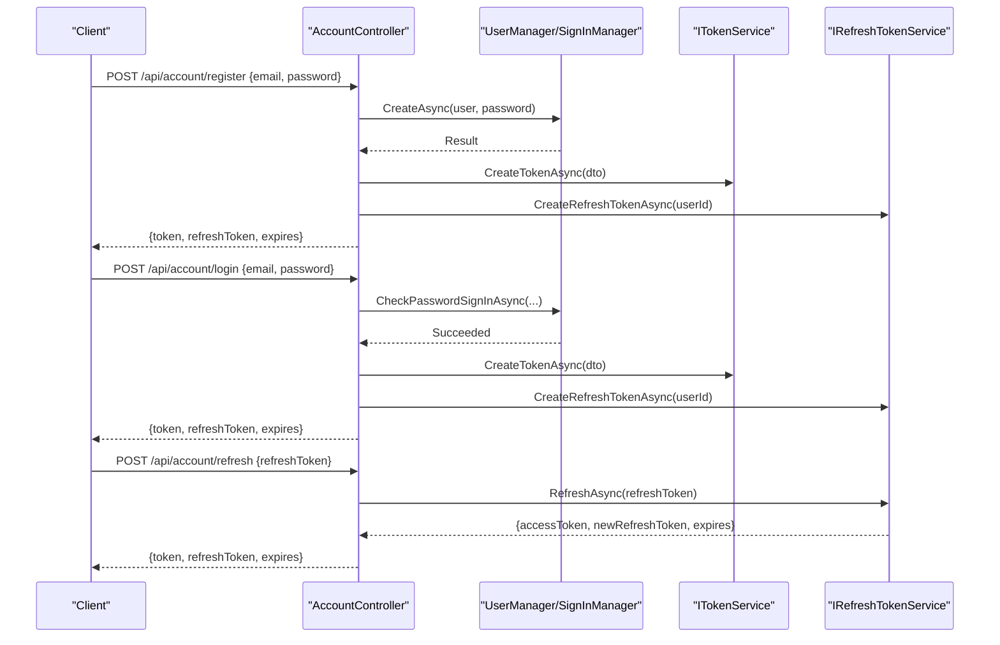
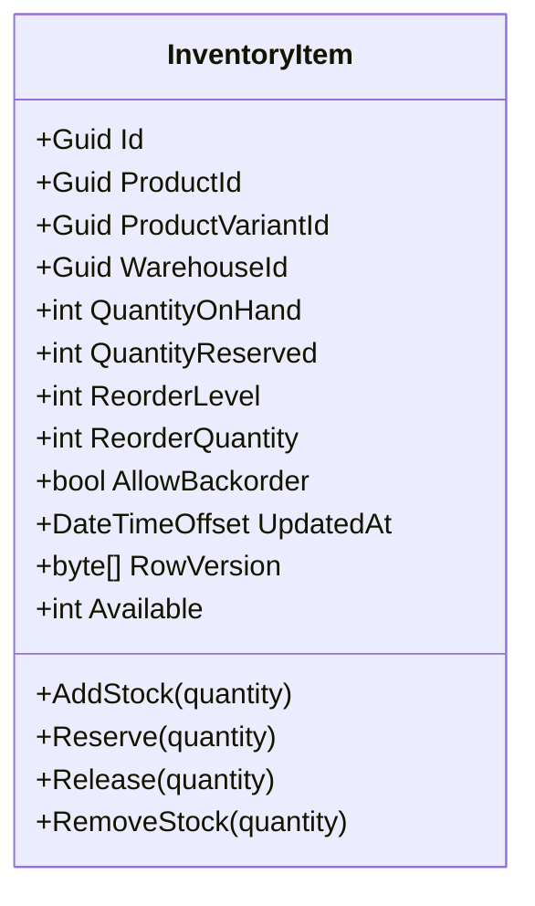
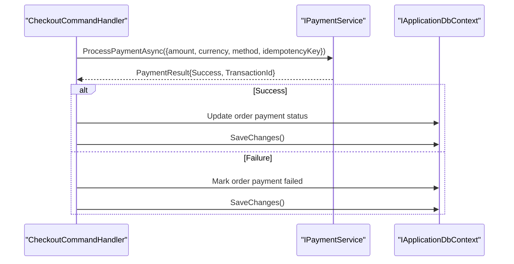
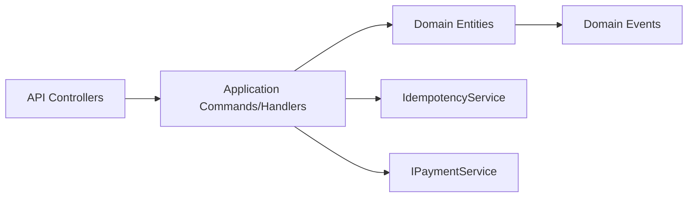

# Features

<cite>
**Referenced Files in This Document**
- [ProductsController.cs](file://src/Ecommerce.Api/Controllers/ProductsController.cs)
- [CheckoutController.cs](file://src/Ecommerce.Api/Controllers/CheckoutController.cs)
- [OrdersController.cs](file://src/Ecommerce.Api/Controllers/OrdersController.cs)
- [AccountController.cs](file://src/Ecommerce.Api/Controllers/AccountController.cs)
- [CheckoutCommandHandler.cs](file://src/Ecommerce.Application/Commands/Checkout/CheckoutCommandHandler.cs)
- [ReserveInventoryCommandHandler.cs](file://src/Ecommerce.Application/Commands/ReserveInventory/ReserveInventoryCommandHandler.cs)
- [IPaymentService.cs](file://src/Ecommerce.Application/Interfaces/IPaymentService.cs)
- [PaymentGateway.cs](file://src/Ecommerce.Infrastructure/Payments/PaymentGateway.cs)
- [IdempotencyService.cs](file://src/Ecommerce.Infrastructure/Services/IdempotencyService.cs)
- [Product.cs](file://src/Ecommerce.Domain/Entities/Product.cs)
- [ProductVariant.cs](file://src/Ecommerce.Domain/Entities/ProductVariant.cs)
- [Order.cs](file://src/Ecommerce.Domain/Entities/Order.cs)
- [InventoryItem.cs](file://src/Ecommerce.Domain/Entities/InventoryItem.cs)
- [UserProfile.cs](file://src/Ecommerce.Domain/Entities/UserProfile.cs)
- [OrderPlacedDomainEvent.cs](file://src/Ecommerce.Domain/DomainEvents/OrderPlacedDomainEvent.cs)
</cite>

## Table of Contents
1. Introduction
2. Project Structure
3. Core Components
4. Architecture Overview
5. Detailed Component Analysis
6. Dependency Analysis
7. Performance Considerations
8. Troubleshooting Guide
9. Conclusion

## Introduction
This document describes the core e-commerce features implemented in the codebase, focusing on product catalog management, shopping cart and checkout with real-time inventory reservation and idempotency, order processing lifecycle, user management, inventory management, payment integration points, and post-order workflows. It provides usage examples and integration patterns for each area to help developers integrate and extend functionality safely and efficiently.

## Project Structure
The system follows a layered architecture:
- API layer (Controllers) exposes HTTP endpoints for products, orders, checkout, and account operations.
- Application layer implements use cases via commands and handlers, orchestrating domain logic and infrastructure services.
- Domain layer defines entities, value objects, exceptions, and domain events that encapsulate business rules.
- Infrastructure layer provides persistence, authentication, payments, and shared services such as idempotency.

**Diagram sources**
- [ProductsController.cs:26-58](file://src/Ecommerce.Api/Controllers/ProductsController.cs#L26-L58)
- [CheckoutController.cs:19-24](file://src/Ecommerce.Api/Controllers/CheckoutController.cs#L19-L24)
- [OrdersController.cs:26-50](file://src/Ecommerce.Api/Controllers/OrdersController.cs#L26-L50)
- [AccountController.cs:34-107](file://src/Ecommerce.Api/Controllers/AccountController.cs#L34-L107)
- [CheckoutCommandHandler.cs:22-90](file://src/Ecommerce.Application/Commands/Checkout/CheckoutCommandHandler.cs#L22-L90)
- [ReserveInventoryCommandHandler.cs:17-27](file://src/Ecommerce.Application/Commands/ReserveInventory/ReserveInventoryCommandHandler.cs#L17-L27)
- [IdempotencyService.cs:19-53](file://src/Ecommerce.Infrastructure/Services/IdempotencyService.cs#L19-L53)
- [PaymentGateway.cs:10-22](file://src/Ecommerce.Infrastructure/Payments/PaymentGateway.cs#L10-L22)

**Section sources**
- [ProductsController.cs:26-58](file://src/Ecommerce.Api/Controllers/ProductsController.cs#L26-L58)
- [CheckoutController.cs:19-24](file://src/Ecommerce.Api/Controllers/CheckoutController.cs#L19-L24)
- [OrdersController.cs:26-50](file://src/Ecommerce.Api/Controllers/OrdersController.cs#L26-L50)
- [AccountController.cs:34-107](file://src/Ecommerce.Api/Controllers/AccountController.cs#L34-L107)

## Core Components
- Product Catalog: Read-only APIs to list, retrieve by ID or slug; product and variant models include pricing, dimensions, and flags for inventory tracking and backorders.
- Checkout: Command-driven flow that builds an order, reserves inventory, persists the order, and supports idempotent retries.
- Orders: Query endpoints to list and fetch orders with items.
- User Management: Registration, login, token refresh, revoke, and profile retrieval using ASP.NET Identity and JWT tokens.
- Inventory: Domain methods to add stock, reserve/release/remove stock with validation and backorder support.
- Payments: Interface and stub implementation for payment processing; extensible for provider integration.
- Idempotency: Service to prevent duplicate processing of checkout requests using keys and request hashes.

**Section sources**
- [Product.cs:6-42](file://src/Ecommerce.Domain/Entities/Product.cs#L6-L42)
- [ProductVariant.cs:5-26](file://src/Ecommerce.Domain/Entities/ProductVariant.cs#L5-L26)
- [CheckoutCommandHandler.cs:22-90](file://src/Ecommerce.Application/Commands/Checkout/CheckoutCommandHandler.cs#L22-L90)
- [Order.cs:8-102](file://src/Ecommerce.Domain/Entities/Order.cs#L8-L102)
- [InventoryItem.cs:6-67](file://src/Ecommerce.Domain/Entities/InventoryItem.cs#L6-L67)
- [IPaymentService.cs:5-23](file://src/Ecommerce.Application/Interfaces/IPaymentService.cs#L5-L23)
- [IdempotencyService.cs:19-53](file://src/Ecommerce.Infrastructure/Services/IdempotencyService.cs#L19-L53)

## Architecture Overview
The checkout process is command-based and leverages domain entities and infrastructure services:
- The API controller receives a checkout command and dispatches it.
- The handler validates input, enforces idempotency, constructs an order, reserves inventory, persists changes, and returns the order ID.
- Payment processing is integrated via an interface; a stub gateway is provided for development/testing.

**Diagram sources**
- [CheckoutController.cs:19-24](file://src/Ecommerce.Api/Controllers/CheckoutController.cs#L19-L24)
- [CheckoutCommandHandler.cs:22-90](file://src/Ecommerce.Application/Commands/Checkout/CheckoutCommandHandler.cs#L22-L90)
- [IdempotencyService.cs:19-53](file://src/Ecommerce.Infrastructure/Services/IdempotencyService.cs#L19-L53)
- [IPaymentService.cs:5-23](file://src/Ecommerce.Application/Interfaces/IPaymentService.cs#L5-L23)

## Detailed Component Analysis

### Product Catalog Management
- Endpoints:
  - List products with pagination and sorting.
  - Get product by ID.
  - Get product by slug.
- Models:
  - Product includes base price, cost price, compare-at price, currency, dimensions, shipping flags, and inventory tracking options.
  - ProductVariant adds SKU, barcode, variant-specific pricing and dimensions, and inventory controls.

Usage example
- GET /api/products?page=1&pageSize=20
- GET /api/products/{id}
- GET /api/products/slug/{slug}

Integration pattern
- Use AsNoTracking for read-heavy queries to reduce context overhead.
- Map domain entities to DTOs for stable contracts.

**Section sources**
- [ProductsController.cs:26-58](file://src/Ecommerce.Api/Controllers/ProductsController.cs#L26-L58)
- [Product.cs:6-42](file://src/Ecommerce.Domain/Entities/Product.cs#L6-L42)
- [ProductVariant.cs:5-26](file://src/Ecommerce.Domain/Entities/ProductVariant.cs#L5-L26)

### Shopping Cart and Checkout with Real-Time Inventory Reservation and Idempotency
- Command-driven checkout ensures consistent state transitions and clear separation of concerns.
- Idempotency:
  - Supports optional idempotency key to deduplicate retries.
  - Registers attempt with request hash and owner; saves final response for subsequent identical requests.
- Inventory reservation:
  - Reserves stock per item before placing the order.
  - Uses domain methods to enforce availability and backorder policies.

Sequence overview
- Validate command and idempotency key.
- Build order and add items.
- Reserve inventory for each item.
- Place order and persist.
- Optionally process payment and record result.
- Save idempotency response.

**Diagram sources**
- [CheckoutCommandHandler.cs:22-90](file://src/Ecommerce.Application/Commands/Checkout/CheckoutCommandHandler.cs#L22-L90)
- [IdempotencyService.cs:19-53](file://src/Ecommerce.Infrastructure/Services/IdempotencyService.cs#L19-L53)

Usage example
- POST /api/checkout
  - Body: items[], currency, optional idempotencyKey, userId
- Expected response: Accepted { orderId }

Integration pattern
- Always provide idempotencyKey for client retries.
- Ensure inventory reservations are part of the same transactional boundary as order creation.

**Section sources**
- [CheckoutController.cs:19-24](file://src/Ecommerce.Api/Controllers/CheckoutController.cs#L19-L24)
- [CheckoutCommandHandler.cs:22-90](file://src/Ecommerce.Application/Commands/Checkout/CheckoutCommandHandler.cs#L22-L90)
- [IdempotencyService.cs:19-53](file://src/Ecommerce.Infrastructure/Services/IdempotencyService.cs#L19-L53)

### Order Processing Lifecycle
- Order creation:
  - Items added with validated quantities and prices.
  - Totals recalculated automatically.
- Placement:
  - Transitions to Placed status with pending payment and unfulfilled fulfillment.
- Post-placement:
  - Payment completion updates payment status.
  - Fulfillment updates fulfillment status when shipped.

**Diagram sources**
- [Order.cs:36-102](file://src/Ecommerce.Domain/Entities/Order.cs#L36-L102)

Usage example
- Create order via checkout command.
- Query orders:
  - GET /api/orders?page=1&pageSize=20
  - GET /api/orders/{id}

Integration pattern
- Use domain methods for all mutations to maintain invariants.
- Emit domain events (e.g., OrderPlaced) to trigger downstream processes like notifications or analytics.

**Section sources**
- [Order.cs:36-102](file://src/Ecommerce.Domain/Entities/Order.cs#L36-L102)
- [OrdersController.cs:26-50](file://src/Ecommerce.Api/Controllers/OrdersController.cs#L26-L50)
- [OrderPlacedDomainEvent.cs:5-14](file://src/Ecommerce.Domain/DomainEvents/OrderPlacedDomainEvent.cs#L5-L14)

### User Management (Registration, Authentication, Profile)
- Registration:
  - Creates user and issues access token plus refresh token.
- Login:
  - Validates credentials and issues tokens.
- Token refresh and revocation:
  - Refresh endpoint rotates tokens securely.
  - Revoke single or all refresh tokens for security.
- Profile:
  - Retrieve current user details from authenticated context.

**Diagram sources**
- [AccountController.cs:34-107](file://src/Ecommerce.Api/Controllers/AccountController.cs#L34-L107)

Usage example
- POST /api/account/register
- POST /api/account/login
- POST /api/account/refresh
- POST /api/account/revoke
- POST /api/account/revoke-all
- GET /api/account/me (requires authorization)

Integration pattern
- Store refresh tokens securely and rotate them on refresh.
- Enforce authorization on protected endpoints.

**Section sources**
- [AccountController.cs:34-107](file://src/Ecommerce.Api/Controllers/AccountController.cs#L34-L107)
- [UserProfile.cs:5-17](file://src/Ecommerce.Domain/Entities/UserProfile.cs#L5-L17)

### Inventory Management (Stock Tracking, Reservations, Warehouse Operations)
- Stock operations:
  - Add stock increases on-hand quantity.
  - Reserve stock increments reserved count after validating availability and backorder policy.
  - Release stock decreases reserved count.
  - Remove stock decrements on-hand with safeguards.
- Availability:
  - Computed property reflects available stock considering reservations.

**Diagram sources**
- [InventoryItem.cs:6-67](file://src/Ecommerce.Domain/Entities/InventoryItem.cs#L6-L67)

Usage example
- Reserve inventory for a specific item:
  - POST /api/reserve-inventory (via application command)
  - Body: inventoryItemId, quantity

Integration pattern
- Always call Reserve within the same transaction as order placement to avoid overselling.
- Implement warehouse-level routing if multiple warehouses exist.

**Section sources**
- [InventoryItem.cs:6-67](file://src/Ecommerce.Domain/Entities/InventoryItem.cs#L6-L67)
- [ReserveInventoryCommandHandler.cs:17-27](file://src/Ecommerce.Application/Commands/ReserveInventory/ReserveInventoryCommandHandler.cs#L17-L27)

### Payment Integration Points and Post-Order Workflows
- Payment interface:
  - Defines a simple contract for processing payments with amount, currency, method, and idempotency key.
- Stub implementation:
  - Returns success with a generated transaction ID for development/testing.
- Post-order:
  - On successful payment, update order payment status.
  - Trigger fulfillment workflows upon payment confirmation.

**Diagram sources**
- [IPaymentService.cs:5-23](file://src/Ecommerce.Application/Interfaces/IPaymentService.cs#L5-L23)
- [PaymentGateway.cs:10-22](file://src/Ecommerce.Infrastructure/Payments/PaymentGateway.cs#L10-L22)
- [CheckoutCommandHandler.cs:22-90](file://src/Ecommerce.Application/Commands/Checkout/CheckoutCommandHandler.cs#L22-L90)

Usage example
- Integrate a real provider by implementing IPaymentService and registering it in DI.
- Use idempotencyKey to ensure safe retries against external gateways.

**Section sources**
- [IPaymentService.cs:5-23](file://src/Ecommerce.Application/Interfaces/IPaymentService.cs#L5-L23)
- [PaymentGateway.cs:10-22](file://src/Ecommerce.Infrastructure/Payments/PaymentGateway.cs#L10-L22)

## Dependency Analysis
High-level dependencies between layers and components:

**Diagram sources**
- [CheckoutController.cs:19-24](file://src/Ecommerce.Api/Controllers/CheckoutController.cs#L19-L24)
- [CheckoutCommandHandler.cs:22-90](file://src/Ecommerce.Application/Commands/Checkout/CheckoutCommandHandler.cs#L22-L90)
- [IdempotencyService.cs:19-53](file://src/Ecommerce.Infrastructure/Services/IdempotencyService.cs#L19-L53)
- [IPaymentService.cs:5-23](file://src/Ecommerce.Application/Interfaces/IPaymentService.cs#L5-L23)
- [OrderPlacedDomainEvent.cs:5-14](file://src/Ecommerce.Domain/DomainEvents/OrderPlacedDomainEvent.cs#L5-L14)

**Section sources**
- [CheckoutController.cs:19-24](file://src/Ecommerce.Api/Controllers/CheckoutController.cs#L19-L24)
- [CheckoutCommandHandler.cs:22-90](file://src/Ecommerce.Application/Commands/Checkout/CheckoutCommandHandler.cs#L22-L90)
- [IdempotencyService.cs:19-53](file://src/Ecommerce.Infrastructure/Services/IdempotencyService.cs#L19-L53)
- [IPaymentService.cs:5-23](file://src/Ecommerce.Application/Interfaces/IPaymentService.cs#L5-L23)
- [OrderPlacedDomainEvent.cs:5-14](file://src/Ecommerce.Domain/DomainEvents/OrderPlacedDomainEvent.cs#L5-L14)

## Performance Considerations
- Use AsNoTracking for read-only queries to reduce change tracking overhead.
- Paginate large lists to limit memory and network payload.
- Keep idempotency checks lightweight; store only necessary metadata.
- Batch database writes where possible and keep transactions short.
- Cache product listings if appropriate, invalidating on updates.

[No sources needed since this section provides general guidance]

## Troubleshooting Guide
Common issues and resolutions:
- Duplicate checkout attempts:
  - Ensure clients send unique idempotencyKey per intent.
  - Verify IdempotencyService registration and storage backend.
- Insufficient stock:
  - Check AllowBackorder and available stock calculations.
  - Review concurrent reservation attempts and consider optimistic concurrency with RowVersion.
- Payment failures:
  - Inspect PaymentResult for error messages.
  - Retry with the same idempotencyKey to avoid double charges.
- Authentication errors:
  - Validate token presence and claims.
  - Use refresh flow to obtain new tokens when expired.

**Section sources**
- [IdempotencyService.cs:19-53](file://src/Ecommerce.Infrastructure/Services/IdempotencyService.cs#L19-L53)
- [InventoryItem.cs:22-67](file://src/Ecommerce.Domain/Entities/InventoryItem.cs#L22-L67)
- [PaymentGateway.cs:10-22](file://src/Ecommerce.Infrastructure/Payments/PaymentGateway.cs#L10-L22)
- [AccountController.cs:34-107](file://src/Ecommerce.Api/Controllers/AccountController.cs#L34-L107)

## Conclusion
The system provides a robust foundation for e-commerce operations with clear separation of concerns across layers. Product catalog APIs expose rich product data, while checkout integrates idempotency and inventory reservation to ensure consistency. Orders follow a well-defined lifecycle, and user management secures access with JWT and refresh tokens. Inventory operations enforce business rules, and payment integration points allow easy substitution of providers. Adopting the recommended usage examples and integration patterns will help build reliable, scalable e-commerce features.