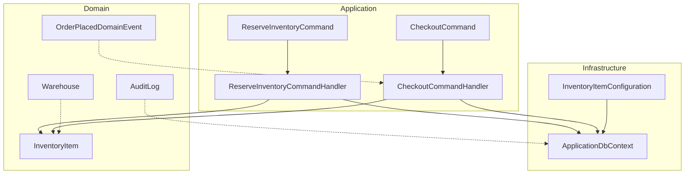
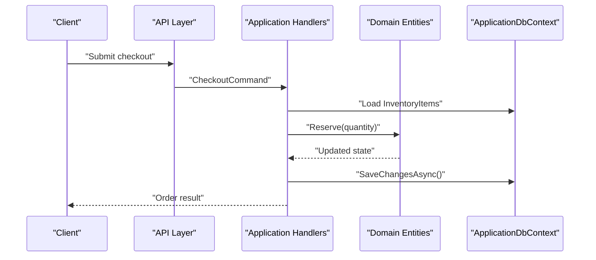
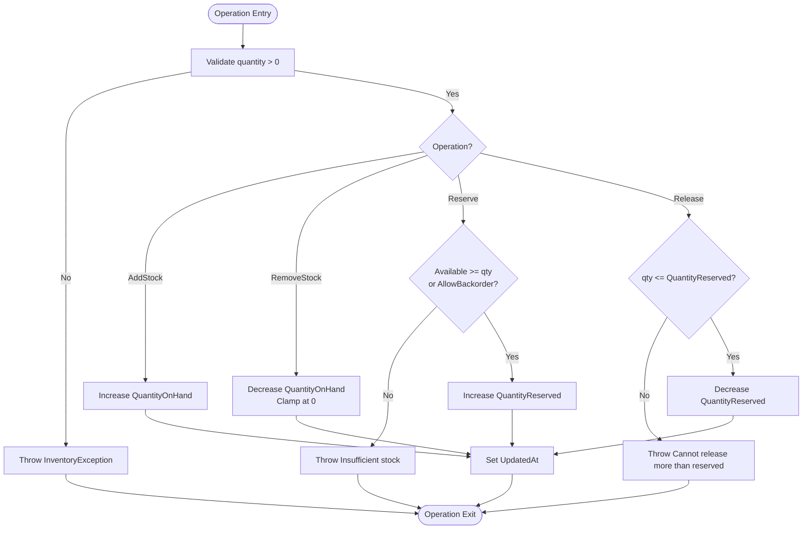
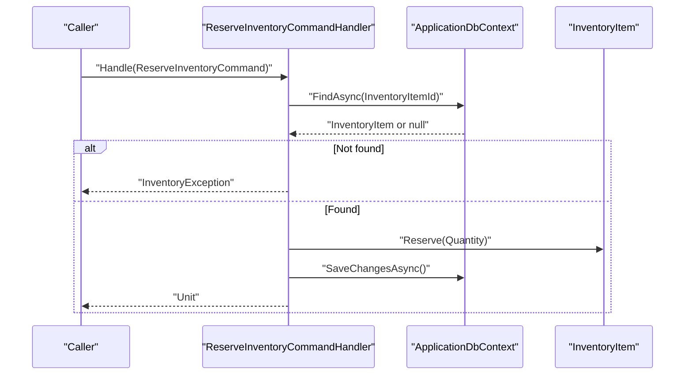
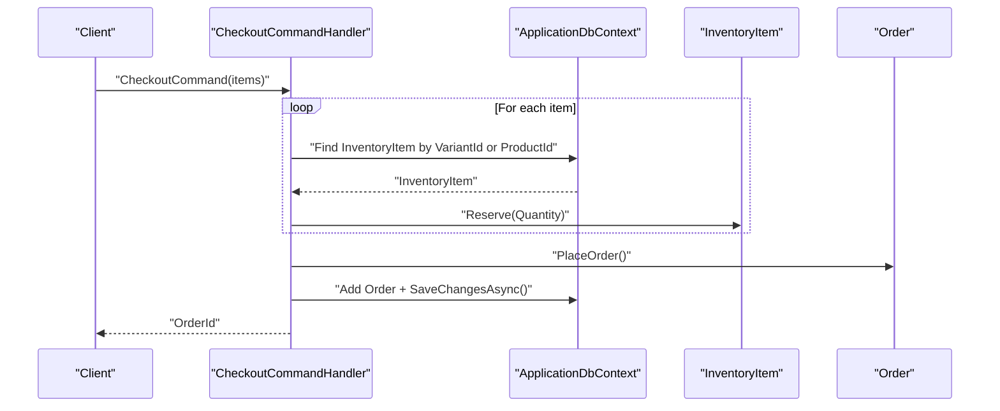
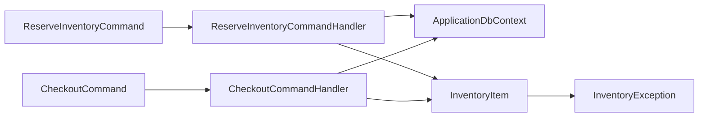
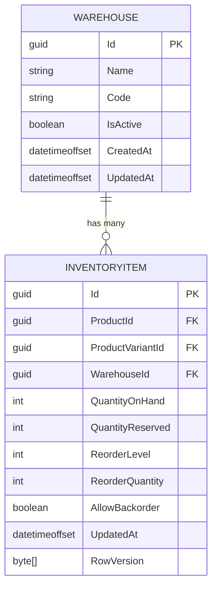

# Inventory Management

<cite>
**Referenced Files in This Document**
- [InventoryItem.cs](file://src/Ecommerce.Domain/Entities/InventoryItem.cs)
- [Warehouse.cs](file://src/Ecommerce.Domain/Entities/Warehouse.cs)
- [ReserveInventoryCommand.cs](file://src/Ecommerce.Application/Commands/ReserveInventory/ReserveInventoryCommand.cs)
- [ReserveInventoryCommandHandler.cs](file://src/Ecommerce.Application/Commands/ReserveInventory/ReserveInventoryCommandHandler.cs)
- [CheckoutCommand.cs](file://src/Ecommerce.Application/Commands/Checkout/CheckoutCommand.cs)
- [CheckoutCommandHandler.cs](file://src/Ecommerce.Application/Commands/Checkout/CheckoutCommandHandler.cs)
- [ApplicationDbContext.cs](file://src/Ecommerce.Infrastructure/Persistence/ApplicationDbContext.cs)
- [InventoryItemConfiguration.cs](file://src/Ecommerce.Infrastructure/Persistence/Configurations/InventoryItemConfiguration.cs)
- [AuditLog.cs](file://src/Ecommerce.Domain/Entities/AuditLog.cs)
- [OrderPlacedDomainEvent.cs](file://src/Ecommerce.Domain/DomainEvents/OrderPlacedDomainEvent.cs)
- [InventoryException.cs](file://src/Ecommerce.Domain/Exceptions/InventoryException.cs)
- [InitialCreate.cs](file://src/Ecommerce.Infrastructure/Migrations/20260815214939_InitialCreate.cs)
- [InventoryItemTests.cs](file://tests/Ecommerce.Domain.Tests/InventoryItemTests.cs)
- [ReserveInventoryHandlerTests.cs](file://tests/Ecommerce.Application.Tests/ReserveInventoryHandlerTests.cs)
- [InventoryReservationIntegrationTests.cs](file://tests/Ecommerce.IntegrationTests/InventoryReservationIntegrationTests.cs)
</cite>

## Table of Contents
1. [Introduction](#introduction)
2. [Project Structure](#project-structure)
3. [Core Components](#core-components)
4. [Architecture Overview](#architecture-overview)
5. [Detailed Component Analysis](#detailed-component-analysis)
6. [Dependency Analysis](#dependency-analysis)
7. [Performance Considerations](#performance-considerations)
8. [Troubleshooting Guide](#troubleshooting-guide)
9. [Conclusion](#conclusion)
10. [Appendices](#appendices)

## Introduction
This document explains the inventory management capabilities implemented in the system, focusing on stock tracking, reservations, warehouse operations, low stock alerts, backorder support, and reconciliation. It also covers the reservation lifecycle during checkout, concurrency handling via optimistic concurrency, auditing, and performance considerations for high-volume scenarios.

## Project Structure
The inventory subsystem spans Domain, Application, and Infrastructure layers:
- Domain: InventoryItem entity encapsulates stock state and business rules; Warehouse defines storage locations; AuditLog supports auditing; exceptions model domain errors; domain events signal key outcomes.
- Application: Commands and handlers orchestrate inventory reservations and checkout flows using the domain entities through a database context.
- Infrastructure: EF Core configuration maps InventoryItem to the database, including row versioning for concurrency; DbContext exposes InventoryItems and related sets.

**Diagram sources**
- [InventoryItem.cs:6-68](file://src/Ecommerce.Domain/Entities/InventoryItem.cs#L6-L68)
- [Warehouse.cs:5-13](file://src/Ecommerce.Domain/Entities/Warehouse.cs#L5-L13)
- [ReserveInventoryCommand.cs:5-9](file://src/Ecommerce.Application/Commands/ReserveInventory/ReserveInventoryCommand.cs#L5-L9)
- [ReserveInventoryCommandHandler.cs:9-28](file://src/Ecommerce.Application/Commands/ReserveInventory/ReserveInventoryCommandHandler.cs#L9-L28)
- [CheckoutCommand.cs:6-20](file://src/Ecommerce.Application/Commands/Checkout/CheckoutCommand.cs#L6-L20)
- [CheckoutCommandHandler.cs:11-90](file://src/Ecommerce.Application/Commands/Checkout/CheckoutCommandHandler.cs#L11-L90)
- [ApplicationDbContext.cs:13-27](file://src/Ecommerce.Infrastructure/Persistence/ApplicationDbContext.cs#L13-L27)
- [InventoryItemConfiguration.cs:7-34](file://src/Ecommerce.Infrastructure/Persistence/Configurations/InventoryItemConfiguration.cs#L7-L34)
- [AuditLog.cs:5-17](file://src/Ecommerce.Domain/Entities/AuditLog.cs#L5-L17)
- [OrderPlacedDomainEvent.cs:5-14](file://src/Ecommerce.Domain/DomainEvents/OrderPlacedDomainEvent.cs#L5-L14)

**Section sources**
- [InventoryItem.cs:6-68](file://src/Ecommerce.Domain/Entities/InventoryItem.cs#L6-L68)
- [ReserveInventoryCommandHandler.cs:9-28](file://src/Ecommerce.Application/Commands/ReserveInventory/ReserveInventoryCommandHandler.cs#L9-L28)
- [CheckoutCommandHandler.cs:11-90](file://src/Ecommerce.Application/Commands/Checkout/CheckoutCommandHandler.cs#L11-L90)
- [ApplicationDbContext.cs:13-27](file://src/Ecommerce.Infrastructure/Persistence/ApplicationDbContext.cs#L13-L27)
- [InventoryItemConfiguration.cs:7-34](file://src/Ecommerce.Infrastructure/Persistence/Configurations/InventoryItemConfiguration.cs#L7-L34)

## Core Components
- InventoryItem: Encapsulates stock levels (on-hand and reserved), reorder thresholds, backorder policy, and provides methods to add/remove stock, reserve/release quantities, and compute available stock.
- Warehouse: Represents physical or logical storage locations linked to inventory items.
- ReserveInventoryCommand and Handler: Validates quantity, loads the inventory item, applies reservation, and persists changes.
- Checkout flow: Builds an order, reserves inventory per line item, persists the order, and records idempotency responses when provided.
- Persistence: ApplicationDbContext exposes InventoryItems; InventoryItemConfiguration configures mapping and enables optimistic concurrency with RowVersion.

Key responsibilities:
- Stock tracking: QuantityOnHand and QuantityReserved maintained by domain methods.
- Reservations: Temporary holds via Reserve/Release until order completion or cancellation.
- Backorders: Controlled by AllowBackorder flag to permit overselling when configured.
- Reconciliation: Derived Available field and audit logs enable reconciliation and reporting.

**Section sources**
- [InventoryItem.cs:6-68](file://src/Ecommerce.Domain/Entities/InventoryItem.cs#L6-L68)
- [Warehouse.cs:5-13](file://src/Ecommerce.Domain/Entities/Warehouse.cs#L5-L13)
- [ReserveInventoryCommand.cs:5-9](file://src/Ecommerce.Application/Commands/ReserveInventory/ReserveInventoryCommand.cs#L5-L9)
- [ReserveInventoryCommandHandler.cs:9-28](file://src/Ecommerce.Application/Commands/ReserveInventory/ReserveInventoryCommandHandler.cs#L9-L28)
- [CheckoutCommand.cs:6-20](file://src/Ecommerce.Application/Commands/Checkout/CheckoutCommand.cs#L6-L20)
- [CheckoutCommandHandler.cs:11-90](file://src/Ecommerce.Application/Commands/Checkout/CheckoutCommandHandler.cs#L11-L90)
- [ApplicationDbContext.cs:13-27](file://src/Ecommerce.Infrastructure/Persistence/ApplicationDbContext.cs#L13-L27)
- [InventoryItemConfiguration.cs:7-34](file://src/Ecommerce.Infrastructure/Persistence/Configurations/InventoryItemConfiguration.cs#L7-L34)

## Architecture Overview
The inventory subsystem follows a layered architecture:
- API layer triggers commands (e.g., checkout).
- Application layer validates and orchestrates domain operations via command handlers.
- Domain layer enforces business rules on InventoryItem and emits domain events.
- Infrastructure layer persists state using EF Core with optimistic concurrency.

**Diagram sources**
- [CheckoutCommandHandler.cs:22-90](file://src/Ecommerce.Application/Commands/Checkout/CheckoutCommandHandler.cs#L22-L90)
- [InventoryItem.cs:29-53](file://src/Ecommerce.Domain/Entities/InventoryItem.cs#L29-L53)
- [ApplicationDbContext.cs:29-32](file://src/Ecommerce.Infrastructure/Persistence/ApplicationDbContext.cs#L29-L32)

## Detailed Component Analysis

### InventoryItem: Stock Tracking and Business Rules
- Tracks QuantityOnHand and QuantityReserved; computes Available as OnHand minus Reserved.
- AddStock increases OnHand; RemoveStock decreases OnHand with safeguards against negative values.
- Reserve increments reserved quantity if sufficient available stock exists unless backorders are allowed.
- Release decrements reserved quantity up to the amount reserved.
- UpdatedAt is refreshed on mutations to track last modification time.

Concurrency and safety:
- RowVersion is configured as a concurrency token to prevent lost updates and oversell.
- Validation ensures positive quantities and consistent state transitions.

**Diagram sources**
- [InventoryItem.cs:22-67](file://src/Ecommerce.Domain/Entities/InventoryItem.cs#L22-L67)
- [InventoryItemConfiguration.cs:23-27](file://src/Ecommerce.Infrastructure/Persistence/Configurations/InventoryItemConfiguration.cs#L23-L27)

**Section sources**
- [InventoryItem.cs:6-68](file://src/Ecommerce.Domain/Entities/InventoryItem.cs#L6-L68)
- [InventoryItemConfiguration.cs:7-34](file://src/Ecommerce.Infrastructure/Persistence/Configurations/InventoryItemConfiguration.cs#L7-L34)

### Reservation System: ReserveInventory Command
- Validates quantity and loads the specific InventoryItem by Id.
- Applies Reserve to increment QuantityReserved and update timestamp.
- Persists changes atomically via SaveChangesAsync.

**Diagram sources**
- [ReserveInventoryCommandHandler.cs:17-28](file://src/Ecommerce.Application/Commands/ReserveInventory/ReserveInventoryCommandHandler.cs#L17-L28)
- [InventoryItem.cs:29-40](file://src/Ecommerce.Domain/Entities/InventoryItem.cs#L29-L40)
- [ApplicationDbContext.cs:19-27](file://src/Ecommerce.Infrastructure/Persistence/ApplicationDbContext.cs#L19-L27)

**Section sources**
- [ReserveInventoryCommand.cs:5-9](file://src/Ecommerce.Application/Commands/ReserveInventory/ReserveInventoryCommand.cs#L5-L9)
- [ReserveInventoryCommandHandler.cs:9-28](file://src/Ecommerce.Application/Commands/ReserveInventory/ReserveInventoryCommandHandler.cs#L9-L28)

### Checkout Flow: Reserving Inventory During Purchase
- Accepts a list of items with product and variant identifiers and quantities.
- For each item, locates the corresponding InventoryItem (variant first, then product fallback).
- Reserves the requested quantity before placing the order.
- Persists the order and returns the order identifier; supports idempotency via a key.

**Diagram sources**
- [CheckoutCommandHandler.cs:22-90](file://src/Ecommerce.Application/Commands/Checkout/CheckoutCommandHandler.cs#L22-L90)
- [InventoryItem.cs:29-40](file://src/Ecommerce.Domain/Entities/InventoryItem.cs#L29-L40)
- [ApplicationDbContext.cs:19-27](file://src/Ecommerce.Infrastructure/Persistence/ApplicationDbContext.cs#L19-L27)

**Section sources**
- [CheckoutCommand.cs:6-20](file://src/Ecommerce.Application/Commands/Checkout/CheckoutCommand.cs#L6-L20)
- [CheckoutCommandHandler.cs:11-90](file://src/Ecommerce.Application/Commands/Checkout/CheckoutCommandHandler.cs#L11-L90)

### Warehouse Operations
- Warehouse entities provide location identity and status used to associate inventory items.
- InventoryItem references a WarehouseId to attribute stock to a specific location.

Operational implications:
- Stock adjustments and transfers can be modeled by updating WarehouseId on inventory items or creating new inventory entries per warehouse.
- Queries can filter by WarehouseId to report per-location availability.

**Section sources**
- [Warehouse.cs:5-13](file://src/Ecommerce.Domain/Entities/Warehouse.cs#L5-L13)
- [InventoryItem.cs:8-18](file://src/Ecommerce.Domain/Entities/InventoryItem.cs#L8-L18)

### Low Stock Alerts and Backorder Support
- Low stock indicators can be derived from ReorderLevel compared to Available (OnHand - Reserved).
- Backorder support is controlled by AllowBackorder; when false, Reserve and RemoveStock enforce non-negative stock constraints.

Practical usage:
- Periodic jobs can scan InventoryItem records where Available < ReorderLevel to trigger alerts or purchase orders.
- When AllowBackorder is true, orders can proceed even if Available is insufficient, deferring fulfillment until stock arrives.

**Section sources**
- [InventoryItem.cs:12-20](file://src/Ecommerce.Domain/Entities/InventoryItem.cs#L12-L20)
- [InventoryItem.cs:29-67](file://src/Ecommerce.Domain/Entities/InventoryItem.cs#L29-L67)

### Inventory Reconciliation and Auditing
- Reconciliation relies on accurate OnHand and Reserved counts plus the computed Available metric.
- AuditLog entity supports recording actions, entity references, and value snapshots for traceability.
- Domain events (e.g., OrderPlacedDomainEvent) can be emitted to notify downstream systems of significant state changes.

Reconciliation steps:
- Compare reported Available vs expected values based on transactions.
- Use AuditLog entries to reconstruct changes and validate consistency.

**Section sources**
- [AuditLog.cs:5-17](file://src/Ecommerce.Domain/Entities/AuditLog.cs#L5-L17)
- [OrderPlacedDomainEvent.cs:5-14](file://src/Ecommerce.Domain/DomainEvents/OrderPlacedDomainEvent.cs#L5-L14)

### Concurrency Handling and Optimistic Concurrency
- InventoryItem uses a RowVersion concurrency token configured in EF Core to detect concurrent modifications.
- SaveChangesAsync will throw concurrency exceptions when conflicts occur, preventing oversell and ensuring data integrity.

Recommendations:
- Wrap inventory mutations in retries with exponential backoff.
- Prefer short-lived transactions around reservation and order placement.

**Section sources**
- [InventoryItemConfiguration.cs:23-27](file://src/Ecommerce.Infrastructure/Persistence/Configurations/InventoryItemConfiguration.cs#L23-L27)
- [ApplicationDbContext.cs:29-32](file://src/Ecommerce.Infrastructure/Persistence/ApplicationDbContext.cs#L29-L32)

## Dependency Analysis
The following diagram shows how application commands depend on domain entities and infrastructure persistence.

**Diagram sources**
- [ReserveInventoryCommand.cs:5-9](file://src/Ecommerce.Application/Commands/ReserveInventory/ReserveInventoryCommand.cs#L5-L9)
- [ReserveInventoryCommandHandler.cs:9-28](file://src/Ecommerce.Application/Commands/ReserveInventory/ReserveInventoryCommandHandler.cs#L9-L28)
- [CheckoutCommand.cs:6-20](file://src/Ecommerce.Application/Commands/Checkout/CheckoutCommand.cs#L6-L20)
- [CheckoutCommandHandler.cs:11-90](file://src/Ecommerce.Application/Commands/Checkout/CheckoutCommandHandler.cs#L11-L90)
- [InventoryItem.cs:6-68](file://src/Ecommerce.Domain/Entities/InventoryItem.cs#L6-L68)
- [InventoryException.cs:5-8](file://src/Ecommerce.Domain/Exceptions/InventoryException.cs#L5-L8)
- [ApplicationDbContext.cs:13-27](file://src/Ecommerce.Infrastructure/Persistence/ApplicationDbContext.cs#L13-L27)

**Section sources**
- [ReserveInventoryCommandHandler.cs:9-28](file://src/Ecommerce.Application/Commands/ReserveInventory/ReserveInventoryCommandHandler.cs#L9-L28)
- [CheckoutCommandHandler.cs:11-90](file://src/Ecommerce.Application/Commands/Checkout/CheckoutCommandHandler.cs#L11-L90)
- [InventoryItem.cs:6-68](file://src/Ecommerce.Domain/Entities/InventoryItem.cs#L6-L68)
- [ApplicationDbContext.cs:13-27](file://src/Ecommerce.Infrastructure/Persistence/ApplicationDbContext.cs#L13-L27)

## Performance Considerations
- Indexes: Ensure indexes on WarehouseId, ProductId, and ProductVariantId to speed up lookups and filtering.
- Batch operations: Group multiple reservations within a single transaction to reduce round-trips.
- Caching: Cache hot inventory reads with appropriate invalidation policies; always persist authoritative state via DbContext.
- Concurrency: Use optimistic concurrency tokens to avoid expensive locking; implement retry logic for transient conflicts.
- Query optimization: Load only necessary fields; avoid N+1 queries by projecting required data.
- Asynchronous I/O: Leverage async methods throughout to improve throughput under load.

[No sources needed since this section provides general guidance]

## Troubleshooting Guide
Common issues and resolutions:
- Insufficient stock: Occurs when reserving without backorder enabled and Available is too low. Validate stock levels and consider enabling backorders or replenishing stock.
- Cannot release more than reserved: Indicates inconsistent state; ensure releases match prior reservations and handle partial cancellations correctly.
- Concurrency conflicts: RowVersion mismatches indicate concurrent updates; implement retries and consider user feedback for retries.
- Missing inventory item: Verify correct mapping between products/variants and inventory records; ensure initialization data exists.

Validation and tests:
- Unit tests verify reservation behavior and exception conditions.
- Integration tests confirm end-to-end reservation effects on persisted state.

**Section sources**
- [InventoryItem.cs:29-67](file://src/Ecommerce.Domain/Entities/InventoryItem.cs#L29-L67)
- [InventoryException.cs:5-8](file://src/Ecommerce.Domain/Exceptions/InventoryException.cs#L5-L8)
- [InventoryItemTests.cs:10-36](file://tests/Ecommerce.Domain.Tests/InventoryItemTests.cs#L10-L36)
- [ReserveInventoryHandlerTests.cs:22-39](file://tests/Ecommerce.Application.Tests/ReserveInventoryHandlerTests.cs#L22-L39)
- [InventoryReservationIntegrationTests.cs:21-48](file://tests/Ecommerce.IntegrationTests/InventoryReservationIntegrationTests.cs#L21-L48)

## Conclusion
The inventory subsystem provides robust stock tracking, reservation mechanics, and warehouse association with strong business rule enforcement and optimistic concurrency. The checkout flow integrates reservation into order placement, while audit logging and domain events support observability and integration. With careful indexing, batching, and concurrency strategies, the system can scale to high-volume scenarios while maintaining accuracy and reliability.

[No sources needed since this section summarizes without analyzing specific files]

## Appendices

### Example Scenarios and Usage Patterns
- Inventory query: Filter by WarehouseId and compute Available to identify low-stock items.
- Stock adjustment: Use AddStock or RemoveStock to adjust OnHand after receiving goods or shipping items.
- Warehouse transfer: Move stock by adjusting OnHand across warehouses (e.g., decrement source, increment destination) within a transaction.
- Reservation lifecycle: Reserve during checkout; convert to permanent removal upon payment success; release on cancellation or timeout.

[No sources needed since this section provides conceptual examples]

### Data Model Reference

**Diagram sources**
- [Warehouse.cs:5-13](file://src/Ecommerce.Domain/Entities/Warehouse.cs#L5-L13)
- [InventoryItem.cs:8-18](file://src/Ecommerce.Domain/Entities/InventoryItem.cs#L8-L18)
- [InitialCreate.cs:112-125](file://src/Ecommerce.Infrastructure/Migrations/20260815214939_InitialCreate.cs#L112-L125)