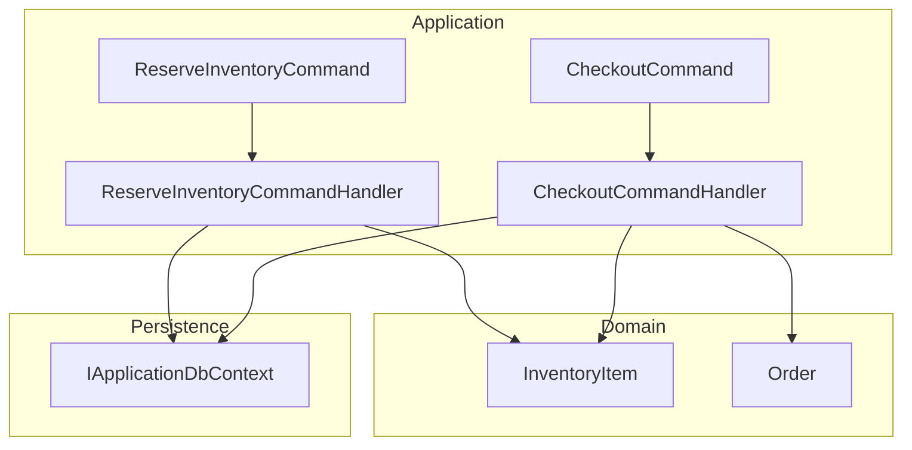
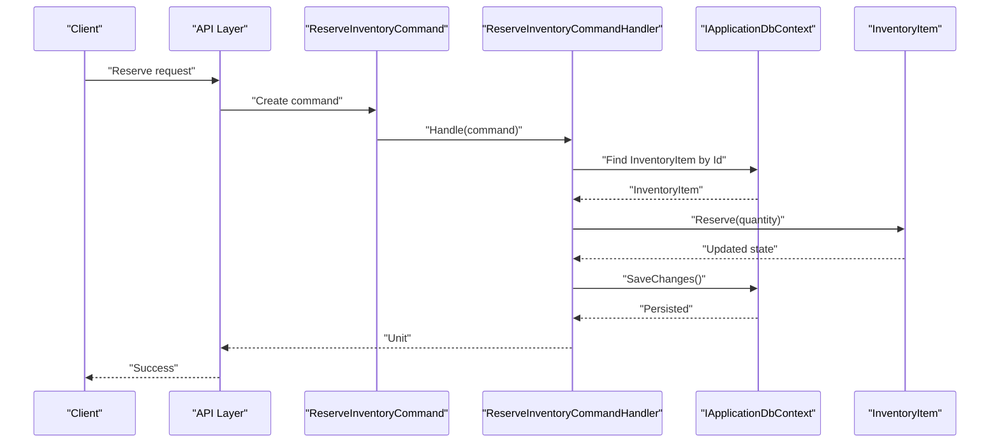
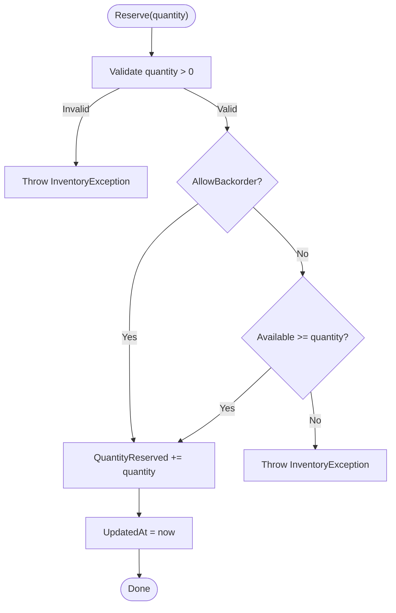
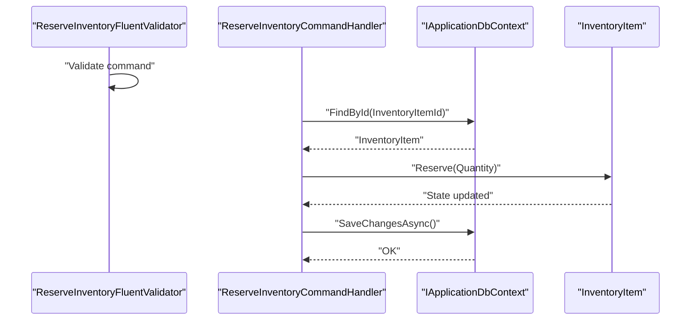
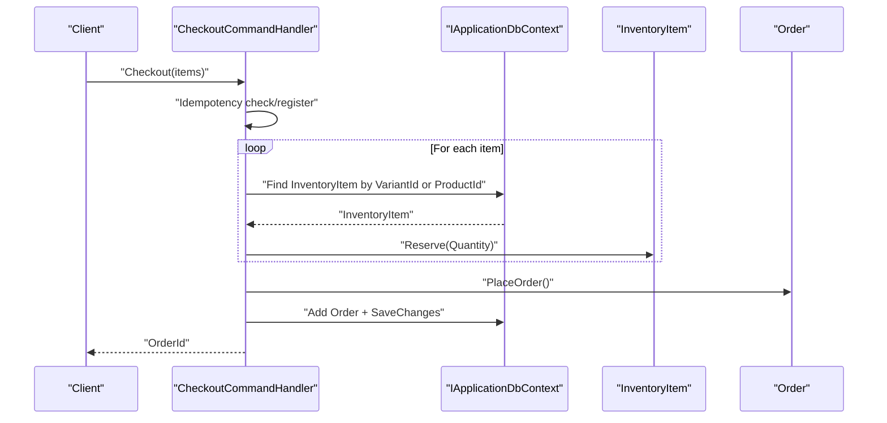
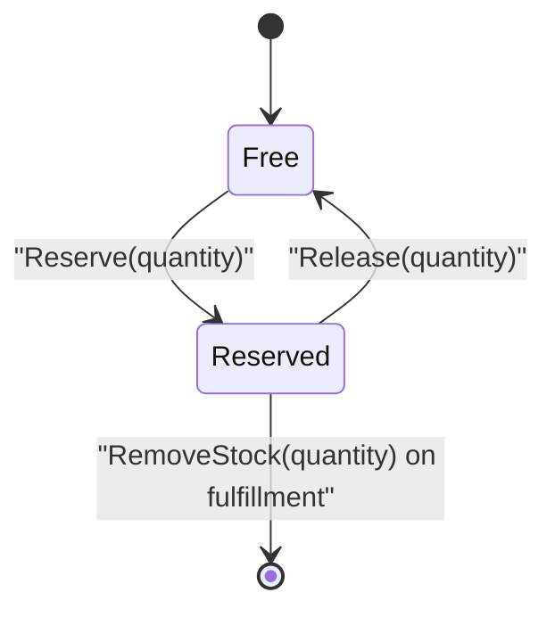
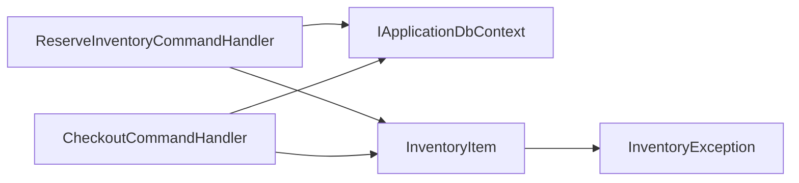

# Inventory Reservations

<cite>
**Referenced Files in This Document**
- [InventoryItem.cs](file://src/Ecommerce.Domain/Entities/InventoryItem.cs)
- [ReserveInventoryCommand.cs](file://src/Ecommerce.Application/Commands/ReserveInventory/ReserveInventoryCommand.cs)
- [ReserveInventoryCommandHandler.cs](file://src/Ecommerce.Application/Commands/ReserveInventory/ReserveInventoryCommandHandler.cs)
- [ReserveInventoryFluentValidator.cs](file://src/Ecommerce.Application/Validators/ReserveInventoryFluentValidator.cs)
- [CheckoutCommand.cs](file://src/Ecommerce.Application/Commands/Checkout/CheckoutCommand.cs)
- [CheckoutCommandHandler.cs](file://src/Ecommerce.Application/Commands/Checkout/CheckoutCommandHandler.cs)
- [Order.cs](file://src/Ecommerce.Domain/Entities/Order.cs)
- [InventoryException.cs](file://src/Ecommerce.Domain/Exceptions/InventoryException.cs)
- [InventoryItemTests.cs](file://tests/Ecommerce.Domain.Tests/InventoryItemTests.cs)
- [ReserveInventoryHandlerTests.cs](file://tests/Ecommerce.Application.Tests/ReserveInventoryHandlerTests.cs)
- [InventoryReservationIntegrationTests.cs](file://tests/Ecommerce.IntegrationTests/InventoryReservationIntegrationTests.cs)
</cite>

## Table of Contents
1. Introduction
2. Project Structure
3. Core Components
4. Architecture Overview
5. Detailed Component Analysis
6. Dependency Analysis
7. Performance Considerations
8. Troubleshooting Guide
9. Conclusion
10. Appendices

## Introduction
This document explains the inventory reservation system used during checkout to temporarily hold stock without permanently reducing it. It focuses on how reservations are created, validated, and persisted; how available stock is calculated; and how reservations can be released when orders fail or are cancelled. It also covers concurrency considerations, backorder behavior, and lifecycle management with examples derived from the codebase.

## Project Structure
The reservation logic spans Domain entities, Application commands/handlers, and tests that validate behavior:
- Domain: InventoryItem defines reservation semantics, availability calculation, and validation rules.
- Application: Commands and handlers orchestrate reservation requests and integrate with persistence.
- Tests: Validate domain rules, handler behavior, and integration scenarios.

**Diagram sources**
- [InventoryItem.cs:6-20](file://src/Ecommerce.Domain/Entities/InventoryItem.cs#L6-L20)
- [ReserveInventoryCommand.cs:5-9](file://src/Ecommerce.Application/Commands/ReserveInventory/ReserveInventoryCommand.cs#L5-L9)
- [ReserveInventoryCommandHandler.cs:9-27](file://src/Ecommerce.Application/Commands/ReserveInventory/ReserveInventoryCommandHandler.cs#L9-L27)
- [CheckoutCommand.cs:6-20](file://src/Ecommerce.Application/Commands/Checkout/CheckoutCommand.cs#L6-L20)
- [CheckoutCommandHandler.cs:11-90](file://src/Ecommerce.Application/Commands/Checkout/CheckoutCommandHandler.cs#L11-L90)
- [Order.cs:8-34](file://src/Ecommerce.Domain/Entities/Order.cs#L8-L34)

**Section sources**
- [InventoryItem.cs:6-20](file://src/Ecommerce.Domain/Entities/InventoryItem.cs#L6-L20)
- [ReserveInventoryCommand.cs:5-9](file://src/Ecommerce.Application/Commands/ReserveInventory/ReserveInventoryCommand.cs#L5-L9)
- [ReserveInventoryCommandHandler.cs:9-27](file://src/Ecommerce.Application/Commands/ReserveInventory/ReserveInventoryCommandHandler.cs#L9-L27)
- [CheckoutCommand.cs:6-20](file://src/Ecommerce.Application/Commands/Checkout/CheckoutCommand.cs#L6-L20)
- [CheckoutCommandHandler.cs:11-90](file://src/Ecommerce.Application/Commands/Checkout/CheckoutCommandHandler.cs#L11-L90)
- [Order.cs:8-34](file://src/Ecommerce.Domain/Entities/Order.cs#L8-L34)

## Core Components
- InventoryItem: Encapsulates stock state and reservation operations. Provides Available as a computed property and enforces business rules for Reserve, Release, AddStock, and RemoveStock.
- ReserveInventoryCommand and Handler: Accept a request to reserve a specific quantity for an inventory item, validate inputs, persist changes, and update QuantityReserved.
- CheckoutCommand and Handler: During checkout, reserves inventory for each line item before placing the order. Uses idempotency to prevent duplicate processing.
- Order: Represents the placed order; while not directly releasing inventory here, it models the lifecycle where release would occur on cancellation or failure.

Key behaviors:
- Reserve increases QuantityReserved and reduces Available (computed).
- Release decreases QuantityReserved, restoring Available.
- Backorder setting controls whether Reserve allows reserving beyond OnHand.

**Section sources**
- [InventoryItem.cs:12-20](file://src/Ecommerce.Domain/Entities/InventoryItem.cs#L12-L20)
- [InventoryItem.cs:29-53](file://src/Ecommerce.Domain/Entities/InventoryItem.cs#L29-L53)
- [ReserveInventoryCommand.cs:5-9](file://src/Ecommerce.Application/Commands/ReserveInventory/ReserveInventoryCommand.cs#L5-L9)
- [ReserveInventoryCommandHandler.cs:17-27](file://src/Ecommerce.Application/Commands/ReserveInventory/ReserveInventoryCommandHandler.cs#L17-L27)
- [CheckoutCommandHandler.cs:56-75](file://src/Ecommerce.Application/Commands/Checkout/CheckoutCommandHandler.cs#L56-L75)
- [Order.cs:89-102](file://src/Ecommerce.Domain/Entities/Order.cs#L89-L102)

## Architecture Overview
The reservation flow integrates application commands with domain logic and persistence:

**Diagram sources**
- [ReserveInventoryCommand.cs:5-9](file://src/Ecommerce.Application/Commands/ReserveInventory/ReserveInventoryCommand.cs#L5-L9)
- [ReserveInventoryCommandHandler.cs:17-27](file://src/Ecommerce.Application/Commands/ReserveInventory/ReserveInventoryCommandHandler.cs#L17-L27)
- [InventoryItem.cs:29-40](file://src/Ecommerce.Domain/Entities/InventoryItem.cs#L29-L40)

## Detailed Component Analysis

### InventoryItem: Reservation Semantics and Availability
- Available is computed as QuantityOnHand minus QuantityReserved.
- Reserve validates positive quantity and enforces backorder policy:
  - If AllowBackorder is false and Available is less than requested, an exception is thrown.
  - Otherwise, QuantityReserved increases and UpdatedAt updates.
- Release validates positive quantity and ensures not more than reserved is released; then decreases QuantityReserved.
- RemoveStock reduces QuantityOnHand with backorder-aware checks and clamps negative values to zero.

**Diagram sources**
- [InventoryItem.cs:29-40](file://src/Ecommerce.Domain/Entities/InventoryItem.cs#L29-L40)
- [InventoryItem.cs:12-20](file://src/Ecommerce.Domain/Entities/InventoryItem.cs#L12-L20)

**Section sources**
- [InventoryItem.cs:12-20](file://src/Ecommerce.Domain/Entities/InventoryItem.cs#L12-L20)
- [InventoryItem.cs:29-53](file://src/Ecommerce.Domain/Entities/InventoryItem.cs#L29-L53)

### ReserveInventoryCommand and Handler
- Command carries InventoryItemId and Quantity.
- Validator enforces non-empty Id and positive Quantity.
- Handler:
  - Validates Quantity > 0.
  - Loads InventoryItem by Id.
  - Calls Reserve(quantity) on the entity.
  - Persists changes via SaveChangesAsync.

**Diagram sources**
- [ReserveInventoryFluentValidator.cs:5-11](file://src/Ecommerce.Application/Validators/ReserveInventoryFluentValidator.cs#L5-L11)
- [ReserveInventoryCommandHandler.cs:17-27](file://src/Ecommerce.Application/Commands/ReserveInventory/ReserveInventoryCommandHandler.cs#L17-L27)
- [InventoryItem.cs:29-40](file://src/Ecommerce.Domain/Entities/InventoryItem.cs#L29-L40)

**Section sources**
- [ReserveInventoryCommand.cs:5-9](file://src/Ecommerce.Application/Commands/ReserveInventory/ReserveInventoryCommand.cs#L5-L9)
- [ReserveInventoryFluentValidator.cs:5-11](file://src/Ecommerce.Application/Validators/ReserveInventoryFluentValidator.cs#L5-L11)
- [ReserveInventoryCommandHandler.cs:17-27](file://src/Ecommerce.Application/Commands/ReserveInventory/ReserveInventoryCommandHandler.cs#L17-L27)

### Checkout Flow and Reservation Integration
- CheckoutCommand includes items with ProductId, ProductVariantId, and Quantity.
- CheckoutCommandHandler:
  - Supports idempotency to avoid duplicate orders.
  - For each item, locates InventoryItem by variant or product fallback.
  - Calls Reserve on the found InventoryItem.
  - Builds and persists the Order after reserving all items.

**Diagram sources**
- [CheckoutCommand.cs:6-20](file://src/Ecommerce.Application/Commands/Checkout/CheckoutCommand.cs#L6-L20)
- [CheckoutCommandHandler.cs:22-90](file://src/Ecommerce.Application/Commands/Checkout/CheckoutCommandHandler.cs#L22-L90)
- [Order.cs:89-102](file://src/Ecommerce.Domain/Entities/Order.cs#L89-L102)

**Section sources**
- [CheckoutCommand.cs:6-20](file://src/Ecommerce.Application/Commands/Checkout/CheckoutCommand.cs#L6-L20)
- [CheckoutCommandHandler.cs:22-90](file://src/Ecommerce.Application/Commands/Checkout/CheckoutCommandHandler.cs#L22-L90)
- [Order.cs:89-102](file://src/Ecommerce.Domain/Entities/Order.cs#L89-L102)

### Reservation Lifecycle and Release
- Reserve increments QuantityReserved and reduces Available.
- Release decrements QuantityReserved and restores Available.
- In this codebase, Release is available on InventoryItem but no explicit cancel/fail handler is shown; callers should invoke Release when an order is cancelled or payment fails to free held stock.

**Diagram sources**
- [InventoryItem.cs:29-53](file://src/Ecommerce.Domain/Entities/InventoryItem.cs#L29-L53)

**Section sources**
- [InventoryItem.cs:29-53](file://src/Ecommerce.Domain/Entities/InventoryItem.cs#L29-L53)

## Dependency Analysis
- ReserveInventoryCommandHandler depends on IApplicationDbContext to load and persist InventoryItem.
- CheckoutCommandHandler depends on IApplicationDbContext and uses InventoryItem.Reserve within a transactional-like scope (per SaveChanges).
- InventoryItem depends on InventoryException for validation failures.
- Tests verify domain rules and handler behavior using in-memory database contexts.

**Diagram sources**
- [ReserveInventoryCommandHandler.cs:11-27](file://src/Ecommerce.Application/Commands/ReserveInventory/ReserveInventoryCommandHandler.cs#L11-L27)
- [CheckoutCommandHandler.cs:13-90](file://src/Ecommerce.Application/Commands/Checkout/CheckoutCommandHandler.cs#L13-L90)
- [InventoryItem.cs:29-53](file://src/Ecommerce.Domain/Entities/InventoryItem.cs#L29-L53)
- [InventoryException.cs:5-8](file://src/Ecommerce.Domain/Exceptions/InventoryException.cs#L5-L8)

**Section sources**
- [ReserveInventoryCommandHandler.cs:11-27](file://src/Ecommerce.Application/Commands/ReserveInventory/ReserveInventoryCommandHandler.cs#L11-L27)
- [CheckoutCommandHandler.cs:13-90](file://src/Ecommerce.Application/Commands/Checkout/CheckoutCommandHandler.cs#L13-L90)
- [InventoryItem.cs:29-53](file://src/Ecommerce.Domain/Entities/InventoryItem.cs#L29-L53)
- [InventoryException.cs:5-8](file://src/Ecommerce.Domain/Exceptions/InventoryException.cs#L5-L8)

## Performance Considerations
- Single-reservation calls: ReserveInventoryCommandHandler performs one find and one save per reservation. For bulk reservations, consider batching to reduce round-trips.
- Concurrency: InventoryItem uses RowVersion for optimistic concurrency control at the persistence layer. Ensure transactions wrap multiple reservations to prevent race conditions across items.
- Indexing: Ensure indexes exist on ProductVariantId and ProductId to speed up inventory lookups during checkout.
- Validation: FluentValidation runs early to reject invalid quantities, reducing unnecessary DB access.

[No sources needed since this section provides general guidance]

## Troubleshooting Guide
Common issues and their causes:
- Insufficient stock to reserve:
  - Occurs when AllowBackorder is false and Available < requested quantity.
  - Thrown by InventoryItem.Reserve.
- Cannot release more than reserved:
  - Occurs when Release is called with quantity > QuantityReserved.
  - Thrown by InventoryItem.Release.
- Invalid input:
  - Negative or zero quantities rejected by validators and domain methods.
- Idempotency conflicts:
  - Duplicate checkout attempts with same key may be rejected or return previous result.

Relevant exceptions and validations:
- InventoryException is thrown for domain rule violations in inventory operations.
- Validators enforce non-empty IDs and positive quantities.

**Section sources**
- [InventoryItem.cs:29-53](file://src/Ecommerce.Domain/Entities/InventoryItem.cs#L29-L53)
- [InventoryException.cs:5-8](file://src/Ecommerce.Domain/Exceptions/InventoryException.cs#L5-L8)
- [ReserveInventoryFluentValidator.cs:5-11](file://src/Ecommerce.Application/Validators/ReserveInventoryFluentValidator.cs#L5-L11)
- [CheckoutCommandHandler.cs:22-44](file://src/Ecommerce.Application/Commands/Checkout/CheckoutCommandHandler.cs#L22-L44)

## Conclusion
The reservation system uses InventoryItem to temporarily hold stock via QuantityReserved, keeping Available accurate without permanent stock reduction until fulfillment. The Reserve method enforces backorder settings and validates inputs, while Release restores availability when orders fail or are cancelled. The checkout flow integrates reservation into order placement, with idempotency safeguards. Proper transaction boundaries and concurrency controls are essential for multi-item checkouts.

[No sources needed since this section summarizes without analyzing specific files]

## Appendices

### Examples and Workflows

- Basic reservation workflow:
  - Create InventoryItem, add stock, call Reserve, verify QuantityReserved and Available.
  - See tests demonstrating reservation and available calculations.

- Checkout reservation workflow:
  - Submit CheckoutCommand with items; handler finds inventory and reserves each item before placing the order.

- Releasing reservations:
  - Call Release on InventoryItem to free held stock when an order is cancelled or payment fails.

- Backorder behavior:
  - When AllowBackorder is true, Reserve permits increasing QuantityReserved beyond QuantityOnHand.
  - When false, Reserve requires Available >= quantity.

- Concurrent handling:
  - Use optimistic concurrency via RowVersion and wrap multi-item reservations in a single transaction to avoid partial reservations.

**Section sources**
- [InventoryItemTests.cs:10-36](file://tests/Ecommerce.Domain.Tests/InventoryItemTests.cs#L10-L36)
- [ReserveInventoryHandlerTests.cs:22-39](file://tests/Ecommerce.Application.Tests/ReserveInventoryHandlerTests.cs#L22-L39)
- [InventoryReservationIntegrationTests.cs:21-49](file://tests/Ecommerce.IntegrationTests/InventoryReservationIntegrationTests.cs#L21-L49)
- [CheckoutCommandHandler.cs:56-75](file://src/Ecommerce.Application/Commands/Checkout/CheckoutCommandHandler.cs#L56-L75)
- [InventoryItem.cs:29-53](file://src/Ecommerce.Domain/Entities/InventoryItem.cs#L29-L53)