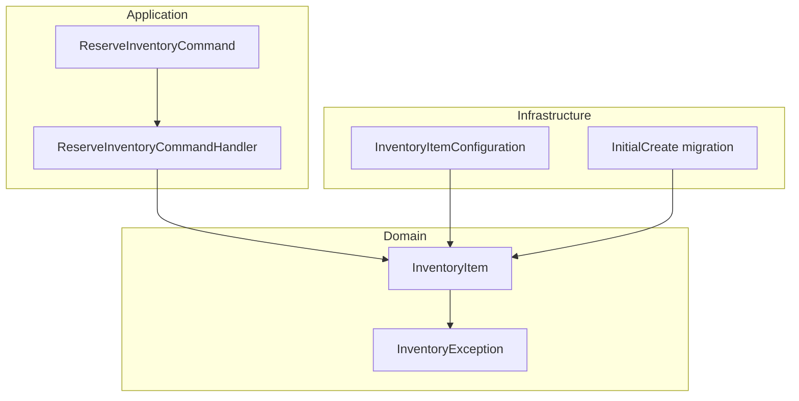
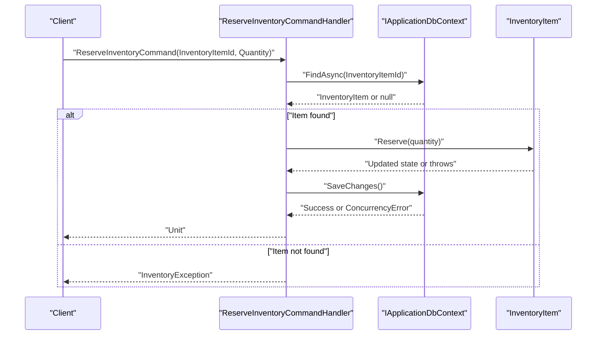
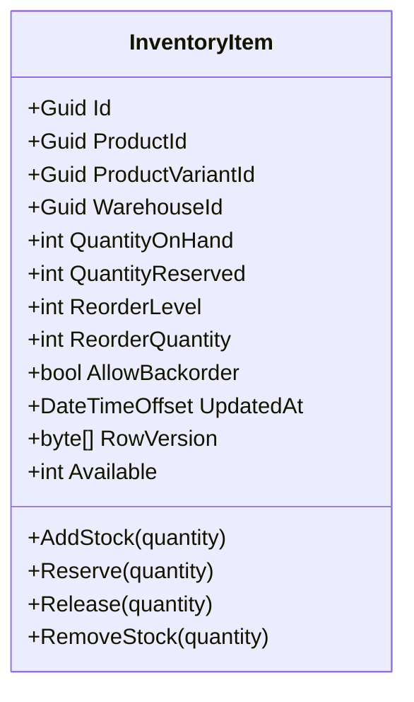
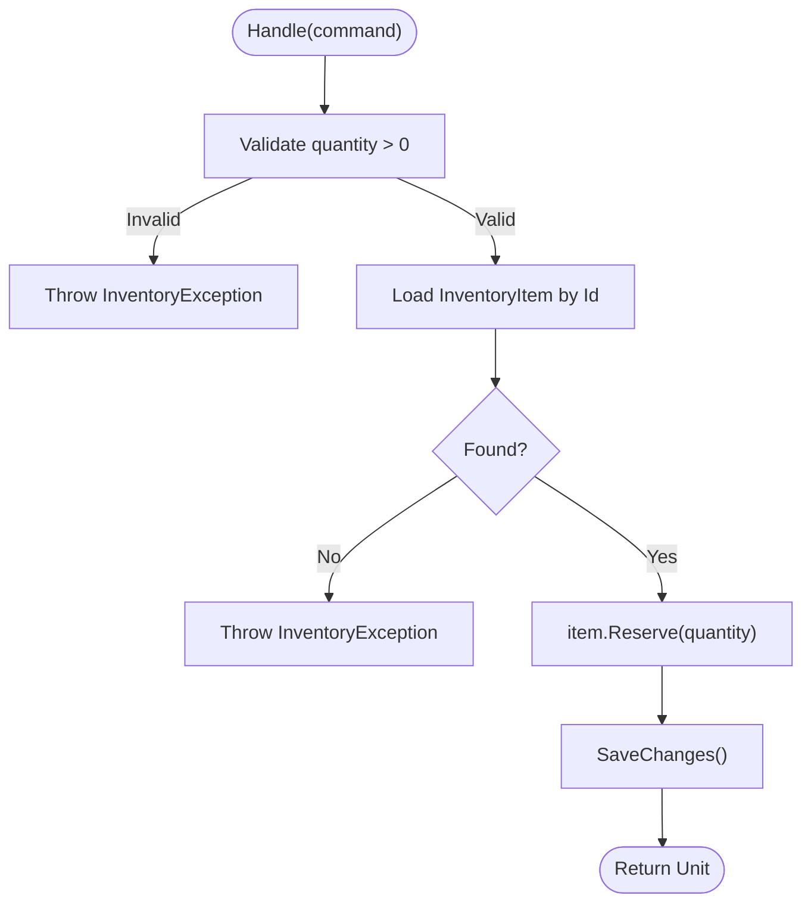
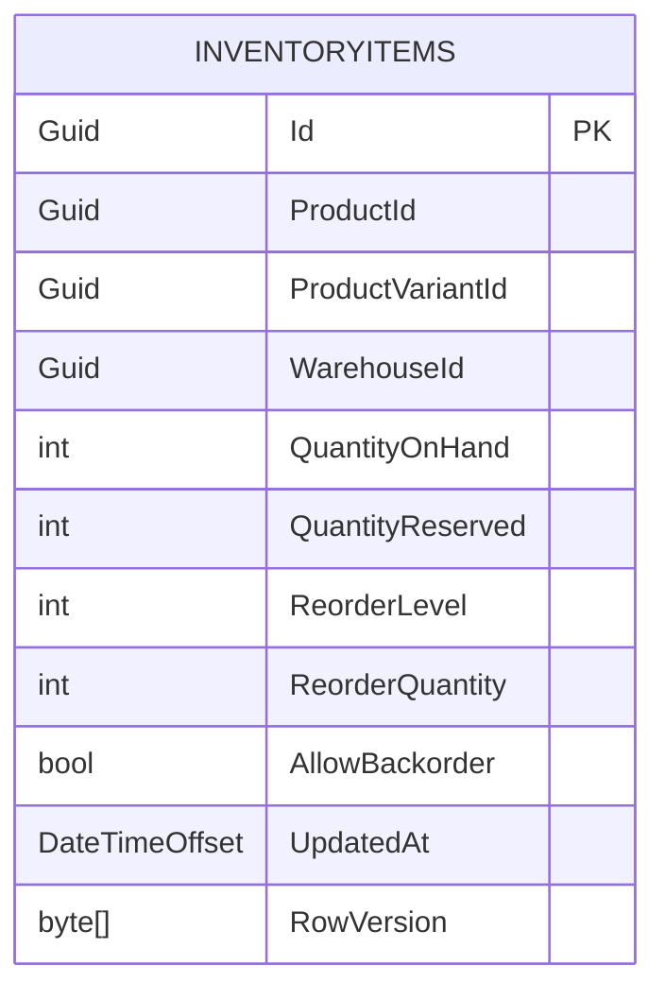
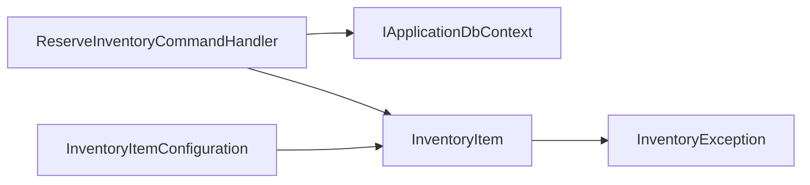

# Stock Tracking

<cite>
**Referenced Files in This Document**
- [InventoryItem.cs](file://src/Ecommerce.Domain/Entities/InventoryItem.cs)
- [ReserveInventoryCommand.cs](file://src/Ecommerce.Application/Commands/ReserveInventory/ReserveInventoryCommand.cs)
- [ReserveInventoryCommandHandler.cs](file://src/Ecommerce.Application/Commands/ReserveInventory/ReserveInventoryCommandHandler.cs)
- [InventoryItemConfiguration.cs](file://src/Ecommerce.Infrastructure/Persistence/Configurations/InventoryItemConfiguration.cs)
- [InitialCreate.cs](file://src/Ecommerce.Infrastructure/Migrations/20260815214939_InitialCreate.cs)
- [InventoryException.cs](file://src/Ecommerce.Domain/Exceptions/InventoryException.cs)
- [DomainException.cs](file://src/Ecommerce.Domain/Exceptions/DomainException.cs)
- [InventoryItemTests.cs](file://tests/Ecommerce.Domain.Tests/InventoryItemTests.cs)
- [ReserveInventoryHandlerTests.cs](file://tests/Ecommerce.Application.Tests/ReserveInventoryHandlerTests.cs)
</cite>

## Table of Contents
1. [Introduction](#introduction)
2. [Project Structure](#project-structure)
3. [Core Components](#core-components)
4. [Architecture Overview](#architecture-overview)
5. [Detailed Component Analysis](#detailed-component-analysis)
6. [Dependency Analysis](#dependency-analysis)
7. [Performance Considerations](#performance-considerations)
8. [Troubleshooting Guide](#troubleshooting-guide)
9. [Conclusion](#conclusion)

## Introduction
This document explains the stock tracking functionality for inventory items, focusing on how quantity on hand, reserved quantities, and available stock are managed. It details the AddStock and RemoveStock methods, validation rules, business constraints, backorder support, low stock detection via reorder levels, audit trails through UpdatedAt timestamps, and concurrency handling using RowVersion for optimistic locking during stock updates.

## Project Structure
The stock tracking feature spans Domain, Application, and Infrastructure layers:
- Domain defines the InventoryItem entity with business rules for adding/removing stock, reserving/releasing, and derived availability.
- Application exposes a command to reserve inventory and handles persistence via a DbContext.
- Infrastructure configures Entity Framework mappings, including concurrency tokens and computed property handling.

**Diagram sources**
- [InventoryItem.cs:6-68](file://src/Ecommerce.Domain/Entities/InventoryItem.cs#L6-L68)
- [ReserveInventoryCommand.cs:5-9](file://src/Ecommerce.Application/Commands/ReserveInventory/ReserveInventoryCommand.cs#L5-L9)
- [ReserveInventoryCommandHandler.cs:9-28](file://src/Ecommerce.Application/Commands/ReserveInventory/ReserveInventoryCommandHandler.cs#L9-L28)
- [InventoryItemConfiguration.cs:7-34](file://src/Ecommerce.Infrastructure/Persistence/Configurations/InventoryItemConfiguration.cs#L7-L34)
- [InitialCreate.cs:112-125](file://src/Ecommerce.Infrastructure/Migrations/20260815214939_InitialCreate.cs#L112-L125)

**Section sources**
- [InventoryItem.cs:6-68](file://src/Ecommerce.Domain/Entities/InventoryItem.cs#L6-L68)
- [ReserveInventoryCommand.cs:5-9](file://src/Ecommerce.Application/Commands/ReserveInventory/ReserveInventoryCommand.cs#L5-L9)
- [ReserveInventoryCommandHandler.cs:9-28](file://src/Ecommerce.Application/Commands/ReserveInventory/ReserveInventoryCommandHandler.cs#L9-L28)
- [InventoryItemConfiguration.cs:7-34](file://src/Ecommerce.Infrastructure/Persistence/Configurations/InventoryItemConfiguration.cs#L7-L34)
- [InitialCreate.cs:112-125](file://src/Ecommerce.Infrastructure/Migrations/20260815214939_InitialCreate.cs#L112-L125)

## Core Components
- InventoryItem: Encapsulates stock state (QuantityOnHand, QuantityReserved), configuration (ReorderLevel, ReorderQuantity, AllowBackorder), audit timestamp (UpdatedAt), and concurrency token (RowVersion). Provides methods AddStock, Reserve, Release, RemoveStock and a derived Available property.
- ReserveInventoryCommand and Handler: Application-level use case to reserve stock for an inventory item, validating input and invoking domain logic.
- InventoryItemConfiguration: EF mapping that enforces required fields, ignores the computed Available property, and configures RowVersion as a concurrency token.

Key behaviors:
- Available is computed as QuantityOnHand minus QuantityReserved.
- Backorders are controlled by AllowBackorder; when disabled, operations must not drive negative stock or exceed available.
- UpdatedAt is updated on every mutating operation for auditability.
- RowVersion participates in optimistic concurrency checks at save time.

**Section sources**
- [InventoryItem.cs:6-68](file://src/Ecommerce.Domain/Entities/InventoryItem.cs#L6-L68)
- [ReserveInventoryCommand.cs:5-9](file://src/Ecommerce.Application/Commands/ReserveInventory/ReserveInventoryCommand.cs#L5-L9)
- [ReserveInventoryCommandHandler.cs:9-28](file://src/Ecommerce.Application/Commands/ReserveInventory/ReserveInventoryCommandHandler.cs#L9-L28)
- [InventoryItemConfiguration.cs:7-34](file://src/Ecommerce.Infrastructure/Persistence/Configurations/InventoryItemConfiguration.cs#L7-L34)

## Architecture Overview
The stock reservation flow uses a command-driven approach:
- A client sends a ReserveInventoryCommand.
- The handler validates the request, loads the InventoryItem from the database, invokes domain Reserve logic, and persists changes.
- EF saves changes with RowVersion-based optimistic concurrency.

**Diagram sources**
- [ReserveInventoryCommandHandler.cs:17-28](file://src/Ecommerce.Application/Commands/ReserveInventory/ReserveInventoryCommandHandler.cs#L17-L28)
- [InventoryItem.cs:29-40](file://src/Ecommerce.Domain/Entities/InventoryItem.cs#L29-L40)
- [InventoryItemConfiguration.cs:23-27](file://src/Ecommerce.Infrastructure/Persistence/Configurations/InventoryItemConfiguration.cs#L23-L27)

## Detailed Component Analysis

### InventoryItem Entity
Responsibilities:
- Tracks physical stock (QuantityOnHand) and committed reservations (QuantityReserved).
- Computes Available = QuantityOnHand - QuantityReserved.
- Enforces business rules for AddStock, Reserve, Release, RemoveStock.
- Supports backorders via AllowBackorder flag.
- Maintains UpdatedAt for audit trails.
- Uses RowVersion for optimistic concurrency.

Validation and constraints:
- All mutation methods require positive quantities; otherwise throw InventoryException.
- Reserve enforces available stock unless AllowBackorder is true.
- Release cannot exceed QuantityReserved.
- RemoveStock prevents negative stock unless AllowBackorder is true; if negative would occur, QuantityOnHand is clamped to zero.

Derived metrics:
- Available is read-only and recomputed on demand.

Audit trail:
- UpdatedAt is set to current UTC time on each mutation.

Concurrency:
- RowVersion is configured as a concurrency token; SaveChanges will detect conflicts when concurrent updates occur.

**Diagram sources**
- [InventoryItem.cs:6-68](file://src/Ecommerce.Domain/Entities/InventoryItem.cs#L6-L68)

**Section sources**
- [InventoryItem.cs:6-68](file://src/Ecommerce.Domain/Entities/InventoryItem.cs#L6-L68)
- [InventoryException.cs:5-8](file://src/Ecommerce.Domain/Exceptions/InventoryException.cs#L5-L8)
- [DomainException.cs:5-8](file://src/Ecommerce.Domain/Exceptions/DomainException.cs#L5-L8)

### ReserveInventory Command and Handler
Purpose:
- Provide a single, testable operation to reserve stock for a given inventory item.

Flow:
- Validates quantity > 0.
- Loads InventoryItem by ID.
- Invokes domain Reserve method.
- Persists changes via SaveChanges.

Error handling:
- Throws InventoryException for invalid quantity or missing item.
- Domain-level exceptions propagate for insufficient stock or constraint violations.

**Diagram sources**
- [ReserveInventoryCommandHandler.cs:17-28](file://src/Ecommerce.Application/Commands/ReserveInventory/ReserveInventoryCommandHandler.cs#L17-L28)
- [ReserveInventoryCommand.cs:5-9](file://src/Ecommerce.Application/Commands/ReserveInventory/ReserveInventoryCommand.cs#L5-L9)

**Section sources**
- [ReserveInventoryCommand.cs:5-9](file://src/Ecommerce.Application/Commands/ReserveInventory/ReserveInventoryCommand.cs#L5-L9)
- [ReserveInventoryCommandHandler.cs:9-28](file://src/Ecommerce.Application/Commands/ReserveInventory/ReserveInventoryCommandHandler.cs#L9-L28)

### Persistence Configuration and Schema
- Table: InventoryItems
- Required fields: QuantityOnHand, QuantityReserved, ReorderLevel, ReorderQuantity, AllowBackorder, UpdatedAt
- Computed property: Available is ignored in EF mapping
- Concurrency: RowVersion is configured as IsRowVersion and IsConcurrencyToken
- Migration confirms column definitions and types

**Diagram sources**
- [InventoryItemConfiguration.cs:11-30](file://src/Ecommerce.Infrastructure/Persistence/Configurations/InventoryItemConfiguration.cs#L11-L30)
- [InitialCreate.cs:112-125](file://src/Ecommerce.Infrastructure/Migrations/20260815214939_InitialCreate.cs#L112-L125)

**Section sources**
- [InventoryItemConfiguration.cs:11-30](file://src/Ecommerce.Infrastructure/Persistence/Configurations/InventoryItemConfiguration.cs#L11-L30)
- [InitialCreate.cs:112-125](file://src/Ecommerce.Infrastructure/Migrations/20260815214939_InitialCreate.cs#L112-L125)

### Business Rules and Validation Summary
- AddStock:
  - Requires quantity > 0; otherwise throws InventoryException.
  - Increases QuantityOnHand and updates UpdatedAt.
- RemoveStock:
  - Requires quantity > 0; otherwise throws InventoryException.
  - If AllowBackorder is false and removal would make QuantityOnHand negative, throws InventoryException.
  - Otherwise decreases QuantityOnHand and clamps to zero if needed; updates UpdatedAt.
- Reserve:
  - Requires quantity > 0; otherwise throws InventoryException.
  - If AllowBackorder is false and Available < quantity, throws InventoryException.
  - Otherwise increases QuantityReserved and updates UpdatedAt.
- Release:
  - Requires quantity > 0; otherwise throws InventoryException.
  - Cannot exceed QuantityReserved; otherwise throws InventoryException.
  - Decreases QuantityReserved and updates UpdatedAt.

**Section sources**
- [InventoryItem.cs:22-67](file://src/Ecommerce.Domain/Entities/InventoryItem.cs#L22-L67)
- [InventoryException.cs:5-8](file://src/Ecommerce.Domain/Exceptions/InventoryException.cs#L5-L8)

### Backorder Support Mechanism
- When AllowBackorder is false:
  - Reserve requires sufficient Available stock.
  - RemoveStock cannot reduce QuantityOnHand below zero.
- When AllowBackorder is true:
  - Reserve allows creating negative Available (backordered).
  - RemoveStock can reduce QuantityOnHand below zero (negative stock represents backorders).

Effect on calculations:
- Available remains QuantityOnHand - QuantityReserved regardless of backorder setting.
- Business rules gate whether negative values are permitted based on AllowBackorder.

**Section sources**
- [InventoryItem.cs:20-67](file://src/Ecommerce.Domain/Entities/InventoryItem.cs#L20-L67)

### Low Stock Detection Using Reorder Levels
- ReorderLevel and ReorderQuantity are persisted properties on InventoryItem.
- Typical usage: compare Available (or QuantityOnHand) against ReorderLevel to trigger replenishment workflows.
- While no automatic reorder logic exists in the entity, consumers can implement alerts or purchase orders when Available <= ReorderLevel.

Example pattern:
- If Available <= ReorderLevel, schedule reorder of ReorderQuantity units.

Note: This is a consumer-side process; the entity stores thresholds but does not auto-trigger actions.

**Section sources**
- [InventoryItem.cs:14-15](file://src/Ecommerce.Domain/Entities/InventoryItem.cs#L14-L15)
- [InventoryItemConfiguration.cs:17-18](file://src/Ecommerce.Infrastructure/Persistence/Configurations/InventoryItemConfiguration.cs#L17-L18)

### Audit Trail Through UpdatedAt
- Every mutating operation (AddStock, Reserve, Release, RemoveStock) sets UpdatedAt to the current UTC time.
- This provides a simple audit trail for when stock levels changed.

Usage:
- Query recent changes by UpdatedAt for reporting or reconciliation.

**Section sources**
- [InventoryItem.cs:22-67](file://src/Ecommerce.Domain/Entities/InventoryItem.cs#L22-L67)

### Concurrency Handling With RowVersion
- RowVersion is configured as a concurrency token in EF.
- On SaveChanges, EF includes RowVersion in update commands; if the stored version differs from the current row’s version, a concurrency exception is raised.
- This prevents lost updates when multiple processes adjust stock concurrently.

Recommendation:
- Wrap stock mutations in retry logic to handle transient concurrency conflicts gracefully.

**Section sources**
- [InventoryItemConfiguration.cs:23-27](file://src/Ecommerce.Infrastructure/Persistence/Configurations/InventoryItemConfiguration.cs#L23-L27)

## Dependency Analysis
- ReserveInventoryCommandHandler depends on IApplicationDbContext to load and persist InventoryItem.
- InventoryItem depends on InventoryException for validation failures.
- InventoryItemConfiguration maps InventoryItem to the database schema and configures concurrency behavior.

**Diagram sources**
- [ReserveInventoryCommandHandler.cs:9-28](file://src/Ecommerce.Application/Commands/ReserveInventory/ReserveInventoryCommandHandler.cs#L9-L28)
- [InventoryItem.cs:6-68](file://src/Ecommerce.Domain/Entities/InventoryItem.cs#L6-L68)
- [InventoryItemConfiguration.cs:7-34](file://src/Ecommerce.Infrastructure/Persistence/Configurations/InventoryItemConfiguration.cs#L7-L34)

**Section sources**
- [ReserveInventoryCommandHandler.cs:9-28](file://src/Ecommerce.Application/Commands/ReserveInventory/ReserveInventoryCommandHandler.cs#L9-L28)
- [InventoryItem.cs:6-68](file://src/Ecommerce.Domain/Entities/InventoryItem.cs#L6-L68)
- [InventoryItemConfiguration.cs:7-34](file://src/Ecommerce.Infrastructure/Persistence/Configurations/InventoryItemConfiguration.cs#L7-L34)

## Performance Considerations
- Keep stock operations within short-lived transactions to minimize lock contention.
- Use RowVersion to avoid expensive locking while ensuring consistency.
- Index queries by WarehouseId, ProductId, and ProductVariantId for efficient lookups (as suggested by architecture docs).
- Batch related stock adjustments where possible to reduce round trips.

[No sources needed since this section provides general guidance]

## Troubleshooting Guide
Common issues and resolutions:
- Invalid quantity:
  - Symptoms: InventoryException thrown by AddStock, RemoveStock, Reserve, or Release.
  - Cause: Non-positive quantity passed to a method.
  - Resolution: Ensure all stock adjustments use positive integers.
- Insufficient stock:
  - Symptoms: InventoryException when reserving or removing stock.
  - Cause: AllowBackorder is false and Available or QuantityOnHand is insufficient.
  - Resolution: Increase stock, allow backorders, or reduce requested quantity.
- Over-release:
  - Symptoms: InventoryException when releasing more than reserved.
  - Cause: Release quantity exceeds QuantityReserved.
  - Resolution: Adjust release amount or verify prior reservations.
- Concurrency conflict:
  - Symptoms: SaveChanges fails due to RowVersion mismatch.
  - Cause: Concurrent modifications to the same InventoryItem.
  - Resolution: Retry the operation after refreshing the entity; consider idempotency keys for external calls.

**Section sources**
- [InventoryItem.cs:22-67](file://src/Ecommerce.Domain/Entities/InventoryItem.cs#L22-L67)
- [InventoryException.cs:5-8](file://src/Ecommerce.Domain/Exceptions/InventoryException.cs#L5-L8)
- [InventoryItemConfiguration.cs:23-27](file://src/Ecommerce.Infrastructure/Persistence/Configurations/InventoryItemConfiguration.cs#L23-L27)

## Conclusion
The stock tracking system centers on the InventoryItem entity, which encapsulates robust business rules for managing quantity on hand, reserved quantities, and available stock. AddStock and RemoveStock enforce strict validation and respect backorder settings. Reserve and Release coordinate committed allocations. UpdatedAt provides an audit trail, and RowVersion ensures safe concurrent updates. ReorderLevel and ReorderQuantity enable low stock detection at the application layer. Together, these components deliver reliable, auditable, and scalable inventory management.