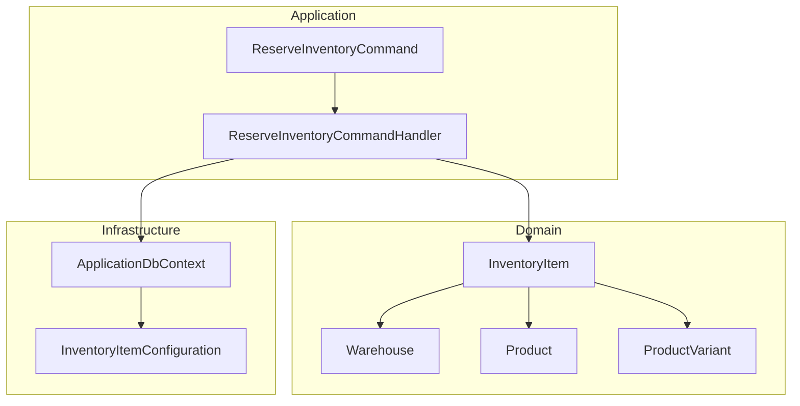
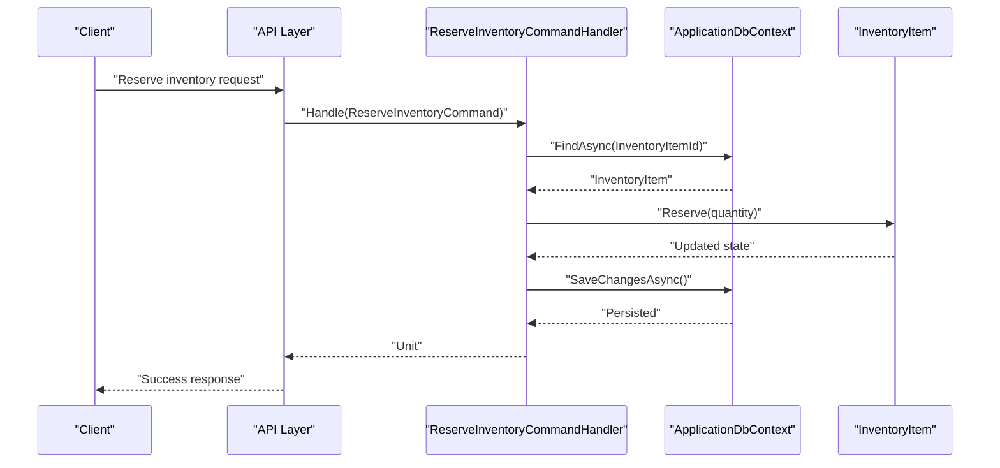
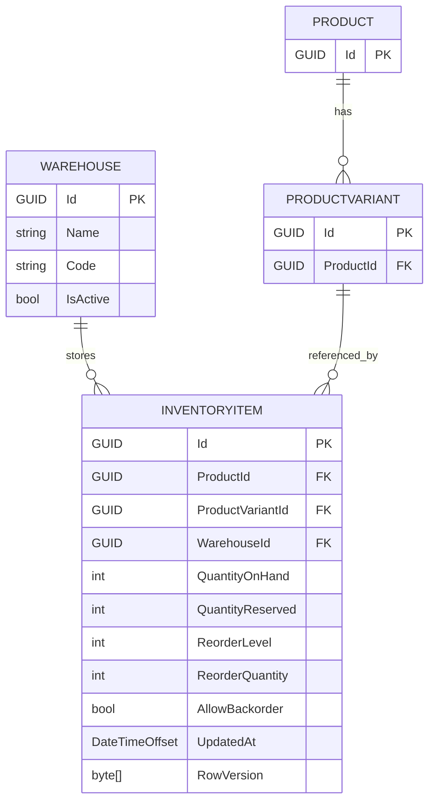
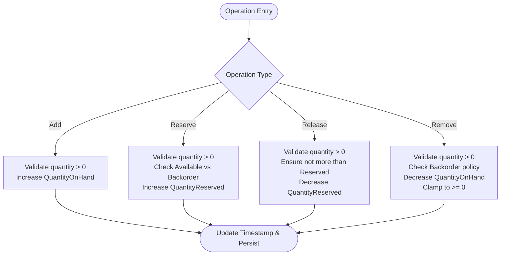
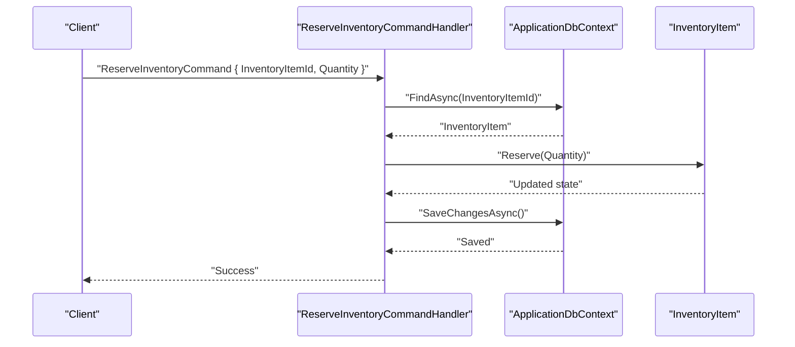
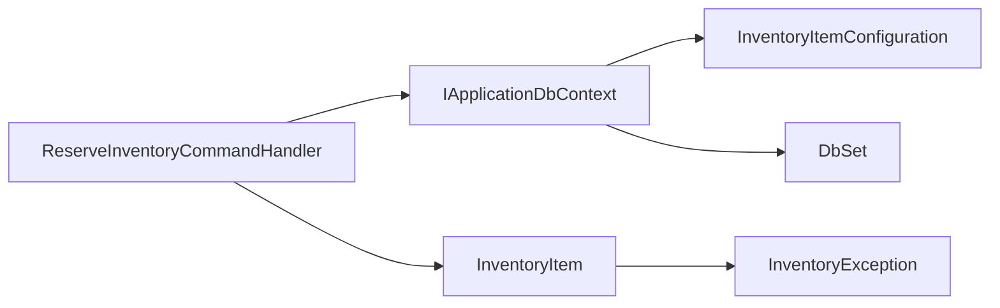

# Warehouse Operations

<cite>
**Referenced Files in This Document**
- [Warehouse.cs](file://src/Ecommerce.Domain/Entities/Warehouse.cs)
- [InventoryItem.cs](file://src/Ecommerce.Domain/Entities/InventoryItem.cs)
- [Product.cs](file://src/Ecommerce.Domain/Entities/Product.cs)
- [ProductVariant.cs](file://src/Ecommerce.Domain/Entities/ProductVariant.cs)
- [InventoryItemConfiguration.cs](file://src/Ecommerce.Infrastructure/Persistence/Configurations/InventoryItemConfiguration.cs)
- [ApplicationDbContext.cs](file://src/Ecommerce.Infrastructure/Persistence/ApplicationDbContext.cs)
- [ReserveInventoryCommand.cs](file://src/Ecommerce.Application/Commands/ReserveInventory/ReserveInventoryCommand.cs)
- [ReserveInventoryCommandHandler.cs](file://src/Ecommerce.Application/Commands/ReserveInventory/ReserveInventoryCommandHandler.cs)
- [InitialCreate.cs](file://src/Ecommerce.Infrastructure/Migrations/20260815214939_InitialCreate.cs)
- [erd.md](file://docs/architecture/erd.md)
- [entities_and_constraints.md](file://docs/architecture/entities_and_constraints.md)
</cite>

## Table of Contents
1. [Introduction](#introduction)
2. [Project Structure](#project-structure)
3. [Core Components](#core-components)
4. [Architecture Overview](#architecture-overview)
5. [Detailed Component Analysis](#detailed-component-analysis)
6. [Dependency Analysis](#dependency-analysis)
7. [Performance Considerations](#performance-considerations)
8. [Troubleshooting Guide](#troubleshooting-guide)
9. [Conclusion](#conclusion)
10. [Appendices](#appendices)

## Introduction
This document explains warehouse operations and multi-location inventory management as implemented in the codebase. It focuses on how inventory items are associated with specific warehouses via WarehouseId, how stock is managed per location, and how to aggregate, query, and report inventory by warehouse. It also outlines patterns for stock transfers between locations and consolidating stock across facilities, along with performance and consistency considerations for large-scale operations.

## Project Structure
The warehouse and inventory functionality spans Domain entities, Application commands/handlers, and Infrastructure persistence configuration:
- Domain defines Warehouse and InventoryItem, including business rules for adding, reserving, releasing, and removing stock.
- Application exposes a command to reserve inventory against a specific InventoryItem (which encodes a product, variant, and warehouse).
- Infrastructure configures EF Core mappings and provides the DbContext that exposes InventoryItems and related entities.

**Diagram sources**
- [InventoryItem.cs:1-70](file://src/Ecommerce.Domain/Entities/InventoryItem.cs#L1-L70)
- [Warehouse.cs:1-15](file://src/Ecommerce.Domain/Entities/Warehouse.cs#L1-L15)
- [Product.cs:1-44](file://src/Ecommerce.Domain/Entities/Product.cs#L1-L44)
- [ProductVariant.cs:1-28](file://src/Ecommerce.Domain/Entities/ProductVariant.cs#L1-L28)
- [ReserveInventoryCommand.cs:1-11](file://src/Ecommerce.Application/Commands/ReserveInventory/ReserveInventoryCommand.cs#L1-L11)
- [ReserveInventoryCommandHandler.cs:1-31](file://src/Ecommerce.Application/Commands/ReserveInventory/ReserveInventoryCommandHandler.cs#L1-L31)
- [InventoryItemConfiguration.cs:1-37](file://src/Ecommerce.Infrastructure/Persistence/Configurations/InventoryItemConfiguration.cs#L1-L37)
- [ApplicationDbContext.cs:1-43](file://src/Ecommerce.Infrastructure/Persistence/ApplicationDbContext.cs#L1-L43)

**Section sources**
- [InventoryItem.cs:1-70](file://src/Ecommerce.Domain/Entities/InventoryItem.cs#L1-L70)
- [Warehouse.cs:1-15](file://src/Ecommerce.Domain/Entities/Warehouse.cs#L1-L15)
- [Product.cs:1-44](file://src/Ecommerce.Domain/Entities/Product.cs#L1-L44)
- [ProductVariant.cs:1-28](file://src/Ecommerce.Domain/Entities/ProductVariant.cs#L1-L28)
- [ReserveInventoryCommand.cs:1-11](file://src/Ecommerce.Application/Commands/ReserveInventory/ReserveInventoryCommand.cs#L1-L11)
- [ReserveInventoryCommandHandler.cs:1-31](file://src/Ecommerce.Application/Commands/ReserveInventory/ReserveInventoryCommandHandler.cs#L1-L31)
- [InventoryItemConfiguration.cs:1-37](file://src/Ecommerce.Infrastructure/Persistence/Configurations/InventoryItemConfiguration.cs#L1-L37)
- [ApplicationDbContext.cs:1-43](file://src/Ecommerce.Infrastructure/Persistence/ApplicationDbContext.cs#L1-L43)

## Core Components
- Warehouse: Represents a physical or logical storage location identified by Id, Name, Code, IsActive, and timestamps.
- InventoryItem: Represents stock at a specific warehouse for a specific product and product variant. Tracks QuantityOnHand, QuantityReserved, reorder thresholds, backorder policy, concurrency token (RowVersion), and computed Available.
- Product and ProductVariant: Provide the product context for inventory; InventoryItem links to both via foreign keys.
- ReserveInventoryCommand and Handler: Encapsulate reserving stock against a specific InventoryItem, validating quantity, loading the item, invoking domain logic, and persisting changes.

Key relationships:
- InventoryItem.WarehouseId ties each inventory record to a single warehouse.
- InventoryItem.ProductId and InventoryItem.ProductVariantId tie inventory to a specific product and its variant.
- The database schema includes these columns and enforces required fields and concurrency control.

**Section sources**
- [Warehouse.cs:1-15](file://src/Ecommerce.Domain/Entities/Warehouse.cs#L1-L15)
- [InventoryItem.cs:1-70](file://src/Ecommerce.Domain/Entities/InventoryItem.cs#L1-L70)
- [Product.cs:1-44](file://src/Ecommerce.Domain/Entities/Product.cs#L1-L44)
- [ProductVariant.cs:1-28](file://src/Ecommerce.Domain/Entities/ProductVariant.cs#L1-L28)
- [InitialCreate.cs:112-125](file://src/Ecommerce.Infrastructure/Migrations/20260815214939_InitialCreate.cs#L112-L125)

## Architecture Overview
The system uses a layered architecture:
- Domain layer encapsulates inventory business rules (add, reserve, release, remove stock) and maintains per-warehouse stock state through InventoryItem.
- Application layer exposes commands to perform operations like reserving stock; handlers orchestrate loading, validation, domain method invocation, and persistence.
- Infrastructure layer configures Entity Framework mappings and exposes DbSets for querying and saving changes.

**Diagram sources**
- [ReserveInventoryCommandHandler.cs:1-31](file://src/Ecommerce.Application/Commands/ReserveInventory/ReserveInventoryCommandHandler.cs#L1-L31)
- [InventoryItem.cs:29-40](file://src/Ecommerce.Domain/Entities/InventoryItem.cs#L29-L40)
- [ApplicationDbContext.cs:19-32](file://src/Ecommerce.Infrastructure/Persistence/ApplicationDbContext.cs#L19-L32)

## Detailed Component Analysis

### Warehouse and Inventory Item Association
- Each InventoryItem has a WarehouseId foreign key, ensuring stock is tracked per location.
- The database migration shows InventoryItems table includes WarehouseId alongside ProductId and ProductVariantId.
- The ERD documents the relationship: WAREHOUSE stores INVENTORYITEM.

**Diagram sources**
- [InitialCreate.cs:112-125](file://src/Ecommerce.Infrastructure/Migrations/20260815214939_InitialCreate.cs#L112-L125)
- [erd.md:40-50](file://docs/architecture/erd.md#L40-L50)
- [InventoryItem.cs:1-70](file://src/Ecommerce.Domain/Entities/InventoryItem.cs#L1-L70)
- [ProductVariant.cs:1-28](file://src/Ecommerce.Domain/Entities/ProductVariant.cs#L1-L28)

**Section sources**
- [InitialCreate.cs:112-125](file://src/Ecommerce.Infrastructure/Migrations/20260815214939_InitialCreate.cs#L112-L125)
- [erd.md:40-50](file://docs/architecture/erd.md#L40-L50)
- [InventoryItem.cs:1-70](file://src/Ecommerce.Domain/Entities/InventoryItem.cs#L1-L70)

### Stock Management Rules (Per Warehouse)
- AddStock: Increases QuantityOnHand; validates positive quantity.
- Reserve: Validates positive quantity; checks available stock unless backorders are allowed; increases QuantityReserved.
- Release: Decreases QuantityReserved up to reserved amount.
- RemoveStock: Decreases QuantityOnHand; prevents negative stock unless backorders are allowed; clamps to zero if needed.
- Available: Computed property equals QuantityOnHand minus QuantityReserved.

These methods enforce data integrity at the domain level, ensuring consistent stock levels per warehouse.

**Diagram sources**
- [InventoryItem.cs:22-67](file://src/Ecommerce.Domain/Entities/InventoryItem.cs#L22-L67)

**Section sources**
- [InventoryItem.cs:22-67](file://src/Ecommerce.Domain/Entities/InventoryItem.cs#L22-L67)

### Reserving Inventory Against a Specific Warehouse
- The ReserveInventoryCommand targets a specific InventoryItem.Id, which inherently identifies the warehouse via InventoryItem.WarehouseId.
- The handler loads the item, invokes domain Reserve(), and persists changes.

**Diagram sources**
- [ReserveInventoryCommand.cs:1-11](file://src/Ecommerce.Application/Commands/ReserveInventory/ReserveInventoryCommand.cs#L1-L11)
- [ReserveInventoryCommandHandler.cs:17-27](file://src/Ecommerce.Application/Commands/ReserveInventory/ReserveInventoryCommandHandler.cs#L17-L27)
- [InventoryItem.cs:29-40](file://src/Ecommerce.Domain/Entities/InventoryItem.cs#L29-L40)
- [ApplicationDbContext.cs:19-32](file://src/Ecommerce.Infrastructure/Persistence/ApplicationDbContext.cs#L19-L32)

**Section sources**
- [ReserveInventoryCommand.cs:1-11](file://src/Ecommerce.Application/Commands/ReserveInventory/ReserveInventoryCommand.cs#L1-L11)
- [ReserveInventoryCommandHandler.cs:17-27](file://src/Ecommerce.Application/Commands/ReserveInventory/ReserveInventoryCommandHandler.cs#L17-L27)
- [InventoryItem.cs:29-40](file://src/Ecommerce.Domain/Entities/InventoryItem.cs#L29-L40)

### Querying Inventory by Warehouse
- Use the DbContext DbSet for InventoryItems and filter by WarehouseId to retrieve all inventory records for a given warehouse.
- Combine with Product and ProductVariant lookups to enrich results with product details.

Example queries (conceptual):
- Get all items in a warehouse: Filter InventoryItems where WarehouseId equals target.
- Get available stock per product in a warehouse: Compute Available = QuantityOnHand - QuantityReserved.
- Aggregate totals: Sum QuantityOnHand and QuantityReserved grouped by ProductId or ProductVariantId within a warehouse.

Note: These queries should be executed within appropriate transactions when combined with updates to maintain consistency.

**Section sources**
- [ApplicationDbContext.cs:19-32](file://src/Ecommerce.Infrastructure/Persistence/ApplicationDbContext.cs#L19-L32)
- [InventoryItem.cs:20-20](file://src/Ecommerce.Domain/Entities/InventoryItem.cs#L20-L20)

### Managing Multiple Warehouse Locations
- Create multiple Warehouse records to represent distinct locations.
- For each product/variant, create separate InventoryItem records per warehouse using the same ProductId/ProductVariantId but different WarehouseId.
- Update stock independently per location using domain methods on the relevant InventoryItem.

Operational guidance:
- Ensure unique identifiers per warehouse (e.g., Code) to avoid ambiguity.
- When reporting, group by WarehouseId to isolate metrics per location.

**Section sources**
- [Warehouse.cs:1-15](file://src/Ecommerce.Domain/Entities/Warehouse.cs#L1-L15)
- [InventoryItem.cs:1-70](file://src/Ecommerce.Domain/Entities/InventoryItem.cs#L1-L70)

### Consolidating Stock Across Facilities
- To consolidate stock from one warehouse to another:
  - Debit source InventoryItem.RemoveStock(quantity).
  - Credit destination InventoryItem.AddStock(quantity).
  - Perform both operations in a single transaction to ensure atomicity.
  - Optionally record an audit trail (see conceptual design below).

Note: While the current codebase does not include a dedicated transfer entity, the domain methods support the necessary operations to implement transfers safely.

**Section sources**
- [InventoryItem.cs:22-67](file://src/Ecommerce.Domain/Entities/InventoryItem.cs#L22-L67)

### Warehouse-Specific Reporting
- Per-warehouse metrics can be derived from InventoryItems filtered by WarehouseId:
  - Total On-Hand: Sum(QuantityOnHand)
  - Total Reserved: Sum(QuantityReserved)
  - Total Available: Sum(QuantityOnHand - QuantityReserved)
  - Low-stock alerts: Where QuantityOnHand < ReorderLevel
  - Backorder-enabled items: Where AllowBackorder is true

These aggregations can be performed using LINQ over the DbContext DbSet for efficient server-side computation.

**Section sources**
- [InventoryItem.cs:1-70](file://src/Ecommerce.Domain/Entities/InventoryItem.cs#L1-L70)
- [ApplicationDbContext.cs:19-32](file://src/Ecommerce.Infrastructure/Persistence/ApplicationDbContext.cs#L19-L32)

## Dependency Analysis
- Domain dependencies:
  - InventoryItem depends on domain exceptions for validation errors.
  - InventoryItem references ProductId and ProductVariantId conceptually; Product and ProductVariant provide product context.
- Application dependencies:
  - ReserveInventoryCommandHandler depends on IApplicationDbContext to load and save InventoryItem.
- Infrastructure dependencies:
  - InventoryItemConfiguration maps InventoryItem to the database table and configures concurrency tokens.
  - ApplicationDbContext exposes DbSet<InventoryItem> and applies configurations.

**Diagram sources**
- [ReserveInventoryCommandHandler.cs:1-31](file://src/Ecommerce.Application/Commands/ReserveInventory/ReserveInventoryCommandHandler.cs#L1-L31)
- [InventoryItem.cs:1-70](file://src/Ecommerce.Domain/Entities/InventoryItem.cs#L1-L70)
- [InventoryItemConfiguration.cs:1-37](file://src/Ecommerce.Infrastructure/Persistence/Configurations/InventoryItemConfiguration.cs#L1-L37)
- [ApplicationDbContext.cs:19-32](file://src/Ecommerce.Infrastructure/Persistence/ApplicationDbContext.cs#L19-L32)

**Section sources**
- [ReserveInventoryCommandHandler.cs:1-31](file://src/Ecommerce.Application/Commands/ReserveInventory/ReserveInventoryCommandHandler.cs#L1-L31)
- [InventoryItem.cs:1-70](file://src/Ecommerce.Domain/Entities/InventoryItem.cs#L1-L70)
- [InventoryItemConfiguration.cs:1-37](file://src/Ecommerce.Infrastructure/Persistence/Configurations/InventoryItemConfiguration.cs#L1-L37)
- [ApplicationDbContext.cs:19-32](file://src/Ecommerce.Infrastructure/Persistence/ApplicationDbContext.cs#L19-L32)

## Performance Considerations
- Indexes:
  - The design documentation indicates indexes on WarehouseId, ProductId, and ProductVariantId for InventoryItems to optimize queries and joins.
- Concurrency:
  - RowVersion is configured as a concurrency token to prevent overselling and detect conflicts during concurrent updates.
- Query efficiency:
  - Prefer server-side filtering by WarehouseId and aggregation using LINQ to minimize data transfer.
  - Avoid loading full graphs when only summary metrics are needed.
- Transactions:
  - Wrap multi-step operations (e.g., transfers) in explicit transactions to ensure consistency across locations.
- Caching:
  - Consider caching read-only warehouse metadata and aggregated metrics with appropriate invalidation strategies.

[No sources needed since this section provides general guidance]

## Troubleshooting Guide
Common issues and resolutions:
- Insufficient stock to reserve/remove:
  - Occurs when Available is less than requested quantity and backorders are disabled. Validate AllowBackorder and adjust quantities accordingly.
- Cannot release more than reserved:
  - Ensure the release quantity does not exceed QuantityReserved.
- Optimistic concurrency conflicts:
  - RowVersion mismatches indicate concurrent modifications; retry the operation after refreshing the entity.
- Missing inventory item:
  - Verify the InventoryItemId exists before attempting reservation.

Validation and error handling are enforced in domain methods and application handlers.

**Section sources**
- [InventoryItem.cs:29-67](file://src/Ecommerce.Domain/Entities/InventoryItem.cs#L29-L67)
- [ReserveInventoryCommandHandler.cs:17-27](file://src/Ecommerce.Application/Commands/ReserveInventory/ReserveInventoryCommandHandler.cs#L17-L27)

## Conclusion
The codebase implements robust per-warehouse inventory management through clear domain rules and infrastructure mappings. InventoryItem ties stock to a specific warehouse, enabling accurate tracking, reservations, and reporting per location. While explicit transfer and transaction entities are not present, the domain methods support implementing transfers and consolidations safely within transactions. Leveraging indexes, concurrency tokens, and efficient queries ensures scalability for large-scale warehouse operations.

[No sources needed since this section summarizes without analyzing specific files]

## Appendices

### Conceptual Design Notes
- The architectural documentation describes additional entities such as InventoryTransaction and StockReservation to support auditing and advanced reservation workflows. These complement the current implementation by providing mechanisms for detailed movement logs and reservation lifecycle management.

**Section sources**
- [entities_and_constraints.md:177-189](file://docs/architecture/entities_and_constraints.md#L177-L189)