# Order Events and Integration

<cite>
**Referenced Files in This Document**
- [OrderPlacedDomainEvent.cs](file://src/Ecommerce.Domain/DomainEvents/OrderPlacedDomainEvent.cs)
- [PaymentCompletedDomainEvent.cs](file://src/Ecommerce.Domain/DomainEvents/PaymentCompletedDomainEvent.cs)
- [Order.cs](file://src/Ecommerce.Domain/Entities/Order.cs)
- [Payment.cs](file://src/Ecommerce.Domain/Entities/Payment.cs)
- [CheckoutCommandHandler.cs](file://src/Ecommerce.Application/Commands/Checkout/CheckoutCommandHandler.cs)
- [IPaymentService.cs](file://src/Ecommerce.Application/Interfaces/IPaymentService.cs)
- [PaymentGateway.cs](file://src/Ecommerce.Infrastructure/Payments/PaymentGateway.cs)
- [IdempotencyService.cs](file://src/Ecommerce.Infrastructure/Services/IdempotencyService.cs)
- [IIdempotencyService.cs](file://src/Ecommerce.Application/Interfaces/IIdempotencyService.cs)
- [DependencyInjection.cs](file://src/Ecommerce.Infrastructure/DependencyInjection.cs)
</cite>

## Table of Contents
1. Introduction
2. Project Structure
3. Core Components
4. Architecture Overview
5. Detailed Component Analysis
6. Dependency Analysis
7. Performance Considerations
8. Troubleshooting Guide
9. Conclusion

## Introduction
This document explains the order-related domain events and system integrations for the e-commerce application. It focuses on:
- The structure and payload of OrderPlacedDomainEvent and PaymentCompletedDomainEvent
- How orders are created, persisted, and how payments are processed
- Event-driven patterns used across the order processing pipeline
- Practical guidance for event handlers, message queuing integration, and distributed considerations
- Strategies for event ordering, retries, and dead letter handling

The goal is to help developers implement robust, scalable order processing with clear boundaries between domain logic, application workflows, and infrastructure concerns.

## Project Structure
The repository follows a layered architecture:
- Domain layer defines core entities (Order, Payment) and domain events (OrderPlacedDomainEvent, PaymentCompletedDomainEvent)
- Application layer orchestrates use cases via commands and handlers (e.g., CheckoutCommandHandler)
- Infrastructure layer provides persistence, payment gateway stubs, idempotency service, and dependency injection wiring

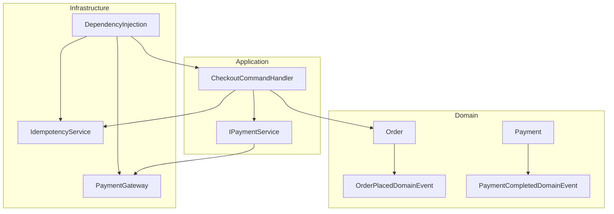

**Diagram sources**
- [Order.cs:1-105](file://src/Ecommerce.Domain/Entities/Order.cs#L1-L105)
- [Payment.cs:1-23](file://src/Ecommerce.Domain/Entities/Payment.cs#L1-L23)
- [OrderPlacedDomainEvent.cs:1-16](file://src/Ecommerce.Domain/DomainEvents/OrderPlacedDomainEvent.cs#L1-L16)
- [PaymentCompletedDomainEvent.cs:1-18](file://src/Ecommerce.Domain/DomainEvents/PaymentCompletedDomainEvent.cs#L1-L18)
- [CheckoutCommandHandler.cs:1-94](file://src/Ecommerce.Application/Commands/Checkout/CheckoutCommandHandler.cs#L1-L94)
- [IPaymentService.cs:1-25](file://src/Ecommerce.Application/Interfaces/IPaymentService.cs#L1-L25)
- [PaymentGateway.cs:1-25](file://src/Ecommerce.Infrastructure/Payments/PaymentGateway.cs#L1-L25)
- [IdempotencyService.cs:1-41](file://src/Ecommerce.Infrastructure/Services/IdempotencyService.cs#L1-L41)
- [DependencyInjection.cs:1-89](file://src/Ecommerce.Infrastructure/DependencyInjection.cs#L1-L89)

**Section sources**
- [Order.cs:1-105](file://src/Ecommerce.Domain/Entities/Order.cs#L1-L105)
- [Payment.cs:1-23](file://src/Ecommerce.Domain/Entities/Payment.cs#L1-L23)
- [CheckoutCommandHandler.cs:1-94](file://src/Ecommerce.Application/Commands/Checkout/CheckoutCommandHandler.cs#L1-L94)
- [DependencyInjection.cs:1-89](file://src/Ecommerce.Infrastructure/DependencyInjection.cs#L1-L89)

## Core Components
- Order entity encapsulates order lifecycle state transitions and totals calculation.
- Payment entity models payment lifecycle and provider details.
- OrderPlacedDomainEvent signals that an order has been successfully placed.
- PaymentCompletedDomainEvent signals that payment has completed for a given order.
- CheckoutCommandHandler coordinates order creation, inventory reservation, persistence, and idempotency.
- IPaymentService and PaymentGateway abstract payment processing.
- IdempotencyService ensures safe retry semantics for client requests.

Key responsibilities:
- Domain: pure business rules and invariants
- Application: orchestration of use cases using domain services and repositories
- Infrastructure: external integrations (payments), persistence, and cross-cutting concerns

**Section sources**
- [Order.cs:1-105](file://src/Ecommerce.Domain/Entities/Order.cs#L1-L105)
- [Payment.cs:1-23](file://src/Ecommerce.Domain/Entities/Payment.cs#L1-L23)
- [OrderPlacedDomainEvent.cs:1-16](file://src/Ecommerce.Domain/DomainEvents/OrderPlacedDomainEvent.cs#L1-L16)
- [PaymentCompletedDomainEvent.cs:1-18](file://src/Ecommerce.Domain/DomainEvents/PaymentCompletedDomainEvent.cs#L1-L18)
- [CheckoutCommandHandler.cs:1-94](file://src/Ecommerce.Application/Commands/Checkout/CheckoutCommandHandler.cs#L1-L94)
- [IPaymentService.cs:1-25](file://src/Ecommerce.Application/Interfaces/IPaymentService.cs#L1-L25)
- [PaymentGateway.cs:1-25](file://src/Ecommerce.Infrastructure/Payments/PaymentGateway.cs#L1-L25)
- [IdempotencyService.cs:1-41](file://src/Ecommerce.Infrastructure/Services/IdempotencyService.cs#L1-L41)

## Architecture Overview
The order processing flow uses command-driven orchestration with domain events as the contract for downstream systems. While the current codebase does not include an explicit event bus, the domain events define stable payloads for publishing to a message broker or internal event store.

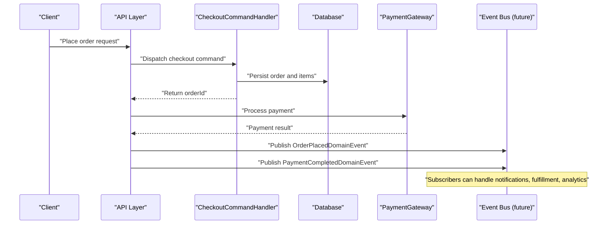

**Diagram sources**
- [CheckoutCommandHandler.cs:1-94](file://src/Ecommerce.Application/Commands/Checkout/CheckoutCommandHandler.cs#L1-L94)
- [PaymentGateway.cs:1-25](file://src/Ecommerce.Infrastructure/Payments/PaymentGateway.cs#L1-L25)
- [OrderPlacedDomainEvent.cs:1-16](file://src/Ecommerce.Domain/DomainEvents/OrderPlacedDomainEvent.cs#L1-L16)
- [PaymentCompletedDomainEvent.cs:1-18](file://src/Ecommerce.Domain/DomainEvents/PaymentCompletedDomainEvent.cs#L1-L18)

## Detailed Component Analysis

### OrderPlacedDomainEvent
- Purpose: Announces that an order has been successfully placed.
- Payload:
  - OrderId: unique identifier of the order
  - OccurredAt: timestamp when the event occurred
- Usage: Downstream consumers (notifications, analytics, fulfillment) subscribe to this event to react to new orders.

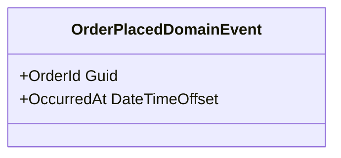

**Diagram sources**
- [OrderPlacedDomainEvent.cs:1-16](file://src/Ecommerce.Domain/DomainEvents/OrderPlacedDomainEvent.cs#L1-L16)

**Section sources**
- [OrderPlacedDomainEvent.cs:1-16](file://src/Ecommerce.Domain/DomainEvents/OrderPlacedDomainEvent.cs#L1-L16)

### PaymentCompletedDomainEvent
- Purpose: Announces that payment for an order has completed successfully.
- Payload:
  - PaymentId: unique identifier of the payment
  - OrderId: associated order identifier
  - OccurredAt: timestamp when the event occurred
- Usage: Triggers post-payment actions such as order confirmation, shipping preparation, and customer notifications.

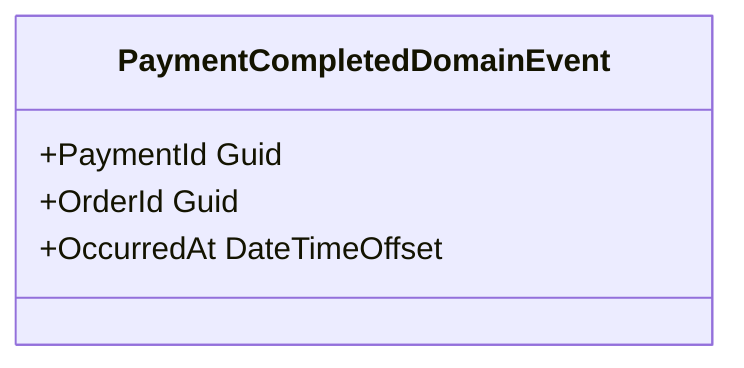

**Diagram sources**
- [PaymentCompletedDomainEvent.cs:1-18](file://src/Ecommerce.Domain/DomainEvents/PaymentCompletedDomainEvent.cs#L1-L18)

**Section sources**
- [PaymentCompletedDomainEvent.cs:1-18](file://src/Ecommerce.Domain/DomainEvents/PaymentCompletedDomainEvent.cs#L1-L18)

### Order Entity and Lifecycle
- Responsibilities:
  - Maintain order state (status, payment status, fulfillment status)
  - Manage order items and recalculate totals
  - Provide PlaceOrder method to transition into placed state
- Key behaviors:
  - AddItem and RemoveItem update totals and timestamps
  - PlaceOrder sets initial statuses and timestamps, ensuring totals are consistent

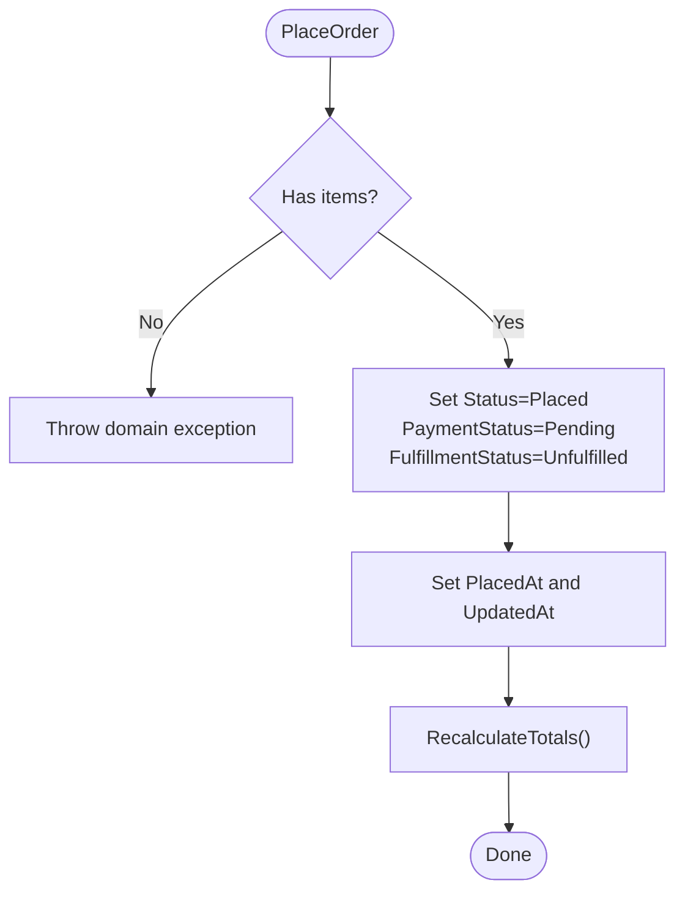

**Diagram sources**
- [Order.cs:1-105](file://src/Ecommerce.Domain/Entities/Order.cs#L1-L105)

**Section sources**
- [Order.cs:1-105](file://src/Ecommerce.Domain/Entities/Order.cs#L1-L105)

### Payment Entity
- Represents a payment transaction linked to an order.
- Tracks provider details, amounts, currency, lifecycle timestamps, and failure information.

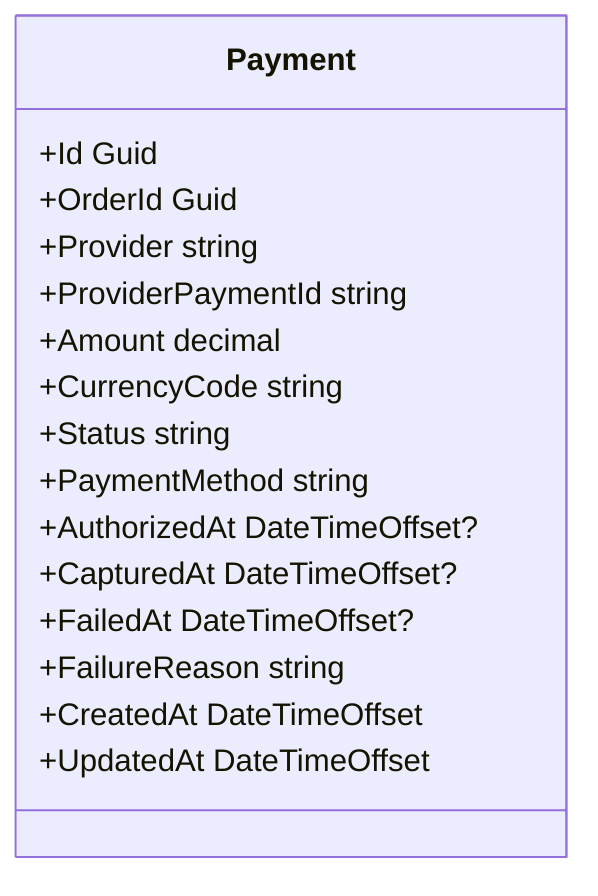

**Diagram sources**
- [Payment.cs:1-23](file://src/Ecommerce.Domain/Entities/Payment.cs#L1-L23)

**Section sources**
- [Payment.cs:1-23](file://src/Ecommerce.Domain/Entities/Payment.cs#L1-L23)

### Checkout Command Handler
- Orchestrates checkout:
  - Validates input and handles idempotency keys
  - Builds and persists the order
  - Reserves inventory for each item
  - Returns the created order ID
- Notes:
  - Uses IIdempotencyService to prevent duplicate processing
  - Persists order via IApplicationDbContext
  - Does not publish events directly; event publishing should be integrated at the boundary (API or application layer)

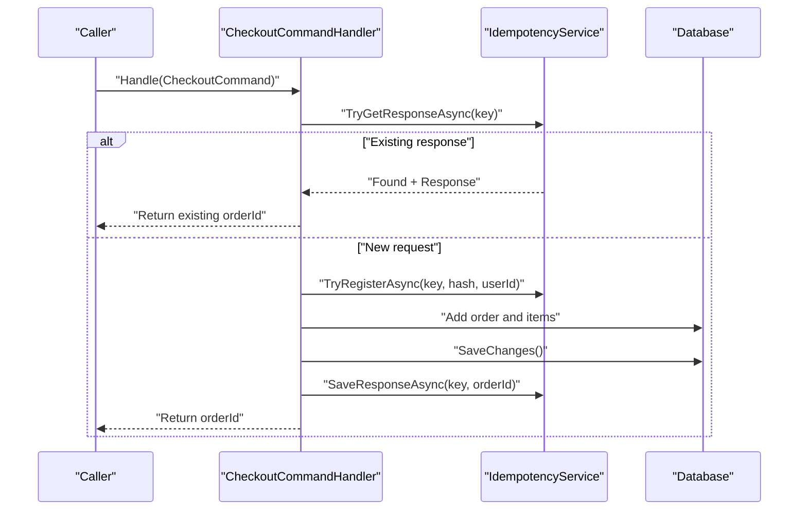

**Diagram sources**
- [CheckoutCommandHandler.cs:1-94](file://src/Ecommerce.Application/Commands/Checkout/CheckoutCommandHandler.cs#L1-L94)
- [IdempotencyService.cs:1-41](file://src/Ecommerce.Infrastructure/Services/IdempotencyService.cs#L1-L41)

**Section sources**
- [CheckoutCommandHandler.cs:1-94](file://src/Ecommerce.Application/Commands/Checkout/CheckoutCommandHandler.cs#L1-L94)
- [IdempotencyService.cs:1-41](file://src/Ecommerce.Infrastructure/Services/IdempotencyService.cs#L1-L41)

### Payment Processing Integration
- IPaymentService defines the contract for payment processing.
- PaymentGateway implements a simple stub that returns success with a generated transaction ID.
- In production, replace with a real provider (Stripe, PayPal, Adyen).

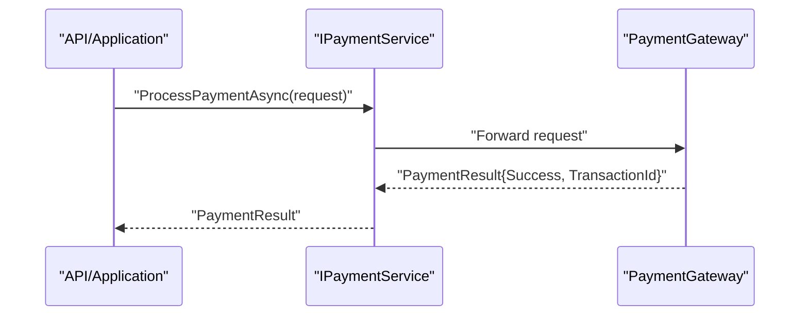

**Diagram sources**
- [IPaymentService.cs:1-25](file://src/Ecommerce.Application/Interfaces/IPaymentService.cs#L1-L25)
- [PaymentGateway.cs:1-25](file://src/Ecommerce.Infrastructure/Payments/PaymentGateway.cs#L1-L25)

**Section sources**
- [IPaymentService.cs:1-25](file://src/Ecommerce.Application/Interfaces/IPaymentService.cs#L1-L25)
- [PaymentGateway.cs:1-25](file://src/Ecommerce.Infrastructure/Payments/PaymentGateway.cs#L1-L25)

### Idempotency Service
- Ensures that repeated requests with the same key do not cause side effects.
- Supports checking for existing responses, registering new attempts, and saving final responses.

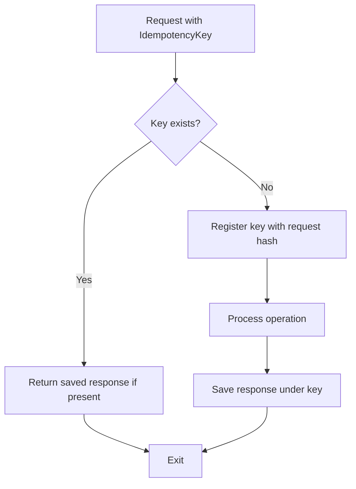

**Diagram sources**
- [IdempotencyService.cs:1-41](file://src/Ecommerce.Infrastructure/Services/IdempotencyService.cs#L1-L41)
- [IIdempotencyService.cs:1-12](file://src/Ecommerce.Application/Interfaces/IIdempotencyService.cs#L1-L12)

**Section sources**
- [IdempotencyService.cs:1-41](file://src/Ecommerce.Infrastructure/Services/IdempotencyService.cs#L1-L41)
- [IIdempotencyService.cs:1-12](file://src/Ecommerce.Application/Interfaces/IIdempotencyService.cs#L1-L12)

### Dependency Injection Wiring
- Registers DbContext, command dispatcher, behaviors, validators, payment gateway, idempotency service, and hosted services.
- Provides a central place to add event dispatchers and subscribers in future enhancements.

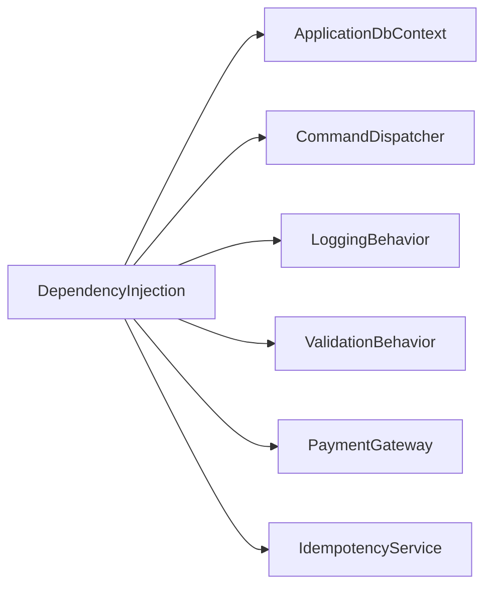

**Diagram sources**
- [DependencyInjection.cs:1-89](file://src/Ecommerce.Infrastructure/DependencyInjection.cs#L1-L89)

**Section sources**
- [DependencyInjection.cs:1-89](file://src/Ecommerce.Infrastructure/DependencyInjection.cs#L1-L89)

## Dependency Analysis
- CheckoutCommandHandler depends on:
  - IApplicationDbContext for persistence
  - IIdempotencyService for idempotent operations
  - Domain entities (Order) for business logic
- Payment flow depends on:
  - IPaymentService abstraction
  - PaymentGateway implementation
- Infrastructure registers all components via DI, enabling testability and swapping implementations.

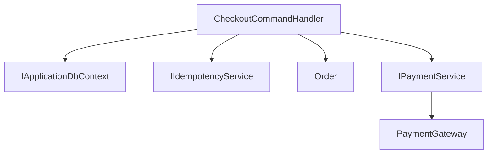

**Diagram sources**
- [CheckoutCommandHandler.cs:1-94](file://src/Ecommerce.Application/Commands/Checkout/CheckoutCommandHandler.cs#L1-L94)
- [IPaymentService.cs:1-25](file://src/Ecommerce.Application/Interfaces/IPaymentService.cs#L1-L25)
- [PaymentGateway.cs:1-25](file://src/Ecommerce.Infrastructure/Payments/PaymentGateway.cs#L1-L25)
- [IdempotencyService.cs:1-41](file://src/Ecommerce.Infrastructure/Services/IdempotencyService.cs#L1-L41)

**Section sources**
- [CheckoutCommandHandler.cs:1-94](file://src/Ecommerce.Application/Commands/Checkout/CheckoutCommandHandler.cs#L1-L94)
- [DependencyInjection.cs:1-89](file://src/Ecommerce.Infrastructure/DependencyInjection.cs#L1-L89)

## Performance Considerations
- Use idempotency keys to avoid duplicate processing during retries or network issues.
- Keep database transactions short; persist only necessary data and defer heavy work to background tasks.
- Reserve inventory within the same transaction as order creation to maintain consistency.
- For high throughput, consider asynchronous event publishing after successful persistence.
- Cache read-heavy data where appropriate and use efficient queries.

[No sources needed since this section provides general guidance]

## Troubleshooting Guide
Common issues and resolutions:
- Duplicate order creation: Ensure idempotency keys are enforced and validated before processing.
- Inventory mismatch: Verify that inventory reservations occur within the same transaction as order creation.
- Payment failures: Log provider error messages and mark payment status accordingly; expose actionable errors to clients.
- Event delivery failures: Implement retry policies with exponential backoff and move failed events to a dead letter queue for inspection.

Operational tips:
- Correlate events with order IDs and payment IDs for tracing.
- Monitor event processing latency and failure rates.
- Use structured logging and metrics around critical paths (checkout, payment, event publishing).

**Section sources**
- [CheckoutCommandHandler.cs:1-94](file://src/Ecommerce.Application/Commands/Checkout/CheckoutCommandHandler.cs#L1-L94)
- [PaymentGateway.cs:1-25](file://src/Ecommerce.Infrastructure/Payments/PaymentGateway.cs#L1-L25)

## Conclusion
The order processing pipeline leverages domain events to decouple order placement and payment completion from downstream systems. While the current codebase focuses on command handling and persistence, the defined domain events provide a clear contract for integrating with message brokers and building scalable, event-driven workflows. Adopting robust event handling patterns—ordering guarantees, retries, and dead letter queues—will ensure reliability and observability in production environments.

[No sources needed since this section summarizes without analyzing specific files]