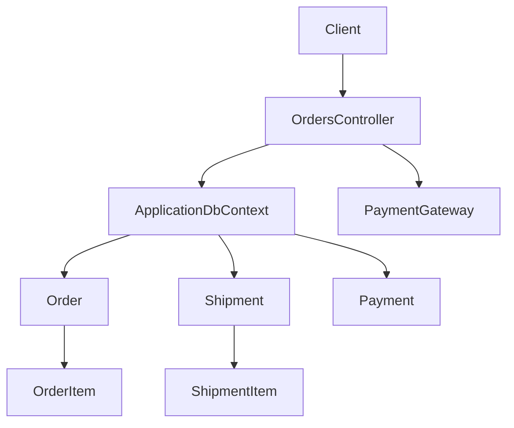
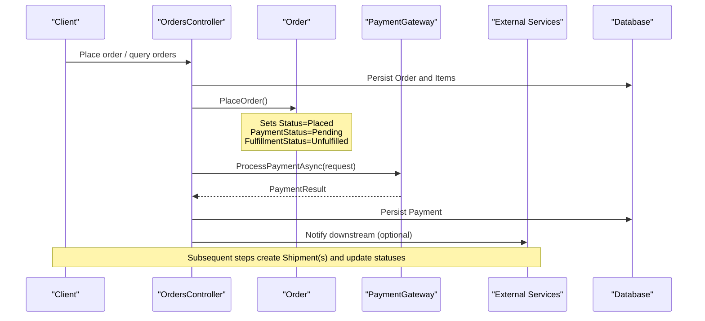
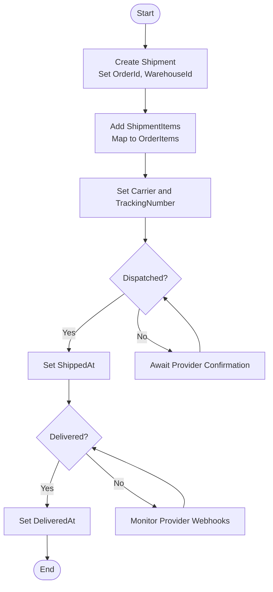
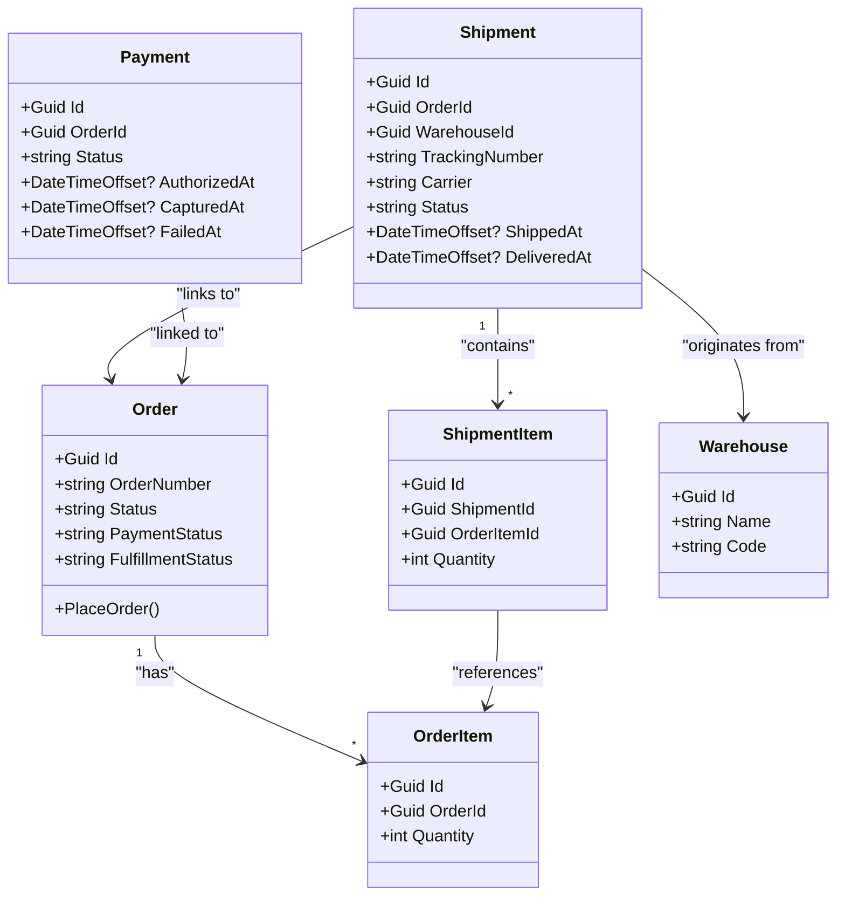

# Order Fulfillment Workflow

<cite>
**Referenced Files in This Document**
- [Order.cs](file://src/Ecommerce.Domain/Entities/Order.cs)
- [Shipment.cs](file://src/Ecommerce.Domain/Entities/Shipment.cs)
- [ShipmentItem.cs](file://src/Ecommerce.Domain/Entities/ShipmentItem.cs)
- [OrderItem.cs](file://src/Ecommerce.Domain/Entities/OrderItem.cs)
- [Payment.cs](file://src/Ecommerce.Domain/Entities/Payment.cs)
- [Warehouse.cs](file://src/Ecommerce.Domain/Entities/Warehouse.cs)
- [OrderPlacedDomainEvent.cs](file://src/Ecommerce.Domain/DomainEvents/OrderPlacedDomainEvent.cs)
- [PaymentCompletedDomainEvent.cs](file://src/Ecommerce.Domain/DomainEvents/PaymentCompletedDomainEvent.cs)
- [OrdersController.cs](file://src/Ecommerce.Api/Controllers/OrdersController.cs)
- [PaymentGateway.cs](file://src/Ecommerce.Infrastructure/Payments/PaymentGateway.cs)
</cite>

## Table of Contents
1. Introduction
2. Project Structure
3. Core Components
4. Architecture Overview
5. Detailed Component Analysis
6. Dependency Analysis
7. Performance Considerations
8. Troubleshooting Guide
9. Conclusion

## Introduction
This document explains the order fulfillment workflow with a focus on status management from Unfulfilled to Shipped to Completed, the relationship between orders and shipments, payment synchronization, integration points with external shipping services, and notification triggers. It also covers partial fulfillment, backorder handling, exceptions, and delivery confirmation processes using the entities and domain events present in the codebase.

## Project Structure
The fulfillment workflow spans Domain entities (Order, Shipment, Payment), API controllers for querying orders, and infrastructure for payments. The following diagram shows how these pieces interact at a high level:

**Diagram sources**
- [OrdersController.cs:13-50](file://src/Ecommerce.Api/Controllers/OrdersController.cs#L13-L50)
- [Order.cs:8-34](file://src/Ecommerce.Domain/Entities/Order.cs#L8-L34)
- [Shipment.cs:6-18](file://src/Ecommerce.Domain/Entities/Shipment.cs#L6-L18)
- [Payment.cs:5-20](file://src/Ecommerce.Domain/Entities/Payment.cs#L5-L20)
- [OrderItem.cs:5-20](file://src/Ecommerce.Domain/Entities/OrderItem.cs#L5-L20)
- [ShipmentItem.cs:5-12](file://src/Ecommerce.Domain/Entities/ShipmentItem.cs#L5-L12)
- [PaymentGateway.cs:7-22](file://src/Ecommerce.Infrastructure/Payments/PaymentGateway.cs#L7-L22)

**Section sources**
- [OrdersController.cs:13-50](file://src/Ecommerce.Api/Controllers/OrdersController.cs#L13-L50)
- [Order.cs:8-34](file://src/Ecommerce.Domain/Entities/Order.cs#L8-L34)
- [Shipment.cs:6-18](file://src/Ecommerce.Domain/Entities/Shipment.cs#L6-L18)
- [Payment.cs:5-20](file://src/Ecommerce.Domain/Entities/Payment.cs#L5-L20)
- [OrderItem.cs:5-20](file://src/Ecommerce.Domain/Entities/OrderItem.cs#L5-L20)
- [ShipmentItem.cs:5-12](file://src/Ecommerce.Domain/Entities/ShipmentItem.cs#L5-L12)
- [PaymentGateway.cs:7-22](file://src/Ecommerce.Infrastructure/Payments/PaymentGateway.cs#L7-L22)

## Core Components
- Order: Holds order metadata, totals, and fulfillment-related statuses including FulfillmentStatus and PaymentStatus. Placing an order initializes statuses such as Unfulfilled and Pending.
- Shipment: Represents a physical shipment linked to an Order, with tracking number, carrier, and lifecycle timestamps (ShippedAt, DeliveredAt).
- ShipmentItem: Links shipped quantities to specific OrderItems and Inventory items.
- OrderItem: Captures product details, pricing, and quantity for each line item in an order.
- Payment: Records payment provider details, amounts, currency, and lifecycle timestamps (AuthorizedAt, CapturedAt, FailedAt).
- Warehouse: Identifies the origin warehouse for shipments.
- Domain Events: OrderPlacedDomainEvent and PaymentCompletedDomainEvent signal key milestones that can drive downstream processing (e.g., notifications or fulfillment orchestration).

Key responsibilities:
- Order manages its own totals and initial state when placed.
- Shipment models outbound logistics and tracking.
- Payment tracks financial lifecycle and integrates via a gateway stub.
- Domain events provide decoupled signals for other subsystems.

**Section sources**
- [Order.cs:8-34](file://src/Ecommerce.Domain/Entities/Order.cs#L8-L34)
- [Order.cs:79-102](file://src/Ecommerce.Domain/Entities/Order.cs#L79-L102)
- [Shipment.cs:6-18](file://src/Ecommerce.Domain/Entities/Shipment.cs#L6-L18)
- [ShipmentItem.cs:5-12](file://src/Ecommerce.Domain/Entities/ShipmentItem.cs#L5-L12)
- [OrderItem.cs:5-20](file://src/Ecommerce.Domain/Entities/OrderItem.cs#L5-L20)
- [Payment.cs:5-20](file://src/Ecommerce.Domain/Entities/Payment.cs#L5-L20)
- [Warehouse.cs:5-12](file://src/Ecommerce.Domain/Entities/Warehouse.cs#L5-L12)
- [OrderPlacedDomainEvent.cs:5-14](file://src/Ecommerce.Domain/DomainEvents/OrderPlacedDomainEvent.cs#L5-L14)
- [PaymentCompletedDomainEvent.cs:5-16](file://src/Ecommerce.Domain/DomainEvents/PaymentCompletedDomainEvent.cs#L5-L16)

## Architecture Overview
The fulfillment architecture is event-driven and entity-centric:
- Orders are created and placed, establishing initial fulfillment and payment states.
- Payments are processed through a gateway; completion emits a domain event.
- Shipments are created against orders, linking items and inventory, and carry tracking and lifecycle timestamps.
- Domain events enable decoupled reactions (e.g., notifications, fulfillment orchestration).

**Diagram sources**
- [OrdersController.cs:13-50](file://src/Ecommerce.Api/Controllers/OrdersController.cs#L13-L50)
- [Order.cs:89-102](file://src/Ecommerce.Domain/Entities/Order.cs#L89-L102)
- [PaymentGateway.cs:7-22](file://src/Ecommerce.Infrastructure/Payments/PaymentGateway.cs#L7-L22)

## Detailed Component Analysis

### Order Fulfillment Status Management
- Initial placement sets FulfillmentStatus to Unfulfilled and PaymentStatus to Pending.
- Typical progression:
  - Unfulfilled: No shipments created yet.
  - Partially Fulfilled: One or more ShipmentItems exist but not all OrderItem quantities are shipped.
  - Shipped: At least one shipment marked as shipped; tracking available.
  - Completed: All items delivered; typically reflected by delivery confirmation and finalizing order state.

Operational notes:
- Order maintains totals and timestamps; placing an order ensures consistent initial state.
- Fulfillment updates should be coordinated with shipment creation and payment capture.

**Section sources**
- [Order.cs:89-102](file://src/Ecommerce.Domain/Entities/Order.cs#L89-L102)

### Shipment Creation and Tracking
- A Shipment links to an Order and a Warehouse, and contains ShipmentItems that map to OrderItems and Inventory items.
- Tracking fields include Carrier and TrackingNumber; lifecycle includes ShippedAt and DeliveredAt.
- Partial fulfillment is supported by creating multiple ShipmentItems across one or more Shipment records.

Workflow outline:
- Create Shipment with OrderId and WarehouseId.
- Add ShipmentItem entries for each portion of OrderItem quantities being shipped.
- Set Carrier and TrackingNumber when known.
- Mark ShippedAt when dispatched; set DeliveredAt upon delivery confirmation.

**Section sources**
- [Shipment.cs:6-18](file://src/Ecommerce.Domain/Entities/Shipment.cs#L6-L18)
- [ShipmentItem.cs:5-12](file://src/Ecommerce.Domain/Entities/ShipmentItem.cs#L5-L12)
- [OrderItem.cs:5-20](file://src/Ecommerce.Domain/Entities/OrderItem.cs#L5-L20)
- [Warehouse.cs:5-12](file://src/Ecommerce.Domain/Entities/Warehouse.cs#L5-L12)

### Payment Status Synchronization
- Payment entity captures provider details, amount, currency, and lifecycle timestamps (AuthorizedAt, CapturedAt, FailedAt).
- A payment gateway stub demonstrates integration points for processing payments and returning results.
- Payment completion emits a domain event that can trigger downstream actions (e.g., moving toward fulfillment).

Synchronization guidelines:
- On successful capture, record CapturedAt and update related order/payment status.
- Emit PaymentCompletedDomainEvent to notify other components.
- Ensure idempotency when reconciling payment outcomes with fulfillment steps.

**Section sources**
- [Payment.cs:5-20](file://src/Ecommerce.Domain/Entities/Payment.cs#L5-L20)
- [PaymentGateway.cs:7-22](file://src/Ecommerce.Infrastructure/Payments/PaymentGateway.cs#L7-L22)
- [PaymentCompletedDomainEvent.cs:5-16](file://src/Ecommerce.Domain/DomainEvents/PaymentCompletedDomainEvent.cs#L5-L16)

### Integration Points with External Shipping Services
- Shipment carries Carrier and TrackingNumber, which are populated from external shipping providers.
- When integrating with a real service:
  - Create shipment via provider API and persist Carrier/TrackingNumber.
  - Update ShippedAt when the provider confirms dispatch.
  - Poll or receive webhooks for delivery confirmation and set DeliveredAt accordingly.
- Use Warehouse to route shipments to correct origin locations.

**Section sources**
- [Shipment.cs:6-18](file://src/Ecommerce.Domain/Entities/Shipment.cs#L6-L18)
- [Warehouse.cs:5-12](file://src/Ecommerce.Domain/Entities/Warehouse.cs#L5-L12)

### Notification System Integration
- Domain events serve as natural hooks for notifications:
  - OrderPlacedDomainEvent: Trigger order confirmation emails/SMS.
  - PaymentCompletedDomainEvent: Trigger payment receipts and initiate fulfillment workflows.
- Implement subscribers to these events to send notifications without tight coupling to core logic.

**Section sources**
- [OrderPlacedDomainEvent.cs:5-14](file://src/Ecommerce.Domain/DomainEvents/OrderPlacedDomainEvent.cs#L5-L14)
- [PaymentCompletedDomainEvent.cs:5-16](file://src/Ecommerce.Domain/DomainEvents/PaymentCompletedDomainEvent.cs#L5-L16)

### Examples and Workflows

#### Fulfillment Status Updates
- Start: Order placed → FulfillmentStatus = Unfulfilled, PaymentStatus = Pending.
- After payment capture: PaymentStatus updated; proceed to create shipment(s).
- After first shipment dispatched: FulfillmentStatus moves toward Shipped; track via Shipment.Status and timestamps.
- After all items delivered: FulfillmentStatus becomes Completed; mark DeliveredAt on relevant shipments.

**Section sources**
- [Order.cs:89-102](file://src/Ecommerce.Domain/Entities/Order.cs#L89-L102)
- [Shipment.cs:6-18](file://src/Ecommerce.Domain/Entities/Shipment.cs#L6-L18)

#### Shipment Creation Workflow
- Create Shipment with OrderId and WarehouseId.
- Add ShipmentItem entries mapping to OrderItem quantities.
- Assign Carrier and TrackingNumber from shipping provider.
- Update ShippedAt when dispatched; set DeliveredAt upon delivery confirmation.

**Diagram sources**
- [Shipment.cs:6-18](file://src/Ecommerce.Domain/Entities/Shipment.cs#L6-L18)
- [ShipmentItem.cs:5-12](file://src/Ecommerce.Domain/Entities/ShipmentItem.cs#L5-L12)
- [OrderItem.cs:5-20](file://src/Ecommerce.Domain/Entities/OrderItem.cs#L5-L20)

#### Delivery Confirmation Process
- Receive delivery confirmation from shipping provider (webhook or polling).
- Update Shipment.DeliveredAt and adjust order-level completion if all items are delivered.
- Emit relevant domain events to trigger notifications and close fulfillment loops.

**Section sources**
- [Shipment.cs:6-18](file://src/Ecommerce.Domain/Entities/Shipment.cs#L6-L18)

### Partial Fulfillment Scenarios
- Create multiple ShipmentItems to ship portions of an OrderItem’s quantity.
- Track per-shipment quantities and remaining unshipped quantities at the OrderItem level.
- Update fulfillment status to reflect partially fulfilled until all items are shipped.

**Section sources**
- [ShipmentItem.cs:5-12](file://src/Ecommerce.Domain/Entities/ShipmentItem.cs#L5-L12)
- [OrderItem.cs:5-20](file://src/Ecommerce.Domain/Entities/OrderItem.cs#L5-L20)

### Backorder Handling
- If inventory is insufficient, delay creating ShipmentItems until stock arrives.
- Maintain OrderItem quantities and monitor inventory changes before proceeding to fulfill.
- Once available, create ShipmentItems and continue the standard fulfillment flow.

[No sources needed since this section provides general guidance]

### Fulfillment Exceptions
- Handle failures during payment processing and shipping integrations.
- Record failure reasons and timestamps on Payment (FailedAt, FailureReason).
- Provide retry mechanisms and alerting for failed operations.

**Section sources**
- [Payment.cs:5-20](file://src/Ecommerce.Domain/Entities/Payment.cs#L5-L20)

## Dependency Analysis
The following diagram highlights dependencies among core components involved in fulfillment:

**Diagram sources**
- [Order.cs:8-34](file://src/Ecommerce.Domain/Entities/Order.cs#L8-L34)
- [OrderItem.cs:5-20](file://src/Ecommerce.Domain/Entities/OrderItem.cs#L5-L20)
- [Shipment.cs:6-18](file://src/Ecommerce.Domain/Entities/Shipment.cs#L6-L18)
- [ShipmentItem.cs:5-12](file://src/Ecommerce.Domain/Entities/ShipmentItem.cs#L5-L12)
- [Payment.cs:5-20](file://src/Ecommerce.Domain/Entities/Payment.cs#L5-L20)
- [Warehouse.cs:5-12](file://src/Ecommerce.Domain/Entities/Warehouse.cs#L5-L12)

**Section sources**
- [Order.cs:8-34](file://src/Ecommerce.Domain/Entities/Order.cs#L8-L34)
- [Shipment.cs:6-18](file://src/Ecommerce.Domain/Entities/Shipment.cs#L6-L18)
- [Payment.cs:5-20](file://src/Ecommerce.Domain/Entities/Payment.cs#L5-L20)

## Performance Considerations
- Batch shipment item creation to reduce database round-trips.
- Use optimistic concurrency where applicable to avoid conflicts during status updates.
- Cache frequently accessed order summaries for read-heavy endpoints.
- Offload heavy integrations (shipping APIs) to background jobs to keep request latency low.

[No sources needed since this section provides general guidance]

## Troubleshooting Guide
Common issues and resolutions:
- Payment failures: Inspect Payment.FailedAt and FailureReason; implement retries and user-facing error messages.
- Missing tracking numbers: Validate Carrier and TrackingNumber before marking shipments as shipped.
- Inconsistent fulfillment status: Reconcile ShipmentItems against OrderItem quantities to ensure accurate partial/full fulfillment reporting.
- Delivery discrepancies: Cross-check DeliveredAt with provider confirmations and update order completion accordingly.

**Section sources**
- [Payment.cs:5-20](file://src/Ecommerce.Domain/Entities/Payment.cs#L5-L20)
- [Shipment.cs:6-18](file://src/Ecommerce.Domain/Entities/Shipment.cs#L6-L18)
- [OrderItem.cs:5-20](file://src/Ecommerce.Domain/Entities/OrderItem.cs#L5-L20)

## Conclusion
The fulfillment workflow leverages clear domain entities and events to manage order states, payments, and shipments. By coordinating Order, Shipment, Payment, and domain events, the system supports full and partial fulfillments, backorders, exceptions, and delivery confirmations while enabling scalable integrations with external shipping services and robust notification flows.