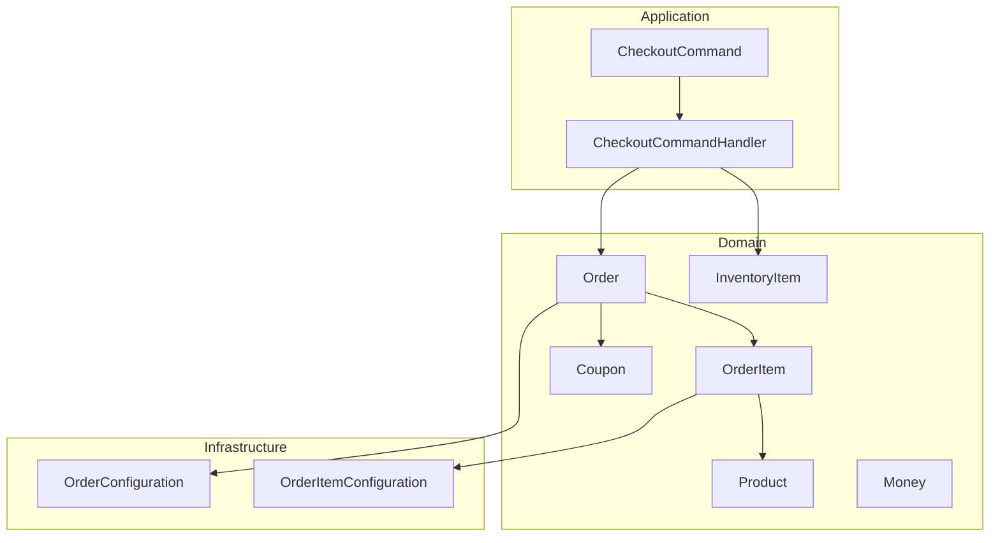
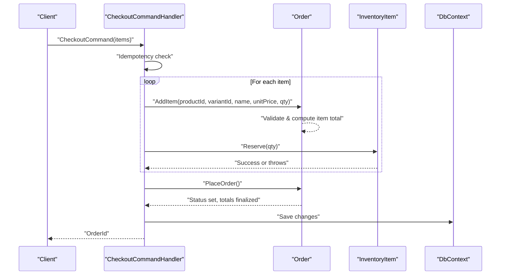
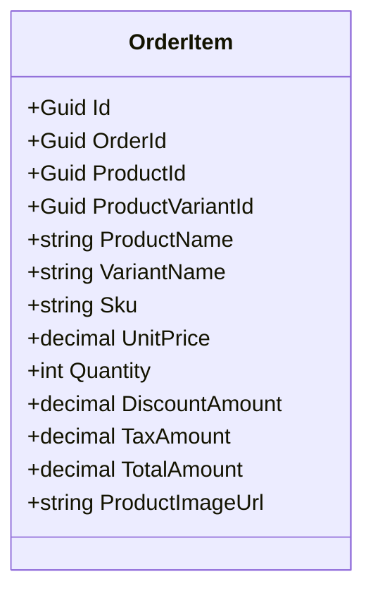
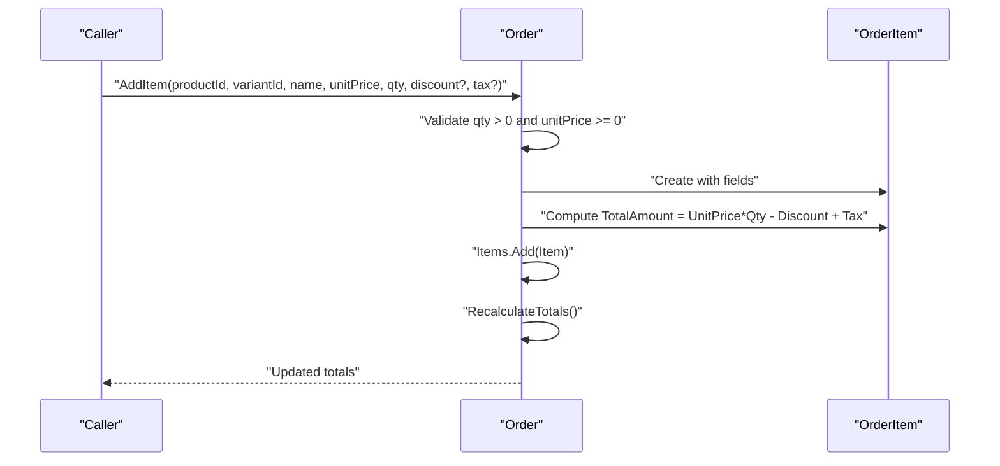
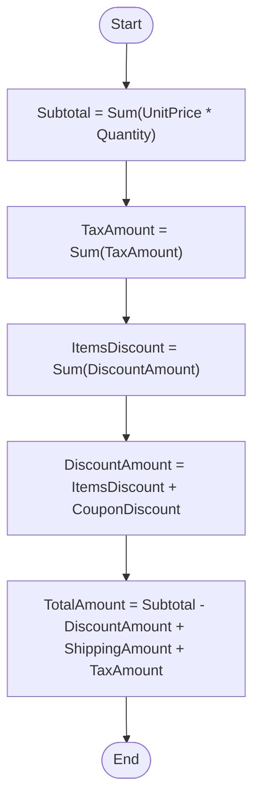
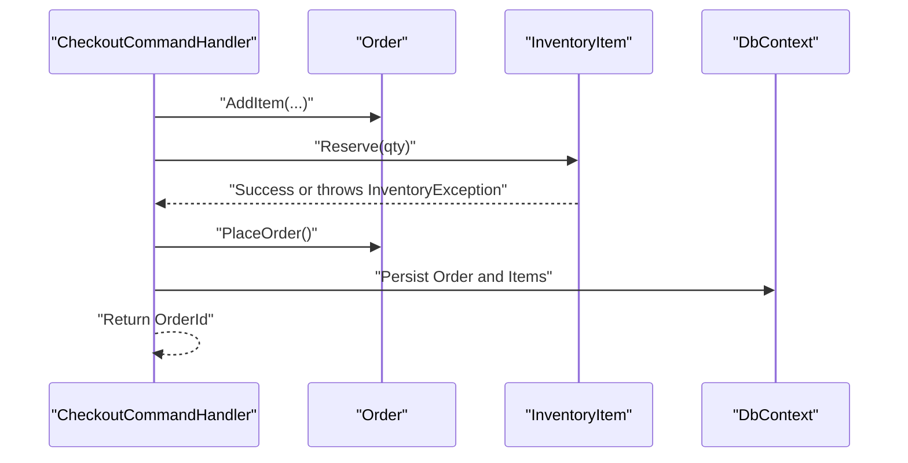
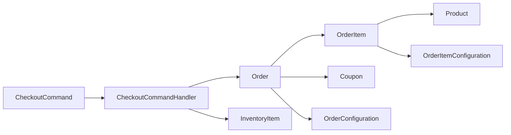

# Order Items and Pricing

<cite>
**Referenced Files in This Document**
- [OrderItem.cs](file://src/Ecommerce.Domain/Entities/OrderItem.cs)
- [Order.cs](file://src/Ecommerce.Domain/Entities/Order.cs)
- [Product.cs](file://src/Ecommerce.Domain/Entities/Product.cs)
- [Coupon.cs](file://src/Ecommerce.Domain/Entities/Coupon.cs)
- [Money.cs](file://src/Ecommerce.Domain/ValueObjects/Money.cs)
- [InventoryItem.cs](file://src/Ecommerce.Domain/Entities/InventoryItem.cs)
- [DomainException.cs](file://src/Ecommerce.Domain/Exceptions/DomainException.cs)
- [InventoryException.cs](file://src/Ecommerce.Domain/Exceptions/InventoryException.cs)
- [CheckoutCommand.cs](file://src/Ecommerce.Application/Commands/Checkout/CheckoutCommand.cs)
- [CheckoutCommandHandler.cs](file://src/Ecommerce.Application/Commands/Checkout/CheckoutCommandHandler.cs)
- [OrderConfiguration.cs](file://src/Ecommerce.Infrastructure/Persistence/Configurations/OrderConfiguration.cs)
- [OrderItemConfiguration.cs](file://src/Ecommerce.Infrastructure/Persistence/Configurations/OrderItemConfiguration.cs)
- [OrderTests.cs](file://tests/Ecommerce.Domain.Tests/OrderTests.cs)
</cite>

## Table of Contents
1. Introduction
2. Project Structure
3. Core Components
4. Architecture Overview
5. Detailed Component Analysis
6. Dependency Analysis
7. Performance Considerations
8. Troubleshooting Guide
9. Conclusion

## Introduction
This document explains how order items are modeled, validated, and priced within the system. It focuses on the OrderItem entity structure, the AddItem and RemoveItem operations, total recalculation logic, pricing components (unit price, discounts, tax, totals), coupon application, and inventory reservation during checkout. It also provides examples of item operations, pricing scenarios, bulk processing patterns, and stock validation rules.

## Project Structure
The relevant code spans Domain entities for business rules, Application commands for orchestration, and Infrastructure configurations for persistence. The key pieces are:
- Domain entities: Order, OrderItem, Product, Coupon, InventoryItem, Money
- Application command: CheckoutCommand and its handler
- Persistence configuration: EF Core mappings for Orders and OrderItems
- Tests: Validation of order behavior

**Diagram sources**
- [Order.cs:36-87](file://src/Ecommerce.Domain/Entities/Order.cs#L36-L87)
- [OrderItem.cs:5-20](file://src/Ecommerce.Domain/Entities/OrderItem.cs#L5-L20)
- [Product.cs:6-41](file://src/Ecommerce.Domain/Entities/Product.cs#L6-L41)
- [Coupon.cs:5-20](file://src/Ecommerce.Domain/Entities/Coupon.cs#L5-L20)
- [InventoryItem.cs:6-67](file://src/Ecommerce.Domain/Entities/InventoryItem.cs#L6-L67)
- [Money.cs:5-18](file://src/Ecommerce.Domain/ValueObjects/Money.cs#L5-L18)
- [CheckoutCommand.cs:6-20](file://src/Ecommerce.Application/Commands/Checkout/CheckoutCommand.cs#L6-L20)
- [CheckoutCommandHandler.cs:22-90](file://src/Ecommerce.Application/Commands/Checkout/CheckoutCommandHandler.cs#L22-L90)
- [OrderConfiguration.cs:7-44](file://src/Ecommerce.Infrastructure/Persistence/Configurations/OrderConfiguration.cs#L7-L44)
- [OrderItemConfiguration.cs:7-26](file://src/Ecommerce.Infrastructure/Persistence/Configurations/OrderItemConfiguration.cs#L7-L26)

**Section sources**
- [Order.cs:36-87](file://src/Ecommerce.Domain/Entities/Order.cs#L36-L87)
- [OrderItem.cs:5-20](file://src/Ecommerce.Domain/Entities/OrderItem.cs#L5-L20)
- [CheckoutCommandHandler.cs:22-90](file://src/Ecommerce.Application/Commands/Checkout/CheckoutCommandHandler.cs#L22-L90)
- [OrderConfiguration.cs:7-44](file://src/Ecommerce.Infrastructure/Persistence/Configurations/OrderConfiguration.cs#L7-L44)
- [OrderItemConfiguration.cs:7-26](file://src/Ecommerce.Infrastructure/Persistence/Configurations/OrderItemConfiguration.cs#L7-L26)

## Core Components
- OrderItem: Represents a line item with product references, pricing fields, quantity, and computed total.
- Order: Aggregates items, enforces business rules, applies coupons, and recalculates totals.
- InventoryItem: Manages stock levels and reservations to validate availability at checkout.
- Money: Value object representing monetary amounts with currency codes.
- Product and Coupon: Reference models used by orders and promotions.

Key responsibilities:
- OrderItem stores per-item pricing and quantities.
- Order validates inputs, manages items, applies coupons, and computes Subtotal, TaxAmount, DiscountAmount, ShippingAmount, and TotalAmount.
- InventoryItem ensures sufficient stock before reserving quantities during checkout.

**Section sources**
- [OrderItem.cs:5-20](file://src/Ecommerce.Domain/Entities/OrderItem.cs#L5-L20)
- [Order.cs:36-87](file://src/Ecommerce.Domain/Entities/Order.cs#L36-L87)
- [InventoryItem.cs:20-67](file://src/Ecommerce.Domain/Entities/InventoryItem.cs#L20-L67)
- [Money.cs:5-18](file://src/Ecommerce.Domain/ValueObjects/Money.cs#L5-L18)
- [Product.cs:6-41](file://src/Ecommerce.Domain/Entities/Product.cs#L6-L41)
- [Coupon.cs:5-20](file://src/Ecommerce.Domain/Entities/Coupon.cs#L5-L20)

## Architecture Overview
The checkout flow builds an Order from a list of items, reserves inventory for each item, and persists the order. During this process, OrderItem records are created and totals are recalculated.

**Diagram sources**
- [CheckoutCommandHandler.cs:22-90](file://src/Ecommerce.Application/Commands/Checkout/CheckoutCommandHandler.cs#L22-L90)
- [Order.cs:36-102](file://src/Ecommerce.Domain/Entities/Order.cs#L36-L102)
- [InventoryItem.cs:29-40](file://src/Ecommerce.Domain/Entities/InventoryItem.cs#L29-L40)

## Detailed Component Analysis

### OrderItem Entity
- Purpose: Captures a single line item in an order with product identity and pricing snapshot.
- Key fields:
  - Product references: ProductId, ProductVariantId
  - Descriptive fields: ProductName, VariantName, Sku, ProductImageUrl
  - Pricing fields: UnitPrice, DiscountAmount, TaxAmount, TotalAmount
  - Quantity: Quantity
- Behavior:
  - TotalAmount is computed when added to an order using unit price, quantity, discount, and tax.

Validation and constraints:
- Validated via Order.AddItem input checks; OrderItem itself does not enforce domain rules beyond being a data holder.

Persistence:
- EF Core mapping defines decimal precision for monetary fields and indexes for query performance.

**Section sources**
- [OrderItem.cs:5-20](file://src/Ecommerce.Domain/Entities/OrderItem.cs#L5-L20)
- [OrderItemConfiguration.cs:7-26](file://src/Ecommerce.Infrastructure/Persistence/Configurations/OrderItemConfiguration.cs#L7-L26)

#### Class Diagram: OrderItem

**Diagram sources**
- [OrderItem.cs:5-20](file://src/Ecommerce.Domain/Entities/OrderItem.cs#L5-L20)

### Order Entity: AddItem, RemoveItem, ApplyCoupon, RecalculateTotals
- AddItem:
  - Validates quantity > 0 and unit price >= 0.
  - Creates OrderItem with provided values.
  - Computes item TotalAmount = UnitPrice * Quantity - DiscountAmount + TaxAmount.
  - Adds item to collection and recalculates order totals.
- RemoveItem:
  - Finds item by Id; throws if not found.
  - Removes item and recalculates totals.
- ApplyCoupon:
  - Stores coupon code and discount amount.
  - Recalculates totals including coupon discount.
- RecalculateTotals:
  - Subtotal = sum(UnitPrice * Quantity) across items.
  - TaxAmount = sum(TaxAmount) across items.
  - DiscountAmount = sum(item DiscountAmount) + coupon DiscountAmount.
  - TotalAmount = Subtotal - DiscountAmount + ShippingAmount + TaxAmount.
- PlaceOrder:
  - Ensures order has at least one item.
  - Sets statuses and timestamps.
  - Finalizes totals.

Examples and tests:
- Tests verify that adding items updates Subtotal and TotalAmount, and placing an empty order throws.

**Section sources**
- [Order.cs:36-102](file://src/Ecommerce.Domain/Entities/Order.cs#L36-L102)
- [OrderTests.cs:10-39](file://tests/Ecommerce.Domain.Tests/OrderTests.cs#L10-L39)

#### Sequence Diagram: AddItem and RecalculateTotals

**Diagram sources**
- [Order.cs:36-59](file://src/Ecommerce.Domain/Entities/Order.cs#L36-L59)
- [Order.cs:79-87](file://src/Ecommerce.Domain/Entities/Order.cs#L79-L87)

#### Flowchart: RecalculateTotals Logic

**Diagram sources**
- [Order.cs:79-87](file://src/Ecommerce.Domain/Entities/Order.cs#L79-L87)

### Pricing Components
- Unit Price: Per-unit cost captured at time of add; stored in OrderItem.UnitPrice.
- Discount Amount:
  - Per-item discount via OrderItem.DiscountAmount.
  - Order-level discount via Order.ApplyCoupon sets Order.DiscountAmount.
  - RecalculateTotals aggregates both into Order.DiscountAmount.
- Tax Amount:
  - Per-item tax via OrderItem.TaxAmount.
  - Aggregated into Order.TaxAmount.
- Total Computation:
  - Order.TotalAmount = Subtotal - DiscountAmount + ShippingAmount + TaxAmount.
  - Each OrderItem.TotalAmount reflects item-level math.

Notes:
- CurrencyCode is maintained at Order level; Money value object exists for consistent monetary representation elsewhere.

**Section sources**
- [Order.cs:79-87](file://src/Ecommerce.Domain/Entities/Order.cs#L79-L87)
- [OrderItem.cs:14-18](file://src/Ecommerce.Domain/Entities/OrderItem.cs#L14-L18)
- [Money.cs:5-18](file://src/Ecommerce.Domain/ValueObjects/Money.cs#L5-L18)

### Coupon Application
- ApplyCoupon sets Order.CouponCode and Order.DiscountAmount, then recalculates totals.
- The final order discount includes both item-level discounts and the coupon discount.

Usage pattern:
- After adding items, call ApplyCoupon with the desired discount amount to update totals consistently.

**Section sources**
- [Order.cs:71-77](file://src/Ecommerce.Domain/Entities/Order.cs#L71-L77)
- [Order.cs:79-87](file://src/Ecommerce.Domain/Entities/Order.cs#L79-L87)

### Inventory Reservation and Stock Validation
- During checkout, for each item:
  - Find InventoryItem by ProductVariantId or fallback to ProductId.
  - Call Reserve(quantity) to reserve stock.
  - If insufficient stock and backorders are disallowed, an exception is thrown.
- InventoryItem.Reserve:
  - Validates positive quantity.
  - Checks Available = QuantityOnHand - QuantityReserved against requested quantity unless AllowBackorder is true.
  - Increments QuantityReserved and updates timestamp.

Integration points:
- CheckoutCommandHandler orchestrates inventory reservation alongside order creation.

**Section sources**
- [CheckoutCommandHandler.cs:56-75](file://src/Ecommerce.Application/Commands/Checkout/CheckoutCommandHandler.cs#L56-L75)
- [InventoryItem.cs:20-40](file://src/Ecommerce.Domain/Entities/InventoryItem.cs#L20-L40)
- [InventoryException.cs:5-8](file://src/Ecommerce.Domain/Exceptions/InventoryException.cs#L5-L8)

#### Sequence Diagram: Checkout with Inventory Reservation

**Diagram sources**
- [CheckoutCommandHandler.cs:56-90](file://src/Ecommerce.Application/Commands/Checkout/CheckoutCommandHandler.cs#L56-L90)
- [Order.cs:89-102](file://src/Ecommerce.Domain/Entities/Order.cs#L89-L102)
- [InventoryItem.cs:29-40](file://src/Ecommerce.Domain/Entities/InventoryItem.cs#L29-L40)

### Examples and Scenarios

- Single item addition:
  - Add an item with unit price and quantity; Subtotal and TotalAmount reflect the item’s contribution.
  - See test verifying Subtotal and TotalAmount after AddItem.

- Removing an item:
  - RemoveItem deletes the item and recalculates totals accordingly.

- Applying a coupon:
  - ApplyCoupon sets order-level discount and updates totals.

- Bulk order processing:
  - Iterate over multiple items in CheckoutCommand.Items, calling AddItem and Reserve for each, then PlaceOrder once.

- Pricing scenario:
  - With multiple items having different unit prices, discounts, and taxes, RecalculateTotals aggregates them correctly into Subtotal, TaxAmount, DiscountAmount, and TotalAmount.

- Stock validation:
  - Reserve enforces available stock unless backorders are allowed; otherwise throws an inventory exception.

**Section sources**
- [OrderTests.cs:10-39](file://tests/Ecommerce.Domain.Tests/OrderTests.cs#L10-L39)
- [Order.cs:36-87](file://src/Ecommerce.Domain/Entities/Order.cs#L36-L87)
- [CheckoutCommandHandler.cs:56-90](file://src/Ecommerce.Application/Commands/Checkout/CheckoutCommandHandler.cs#L56-L90)
- [InventoryItem.cs:29-40](file://src/Ecommerce.Domain/Entities/InventoryItem.cs#L29-L40)

## Dependency Analysis
- Order depends on OrderItem for line items and uses Product and Coupon references conceptually.
- CheckoutCommandHandler depends on Order and InventoryItem to build and validate orders.
- Persistence layer configures Orders and OrderItems with appropriate types and relationships.

**Diagram sources**
- [CheckoutCommand.cs:6-20](file://src/Ecommerce.Application/Commands/Checkout/CheckoutCommand.cs#L6-L20)
- [CheckoutCommandHandler.cs:22-90](file://src/Ecommerce.Application/Commands/Checkout/CheckoutCommandHandler.cs#L22-L90)
- [Order.cs:36-102](file://src/Ecommerce.Domain/Entities/Order.cs#L36-L102)
- [OrderItem.cs:5-20](file://src/Ecommerce.Domain/Entities/OrderItem.cs#L5-L20)
- [Product.cs:6-41](file://src/Ecommerce.Domain/Entities/Product.cs#L6-L41)
- [Coupon.cs:5-20](file://src/Ecommerce.Domain/Entities/Coupon.cs#L5-L20)
- [OrderConfiguration.cs:7-44](file://src/Ecommerce.Infrastructure/Persistence/Configurations/OrderConfiguration.cs#L7-L44)
- [OrderItemConfiguration.cs:7-26](file://src/Ecommerce.Infrastructure/Persistence/Configurations/OrderItemConfiguration.cs#L7-L26)

**Section sources**
- [CheckoutCommandHandler.cs:22-90](file://src/Ecommerce.Application/Commands/Checkout/CheckoutCommandHandler.cs#L22-L90)
- [OrderConfiguration.cs:7-44](file://src/Ecommerce.Infrastructure/Persistence/Configurations/OrderConfiguration.cs#L7-L44)
- [OrderItemConfiguration.cs:7-26](file://src/Ecommerce.Infrastructure/Persistence/Configurations/OrderItemConfiguration.cs#L7-L26)

## Performance Considerations
- Use efficient queries to locate InventoryItem by ProductVariantId first, then fallback to ProductId to minimize lookups.
- Batch operations:
  - Add multiple items to Order before placing to reduce repeated recalculations.
- Indexing:
  - OrderItem.OrderId is indexed to speed up order retrieval and item listing.
- Decimal precision:
  - Monetary fields use decimal(18,2) to ensure accurate financial calculations.

[No sources needed since this section provides general guidance]

## Troubleshooting Guide
Common issues and resolutions:
- Invalid quantity or negative unit price:
  - AddItem throws a domain exception; ensure inputs are valid before calling.
- Empty order placement:
  - PlaceOrder requires at least one item; add items before placing.
- Missing order item removal:
  - RemoveItem throws if the item Id is not found; verify Ids exist in the order.
- Insufficient stock:
  - Reserve throws an inventory exception when stock is insufficient and backorders are disallowed; adjust stock or allow backorders.
- Idempotency conflicts:
  - If idempotency key registration fails, retry or handle concurrent requests appropriately.

**Section sources**
- [Order.cs:36-39](file://src/Ecommerce.Domain/Entities/Order.cs#L36-L39)
- [Order.cs:61-69](file://src/Ecommerce.Domain/Entities/Order.cs#L61-L69)
- [Order.cs:89-91](file://src/Ecommerce.Domain/Entities/Order.cs#L89-L91)
- [InventoryItem.cs:29-36](file://src/Ecommerce.Domain/Entities/InventoryItem.cs#L29-L36)
- [CheckoutCommandHandler.cs:22-44](file://src/Ecommerce.Application/Commands/Checkout/CheckoutCommandHandler.cs#L22-L44)

## Conclusion
The system models order items with clear pricing fields and enforces robust validation and total recalculation through Order methods. Coupons integrate seamlessly by updating order-level discounts and recomputing totals. Inventory reservation ensures stock validity during checkout, preventing overselling. Together, these components provide a reliable foundation for order management and pricing accuracy.

[No sources needed since this section summarizes without analyzing specific files]