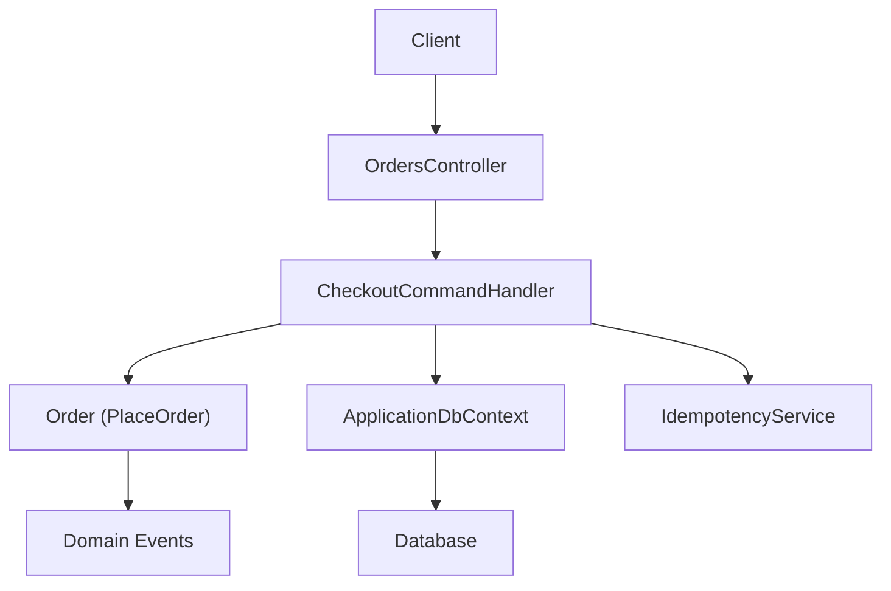
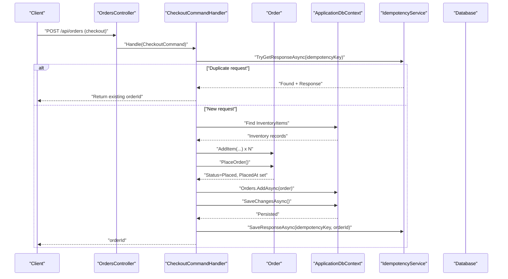
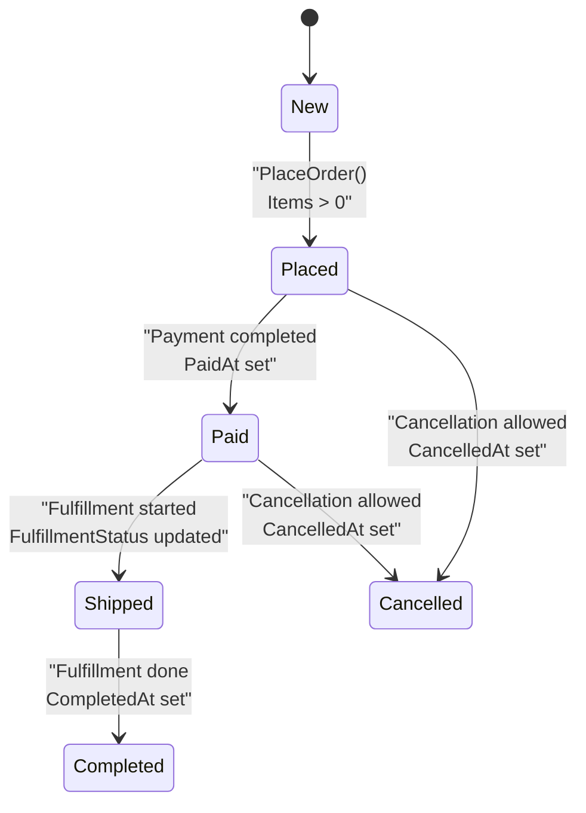
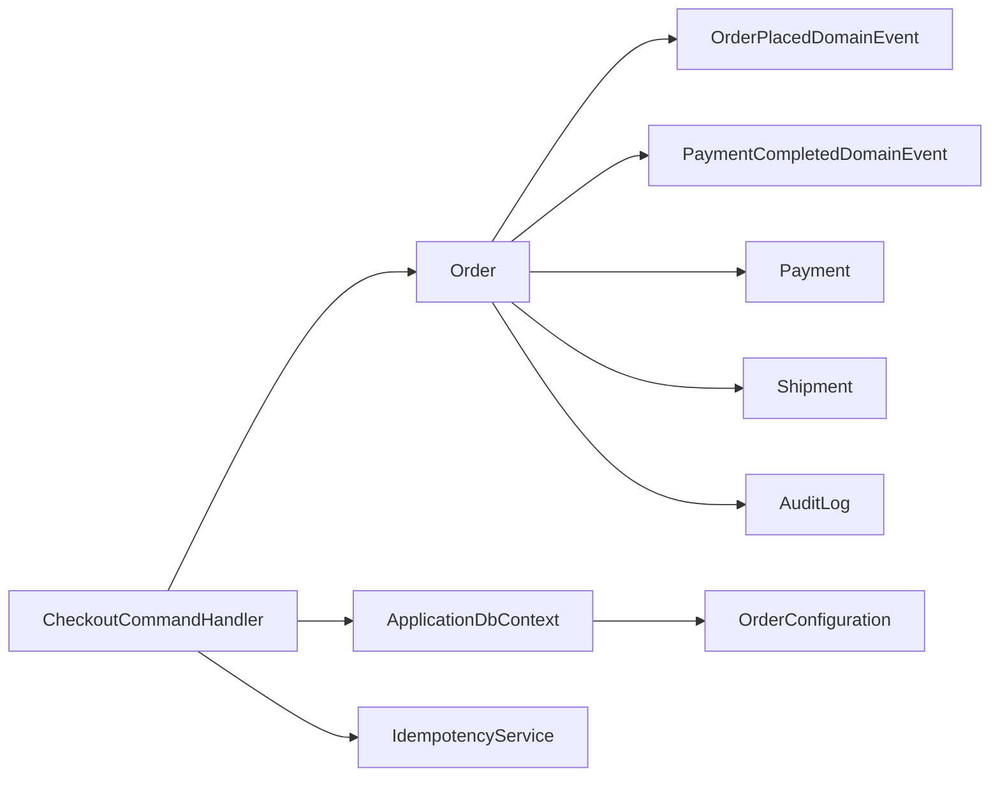

# Order Lifecycle Management

<cite>
**Referenced Files in This Document**
- [Order.cs](file://src/Ecommerce.Domain/Entities/Order.cs)
- [CheckoutCommand.cs](file://src/Ecommerce.Application/Commands/Checkout/CheckoutCommand.cs)
- [CheckoutCommandHandler.cs](file://src/Ecommerce.Application/Commands/Checkout/CheckoutCommandHandler.cs)
- [OrderConfiguration.cs](file://src/Ecommerce.Infrastructure/Persistence/Configurations/OrderConfiguration.cs)
- [ApplicationDbContext.cs](file://src/Ecommerce.Infrastructure/Persistence/ApplicationDbContext.cs)
- [IApplicationDbContext.cs](file://src/Ecommerce.Application/Interfaces/IApplicationDbContext.cs)
- [IdempotencyService.cs](file://src/Ecommerce.Infrastructure/Services/IdempotencyService.cs)
- [OrderPlacedDomainEvent.cs](file://src/Ecommerce.Domain/DomainEvents/OrderPlacedDomainEvent.cs)
- [PaymentCompletedDomainEvent.cs](file://src/Ecommerce.Domain/DomainEvents/PaymentCompletedDomainEvent.cs)
- [Payment.cs](file://src/Ecommerce.Domain/Entities/Payment.cs)
- [Shipment.cs](file://src/Ecommerce.Domain/Entities/Shipment.cs)
- [AuditLog.cs](file://src/Ecommerce.Domain/Entities/AuditLog.cs)
- [OrdersController.cs](file://src/Ecommerce.Api/Controllers/OrdersController.cs)
- [OrderDto.cs](file://src/Ecommerce.Application/DTOs/OrderDto.cs)
- [entities_and_constraints.md](file://docs/architecture/entities_and_constraints.md)
</cite>

## Table of Contents
1. Introduction
2. Project Structure
3. Core Components
4. Architecture Overview
5. Detailed Component Analysis
6. Dependency Analysis
7. Performance Considerations
8. Troubleshooting Guide
9. Conclusion

## Introduction
This document explains the order lifecycle management in the e-commerce system, focusing on how orders are created, validated, persisted, and transitioned through states. It covers:
- The order state machine from creation to completion/cancellation
- Business rules for status transitions (Placed, Paid, Shipped, Completed, Cancelled)
- Implementation details of PlaceOrder and validation checks
- Timestamp tracking (PlacedAt, PaidAt, CancelledAt, CompletedAt) and their significance
- Error handling for invalid transitions and audit trail maintenance
- Concurrent processing safeguards using optimistic concurrency with RowVersion

## Project Structure
The order lifecycle spans Domain, Application, Infrastructure, and API layers:
- Domain: Order entity with business rules, domain events, and related entities (Payment, Shipment, AuditLog)
- Application: Checkout command handler orchestrating order creation, inventory reservation, persistence, and idempotency
- Infrastructure: EF Core configuration for Order including RowVersion concurrency token; DbContext exposing Orders; Idempotency service
- API: Controllers for reading orders and DTOs for responses

**Diagram sources**
- [OrdersController.cs:1-53](file://src/Ecommerce.Api/Controllers/OrdersController.cs#L1-L53)
- [CheckoutCommandHandler.cs:1-94](file://src/Ecommerce.Application/Commands/Checkout/CheckoutCommandHandler.cs#L1-L94)
- [Order.cs:1-105](file://src/Ecommerce.Domain/Entities/Order.cs#L1-L105)
- [ApplicationDbContext.cs:1-43](file://src/Ecommerce.Infrastructure/Persistence/ApplicationDbContext.cs#L1-L43)
- [IdempotencyService.cs:1-57](file://src/Ecommerce.Infrastructure/Services/IdempotencyService.cs#L1-L57)

**Section sources**
- [OrdersController.cs:1-53](file://src/Ecommerce.Api/Controllers/OrdersController.cs#L1-L53)
- [CheckoutCommandHandler.cs:1-94](file://src/Ecommerce.Application/Commands/Checkout/CheckoutCommandHandler.cs#L1-L94)
- [Order.cs:1-105](file://src/Ecommerce.Domain/Entities/Order.cs#L1-L105)
- [ApplicationDbContext.cs:1-43](file://src/Ecommerce.Infrastructure/Persistence/ApplicationDbContext.cs#L1-L43)
- [IdempotencyService.cs:1-57](file://src/Ecommerce.Infrastructure/Services/IdempotencyService.cs#L1-L57)

## Core Components
- Order entity: encapsulates order data, items, totals, statuses, timestamps, and business methods such as AddItem, RemoveItem, ApplyCoupon, RecalculateTotals, and PlaceOrder
- Checkout flow: validates input, reserves inventory, builds order, calls PlaceOrder, persists, and records idempotency response
- Persistence: EF Core mapping for Order includes RowVersion concurrency token and relationships
- Domain events: OrderPlacedDomainEvent and PaymentCompletedDomainEvent capture key lifecycle milestones
- Supporting entities: Payment, Shipment, AuditLog provide context for payment, fulfillment, and auditing

Key responsibilities:
- Domain enforces business invariants (e.g., cannot place empty order)
- Application coordinates cross-cutting concerns (idempotency, inventory reservation, persistence)
- Infrastructure provides data access and concurrency control via RowVersion
- API exposes read endpoints and maps results to DTOs

**Section sources**
- [Order.cs:1-105](file://src/Ecommerce.Domain/Entities/Order.cs#L1-L105)
- [CheckoutCommandHandler.cs:1-94](file://src/Ecommerce.Application/Commands/Checkout/CheckoutCommandHandler.cs#L1-L94)
- [OrderConfiguration.cs:1-47](file://src/Ecommerce.Infrastructure/Persistence/Configurations/OrderConfiguration.cs#L1-L47)
- [OrderPlacedDomainEvent.cs:1-16](file://src/Ecommerce.Domain/DomainEvents/OrderPlacedDomainEvent.cs#L1-L16)
- [PaymentCompletedDomainEvent.cs:1-18](file://src/Ecommerce.Domain/DomainEvents/PaymentCompletedDomainEvent.cs#L1-L18)
- [Payment.cs:1-23](file://src/Ecommerce.Domain/Entities/Payment.cs#L1-L23)
- [Shipment.cs:1-20](file://src/Ecommerce.Domain/Entities/Shipment.cs#L1-L20)
- [AuditLog.cs:1-18](file://src/Ecommerce.Domain/Entities/AuditLog.cs#L1-L18)

## Architecture Overview
The checkout process creates an order, validates and reserves inventory, applies business rules, persists changes, and ensures idempotency. Domain events mark important milestones.

**Diagram sources**
- [CheckoutCommandHandler.cs:22-91](file://src/Ecommerce.Application/Commands/Checkout/CheckoutCommandHandler.cs#L22-L91)
- [Order.cs:89-102](file://src/Ecommerce.Domain/Entities/Order.cs#L89-L102)
- [IdempotencyService.cs:19-53](file://src/Ecommerce.Infrastructure/Services/IdempotencyService.cs#L19-L53)
- [ApplicationDbContext.cs:29-32](file://src/Ecommerce.Infrastructure/Persistence/ApplicationDbContext.cs#L29-L32)

## Detailed Component Analysis

### Order Entity and State Machine
- Status fields: Status, PaymentStatus, FulfillmentStatus
- Timestamps: PlacedAt, PaidAt, CancelledAt, CompletedAt, CreatedAt, UpdatedAt
- Concurrency: RowVersion byte[] used by EF Core as a concurrency token
- Methods:
  - AddItem: validates quantity and unit price, updates totals, sets timestamps
  - RemoveItem: removes item, recalculates totals, updates timestamp
  - ApplyCoupon: applies coupon code and discount, recalculates totals, updates timestamp
  - RecalculateTotals: computes Subtotal, TaxAmount, DiscountAmount, TotalAmount
  - PlaceOrder: validates non-empty items, sets Status to Placed, PaymentStatus to Pending, FulfillmentStatus to Unfulfilled, sets PlacedAt and UpdatedAt, recalculates totals

State transitions and business rules:
- Initial state: New (no status set yet)
- Transition to Placed: Only when order has at least one item; sets PlacedAt
- Transition to Paid: Triggered externally by payment completion; sets PaidAt and updates PaymentStatus accordingly
- Transition to Shipped: After fulfillment begins; sets FulfillmentStatus to Shipped and may record Shipment timestamps
- Transition to Completed: When fulfillment is complete; sets CompletedAt
- Transition to Cancelled: If cancellation occurs; sets CancelledAt and appropriate statuses

Note: The current implementation explicitly defines the Placed transition. Paid, Shipped, Completed, and Cancelled transitions are conceptual and should be enforced similarly with explicit methods or handlers that validate preconditions and update timestamps.

**Diagram sources**
- [Order.cs:89-102](file://src/Ecommerce.Domain/Entities/Order.cs#L89-L102)
- [entities_and_constraints.md:431-460](file://docs/architecture/entities_and_constraints.md#L431-L460)

**Section sources**
- [Order.cs:1-105](file://src/Ecommerce.Domain/Entities/Order.cs#L1-L105)
- [entities_and_constraints.md:431-460](file://docs/architecture/entities_and_constraints.md#L431-L460)

### PlaceOrder Method and Validation Rules
- Precondition: Order must contain at least one item; otherwise throws a domain exception
- Effects:
  - Sets Status to Placed
  - Sets PaymentStatus to Pending
  - Sets FulfillmentStatus to Unfulfilled
  - Sets PlacedAt to current UTC time
  - Updates UpdatedAt and initializes CreatedAt if not set
  - Recalculates totals to ensure consistency

Validation highlights:
- Item quantity must be positive
- Unit price must be non-negative
- Totals are recalculated after item modifications or coupon application

Error handling:
- Throws domain exceptions for invalid inputs or operations (e.g., empty order placement, missing items)

**Section sources**
- [Order.cs:36-59](file://src/Ecommerce.Domain/Entities/Order.cs#L36-L59)
- [Order.cs:71-87](file://src/Ecommerce.Domain/Entities/Order.cs#L71-L87)
- [Order.cs:89-102](file://src/Ecommerce.Domain/Entities/Order.cs#L89-L102)

### Checkout Command Handler Flow
- Idempotency:
  - Checks for existing response by idempotency key; returns previous orderId if found
  - Registers attempt with request hash and owner; handles conflicts gracefully
- Input validation:
  - Ensures items list is present and non-empty
- Inventory reservation:
  - Looks up inventory by product variant or product
  - Reserves required quantity; throws inventory exception if not found
- Order creation:
  - Builds order with currency and shipping amount
  - Adds items and calls PlaceOrder
- Persistence:
  - Adds order to DbContext and saves changes
- Idempotency completion:
  - Saves response (orderId) for the idempotency key

Concurrency considerations:
- SaveChangesAsync uses EF Core’s RowVersion to detect concurrent updates on Order
- Idempotency service prevents duplicate processing under the same key

**Section sources**
- [CheckoutCommandHandler.cs:22-91](file://src/Ecommerce.Application/Commands/Checkout/CheckoutCommandHandler.cs#L22-L91)
- [IdempotencyService.cs:19-53](file://src/Ecommerce.Infrastructure/Services/IdempotencyService.cs#L19-L53)
- [OrderConfiguration.cs:31-34](file://src/Ecommerce.Infrastructure/Persistence/Configurations/OrderConfiguration.cs#L31-L34)

### Timestamp Tracking and Significance
- PlacedAt: Marks when order enters Placed state; indicates start of fulfillment workflow
- PaidAt: Marks successful payment capture; enables downstream actions like shipping preparation
- CancelledAt: Marks cancellation; useful for analytics and refund workflows
- CompletedAt: Marks finalization of fulfillment; signals closure of order lifecycle
- CreatedAt/UpdatedAt: General audit timestamps for entity lifecycle

These timestamps support:
- SLA monitoring and reporting
- Workflow orchestration (e.g., trigger shipping after PaidAt)
- Auditing and compliance

**Section sources**
- [Order.cs:26-32](file://src/Ecommerce.Domain/Entities/Order.cs#L26-L32)
- [Order.cs:89-102](file://src/Ecommerce.Domain/Entities/Order.cs#L89-L102)

### Domain Events and Audit Trail
- OrderPlacedDomainEvent: Captures order placement event with OccurredAt timestamp
- PaymentCompletedDomainEvent: Captures payment completion with associated OrderId
- AuditLog: Records action, entity name, entity id, old/new values, IP address, user agent, and CreatedAt

Usage patterns:
- Emit domain events when critical state transitions occur
- Persist audit logs for high-value operations (placement, payment, cancellation, completion)
- Use audit logs for traceability and compliance

**Section sources**
- [OrderPlacedDomainEvent.cs:1-16](file://src/Ecommerce.Domain/DomainEvents/OrderPlacedDomainEvent.cs#L1-L16)
- [PaymentCompletedDomainEvent.cs:1-18](file://src/Ecommerce.Domain/DomainEvents/PaymentCompletedDomainEvent.cs#L1-L18)
- [AuditLog.cs:1-18](file://src/Ecommerce.Domain/Entities/AuditLog.cs#L1-L18)

### API Exposure and DTOs
- OrdersController provides GET endpoints to list and retrieve orders with items
- Uses AutoMapper to map Order entities to OrderDto
- Supports pagination and ordering by CreatedAt

**Section sources**
- [OrdersController.cs:1-53](file://src/Ecommerce.Api/Controllers/OrdersController.cs#L1-L53)
- [OrderDto.cs:1-22](file://src/Ecommerce.Application/DTOs/OrderDto.cs#L1-L22)

## Dependency Analysis
The checkout flow depends on multiple components across layers:

**Diagram sources**
- [CheckoutCommandHandler.cs:1-94](file://src/Ecommerce.Application/Commands/Checkout/CheckoutCommandHandler.cs#L1-L94)
- [Order.cs:1-105](file://src/Ecommerce.Domain/Entities/Order.cs#L1-L105)
- [OrderConfiguration.cs:1-47](file://src/Ecommerce.Infrastructure/Persistence/Configurations/OrderConfiguration.cs#L1-L47)
- [ApplicationDbContext.cs:1-43](file://src/Ecommerce.Infrastructure/Persistence/ApplicationDbContext.cs#L1-L43)
- [IdempotencyService.cs:1-57](file://src/Ecommerce.Infrastructure/Services/IdempotencyService.cs#L1-L57)
- [OrderPlacedDomainEvent.cs:1-16](file://src/Ecommerce.Domain/DomainEvents/OrderPlacedDomainEvent.cs#L1-L16)
- [PaymentCompletedDomainEvent.cs:1-18](file://src/Ecommerce.Domain/DomainEvents/PaymentCompletedDomainEvent.cs#L1-L18)
- [Payment.cs:1-23](file://src/Ecommerce.Domain/Entities/Payment.cs#L1-L23)
- [Shipment.cs:1-20](file://src/Ecommerce.Domain/Entities/Shipment.cs#L1-L20)
- [AuditLog.cs:1-18](file://src/Ecommerce.Domain/Entities/AuditLog.cs#L1-L18)

**Section sources**
- [CheckoutCommandHandler.cs:1-94](file://src/Ecommerce.Application/Commands/Checkout/CheckoutCommandHandler.cs#L1-L94)
- [Order.cs:1-105](file://src/Ecommerce.Domain/Entities/Order.cs#L1-L105)
- [OrderConfiguration.cs:1-47](file://src/Ecommerce.Infrastructure/Persistence/Configurations/OrderConfiguration.cs#L1-L47)
- [ApplicationDbContext.cs:1-43](file://src/Ecommerce.Infrastructure/Persistence/ApplicationDbContext.cs#L1-L43)
- [IdempotencyService.cs:1-57](file://src/Ecommerce.Infrastructure/Services/IdempotencyService.cs#L1-L57)

## Performance Considerations
- Use AsNoTracking for read-only queries to reduce change tracker overhead
- Ensure efficient indexing on frequently queried fields (e.g., OrderNumber, UserId, Status, CreatedAt)
- Batch operations where possible (e.g., adding multiple order items before saving)
- Avoid unnecessary recomputation; leverage RecalculateTotals only when needed
- Keep transactions short; persist only essential changes per operation

[No sources needed since this section provides general guidance]

## Troubleshooting Guide
Common issues and resolutions:
- Empty order placement:
  - Symptom: Exception thrown when calling PlaceOrder without items
  - Resolution: Ensure at least one item is added before placing the order
- Missing inventory:
  - Symptom: Exception during checkout when inventory lookup fails
  - Resolution: Verify inventory records exist for product or variant; handle gracefully
- Duplicate checkout requests:
  - Symptom: Multiple orders created for the same intent
  - Resolution: Use idempotency keys; check existing responses before processing
- Concurrency conflicts:
  - Symptom: SaveChanges fails due to RowVersion mismatch
  - Resolution: Retry logic or inform client to refresh and reattempt; ensure proper transaction boundaries
- Invalid transitions:
  - Symptom: Attempting to move order to an invalid state (e.g., Shipped before Paid)
  - Resolution: Enforce preconditions in handlers or domain methods; log and reject invalid attempts

**Section sources**
- [Order.cs:36-59](file://src/Ecommerce.Domain/Entities/Order.cs#L36-L59)
- [Order.cs:89-102](file://src/Ecommerce.Domain/Entities/Order.cs#L89-L102)
- [CheckoutCommandHandler.cs:45-75](file://src/Ecommerce.Application/Commands/Checkout/CheckoutCommandHandler.cs#L45-L75)
- [IdempotencyService.cs:19-53](file://src/Ecommerce.Infrastructure/Services/IdempotencyService.cs#L19-L53)
- [OrderConfiguration.cs:31-34](file://src/Ecommerce.Infrastructure/Persistence/Configurations/OrderConfiguration.cs#L31-L34)

## Conclusion
The order lifecycle is anchored by the Order entity’s business rules and the CheckoutCommandHandler’s orchestration. PlaceOrder establishes the Placed state with robust validation and timestamping. While the current implementation focuses on placement, subsequent transitions (Paid, Shipped, Completed, Cancelled) should follow similar patterns with explicit validations, timestamp updates, and domain events. Idempotency and RowVersion-based optimistic concurrency protect against duplicates and concurrent updates. Audit trails and domain events enhance observability and enable reliable downstream workflows.

[No sources needed since this section summarizes without analyzing specific files]