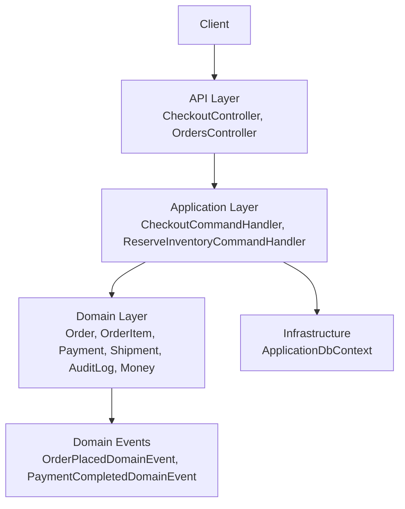
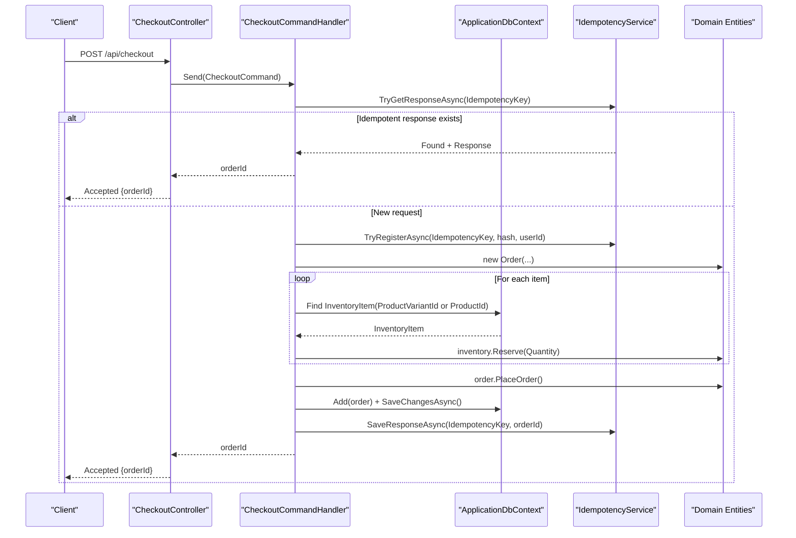
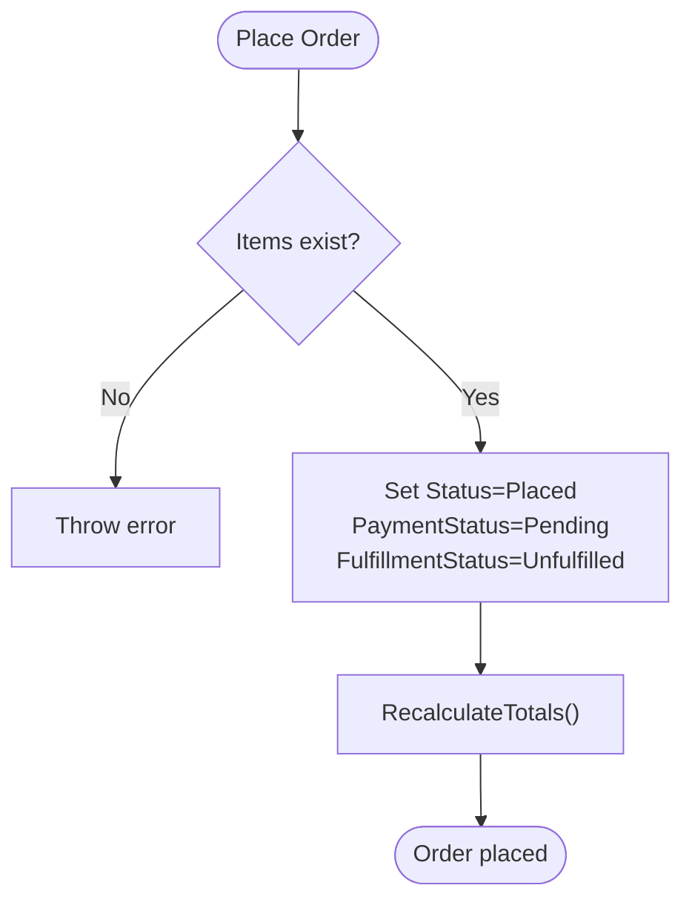
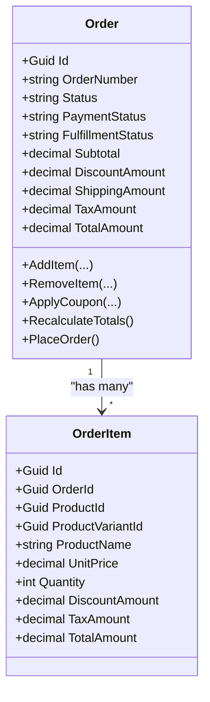
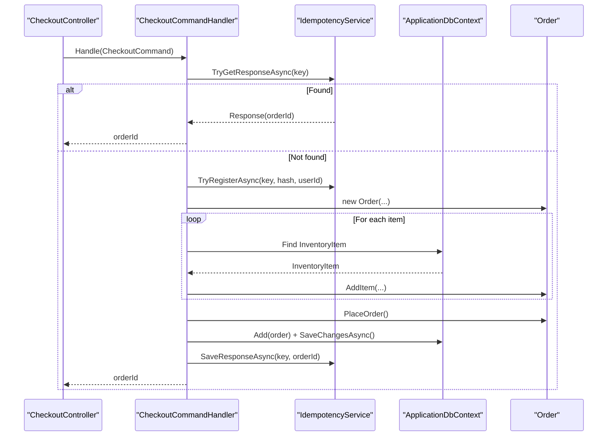
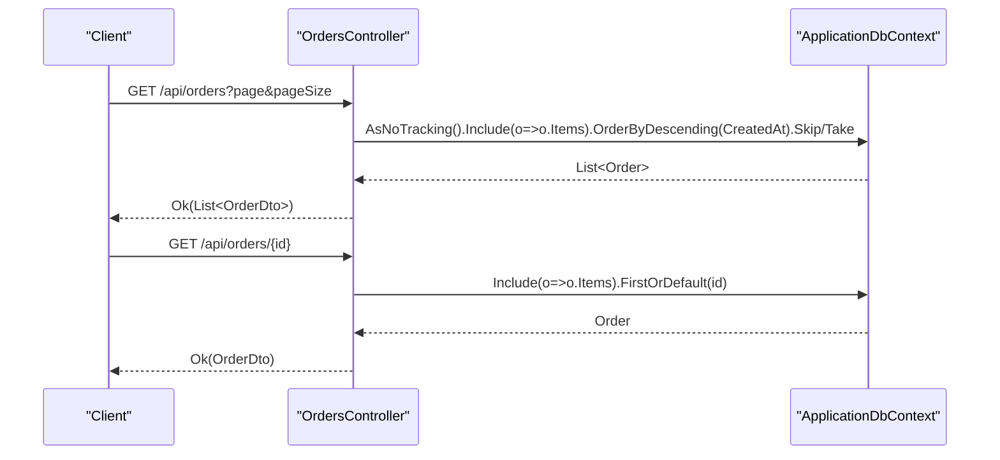
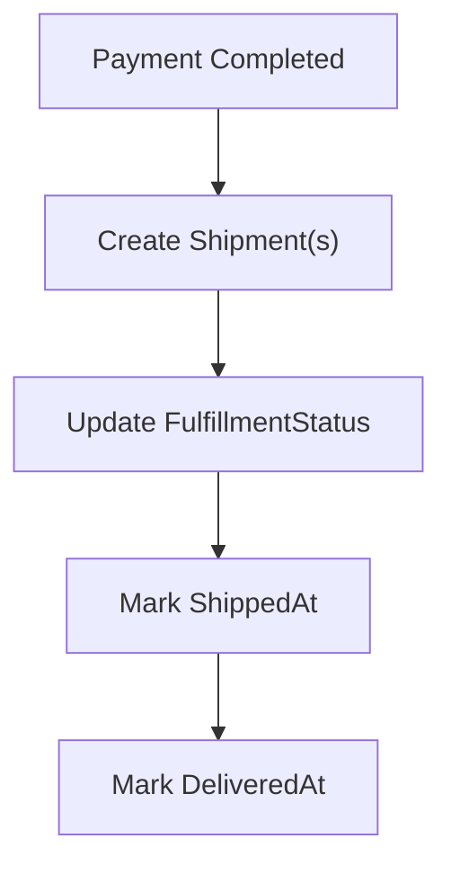
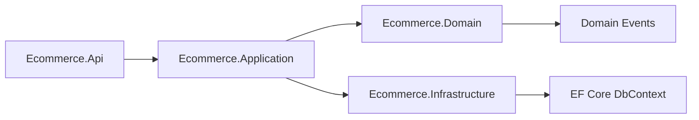

# Order Processing

<cite>
**Referenced Files in This Document**
- [Order.cs](file://src/Ecommerce.Domain/Entities/Order.cs)
- [OrderItem.cs](file://src/Ecommerce.Domain/Entities/OrderItem.cs)
- [Payment.cs](file://src/Ecommerce.Domain/Entities/Payment.cs)
- [Shipment.cs](file://src/Ecommerce.Domain/Entities/Shipment.cs)
- [AuditLog.cs](file://src/Ecommerce.Domain/Entities/AuditLog.cs)
- [Money.cs](file://src/Ecommerce.Domain/ValueObjects/Money.cs)
- [OrderPlacedDomainEvent.cs](file://src/Ecommerce.Domain/DomainEvents/OrderPlacedDomainEvent.cs)
- [PaymentCompletedDomainEvent.cs](file://src/Ecommerce.Domain/DomainEvents/PaymentCompletedDomainEvent.cs)
- [CheckoutCommand.cs](file://src/Ecommerce.Application/Commands/Checkout/CheckoutCommand.cs)
- [CheckoutCommandHandler.cs](file://src/Ecommerce.Application/Commands/Checkout/CheckoutCommandHandler.cs)
- [ReserveInventoryCommandHandler.cs](file://src/Ecommerce.Application/Commands/ReserveInventory/ReserveInventoryCommandHandler.cs)
- [OrdersController.cs](file://src/Ecommerce.Api/Controllers/OrdersController.cs)
- [CheckoutController.cs](file://src/Ecommerce.Api/Controllers/CheckoutController.cs)
- [ApplicationDbContext.cs](file://src/Ecommerce.Infrastructure/Persistence/ApplicationDbContext.cs)
</cite>

## Table of Contents
1. Introduction
2. Project Structure
3. Core Components
4. Architecture Overview
5. Detailed Component Analysis
6. Dependency Analysis
7. Performance Considerations
8. Troubleshooting Guide
9. Conclusion

## Introduction
This document explains the order processing functionality end-to-end: from placing an order through fulfillment, including status transitions, state management, pricing and tax handling, shipping information, domain events, queries, cancellation/refund considerations, audit logging, and performance guidance for high-volume and concurrent scenarios. It is based on the domain entities, application commands/handlers, API controllers, and persistence configuration present in the repository.

## Project Structure
The order processing spans three layers:
- Domain layer: core entities (Order, OrderItem, Payment, Shipment, AuditLog), value objects (Money), and domain events (OrderPlacedDomainEvent, PaymentCompletedDomainEvent).
- Application layer: commands and handlers that orchestrate checkout, inventory reservation, and idempotency.
- API layer: HTTP endpoints to place orders and query orders.
- Infrastructure layer: EF Core DbContext exposing Orders and related DbSets.

**Diagram sources**
- [CheckoutController.cs:1-27](file://src/Ecommerce.Api/Controllers/CheckoutController.cs#L1-L27)
- [OrdersController.cs:1-53](file://src/Ecommerce.Api/Controllers/OrdersController.cs#L1-L53)
- [CheckoutCommandHandler.cs:1-94](file://src/Ecommerce.Application/Commands/Checkout/CheckoutCommandHandler.cs#L1-L94)
- [ReserveInventoryCommandHandler.cs:1-31](file://src/Ecommerce.Application/Commands/ReserveInventory/ReserveInventoryCommandHandler.cs#L1-L31)
- [Order.cs:1-105](file://src/Ecommerce.Domain/Entities/Order.cs#L1-L105)
- [OrderItem.cs:1-22](file://src/Ecommerce.Domain/Entities/OrderItem.cs#L1-L22)
- [Payment.cs:1-23](file://src/Ecommerce.Domain/Entities/Payment.cs#L1-L23)
- [Shipment.cs:1-21](file://src/Ecommerce.Domain/Entities/Shipment.cs#L1-L21)
- [AuditLog.cs:1-19](file://src/Ecommerce.Domain/Entities/AuditLog.cs#L1-L19)
- [Money.cs:1-20](file://src/Ecommerce.Domain/ValueObjects/Money.cs#L1-L20)
- [OrderPlacedDomainEvent.cs:1-16](file://src/Ecommerce.Domain/DomainEvents/OrderPlacedDomainEvent.cs#L1-L16)
- [PaymentCompletedDomainEvent.cs:1-18](file://src/Ecommerce.Domain/DomainEvents/PaymentCompletedDomainEvent.cs#L1-L18)
- [ApplicationDbContext.cs:1-43](file://src/Ecommerce.Infrastructure/Persistence/ApplicationDbContext.cs#L1-L43)

**Section sources**
- [CheckoutController.cs:1-27](file://src/Ecommerce.Api/Controllers/CheckoutController.cs#L1-L27)
- [OrdersController.cs:1-53](file://src/Ecommerce.Api/Controllers/OrdersController.cs#L1-L53)
- [CheckoutCommandHandler.cs:1-94](file://src/Ecommerce.Application/Commands/Checkout/CheckoutCommandHandler.cs#L1-L94)
- [ApplicationDbContext.cs:1-43](file://src/Ecommerce.Infrastructure/Persistence/ApplicationDbContext.cs#L1-L43)

## Core Components
- Order: aggregates items, manages totals, and exposes lifecycle methods such as adding/removing items, applying coupons, recalculating totals, and placing the order with initial statuses.
- OrderItem: captures per-item pricing, discounts, taxes, and totals.
- Payment: records payment provider details, amounts, currency, and lifecycle timestamps/statuses.
- Shipment: models outbound shipments with tracking, carrier, and delivery timestamps.
- AuditLog: stores action-level audit entries for compliance and traceability.
- Money: value object representing monetary amounts with currency codes.
- Domain Events: OrderPlacedDomainEvent and PaymentCompletedDomainEvent capture key milestones.

Key responsibilities:
- Order enforces business rules during item addition and placement, ensuring non-negative quantities/prices and maintaining consistent totals.
- Checkout command orchestrates order creation, inventory reservation, persistence, and idempotency.
- API controllers expose endpoints for checkout and order queries.

**Section sources**
- [Order.cs:1-105](file://src/Ecommerce.Domain/Entities/Order.cs#L1-L105)
- [OrderItem.cs:1-22](file://src/Ecommerce.Domain/Entities/OrderItem.cs#L1-L22)
- [Payment.cs:1-23](file://src/Ecommerce.Domain/Entities/Payment.cs#L1-L23)
- [Shipment.cs:1-21](file://src/Ecommerce.Domain/Entities/Shipment.cs#L1-L21)
- [AuditLog.cs:1-19](file://src/Ecommerce.Domain/Entities/AuditLog.cs#L1-L19)
- [Money.cs:1-20](file://src/Ecommerce.Domain/ValueObjects/Money.cs#L1-L20)
- [OrderPlacedDomainEvent.cs:1-16](file://src/Ecommerce.Domain/DomainEvents/OrderPlacedDomainEvent.cs#L1-L16)
- [PaymentCompletedDomainEvent.cs:1-18](file://src/Ecommerce.Domain/DomainEvents/PaymentCompletedDomainEvent.cs#L1-L18)

## Architecture Overview
The checkout flow uses a command-driven approach:
- The API receives a checkout request and dispatches a command.
- The handler validates input, ensures idempotency, builds an Order, reserves inventory, persists the order, and returns the order identifier.
- Domain events are available to signal order placement and payment completion to downstream consumers.

**Diagram sources**
- [CheckoutController.cs:1-27](file://src/Ecommerce.Api/Controllers/CheckoutController.cs#L1-L27)
- [CheckoutCommandHandler.cs:1-94](file://src/Ecommerce.Application/Commands/Checkout/CheckoutCommandHandler.cs#L1-L94)
- [Order.cs:1-105](file://src/Ecommerce.Domain/Entities/Order.cs#L1-L105)
- [ApplicationDbContext.cs:1-43](file://src/Ecommerce.Infrastructure/Persistence/ApplicationDbContext.cs#L1-L43)

## Detailed Component Analysis

### Order Lifecycle and State Management
- Placement: PlaceOrder sets initial statuses (e.g., Placed, Pending payment, Unfulfilled) and timestamps, then recalculates totals.
- Totals: Subtotal, discount, shipping, tax, and total are computed consistently; discounts can come from items and/or coupon application.
- Items: AddItem enforces quantity and price constraints, computes line totals, and updates aggregate totals. RemoveItem adjusts totals accordingly.
- Coupons: ApplyCoupon updates discount and triggers recalculation.

Status fields:
- Status: order-level workflow state (e.g., Placed).
- PaymentStatus: payment lifecycle (e.g., Pending).
- FulfillmentStatus: fulfillment lifecycle (e.g., Unfulfilled).

**Diagram sources**
- [Order.cs:89-102](file://src/Ecommerce.Domain/Entities/Order.cs#L89-L102)
- [Order.cs:79-87](file://src/Ecommerce.Domain/Entities/Order.cs#L79-L87)

**Section sources**
- [Order.cs:36-87](file://src/Ecommerce.Domain/Entities/Order.cs#L36-L87)
- [Order.cs:89-102](file://src/Ecommerce.Domain/Entities/Order.cs#L89-L102)

### Order Items and Pricing Calculations
- Each OrderItem tracks unit price, quantity, discount, tax, and computed total.
- Order recalculates:
  - Subtotal as sum of unit price times quantity across items.
  - TaxAmount as sum of item taxes.
  - DiscountAmount combining item-level discounts and coupon discount.
  - TotalAmount = Subtotal - DiscountAmount + ShippingAmount + TaxAmount.

**Diagram sources**
- [Order.cs:1-105](file://src/Ecommerce.Domain/Entities/Order.cs#L1-L105)
- [OrderItem.cs:1-22](file://src/Ecommerce.Domain/Entities/OrderItem.cs#L1-L22)

**Section sources**
- [Order.cs:79-87](file://src/Ecommerce.Domain/Entities/Order.cs#L79-L87)
- [OrderItem.cs:1-22](file://src/Ecommerce.Domain/Entities/OrderItem.cs#L1-L22)

### Tax Handling
- Taxes are tracked per item via TaxAmount and aggregated into Order.TaxAmount during recalculation.
- CurrencyCode is maintained at the order level to ensure consistent monetary context.

**Section sources**
- [Order.cs:16-21](file://src/Ecommerce.Domain/Entities/Order.cs#L16-L21)
- [Order.cs:79-87](file://src/Ecommerce.Domain/Entities/Order.cs#L79-L87)
- [Money.cs:1-20](file://src/Ecommerce.Domain/ValueObjects/Money.cs#L1-L20)

### Shipping Information
- ShippingAmount is part of the order totals calculation.
- Shipment entity supports tracking numbers, carriers, and delivery timestamps for fulfillment workflows.

**Section sources**
- [Order.cs:19-21](file://src/Ecommerce.Domain/Entities/Order.cs#L19-L21)
- [Shipment.cs:1-21](file://src/Ecommerce.Domain/Entities/Shipment.cs#L1-L21)

### Payment Handling
- Payment entity records provider details, amount, currency, status, and lifecycle timestamps (authorized, captured, failed).
- PaymentCompletedDomainEvent signals successful payment completion for downstream processing.

**Section sources**
- [Payment.cs:1-23](file://src/Ecommerce.Domain/Entities/Payment.cs#L1-L23)
- [PaymentCompletedDomainEvent.cs:1-18](file://src/Ecommerce.Domain/DomainEvents/PaymentCompletedDomainEvent.cs#L1-L18)

### Domain Events Usage Patterns
- OrderPlacedDomainEvent: indicates when an order has been successfully placed.
- PaymentCompletedDomainEvent: indicates when payment is completed, enabling subsequent steps like fulfillment.

These events can be consumed by background workers or external systems to trigger notifications, analytics, or downstream integrations.

**Section sources**
- [OrderPlacedDomainEvent.cs:1-16](file://src/Ecommerce.Domain/DomainEvents/OrderPlacedDomainEvent.cs#L1-L16)
- [PaymentCompletedDomainEvent.cs:1-18](file://src/Ecommerce.Domain/DomainEvents/PaymentCompletedDomainEvent.cs#L1-L18)

### Checkout Workflow and Idempotency
- The checkout endpoint accepts a command containing user, items, currency, shipping address, and optional idempotency key.
- The handler:
  - Checks for existing idempotent responses.
  - Registers the attempt if not already registered.
  - Builds an Order, adds items, reserves inventory, places the order, persists it, and saves the idempotent response.

**Diagram sources**
- [CheckoutController.cs:1-27](file://src/Ecommerce.Api/Controllers/CheckoutController.cs#L1-L27)
- [CheckoutCommandHandler.cs:1-94](file://src/Ecommerce.Application/Commands/Checkout/CheckoutCommandHandler.cs#L1-L94)
- [Order.cs:1-105](file://src/Ecommerce.Domain/Entities/Order.cs#L1-L105)
- [ApplicationDbContext.cs:1-43](file://src/Ecommerce.Infrastructure/Persistence/ApplicationDbContext.cs#L1-L43)

**Section sources**
- [CheckoutCommand.cs:1-22](file://src/Ecommerce.Application/Commands/Checkout/CheckoutCommand.cs#L1-L22)
- [CheckoutCommandHandler.cs:1-94](file://src/Ecommerce.Application/Commands/Checkout/CheckoutCommandHandler.cs#L1-L94)

### Order Queries
- List orders with pagination, including items, ordered by creation date descending.
- Get order by ID with included items.

**Diagram sources**
- [OrdersController.cs:1-53](file://src/Ecommerce.Api/Controllers/OrdersController.cs#L1-L53)
- [ApplicationDbContext.cs:1-43](file://src/Ecommerce.Infrastructure/Persistence/ApplicationDbContext.cs#L1-L43)

**Section sources**
- [OrdersController.cs:26-50](file://src/Ecommerce.Api/Controllers/OrdersController.cs#L26-L50)

### Fulfillment Workflows
- Fulfillment is modeled by Shipment with tracking, carrier, and timestamps.
- Typical flow: after payment completion (PaymentCompletedDomainEvent), create Shipment(s) and update order FulfillmentStatus accordingly.

[No sources needed since this diagram shows conceptual workflow, not actual code structure]

### Order Cancellation and Refund Processing
- Cancellation: While no explicit cancel method is shown in the current Order entity, cancellation would typically involve updating Status and CancelledAt, and potentially reversing inventory reservations.
- Refunds: RefundedAmount on Order and Payment.Status/FailureReason support refund modeling. A refund process would record a Payment entry with appropriate status and update Order.RefundedAmount.

[No sources needed since this section provides general guidance based on existing fields]

### Audit Logging
- AuditLog entity captures actions, entity names/IDs, old/new values, and request metadata (IP, User-Agent).
- Use cases: log order placement, status changes, cancellations, refunds, and fulfillment updates for compliance and debugging.

**Section sources**
- [AuditLog.cs:1-19](file://src/Ecommerce.Domain/Entities/AuditLog.cs#L1-L19)

## Dependency Analysis
- API depends on Application commands via CommandDispatcher.
- Application depends on Domain entities and Infrastructure DbContext.
- Domain defines entities and events without infrastructure concerns.
- Persistence exposes DbSets for Orders, OrderItems, and related entities.

**Diagram sources**
- [CheckoutController.cs:1-27](file://src/Ecommerce.Api/Controllers/CheckoutController.cs#L1-L27)
- [CheckoutCommandHandler.cs:1-94](file://src/Ecommerce.Application/Commands/Checkout/CheckoutCommandHandler.cs#L1-L94)
- [Order.cs:1-105](file://src/Ecommerce.Domain/Entities/Order.cs#L1-L105)
- [ApplicationDbContext.cs:1-43](file://src/Ecommerce.Infrastructure/Persistence/ApplicationDbContext.cs#L1-L43)

**Section sources**
- [CheckoutController.cs:1-27](file://src/Ecommerce.Api/Controllers/CheckoutController.cs#L1-L27)
- [CheckoutCommandHandler.cs:1-94](file://src/Ecommerce.Application/Commands/Checkout/CheckoutCommandHandler.cs#L1-L94)
- [ApplicationDbContext.cs:1-43](file://src/Ecommerce.Infrastructure/Persistence/ApplicationDbContext.cs#L1-L43)

## Performance Considerations
- Idempotency: Prevents duplicate order creation under concurrent retries using idempotency keys and response caching.
- Read performance: Use AsNoTracking for read-only queries and include only necessary data (e.g., Items) to reduce payload size.
- Pagination: Enforce page/pageSize bounds to avoid large result sets.
- Concurrency: Persisted entities use RowVersion for optimistic concurrency control; ensure handlers handle concurrency exceptions appropriately.
- Inventory reservation: Reserve stock within the same transactional boundary as order creation to prevent overselling.
- Background processing: Offload heavy tasks (e.g., email notifications, analytics) to background jobs triggered by domain events.

[No sources needed since this section provides general guidance]

## Troubleshooting Guide
Common issues and resolutions:
- Empty order: Ensure at least one item is provided before placing the order.
- Missing inventory: Verify inventory items exist for product/variant; reserve stock before persisting the order.
- Duplicate requests: Use idempotency keys to avoid creating multiple orders for the same intent.
- Validation errors: Validate inputs early (e.g., positive quantities, non-negative prices).
- Concurrency conflicts: Handle optimistic concurrency failures by retrying or informing the client to refresh state.

**Section sources**
- [Order.cs:36-69](file://src/Ecommerce.Domain/Entities/Order.cs#L36-L69)
- [CheckoutCommandHandler.cs:45-75](file://src/Ecommerce.Application/Commands/Checkout/CheckoutCommandHandler.cs#L45-L75)
- [ReserveInventoryCommandHandler.cs:17-27](file://src/Ecommerce.Application/Commands/ReserveInventory/ReserveInventoryCommandHandler.cs#L17-L27)

## Conclusion
The order processing system centers around a robust Order aggregate with clear lifecycle methods, precise pricing and tax calculations, and strong integration points for payments and fulfillment. The command-driven architecture, combined with idempotency and domain events, supports reliable, scalable order handling suitable for high-volume environments. Extending the system with cancellation, refunds, and comprehensive audit logging aligns with the existing domain model and patterns.