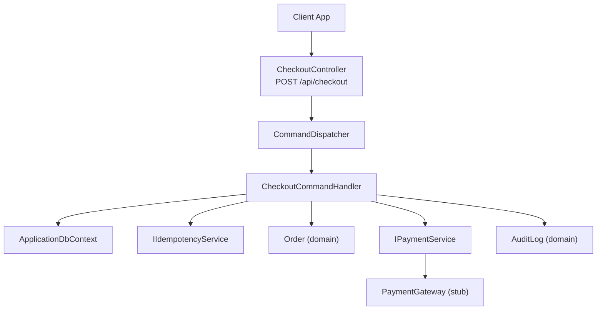
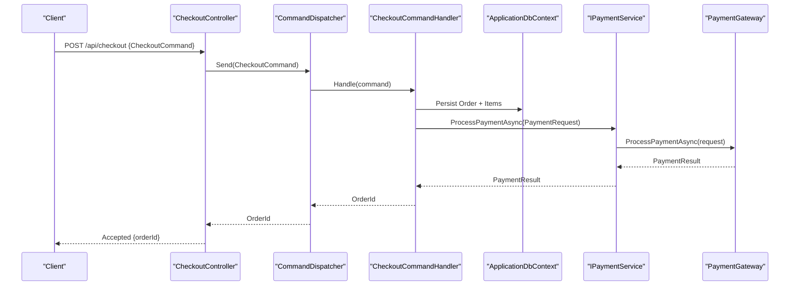
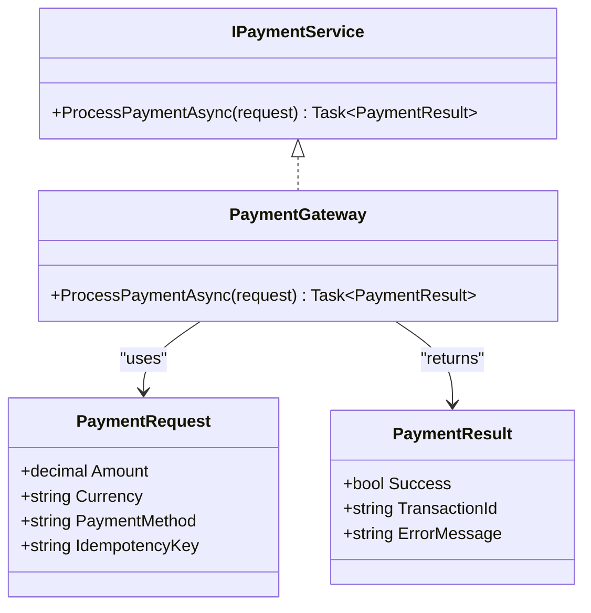
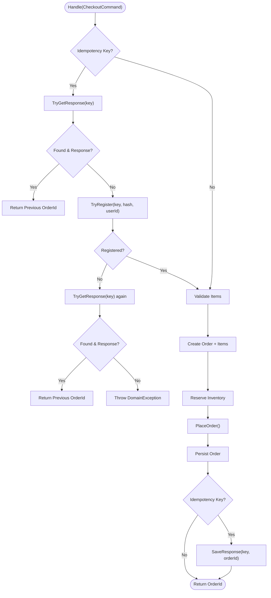
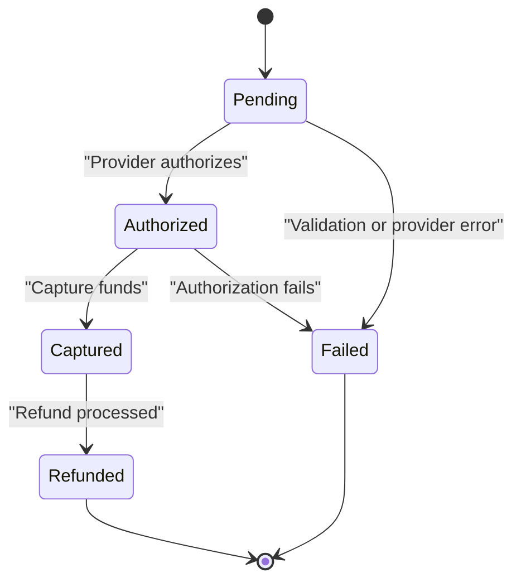
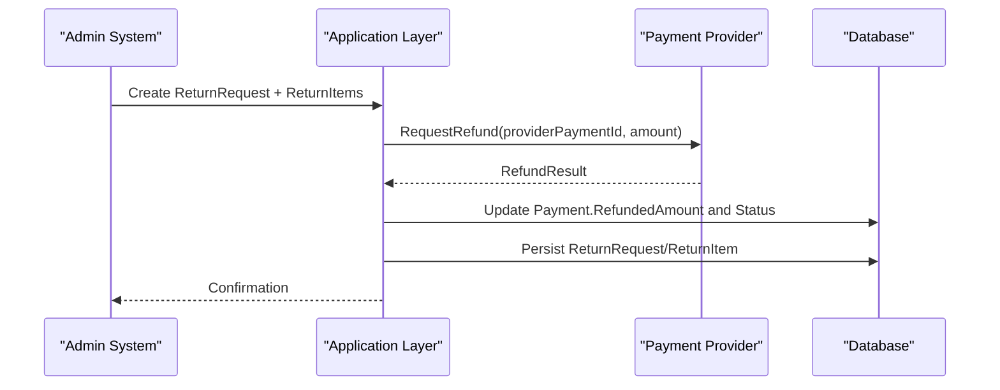
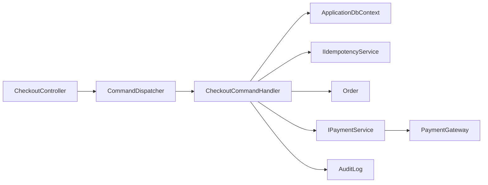

# Payment Integration

<cite>
**Referenced Files in This Document**
- [IPaymentService.cs](file://src/Ecommerce.Application/Interfaces/IPaymentService.cs)
- [PaymentGateway.cs](file://src/Ecommerce.Infrastructure/Payments/PaymentGateway.cs)
- [CheckoutController.cs](file://src/Ecommerce.Api/Controllers/CheckoutController.cs)
- [CheckoutCommand.cs](file://src/Ecommerce.Application/Commands/Checkout/CheckoutCommand.cs)
- [CheckoutCommandHandler.cs](file://src/Ecommerce.Application/Commands/Checkout/CheckoutCommandHandler.cs)
- [Order.cs](file://src/Ecommerce.Domain/Entities/Order.cs)
- [Payment.cs](file://src/Ecommerce.Domain/Entities/Payment.cs)
- [AuditLog.cs](file://src/Ecommerce.Domain/Entities/AuditLog.cs)
- [ReturnRequest.cs](file://src/Ecommerce.Domain/Entities/ReturnRequest.cs)
- [ReturnItem.cs](file://src/Ecommerce.Domain/Entities/ReturnItem.cs)
- [PaymentCompletedDomainEvent.cs](file://src/Ecommerce.Domain/DomainEvents/PaymentCompletedDomainEvent.cs)
- [CheckoutHandlerTests.cs](file://tests/Ecommerce.Application.Tests/CheckoutHandlerTests.cs)
- [CheckoutIdempotencyIntegrationTests.cs](file://tests/Ecommerce.IntegrationTests/CheckoutIdempotencyIntegrationTests.cs)
</cite>

## Table of Contents
1. Introduction
2. Project Structure
3. Core Components
4. Architecture Overview
5. Detailed Component Analysis
6. Dependency Analysis
7. Performance Considerations
8. Troubleshooting Guide
9. Conclusion
10. Appendices

## Introduction
This document explains the payment integration design and extensible gateway architecture in the e-commerce system. It covers the payment service abstraction, supported providers (via an extensible interface), transaction processing flow, payment status management, refund handling, reconciliation considerations, audit logging, security and PCI compliance guidance, and testing strategies for payment integrations.

## Project Structure
The payment-related functionality spans multiple layers:
- API layer exposes checkout endpoints that trigger order creation and orchestrate downstream steps.
- Application layer defines commands, handlers, and the payment service abstraction used by use cases.
- Domain layer models orders, payments, audit logs, and returns to represent financial state and history.
- Infrastructure layer provides a stub payment gateway implementation suitable for development and tests.

**Diagram sources**
- [CheckoutController.cs:1-27](file://src/Ecommerce.Api/Controllers/CheckoutController.cs#L1-L27)
- [CheckoutCommandHandler.cs:1-94](file://src/Ecommerce.Application/Commands/Checkout/CheckoutCommandHandler.cs#L1-L94)
- [IPaymentService.cs:1-24](file://src/Ecommerce.Application/Interfaces/IPaymentService.cs#L1-L24)
- [PaymentGateway.cs:1-24](file://src/Ecommerce.Infrastructure/Payments/PaymentGateway.cs#L1-L24)
- [Order.cs:1-105](file://src/Ecommerce.Domain/Entities/Order.cs#L1-L105)
- [AuditLog.cs:1-19](file://src/Ecommerce.Domain/Entities/AuditLog.cs#L1-L19)

**Section sources**
- [CheckoutController.cs:1-27](file://src/Ecommerce.Api/Controllers/CheckoutController.cs#L1-L27)
- [CheckoutCommandHandler.cs:1-94](file://src/Ecommerce.Application/Commands/Checkout/CheckoutCommandHandler.cs#L1-L94)
- [IPaymentService.cs:1-24](file://src/Ecommerce.Application/Interfaces/IPaymentService.cs#L1-L24)
- [PaymentGateway.cs:1-24](file://src/Ecommerce.Infrastructure/Payments/PaymentGateway.cs#L1-L24)
- [Order.cs:1-105](file://src/Ecommerce.Domain/Entities/Order.cs#L1-L105)
- [AuditLog.cs:1-19](file://src/Ecommerce.Domain/Entities/AuditLog.cs#L1-L19)

## Core Components
- Payment service abstraction: Defines a single method to process payments with idempotency support via request keys.
- Stub payment gateway: A minimal implementation returning success with a generated transaction ID for development/testing.
- Checkout command and handler: Orchestrates order creation, inventory reservation, idempotency checks, and persistence.
- Domain entities: Order tracks payment status; Payment captures provider details and lifecycle timestamps; AuditLog records changes; ReturnRequest/ReturnItem model refunds.

Key responsibilities:
- IPaymentService: Encapsulates external payment provider calls behind a stable interface.
- PaymentGateway: Placeholder implementation; replace with real provider SDKs in production.
- CheckoutCommandHandler: Ensures idempotent checkout, builds and persists orders, reserves inventory, and prepares payment context.
- Order: Maintains payment status transitions and totals.
- Payment: Stores provider-specific identifiers and lifecycle events.
- AuditLog: Provides immutable audit trail for financial actions.

**Section sources**
- [IPaymentService.cs:1-24](file://src/Ecommerce.Application/Interfaces/IPaymentService.cs#L1-L24)
- [PaymentGateway.cs:1-24](file://src/Ecommerce.Infrastructure/Payments/PaymentGateway.cs#L1-L24)
- [CheckoutCommand.cs:1-22](file://src/Ecommerce.Application/Commands/Checkout/CheckoutCommand.cs#L1-L22)
- [CheckoutCommandHandler.cs:1-94](file://src/Ecommerce.Application/Commands/Checkout/CheckoutCommandHandler.cs#L1-L94)
- [Order.cs:1-105](file://src/Ecommerce.Domain/Entities/Order.cs#L1-L105)
- [Payment.cs:1-22](file://src/Ecommerce.Domain/Entities/Payment.cs#L1-L22)
- [AuditLog.cs:1-19](file://src/Ecommerce.Domain/Entities/AuditLog.cs#L1-L19)
- [ReturnRequest.cs:1-18](file://src/Ecommerce.Domain/Entities/ReturnRequest.cs#L1-L18)
- [ReturnItem.cs:1-14](file://src/Ecommerce.Domain/Entities/ReturnItem.cs#L1-L14)

## Architecture Overview
The system uses a layered architecture with clear separation of concerns:
- API layer receives checkout requests and delegates to application commands.
- Application layer enforces business rules, idempotency, and orchestrates domain operations.
- Domain layer encapsulates financial state and invariants.
- Infrastructure layer implements external integrations such as payment gateways.

**Diagram sources**
- [CheckoutController.cs:1-27](file://src/Ecommerce.Api/Controllers/CheckoutController.cs#L1-L27)
- [CheckoutCommandHandler.cs:1-94](file://src/Ecommerce.Application/Commands/Checkout/CheckoutCommandHandler.cs#L1-L94)
- [IPaymentService.cs:1-24](file://src/Ecommerce.Application/Interfaces/IPaymentService.cs#L1-L24)
- [PaymentGateway.cs:1-24](file://src/Ecommerce.Infrastructure/Payments/PaymentGateway.cs#L1-L24)

## Detailed Component Analysis

### Payment Service Abstraction and Extensibility
- The payment service is defined as an interface with a single async method accepting a payment request and returning a result.
- The request includes amount, currency, payment method, and idempotency key to prevent duplicate charges.
- The result indicates success/failure, a provider transaction ID, and optional error message.
- The current infrastructure provides a stub implementation that always succeeds and generates a transaction ID. Replace this with a real provider integration (e.g., Stripe, PayPal, Adyen) while preserving the same interface contract.

**Diagram sources**
- [IPaymentService.cs:1-24](file://src/Ecommerce.Application/Interfaces/IPaymentService.cs#L1-L24)
- [PaymentGateway.cs:1-24](file://src/Ecommerce.Infrastructure/Payments/PaymentGateway.cs#L1-L24)

**Section sources**
- [IPaymentService.cs:1-24](file://src/Ecommerce.Application/Interfaces/IPaymentService.cs#L1-L24)
- [PaymentGateway.cs:1-24](file://src/Ecommerce.Infrastructure/Payments/PaymentGateway.cs#L1-L24)

### Checkout Flow and Idempotency
- The checkout endpoint accepts a command containing user, items, currency, shipping address, and optional idempotency key.
- The handler validates input, ensures at least one item, performs idempotency checks when provided, creates an order, reserves inventory, persists changes, and returns the order ID.
- Idempotency prevents duplicate orders and payments when clients retry requests.

**Diagram sources**
- [CheckoutCommandHandler.cs:1-94](file://src/Ecommerce.Application/Commands/Checkout/CheckoutCommandHandler.cs#L1-L94)
- [CheckoutCommand.cs:1-22](file://src/Ecommerce.Application/Commands/Checkout/CheckoutCommand.cs#L1-L22)

**Section sources**
- [CheckoutCommandHandler.cs:1-94](file://src/Ecommerce.Application/Commands/Checkout/CheckoutCommandHandler.cs#L1-L94)
- [CheckoutCommand.cs:1-22](file://src/Ecommerce.Application/Commands/Checkout/CheckoutCommand.cs#L1-L22)

### Payment Status Management
- Orders maintain a payment status field initialized to pending upon placement.
- Payments entity stores provider details, amounts, currencies, statuses, and lifecycle timestamps (authorized, captured, failed).
- Payment completion can be represented via a domain event carrying payment and order identifiers.

**Diagram sources**
- [Order.cs:1-105](file://src/Ecommerce.Domain/Entities/Order.cs#L1-L105)
- [Payment.cs:1-22](file://src/Ecommerce.Domain/Entities/Payment.cs#L1-L22)
- [PaymentCompletedDomainEvent.cs:1-18](file://src/Ecommerce.Domain/DomainEvents/PaymentCompletedDomainEvent.cs#L1-L18)

**Section sources**
- [Order.cs:1-105](file://src/Ecommerce.Domain/Entities/Order.cs#L1-L105)
- [Payment.cs:1-22](file://src/Ecommerce.Domain/Entities/Payment.cs#L1-L22)
- [PaymentCompletedDomainEvent.cs:1-18](file://src/Ecommerce.Domain/DomainEvents/PaymentCompletedDomainEvent.cs#L1-L18)

### Refund Processing
- Refunds are modeled through return requests and return items, capturing quantities, conditions, and refund amounts per line item.
- In production, integrate with the payment provider’s refund API using the original provider payment ID stored on the Payment entity.
- Ensure idempotency for refund operations and reconcile outcomes back to the order’s refunded amount and payment status.

[No diagram sources needed since this diagram shows conceptual workflow, not actual code structure]

**Section sources**
- [ReturnRequest.cs:1-18](file://src/Ecommerce.Domain/Entities/ReturnRequest.cs#L1-L18)
- [ReturnItem.cs:1-14](file://src/Ecommerce.Domain/Entities/ReturnItem.cs#L1-L14)
- [Payment.cs:1-22](file://src/Ecommerce.Domain/Entities/Payment.cs#L1-L22)

### Audit Logging for Financial Transactions
- AuditLog entity captures action type, affected entity name and ID, old/new values, and contextual metadata like IP address and user agent.
- Use audit logs to record payment initiation, capture, failure, and refund events for compliance and traceability.

**Section sources**
- [AuditLog.cs:1-19](file://src/Ecommerce.Domain/Entities/AuditLog.cs#L1-L19)

## Dependency Analysis
The checkout flow depends on several components:
- API controller depends on command dispatcher.
- Command handler depends on database context, idempotency service, and domain entities.
- Payment service abstraction decouples the handler from specific provider implementations.
- Domain entities encapsulate financial state and relationships.

**Diagram sources**
- [CheckoutController.cs:1-27](file://src/Ecommerce.Api/Controllers/CheckoutController.cs#L1-L27)
- [CheckoutCommandHandler.cs:1-94](file://src/Ecommerce.Application/Commands/Checkout/CheckoutCommandHandler.cs#L1-L94)
- [IPaymentService.cs:1-24](file://src/Ecommerce.Application/Interfaces/IPaymentService.cs#L1-L24)
- [PaymentGateway.cs:1-24](file://src/Ecommerce.Infrastructure/Payments/PaymentGateway.cs#L1-L24)
- [Order.cs:1-105](file://src/Ecommerce.Domain/Entities/Order.cs#L1-L105)
- [AuditLog.cs:1-19](file://src/Ecommerce.Domain/Entities/AuditLog.cs#L1-L19)

**Section sources**
- [CheckoutController.cs:1-27](file://src/Ecommerce.Api/Controllers/CheckoutController.cs#L1-L27)
- [CheckoutCommandHandler.cs:1-94](file://src/Ecommerce.Application/Commands/Checkout/CheckoutCommandHandler.cs#L1-L94)
- [IPaymentService.cs:1-24](file://src/Ecommerce.Application/Interfaces/IPaymentService.cs#L1-L24)
- [PaymentGateway.cs:1-24](file://src/Ecommerce.Infrastructure/Payments/PaymentGateway.cs#L1-L24)
- [Order.cs:1-105](file://src/Ecommerce.Domain/Entities/Order.cs#L1-L105)
- [AuditLog.cs:1-19](file://src/Ecommerce.Domain/Entities/AuditLog.cs#L1-L19)

## Performance Considerations
- Use idempotency keys to avoid duplicate charges and redundant processing under retries.
- Keep database transactions short and focused around order creation and inventory reservation; perform external payment calls outside long-running transactions where possible.
- Prefer asynchronous I/O for all external calls and database operations.
- Index frequently queried fields such as provider payment IDs and order numbers to speed up reconciliation and lookups.

[No sources needed since this section provides general guidance]

## Troubleshooting Guide
Common issues and mitigations:
- Duplicate checkout submissions: Ensure idempotency keys are used and validated; handle “already in flight” scenarios gracefully.
- Inventory conflicts: Validate stock availability before placing orders; reserve inventory within a transaction boundary to prevent overselling.
- Payment failures: Capture provider error messages and update payment status accordingly; log detailed audit entries for investigation.
- Reconciliation mismatches: Compare provider transaction IDs with local records; investigate missing or partial updates.

Operational tips:
- Log both successes and failures with correlation IDs linking client requests, orders, and payments.
- Implement retry policies with exponential backoff for transient provider errors.
- Monitor idempotency store health to ensure reliable deduplication.

**Section sources**
- [CheckoutCommandHandler.cs:1-94](file://src/Ecommerce.Application/Commands/Checkout/CheckoutCommandHandler.cs#L1-L94)
- [PaymentGateway.cs:1-24](file://src/Ecommerce.Infrastructure/Payments/PaymentGateway.cs#L1-L24)
- [AuditLog.cs:1-19](file://src/Ecommerce.Domain/Entities/AuditLog.cs#L1-L19)

## Conclusion
The payment integration leverages a clean abstraction over external providers, enabling easy replacement and extension. The checkout flow emphasizes idempotency, robust domain modeling, and auditability. While the current gateway is a stub, the design supports integrating real providers with minimal changes. Refund and reconciliation processes are grounded in domain entities and can be extended to meet operational needs. Security and PCI compliance should guide implementation details for sensitive data handling and network communication.

[No sources needed since this section summarizes without analyzing specific files]

## Appendices

### Implementing a Custom Payment Provider
Steps:
- Implement IPaymentService with your provider’s SDK.
- Map PaymentRequest fields to provider-specific payloads.
- Handle success, failure, and idempotency semantics consistently.
- Store provider transaction IDs and statuses in the Payment entity.
- Emit domain events or update order payment status as appropriate.

**Section sources**
- [IPaymentService.cs:1-24](file://src/Ecommerce.Application/Interfaces/IPaymentService.cs#L1-L24)
- [PaymentGateway.cs:1-24](file://src/Ecommerce.Infrastructure/Payments/PaymentGateway.cs#L1-L24)
- [Payment.cs:1-22](file://src/Ecommerce.Domain/Entities/Payment.cs#L1-L22)

### Handling Payment Callbacks
- Verify webhook signatures and enforce strict validation.
- Use idempotency to handle duplicate callbacks.
- Update Payment and Order states based on callback payloads.
- Log all callback processing for audit and debugging.

[No sources needed since this section provides general guidance]

### Managing Payment Failures
- Record failure reasons and timestamps in Payment.
- Notify relevant systems and users about failures.
- Provide mechanisms to retry or cancel payments.
- Maintain complete audit trails for compliance.

**Section sources**
- [Payment.cs:1-22](file://src/Ecommerce.Domain/Entities/Payment.cs#L1-L22)
- [AuditLog.cs:1-19](file://src/Ecommerce.Domain/Entities/AuditLog.cs#L1-L19)

### Security and PCI Compliance
- Do not store raw cardholder data; rely on tokenization provided by payment providers.
- Enforce TLS for all communications with providers.
- Restrict access to payment-related services and logs; mask sensitive information.
- Follow PCI DSS requirements for secure development, storage, and transmission of payment data.

[No sources needed since this section provides general guidance]

### Testing Strategies
- Unit tests for command handlers validate order creation and inventory reservation.
- Integration tests verify idempotency behavior end-to-end with in-memory databases.
- Mock IPaymentService to simulate provider responses and edge cases.
- Assert domain invariants and state transitions after each operation.

**Section sources**
- [CheckoutHandlerTests.cs:1-57](file://tests/Ecommerce.Application.Tests/CheckoutHandlerTests.cs#L1-L57)
- [CheckoutIdempotencyIntegrationTests.cs:1-40](file://tests/Ecommerce.IntegrationTests/CheckoutIdempotencyIntegrationTests.cs#L1-L40)